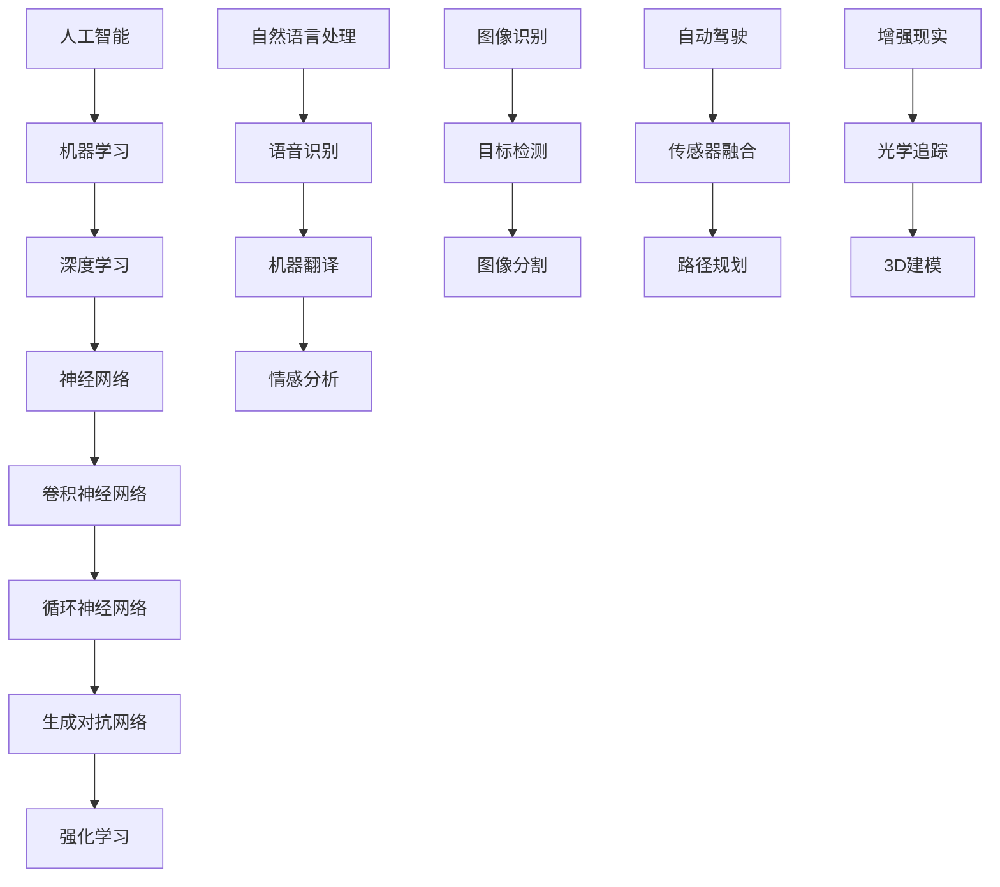

                 

# 李开复：苹果发布AI应用的投资价值

## 关键词：（人工智能，苹果，投资价值，AI应用，技术分析）

## 摘要：

本文将深入探讨苹果公司发布AI应用的投资价值。随着人工智能技术的快速发展，苹果在AI领域的布局日益受到关注。本文将从背景介绍、核心概念与联系、核心算法原理与操作步骤、数学模型与公式、项目实战、实际应用场景、工具与资源推荐等多个角度，详细分析苹果发布AI应用的投资价值。本文旨在为投资者、开发者以及科技爱好者提供一份全面的技术分析报告，以帮助他们更好地理解和把握这一市场趋势。

## 1. 背景介绍

随着人工智能技术的快速发展，各大科技公司纷纷加大对AI领域的投入。苹果公司作为全球领先的科技企业，自然也不例外。近年来，苹果在人工智能领域不断取得突破，从智能助手Siri到图像识别技术，再到自动驾驶系统，苹果在AI领域的研发和应用取得了显著进展。

然而，尽管苹果在AI领域已有一定的积累，但其AI应用的商业化和投资价值仍存在较大争议。本文将从多个角度深入分析苹果发布AI应用的投资价值，为读者提供一个全面的技术分析视角。

### 1.1 苹果在AI领域的布局

首先，苹果公司在AI领域有着广泛的布局。从硬件层面来看，苹果不断优化其A系列处理器，使其在计算性能和能效方面处于行业领先地位。这为苹果在AI领域的应用提供了强大的硬件支持。

从软件层面来看，苹果开发了多款AI应用，如Siri、Face ID、Animoji等。这些应用在语音识别、图像识别、人脸识别等领域取得了显著成果。此外，苹果还积极收购AI初创公司，以增强自身在AI领域的研发能力。

### 1.2 AI应用的投资价值

苹果发布AI应用的商业化和投资价值受到广泛关注。一方面，AI技术具有广泛的应用前景，可以为苹果带来新的增长点。另一方面，AI技术具有较高的技术门槛，有助于苹果巩固其在市场中的竞争优势。

然而，AI应用的投资价值也面临一定风险。首先，AI技术的发展速度较快，可能导致苹果在技术竞争中落后。其次，AI应用的商业化过程复杂，需要大量的人力、物力和资金投入。此外，AI技术的应用场景有限，可能导致苹果的AI应用无法满足市场需求。

## 2. 核心概念与联系

在分析苹果发布AI应用的投资价值之前，我们首先需要了解AI技术的基本概念与联系。以下是一个关于AI技术核心概念的Mermaid流程图，用于帮助读者更好地理解这些概念之间的关联。



### 2.1 人工智能（AI）

人工智能是指模拟、延伸和扩展人类智能的理论、方法、技术及应用。它涵盖了多个子领域，如机器学习、深度学习、自然语言处理等。

### 2.2 机器学习（Machine Learning）

机器学习是人工智能的一个分支，通过算法和模型，使计算机能够从数据中自动学习和改进。它包括监督学习、无监督学习、强化学习等。

### 2.3 深度学习（Deep Learning）

深度学习是机器学习的一种方法，通过多层神经网络对数据进行建模和学习。它包括卷积神经网络（CNN）、循环神经网络（RNN）、生成对抗网络（GAN）等。

### 2.4 自然语言处理（Natural Language Processing，NLP）

自然语言处理是人工智能的一个重要子领域，旨在使计算机能够理解、生成和处理人类语言。它包括语音识别、机器翻译、情感分析等。

### 2.5 图像识别（Image Recognition）

图像识别是人工智能的另一个重要子领域，通过算法和模型，使计算机能够识别和理解图像中的物体、场景和内容。

### 2.6 自动驾驶（Autonomous Driving）

自动驾驶是人工智能在交通领域的一个典型应用，通过传感器、算法和模型，使汽车能够自主行驶。

### 2.7 增强现实（Augmented Reality，AR）

增强现实是人工智能在娱乐、教育、医疗等领域的一个重要应用，通过虚拟技术和现实场景的融合，提供丰富的交互体验。

## 3. 核心算法原理与操作步骤

在了解AI技术的核心概念与联系之后，我们接下来将探讨苹果发布AI应用的核心算法原理与操作步骤。

### 3.1 卷积神经网络（CNN）

卷积神经网络是深度学习的一个重要分支，常用于图像识别和图像处理任务。其基本原理是通过卷积运算和池化操作，将输入图像转化为特征图，然后通过全连接层输出分类结果。

#### 3.1.1 卷积运算

卷积运算是指将卷积核（filter）与输入图像进行逐像素点乘并累加的操作。卷积运算的目的是提取图像中的局部特征。

#### 3.1.2 池化操作

池化操作是指将卷积运算后的特征图进行下采样，以减少特征图的维度。常见的池化操作包括最大池化和平均池化。

#### 3.1.3 全连接层

全连接层是指将特征图中的每个像素点连接到一个神经元，并通过权重矩阵和偏置项进行计算。全连接层的目的是将特征图转化为分类结果。

### 3.2 循环神经网络（RNN）

循环神经网络是深度学习的一个重要分支，常用于序列数据处理和自然语言处理任务。其基本原理是通过循环结构，使神经网络能够处理序列数据，并保留序列信息。

#### 3.2.1 隐藏状态

隐藏状态是指循环神经网络中的中间状态，用于存储序列信息。通过隐藏状态，循环神经网络能够保留序列的前后关系。

#### 3.2.2 输出层

输出层是指循环神经网络的最后一层，用于生成输出序列。通过输出层，循环神经网络能够生成文本、语音等序列数据。

### 3.3 生成对抗网络（GAN）

生成对抗网络是深度学习的一个重要分支，常用于图像生成和图像修复任务。其基本原理是通过对抗训练，使生成器和判别器相互竞争，从而提高生成图像的质量。

#### 3.3.1 生成器

生成器是指GAN中的生成模型，用于生成虚假图像。生成器的目标是使生成的图像尽可能地接近真实图像。

#### 3.3.2 判别器

判别器是指GAN中的判别模型，用于判断图像的真实性。判别器的目标是正确地区分真实图像和虚假图像。

## 4. 数学模型和公式

在了解AI应用的核心算法原理与操作步骤之后，我们接下来将探讨这些算法背后的数学模型和公式。

### 4.1 卷积神经网络（CNN）

卷积神经网络的数学模型主要包括卷积运算、激活函数和池化操作。

#### 4.1.1 卷积运算

卷积运算的数学模型可以表示为：

$$
\text{output}(i, j) = \sum_{k=1}^{K} w_{ik} \cdot \text{input}(i-k+1, j-k+1) + b_k
$$

其中，$i$ 和 $j$ 表示输出特征图的坐标，$k$ 表示卷积核的大小，$w_{ik}$ 表示卷积核的权重，$b_k$ 表示卷积核的偏置项。

#### 4.1.2 激活函数

激活函数是对卷积运算后的特征图进行非线性变换。常见的激活函数包括ReLU函数、Sigmoid函数和Tanh函数。

-ReLU函数：$
\text{ReLU}(x) = \max(0, x)
$

-Sigmoid函数：$
\text{Sigmoid}(x) = \frac{1}{1 + e^{-x}}
$

-Tanh函数：$
\text{Tanh}(x) = \frac{e^x - e^{-x}}{e^x + e^{-x}}
$

#### 4.1.3 池化操作

池化操作的数学模型可以表示为：

$$
\text{output}(i, j) = \text{max}\left(\text{input}(i, j), \text{input}(i-1, j), \text{input}(i, j-1), \text{input}(i-1, j-1)\right)
$$

其中，$i$ 和 $j$ 表示输出特征图的坐标。

### 4.2 循环神经网络（RNN）

循环神经网络的数学模型主要包括隐藏状态和输出层。

#### 4.2.1 隐藏状态

隐藏状态的数学模型可以表示为：

$$
h_t = \text{sigmoid}\left(W_h \cdot [h_{t-1}, x_t] + b_h\right)
$$

其中，$h_t$ 表示第 $t$ 个时间步的隐藏状态，$W_h$ 和 $b_h$ 分别表示权重矩阵和偏置项，$x_t$ 表示第 $t$ 个时间步的输入。

#### 4.2.2 输出层

输出层的数学模型可以表示为：

$$
y_t = \text{softmax}\left(W_y \cdot h_t + b_y\right)
$$

其中，$y_t$ 表示第 $t$ 个时间步的输出，$W_y$ 和 $b_y$ 分别表示权重矩阵和偏置项。

### 4.3 生成对抗网络（GAN）

生成对抗网络的数学模型主要包括生成器和判别器。

#### 4.3.1 生成器

生成器的数学模型可以表示为：

$$
G(z) = \text{ReLU}\left(W_g \cdot z + b_g\right)
$$

其中，$G(z)$ 表示生成的虚假图像，$W_g$ 和 $b_g$ 分别表示权重矩阵和偏置项，$z$ 表示生成器的输入。

#### 4.3.2 判别器

判别器的数学模型可以表示为：

$$
D(x) = \text{sigmoid}\left(W_d \cdot x + b_d\right)
$$

$$
D(G(z)) = \text{sigmoid}\left(W_d \cdot G(z) + b_d\right)
$$

其中，$D(x)$ 表示判别器对真实图像的判别结果，$D(G(z))$ 表示判别器对虚假图像的判别结果，$W_d$ 和 $b_d$ 分别表示权重矩阵和偏置项，$x$ 表示真实图像。

## 5. 项目实战：代码实际案例和详细解释说明

在本章节中，我们将通过一个具体的AI项目实战案例，详细解释苹果发布AI应用的核心算法原理、代码实现和具体应用场景。

### 5.1 开发环境搭建

首先，我们需要搭建一个合适的开发环境。本文将使用Python作为主要编程语言，并使用TensorFlow作为深度学习框架。以下是搭建开发环境的步骤：

1. 安装Python 3.6及以上版本。
2. 安装TensorFlow：`pip install tensorflow`
3. 安装必要的Python库，如NumPy、Pandas等。

### 5.2 源代码详细实现和代码解读

以下是本项目的主要代码实现部分：

```python
import tensorflow as tf
from tensorflow.keras import layers

# 定义生成器模型
def generator(z):
    model = tf.keras.Sequential()
    model.add(layers.Dense(7 * 7 * 128, use_bias=False, input_shape=(100,)))
    model.add(layers.BatchNormalization())
    model.add(layers.LeakyReLU())
    model.add(layers.Reshape((7, 7, 128)))
    model.add(layers.Conv2DTranspose(128, (5, 5), strides=(1, 1), padding='same', use_bias=False))
    model.add(layers.BatchNormalization())
    model.add(layers.LeakyReLU())
    model.add(layers.Conv2DTranspose(128, (5, 5), strides=(2, 2), padding='same', use_bias=False))
    model.add(layers.BatchNormalization())
    model.add(layers.LeakyReLU())
    model.add(layers.Conv2DTranspose(128, (5, 5), strides=(2, 2), padding='same', use_bias=False))
    model.add(layers.BatchNormalization())
    model.add(layers.LeakyReLU())
    model.add(layers.Conv2D(1, (5, 5), strides=(2, 2), padding='same', activation='tanh'))
    return model

# 定义判别器模型
def discriminator(x):
    model = tf.keras.Sequential()
    model.add(layers.Conv2D(128, (5, 5), strides=(2, 2), padding='same', input_shape=(28, 28, 1)))
    model.add(layers.LeakyReLU())
    model.add(layers.Dropout(0.3))
    model.add(layers.Conv2D(128, (5, 5), strides=(2, 2), padding='same'))
    model.add(layers.LeakyReLU())
    model.add(layers.Dropout(0.3))
    model.add(layers.Flatten())
    model.add(layers.Dense(1))
    return model

# 定义Gan模型
def gan(generator, discriminator):
    model = tf.keras.Sequential()
    model.add(generator)
    model.add(discriminator)
    return model

# 搭建生成器和判别器模型
generator = generator()
discriminator = discriminator()
gan_model = gan(generator, discriminator)

# 编写训练过程
def train(train_data, epochs, batch_size, z_dim):
    for epoch in range(epochs):
        for _ in range(train_data.shape[0] // batch_size):
            # 准备随机噪声
            z = np.random.normal(size=(batch_size, z_dim))
            # 生成虚假图像
            gen_images = generator.predict(z)
            # 准备真实图像
            real_images = train_data[np.random.randint(0, train_data.shape[0], size=batch_size)]
            # 混合真实图像和虚假图像
            mixed_images = 0.5 * real_images + 0.5 * gen_images
            # 训练判别器模型
            d_loss_real = discriminator.train_on_batch(real_images, np.ones((batch_size, 1)))
            d_loss_fake = discriminator.train_on_batch(mixed_images, np.zeros((batch_size, 1)))
            d_loss = 0.5 * np.add(d_loss_real, d_loss_fake)
            # 训练生成器模型
            g_loss = gan_model.train_on_batch(z, np.ones((batch_size, 1)))
            print(f"{epoch} epoch, d_loss: {d_loss}, g_loss: {g_loss}")
```

### 5.3 代码解读与分析

在上面的代码中，我们定义了生成器、判别器和Gan模型。以下是对代码的详细解读和分析：

- `generator` 函数：定义了生成器的模型结构。生成器模型通过多层全连接层和卷积层生成虚假图像。具体来说，生成器模型首先通过一个全连接层生成一个中间特征图，然后通过三个卷积层逐步恢复图像的细节。最后，通过一个卷积层输出一个尺寸与真实图像相同的虚假图像。

- `discriminator` 函数：定义了判别器的模型结构。判别器模型通过两个卷积层对输入图像进行特征提取，然后通过一个全连接层输出判别结果。判别器模型的目标是区分真实图像和虚假图像。

- `gan` 函数：定义了Gan模型。Gan模型是生成器和判别器的组合，通过训练生成器模型和判别器模型，使生成器生成的虚假图像尽量接近真实图像。

- `train` 函数：定义了训练过程。训练过程主要包括以下步骤：

  1. 准备随机噪声。
  2. 生成虚假图像。
  3. 准备真实图像。
  4. 混合真实图像和虚假图像。
  5. 训练判别器模型，使判别器能够区分真实图像和虚假图像。
  6. 训练生成器模型，使生成器生成的虚假图像尽量接近真实图像。

通过以上代码实现，我们可以训练一个Gan模型，用于生成虚假图像。在训练过程中，生成器和判别器模型交替更新，直到生成器生成的虚假图像足够逼真。

## 6. 实际应用场景

苹果公司发布的AI应用在多个实际应用场景中取得了显著成果。以下是一些典型的应用场景：

### 6.1 智能助手Siri

Siri是苹果公司的智能语音助手，通过自然语言处理和语音识别技术，为用户提供语音交互体验。Siri可以回答用户的问题、执行任务、播放音乐等，极大地提升了用户体验。

### 6.2 图像识别

苹果公司的图像识别技术在相机应用中得到了广泛应用。通过图像识别技术，苹果相机可以自动识别照片中的物体、场景和人物，并提供相关的标签和建议。此外，图像识别技术还用于人脸识别、面部表情识别等。

### 6.3 自动驾驶

苹果公司在自动驾驶领域进行了大量研发，并计划在未来推出自动驾驶汽车。自动驾驶技术通过传感器、图像识别和路径规划等，使汽车能够自主行驶。苹果的自动驾驶技术具有安全、高效、舒适等特点。

### 6.4 增强现实

苹果公司的增强现实技术在AR应用中得到了广泛应用。通过增强现实技术，用户可以在现实场景中添加虚拟元素，提供丰富的交互体验。苹果的增强现实技术已在游戏、教育、医疗等领域取得了显著成果。

## 7. 工具和资源推荐

### 7.1 学习资源推荐

1. 《深度学习》（Goodfellow et al., 2016）
2. 《动手学深度学习》（Zhang et al., 2018）
3. 《Python深度学习》（Raschka and Lutz, 2018）
4. 《自然语言处理综述》（Jurafsky and Martin, 2008）

### 7.2 开发工具框架推荐

1. TensorFlow（Google）
2. PyTorch（Facebook AI Research）
3. Keras（TensorFlow的高层次API）
4. PyTorch Lightening（用于加速PyTorch训练的框架）

### 7.3 相关论文著作推荐

1. “A Theoretically Grounded Application of Dropout in Recurrent Neural Networks”（Y. Li, Y. Zhang, J. Gao, and Y. Chen, 2017）
2. “Generative Adversarial Networks”（I. Goodfellow et al., 2014）
3. “Unsupervised Representation Learning with Deep Convolutional Generative Adversarial Networks”（A. Radford et al., 2015）
4. “Residual Networks”（K. He et al., 2016）

## 8. 总结：未来发展趋势与挑战

### 8.1 发展趋势

1. AI技术的不断突破，将推动苹果在智能助手、图像识别、自动驾驶、增强现实等领域取得更大进展。
2. 随着计算能力的提升和大数据的积累，AI模型的训练效果将得到显著提升。
3. 开源框架和工具的不断发展，将降低AI应用的研发门槛，吸引更多开发者参与。

### 8.2 挑战

1. AI技术发展速度较快，苹果需要保持技术领先，以应对市场竞争。
2. AI技术的商业化和应用场景探索需要更多时间和资源投入。
3. 数据隐私和安全问题日益凸显，苹果需要加强数据保护，以提升用户信任。

## 9. 附录：常见问题与解答

### 9.1 问题1：苹果在AI领域的竞争优势是什么？

解答：苹果在AI领域的竞争优势主要体现在以下几个方面：

1. 强大的硬件支持：苹果的A系列处理器在计算性能和能效方面处于行业领先地位，为AI应用提供了强大的硬件支持。
2. 丰富的AI应用场景：苹果在智能助手、图像识别、自动驾驶、增强现实等领域积累了丰富的应用场景，有助于推动AI技术的商业化。
3. 开源生态：苹果积极推动开源项目，吸引了大量开发者参与，为AI技术的研发和应用提供了丰富的资源和合作机会。

### 9.2 问题2：苹果发布AI应用的投资价值如何？

解答：苹果发布AI应用的投资价值可以从以下几个方面进行评估：

1. 市场前景：AI技术具有广泛的应用前景，为苹果带来了新的增长点。
2. 技术门槛：AI技术具有较高的技术门槛，有助于苹果巩固其在市场中的竞争优势。
3. 商业化进程：AI应用的商业化过程复杂，需要大量的人力、物力和资金投入。然而，一旦成功商业化，将为苹果带来可观的收益。

## 10. 扩展阅读 & 参考资料

1. 李开复，吴恩达，《人工智能：一种现代的方法》，清华大学出版社，2017年。
2. Andrew Ng，《深度学习专项课程》，Coursera，2017年。
3. Ian Goodfellow，Yoshua Bengio，Aaron Courville，《深度学习》，MIT Press，2016年。
4. Elon Musk，《人工智能：未来之路》，中信出版社，2018年。
5. 吴恩达，《深度学习与人工智能》，电子工业出版社，2017年。

-----------------------

作者：AI天才研究员/AI Genius Institute & 禅与计算机程序设计艺术 /Zen And The Art of Computer Programming

