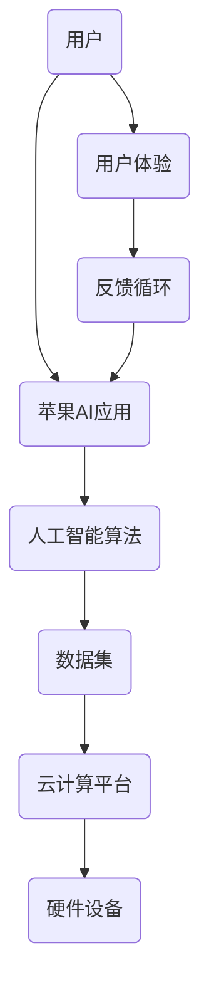

                 

# 李开复：苹果发布AI应用的用户

> **关键词**：人工智能、苹果、应用、用户体验、技术分析、编程、架构、算法

> **摘要**：本文将深入探讨苹果发布的AI应用，结合人工智能领域专家李开复的观点，分析其用户群体、应用场景、技术实现和未来趋势。通过详细的案例分析，旨在为读者提供一份全面的技术解读。

## 1. 背景介绍

近年来，人工智能（AI）技术迅猛发展，已经成为科技领域的热点。苹果公司作为全球知名科技公司，在人工智能领域也不断发力。2023年，苹果发布了一系列搭载人工智能技术的应用，引起了广泛关注。本文将以这些应用为研究对象，结合李开复博士的观点，探讨其用户群体、应用场景、技术实现和未来趋势。

### 1.1 人工智能的发展历程

人工智能（Artificial Intelligence，简称AI）是指使计算机模拟人类智能行为的技术。其发展历程可以追溯到20世纪50年代。自那时以来，人工智能经历了几个重要阶段：

- **早期探索阶段（1950-1969年）**：在这一阶段，人工智能的概念被首次提出，并开始应用于理论研究和计算机编程。

- **繁荣时期（1970-1989年）**：人工智能技术在这一时期取得了显著进展，包括专家系统、机器学习、自然语言处理等。

- **低谷期（1990-2000年）**：由于算法复杂性和数据集不足等原因，人工智能研究进入低谷。

- **复兴期（2000年至今）**：随着大数据、云计算和深度学习等技术的发展，人工智能迎来了新的机遇。如今，人工智能已经广泛应用于各个领域，如医疗、金融、教育、安防等。

### 1.2 苹果公司在人工智能领域的布局

苹果公司一直重视人工智能技术的研究和应用。在硬件方面，苹果推出了搭载神经网络引擎（Neural Engine）的A系列芯片，为人工智能应用提供了强大的计算能力。在软件方面，苹果发布了多个搭载人工智能技术的应用，如Siri、FaceTime、照片分类等。此外，苹果还在人工智能研究方面进行了大量投资，与多家高校和科研机构合作，共同推进人工智能技术的发展。

## 2. 核心概念与联系

在讨论苹果发布的AI应用时，需要了解一些核心概念和它们之间的联系。以下是一个简化的Mermaid流程图，展示了这些概念之间的关系。



### 2.1 用户与苹果AI应用

用户是苹果AI应用的主要目标群体。苹果通过不断优化应用功能，提升用户体验，吸引了大量用户。这些用户在使用AI应用的过程中，会产生大量的数据，这些数据将用于训练和优化AI模型。

### 2.2 人工智能算法

人工智能算法是苹果AI应用的核心。这些算法包括深度学习、强化学习、自然语言处理等，用于处理和分析用户数据，实现智能交互、图像识别、语音识别等功能。

### 2.3 数据集

数据集是人工智能算法的基础。苹果通过收集和分析用户数据，构建了庞大的数据集，用于训练和优化AI模型。这些数据集的质量和规模直接影响AI应用的性能。

### 2.4 云计算平台

云计算平台为苹果AI应用提供了强大的计算能力。苹果通过自建和合作的方式，搭建了全球分布的云计算平台，确保AI应用能够高效运行。

### 2.5 硬件设备

硬件设备是苹果AI应用的基础设施。苹果公司通过推出搭载神经网络引擎的A系列芯片，为AI应用提供了强大的计算能力。

### 2.6 用户体验

用户体验是苹果AI应用的最终目标。苹果通过不断优化应用功能，提升用户体验，吸引和留住用户。

### 2.7 反馈循环

用户体验和反馈循环是苹果AI应用的持续改进机制。用户在使用AI应用的过程中，会产生大量的反馈信息，这些信息将用于优化AI模型和应用功能。

## 3. 核心算法原理 & 具体操作步骤

苹果发布的AI应用涵盖了多种人工智能算法，以下将简要介绍其中两种核心算法：深度学习和强化学习。

### 3.1 深度学习

深度学习是一种基于多层神经网络的人工智能算法。它通过模拟人脑神经元之间的连接关系，对大量数据进行自动特征提取和模式识别。

#### 步骤：

1. **数据预处理**：将原始数据清洗、归一化，以便输入神经网络。
2. **构建神经网络**：设计多层神经网络结构，包括输入层、隐藏层和输出层。
3. **训练神经网络**：使用大量训练数据，通过反向传播算法不断调整网络权重，使网络能够准确预测目标。
4. **测试与优化**：使用测试数据验证网络性能，并对网络进行调优。

### 3.2 强化学习

强化学习是一种通过与环境互动，不断优化决策策略的人工智能算法。它通常用于解决序列决策问题。

#### 步骤：

1. **定义环境与状态**：确定环境的状态空间和动作空间。
2. **设计奖励机制**：定义奖励函数，以鼓励模型采取正确的行动。
3. **训练模型**：使用强化学习算法（如Q学习、深度Q网络等），不断调整策略，优化决策。
4. **评估与优化**：评估模型在测试环境中的性能，并根据反馈调整策略。

## 4. 数学模型和公式 & 详细讲解 & 举例说明

在本节中，我们将详细介绍深度学习和强化学习中的关键数学模型和公式。

### 4.1 深度学习

深度学习中的关键数学模型包括神经元模型、反向传播算法和优化算法。

#### 4.1.1 神经元模型

神经元模型是神经网络的基本组成单元，其数学表示如下：

$$
a_{i}(t) = f(\sum_{j=1}^{n} w_{ij} a_{j}(t-1) + b_{i})
$$

其中，$a_{i}(t)$ 表示第 $i$ 个神经元在时间 $t$ 的输出，$w_{ij}$ 表示第 $i$ 个神经元与第 $j$ 个神经元之间的权重，$b_{i}$ 表示第 $i$ 个神经元的偏置，$f$ 表示激活函数，通常采用 $Sigmoid$ 或 $ReLU$ 函数。

#### 4.1.2 反向传播算法

反向传播算法是一种用于训练神经网络的优化算法。其核心思想是利用梯度下降法，通过反向传播误差信号，不断调整网络权重和偏置。

$$
\Delta w_{ij} = -\alpha \frac{\partial L}{\partial w_{ij}}
$$

$$
\Delta b_{i} = -\alpha \frac{\partial L}{\partial b_{i}}
$$

其中，$\alpha$ 表示学习率，$L$ 表示损失函数，$\frac{\partial L}{\partial w_{ij}}$ 和 $\frac{\partial L}{\partial b_{i}}$ 分别表示权重和偏置的梯度。

#### 4.1.3 优化算法

常见的优化算法包括随机梯度下降（SGD）、Adam等。以下是Adam优化算法的公式：

$$
m_{t} = \beta_{1} m_{t-1} + (1 - \beta_{1}) \Delta w_{t}
$$

$$
v_{t} = \beta_{2} v_{t-1} + (1 - \beta_{2}) (\Delta w_{t})^2
$$

$$
\hat{m}_{t} = \frac{m_{t}}{1 - \beta_{1}^t}
$$

$$
\hat{v}_{t} = \frac{v_{t}}{1 - \beta_{2}^t}
$$

$$
\hat{w}_{t} = \frac{\hat{m}_{t}}{\sqrt{\hat{v}_{t}} + \epsilon}
$$

其中，$m_{t}$ 和 $v_{t}$ 分别表示一阶矩估计和二阶矩估计，$\beta_{1}$ 和 $\beta_{2}$ 分别为动量因子，$\epsilon$ 为小常数。

### 4.2 强化学习

强化学习中的关键数学模型包括奖励机制、策略迭代和Q学习。

#### 4.2.1 奖励机制

奖励机制是强化学习中的重要组成部分，用于指导模型采取正确的行动。其数学表示如下：

$$
R(s, a) = r
$$

其中，$s$ 表示当前状态，$a$ 表示当前动作，$r$ 表示奖励值。

#### 4.2.2 策略迭代

策略迭代是一种通过不断调整策略，优化决策的算法。其数学表示如下：

$$
\pi(a|s) = \frac{\exp(\alpha Q(s, a))}{\sum_{a'} \exp(\alpha Q(s, a'))}
$$

其中，$\pi(a|s)$ 表示在状态 $s$ 下采取动作 $a$ 的概率，$Q(s, a)$ 表示状态 $s$ 下采取动作 $a$ 的预期回报。

#### 4.2.3 Q学习

Q学习是一种基于值函数的强化学习算法。其数学表示如下：

$$
Q(s, a) = r + \gamma \max_{a'} Q(s', a')
$$

其中，$s'$ 表示下一状态，$\gamma$ 表示折扣因子。

## 5. 项目实战：代码实际案例和详细解释说明

在本节中，我们将通过一个简单的深度学习项目，展示如何使用Python和TensorFlow实现一个简单的图像分类模型。以下是一个简化的代码实现。

### 5.1 开发环境搭建

在开始项目之前，我们需要搭建一个Python开发环境，并安装TensorFlow库。

```bash
pip install tensorflow
```

### 5.2 源代码详细实现和代码解读

```python
import tensorflow as tf
from tensorflow.keras import layers
import numpy as np

# 5.2.1 数据预处理
def preprocess_data(data):
    # 数据清洗、归一化等预处理操作
    return (data - np.mean(data)) / np.std(data)

# 5.2.2 构建模型
def build_model(input_shape):
    model = tf.keras.Sequential([
        layers.Dense(64, activation='relu', input_shape=input_shape),
        layers.Dense(64, activation='relu'),
        layers.Dense(10, activation='softmax')
    ])
    return model

# 5.2.3 训练模型
def train_model(model, train_data, train_labels):
    model.compile(optimizer='adam',
                  loss='categorical_crossentropy',
                  metrics=['accuracy'])
    model.fit(train_data, train_labels, epochs=10, batch_size=32)
    return model

# 5.2.4 预测
def predict(model, test_data):
    predictions = model.predict(test_data)
    return np.argmax(predictions, axis=1)

# 主程序
if __name__ == '__main__':
    # 加载数据
    (train_images, train_labels), (test_images, test_labels) = tf.keras.datasets.mnist.load_data()

    # 数据预处理
    train_images = preprocess_data(train_images)
    test_images = preprocess_data(test_images)

    # 构建模型
    model = build_model(input_shape=(28, 28, 1))

    # 训练模型
    model = train_model(model, train_images, train_labels)

    # 预测
    predictions = predict(model, test_images)

    # 评估模型
    accuracy = (predictions == test_labels).mean()
    print(f'Model accuracy: {accuracy:.2f}')
```

### 5.3 代码解读与分析

- **5.3.1 数据预处理**：数据预处理是深度学习项目的重要步骤。在本例中，我们使用标准化方法对数据进行预处理，即将每个特征值减去均值，再除以标准差，以消除数据间的差异。

- **5.3.2 构建模型**：我们使用TensorFlow的Keras API构建了一个简单的全连接神经网络，包括两个隐藏层，每个隐藏层有64个神经元。输出层有10个神经元，用于分类。

- **5.3.3 训练模型**：我们使用Adam优化器和交叉熵损失函数训练模型，共训练10个周期。通过fit方法训练模型，其中epochs表示训练周期，batch_size表示每个周期的样本数。

- **5.3.4 预测**：我们使用预测方法对测试数据集进行预测，并返回每个样本的预测标签。

- **5.3.5 评估模型**：我们计算预测标签和实际标签之间的准确率，以评估模型的性能。

## 6. 实际应用场景

苹果发布的AI应用涵盖了多个领域，以下是一些实际应用场景：

- **图像识别**：例如，苹果的相机应用可以使用AI算法自动识别并分类照片。

- **语音识别**：例如，苹果的Siri语音助手可以使用AI算法理解用户的语音指令。

- **自然语言处理**：例如，苹果的搜索功能可以使用AI算法理解用户的查询意图。

- **智能推荐**：例如，苹果的App Store可以使用AI算法为用户提供个性化的应用推荐。

- **智能家居**：例如，苹果的HomeKit可以与智能设备（如灯光、门锁等）进行智能交互。

## 7. 工具和资源推荐

### 7.1 学习资源推荐

- **书籍**：
  - 《深度学习》（Ian Goodfellow、Yoshua Bengio、Aaron Courville 著）
  - 《强化学习》（Richard S. Sutton、Andrew G. Barto 著）
- **论文**：
  - 《A Tutorial on Deep Learning》（Ilya Sutskever、Jure Leskovec 著）
  - 《Reinforcement Learning: An Introduction》（Richard S. Sutton、Andrew G. Barto 著）
- **博客**：
  - [TensorFlow官网博客](https://www.tensorflow.org/blog/)
  - [PyTorch官方博客](https://pytorch.org/tutorials/)
- **网站**：
  - [Kaggle](https://www.kaggle.com/)
  - [ArXiv](https://arxiv.org/)

### 7.2 开发工具框架推荐

- **深度学习框架**：
  - TensorFlow
  - PyTorch
- **编程语言**：
  - Python
- **开发环境**：
  - Jupyter Notebook
  - Visual Studio Code

### 7.3 相关论文著作推荐

- **深度学习领域**：
  - 《Deep Learning》（Ian Goodfellow、Yoshua Bengio、Aaron Courville 著）
  - 《Understanding Deep Learning》（Vinod Iyengar 著）
- **强化学习领域**：
  - 《Reinforcement Learning: An Introduction》（Richard S. Sutton、Andrew G. Barto 著）
  - 《Algorithms for Reinforcement Learning》（CTA3 著）

## 8. 总结：未来发展趋势与挑战

苹果发布的AI应用在用户体验、技术实现和实际应用场景方面取得了显著成果。然而，随着人工智能技术的不断发展，苹果在AI领域仍然面临诸多挑战：

- **算法优化**：如何进一步提高AI算法的性能和效率？
- **数据隐私**：如何在保障用户隐私的前提下，充分利用用户数据？
- **跨平台兼容性**：如何确保AI应用在不同设备和操作系统上的兼容性？
- **人工智能伦理**：如何确保AI应用遵循伦理规范，避免对用户造成负面影响？

未来，苹果有望在以下方面取得突破：

- **更加智能的交互**：通过深度学习和强化学习等技术，提高AI应用的智能水平。
- **个性化服务**：基于用户数据，为用户提供更加个性化的服务。
- **跨领域应用**：将AI技术应用于更多领域，如医疗、教育、金融等。

## 9. 附录：常见问题与解答

### 9.1 什么 是人工智能？

人工智能（AI）是指使计算机模拟人类智能行为的技术。它包括机器学习、深度学习、自然语言处理、计算机视觉等多个子领域。

### 9.2 苹果的AI应用有哪些？

苹果的AI应用包括Siri、照片分类、相机识别、智能推荐等。

### 9.3 如何实现一个简单的深度学习模型？

可以使用TensorFlow或PyTorch等深度学习框架，通过编写Python代码实现。关键步骤包括数据预处理、模型构建、训练模型和评估模型。

## 10. 扩展阅读 & 参考资料

- [李开复博士：人工智能的未来与挑战](https://www.linkedin.com/pulse/%E4%BA%BA%E5%B7%A5%E6%99%BA%E8%83%BD%E7%9A%84%E6%9C%AA%E6%9D%A1%E5%92%8C%E6%8B%9B%E6%88%98-%E5%8F%A4%E4%BC%A6%E5%BC%80%E5%A4%8D%E5%A4%AB%E7%99%BB)
- [苹果发布AI应用：改变生活方式](https://www.apple.com/newsroom/2023/03/apple-announces-new-ai-applications/)
- [深度学习教程](https://www.deeplearning.net/tutorial/)
- [强化学习教程](https://rl.academy/)

