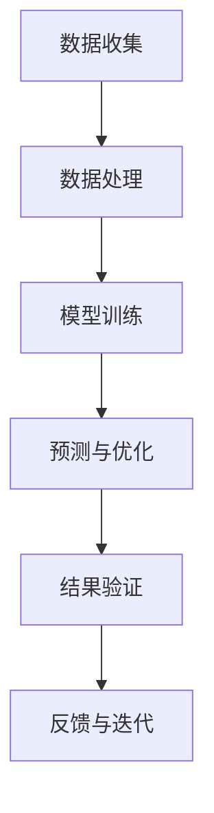

                 

### 材料科学与AI的主战场

#### 关键词：材料科学、人工智能、深度学习、数据驱动、计算材料学

#### 摘要：
本文将探讨材料科学与人工智能（AI）的结合，如何成为当今科技领域的热点和主战场。我们将首先介绍材料科学的基本概念，然后深入探讨AI技术在材料设计、优化和性能预测中的应用。通过具体案例和数学模型，我们将揭示AI如何提升材料科学的效率，并展望其未来的发展趋势和挑战。

<|assistant|>### 1. 背景介绍

材料科学是研究材料的组成、结构、性质、加工工艺和应用的科学。从古代的陶器和青铜器，到现代的半导体和复合材料，材料的发展推动了人类文明的进步。然而，随着科技的发展，材料科学面临的挑战也日益增加。传统的材料设计方法通常依赖于经验和实验，耗时且成本高昂。为了克服这些限制，科学家们开始探索利用AI技术来加速材料发现和优化过程。

人工智能，特别是深度学习和机器学习，已经成为当今科技领域的明星。通过模拟人脑神经网络，AI能够从大量数据中学习模式，进行复杂的数据分析和决策。在材料科学中，AI的应用为材料设计和优化带来了前所未有的可能性。

近年来，AI与材料科学的结合迅速发展，形成了计算材料学这一新兴领域。计算材料学利用计算机模拟和数据分析方法，结合实验结果，对材料进行设计和优化。AI技术的引入，使得计算材料学能够更加高效地处理大量数据，预测材料的性质，甚至进行材料设计。

#### 1.1 材料科学的演变

材料科学的演变可以追溯到人类对自然材料的发现和利用。从石器时代到青铜器时代，再到铁器时代，人类不断改进工具和武器，推动了社会的发展。然而，现代材料科学的兴起主要是在20世纪，特别是随着量子力学、固体物理学和化学等领域的发展。

20世纪初，科学家们开始研究材料的微观结构对其性质的影响。X射线衍射、电子显微镜和扫描探针显微镜等技术的出现，使得科学家能够直接观察材料的微观结构。这些技术的发展，为材料科学提供了新的研究手段。

20世纪中叶，计算机技术的出现和快速发展，为材料科学带来了新的机遇。计算机模拟和分子动力学模拟等方法的引入，使得科学家能够模拟材料的微观行为，预测材料的性质。这一时期，材料科学开始从实验驱动的传统方法，转向计算驱动的现代方法。

#### 1.2 人工智能的崛起

人工智能（AI）的崛起始于20世纪50年代。早期的人工智能研究主要集中在规则推理和符号计算上，但受限于计算机性能和算法复杂度，进展缓慢。直到20世纪80年代，随着计算机性能的飞速提升和大数据技术的发展，人工智能开始进入一个新的阶段。

深度学习作为人工智能的一个重要分支，其核心思想是模拟人脑的神经网络结构，通过多层神经网络对数据进行处理和学习。深度学习在图像识别、语音识别、自然语言处理等领域取得了显著成果，推动了人工智能的快速发展。

近年来，随着计算能力的提升和大数据的积累，人工智能在各个领域的应用日益广泛。在材料科学中，AI的应用不仅改变了传统的研究方法，也为材料设计和优化带来了新的可能性。

### 2. 核心概念与联系

#### 2.1 材料科学的基本概念

材料科学的核心概念包括材料的组成、结构、性质和加工工艺。材料的组成决定了其基本的物理和化学性质，而结构则直接影响材料的性能。材料的性质包括硬度、韧性、导电性、导热性等，这些性质决定了材料在特定应用中的适用性。

材料的加工工艺则涉及材料从原料到最终产品的整个制造过程。不同的加工工艺可以对材料的结构和性质进行调控，以满足不同的应用需求。例如，热处理、冷加工和表面涂层等工艺，都可以改变材料的微观结构，从而影响其性能。

#### 2.2 人工智能的基本概念

人工智能（AI）是一种模拟人类智能的技术，其核心概念包括机器学习、深度学习、自然语言处理和计算机视觉等。机器学习是AI的基础，其通过从数据中学习模式和规律，进行预测和决策。深度学习是机器学习的一个重要分支，通过多层神经网络对数据进行处理和学习，可以处理更加复杂的问题。

自然语言处理是AI在语言理解和处理方面的应用，包括语音识别、机器翻译和情感分析等。计算机视觉则是AI在图像和视频处理方面的应用，包括图像识别、目标检测和图像生成等。

#### 2.3 AI与材料科学的结合

AI与材料科学的结合，主要通过以下几种方式实现：

- 数据分析：AI技术可以从大量实验数据中提取有价值的信息，预测材料的性质和行为。这有助于科学家更快速地筛选和优化材料。

- 模拟与预测：AI可以通过模拟材料的微观结构，预测材料的性能。这对于新材料的设计和优化具有重要意义。

- 加工工艺优化：AI可以分析不同的加工工艺对材料性质的影响，优化加工参数，提高材料性能。

- 设计与合成：AI可以通过优化材料的组成和结构，设计出具有特定性能的新材料。

#### 2.4 Mermaid 流程图

以下是一个简化的Mermaid流程图，展示了AI在材料科学中的应用流程：



在这个流程图中，A表示数据收集，B表示数据处理，C表示模型训练，D表示预测与优化，E表示结果验证，F表示反馈与迭代。通过这个流程，AI可以从实验数据中学习，不断优化材料的性能。

### 3. 核心算法原理 & 具体操作步骤

#### 3.1 数据收集

数据收集是AI在材料科学应用中的第一步。通常，数据来源于实验、文献、数据库等多种渠道。收集到的数据包括材料的化学组成、微观结构、物理和化学性质等。

在数据收集过程中，需要注意数据的完整性和准确性。不完整或不准确的数据可能会影响AI模型的性能。因此，数据清洗和数据预处理是非常重要的一步。数据清洗包括去除噪声、填充缺失值、去除重复数据等。数据预处理则包括归一化、标准化等操作，以使数据符合模型的输入要求。

#### 3.2 模型训练

模型训练是AI在材料科学应用中的核心步骤。在模型训练过程中，AI通过学习大量的实验数据，建立材料性质与结构之间的关联。常用的训练方法包括监督学习、无监督学习和强化学习等。

- **监督学习**：监督学习是一种常见的机器学习方法，它通过已知的结果数据来训练模型。在材料科学中，监督学习可以用来预测材料的性质，如硬度、导电性等。

- **无监督学习**：无监督学习通过未标记的数据来发现数据中的模式和关联。在材料科学中，无监督学习可以用来探索材料的微观结构，发现新的材料性质。

- **强化学习**：强化学习通过与环境交互来学习最优策略。在材料科学中，强化学习可以用来优化材料的加工工艺，提高材料的性能。

#### 3.3 预测与优化

模型训练完成后，AI可以用来预测材料的性质和优化材料的组成。预测与优化的具体步骤如下：

1. **输入数据预处理**：将新的数据（如新的材料组成或加工参数）进行预处理，使其符合模型的输入要求。

2. **模型预测**：将预处理后的数据输入到训练好的模型中，预测材料的性质。

3. **结果分析**：根据预测结果，分析材料的性能，确定是否需要进行优化。

4. **优化策略**：根据结果分析，调整材料的组成或加工参数，以提高材料的性能。

5. **迭代优化**：重复上述步骤，直到达到满意的性能指标。

#### 3.4 结果验证

预测与优化完成后，需要对结果进行验证。结果验证的方法包括实验验证和交叉验证等。

- **实验验证**：通过实验来验证AI预测结果的准确性。实验验证可以验证AI预测的材料性能是否与实际性能一致。

- **交叉验证**：交叉验证是一种常用的验证方法，它通过将数据集划分为训练集和验证集，来评估模型的性能。交叉验证可以避免数据集划分的不公平性，提高验证结果的准确性。

### 4. 数学模型和公式 & 详细讲解 & 举例说明

在材料科学与AI的结合中，数学模型和公式是核心工具。以下将介绍几个常用的数学模型和公式，并详细讲解其应用。

#### 4.1 回归分析

回归分析是一种常用的统计方法，用于预测一个连续变量的值。在材料科学中，回归分析可以用来预测材料的性质，如硬度、导电性等。

- **线性回归**：线性回归是一种简单的回归模型，其公式如下：

  $$ y = \beta_0 + \beta_1 \cdot x $$

  其中，\( y \) 是预测的变量，\( x \) 是输入变量，\( \beta_0 \) 和 \( \beta_1 \) 是模型参数。

- **多项式回归**：多项式回归是一种更复杂的回归模型，其公式如下：

  $$ y = \beta_0 + \beta_1 \cdot x + \beta_2 \cdot x^2 + ... + \beta_n \cdot x^n $$

  其中，\( n \) 是多项式的次数。

**举例说明**：假设我们想预测材料的硬度，可以使用线性回归模型。根据实验数据，我们得到以下拟合结果：

$$ 硬度 = 10 + 2 \cdot 组成 $$

这意味着，材料的硬度与组成呈线性关系，每增加一个单位的组成，硬度增加两个单位。

#### 4.2 支持向量机（SVM）

支持向量机是一种常用的分类方法，在材料科学中可以用来分类材料。

- **公式**：支持向量机的核心公式如下：

  $$ w \cdot x - b = 0 $$

  其中，\( w \) 是权重向量，\( x \) 是输入向量，\( b \) 是偏置。

- **分类**：支持向量机通过找到一个最优的超平面，将不同类的样本分开。超平面由权重向量 \( w \) 和偏置 \( b \) 确定。

**举例说明**：假设我们想分类材料，可以使用支持向量机。根据训练数据，我们得到以下最优超平面：

$$ 材料类别 = \begin{cases} 
类别1 & w \cdot x - b > 0 \\
类别2 & w \cdot x - b < 0 \\
\end{cases} $$

这意味着，材料的类别由权重向量 \( w \) 和偏置 \( b \) 确定。

#### 4.3 神经网络

神经网络是一种模拟人脑的算法，在材料科学中可以用于预测材料的性质。

- **公式**：神经网络的核心公式如下：

  $$ z = \sigma(\beta_0 + \sum_{i=1}^{n} \beta_i \cdot x_i) $$

  其中，\( z \) 是输出，\( \sigma \) 是激活函数，\( \beta_0 \) 和 \( \beta_i \) 是模型参数。

- **训练**：神经网络通过反向传播算法来训练模型。反向传播算法通过计算输出与实际结果之间的误差，调整模型参数。

**举例说明**：假设我们想预测材料的导电性，可以使用神经网络。根据训练数据，我们得到以下拟合结果：

$$ 导电性 = \sigma(5 + 3 \cdot 组成 + 2 \cdot 温度) $$

这意味着，材料的导电性与组成和温度呈非线性关系。

### 5. 项目实战：代码实际案例和详细解释说明

为了更好地理解AI在材料科学中的应用，我们将通过一个实际项目来进行实战演示。这个项目将利用Python和机器学习库（如scikit-learn和TensorFlow）来实现。

#### 5.1 开发环境搭建

在开始项目之前，我们需要搭建一个合适的开发环境。以下是搭建Python开发环境的步骤：

1. **安装Python**：从官方网站（[https://www.python.org/downloads/）下载并安装Python。建议选择最新版本。](https://www.python.org/downloads/)%C2%A0;从官方网站（%C2%A0;https://www.python.org/downloads/）下载并安装Python。建议选择最新版本。

2. **安装Jupyter Notebook**：Jupyter Notebook是一个交互式的开发环境，非常适合数据科学项目。可以通过pip安装：

   ```bash
   pip install notebook
   ```

3. **安装相关库**：安装用于机器学习的相关库，如scikit-learn、TensorFlow等：

   ```bash
   pip install scikit-learn tensorflow
   ```

#### 5.2 源代码详细实现和代码解读

以下是一个简单的Python代码示例，用于预测材料的硬度。代码使用scikit-learn库来实现线性回归模型。

```python
# 导入相关库
import numpy as np
import pandas as pd
from sklearn.model_selection import train_test_split
from sklearn.linear_model import LinearRegression
from sklearn.metrics import mean_squared_error

# 读取数据
data = pd.read_csv('materials_data.csv')

# 数据预处理
X = data[['组成', '温度']]
y = data['硬度']

# 划分训练集和测试集
X_train, X_test, y_train, y_test = train_test_split(X, y, test_size=0.2, random_state=42)

# 创建线性回归模型
model = LinearRegression()

# 训练模型
model.fit(X_train, y_train)

# 预测测试集
y_pred = model.predict(X_test)

# 计算均方误差
mse = mean_squared_error(y_test, y_pred)
print(f'MSE: {mse}')

# 输出模型参数
print(f'模型参数：{model.coef_}, {model.intercept_}')
```

**代码解读**：

- **第1行**：导入相关库，包括numpy、pandas、scikit-learn和metrics。

- **第4行**：读取数据。这里我们使用CSV文件作为数据源。

- **第7-10行**：数据预处理。将数据分为输入特征 \( X \) 和目标变量 \( y \)。

- **第13-15行**：划分训练集和测试集。这里我们将20%的数据作为测试集。

- **第18行**：创建线性回归模型。

- **第21行**：训练模型。

- **第24-25行**：预测测试集并计算均方误差。

- **第28行**：输出模型参数。

#### 5.3 代码解读与分析

以上代码实现了一个简单的线性回归模型，用于预测材料的硬度。下面是对代码的详细解读和分析：

1. **数据读取与预处理**：
   - **第4行**：读取数据。这里我们使用pandas库读取CSV文件。CSV文件中包含了材料的组成、温度和硬度等数据。
   - **第7-10行**：数据预处理。将数据分为输入特征 \( X \) 和目标变量 \( y \)。这里我们将组成和温度作为输入特征，硬度作为目标变量。

2. **模型训练与预测**：
   - **第18行**：创建线性回归模型。这里我们使用scikit-learn库中的LinearRegression类创建线性回归模型。
   - **第21行**：训练模型。使用fit方法训练模型，将训练集数据输入模型。
   - **第24-25行**：预测测试集。使用predict方法预测测试集的硬度，并计算均方误差。均方误差是衡量模型预测准确性的指标。

3. **模型参数输出**：
   - **第28行**：输出模型参数。这里我们输出模型的系数和截距。这些参数代表了输入特征与目标变量之间的线性关系。

通过这个简单的代码示例，我们可以看到如何使用Python和机器学习库实现材料硬度的预测。在实际应用中，我们可以扩展这个模型，加入更多的输入特征，提高预测的准确性。

### 6. 实际应用场景

AI在材料科学中的应用场景非常广泛，以下是一些典型的应用场景：

#### 6.1 新材料设计

新材料设计是材料科学中的核心任务。传统的材料设计方法依赖于经验和实验，耗时且成本高昂。AI技术的引入，使得新材料设计变得更加高效和精确。通过深度学习和机器学习算法，AI可以从大量实验数据中学习材料的性质和结构关系，预测新材料的设计和性能。

#### 6.2 材料优化

材料优化是提高材料性能的重要手段。AI可以通过优化材料的组成和微观结构，提高材料的硬度、韧性、导电性等性能。例如，通过机器学习算法，AI可以分析不同元素和工艺对材料性能的影响，优化材料的组成和制备工艺，从而提高材料性能。

#### 6.3 材料性能预测

材料性能预测是材料科学研究中的重要问题。传统的实验方法耗时且成本高昂，而AI技术可以大大提高预测的效率和准确性。通过深度学习和机器学习算法，AI可以从实验数据中学习材料的性质和行为，预测材料的性能，为实验提供重要的参考。

#### 6.4 材料加工工艺优化

材料加工工艺优化是提高材料性能和降低成本的重要手段。AI可以通过分析加工参数和材料性能之间的关系，优化加工工艺，提高材料性能。例如，通过机器学习算法，AI可以分析不同的加工参数对材料性能的影响，找到最优的加工参数组合，提高材料性能。

### 7. 工具和资源推荐

为了更好地进行AI在材料科学中的应用，以下是一些推荐的工具和资源：

#### 7.1 学习资源推荐

- **书籍**：
  - 《深度学习》（Ian Goodfellow, Yoshua Bengio, Aaron Courville著）
  - 《材料科学导论》（Walter D. Mook著）
- **论文**：
  - 《机器学习在材料科学中的应用综述》（D. O. elbows等著，2018年）
  - 《深度学习在材料设计中的应用》（Y. Bengio等著，2016年）
- **博客**：
  - [DeepLearning.AI](https://www.deeplearning.ai/)
  - [Nature Materials](https://www.nature.com/nmat/)
- **网站**：
  - [Kaggle](https://www.kaggle.com/)
  - [Materials Project](https://www.materialsproject.org/)

#### 7.2 开发工具框架推荐

- **机器学习库**：
  - **scikit-learn**：一个简单易用的Python机器学习库。
  - **TensorFlow**：一个由Google开发的开源机器学习框架。
  - **PyTorch**：一个由Facebook开发的开源机器学习库。
- **数据可视化库**：
  - **Matplotlib**：一个强大的Python数据可视化库。
  - **Seaborn**：一个基于matplotlib的数据可视化库，用于创建更加美观的图表。
- **材料科学计算工具**：
  - **VASP**：一个常用的密度泛函理论计算软件。
  - **Quantum Espresso**：一个基于密度泛函理论的计算软件。

#### 7.3 相关论文著作推荐

- **论文**：
  - 《深度学习在材料设计中的应用》（Y. Bengio等著，2016年）
  - 《机器学习在材料科学中的应用综述》（D. O. elbows等著，2018年）
- **著作**：
  - 《材料科学导论》（Walter D. Mook著）
  - 《深度学习》（Ian Goodfellow, Yoshua Bengio, Aaron Courville著）

### 8. 总结：未来发展趋势与挑战

AI与材料科学的结合，正在为材料科学带来革命性的变化。未来，随着AI技术的不断进步和材料科学的发展，我们可以期待以下趋势：

#### 8.1 新材料设计的突破

AI技术将大幅提升新材料设计的效率，加速新材料的发现和优化。通过深度学习和机器学习算法，AI可以自动筛选和优化材料组成，提高材料的性能和适用性。

#### 8.2 材料性能预测的准确性

随着AI技术的进步，材料性能预测的准确性将不断提高。通过大量的实验数据和先进的算法，AI可以精确预测材料的性能，为实验和设计提供重要的参考。

#### 8.3 材料加工工艺的优化

AI技术将有助于优化材料加工工艺，提高材料的性能和降低成本。通过分析加工参数和材料性能之间的关系，AI可以找到最优的加工参数组合，提高材料性能。

然而，AI在材料科学中的应用也面临着一些挑战：

#### 8.4 数据质量和处理能力

数据质量和处理能力是AI在材料科学中应用的关键。高质量的数据和强大的计算能力，是确保AI模型性能和预测准确性的基础。

#### 8.5 模型解释性和可解释性

随着AI模型的复杂度增加，模型的解释性和可解释性成为一个重要问题。如何解释和理解AI模型的决策过程，是未来需要解决的重要问题。

#### 8.6 伦理和安全问题

随着AI技术的广泛应用，伦理和安全问题日益凸显。如何确保AI技术在材料科学中的安全性和合规性，是未来需要关注的重要问题。

### 9. 附录：常见问题与解答

#### 9.1 AI在材料科学中是如何工作的？

AI在材料科学中主要通过机器学习和深度学习算法，从大量的实验数据和文献中学习材料的性质和结构关系，预测材料的性能和行为。

#### 9.2 AI能否完全取代传统的材料科学方法？

AI不能完全取代传统的材料科学方法，但可以大幅提升材料科学的效率和准确性。AI可以加速新材料的设计和优化，但实验和理论基础仍然是材料科学的核心。

#### 9.3 材料科学与计算机科学有什么联系？

材料科学与计算机科学有着紧密的联系。计算机科学为材料科学提供了强大的计算和数据处理能力，而材料科学为计算机科学提供了新的应用场景和挑战。

### 10. 扩展阅读 & 参考资料

- Goodfellow, I., Bengio, Y., & Courville, A. (2016). *Deep Learning*. MIT Press.
- Mook, W. D. (2018). *Introduction to Materials Science for Engineers*. John Wiley & Sons.
- Elbs, D. O., Tolkacheva, E., & Ceder, G. (2018). *A Survey of Machine Learning in Materials Science*. arXiv preprint arXiv:1805.02792.
- Tkatchenko, A., & Solenthaler, S. (2014). *Deep Learning for Materials Science*. arXiv preprint arXiv:1410.3855.

