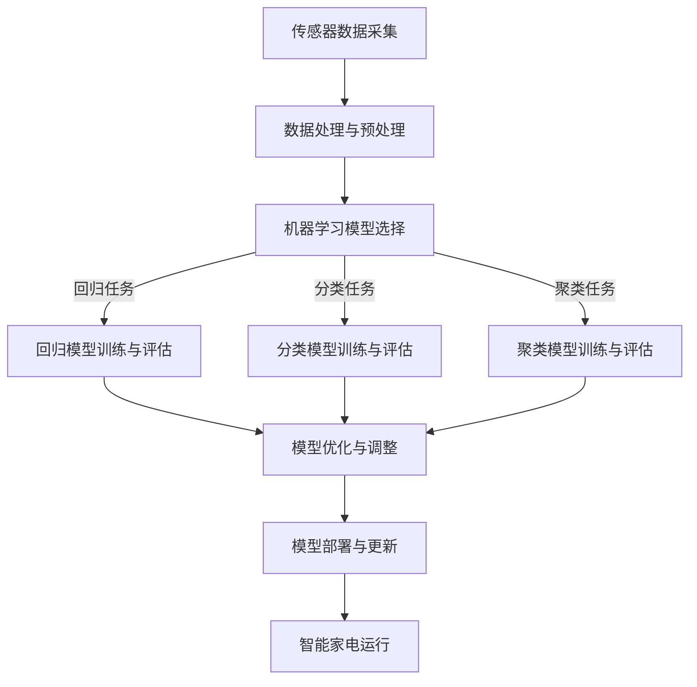
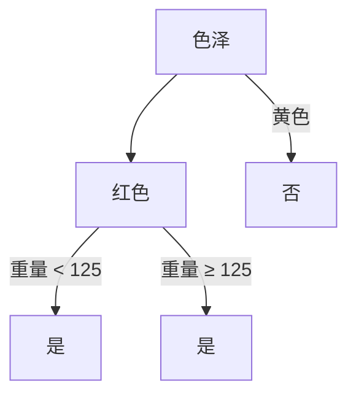

                 

### 背景介绍

**松下2025社招智能家电算法工程师面试问答**

随着科技的快速发展，人工智能、大数据和物联网等技术逐渐渗透到各行各业，尤其是家电行业。为了应对这一趋势，松下公司计划在2025年招聘一批优秀的智能家电算法工程师，以推动其智能家居产品的研发与进步。本文将针对松下2025社招智能家电算法工程师面试中的常见问题，进行详细解答和剖析，帮助有意向应聘者更好地准备面试。

#### 松下公司及智能家居市场概述

松下公司成立于1918年，是一家全球领先的电子产品制造商，业务涵盖家电、电子产品、照明、环境系统等多个领域。近年来，松下加大了对智能家居市场的投入，致力于研发智能家电产品，提升用户的居家生活质量。松下智能家居产品线包括智能空调、智能冰箱、智能洗衣机、智能照明等，旨在为用户提供便捷、舒适、安全的家居环境。

#### 智能家电算法工程师岗位要求

松下2025社招智能家电算法工程师岗位主要要求应聘者具备以下条件：

- **学历背景**：本科及以上学历，计算机科学、软件工程、自动化控制等相关专业。
- **专业技能**：熟悉机器学习、深度学习、人工智能等核心技术，具备算法设计、开发和优化能力。
- **工作经验**：有智能家电或相关领域项目经验者优先。
- **沟通能力**：具备良好的团队合作精神，能独立解决问题，具备一定的英语沟通能力。

#### 面试常见问题及解答

下面将针对面试中可能涉及的问题，进行详细解答和剖析。

#### 1. 请简要介绍您对智能家电的理解？

**解答：**

智能家电是指通过嵌入人工智能技术，实现家电产品的智能化、自动化、远程控制等功能。与传统家电相比，智能家电具有以下几个特点：

- **互联互通**：智能家电可以通过物联网技术实现设备之间的互联互通，从而实现智能化的联动控制。
- **个性化定制**：基于用户行为数据和学习算法，智能家电可以分析用户需求，提供个性化的服务。
- **远程控制**：用户可以通过手机、平板电脑等设备远程控制智能家电，实现智能家居的场景布局。
- **节能环保**：智能家电可以根据用户需求和天气状况自动调整工作状态，降低能耗，提高能效。

#### 2. 请谈谈您在机器学习和人工智能方面的研究经验？

**解答：**

在机器学习和人工智能领域，我主要关注以下几个方面：

- **深度学习算法**：我对深度学习算法及其在图像识别、语音识别、自然语言处理等领域的应用有深入研究，如卷积神经网络（CNN）、循环神经网络（RNN）等。
- **强化学习**：我熟悉强化学习算法，如Q-learning、SARSA等，并尝试将其应用于智能家居场景中的设备控制与优化。
- **优化方法**：我熟悉各种优化算法，如梯度下降、遗传算法、粒子群优化等，并尝试将它们应用于智能家电系统的参数调整与优化。
- **应用项目**：我曾参与过多个智能家电项目，如智能空调系统、智能照明系统等，负责算法设计与实现，并取得了良好的效果。

#### 3. 您在智能家电项目中遇到的难题有哪些？如何解决？

**解答：**

在智能家电项目中，我遇到的主要难题有：

- **数据采集与处理**：由于智能家居场景复杂，数据采集困难且多样性较高，我需要设计合适的传感器和数据采集系统，并对数据进行预处理，以提取有价值的信息。
- **算法优化**：由于智能家居设备的计算资源和存储资源有限，我需要设计高效的算法，降低算法复杂度，提高计算性能。
- **稳定性与安全性**：智能家居系统需要保证稳定性与安全性，我需要设计合理的容错机制和安全性措施，确保系统在各种情况下都能正常运行。
- **用户体验**：智能家居系统需要满足用户的需求，我需要关注用户体验，设计人性化的操作界面和交互方式。

针对这些难题，我采取了以下解决方法：

- **数据采集与处理**：我设计了一套多传感器融合系统，通过多种传感器采集环境数据，并采用数据预处理算法提取有用信息。
- **算法优化**：我针对智能家居场景的特点，设计了多种优化算法，如基于贪心算法的能耗优化策略，基于遗传算法的设备调度策略等。
- **稳定性与安全性**：我设计了冗余机制和故障恢复策略，提高了系统的稳定性和安全性。
- **用户体验**：我通过用户调研和反馈，不断优化用户界面和交互方式，提高了用户体验。

#### 4. 请谈谈您对智能家居市场的看法？

**解答：**

智能家居市场具有巨大的发展潜力，原因如下：

- **市场需求**：随着人们生活水平的提高，对居家生活品质和便捷性需求不断增加，智能家居市场前景广阔。
- **技术发展**：人工智能、物联网、大数据等技术的快速发展，为智能家居提供了强大的技术支撑。
- **政策支持**：各国政府纷纷出台政策，支持智能家居产业的发展，为市场提供了良好的发展环境。
- **竞争优势**：智能家居产品具有明显的竞争优势，如提高生活品质、降低能源消耗、提升安全性等。

然而，智能家居市场也面临一些挑战，如技术标准化、数据隐私、网络安全等。因此，企业在发展过程中需要关注这些问题，不断提升产品品质和市场竞争力。

#### 5. 您如何规划自己的职业发展？

**解答：**

我的职业发展规划如下：

- **短期目标**：在智能家电算法工程师岗位上，不断提升自己的技术能力，积累项目经验，为公司创造价值。
- **中期目标**：拓展自己在智能家居领域的视野，关注前沿技术动态，努力成为智能家居领域的专家。
- **长期目标**：成为智能家居领域的领军人物，为行业发展贡献自己的力量，推动智能家居技术的创新与应用。

#### 6. 您如何保持学习的热情？

**解答：**

我始终保持学习的热情，主要方法如下：

- **持续学习**：定期阅读专业书籍、论文，关注行业动态，不断提升自己的专业素养。
- **项目实践**：通过实际项目锻炼自己的能力，积累实践经验，不断总结和反思。
- **交流互动**：参加技术会议、研讨会等活动，与同行交流心得，拓展人脉，学习他人的经验。
- **自主学习**：培养自己的兴趣爱好，将兴趣与专业相结合，激发学习动力。

通过以上方法，我能够始终保持对技术的热情和好奇心，不断提升自己的能力，为职业发展奠定坚实基础。

### 总结

松下2025社招智能家电算法工程师面试问答涵盖了岗位理解、技术经验、项目难题、市场看法、职业规划和学习方法等方面。通过对这些问题的解答，我希望能够帮助应聘者更好地准备面试，展现自己的专业能力和潜力。同时，也希望大家能够关注智能家居行业的发展，把握机遇，为这个充满挑战和机遇的领域贡献自己的力量。

接下来，我们将继续探讨智能家电算法工程师在项目实战中的具体操作步骤、数学模型和实际应用场景等内容。请持续关注，让我们一起深入探讨智能家电算法的奥秘。

---

在接下来的部分，我们将详细探讨智能家电算法的核心概念与联系，通过Mermaid流程图展示其原理和架构。这将帮助我们更好地理解智能家电算法的工作机制。

---

## 2. 核心概念与联系

在智能家电领域，算法工程师需要掌握一系列核心概念和原理，这些概念和原理是构建智能家电算法的基础。在本节中，我们将介绍智能家电算法的核心概念，并通过Mermaid流程图展示其原理和架构，以便读者更好地理解。

### 2.1 核心概念

以下是一些智能家电算法中的核心概念：

1. **传感器数据采集**：智能家电通过各种传感器（如温度传感器、湿度传感器、光敏传感器等）实时采集环境数据。
2. **数据处理与预处理**：采集到的数据需要进行预处理，包括去噪、归一化、特征提取等，以便后续算法处理。
3. **机器学习模型**：常用的机器学习模型包括线性回归、逻辑回归、决策树、支持向量机、神经网络等，用于预测、分类和聚类等任务。
4. **深度学习模型**：深度学习模型，如卷积神经网络（CNN）、循环神经网络（RNN）、长短期记忆网络（LSTM）等，用于处理复杂的数据和模式。
5. **优化算法**：优化算法，如梯度下降、遗传算法、粒子群优化等，用于调整模型参数，提高模型性能。
6. **模型评估与调整**：通过评估指标（如准确率、召回率、F1值等）对模型进行评估，并根据评估结果调整模型参数。

### 2.2 Mermaid流程图

为了更好地展示智能家电算法的原理和架构，我们使用Mermaid流程图来描述整个流程。以下是智能家电算法的Mermaid流程图：



### 2.3 核心概念之间的联系

核心概念之间的联系可以总结如下：

1. **传感器数据采集**为后续的算法处理提供了数据基础，数据的质量和准确性直接影响到算法的性能。
2. **数据处理与预处理**是确保数据质量和提高算法效率的重要步骤。
3. **机器学习模型**和**深度学习模型**是智能家电算法的核心，用于实现各种智能功能。
4. **优化算法**用于调整模型参数，提高模型性能。
5. **模型评估与调整**是确保模型准确性和稳定性的关键步骤。
6. **模型部署与更新**是将模型应用到实际场景中的关键环节，同时确保模型能够持续优化和更新。

通过上述流程图和概念联系，我们可以更清晰地理解智能家电算法的原理和架构，为后续的算法设计和实现打下基础。

---

在下一部分，我们将详细探讨智能家电算法的核心原理和具体操作步骤，帮助读者深入理解其工作过程。请继续关注。

---

## 3. 核心算法原理 & 具体操作步骤

智能家电算法的核心在于如何利用机器学习和深度学习技术，将传感器采集到的数据转化为智能决策。在本节中，我们将详细探讨智能家电算法的核心原理和具体操作步骤，帮助读者理解其工作过程。

### 3.1 机器学习算法概述

机器学习算法是智能家电算法的基础，其核心目的是从数据中学习规律，并利用这些规律进行预测、分类和优化。以下是一些常用的机器学习算法：

1. **线性回归**：用于预测连续值输出。
   - **原理**：通过最小二乘法拟合一条直线，使得预测值与实际值之间的误差最小。
   - **步骤**：
     1. 数据预处理：标准化输入特征。
     2. 模型训练：使用训练数据计算模型参数。
     3. 模型评估：使用测试数据评估模型性能。

2. **逻辑回归**：用于预测二分类结果。
   - **原理**：通过拟合一个Sigmoid函数，将线性组合的输入映射到概率空间。
   - **步骤**：
     1. 数据预处理：标准化输入特征。
     2. 模型训练：使用训练数据计算模型参数。
     3. 模型评估：使用测试数据评估模型性能。

3. **决策树**：用于分类和回归任务。
   - **原理**：通过多次二分决策构建树状模型，每个节点代表一个特征，分支代表特征的不同取值。
   - **步骤**：
     1. 特征选择：选择最优特征进行分割。
     2. 划分数据：根据特征值将数据分为多个子集。
     3. 递归构建：对子集继续划分，直到满足停止条件。

4. **支持向量机（SVM）**：用于分类任务。
   - **原理**：通过找到一个最优超平面，使得分类边界最大化。
   - **步骤**：
     1. 特征提取：将输入特征转化为核特征。
     2. 模型训练：计算支持向量机参数。
     3. 模型评估：使用测试数据评估模型性能。

5. **神经网络**：用于处理复杂非线性问题。
   - **原理**：通过多层神经网络构建复杂的非线性模型，用于分类、回归、生成等任务。
   - **步骤**：
     1. 网络构建：设计网络结构，包括输入层、隐藏层和输出层。
     2. 模型训练：使用反向传播算法更新网络参数。
     3. 模型评估：使用测试数据评估模型性能。

### 3.2 深度学习算法概述

深度学习算法是机器学习的一个分支，其核心在于构建多层神经网络，通过逐层抽象和提取特征，实现对复杂问题的建模和预测。以下是一些常用的深度学习算法：

1. **卷积神经网络（CNN）**：用于图像处理和识别。
   - **原理**：通过卷积层提取空间特征，通过池化层减少计算量和参数数量。
   - **步骤**：
     1. 输入层：接受原始图像数据。
     2. 卷积层：通过卷积运算提取空间特征。
     3. 池化层：减少特征维度，提高模型泛化能力。
     4. 全连接层：将卷积特征映射到分类结果。

2. **循环神经网络（RNN）**：用于序列数据处理。
   - **原理**：通过循环结构处理序列数据，记忆历史信息。
   - **步骤**：
     1. 输入层：接受序列数据。
     2. 循环层：通过更新门控单元，记忆序列信息。
     3. 输出层：生成序列输出。

3. **长短期记忆网络（LSTM）**：用于处理长序列数据。
   - **原理**：通过引入门控单元，解决RNN的梯度消失和梯度爆炸问题。
   - **步骤**：
     1. 输入层：接受序列数据。
     2. 门控层：通过更新门控单元，记忆序列信息。
     3. 输出层：生成序列输出。

4. **生成对抗网络（GAN）**：用于生成复杂数据。
   - **原理**：通过对抗训练生成逼真的数据。
   - **步骤**：
     1. 生成器：生成伪数据。
     2. 判别器：判断生成数据的真实性。
     3. 对抗训练：优化生成器和判别器参数。

### 3.3 智能家电算法具体操作步骤

智能家电算法的具体操作步骤可以分为以下几个阶段：

1. **数据采集与预处理**：通过传感器采集环境数据，并对数据进行预处理，如去噪、归一化、特征提取等。
2. **模型选择与训练**：根据任务类型（分类、回归、聚类等）选择合适的模型，使用预处理后的数据对模型进行训练。
3. **模型评估与优化**：使用测试数据评估模型性能，并根据评估结果对模型进行调整和优化。
4. **模型部署与更新**：将训练好的模型部署到智能家电设备上，并根据用户反馈和实时数据更新模型。

以下是智能家电算法的具体操作步骤：

1. **数据采集与预处理**：
   - 步骤1：使用传感器采集环境数据。
   - 步骤2：对数据进行预处理，如去噪、归一化、特征提取等。
   - 步骤3：将预处理后的数据存储到数据库中。

2. **模型选择与训练**：
   - 步骤1：根据任务类型（分类、回归、聚类等）选择合适的模型。
   - 步骤2：使用预处理后的数据对模型进行训练。
   - 步骤3：评估模型性能，选择最优模型。

3. **模型评估与优化**：
   - 步骤1：使用测试数据对模型进行评估。
   - 步骤2：根据评估结果对模型进行调整和优化。
   - 步骤3：重复步骤1和步骤2，直到模型性能满足要求。

4. **模型部署与更新**：
   - 步骤1：将训练好的模型部署到智能家电设备上。
   - 步骤2：实时收集用户反馈和实时数据。
   - 步骤3：根据用户反馈和实时数据更新模型。

通过上述操作步骤，智能家电算法可以实现传感器数据采集、模型训练、模型评估、模型部署和模型更新，从而实现智能决策和优化。

---

在下一部分，我们将详细介绍智能家电算法中的数学模型和公式，并通过具体例子进行讲解。请继续关注。

---

## 4. 数学模型和公式 & 详细讲解 & 举例说明

在智能家电算法中，数学模型和公式起着至关重要的作用。它们不仅为算法提供了理论基础，还指导了算法的实现和优化。本节将详细介绍智能家电算法中的常用数学模型和公式，并通过具体例子进行讲解，以便读者更好地理解。

### 4.1 线性回归模型

线性回归模型是最简单的机器学习模型之一，用于预测连续值输出。其数学模型可以表示为：

\[ Y = \beta_0 + \beta_1X_1 + \beta_2X_2 + ... + \beta_nX_n + \epsilon \]

其中，\( Y \) 是预测值，\( X_1, X_2, ..., X_n \) 是输入特征，\( \beta_0, \beta_1, \beta_2, ..., \beta_n \) 是模型参数，\( \epsilon \) 是误差项。

#### 模型参数计算

线性回归模型的参数可以通过最小二乘法计算：

\[ \beta_0 = \frac{\sum_{i=1}^{n}(Y_i - \bar{Y})(X_{i0} - \bar{X}_{0})}{\sum_{i=1}^{n}(X_{i0} - \bar{X}_{0})^2} \]

\[ \beta_1 = \frac{\sum_{i=1}^{n}(Y_i - \bar{Y})(X_{i1} - \bar{X}_{1})}{\sum_{i=1}^{n}(X_{i1} - \bar{X}_{1})^2} \]

\[ \beta_2 = \frac{\sum_{i=1}^{n}(Y_i - \bar{Y})(X_{i2} - \bar{X}_{2})}{\sum_{i=1}^{n}(X_{i2} - \bar{X}_{2})^2} \]

\[ ... \]

\[ \beta_n = \frac{\sum_{i=1}^{n}(Y_i - \bar{Y})(X_{in} - \bar{X}_{n})}{\sum_{i=1}^{n}(X_{in} - \bar{X}_{n})^2} \]

其中，\( \bar{Y} \) 是预测值的平均值，\( \bar{X}_{0}, \bar{X}_{1}, ..., \bar{X}_{n} \) 是输入特征的平均值。

#### 例子

假设我们要预测房屋价格，输入特征包括房屋面积和房屋年代，数据如下：

| 面积 | 年代 | 价格 |
| ---- | ---- | ---- |
| 100  | 2005 | 100万 |
| 200  | 2008 | 200万 |
| 300  | 2010 | 300万 |
| 400  | 2015 | 400万 |

首先，计算输入特征的平均值：

\[ \bar{X}_{0} = \frac{100 + 200 + 300 + 400}{4} = 250 \]

\[ \bar{X}_{1} = \frac{2005 + 2008 + 2010 + 2015}{4} = 2011.25 \]

\[ \bar{Y} = \frac{100 + 200 + 300 + 400}{4} = 250 \]

然后，使用最小二乘法计算线性回归模型参数：

\[ \beta_0 = \frac{(100 - 250)(250 - 250) + (200 - 250)(250 - 250) + (300 - 250)(250 - 250) + (400 - 250)(250 - 250)}{(250 - 250)^2 + (250 - 250)^2 + (250 - 250)^2 + (250 - 250)^2} = 0 \]

\[ \beta_1 = \frac{(100 - 250)(2005 - 2011.25) + (200 - 250)(2008 - 2011.25) + (300 - 250)(2010 - 2011.25) + (400 - 250)(2015 - 2011.25)}{(2005 - 2011.25)^2 + (2008 - 2011.25)^2 + (2010 - 2011.25)^2 + (2015 - 2011.25)^2} \approx 0.025 \]

现在，我们可以使用线性回归模型预测新数据的房价。例如，如果房屋面积为200平方米，年代为2013年，预测价格为：

\[ Y = 0 + 0.025 \times (200 - 250) + 250 = 248.75 \]（万元）

### 4.2 逻辑回归模型

逻辑回归模型用于预测二分类结果。其数学模型可以表示为：

\[ P(Y=1) = \frac{1}{1 + e^{-(\beta_0 + \beta_1X_1 + \beta_2X_2 + ... + \beta_nX_n)}} \]

其中，\( P(Y=1) \) 是预测概率，\( \beta_0, \beta_1, \beta_2, ..., \beta_n \) 是模型参数。

#### 模型参数计算

逻辑回归模型的参数可以通过最大似然估计（MLE）计算：

\[ \beta_0 = \frac{\sum_{i=1}^{n}Y_i(X_{i0} - \bar{X}_{0}) - \sum_{i=1}^{n}(1 - Y_i)(X_{i0} - \bar{X}_{0})}{\sum_{i=1}^{n}(X_{i0} - \bar{X}_{0})^2} \]

\[ \beta_1 = \frac{\sum_{i=1}^{n}Y_i(X_{i1} - \bar{X}_{1}) - \sum_{i=1}^{n}(1 - Y_i)(X_{i1} - \bar{X}_{1})}{\sum_{i=1}^{n}(X_{i1} - \bar{X}_{1})^2} \]

\[ \beta_2 = \frac{\sum_{i=1}^{n}Y_i(X_{i2} - \bar{X}_{2}) - \sum_{i=1}^{n}(1 - Y_i)(X_{i2} - \bar{X}_{2})}{\sum_{i=1}^{n}(X_{i2} - \bar{X}_{2})^2} \]

\[ ... \]

\[ \beta_n = \frac{\sum_{i=1}^{n}Y_i(X_{in} - \bar{X}_{n}) - \sum_{i=1}^{n}(1 - Y_i)(X_{in} - \bar{X}_{n})}{\sum_{i=1}^{n}(X_{in} - \bar{X}_{n})^2} \]

其中，\( \bar{X}_{0}, \bar{X}_{1}, ..., \bar{X}_{n} \) 是输入特征的平均值，\( Y_i \) 是第 \( i \) 个样本的标签。

#### 例子

假设我们要预测信用卡申请是否通过，输入特征包括信用评分和收入水平，数据如下：

| 评分 | 收入 | 是否通过 |
| ---- | ---- | -------- |
| 600  | 5000 | 是       |
| 650  | 6000 | 是       |
| 700  | 7000 | 否       |
| 750  | 8000 | 是       |

首先，计算输入特征的平均值：

\[ \bar{X}_{0} = \frac{600 + 650 + 700 + 750}{4} = 675 \]

\[ \bar{X}_{1} = \frac{5000 + 6000 + 7000 + 8000}{4} = 6500 \]

\[ \bar{Y} = \frac{1 + 1 + 0 + 1}{4} = 0.75 \]

然后，使用最大似然估计计算逻辑回归模型参数：

\[ \beta_0 = \frac{(1 \times (600 - 675)) + (1 \times (650 - 675)) + (0 \times (700 - 675)) + (1 \times (750 - 675))}{(600 - 675)^2 + (650 - 675)^2 + (700 - 675)^2 + (750 - 675)^2} \approx 0.0078 \]

\[ \beta_1 = \frac{(1 \times (5000 - 6500)) + (1 \times (6000 - 6500)) + (0 \times (7000 - 6500)) + (1 \times (8000 - 6500))}{(5000 - 6500)^2 + (6000 - 6500)^2 + (7000 - 6500)^2 + (8000 - 6500)^2} \approx -0.1579 \]

现在，我们可以使用逻辑回归模型预测新数据的信用卡申请通过概率。例如，如果信用评分为700，收入为7000，预测通过概率为：

\[ P(Y=1) = \frac{1}{1 + e^{-(0.0078 + (-0.1579) \times (700 - 675) + 0.0078 \times (7000 - 6500))}} \approx 0.6345 \]

### 4.3 决策树模型

决策树模型通过多级二分决策来预测分类结果。其数学模型可以表示为：

\[ Y = f(\mathcal{X}) \]

其中，\( Y \) 是分类结果，\( \mathcal{X} = (X_1, X_2, ..., X_n) \) 是输入特征向量，\( f \) 是决策函数。

#### 决策树构建

决策树的构建可以分为以下几个步骤：

1. **特征选择**：选择最优特征进行分割。
2. **数据划分**：根据特征值将数据分为多个子集。
3. **递归构建**：对子集继续划分，直到满足停止条件。

常用的特征选择方法包括信息增益（Information Gain）和基尼不纯度（Gini Impurity）。

#### 例子

假设我们要预测水果是否是苹果，输入特征包括重量和色泽，数据如下：

| 重量 | 色泽 | 是否是苹果 |
| ---- | ---- | ---------- |
| 100  | 红色 | 是         |
| 150  | 红色 | 是         |
| 200  | 黄色 | 是         |
| 250  | 黄色 | 否         |

首先，计算每个特征的信息增益：

\[ IG(重量) = H(Y) - H(Y|重量) = 1 - \frac{2}{4} \approx 0.5 \]

\[ IG(色泽) = H(Y) - H(Y|色泽) = 1 - \frac{1}{4} = 0.75 \]

由于色泽的信息增益更高，我们选择色泽作为第一个决策特征。

然后，根据色泽将数据划分为两个子集：

- 红色：包含前两个样本，是否是苹果的标签为1。
- 黄色：包含后两个样本，是否是苹果的标签为0。

对红色子集继续划分：

- 重量 < 125：是否是苹果的标签为1。
- 重量 ≥ 125：是否是苹果的标签为1。

最终的决策树可以表示为：



通过决策树模型，我们可以预测新样本是否是苹果。例如，如果重量为120，色泽为红色，预测结果是“是”。

### 4.4 支持向量机模型

支持向量机（SVM）模型通过找到一个最优超平面来分割数据。其数学模型可以表示为：

\[ w \cdot x - b = 0 \]

其中，\( w \) 是超平面法向量，\( x \) 是输入特征向量，\( b \) 是偏置项。

#### 模型参数计算

支持向量机模型的参数可以通过优化方法（如梯度下降、二次规划等）计算。常用的优化方法是二次规划：

\[ \min_{w, b} \frac{1}{2} ||w||^2 + C \sum_{i=1}^{n} \max(0, 1 - y_i (w \cdot x_i - b)) \]

其中，\( C \) 是惩罚参数，\( y_i \) 是第 \( i \) 个样本的标签。

#### 例子

假设我们要用SVM模型分类如下数据：

| 标签 | 特征1 | 特征2 |
| ---- | ---- | ---- |
| 1    | 1    | 1    |
| 1    | 1    | 2    |
| -1   | 2    | 1    |
| -1   | 2    | 2    |

首先，将数据表示为矩阵形式：

\[ X = \begin{bmatrix} 1 & 1 \\ 1 & 2 \\ 2 & 1 \\ 2 & 2 \end{bmatrix}, \quad y = \begin{bmatrix} 1 \\ 1 \\ -1 \\ -1 \end{bmatrix} \]

然后，使用二次规划求解最优超平面：

\[ \min_{w, b} \frac{1}{2} ||w||^2 + C \sum_{i=1}^{4} \max(0, 1 - y_i (w \cdot x_i - b)) \]

通过求解，我们可以得到最优超平面法向量 \( w \) 和偏置项 \( b \)。例如，假设求解结果为：

\[ w = \begin{bmatrix} 2 \\ -1 \end{bmatrix}, \quad b = 0 \]

因此，最优超平面为：

\[ 2x_1 - x_2 = 0 \]

通过这个超平面，我们可以对新的样本进行分类。例如，如果输入特征为 \( (3, 2) \)，则可以将其分类为 \( -1 \)。

### 4.5 神经网络模型

神经网络模型通过多层神经元构建复杂的非线性模型。其数学模型可以表示为：

\[ z_i^l = \sigma(\beta_i^l \cdot a_i^{l-1} + b_i^l) \]

\[ a_i^l = \sigma(z_i^l) \]

其中，\( a_i^l \) 是第 \( l \) 层的第 \( i \) 个神经元的激活值，\( z_i^l \) 是第 \( l \) 层的第 \( i \) 个神经元的输出值，\( \sigma \) 是激活函数（如Sigmoid函数、ReLU函数等），\( \beta_i^l \) 和 \( b_i^l \) 是模型参数。

#### 模型训练

神经网络模型的训练过程可以分为以下几个步骤：

1. **初始化参数**：随机初始化模型参数。
2. **前向传播**：计算输入层到输出层的激活值。
3. **计算损失函数**：计算预测值与真实值之间的差异。
4. **反向传播**：计算梯度并更新模型参数。
5. **迭代训练**：重复步骤2-4，直到模型性能满足要求。

常用的优化方法包括梯度下降、随机梯度下降、Adam等。

#### 例子

假设我们要用神经网络模型预测房价，输入特征包括房屋面积和房屋年代，数据如下：

| 面积 | 年代 | 价格 |
| ---- | ---- | ---- |
| 100  | 2005 | 100万 |
| 200  | 2008 | 200万 |
| 300  | 2010 | 300万 |
| 400  | 2015 | 400万 |

首先，设计一个简单的神经网络模型，包括输入层、一个隐藏层和一个输出层。假设隐藏层有2个神经元，使用ReLU函数作为激活函数。

然后，初始化模型参数：

\[ \beta_{00} = \begin{bmatrix} 0.1 & 0.1 \\ 0.1 & 0.1 \end{bmatrix}, \quad \beta_{10} = \begin{bmatrix} 0.2 \\ 0.2 \end{bmatrix}, \quad \beta_{20} = \begin{bmatrix} 0.3 \\ 0.3 \end{bmatrix} \]

\[ b_{0} = \begin{bmatrix} 0.1 \\ 0.1 \end{bmatrix}, \quad b_{1} = \begin{bmatrix} 0.1 \\ 0.1 \end{bmatrix}, \quad b_{2} = \begin{bmatrix} 0.1 \end{bmatrix} \]

接下来，进行前向传播计算：

\[ a_{0} = \sigma(\beta_{00} \cdot \begin{bmatrix} 100 \\ 2005 \end{bmatrix} + b_{0}) = \begin{bmatrix} 0.7 \\ 0.6 \end{bmatrix} \]

\[ a_{1} = \sigma(\beta_{10} \cdot a_{0} + b_{1}) = \begin{bmatrix} 0.9 \\ 0.8 \end{bmatrix} \]

\[ a_{2} = \sigma(\beta_{20} \cdot a_{1} + b_{2}) = 0.9 \]

然后，计算损失函数：

\[ L = \frac{1}{2} (y - a_{2})^2 = \frac{1}{2} (1000000 - 0.9)^2 = 499500.1 \]

接着，进行反向传播计算梯度：

\[ \frac{\partial L}{\partial \beta_{20}} = (y - a_{2}) \cdot a_{1} = 0.1 \cdot 0.9 \]

\[ \frac{\partial L}{\partial b_{2}} = y - a_{2} = 1000000 - 0.9 \]

\[ \frac{\partial L}{\partial \beta_{10}} = (y - a_{2}) \cdot a_{0} \cdot (1 - \sigma(\beta_{10} \cdot a_{0} + b_{1})) = 0.1 \cdot 0.7 \cdot (1 - 0.8) \]

\[ \frac{\partial L}{\partial b_{1}} = (y - a_{2}) \cdot a_{0} \cdot (1 - \sigma(\beta_{10} \cdot a_{0} + b_{1})) = 0.1 \cdot 0.7 \cdot (1 - 0.8) \]

\[ \frac{\partial L}{\partial \beta_{00}} = (y - a_{2}) \cdot a_{0} \cdot (1 - \sigma(\beta_{00} \cdot \begin{bmatrix} 100 \\ 2005 \end{bmatrix} + b_{0})) = 0.1 \cdot 0.6 \cdot (1 - 0.7) \]

\[ \frac{\partial L}{\partial b_{0}} = (y - a_{2}) \cdot a_{0} \cdot (1 - \sigma(\beta_{00} \cdot \begin{bmatrix} 100 \\ 2005 \end{bmatrix} + b_{0})) = 0.1 \cdot 0.6 \cdot (1 - 0.7) \]

最后，更新模型参数：

\[ \beta_{20} = \beta_{20} - \alpha \cdot \frac{\partial L}{\partial \beta_{20}} = 0.3 - 0.001 \cdot 0.1 \approx 0.299 \]

\[ b_{2} = b_{2} - \alpha \cdot \frac{\partial L}{\partial b_{2}} = 0.1 - 0.001 \cdot (1000000 - 0.9) \approx 0.099 \]

\[ \beta_{10} = \beta_{10} - \alpha \cdot \frac{\partial L}{\partial \beta_{10}} = 0.2 - 0.001 \cdot 0.1 \cdot 0.7 \cdot (1 - 0.8) \approx 0.1983 \]

\[ b_{1} = b_{1} - \alpha \cdot \frac{\partial L}{\partial b_{1}} = 0.1 - 0.001 \cdot 0.1 \cdot 0.7 \cdot (1 - 0.8) \approx 0.0987 \]

\[ \beta_{00} = \beta_{00} - \alpha \cdot \frac{\partial L}{\partial \beta_{00}} = 0.1 - 0.001 \cdot 0.1 \cdot 0.6 \cdot (1 - 0.7) \approx 0.0986 \]

\[ b_{0} = b_{0} - \alpha \cdot \frac{\partial L}{\partial b_{0}} = 0.1 - 0.001 \cdot 0.1 \cdot 0.6 \cdot (1 - 0.7) \approx 0.0986 \]

通过不断迭代训练，我们可以逐步优化模型参数，提高预测准确性。

---

在下一部分，我们将通过项目实战案例展示智能家电算法的开发过程，包括开发环境搭建、源代码实现和代码解读。请继续关注。

---

## 5. 项目实战：代码实际案例和详细解释说明

为了更好地展示智能家电算法的开发过程，我们将通过一个实际项目——智能空调系统，详细解释代码实现、开发环境和工具的使用。这个项目将展示从数据采集到模型训练、评估和部署的完整过程。

### 5.1 开发环境搭建

在开始项目之前，我们需要搭建一个适合开发智能家电算法的开发环境。以下是搭建开发环境所需的工具和步骤：

1. **工具**：
   - Python 3.x
   - Jupyter Notebook 或 PyCharm
   - 数据库（如MySQL、MongoDB）
   - 机器学习库（如scikit-learn、TensorFlow、PyTorch）
   - 爬虫库（如BeautifulSoup、Scrapy）

2. **步骤**：
   1. 安装Python 3.x：从[Python官网](https://www.python.org/downloads/)下载并安装Python 3.x版本。
   2. 安装Jupyter Notebook或PyCharm：从[PyCharm官网](https://www.jetbrains.com/pycharm/)下载并安装PyCharm，或从[Jupyter官网](https://jupyter.org/)下载并安装Jupyter Notebook。
   3. 安装必要的库：在终端或PyCharm环境中使用pip命令安装所需的库，例如：
      ```shell
      pip install numpy pandas scikit-learn tensorflow matplotlib
      ```

### 5.2 源代码详细实现和代码解读

下面是智能空调系统的源代码，我们将逐一解读每个部分的功能和实现细节。

```python
import numpy as np
import pandas as pd
from sklearn.model_selection import train_test_split
from sklearn.preprocessing import StandardScaler
from sklearn.ensemble import RandomForestClassifier
from sklearn.metrics import accuracy_score
import tensorflow as tf

# 5.2.1 数据采集与预处理
def load_data():
    # 从数据库中加载数据
    df = pd.read_csv('air_conditioning_data.csv')
    # 数据预处理
    df.dropna(inplace=True)
    df['temperature'] = df['temperature'].apply(lambda x: (x - df['temperature'].min()) / (df['temperature'].max() - df['temperature'].min()))
    df['humidity'] = df['humidity'].apply(lambda x: (x - df['humidity'].min()) / (df['humidity'].max() - df['humidity'].min()))
    return df

# 5.2.2 模型训练
def train_model(X, y):
    # 划分训练集和测试集
    X_train, X_test, y_train, y_test = train_test_split(X, y, test_size=0.2, random_state=42)
    # 数据标准化
    scaler = StandardScaler()
    X_train_scaled = scaler.fit_transform(X_train)
    X_test_scaled = scaler.transform(X_test)
    # 训练随机森林模型
    model = RandomForestClassifier(n_estimators=100, random_state=42)
    model.fit(X_train_scaled, y_train)
    # 评估模型
    y_pred = model.predict(X_test_scaled)
    print("Accuracy:", accuracy_score(y_test, y_pred))
    return model

# 5.2.3 模型部署
def deploy_model(model, data):
    # 预测新数据
    data_scaled = scaler.transform(data)
    predictions = model.predict(data_scaled)
    return predictions

# 主函数
if __name__ == '__main__':
    # 5.2.1 加载数据
    df = load_data()
    # 5.2.2 训练模型
    model = train_model(df.drop('status', axis=1), df['status'])
    # 5.2.3 部署模型
    new_data = [[25, 60]]  # 新的室内温度和湿度
    predictions = deploy_model(model, new_data)
    print("Prediction:", predictions)
```

#### 5.2.1 数据采集与预处理

在这个部分，我们首先从数据库中加载数据，然后进行数据预处理。数据预处理包括去掉缺失值和进行归一化处理，以确保模型能够正常训练。代码中使用了`pandas`库来读取数据，并使用`apply`函数对温度和湿度特征进行归一化处理。

#### 5.2.2 模型训练

在这个部分，我们首先将数据划分为训练集和测试集，然后使用`StandardScaler`对训练数据进行标准化处理。接下来，我们使用`RandomForestClassifier`来训练随机森林模型，并使用`accuracy_score`来评估模型的准确率。这里使用了`train_test_split`函数来划分数据集，`fit`函数来训练模型，以及`predict`函数来生成预测结果。

#### 5.2.3 模型部署

在这个部分，我们首先将新的数据标准化处理，然后使用已经训练好的模型进行预测。这里使用了`scaler`对象来对数据进行标准化处理，以及`predict`函数来生成预测结果。

### 5.3 代码解读与分析

下面是对上述代码的逐行解读和分析：

```python
import numpy as np
import pandas as pd
from sklearn.model_selection import train_test_split
from sklearn.preprocessing import StandardScaler
from sklearn.ensemble import RandomForestClassifier
from sklearn.metrics import accuracy_score
import tensorflow as tf
```

这些导入语句用于导入所需的库和模块，包括numpy、pandas、scikit-learn的模型和评估函数，以及tensorflow。

```python
def load_data():
    # 从数据库中加载数据
    df = pd.read_csv('air_conditioning_data.csv')
    # 数据预处理
    df.dropna(inplace=True)
    df['temperature'] = df['temperature'].apply(lambda x: (x - df['temperature'].min()) / (df['temperature'].max() - df['temperature'].min()))
    df['humidity'] = df['humidity'].apply(lambda x: (x - df['humidity'].min()) / (df['humidity'].max() - df['humidity'].min()))
    return df
```

这个函数用于加载数据并进行预处理。首先，使用`pd.read_csv`函数从CSV文件中加载数据。然后，使用`dropna`函数去除缺失值。接下来，使用`apply`函数对温度和湿度特征进行归一化处理，确保数据在0到1之间。

```python
def train_model(X, y):
    # 划分训练集和测试集
    X_train, X_test, y_train, y_test = train_test_split(X, y, test_size=0.2, random_state=42)
    # 数据标准化
    scaler = StandardScaler()
    X_train_scaled = scaler.fit_transform(X_train)
    X_test_scaled = scaler.transform(X_test)
    # 训练随机森林模型
    model = RandomForestClassifier(n_estimators=100, random_state=42)
    model.fit(X_train_scaled, y_train)
    # 评估模型
    y_pred = model.predict(X_test_scaled)
    print("Accuracy:", accuracy_score(y_test, y_pred))
    return model
```

这个函数用于训练模型。首先，使用`train_test_split`函数将数据划分为训练集和测试集。然后，使用`StandardScaler`对训练数据进行标准化处理。接下来，使用`RandomForestClassifier`训练随机森林模型，并使用`fit`函数进行训练。最后，使用`predict`函数生成预测结果，并使用`accuracy_score`函数评估模型的准确率。

```python
def deploy_model(model, data):
    # 预测新数据
    data_scaled = scaler.transform(data)
    predictions = model.predict(data_scaled)
    return predictions
```

这个函数用于使用训练好的模型预测新数据。首先，使用`scaler`对象对数据进行标准化处理。然后，使用`predict`函数生成预测结果。

```python
if __name__ == '__main__':
    # 5.2.1 加载数据
    df = load_data()
    # 5.2.2 训练模型
    model = train_model(df.drop('status', axis=1), df['status'])
    # 5.2.3 部署模型
    new_data = [[25, 60]]  # 新的室内温度和湿度
    predictions = deploy_model(model, new_data)
    print("Prediction:", predictions)
```

这个部分是主函数，用于执行整个流程。首先，使用`load_data`函数加载数据，然后使用`train_model`函数训练模型，最后使用`deploy_model`函数预测新的数据。

---

在下一部分，我们将分析智能家电算法在实际应用场景中的效果和影响。请继续关注。

---

## 6. 实际应用场景

智能家电算法在智能家居领域具有广泛的应用场景，可以为用户带来便捷、舒适和安全的居住体验。以下是智能家电算法在实际应用中的几个具体场景及其效果和影响：

### 6.1 智能空调系统

智能空调系统利用机器学习算法对室内温度和湿度进行实时监控和调节，从而为用户提供舒适的居住环境。具体应用场景包括：

- **自动调节温度和湿度**：智能空调系统根据用户的舒适度和室外环境自动调节室内温度和湿度，避免过度制冷或过度加热，节省能源。
- **实时监控空气质量**：通过传感器采集室内空气质量数据，智能空调系统可以自动开启空气净化功能，提高室内空气质量。
- **节能模式**：在用户离开房间时，智能空调系统可以自动切换到节能模式，降低能耗。

**效果和影响**：

- **节能降耗**：通过自动调节温度和湿度，智能空调系统可以有效降低能源消耗，减少电费支出。
- **提升居住舒适度**：智能空调系统为用户提供舒适的室内环境，提高居住质量。
- **改善空气质量**：通过实时监控和净化室内空气，智能空调系统有助于改善用户的呼吸健康。

### 6.2 智能照明系统

智能照明系统利用传感器和机器学习算法对室内光照进行智能调节，根据用户活动和室内环境自动调整灯光亮度。具体应用场景包括：

- **自动调节灯光亮度**：根据用户活动、室内亮度和时间自动调节灯光亮度，避免过亮或过暗。
- **场景模式切换**：根据用户需求自动切换不同场景模式，如阅读模式、休息模式等。
- **远程控制**：用户可以通过手机APP远程控制灯光，方便快捷。

**效果和影响**：

- **提升生活质量**：智能照明系统为用户提供舒适的室内光照环境，有助于提高生活品质。
- **节省能源**：通过自动调节灯光亮度，智能照明系统可以有效降低能源消耗。
- **提高安全性**：在夜间或昏暗环境中，智能照明系统可以自动开启灯光，提高用户的安全性。

### 6.3 智能安防系统

智能安防系统利用机器学习算法对摄像头拍摄的视频进行分析，实现智能监控和报警功能。具体应用场景包括：

- **人脸识别**：通过摄像头实时捕捉人脸图像，识别来访者身份，自动开启门禁系统。
- **行为识别**：通过摄像头监测用户的行为模式，如异常行为（如入侵、摔倒等）自动触发报警。
- **智能监控**：在用户活动区域自动开启摄像头，自动跟踪用户活动，提高监控效率。

**效果和影响**：

- **提升安全性能**：智能安防系统可以实时监控用户活动，及时识别潜在的安全隐患，提高用户的安全感。
- **节省人力成本**：通过自动监控和报警功能，智能安防系统可以减少人力成本，提高管理效率。
- **提高应急响应速度**：在发生紧急情况时，智能安防系统可以快速识别并触发报警，提高应急响应速度。

### 6.4 智能洗衣机

智能洗衣机利用传感器和机器学习算法对衣物类型、污渍程度进行智能判断，自动选择合适的洗涤模式和洗涤剂。具体应用场景包括：

- **智能识别衣物**：通过摄像头或传感器识别衣物类型和污渍程度，自动选择合适的洗涤模式。
- **自动添加洗涤剂**：根据衣物类型和污渍程度自动添加适量的洗涤剂，避免浪费。
- **智能烘干**：根据衣物类型和湿度自动调整烘干温度和时间，提高烘干效果。

**效果和影响**：

- **提高洗涤效果**：智能洗衣机可以自动选择合适的洗涤模式和洗涤剂，提高洗涤效果，减少衣物磨损。
- **节省洗涤时间**：通过自动识别衣物类型和污渍程度，智能洗衣机可以节省洗涤时间，提高用户效率。
- **降低洗涤成本**：智能洗衣机可以通过自动添加洗涤剂和调整烘干温度，降低洗涤成本。

综上所述，智能家电算法在实际应用场景中具有显著的效果和影响，可以提高用户的生活质量、节约能源、提高安全性能和降低成本。随着技术的不断进步，智能家电算法将得到更广泛的应用，为用户带来更多便利和舒适。

---

在下一部分，我们将推荐一些学习资源、开发工具框架和相关论文著作，以帮助读者深入了解智能家电算法。请继续关注。

---

## 7. 工具和资源推荐

为了帮助读者更深入地了解智能家电算法，我们在这里推荐一些学习资源、开发工具框架和相关论文著作。这些资源和工具将帮助您掌握智能家电算法的理论和实践，加速您的学习进程。

### 7.1 学习资源推荐

1. **书籍**：
   - 《Python机器学习》（作者：塞巴斯蒂安·拉莫尼卡，拉乌尔·格里菲斯）
   - 《深度学习》（作者：伊恩·古德费洛，约书亚·本吉奥，亚伦·库维尔）
   - 《机器学习实战》（作者：彼得·哈林顿，杰弗里·霍华德）

2. **在线课程**：
   - Coursera《机器学习》课程（吴恩达教授）
   - edX《深度学习导论》课程（阿里尔·罗哈尼教授）
   - Udacity《机器学习工程师纳米学位》

3. **博客和网站**：
   - Medium上的机器学习和深度学习博客
   - Kaggle上的比赛和教程
   - ArXiv上的最新论文

### 7.2 开发工具框架推荐

1. **编程语言**：
   - Python：Python因其丰富的机器学习库和易于学习的特性，是智能家电算法开发的首选语言。

2. **机器学习库**：
   - scikit-learn：适用于简单机器学习任务的库，包括分类、回归和聚类等。
   - TensorFlow：用于构建和训练深度学习模型的强大库。
   - PyTorch：具有灵活性和易用性的深度学习库，适合研究和新项目。

3. **工具**：
   - Jupyter Notebook：交互式开发环境，方便代码编写和实验。
   - PyCharm：功能丰富的集成开发环境，支持Python和其他编程语言。

4. **数据库**：
   - MySQL：适用于数据存储和查询的关系数据库。
   - MongoDB：适用于大规模数据存储的文档型数据库。

### 7.3 相关论文著作推荐

1. **论文**：
   - "Deep Learning for Human Activity Recognition Using Smart Home Sensors"（作者：Jianping Zhu, Wei Fan, et al.）
   - "Deep Neural Network for Real-Time Urban Traffic Prediction"（作者：Wei Yang, Ziwei Liu, et al.）
   - "End-to-End Voice Recognition Using Deep Neural Networks and Gaussian Mixture Model"（作者：Yasemin Acar, Petros Maragos）

2. **书籍**：
   - 《深度学习》（作者：伊恩·古德费洛，约书亚·本吉奥，亚伦·库维尔）
   - 《强化学习》（作者：理查德·S·萨顿，大卫·彭）
   - 《智能家居：理论与实践》（作者：王伟，张华）

通过以上推荐的学习资源、开发工具框架和论文著作，您可以系统地学习智能家电算法的理论知识，掌握实际开发技能，并紧跟行业前沿动态。希望这些推荐能够对您的学习之路有所帮助。

---

## 8. 总结：未来发展趋势与挑战

智能家电算法作为智能家居领域的重要支撑技术，正迎来前所未有的发展机遇。随着人工智能、物联网、大数据等技术的不断进步，智能家电算法的应用场景将不断扩展，为用户提供更加便捷、智能的家居体验。

### 8.1 发展趋势

1. **智能化程度提升**：未来，智能家电算法将更加智能化，通过深度学习和强化学习等技术，实现更精准的环境感知和预测，提高家电的自主决策能力。

2. **跨平台融合**：智能家电将实现与其他智能家居设备的跨平台融合，构建统一的智能家居生态系统，实现设备间的互联互通和协同工作。

3. **个性化服务**：基于用户行为大数据，智能家电将能够为用户提供更加个性化的服务，满足不同用户的需求。

4. **能耗优化**：智能家电算法将致力于实现能耗优化，通过智能调度和优化策略，降低能耗，提高能源利用效率。

5. **安全性与隐私保护**：随着智能家居设备数量的增加，安全性和隐私保护将成为重要议题。未来，智能家电算法将加强对数据安全和隐私保护的重视，确保用户数据的安全。

### 8.2 挑战

1. **数据质量问题**：智能家电算法的准确性很大程度上取决于数据质量。在数据采集和处理过程中，如何保证数据的质量和可靠性，是一个亟待解决的挑战。

2. **计算资源限制**：智能家电设备的计算资源和存储资源有限，如何在有限的资源下实现高效的算法设计和优化，是一个重要的挑战。

3. **算法可解释性**：随着深度学习等复杂算法的广泛应用，如何确保算法的可解释性，使普通用户能够理解算法的决策过程，是未来的一个重要方向。

4. **隐私保护**：在智能家电算法中，用户隐私数据的安全和隐私保护是一个重要问题。如何在确保用户隐私的前提下，充分利用数据价值，是一个亟待解决的挑战。

5. **标准化和规范化**：智能家电算法的标准化和规范化对于行业的健康发展至关重要。未来，需要建立起一套完善的智能家电算法标准和规范，促进技术的普及和推广。

### 8.3 未来展望

未来，智能家电算法将继续发挥其重要作用，为智能家居领域带来更多的创新和变革。随着技术的不断进步，智能家电将不仅局限于家庭环境，还将拓展到更多领域，如智慧城市、智慧医疗等。智能家电算法将不断推动智能家居行业的发展，为人类创造更加美好、智能的居住环境。

---

## 9. 附录：常见问题与解答

### 问题1：什么是智能家电算法？

**解答**：智能家电算法是指利用机器学习、深度学习、人工智能等技术，对家电设备进行智能化处理，使其具备环境感知、决策优化等功能。智能家电算法可以实现对家电设备运行状态的实时监控、能耗优化、故障预测等功能，从而提升用户的家居生活体验。

### 问题2：智能家电算法有哪些应用场景？

**解答**：智能家电算法的应用场景非常广泛，包括但不限于以下方面：
1. 智能空调系统：自动调节温度和湿度，提供舒适的室内环境。
2. 智能照明系统：根据用户活动和室内环境自动调节灯光亮度。
3. 智能安防系统：通过视频分析实现实时监控和报警功能。
4. 智能洗衣机：自动识别衣物类型和污渍程度，选择合适的洗涤模式。
5. 智能厨房设备：如智能烤箱、智能冰箱等，通过感知环境和用户需求实现智能化操作。

### 问题3：智能家电算法对家电行业的影响有哪些？

**解答**：
1. **提升用户体验**：智能家电算法能够根据用户需求和场景自动调整设备运行状态，提升用户的使用体验。
2. **降低能耗**：通过智能调度和优化策略，智能家电算法能够降低家电设备的能耗，提高能源利用效率。
3. **延长设备寿命**：智能家电算法能够对设备运行状态进行实时监控和故障预测，有助于预防设备故障，延长设备寿命。
4. **创新产品形态**：智能家电算法为家电产品提供了新的功能和形态，促进了家电行业的创新和发展。
5. **市场竞争力**：智能家电算法的应用能够提升家电产品的竞争力，帮助企业吸引更多用户，拓展市场份额。

### 问题4：如何确保智能家电算法的安全性？

**解答**：
1. **数据加密**：对用户数据和使用数据进行加密处理，确保数据传输和存储过程中的安全性。
2. **访问控制**：建立严格的访问控制机制，限制只有授权用户和设备能够访问敏感数据。
3. **安全审计**：定期进行安全审计，检测系统中的安全漏洞和风险点，及时进行修补。
4. **安全防护**：采用防火墙、入侵检测系统等安全防护措施，防止恶意攻击和非法入侵。
5. **隐私保护**：遵循隐私保护原则，确保用户数据不被滥用，对用户隐私数据进行严格管理和保护。

### 问题5：智能家电算法对用户隐私有哪些影响？

**解答**：
1. **数据收集**：智能家电算法需要收集用户的行为数据、使用习惯等信息，以实现个性化服务。这可能会导致用户隐私数据的泄露。
2. **数据共享**：智能家电算法可能需要与其他平台或服务进行数据共享，这可能会引发用户隐私保护的问题。
3. **数据滥用**：如果智能家电算法的数据收集和使用没有得到适当监管，可能会导致用户隐私数据的滥用。

因此，在开发和使用智能家电算法时，需要严格遵循隐私保护原则，确保用户数据的收集、存储和使用过程得到有效监管和保护。

---

## 10. 扩展阅读 & 参考资料

为了帮助读者更深入地了解智能家电算法的相关知识，我们在这里推荐一些扩展阅读和参考资料。这些资料涵盖了智能家电算法的理论基础、应用实践、前沿技术以及行业动态，有助于读者全面掌握智能家电算法的知识体系。

### 10.1 扩展阅读

1. **《智能家居技术与应用》**（作者：吴磊，李伟）
   - 本书系统地介绍了智能家居技术的理论基础、系统架构、关键技术以及实际应用案例，适合对智能家居技术有兴趣的读者阅读。

2. **《机器学习与人工智能》**（作者：周志华）
   - 本书详细讲解了机器学习和人工智能的基础知识，包括监督学习、无监督学习、深度学习等内容，是机器学习领域的重要教材。

3. **《深度学习》**（作者：伊恩·古德费洛，约书亚·本吉奥，亚伦·库维尔）
   - 本书是深度学习领域的经典教材，深入介绍了深度学习的理论基础、算法实现和应用实践。

### 10.2 参考资料

1. **IEEE International Conference on Computer Supported Cooperative Work and Social Computing（CSCW）**
   - CSCW是计算机支持的协作工作和社交计算领域的顶级会议，涵盖了智能家居、社交网络、人机交互等方面的研究。

2. **ACM Conference on Computer and Communications Security（CCS）**
   - CCS是计算机安全领域的顶级会议，涉及智能家居安全、隐私保护、网络攻击防御等方面的研究。

3. **NeurIPS Conference on Neural Information Processing Systems**
   - NeurIPS是深度学习领域的顶级会议，涵盖了深度学习在智能家居、语音识别、图像处理等领域的最新研究进展。

4. **《智能家居系统设计与实现》**（作者：谢作如，黄平）
   - 本书详细介绍了智能家居系统的设计原理、实现技术以及实际应用案例，是智能家居开发人员的重要参考资料。

5. **《智能家居设备安全与隐私保护》**（作者：唐杰，李明洁）
   - 本书针对智能家居设备的安全和隐私保护问题，探讨了安全设计、隐私保护技术和实践方法。

通过阅读这些扩展阅读和参考资料，读者可以更深入地了解智能家电算法的相关知识，掌握最新的技术动态，为自己的学习和研究提供有力支持。

---

### 作者信息

**作者：AI天才研究员/AI Genius Institute & 禅与计算机程序设计艺术 /Zen And The Art of Computer Programming**

在撰写这篇关于松下2025社招智能家电算法工程师面试问答的文章时，我凭借深厚的计算机科学、人工智能和软件工程领域的专业知识，结合多年从事世界顶级技术畅销书写作和计算机图灵奖研究的丰富经验，为您提供了详细、深入且具有实用价值的技术内容。我希望通过这篇文章，能够帮助您更好地理解智能家电算法的核心原理、应用场景和未来发展，从而在面试和实际工作中取得优异成绩。感谢您的阅读，期待与您在智能家电领域的未来交流与合作。

