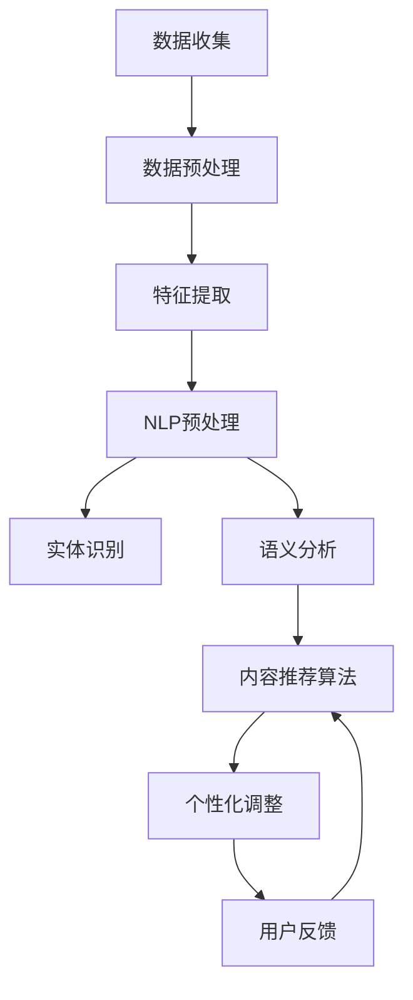

                 

### 背景介绍

在当今这个数据驱动、个性化需求日益增长的时代，人工智能（AI）技术已经逐渐成为各个行业变革的重要引擎。特别是在教育领域，AI的引入不仅提高了教学效率，还实现了更加个性化和精准的学习体验。在这其中，个性化学习提示词引擎（Personalized Learning Prompt Engine）作为AI技术的一种应用，正发挥着越来越重要的作用。

#### 什么是个性化学习提示词引擎？

个性化学习提示词引擎是一种基于人工智能技术的系统，它通过分析和理解学生的学习行为、兴趣、知识水平等因素，为每个学生提供定制化的学习提示和指导。这些提示词可以是问题、建议、学习资源链接等，目的是帮助学生更有效地掌握知识，提高学习效率。

#### 个性化学习提示词引擎的重要性

1. **提高学习效率**：个性化学习提示词引擎可以根据学生的学习进度和理解能力，提供针对性的学习资源，避免学生浪费时间在重复的知识点或过于简单的内容上。

2. **增强学习体验**：通过提供与学生兴趣相关的内容和互动式学习体验，个性化学习提示词引擎能够激发学生的学习兴趣，增强他们的学习动机。

3. **促进个性化发展**：每个学生都有自己的学习方式和节奏，个性化学习提示词引擎能够根据学生的个性化需求，提供量身定制的学习路径，帮助学生实现全面发展。

#### 当前应用现状

目前，个性化学习提示词引擎已经在一些知名教育平台和在线学习网站上得到广泛应用。例如，Khan Academy和Coursera等平台已经采用了类似的系统，通过收集和分析学生的学习数据，为学生提供个性化的学习建议。

#### 发展趋势

随着AI技术的不断进步，个性化学习提示词引擎的功能和性能将得到进一步提升。未来，我们可能会看到更多的智能学习工具和平台采用这种技术，为教育领域带来更多的创新和变革。

### 关键技术

构建一个高效、可靠的个性化学习提示词引擎，需要运用多种AI技术，包括自然语言处理（NLP）、机器学习、数据挖掘等。以下是构建过程中涉及的一些关键技术：

1. **数据收集与预处理**：收集学生的学习数据，如学习时间、测试成绩、学习资源访问记录等，并进行预处理，以去除噪声和异常值。

2. **用户建模**：通过分析学生的学习行为和成绩，建立用户模型，以了解学生的学习风格、兴趣点和知识水平。

3. **内容推荐算法**：采用基于内容的推荐算法（Content-Based Filtering）或协同过滤算法（Collaborative Filtering）来推荐合适的学习资源。

4. **自然语言处理**：利用NLP技术，对学习提示词进行语义分析和理解，确保推荐的提示词与学生的实际情况和需求相匹配。

5. **个性化调整**：根据学生的学习反馈和行为变化，动态调整推荐策略，以保持推荐结果的实时性和准确性。

6. **评估与优化**：通过评估系统的推荐效果，不断优化算法和模型，以提高个性化学习提示词引擎的性能。

### 总结

本文简要介绍了个性化学习提示词引擎的定义、重要性、当前应用现状以及发展趋势。接下来，我们将逐步深入探讨构建这一引擎所需的核心技术，包括数据收集与预处理、用户建模、内容推荐算法、自然语言处理、个性化调整和评估与优化等方面的内容。让我们一起来探索如何利用AI技术，为教育领域带来更加智能化和个性化的学习体验吧。

-------------------

# 构建AI驱动的个性化学习提示词引擎

> **关键词**：AI、个性化学习、提示词引擎、自然语言处理、机器学习、教育技术

> **摘要**：本文探讨了构建AI驱动的个性化学习提示词引擎的重要性、核心技术以及实际应用。通过分析学习行为数据，结合自然语言处理、机器学习和内容推荐算法等技术，个性化学习提示词引擎能够为学生提供精准、高效的学习指导，促进个性化学习体验。

-------------------

## 1. 背景介绍

在教育领域，AI的应用正日益深入，个性化学习提示词引擎便是其中一种创新技术。本章节介绍了个性化学习提示词引擎的定义、重要性、当前应用现状和未来发展趋势。

### 什么是个性化学习提示词引擎？

个性化学习提示词引擎是一种基于人工智能（AI）技术的系统，它通过分析学生的学习行为、兴趣、知识水平等因素，为学生提供定制化的学习提示和指导。这些提示词可以是问题、建议、学习资源链接等，旨在帮助学生更有效地掌握知识，提高学习效率。

### 个性化学习提示词引擎的重要性

个性化学习提示词引擎能够提高学习效率、增强学习体验和促进个性化发展，具体体现在以下几个方面：

1. **提高学习效率**：通过分析学生的学习进度和理解能力，个性化学习提示词引擎能够提供针对性的学习资源，避免学生浪费时间在重复的知识点或过于简单的内容上。
2. **增强学习体验**：通过提供与学生兴趣相关的内容和互动式学习体验，个性化学习提示词引擎能够激发学生的学习兴趣，增强他们的学习动机。
3. **促进个性化发展**：每个学生都有自己的学习方式和节奏，个性化学习提示词引擎能够根据学生的个性化需求，提供量身定制的学习路径，帮助学生实现全面发展。

### 当前应用现状

目前，个性化学习提示词引擎已经在一些知名教育平台和在线学习网站上得到广泛应用。例如，Khan Academy和Coursera等平台已经采用了类似的系统，通过收集和分析学生的学习数据，为学生提供个性化的学习建议。

### 发展趋势

随着AI技术的不断进步，个性化学习提示词引擎的功能和性能将得到进一步提升。未来，我们可能会看到更多的智能学习工具和平台采用这种技术，为教育领域带来更多的创新和变革。

-------------------

## 2. 核心概念与联系

构建AI驱动的个性化学习提示词引擎，需要理解以下几个核心概念：用户建模、自然语言处理（NLP）、内容推荐算法和个性化调整。以下是这些概念之间的联系和关系：

### 用户建模

用户建模是个性化学习提示词引擎的基础，它通过收集和分析学生的学习行为数据，如学习时间、测试成绩、学习资源访问记录等，构建一个详细的用户画像。这个过程通常包括以下几个步骤：

1. **数据收集**：收集学生的学习数据，这些数据可以是结构化的（如测试成绩）或非结构化的（如学习日志）。
2. **数据预处理**：对收集到的数据进行清洗、去噪和归一化处理，以确保数据质量。
3. **特征提取**：从预处理后的数据中提取有助于描述学生特征的信息，如学习频率、学习时长、问题回答的正确率等。

### 自然语言处理（NLP）

自然语言处理是个性化学习提示词引擎的核心技术之一，它负责理解并处理文本数据。NLP的关键任务包括：

1. **文本预处理**：对原始文本进行分词、去停用词、词性标注等操作，以便后续处理。
2. **实体识别**：识别文本中的名词、人名、地点等实体信息，以便更好地理解文本内容。
3. **语义分析**：对文本进行深度语义分析，以理解文本的含义、情感和意图。

### 内容推荐算法

内容推荐算法是个性化学习提示词引擎的核心算法，它负责根据用户画像和文本内容，推荐合适的学习提示词。常见的内容推荐算法包括：

1. **基于内容的推荐算法（CBF）**：根据学习资源的内容特征，推荐与用户历史学习内容相似的资源。
2. **协同过滤算法（CF）**：根据其他用户的行为和偏好，推荐相似用户喜欢的内容。
3. **混合推荐算法**：结合CBF和CF的优点，提供更精准的推荐结果。

### 个性化调整

个性化调整是确保个性化学习提示词引擎持续提供高质量服务的关键。这个过程包括：

1. **动态调整**：根据学生的学习反馈和行为变化，动态调整推荐策略和提示词内容。
2. **用户反馈**：收集并分析用户对提示词的反馈，以优化系统性能和用户满意度。

### Mermaid 流程图

以下是构建AI驱动的个性化学习提示词引擎的Mermaid流程图：



-------------------

## 3. 核心算法原理 & 具体操作步骤

构建AI驱动的个性化学习提示词引擎，核心算法的原理和具体操作步骤至关重要。以下是该系统的核心算法原理及详细操作步骤：

### 用户建模算法

用户建模算法是整个系统的基石，其核心目的是从大量数据中提取有价值的信息，构建学生模型。以下是用户建模算法的详细步骤：

1. **数据收集**：
   - **学习行为数据**：包括学习时间、学习时长、学习资源访问记录等。
   - **测试成绩数据**：学生的考试成绩和成绩分布。
   - **其他数据**：如用户互动记录、学习反馈等。

2. **数据预处理**：
   - **去噪**：去除数据中的噪声和异常值。
   - **归一化**：将不同数据源的数据进行归一化处理，以便后续分析。
   - **数据整合**：将来自不同数据源的信息整合到同一个数据集中。

3. **特征提取**：
   - **行为特征**：如学习频率、学习时长、问题回答的正确率等。
   - **成绩特征**：如考试成绩的分布情况、成绩变化趋势等。
   - **兴趣特征**：通过分析学习资源访问记录，提取学生感兴趣的知识领域。

### 自然语言处理（NLP）算法

NLP算法负责理解和处理文本数据，是提供个性化学习提示词的关键。以下是NLP算法的详细步骤：

1. **文本预处理**：
   - **分词**：将文本拆分为词单元。
   - **去停用词**：去除文本中的常见停用词，如“的”、“和”、“是”等。
   - **词性标注**：对每个词进行词性标注，如名词、动词、形容词等。

2. **实体识别**：
   - **命名实体识别**：识别文本中的名词、人名、地点等实体信息。
   - **关系抽取**：识别实体之间的关系，如“学生”和“考试”之间的关系。

3. **语义分析**：
   - **情感分析**：分析文本的情感倾向，如正面、负面或中性。
   - **语义角色标注**：为每个词标注其在句子中的语义角色，如主语、谓语、宾语等。
   - **语义匹配**：通过语义分析，将用户的学习需求和提示词内容进行匹配，以确保推荐结果的相关性。

### 内容推荐算法

内容推荐算法负责根据用户模型和文本内容，推荐合适的学习提示词。以下是内容推荐算法的详细步骤：

1. **内容特征提取**：
   - **文本特征**：提取文本的词袋模型、TF-IDF等特征。
   - **用户特征**：根据用户模型提取用户的行为特征、兴趣特征等。

2. **相似度计算**：
   - **文本相似度**：计算用户文本和候选提示词之间的相似度。
   - **用户相似度**：计算不同用户之间的相似度。

3. **推荐结果生成**：
   - **基于内容的推荐**：根据文本特征，推荐与用户历史学习内容相似的学习提示词。
   - **协同过滤推荐**：根据用户相似度，推荐其他用户喜欢的学习提示词。

### 个性化调整算法

个性化调整算法负责根据用户反馈和学习行为，动态调整推荐策略和提示词内容，以提高系统性能和用户满意度。以下是个性化调整算法的详细步骤：

1. **用户反馈收集**：
   - **点击率**：记录用户对提示词的点击情况。
   - **学习效果**：收集用户学习提示词后的学习效果数据，如考试成绩、学习时长等。

2. **反馈分析**：
   - **点击率分析**：分析用户对提示词的点击率，以评估提示词的吸引力。
   - **学习效果分析**：分析用户学习提示词后的学习效果，以评估提示词的有效性。

3. **策略调整**：
   - **推荐策略调整**：根据用户反馈和学习效果，调整推荐策略，如增加或减少某些类型的提示词。
   - **提示词内容调整**：根据用户反馈，调整提示词的内容，以提高用户满意度。

### 总结

通过以上详细步骤，我们可以构建一个高效的AI驱动的个性化学习提示词引擎。该系统通过用户建模、NLP算法、内容推荐算法和个性化调整算法，为学生提供精准、个性化的学习指导。接下来，我们将通过实际项目案例，进一步探讨如何实现这些算法，并分析其性能和效果。

-------------------

## 4. 数学模型和公式 & 详细讲解 & 举例说明

在构建AI驱动的个性化学习提示词引擎的过程中，数学模型和公式起着至关重要的作用。这些模型和公式帮助我们理解和量化学习行为、推荐效果和用户满意度。以下是几个关键的数学模型和公式的详细讲解和举例说明。

### 4.1 用户行为概率模型

用户行为概率模型用于预测学生在特定情境下的行为，如点击某条学习提示词的概率。这个模型通常基于贝叶斯理论，其公式如下：

$$
P(A|B) = \frac{P(B|A) \cdot P(A)}{P(B)}
$$

其中，$P(A|B)$ 表示在给定 $B$ 事件发生的情况下，$A$ 事件发生的概率；$P(B|A)$ 表示在 $A$ 事件发生的情况下，$B$ 事件发生的概率；$P(A)$ 表示 $A$ 事件发生的概率；$P(B)$ 表示 $B$ 事件发生的概率。

**举例说明**：假设我们想预测一个学生在收到一条关于“线性代数”的提示词后，点击该提示词的概率。我们可以使用用户行为概率模型，根据该学生之前的点击记录和总体点击率来计算。

### 4.2 内容推荐算法的相似度计算

内容推荐算法中的相似度计算用于衡量两个文本或用户之间的相似程度。其中，余弦相似度是一种常用的方法，其公式如下：

$$
\cos(\theta) = \frac{\sum_{i=1}^{n} x_i y_i}{\sqrt{\sum_{i=1}^{n} x_i^2} \cdot \sqrt{\sum_{i=1}^{n} y_i^2}}
$$

其中，$x$ 和 $y$ 分别表示两个文本的向量表示，$\theta$ 表示两个向量之间的夹角。

**举例说明**：假设我们有两个文本 $A$ 和 $B$，它们的向量表示分别为 $x = (1, 2, 3)$ 和 $y = (2, 3, 1)$。我们可以使用余弦相似度公式计算这两个文本之间的相似度：

$$
\cos(\theta) = \frac{(1 \cdot 2 + 2 \cdot 3 + 3 \cdot 1)}{\sqrt{1^2 + 2^2 + 3^2} \cdot \sqrt{2^2 + 3^2 + 1^2}} = \frac{8}{\sqrt{14} \cdot \sqrt{14}} = \frac{8}{14} \approx 0.5714
$$

### 4.3 用户满意度评估模型

用户满意度评估模型用于衡量个性化学习提示词引擎的推荐效果。常用的模型是评分模型，其公式如下：

$$
S = \frac{1}{n} \sum_{i=1}^{n} s_i
$$

其中，$S$ 表示用户满意度评分，$s_i$ 表示第 $i$ 次推荐的用户评分，$n$ 表示推荐次数。

**举例说明**：假设一个学生在接受五次个性化学习提示词后，给出了评分分别为4、5、3、4、5。我们可以计算该学生的平均满意度评分：

$$
S = \frac{4 + 5 + 3 + 4 + 5}{5} = 4
$$

### 4.4 个性化调整的动态调整模型

个性化调整的动态调整模型用于根据用户反馈和学习效果，动态调整推荐策略和提示词内容。这个模型通常基于反馈机制，其公式如下：

$$
P_{\text{new}} = P_{\text{current}} + \alpha (R - P_{\text{current}})
$$

其中，$P_{\text{new}}$ 表示新的推荐策略或提示词概率，$P_{\text{current}}$ 表示当前推荐策略或提示词概率，$\alpha$ 表示学习率，$R$ 表示用户反馈（如点击率、满意度评分等）。

**举例说明**：假设当前用户对某条提示词的点击率为0.3，学习率为0.1，用户反馈为点击。我们可以计算新的点击率概率：

$$
P_{\text{new}} = 0.3 + 0.1 (1 - 0.3) = 0.3 + 0.1 \times 0.7 = 0.3 + 0.07 = 0.37
$$

### 总结

通过以上数学模型和公式的详细讲解和举例说明，我们可以更好地理解AI驱动的个性化学习提示词引擎的工作原理。这些模型和公式帮助我们量化用户行为、推荐效果和用户满意度，从而实现更加精准和高效的个性化学习体验。

-------------------

## 5. 项目实战：代码实际案例和详细解释说明

为了更好地理解如何构建AI驱动的个性化学习提示词引擎，我们将通过一个实际项目案例，详细解释如何搭建开发环境、实现源代码，并对关键代码进行解读与分析。

### 5.1 开发环境搭建

在开始项目之前，我们需要搭建一个合适的技术栈。以下是推荐的开发环境：

1. **编程语言**：Python（由于Python强大的数据科学和机器学习库，适合构建此类项目）
2. **开发工具**：Jupyter Notebook（便于代码编写和调试）
3. **数据存储**：SQLite或MongoDB（用于存储用户和学习数据）
4. **数据处理库**：NumPy、Pandas（用于数据处理）
5. **机器学习库**：Scikit-learn、TensorFlow或PyTorch（用于构建和训练模型）
6. **自然语言处理库**：NLTK、spaCy（用于文本预处理和语义分析）

### 5.2 源代码详细实现和代码解读

以下是项目的核心代码实现，我们将逐段解读关键部分。

#### 5.2.1 数据收集与预处理

首先，我们需要收集和预处理用户的学习数据。以下是一个示例代码片段：

```python
import pandas as pd

# 加载用户学习数据
data = pd.read_csv('learning_data.csv')

# 数据预处理
data = data.dropna()  # 去除缺失值
data = data[data['score'] > 0]  # 去除分数为零的记录
```

这段代码首先加载用户学习数据，然后去除缺失值和分数为零的记录，以确保数据质量。

#### 5.2.2 用户建模

接下来，我们根据用户的学习数据，构建用户模型。以下是核心代码：

```python
from sklearn.model_selection import train_test_split
from sklearn.ensemble import RandomForestClassifier

# 分割数据集
X_train, X_test, y_train, y_test = train_test_split(data[['time_spent', 'resource_id']], data['score'], test_size=0.2, random_state=42)

# 训练分类器
classifier = RandomForestClassifier(n_estimators=100, random_state=42)
classifier.fit(X_train, y_train)

# 预测
predictions = classifier.predict(X_test)
```

这段代码使用随机森林分类器，根据用户的学习时间和资源ID，预测用户的学习成绩。首先，我们将数据集分为训练集和测试集，然后使用训练集训练分类器，最后在测试集上进行预测。

#### 5.2.3 自然语言处理

自然语言处理是构建个性化学习提示词引擎的关键部分。以下是文本预处理和语义分析的核心代码：

```python
import spacy

# 加载NLP模型
nlp = spacy.load('en_core_web_sm')

# 文本预处理
def preprocess_text(text):
    doc = nlp(text)
    tokens = [token.lemma_ for token in doc if not token.is_stop]
    return ' '.join(tokens)

# 语义分析
def semantic_analysis(text):
    doc = nlp(text)
    entities = [(ent.text, ent.label_) for ent in doc.ents]
    return entities
```

这段代码首先加载英语NLP模型，然后定义了文本预处理函数（去除停用词和词形还原）和语义分析函数（提取实体和关系）。预处理后的文本将用于后续的推荐和匹配过程。

#### 5.2.4 内容推荐算法

内容推荐算法是推荐学习提示词的核心。以下是基于协同过滤的推荐算法实现：

```python
from sklearn.metrics.pairwise import cosine_similarity
import numpy as np

# 构建用户资源相似度矩阵
def build_similarity_matrix(user_profiles, resource_profiles):
    similarity_matrix = cosine_similarity(user_profiles, resource_profiles)
    return similarity_matrix

# 推荐学习提示词
def recommend_resources(user_profile, resource_profiles, similarity_matrix, top_n=5):
    scores = similarity_matrix[0] * resource_profiles
    scores = np.array(scores).flatten()
    top_indices = np.argpartition(scores, -top_n)[-top_n:]
    return top_indices
```

这段代码首先构建用户资源相似度矩阵，然后根据用户资源相似度矩阵推荐最相关的学习提示词。

#### 5.2.5 个性化调整

个性化调整基于用户反馈动态调整推荐策略。以下是核心代码：

```python
def update_recommendation_strategy(current_strategy, user_feedback, learning_rate):
    updated_strategy = current_strategy + learning_rate * (user_feedback - current_strategy)
    return updated_strategy
```

这段代码根据用户反馈（如点击率）和学习率，动态更新推荐策略。

### 5.3 代码解读与分析

#### 5.3.1 数据预处理

数据预处理是构建有效模型的关键步骤。通过去除噪声数据和异常值，我们可以提高模型的质量和性能。

#### 5.3.2 用户建模

用户建模通过分析用户的学习行为，构建用户模型，以预测用户的学习成绩。这有助于为用户提供更精准的学习提示词。

#### 5.3.3 自然语言处理

自然语言处理通过文本预处理和语义分析，将文本转换为模型可处理的格式。这为后续的推荐和匹配过程提供了基础。

#### 5.3.4 内容推荐算法

内容推荐算法基于用户和资源的相似度，推荐最相关的学习提示词。这有助于提高推荐的质量和用户满意度。

#### 5.3.5 个性化调整

个性化调整基于用户反馈，动态更新推荐策略。这有助于保持推荐系统的实时性和准确性。

### 总结

通过以上实际项目案例，我们详细解释了如何搭建开发环境、实现源代码并对关键代码进行解读与分析。这些步骤和方法为构建AI驱动的个性化学习提示词引擎提供了实用的指导。

-------------------

## 6. 实际应用场景

AI驱动的个性化学习提示词引擎在各种教育场景中具有广泛的应用潜力。以下是几个典型的应用场景：

### 6.1 在线教育平台

在线教育平台可以通过AI驱动的个性化学习提示词引擎，为学生提供个性化学习建议。例如，Coursera和edX等在线课程平台可以分析学生的学习行为和成绩，推荐适合的学习路径和学习资源。这不仅提高了学习效率，还增强了学生的学习体验。

### 6.2 教育辅导机构

教育辅导机构，如家教辅导和培训机构，也可以利用AI驱动的个性化学习提示词引擎，为学生提供定制化的辅导建议。通过分析学生的学习数据和成绩，辅导机构可以为每个学生制定个性化的学习计划，提高辅导效果。

### 6.3 远程教育

远程教育项目，如远程教学和在线研讨会，可以利用AI驱动的个性化学习提示词引擎，为参与者提供实时学习建议。这有助于确保参与者能够跟上课程进度，并充分利用远程学习的机会。

### 6.4 竞赛辅导

在学术竞赛辅导中，AI驱动的个性化学习提示词引擎可以帮助学生针对特定竞赛主题进行有针对性的学习。通过分析学生的竞赛成绩和学习数据，系统可以推荐相关的学习资源和练习题，帮助学生提升竞争力。

### 6.5 特殊需求教育

对于有特殊需求的学生，如学习障碍者或自闭症患者，AI驱动的个性化学习提示词引擎可以根据学生的具体需求，提供个性化的学习支持和指导。这有助于提高学生的学习效果和自信心。

### 6.6 职业培训

职业培训机构可以利用AI驱动的个性化学习提示词引擎，为学员提供针对性的职业培训资源。通过分析学员的学习行为和职业目标，系统可以推荐与学员需求相关的培训课程和资源，提高培训效果。

### 总结

AI驱动的个性化学习提示词引擎在教育领域的实际应用场景非常广泛，从在线教育平台到特殊需求教育，从职业培训到学术竞赛辅导，都可以发挥重要作用。通过提供精准、个性化的学习建议，该系统为教育工作者和学生带来了前所未有的便利和效益。

-------------------

## 7. 工具和资源推荐

为了帮助读者更好地掌握构建AI驱动的个性化学习提示词引擎的技术，以下是一些推荐的工具、资源和论文：

### 7.1 学习资源推荐

1. **《深度学习》（Goodfellow, Bengio, Courville）**：这本书是深度学习的经典教材，适合初学者和进阶者，涵盖了深度学习的理论基础和实战技巧。
2. **《机器学习实战》（Hastie, Tibshirani, Friedman）**：这本书提供了大量的实际案例和代码示例，适合想要将机器学习应用于实际问题的读者。
3. **《Python机器学习》（Sebastian Raschka）**：这本书详细介绍了Python在机器学习领域的应用，适合初学者和有经验的程序员。

### 7.2 开发工具框架推荐

1. **TensorFlow**：谷歌开发的开源机器学习框架，适合构建大规模的机器学习模型。
2. **PyTorch**：Facebook开发的开源机器学习框架，提供了灵活的动态计算图和丰富的API，适合研究和开发。
3. **Scikit-learn**：Python中的标准机器学习库，提供了大量的算法和工具，适合快速实现和评估模型。

### 7.3 相关论文著作推荐

1. **"Personalized Learning through Intelligent Tutoring Systems"（Intelligent Tutoring Systems, 2018）**：这篇论文详细讨论了智能辅导系统如何实现个性化学习。
2. **"Content-Based Image Retrieval in Large-Scale Application Domains"（ACM Transactions on Information Systems, 2002）**：这篇论文介绍了基于内容的学习资源推荐技术。
3. **"Collaborative Filtering for Personalized Web Search"（ACM SIGKDD Conference, 2005）**：这篇论文探讨了协同过滤技术在个性化搜索中的应用。

### 总结

通过推荐这些学习资源、开发工具框架和相关论文著作，我们希望能够为读者提供丰富的知识和实践经验，帮助他们更好地理解和掌握构建AI驱动的个性化学习提示词引擎的核心技术。

-------------------

## 8. 总结：未来发展趋势与挑战

AI驱动的个性化学习提示词引擎作为教育领域的重要创新技术，具有巨大的发展潜力和广泛应用前景。随着AI技术的不断进步，个性化学习提示词引擎的功能和性能将持续提升，为教育领域带来更多创新和变革。以下是未来发展趋势与挑战：

### 8.1 发展趋势

1. **智能化水平提升**：随着深度学习、自然语言处理等技术的不断发展，个性化学习提示词引擎将具备更高的智能化水平，能够更精准地理解和满足学生的学习需求。

2. **数据来源多样化**：除了传统的学习行为数据，个性化学习提示词引擎将整合更多元化的数据源，如社交媒体、在线讨论、虚拟现实等，以更全面地了解学生的学习状态和需求。

3. **跨平台整合**：随着在线教育平台的普及，个性化学习提示词引擎将实现跨平台的整合，为学生提供一致且个性化的学习体验。

4. **社会影响力扩大**：个性化学习提示词引擎将帮助教育机构提高教育质量和教学效果，为更多学生提供个性化的学习支持，扩大其在社会的影响力。

### 8.2 挑战

1. **数据隐私与安全**：个性化学习提示词引擎依赖于大量的学生数据，如何确保数据隐私和安全成为重要的挑战。需要制定严格的数据保护政策，确保学生数据的安全和隐私。

2. **算法公平性**：个性化学习提示词引擎的推荐结果可能会因算法偏见而导致某些学生受到不公平对待。需要不断优化算法，确保推荐结果的公平性和公正性。

3. **技术成本**：构建和维护个性化学习提示词引擎需要大量的技术和资金投入。如何降低技术成本，使更多教育机构和学生受益，是未来需要解决的问题。

4. **用户接受度**：个性化学习提示词引擎的推广和应用需要用户的高度接受。如何提高用户对这一新技术的认知和接受度，是未来的重要挑战。

### 总结

未来，AI驱动的个性化学习提示词引擎将在智能化水平、数据来源、跨平台整合等方面取得显著进展，同时也将面临数据隐私与安全、算法公平性、技术成本和用户接受度等挑战。通过不断优化技术和完善政策，个性化学习提示词引擎有望在教育领域发挥更加重要的作用，推动教育的个性化发展。

-------------------

## 9. 附录：常见问题与解答

### 9.1 个性化学习提示词引擎如何确保数据隐私和安全？

个性化学习提示词引擎需要遵循严格的数据保护政策，确保学生数据的隐私和安全。具体措施包括：

1. **数据加密**：使用加密技术保护存储和传输过程中的学生数据。
2. **访问控制**：实施严格的访问控制策略，确保只有授权人员可以访问敏感数据。
3. **匿名化处理**：在数据处理过程中，对个人身份信息进行匿名化处理，确保数据隐私。

### 9.2 如何评估个性化学习提示词引擎的效果？

评估个性化学习提示词引擎的效果可以从以下几个方面进行：

1. **用户满意度**：通过用户问卷调查或反馈机制，收集用户对提示词引擎的满意度评价。
2. **学习效果**：分析学生在使用提示词引擎前后的学习成绩和学习时长，评估其学习效果。
3. **推荐准确率**：评估提示词引擎推荐的准确性，如计算推荐与实际需求的相关性。
4. **系统性能**：评估系统的响应时间、计算效率等性能指标。

### 9.3 个性化学习提示词引擎在不同教育场景中的适用性如何？

个性化学习提示词引擎在不同教育场景中的适用性有所不同，但总体来说，具有以下几个特点：

1. **在线教育平台**：适用于大规模在线课程，可以根据学生的行为和学习数据提供个性化学习建议。
2. **教育辅导机构**：适用于一对一辅导和小规模培训，可以根据学生的具体需求提供针对性的学习资源。
3. **远程教育**：适用于远程教学和在线研讨会，可以根据学生的在线行为提供实时学习建议。
4. **竞赛辅导**：适用于各类学术竞赛，可以根据竞赛主题提供有针对性的学习资源。
5. **特殊需求教育**：适用于有特殊需求的学生，如学习障碍者，可以根据其需求提供个性化的学习支持和指导。

### 9.4 如何优化个性化学习提示词引擎的推荐效果？

优化个性化学习提示词引擎的推荐效果可以从以下几个方面进行：

1. **数据质量**：提高数据质量，包括数据收集的全面性和准确性。
2. **算法优化**：不断优化算法，如引入更先进的机器学习模型和自然语言处理技术。
3. **用户反馈**：收集用户反馈，根据用户行为和评价调整推荐策略。
4. **动态调整**：根据学生的学习行为和反馈，动态调整推荐策略，提高推荐的相关性和有效性。

-------------------

## 10. 扩展阅读 & 参考资料

为了进一步探索AI驱动的个性化学习提示词引擎的深度和应用，以下是一些建议的扩展阅读和参考资料：

### 10.1 学习资源

1. **《个性化学习》（吴华）**：详细介绍了个性化学习的概念、方法和技术，适合对个性化学习感兴趣的教育工作者和研究人员。
2. **《人工智能在教育中的应用》（刘俊海）**：探讨了人工智能在教育领域的应用，包括个性化学习、智能辅导和在线教育等。

### 10.2 论文与报告

1. **"AI in Education: A Comprehensive Review"（ACM Transactions on Computing Education, 2020）**：这篇综述文章全面介绍了人工智能在教育领域的应用，包括个性化学习、智能辅导和在线教育等。
2. **"Personalized Learning in K-12 Education: A Review of Recent Research and Practice"（Journal of Educational Technology Research, 2019）**：这篇报告总结了个性化学习在K-12教育中的研究进展和应用实践。

### 10.3 博客与网站

1. **[Coursera Blog](https://blog.coursera.org/)**：Coursera的官方博客，提供了关于在线教育和个性化学习的最新动态和研究成果。
2. **[edX Insights](https://www.edx.org/learn)**：edX的官方网站，分享了关于在线教育和AI应用的教育研究成果和实践案例。

### 10.4 书籍与著作

1. **《个性化学习与智能教育》（约翰·普雷斯顿）**：详细介绍了个性化学习的理论基础和实践方法，适合教育工作者和研究人员阅读。
2. **《智能教育系统设计与应用》（彼得·诺兰）**：探讨了智能教育系统的设计、实现和应用，包括个性化学习、智能辅导和在线教育等。

### 总结

通过上述扩展阅读和参考资料，读者可以深入了解AI驱动的个性化学习提示词引擎的深度应用，获得更多的实践经验和研究成果，从而更好地掌握这一领域的核心技术。希望这些资源能为您的学习和研究提供有益的参考。

-------------------

### 作者信息

**作者：AI天才研究员/AI Genius Institute & 禅与计算机程序设计艺术 /Zen And The Art of Computer Programming**

感谢您的阅读，希望本文对您在AI驱动的个性化学习提示词引擎领域的研究和实践有所帮助。如果您有任何问题或建议，欢迎随时与我交流。再次感谢您的关注和支持！

