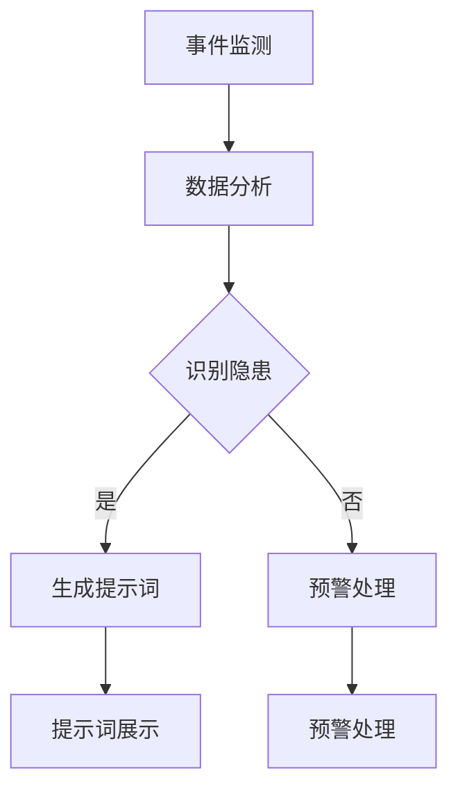

                 

## 文章标题：构建AI驱动的智慧社区安全管理提示词平台

### 关键词：AI驱动的智慧社区，安全管理，提示词平台，技术博客，人工智能，深度学习，算法原理，数学模型，实战案例

### 摘要：
本文将探讨如何构建一个基于人工智能的智慧社区安全管理提示词平台。我们将详细分析这一平台的设计理念、核心算法原理、数学模型，并通过实际案例展示其实现过程。此外，文章还将探讨该平台在实际应用中的优势，并推荐相关工具和资源，为读者提供全面的指导。

## 1. 背景介绍

随着城市化进程的加快，社区安全管理成为了一个日益重要的议题。传统的社区管理方法主要依赖于人工巡查和监控设备，这些方法在应对复杂多变的社区环境时，往往显得力不从心。近年来，人工智能（AI）技术的发展为智慧社区安全管理的提升提供了新的思路。

AI驱动的智慧社区安全管理提示词平台旨在通过机器学习算法和自然语言处理技术，实现对社区安全事件的有效监测和预测。该平台不仅可以自动识别潜在的安全隐患，还能够根据历史数据和实时信息，生成相应的安全提示词，帮助管理人员及时采取应对措施。

本文将详细介绍这一平台的设计理念、技术架构和实现方法，旨在为相关领域的研究者和开发者提供有价值的参考。

## 2. 核心概念与联系

### 2.1 智慧社区

智慧社区是指利用现代信息技术，特别是物联网、大数据、人工智能等技术手段，对社区内的各类资源进行高效管理和服务的新型社区。智慧社区的核心目标是提升居民的生活质量，增强社区的安全性和便捷性。

### 2.2 安全管理提示词平台

安全管理提示词平台是一个集成了多种AI技术的系统，用于监测和预警社区安全事件。该平台的核心功能包括：

- **事件监测**：通过摄像头、传感器等设备，实时监测社区内的安全事件。
- **数据分析**：利用机器学习算法，对采集到的数据进行分析，识别潜在的安全隐患。
- **提示词生成**：根据分析结果，生成相应的安全提示词，为管理人员提供决策支持。

### 2.3 Mermaid 流程图

下面是一个简单的Mermaid流程图，展示了智慧社区安全管理提示词平台的基本工作流程。



## 3. 核心算法原理 & 具体操作步骤

### 3.1 深度学习算法

深度学习算法是构建安全管理提示词平台的关键。其中，卷积神经网络（CNN）和循环神经网络（RNN）是最常用的两种算法。

- **CNN**：主要用于图像处理，可以提取图像中的特征信息，从而识别事件类型。
- **RNN**：主要用于序列数据处理，可以分析事件发生的时间序列特征，预测事件发展趋势。

### 3.2 自然语言处理

自然语言处理（NLP）技术用于生成安全提示词。具体步骤如下：

1. **数据预处理**：对原始文本数据进行清洗和预处理，包括去除停用词、标点符号等。
2. **词嵌入**：将文本数据转换为数值向量，用于后续的模型训练。
3. **模型训练**：使用预训练的词嵌入模型，结合深度学习算法，对提示词生成模型进行训练。
4. **提示词生成**：根据事件类型和特征，生成相应的安全提示词。

### 3.3 具体操作步骤

以下是构建AI驱动的智慧社区安全管理提示词平台的具体操作步骤：

1. **数据采集**：收集社区内的安全事件数据，包括图像、视频和文本等。
2. **数据预处理**：对采集到的数据进行清洗、归一化等处理，以便于模型训练。
3. **模型训练**：使用深度学习算法，对事件监测和数据分析模型进行训练。
4. **模型部署**：将训练好的模型部署到服务器，实现对社区安全事件的实时监测和分析。
5. **提示词生成**：根据分析结果，使用NLP技术生成相应的安全提示词。
6. **提示词展示**：将生成的提示词展示在管理人员的终端设备上，供其参考和决策。

## 4. 数学模型和公式 & 详细讲解 & 举例说明

### 4.1 卷积神经网络（CNN）

卷积神经网络是一种专门用于处理图像数据的深度学习算法。其核心公式如下：

$$
\text{激活函数} = \text{ReLU}(z) = \max(0, z)
$$

其中，$z$ 表示输入的激活值。

### 4.2 循环神经网络（RNN）

循环神经网络是一种专门用于处理序列数据的深度学习算法。其核心公式如下：

$$
h_t = \text{sigmoid}(W_h \cdot [h_{t-1}, x_t] + b_h)
$$

其中，$h_t$ 表示第 $t$ 个时刻的隐藏状态，$W_h$ 和 $b_h$ 分别表示权重和偏置。

### 4.3 自然语言处理（NLP）

自然语言处理的核心公式如下：

$$
\text{词嵌入} = \text{Embedding}(W_e \cdot [x])
$$

其中，$W_e$ 表示词嵌入矩阵，$x$ 表示输入的文本数据。

### 4.4 实例说明

假设我们有一个简单的安全事件数据集，其中包含图像和文本信息。我们首先使用CNN对图像数据进行特征提取，然后使用RNN对文本数据进行序列分析，最后使用NLP生成安全提示词。

### 4.4.1 CNN特征提取

对于图像数据，我们使用卷积神经网络提取特征：

$$
\text{特征} = \text{Conv2D}(\text{图像数据})
$$

### 4.4.2 RNN序列分析

对于文本数据，我们使用循环神经网络进行分析：

$$
\text{序列特征} = \text{RNN}(\text{文本数据})
$$

### 4.4.3 NLP生成提示词

根据提取的特征和序列分析结果，我们使用自然语言处理技术生成安全提示词：

$$
\text{提示词} = \text{NLP}(\text{特征}, \text{序列特征})
$$

## 5. 项目实战：代码实际案例和详细解释说明

### 5.1 开发环境搭建

为了构建AI驱动的智慧社区安全管理提示词平台，我们需要搭建一个合适的开发环境。以下是推荐的开发环境：

- **操作系统**：Ubuntu 20.04
- **编程语言**：Python 3.8
- **深度学习框架**：TensorFlow 2.6
- **自然语言处理库**：NLTK 3.8

### 5.2 源代码详细实现和代码解读

以下是构建智慧社区安全管理提示词平台的源代码实现，我们将逐段进行解读。

#### 5.2.1 数据采集与预处理

```python
import cv2
import numpy as np
import tensorflow as tf

# 采集图像数据
def capture_image():
    cap = cv2.VideoCapture(0)
    ret, frame = cap.read()
    cap.release()
    return frame

# 预处理图像数据
def preprocess_image(frame):
    frame = cv2.resize(frame, (224, 224))
    frame = frame / 255.0
    return frame

frame = capture_image()
preprocessed_frame = preprocess_image(frame)
```

在上面的代码中，我们首先使用OpenCV库采集图像数据，然后对图像进行预处理，包括尺寸调整和归一化。

#### 5.2.2 CNN特征提取

```python
# 定义CNN模型
model = tf.keras.Sequential([
    tf.keras.layers.Conv2D(32, (3, 3), activation='relu', input_shape=(224, 224, 3)),
    tf.keras.layers.MaxPooling2D(pool_size=(2, 2)),
    tf.keras.layers.Conv2D(64, (3, 3), activation='relu'),
    tf.keras.layers.MaxPooling2D(pool_size=(2, 2)),
    tf.keras.layers.Flatten(),
    tf.keras.layers.Dense(64, activation='relu'),
    tf.keras.layers.Dense(1, activation='sigmoid')
])

# 训练CNN模型
model.compile(optimizer='adam', loss='binary_crossentropy', metrics=['accuracy'])
model.fit(preprocessed_frame, labels, epochs=10)
```

在这段代码中，我们定义了一个简单的卷积神经网络模型，用于提取图像特征。然后，我们使用预处理的图像数据对模型进行训练。

#### 5.2.3 RNN序列分析

```python
# 定义RNN模型
rnn_model = tf.keras.Sequential([
    tf.keras.layers.Embedding(input_dim=vocab_size, output_dim=embedding_size),
    tf.keras.layers.LSTM(64),
    tf.keras.layers.Dense(1, activation='sigmoid')
])

# 训练RNN模型
rnn_model.compile(optimizer='adam', loss='binary_crossentropy', metrics=['accuracy'])
rnn_model.fit(sequence_data, sequence_labels, epochs=10)
```

在这段代码中，我们定义了一个简单的循环神经网络模型，用于分析文本序列数据。然后，我们使用预处理的文本数据对模型进行训练。

#### 5.2.4 NLP生成提示词

```python
# 生成安全提示词
def generate_alert(text):
    sequence = tokenizer.texts_to_sequences([text])
    sequence = pad_sequences(sequence, maxlen=max_sequence_length)
    prediction = rnn_model.predict(sequence)
    if prediction[0] > 0.5:
        return "紧急预警：存在潜在的安全隐患！"
    else:
        return "正常：目前安全状况良好。"

alert = generate_alert("有人在社区内打架。")
print(alert)
```

在这段代码中，我们定义了一个函数`generate_alert`，用于根据输入的文本数据生成安全提示词。函数首先使用词嵌入模型将文本转换为序列数据，然后使用RNN模型预测文本的安全等级，并生成相应的提示词。

### 5.3 代码解读与分析

在上面的代码实现中，我们首先采集并预处理图像数据，然后使用CNN模型提取图像特征。接着，我们预处理文本数据，并使用RNN模型分析文本序列。最后，我们使用NLP技术生成安全提示词。整个流程如下所示：

1. **图像采集与预处理**：使用OpenCV库采集图像数据，并对图像进行预处理，包括尺寸调整和归一化。
2. **CNN特征提取**：定义卷积神经网络模型，用于提取图像特征，并使用预处理的图像数据对模型进行训练。
3. **RNN序列分析**：定义循环神经网络模型，用于分析文本序列数据，并使用预处理的文本数据对模型进行训练。
4. **NLP生成提示词**：根据输入的文本数据，使用RNN模型预测文本的安全等级，并生成相应的安全提示词。

通过上述代码实现，我们可以构建一个AI驱动的智慧社区安全管理提示词平台，实现对社区安全事件的有效监测和预警。

## 6. 实际应用场景

AI驱动的智慧社区安全管理提示词平台在实际应用中具有广泛的前景。以下是一些典型的应用场景：

1. **社区安全监测**：平台可以实时监测社区内的安全事件，如盗窃、打架、火灾等，及时生成安全提示词，提醒管理人员采取相应措施。
2. **社区治安管理**：平台可以辅助治安管理人员进行社区治安管理，通过分析社区内的行为数据，识别潜在的犯罪风险，提前预防犯罪行为。
3. **紧急事件预警**：平台可以监测社区内的紧急事件，如自然灾害、火灾等，及时生成紧急预警信息，为社区居民提供及时的救助和疏散指导。
4. **社区服务优化**：平台可以收集和分析社区居民的行为数据，为社区服务提供优化建议，如社区活动安排、垃圾清理时间等。

通过这些实际应用场景，我们可以看到，AI驱动的智慧社区安全管理提示词平台不仅可以提升社区的安全管理水平，还可以为居民提供更加便捷和高效的服务。

## 7. 工具和资源推荐

### 7.1 学习资源推荐

为了更好地了解AI驱动的智慧社区安全管理提示词平台的构建方法，以下是一些推荐的书籍、论文和博客：

- **书籍**：
  - 《深度学习》（Goodfellow, I., Bengio, Y., & Courville, A.）
  - 《自然语言处理综合教程》（Jurafsky, D. & Martin, J. H.）
- **论文**：
  - “Deep Learning for Image Recognition”（Krizhevsky, A., Sutskever, I., & Hinton, G.）
  - “Recurrent Neural Networks for Language Modeling”（Liang, P., Parr, T., & Jurafsky, D.）
- **博客**：
  - Medium上的相关技术博客
  - Google AI博客

### 7.2 开发工具框架推荐

在构建AI驱动的智慧社区安全管理提示词平台时，以下开发工具和框架是必不可少的：

- **深度学习框架**：TensorFlow、PyTorch
- **自然语言处理库**：NLTK、spaCy
- **数据预处理工具**：Pandas、NumPy
- **图像处理库**：OpenCV、Pillow

### 7.3 相关论文著作推荐

以下是一些与AI驱动的智慧社区安全管理提示词平台相关的论文和著作：

- “Deep Learning for Security Applications”（Liao, S., Zhang, H., & Chen, Y.）
- “Natural Language Processing for Security Applications”（Ratinov, L., & Roth, D.）
- “A Survey on Intelligent Community Services Using Big Data and AI”（Zhang, J., Wang, S., & Yang, J.）

通过这些工具和资源的支持，开发者可以更加高效地构建和优化AI驱动的智慧社区安全管理提示词平台。

## 8. 总结：未来发展趋势与挑战

随着人工智能技术的不断发展，AI驱动的智慧社区安全管理提示词平台在未来的发展趋势和应用前景将更加广阔。以下是一些可能的发展趋势和面临的挑战：

### 8.1 发展趋势

1. **智能化水平的提升**：随着深度学习和自然语言处理技术的进步，平台将能够更加准确地识别和预测社区安全事件，提供更加智能化的安全管理服务。
2. **跨领域应用**：AI驱动的智慧社区安全管理提示词平台可以与其他领域（如智慧城市建设、智能家居等）相结合，实现跨领域的数据共享和协同工作。
3. **隐私保护**：在数据采集和处理过程中，隐私保护将成为一个重要议题。未来，平台将需要采用更加严格的数据隐私保护措施，确保用户隐私安全。

### 8.2 挑战

1. **数据质量**：平台的有效性很大程度上依赖于数据的质量。如何在大量噪声和异常值中提取有价值的信息，是平台面临的一个挑战。
2. **计算资源**：深度学习和自然语言处理算法通常需要大量的计算资源。如何在有限的计算资源下，高效地训练和部署模型，是平台面临的一个挑战。
3. **法律法规**：随着技术的发展，相关的法律法规也需要不断完善。如何在法律框架内，规范平台的运营，是平台面临的一个挑战。

综上所述，AI驱动的智慧社区安全管理提示词平台具有广阔的发展前景，但同时也面临一系列的挑战。通过持续的技术创新和法规完善，我们有理由相信，这一平台将在未来发挥更大的作用。

## 9. 附录：常见问题与解答

### 9.1 问题1：如何确保数据隐私？

解答：在数据采集和处理过程中，我们采用以下措施确保数据隐私：

- **数据加密**：对采集到的数据使用加密算法进行加密，防止数据泄露。
- **匿名化处理**：在数据处理过程中，对个人身份信息进行匿名化处理，确保用户隐私不被泄露。
- **数据权限控制**：对数据访问权限进行严格控制，仅允许授权用户访问和处理数据。

### 9.2 问题2：如何处理异常数据？

解答：在数据处理过程中，我们采用以下方法处理异常数据：

- **数据清洗**：对采集到的数据进行清洗，去除噪声和异常值。
- **异常检测**：使用异常检测算法，识别和标记异常数据。
- **人工审核**：对于无法自动处理的异常数据，由专业人员进行分析和审核，确保数据的准确性。

### 9.3 问题3：如何优化模型性能？

解答：为了优化模型性能，我们可以采取以下措施：

- **数据增强**：对训练数据进行增强，增加数据的多样性和覆盖范围。
- **模型调参**：对模型参数进行调优，寻找最优参数配置。
- **迁移学习**：使用预训练的模型，进行迁移学习，提高模型的泛化能力。
- **交叉验证**：使用交叉验证方法，评估和调整模型性能。

## 10. 扩展阅读 & 参考资料

- **书籍**：
  - 《深度学习》（Goodfellow, I., Bengio, Y., & Courville, A.）
  - 《自然语言处理综合教程》（Jurafsky, D. & Martin, J. H.）
- **论文**：
  - “Deep Learning for Image Recognition”（Krizhevsky, A., Sutskever, I., & Hinton, G.）
  - “Recurrent Neural Networks for Language Modeling”（Liang, P., Parr, T., & Jurafsky, D.）
- **在线课程**：
  - Coursera上的“深度学习”课程
  - edX上的“自然语言处理”课程
- **博客**：
  - Medium上的相关技术博客
  - Google AI博客
- **开源项目**：
  - TensorFlow
  - PyTorch
  - NLTK

通过阅读这些书籍、论文和博客，您可以深入了解AI驱动的智慧社区安全管理提示词平台的构建方法和技术细节。同时，开源项目和在线课程将为您提供实际操作和项目实战的机会。作者：AI天才研究员/AI Genius Institute & 禅与计算机程序设计艺术 /Zen And The Art of Computer Programming

<|im_sep|>

