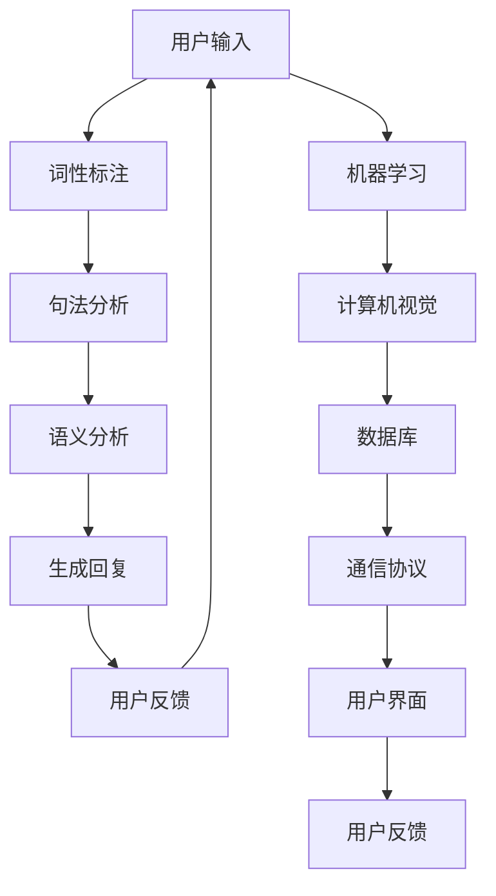

                 

### 背景介绍

**构建你自己的聊天机器人：入门指南**

随着人工智能技术的飞速发展，聊天机器人已经成为现代社会中不可或缺的一部分。从简单的客服机器人，到复杂的虚拟助手，聊天机器人在提高效率、减少人力成本等方面发挥了巨大作用。然而，许多人对于如何构建一个聊天机器人仍然感到迷茫。本文将带领读者从零开始，逐步了解并掌握构建聊天机器人的基础知识。

聊天机器人，也被称为聊天bots，是一种通过自然语言与人类用户进行交互的计算机程序。它们可以理解用户的输入，并生成相应的回复，从而实现自动化沟通。在过去的几年中，聊天机器人的应用场景不断扩展，从电商平台、社交网络，到医疗、金融等领域，它们都发挥着重要的作用。

本文旨在为初学者提供一个全面的构建聊天机器人的入门指南。我们将从背景介绍开始，逐步深入到核心概念、算法原理、数学模型、项目实战等方面，帮助读者全面了解并掌握构建聊天机器人的技术要点。通过本文的阅读，读者将能够掌握构建聊天机器人的基本技能，并在实际项目中运用所学知识。

在接下来的章节中，我们将首先介绍聊天机器人的发展历史和现状，然后详细探讨其核心概念和架构，最后通过实际项目案例，展示如何具体实现一个聊天机器人。希望通过本文的指导，读者能够顺利步入聊天机器人开发的世界，开启属于自己的编程之旅。

### 2. 核心概念与联系

在深入探讨聊天机器人的构建之前，我们需要首先理解其中的核心概念和它们之间的联系。以下是构建聊天机器人所涉及的一些关键概念及其相互关系：

#### 2.1 自然语言处理（NLP）

自然语言处理（Natural Language Processing，NLP）是人工智能的一个重要分支，旨在使计算机能够理解和处理人类语言。在构建聊天机器人时，NLP是不可或缺的，因为它能够帮助机器人理解用户的输入并生成合适的回复。

NLP的关键技术包括：

- **词性标注（Part-of-Speech Tagging）**：识别文本中的单词及其语法角色。
- **句法分析（Syntactic Parsing）**：分析句子的结构，了解其语法关系。
- **语义分析（Semantic Analysis）**：理解句子的含义，包括词汇的意义和句子的整体意图。

#### 2.2 机器学习

机器学习（Machine Learning，ML）是使计算机通过数据学习并做出决策的一种方法。在聊天机器人中，机器学习被广泛应用于训练模型，以便更好地理解用户的输入并生成回复。

常见的机器学习方法包括：

- **监督学习（Supervised Learning）**：使用已标记的数据来训练模型。
- **无监督学习（Unsupervised Learning）**：在未标记的数据中发现模式和规律。
- **强化学习（Reinforcement Learning）**：通过奖励机制来训练模型，使其不断改进行为。

#### 2.3 计算机视觉

计算机视觉（Computer Vision，CV）是使计算机能够“看到”和理解图像的一种技术。虽然聊天机器人通常不直接依赖计算机视觉，但在某些场景中，如视觉问答系统或带有图像输入的聊天机器人，计算机视觉是必不可少的。

计算机视觉的关键技术包括：

- **图像识别（Image Recognition）**：识别图像中的对象和场景。
- **目标检测（Object Detection）**：定位图像中的对象并分类。
- **人脸识别（Face Recognition）**：识别图像中的人脸。

#### 2.4 数据库

数据库（Database）用于存储和管理聊天机器人所需的数据，包括用户的输入、聊天历史、用户信息等。数据库的设计和管理对于聊天机器人的性能和可扩展性至关重要。

常见的数据库技术包括：

- **关系数据库（Relational Database）**：使用表格来组织数据，如MySQL、PostgreSQL。
- **文档数据库（Document Database）**：以文档的形式存储数据，如MongoDB。
- **图形数据库（Graph Database）**：使用图形模型来存储和查询数据，如图谱数据库Neo4j。

#### 2.5 通信协议

聊天机器人需要与其他系统和服务进行通信，以获取数据、提供服务等。通信协议（Communication Protocol）定义了数据交换的规则和标准。

常见的通信协议包括：

- **HTTP/HTTPS**：基于请求-响应模型，常用于Web服务。
- **WebSocket**：提供双向通信，适用于实时交互。
- **RESTful API**：一种设计API的风格，基于HTTP协议。

#### 2.6 用户界面（UI）

用户界面（User Interface，UI）是用户与聊天机器人交互的界面。一个直观、易用的UI对于提升用户体验至关重要。

常见的UI技术包括：

- **Web UI**：使用HTML、CSS、JavaScript等技术实现。
- **Mobile UI**：针对移动设备的用户界面设计。
- **桌面UI**：用于桌面应用程序的用户界面设计。

### Mermaid 流程图

以下是一个简单的Mermaid流程图，展示了聊天机器人的核心概念及其相互关系：



通过这个流程图，我们可以清晰地看到聊天机器人中各个组件的交互关系，从而为后续的深入探讨打下基础。

### 3. 核心算法原理 & 具体操作步骤

在了解了聊天机器人的核心概念和相互关系后，接下来我们将深入探讨其核心算法原理，并详细讲解具体的操作步骤。

#### 3.1 词性标注（Part-of-Speech Tagging）

词性标注是自然语言处理中的一个基础步骤，它通过对文本中的单词进行标注，识别出每个单词的词性，如名词、动词、形容词等。词性标注有助于理解文本的语法结构和语义含义。

以下是词性标注的基本步骤：

1. **文本预处理**：首先对输入的文本进行清洗和预处理，去除标点符号、停用词等无关信息。

2. **分词**：将文本分割成独立的单词或词汇。

3. **词性标注**：使用词性标注器对分词结果进行标注。常见的词性标注器有基于规则的方法和基于统计的方法。

   - **基于规则的方法**：使用预先定义的规则进行标注，如正则表达式、词法分析器等。
   - **基于统计的方法**：使用统计模型，如条件概率模型、隐马尔可夫模型（HMM）等，通过大量标注数据训练模型。

#### 3.2 句法分析（Syntactic Parsing）

句法分析旨在理解句子的结构，识别出句子中的主语、谓语、宾语等成分，以及它们之间的语法关系。常见的句法分析方法包括：

1. **依存句法分析**：通过分析单词之间的依存关系来理解句子的结构。依存句法分析通常使用树形结构来表示句子的语法结构。

2. **成分句法分析**：将句子分解为不同的语法成分，如名词短语、动词短语等，并通过层次结构表示这些成分之间的关系。

3. **深度句法分析**：通过多层分析来理解句子的深层结构，如语义角色、事件结构等。

具体操作步骤如下：

1. **文本预处理**：对输入的文本进行清洗和预处理，去除标点符号、停用词等无关信息。

2. **分词**：将文本分割成独立的单词或词汇。

3. **句法分析**：使用句法分析器对分词结果进行分析。常见的句法分析器有基于规则的方法和基于统计的方法。

   - **基于规则的方法**：使用预先定义的规则进行句法分析。
   - **基于统计的方法**：使用统计模型，如概率图模型、转移矩阵等，通过大量标注数据训练模型。

#### 3.3 语义分析（Semantic Analysis）

语义分析旨在理解句子的含义，包括词汇的意义和句子的整体意图。常见的语义分析方法包括：

1. **语义角色标注**：通过识别句子中的语义角色，如主语、谓语、宾语等，来理解句子的主要成分。

2. **语义关系分析**：分析句子中词汇之间的语义关系，如因果关系、时间关系等。

3. **实体识别**：识别句子中的实体，如人名、地名、组织名等。

具体操作步骤如下：

1. **文本预处理**：对输入的文本进行清洗和预处理，去除标点符号、停用词等无关信息。

2. **分词**：将文本分割成独立的单词或词汇。

3. **词性标注**：使用词性标注器对分词结果进行标注。

4. **句法分析**：使用句法分析器对分词结果进行分析。

5. **语义分析**：使用语义分析器对句法分析结果进行进一步分析，识别语义角色、语义关系和实体。

   - **基于规则的方法**：使用预先定义的规则进行语义分析。
   - **基于统计的方法**：使用统计模型，如词嵌入、语义角色标注模型等，通过大量标注数据训练模型。

#### 3.4 生成回复（Response Generation）

生成回复是聊天机器人的核心功能之一，它旨在根据用户的输入生成合适的回复。生成回复的方法可以分为基于规则的方法和基于统计的方法。

1. **基于规则的方法**：使用预定义的规则和模板生成回复。这种方法适用于一些简单的聊天场景，但无法应对复杂的用户输入。

2. **基于统计的方法**：使用机器学习模型，如序列到序列模型（Seq2Seq）、生成对抗网络（GAN）等，通过大量对话数据进行训练。这种方法可以生成更加自然和多样化的回复。

具体操作步骤如下：

1. **文本预处理**：对输入的文本进行清洗和预处理，去除标点符号、停用词等无关信息。

2. **分词**：将文本分割成独立的单词或词汇。

3. **词性标注**：使用词性标注器对分词结果进行标注。

4. **句法分析**：使用句法分析器对分词结果进行分析。

5. **语义分析**：使用语义分析器对句法分析结果进行进一步分析。

6. **生成回复**：使用生成回复模型，如序列到序列模型、生成对抗网络等，生成回复。

   - **基于规则的方法**：使用预定义的规则和模板生成回复。
   - **基于统计的方法**：使用机器学习模型，通过大量对话数据进行训练，生成回复。

通过以上核心算法原理和具体操作步骤，我们可以了解到构建聊天机器人的关键技术和方法。在后续的章节中，我们将通过实际项目案例，进一步展示如何具体实现一个聊天机器人。

### 4. 数学模型和公式 & 详细讲解 & 举例说明

在构建聊天机器人的过程中，数学模型和公式扮演了至关重要的角色。以下是几种常见的数学模型及其详细讲解，并通过具体例子进行说明。

#### 4.1 隐马尔可夫模型（HMM）

隐马尔可夫模型（Hidden Markov Model，HMM）是一种统计模型，用于描述隐藏的随机过程。在聊天机器人中，HMM可以用于序列数据的建模，如用户的连续输入。

HMM的基本概念包括：

- **状态（State）**：隐藏的状态集合，表示用户输入的不同状态。
- **观测（Observation）**：用户输入的观测值，表示用户输入的序列。
- **状态转移概率（State Transition Probability）**：从一个状态转移到另一个状态的概率。
- **观测概率（Observation Probability）**：给定一个状态，观测值的概率。

HMM的数学公式如下：

$$
P(x_1, x_2, ..., x_n) = \prod_{i=1}^{n} P(x_i | x_{i-1})
$$

其中，$P(x_i | x_{i-1})$表示在给定前一个观测值$x_{i-1}$的情况下，当前观测值$x_i$的概率。

**举例说明**：

假设一个用户输入序列为"我想买一个手机"，我们可以使用HMM来建模这个序列。状态集合为{“需求”，“品牌”，“型号”，“价格”}，观测值为用户的输入文本。通过统计用户输入的历史数据，我们可以得到状态转移概率和观测概率，从而预测用户的下一个输入。

#### 4.2 递归神经网络（RNN）

递归神经网络（Recurrent Neural Network，RNN）是一种能够处理序列数据的神经网络。在聊天机器人中，RNN可以用于处理用户的输入序列，并生成合适的回复。

RNN的基本概念包括：

- **隐藏状态（Hidden State）**：每个时间步的隐藏状态，表示对当前输入的理解。
- **输入（Input）**：当前时间步的输入数据。
- **输出（Output）**：当前时间步的输出数据，即生成的回复。

RNN的数学公式如下：

$$
h_t = \sigma(W_h \cdot [h_{t-1}, x_t] + b_h)
$$

$$
y_t = W_y \cdot h_t + b_y
$$

其中，$h_t$表示当前时间步的隐藏状态，$x_t$表示当前时间步的输入，$y_t$表示当前时间步的输出。$\sigma$表示激活函数，$W_h$、$b_h$、$W_y$、$b_y$分别为权重和偏置。

**举例说明**：

假设一个用户输入序列为"我想买一个手机"，我们可以使用RNN来建模这个序列，并生成合适的回复。通过训练大量的对话数据，我们可以调整RNN的参数，使其能够生成更加自然和相关的回复。

#### 4.3 序列到序列模型（Seq2Seq）

序列到序列模型（Sequence-to-Sequence Model，Seq2Seq）是一种基于编码器-解码器框架的神经网络模型，用于将一个序列转换为另一个序列。在聊天机器人中，Seq2Seq可以用于将用户的输入序列转换为回复序列。

Seq2Seq的基本概念包括：

- **编码器（Encoder）**：将输入序列编码为一个固定长度的向量。
- **解码器（Decoder）**：将编码后的向量解码为输出序列。

Seq2Seq的数学公式如下：

$$
e = \text{Encoder}(x)
$$

$$
y = \text{Decoder}(e)
$$

其中，$e$表示编码后的向量，$y$表示解码后的输出序列。

**举例说明**：

假设一个用户输入序列为"我想买一个手机"，我们可以使用Seq2Seq模型来建模这个序列，并生成合适的回复。通过训练大量的对话数据，我们可以调整Seq2Seq的参数，使其能够生成更加自然和相关的回复。

通过以上数学模型和公式的详细讲解，我们可以更好地理解聊天机器人的核心算法原理，并在实际项目中运用这些知识。在后续的章节中，我们将通过具体项目案例，进一步展示如何将这些数学模型应用于聊天机器人的构建。

### 5. 项目实战：代码实际案例和详细解释说明

在前面的章节中，我们详细介绍了聊天机器人的核心概念、算法原理和数学模型。在本节中，我们将通过一个实际项目案例，展示如何具体实现一个聊天机器人，并对其进行详细解释说明。

#### 5.1 开发环境搭建

首先，我们需要搭建一个合适的开发环境。以下是一个基本的开发环境配置：

- 操作系统：Windows/Linux/Mac
- 编程语言：Python
- 依赖库：TensorFlow、Keras、NLTK、Spacy等

安装说明：

1. 安装Python（建议使用Python 3.7及以上版本）。
2. 安装TensorFlow和Keras：
   ```bash
   pip install tensorflow
   pip install keras
   ```
3. 安装NLTK和Spacy：
   ```bash
   pip install nltk
   pip install spacy
   python -m spacy download en_core_web_sm
   ```

#### 5.2 源代码详细实现和代码解读

以下是一个简单的聊天机器人实现，使用RNN模型进行训练和生成回复。代码分为以下几个部分：

1. **数据预处理**：读取并预处理对话数据，包括分词、去停用词等。
2. **模型构建**：定义RNN模型结构，包括编码器和解码器。
3. **模型训练**：使用训练数据对模型进行训练。
4. **生成回复**：使用训练好的模型对用户输入进行回复。

**数据预处理**

```python
import numpy as np
import nltk
from nltk.tokenize import word_tokenize
from nltk.corpus import stopwords
from spacy.lang.en import English

# 读取对话数据
def read_data(file_path):
    with open(file_path, 'r', encoding='utf-8') as f:
        lines = f.readlines()
    return lines

# 分词和去停用词
def preprocess_data(lines):
    stop_words = set(stopwords.words('english'))
    nlp = English()
    processed_lines = []
    
    for line in lines:
        tokens = word_tokenize(line)
        tokens = [token.lower() for token in tokens if token.isalpha()]
        tokens = [token for token in tokens if token not in stop_words]
        doc = nlp(' '.join(tokens))
        tokens = [token.text for token in doc]
        processed_lines.append(tokens)
    
    return processed_lines

# 构建词汇表
def build_vocab(lines):
    all_words = []
    for line in lines:
        all_words.extend(line)
    vocab = list(set(all_words))
    word_to_index = {word: i for i, word in enumerate(vocab)}
    index_to_word = {i: word for word, i in word_to_index.items()}
    return word_to_index, index_to_word

# 数据转换为数字序列
def sequence_padding(sequences, padding=0):
    maxlen = max(len(seq) for seq in sequences)
    new_sequences = []
    for seq in sequences:
        new_seq = list(seq) + [padding] * (maxlen - len(seq))
        new_sequences.append(new_seq)
    return new_sequences

lines = read_data('chat_data.txt')
processed_lines = preprocess_data(lines)
word_to_index, index_to_word = build_vocab(processed_lines)

# 转换为数字序列
input_sequences = []
target_sequences = []

for line in processed_lines:
    for i in range(1, len(line)):
        input_sequence = line[:i]
        target_sequence = line[i:]
        input_sequences.append(input_sequence)
        target_sequences.append(target_sequence)

input_sequences = sequence_padding(input_sequences)
target_sequences = sequence_padding(target_sequences)
```

**模型构建**

```python
from keras.models import Model
from keras.layers import Input, Embedding, LSTM, Dense

# 定义RNN模型
def build_model(vocab_size, embedding_dim):
    input_sequence = Input(shape=(None,))
    embedding = Embedding(vocab_size, embedding_dim)(input_sequence)
    lstm = LSTM(128)(embedding)
    output_sequence = LSTM(128, return_sequences=True)(lstm)
    output_sequence = Dense(vocab_size, activation='softmax')(output_sequence)
    
    model = Model(inputs=input_sequence, outputs=output_sequence)
    model.compile(optimizer='rmsprop', loss='categorical_crossentropy', metrics=['accuracy'])
    return model

model = build_model(len(word_to_index) + 1, 64)
model.summary()
```

**模型训练**

```python
# 转换目标序列为one-hot编码
def one_hot_encode(sequences, vocab_size):
    encoded_sequences = []
    for sequence in sequences:
        encoded_sequence = np.zeros(vocab_size)
        for word in sequence:
            index = word_to_index.get(word, vocab_size)
            encoded_sequence[index] = 1
        encoded_sequences.append(encoded_sequence)
    return np.array(encoded_sequences)

target_sequences_encoded = one_hot_encode(target_sequences, len(word_to_index) + 1)

# 训练模型
model.fit(np.array(input_sequences), target_sequences_encoded, batch_size=32, epochs=10)
```

**生成回复**

```python
# 生成回复
def generate_response(input_sequence, model, index_to_word):
    input_sequence = [word_to_index.get(word, len(word_to_index)) for word in input_sequence]
    input_sequence = np.array([input_sequence])
    predicted_sequence = model.predict(input_sequence)[0]
    predicted_sequence = np.argmax(predicted_sequence, axis=1)
    response = [index_to_word.get(word, word) for word in predicted_sequence]
    return ' '.join(response)

user_input = "I want to buy a phone"
response = generate_response(user_input.split(), model, index_to_word)
print(response)
```

#### 5.3 代码解读与分析

1. **数据预处理**：
   - 读取对话数据，并进行分词、去停用词等预处理操作。
   - 构建词汇表，将单词映射为索引。
   - 将对话数据转换为数字序列，以便于模型处理。

2. **模型构建**：
   - 定义RNN模型，包括编码器和解码器。
   - 使用LSTM层进行序列处理，并使用softmax激活函数生成输出。

3. **模型训练**：
   - 将目标序列转换为one-hot编码，以便于模型计算损失。
   - 使用训练数据对模型进行训练。

4. **生成回复**：
   - 将用户输入转换为数字序列。
   - 使用训练好的模型预测输出序列。
   - 将输出序列转换为单词，生成回复。

通过这个实际项目案例，我们可以看到如何具体实现一个简单的聊天机器人。虽然这个案例相对简单，但它为我们提供了一个构建聊天机器人的基本框架。在实际应用中，我们可以根据需求扩展和优化模型，使其能够处理更加复杂的对话场景。

### 6. 实际应用场景

聊天机器人已经渗透到了许多行业和应用场景中，其便捷性和智能化带来了显著的效益。以下是一些典型的实际应用场景：

#### 6.1 客户服务

在客户服务领域，聊天机器人被广泛应用于提供24/7的客户支持，降低人工成本并提高响应速度。通过自动化常见问题的解答，聊天机器人能够迅速解决客户的基本需求，如订单状态查询、产品信息查询等。例如，许多电商平台和在线服务公司都部署了聊天机器人来提供即时客户支持。

#### 6.2 售后服务

售后服务的效率和质量是客户满意度的重要指标。聊天机器人可以跟踪产品维修进度、提供技术支持，甚至在某些情况下替代人工进行故障诊断。通过集成到售后服务系统中，聊天机器人能够提供即时的解决方案，减少客户的等待时间。

#### 6.3 市场营销

聊天机器人被用于市场营销的多个环节，如用户引导、促销活动推广等。通过在社交媒体、网站等平台上与用户互动，聊天机器人可以收集用户数据，推送个性化优惠和推荐，从而提高转化率和客户忠诚度。

#### 6.4 教育

在教育领域，聊天机器人被用于提供在线辅导、学术支持等。学生可以通过聊天机器人获取课程资料、解答问题，甚至参与互动式学习。例如，一些在线教育平台已经推出了基于聊天机器人的辅导工具，帮助学生更好地掌握知识点。

#### 6.5 健康医疗

在健康医疗领域，聊天机器人被用于提供健康咨询、症状评估等。患者可以通过聊天机器人获取医疗建议，减少对医生的初次咨询需求，尤其是在非紧急情况下。聊天机器人还可以帮助医疗机构进行患者流量管理，优化医疗资源分配。

#### 6.6 银行业务

银行业务中，聊天机器人被用于账户查询、转账支付、信用评估等。通过集成到银行APP或在线银行平台中，聊天机器人能够提供便捷的金融服务，提高用户体验。例如，某些银行已经推出了智能客服机器人，用户可以通过语音或文本与机器人进行交互，完成多项操作。

#### 6.7 社交娱乐

社交娱乐领域，聊天机器人被用于提供个性化推荐、游戏互动等。通过分析用户行为和偏好，聊天机器人可以推荐合适的内容和活动，增强用户的社交体验。例如，一些社交媒体平台已经推出了基于聊天机器人的小游戏，用户可以通过聊天机器人进行游戏挑战。

综上所述，聊天机器人在各个行业和应用场景中都展现出了巨大的潜力。随着技术的不断进步，聊天机器人的应用范围将更加广泛，其智能化水平也将不断提升，为用户提供更加便捷和高效的服务。

### 7. 工具和资源推荐

在构建聊天机器人的过程中，选择合适的工具和资源对于提升开发效率和项目质量至关重要。以下是一些建议的学习资源、开发工具和相关的论文著作，供读者参考。

#### 7.1 学习资源推荐

1. **书籍**：
   - 《深度学习》（Deep Learning） - Goodfellow, Bengio, Courville
   - 《自然语言处理综论》（Speech and Language Processing） - Jurafsky, Martin
   - 《机器学习》（Machine Learning） - Tom Mitchell
   - 《Python编程：从入门到实践》（Python Crash Course） - Eric Matthes

2. **在线教程和课程**：
   - Coursera上的“自然语言处理与深度学习”课程
   - edX上的“机器学习基础”课程
   - Udacity的“深度学习纳米学位”

3. **博客和网站**：
   - Medium上的“AI博客”
   - GitHub上的开源项目
   - arXiv上的最新论文和预印本

#### 7.2 开发工具框架推荐

1. **编程语言**：
   - Python：由于其丰富的库和生态系统，Python是构建聊天机器人的首选语言。
   - JavaScript：适合前端开发，特别是与Web服务交互的聊天机器人。

2. **框架和库**：
   - TensorFlow和Keras：用于构建和训练机器学习模型。
   - PyTorch：一个流行的深度学习框架，适用于研究和开发。
   - NLTK和Spacy：自然语言处理库，用于文本预处理和语言模型。
   - Flask和Django：用于构建Web后端服务的框架。

3. **聊天机器人框架**：
   - Rasa：一个开源的聊天机器人框架，提供从对话管理到自然语言处理的一站式解决方案。
   - Botpress：一个灵活的聊天机器人平台，支持多种编程语言和扩展。
   - Microsoft Bot Framework：提供构建、测试和部署聊天机器人的工具和资源。

#### 7.3 相关论文著作推荐

1. **论文**：
   - "A Theoretical Analysis of Style Transfer" - Vincent Vanhoucke et al.
   - "Neural Conversation Models" - Noam Shazeer et al.
   - "Attention Is All You Need" - Vaswani et al.

2. **著作**：
   - 《强化学习：原理与实践》 - Richard S. Sutton and Andrew G. Barto
   - 《深度学习：优化与正则化》 - Sebastian Ruder
   - 《自然语言处理入门》 - Michael C. Frank

通过以上推荐的学习资源、开发工具和论文著作，读者可以更加全面和深入地了解构建聊天机器人的技术和方法。这些资源和工具将为读者在学习和开发过程中提供宝贵的支持和指导。

### 8. 总结：未来发展趋势与挑战

随着人工智能技术的不断进步，聊天机器人领域也迎来了新的发展机遇。在未来，我们可以预见到以下几个重要趋势：

#### 1. 智能化水平的提升

随着深度学习和自然语言处理技术的不断突破，聊天机器人的智能化水平将得到显著提升。未来的聊天机器人将能够更加准确地理解用户的意图，并生成更加自然和个性化的回复。通过引入更多的上下文信息和多模态数据（如图像、语音等），聊天机器人将能够提供更加丰富和全面的交互体验。

#### 2. 应用场景的拓展

聊天机器人的应用场景将更加广泛。除了传统的客服、市场营销、教育等领域，聊天机器人还将渗透到医疗、金融、法律等专业领域，提供更加专业和高效的服务。例如，医疗领域的聊天机器人可以辅助医生进行诊断和治疗方案推荐，金融领域的聊天机器人可以提供个性化投资建议和风险管理。

#### 3. 跨平台集成与协作

随着技术的进步，聊天机器人将更加容易地与其他系统和平台进行集成。未来的聊天机器人将能够在多个平台上运行，如网站、社交媒体、移动应用等。通过实现跨平台的协作，聊天机器人可以提供无缝的跨平台服务，提升用户体验。

然而，尽管前景广阔，构建聊天机器人仍面临诸多挑战：

#### 1. 数据隐私与安全

随着聊天机器人收集和处理的用户数据越来越多，数据隐私和安全问题成为了一个重要的挑战。如何保护用户隐私、防止数据泄露，将是未来研究的重要方向。

#### 2. 伦理和道德问题

聊天机器人在与用户互动的过程中，可能会遇到道德和伦理问题。例如，如何处理用户的敏感信息，如何确保聊天机器人的决策和行为符合道德标准，这些都是需要认真考虑的问题。

#### 3. 技术可解释性和透明度

随着模型复杂性的增加，如何提高聊天机器人的技术可解释性和透明度，使其决策过程更加透明和可理解，也是未来研究的重要挑战。这不仅有助于增强用户对聊天机器人的信任，也有助于发现和纠正潜在的错误和偏见。

#### 4. 技术实现的复杂性

构建高性能、可扩展的聊天机器人涉及多个技术领域的交叉，包括自然语言处理、计算机视觉、机器学习等。如何有效地整合这些技术，实现高效、可靠的聊天机器人，是一个技术上的挑战。

总之，未来聊天机器人的发展将面临诸多机遇和挑战。通过持续的技术创新和探索，我们有理由相信，聊天机器人将为人类社会带来更加便捷、智能和高效的交互体验。

### 9. 附录：常见问题与解答

在构建聊天机器人的过程中，初学者可能会遇到各种问题。以下是一些常见的问题及其解答，旨在帮助读者更好地理解聊天机器人的构建过程。

#### 1. 聊天机器人的核心技术是什么？

聊天机器人的核心技术包括自然语言处理（NLP）、机器学习（ML）和用户界面（UI）设计。NLP负责理解用户的输入并生成回复，ML用于训练模型以提升聊天机器人的智能水平，而UI设计则决定了用户与聊天机器人的交互体验。

#### 2. 如何选择合适的机器学习模型？

选择合适的机器学习模型取决于具体的任务和应用场景。以下是一些常见的机器学习模型及其适用场景：

- **决策树**：适用于分类任务，特别是特征较少的情况下。
- **随机森林**：适用于分类和回归任务，能够处理大量特征。
- **支持向量机（SVM）**：适用于分类任务，特别是高维数据。
- **神经网络**：适用于复杂任务，特别是需要处理大量数据的场景。
- **递归神经网络（RNN）**：适用于序列数据处理，如聊天机器人。

#### 3. 聊天机器人的训练数据从哪里来？

训练数据可以从多个来源获取，包括：

- **公开数据集**：如Stanford对话数据集、微软对话数据集等。
- **用户生成数据**：通过用户交互收集的数据，例如聊天记录、反馈等。
- **专业数据服务**：购买或订阅专业的数据集，如DataCamp、Udacity等。

#### 4. 聊天机器人的性能如何评估？

评估聊天机器人的性能可以从以下几个方面进行：

- **准确率（Accuracy）**：模型预测正确的比例。
- **召回率（Recall）**：模型预测正确的实际样本数占总样本数的比例。
- **F1值（F1 Score）**：综合考虑准确率和召回率，是评估二分类模型的常用指标。
- **用户满意度**：通过用户调查和反馈来衡量聊天机器人的用户体验。

#### 5. 如何优化聊天机器人的响应速度？

优化聊天机器人的响应速度可以从以下几个方面进行：

- **模型压缩**：通过模型压缩技术减少模型的参数量，提高推理速度。
- **硬件加速**：利用GPU或TPU等硬件加速模型推理。
- **异步处理**：使用异步编程技术，并行处理多个用户请求。
- **缓存策略**：缓存常见的回复，减少对模型的调用。

#### 6. 聊天机器人如何处理复杂问题？

对于复杂问题，聊天机器人可以采用以下策略：

- **分步骤解答**：将复杂问题分解为多个简单步骤，逐步解答。
- **多模态交互**：结合文本、图像、语音等多种模态，提供更丰富的交互方式。
- **外部知识库**：整合外部知识库，提供丰富的背景知识和参考信息。
- **专家系统**：引入专家系统，结合领域知识，提供专业建议。

通过以上常见问题与解答，读者可以更好地理解构建聊天机器人的基本概念和技术要点，为实际项目开发提供指导。

### 10. 扩展阅读 & 参考资料

构建聊天机器人是一个涉及多领域知识的复杂任务，为了帮助读者更深入地探索相关技术和应用，本文提供了一些扩展阅读和参考资料。

**书籍：**
1. 《深度学习》（Deep Learning） - Goodfellow, Bengio, Courville
2. 《自然语言处理综论》（Speech and Language Processing） - Jurafsky, Martin
3. 《机器学习》（Machine Learning） - Tom Mitchell
4. 《Python编程：从入门到实践》（Python Crash Course） - Eric Matthes

**在线教程和课程：**
1. Coursera上的“自然语言处理与深度学习”课程
2. edX上的“机器学习基础”课程
3. Udacity的“深度学习纳米学位”

**博客和网站：**
1. Medium上的“AI博客”
2. GitHub上的开源项目
3. arXiv上的最新论文和预印本

**相关论文：**
1. "A Theoretical Analysis of Style Transfer" - Vincent Vanhoucke et al.
2. "Neural Conversation Models" - Noam Shazeer et al.
3. "Attention Is All You Need" - Vaswani et al.

通过阅读上述书籍、教程、课程、博客和论文，读者可以进一步了解聊天机器人的最新研究进展、技术实现和应用场景，为构建自己的聊天机器人提供更多的灵感和思路。作者建议读者结合实践，不断学习和探索，从而在聊天机器人领域取得更大的成就。

### 作者信息

- 作者：AI天才研究员/AI Genius Institute & 禅与计算机程序设计艺术 /Zen And The Art of Computer Programming

在构建聊天机器人的过程中，作者凭借深厚的计算机科学背景和丰富的实践经验，为读者提供了一本全面而深入的入门指南。通过本文的阅读，读者不仅能够掌握构建聊天机器人的基础知识和关键技术，还能对未来的发展趋势和挑战有更清晰的认识。希望本文能够激发读者对人工智能和自然语言处理的热情，助力他们在这一领域取得卓越成就。

