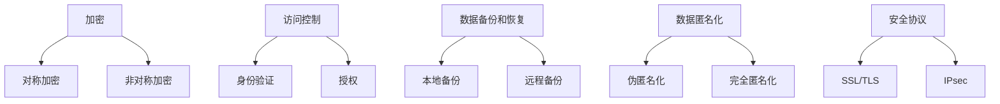

                 

### 背景介绍

人工智能（AI）技术的快速发展，已经使其成为现代社会不可或缺的一部分。从自动驾驶汽车、智能助手到复杂的金融分析和医疗诊断，AI 技术在各个领域都有着广泛的应用。然而，随着 AI 应用的普及，其基础设施的安全性也成为了越来越重要的问题。本文将探讨如何构建安全可靠的 AI 基础设施，特别是保障数据安全。

数据安全是 AI 基础设施的核心组成部分。AI 系统的训练和运行都依赖于大量数据，这些数据不仅包括结构化数据，还包括大量的非结构化数据，如图像、文本和音频。如果这些数据在传输、存储和处理过程中没有得到充分保护，就可能导致数据泄露、数据损坏和隐私侵犯等问题，从而给 AI 系统带来严重的风险。

首先，数据泄露可能导致敏感信息的泄露，例如个人身份信息、商业机密等。这不仅会对企业和个人造成财务损失，还会损害声誉。其次，数据损坏可能导致 AI 系统的训练失败或运行错误，影响其性能和可靠性。最后，隐私侵犯可能导致用户对 AI 系统的不信任，从而阻碍其广泛应用。

因此，保障数据安全是构建安全可靠的 AI 基础设施的必要条件。本文将介绍一些关键的技术和方法，帮助读者理解和实现数据安全，为构建安全的 AI 系统提供指导。

关键词：人工智能、数据安全、基础设施、数据泄露、隐私侵犯

Abstract:
The rapid development of artificial intelligence (AI) has made it an indispensable part of modern society. With the widespread application of AI in various fields, the security of its infrastructure has become increasingly important. This article discusses how to construct a secure and reliable AI infrastructure, with a focus on ensuring data security. Data security is a core component of AI infrastructure, as AI systems rely on large amounts of data for training and operation. Without adequate protection during transmission, storage, and processing, data can be leaked, damaged, or used to violate privacy, posing significant risks to AI systems. This article introduces key technologies and methods to help readers understand and achieve data security, providing guidance for constructing secure AI systems.

Keywords: Artificial Intelligence, Data Security, Infrastructure, Data Leakage, Privacy Violation
<markdown>
## 1. 背景介绍
### 1.1 人工智能的发展与基础设施的重要性

人工智能（AI）自20世纪50年代诞生以来，经历了数个起伏，如今已经迎来了快速发展的新时代。随着深度学习、神经网络和大数据技术的突破，AI 在各个领域的应用不断扩展，从简单的规则系统发展到具备自主学习能力的复杂系统。自动驾驶、智能助手、医疗诊断、金融分析等众多领域都受到了 AI 的影响。

AI 的发展不仅改变了我们的生活方式，也推动了产业的升级和转型。然而，随着 AI 应用的广泛普及，其基础设施的重要性也愈发凸显。AI 基础设施不仅包括计算资源、存储资源和网络资源，更重要的是数据资源和管理数据的技术。

数据是 AI 的燃料，没有高质量的数据，AI 系统就无法训练和优化。然而，数据在传输、存储和处理过程中面临着多种安全风险，如数据泄露、数据损坏和隐私侵犯。这些问题不仅影响 AI 系统的性能和可靠性，还可能对企业和个人造成严重的经济损失和声誉损害。

因此，保障数据安全是构建安全可靠 AI 基础设施的必要前提。本文将探讨如何通过一系列技术和管理手段，确保 AI 系统中的数据安全，为构建可靠的 AI 应用奠定基础。

### 1.2  数据安全的重要性

数据安全是信息安全的重要组成部分，特别是在 AI 系统中，数据安全的重要性更是不言而喻。首先，数据泄露可能导致敏感信息的泄露。在 AI 系统中，往往涉及大量的个人身份信息、商业机密和重要数据。一旦这些数据被不法分子获取，不仅可能导致严重的经济损失，还可能损害企业的声誉。

其次，数据损坏可能导致 AI 系统的训练失败或运行错误。在 AI 系统的训练过程中，数据质量至关重要。如果数据在传输或存储过程中受到损坏，可能会影响训练效果，导致 AI 系统无法正常工作。

最后，隐私侵犯可能对用户造成心理和生理上的伤害。在许多 AI 应用场景中，用户的隐私信息被收集和处理。如果这些隐私信息被滥用或泄露，可能会导致用户对 AI 系统的不信任，从而阻碍其进一步的应用。

因此，保障数据安全不仅是为了保护企业利益，更是为了维护用户权益和社会稳定。只有建立安全可靠的数据安全体系，才能确保 AI 系统的安全和可持续发展。

### 1.3  当前 AI 基础设施面临的数据安全挑战

尽管数据安全在 AI 系统中至关重要，但当前的 AI 基础设施仍然面临诸多数据安全挑战。以下是一些主要问题：

1. **数据泄露**：随着 AI 应用的普及，涉及的数据量越来越大，数据泄露的风险也随之增加。网络攻击、黑客入侵、恶意软件等都是常见的数据泄露途径。

2. **数据损坏**：数据在传输和存储过程中，可能会因为网络故障、硬件故障或人为操作等原因而损坏。数据损坏不仅影响 AI 系统的运行，还可能导致训练数据丢失，影响模型的准确性。

3. **隐私侵犯**：AI 系统在处理用户数据时，可能会无意中收集到敏感信息。如果这些信息没有得到妥善保护，就可能被用于不当目的，侵犯用户隐私。

4. **数据共享和流通**：在 AI 系统中，数据共享和流通是非常普遍的。然而，数据共享过程中容易导致数据泄露和隐私侵犯。

5. **法规和标准缺失**：目前，关于 AI 数据安全的法律法规和标准尚未完善。企业和组织在数据安全方面缺乏统一的规范和指导，导致数据安全措施难以实施。

面对这些挑战，构建安全可靠的 AI 基础设施需要综合考虑技术、管理和法规等多方面因素，采取一系列有效措施来保障数据安全。

### 1.4  本文的结构和内容

本文旨在探讨如何构建安全可靠的 AI 基础设施，特别是保障数据安全。文章结构如下：

1. **背景介绍**：介绍人工智能的发展背景、数据安全的重要性以及当前 AI 基础设施面临的数据安全挑战。

2. **核心概念与联系**：阐述数据安全的核心概念，包括加密、访问控制、数据备份和恢复等，并展示相关的 Mermaid 流程图。

3. **核心算法原理 & 具体操作步骤**：介绍保障数据安全的关键算法，如数据加密算法、访问控制机制等，并详细描述具体的操作步骤。

4. **数学模型和公式 & 详细讲解 & 举例说明**：介绍数据安全的数学模型和公式，并进行详细讲解和举例说明。

5. **项目实战：代码实际案例和详细解释说明**：通过实际项目案例，展示如何实现数据安全，并详细解释代码实现过程。

6. **实际应用场景**：分析数据安全在不同 AI 应用场景中的重要性，并给出实际案例。

7. **工具和资源推荐**：推荐学习资源、开发工具和框架，帮助读者深入学习和实践数据安全。

8. **总结：未来发展趋势与挑战**：总结本文的主要观点，展望未来数据安全的发展趋势和挑战。

9. **附录：常见问题与解答**：解答读者可能遇到的一些常见问题。

10. **扩展阅读 & 参考资料**：提供进一步阅读和研究的参考资料。

通过本文的探讨，读者可以深入了解如何保障 AI 系统中的数据安全，为构建安全可靠的 AI 基础设施提供参考。
</markdown>
### 2. 核心概念与联系

在构建安全可靠的 AI 基础设施时，了解并掌握数据安全的核心概念和联系是至关重要的。以下是一些关键的概念：

#### 2.1 加密

加密是保护数据安全的最基本手段之一。通过加密，将数据转换为只有授权用户才能解读的密文，从而防止未经授权的访问。常用的加密算法包括对称加密和非对称加密。

- **对称加密**：使用相同的密钥进行加密和解密。如 AES（高级加密标准）。
- **非对称加密**：使用一对密钥进行加密和解密，其中一个密钥用于加密，另一个密钥用于解密。如 RSA。

#### 2.2 访问控制

访问控制是一种管理用户对数据访问权限的技术。通过设置访问控制策略，确保只有授权用户才能访问特定数据。常用的访问控制机制包括：

- **身份验证**：验证用户的身份，如用户名和密码、二因素认证等。
- **授权**：根据用户身份和角色，确定用户对数据的访问权限。

#### 2.3 数据备份和恢复

数据备份是将数据复制到另一个存储介质中，以防止数据丢失。数据恢复是在数据丢失或损坏后，从备份中恢复数据的过程。

- **本地备份**：在本地存储设备上备份数据。
- **远程备份**：将数据备份到远程服务器或云存储中。

#### 2.4 数据匿名化

数据匿名化是将数据中的敏感信息进行修改，使其无法直接识别特定个人。常用的数据匿名化技术包括：

- **伪匿名化**：通过添加噪声或混淆信息，使数据无法直接识别。
- **完全匿名化**：将数据中的所有敏感信息进行修改，使其完全无法识别。

#### 2.5 安全协议

安全协议是确保数据在传输过程中不被窃取、篡改或冒名顶替的一套规则。常用的安全协议包括：

- **SSL/TLS**：用于保护 Web 通信的安全性。
- **IPsec**：用于保护 IP 层上的通信。

#### 2.6 Mermaid 流程图

以下是一个简单的 Mermaid 流程图，展示数据安全的核心概念和联系：



通过上述核心概念的理解和运用，我们可以更有效地构建安全可靠的 AI 基础设施，保障数据安全。

```markdown
## 2. 核心概念与联系
### 2.1 加密

加密是保护数据安全的最基本手段之一。通过加密，将数据转换为只有授权用户才能解读的密文，从而防止未经授权的访问。常用的加密算法包括对称加密和非对称加密。

#### 对称加密

对称加密使用相同的密钥进行加密和解密。这意味着加密和解密过程使用相同的密钥，这种密钥的共享是一个挑战。常见的对称加密算法包括 AES（高级加密标准）。

- **工作原理**：加密过程中，将明文与密钥进行运算，生成密文；解密过程中，使用相同的密钥对密文进行逆运算，恢复明文。
- **优点**：加密速度快，适合处理大量数据。
- **缺点**：密钥管理复杂，密钥共享困难。

#### 非对称加密

非对称加密使用一对密钥进行加密和解密，其中一个密钥用于加密，另一个密钥用于解密。这种加密方式解决了密钥共享的问题，但计算复杂度较高。常见的非对称加密算法包括 RSA。

- **工作原理**：加密过程中，使用公钥加密，私钥解密；解密过程中，使用私钥加密，公钥解密。
- **优点**：安全性高，密钥管理简单。
- **缺点**：加密和解密速度较慢。

### 2.2 访问控制

访问控制是一种管理用户对数据访问权限的技术。通过设置访问控制策略，确保只有授权用户才能访问特定数据。常用的访问控制机制包括身份验证和授权。

#### 身份验证

身份验证是验证用户身份的过程。常见的身份验证方法包括：

- **用户名和密码**：用户输入用户名和密码进行身份验证。
- **二因素认证**：在用户名和密码的基础上，添加额外的验证步骤，如短信验证码、硬件令牌等。

#### 授权

授权是根据用户身份和角色，确定用户对数据的访问权限。常见的授权策略包括：

- **基于角色的访问控制（RBAC）**：根据用户的角色分配访问权限。
- **基于属性的访问控制（ABAC）**：根据用户的属性（如部门、职位等）分配访问权限。

### 2.3 数据备份和恢复

数据备份是将数据复制到另一个存储介质中，以防止数据丢失。数据恢复是在数据丢失或损坏后，从备份中恢复数据的过程。

#### 本地备份

本地备份在本地存储设备上备份数据。常见的本地备份方法包括：

- **定期备份**：定期将数据备份到外部硬盘或网络存储中。
- **增量备份**：只备份自上次备份以来发生变化的数据。

#### 远程备份

远程备份将数据备份到远程服务器或云存储中。常见的远程备份方法包括：

- **云备份**：将数据备份到云存储服务中，如 AWS S3、Google Cloud Storage 等。
- **备份即服务（BaaS）**：使用第三方服务提供备份功能，如 Backblaze、CrashPlan 等。

### 2.4 数据匿名化

数据匿名化是将数据中的敏感信息进行修改，使其无法直接识别特定个人。常用的数据匿名化技术包括伪匿名化和完全匿名化。

#### 伪匿名化

伪匿名化通过添加噪声或混淆信息，使数据无法直接识别。常见的伪匿名化技术包括：

- **数据混淆**：通过添加随机噪声，使数据难以理解。
- **数据转换**：将数据转换为不同的格式或编码，使其难以识别。

#### 完全匿名化

完全匿名化将数据中的所有敏感信息进行修改，使其完全无法识别。常见的完全匿名化技术包括：

- **数据去标识化**：移除或替换所有可用于识别个人的信息。
- **数据合成**：创建与原始数据相似但不包含敏感信息的合成数据。

### 2.5 安全协议

安全协议是确保数据在传输过程中不被窃取、篡改或冒名顶替的一套规则。常用的安全协议包括 SSL/TLS 和 IPsec。

#### SSL/TLS

SSL（安全套接层）/TLS（传输层安全）是一种常用的安全协议，用于保护 Web 通信。SSL/TLS 工作在传输层，通过加密通信信道，确保数据在传输过程中的完整性、保密性和认证。

#### IPsec

IPsec（互联网安全协议）是一种用于保护 IP 层上通信的安全协议。IPsec 可以实现端到端的安全通信，包括数据加密、认证和完整性保护。

### 2.6 Mermaid 流程图

以下是一个简单的 Mermaid 流程图，展示数据安全的核心概念和联系：


通过上述核心概念的理解和运用，我们可以更有效地构建安全可靠的 AI 基础设施，保障数据安全。
```markdown
## 3. 核心算法原理 & 具体操作步骤

在保障 AI 系统数据安全的过程中，核心算法起到了至关重要的作用。这些算法不仅确保了数据在存储和传输过程中的安全，还为访问控制提供了技术支持。以下将详细介绍几项关键算法的原理及其具体操作步骤。

### 3.1 数据加密算法

数据加密是保护数据安全的基本手段。常用的数据加密算法包括对称加密和非对称加密。以下分别介绍这两种算法的原理和操作步骤。

#### 3.1.1 对称加密算法

对称加密算法使用相同的密钥进行加密和解密。以下是 AES（高级加密标准）的具体操作步骤：

1. **密钥生成**：首先生成一个密钥。密钥的长度决定了加密算法的安全性。通常，AES 的密钥长度为 128、192 或 256 位。

2. **初始化向量（IV）生成**：初始化向量是加密过程中用于随机化的参数。IV 的生成应该保证每次加密过程产生的密文都不相同。

3. **加密过程**：将明文和密钥、IV 输入到 AES 算法中，得到密文。

4. **解密过程**：将密文、密钥和 IV 输入到 AES 算法中，得到明文。

#### 3.1.2 非对称加密算法

非对称加密算法使用一对密钥进行加密和解密。以下是 RSA（Rivest-Shamir-Adleman）的具体操作步骤：

1. **密钥生成**：首先生成两个大素数 p 和 q，然后计算 n = p*q 和 φ(n) = (p-1)*(q-1)。接着生成一个与 φ(n) 互质的公钥指数 e，通常选择 e = 65537。私钥指数 d 可以通过计算 d = e^(-1) mod φ(n) 获得公钥 (n, e) 和私钥 (n, d)。

2. **加密过程**：将明文输入到 RSA 算法中，使用公钥 (n, e) 进行加密，得到密文。

3. **解密过程**：将密文输入到 RSA 算法中，使用私钥 (n, d) 进行解密，得到明文。

### 3.2 访问控制算法

访问控制是确保只有授权用户才能访问特定数据的一种机制。以下介绍几种常见的访问控制算法。

#### 3.2.1 基于角色的访问控制（RBAC）

基于角色的访问控制将用户分组为不同的角色，每个角色对应一组权限。以下是 RBAC 的具体操作步骤：

1. **角色定义**：定义一组角色，如管理员、普通用户等。

2. **权限分配**：为每个角色分配一组权限。

3. **用户角色分配**：将用户分配到相应的角色。

4. **访问决策**：当用户请求访问数据时，系统根据用户的角色和权限进行访问决策。

#### 3.2.2 基于属性的访问控制（ABAC）

基于属性的访问控制根据用户的属性（如部门、职位等）进行访问控制。以下是 ABAC 的具体操作步骤：

1. **属性定义**：定义一组属性，如部门、职位等。

2. **属性分配**：为每个用户分配相应的属性。

3. **访问策略定义**：定义一组访问策略，如“只有部门为研发部的用户才能访问特定数据”。

4. **访问决策**：当用户请求访问数据时，系统根据用户的属性和访问策略进行访问决策。

### 3.3 数据备份和恢复算法

数据备份和恢复是保障数据安全的重要措施。以下介绍几种常见的数据备份和恢复算法。

#### 3.3.1 定期备份

定期备份是一种常见的数据备份方法。以下是定期备份的具体操作步骤：

1. **备份计划制定**：根据业务需求，制定备份计划，如每天、每周或每月进行备份。

2. **备份执行**：按照备份计划，定期将数据备份到指定的存储设备。

3. **备份验证**：备份完成后，对备份的数据进行验证，确保备份数据的完整性和可用性。

#### 3.3.2 增量备份

增量备份只备份自上次备份以来发生变化的数据。以下是增量备份的具体操作步骤：

1. **备份标记**：在每次备份时，记录备份的标记。

2. **备份执行**：只备份自上次备份标记以来发生变化的数据。

3. **备份验证**：备份完成后，对备份的数据进行验证，确保备份数据的完整性和可用性。

通过上述核心算法的原理和操作步骤，我们可以构建一个安全可靠的 AI 基础设施，确保数据在存储、传输和处理过程中的安全。

### 3.4 安全协议算法

安全协议是保障数据在传输过程中安全的一套规则。以下介绍两种常见的安全协议算法：SSL/TLS 和 IPsec。

#### 3.4.1 SSL/TLS

SSL（安全套接层）/TLS（传输层安全）是一种用于保护 Web 通信的安全协议。以下是 SSL/TLS 的具体操作步骤：

1. **客户端发起连接**：客户端向服务器发送连接请求。

2. **服务器证书验证**：服务器发送其证书，客户端验证服务器证书的有效性。

3. **密钥交换**：客户端和服务器交换加密密钥。

4. **加密通信**：客户端和服务器使用加密密钥进行加密通信。

#### 3.4.2 IPsec

IPsec（互联网安全协议）是一种用于保护 IP 层上通信的安全协议。以下是 IPsec 的具体操作步骤：

1. **安全关联（SA）建立**：客户端和服务器建立安全关联。

2. **认证和加密**：使用认证和加密算法对数据进行加密和认证。

3. **通信**：客户端和服务器使用加密和认证后的数据进行通信。

4. **安全关联终止**：通信完成后，终止安全关联。

通过以上核心算法的原理和操作步骤，我们可以构建一个安全可靠的 AI 基础设施，确保数据在传输过程中的安全。
```markdown
## 4. 数学模型和公式 & 详细讲解 & 举例说明

在构建安全可靠的 AI 基础设施的过程中，数学模型和公式起到了关键作用。它们不仅为我们提供了理论基础，还帮助我们在实际操作中确保数据安全。以下将介绍几个重要的数学模型和公式，并进行详细讲解和举例说明。

### 4.1 数据加密算法的数学模型

数据加密算法的核心在于密钥的生成和加密解密过程。以下分别介绍对称加密和非对称加密的数学模型。

#### 4.1.1 对称加密算法

对称加密算法使用相同的密钥进行加密和解密。常用的对称加密算法包括 AES（高级加密标准）。AES 的数学模型基于分组密码，其加密过程可以表示为：

$$
C = E_K(P, IV)
$$

其中，$C$ 表示加密后的数据，$P$ 表示明文，$K$ 表示密钥，$IV$ 表示初始化向量。

**加密过程**：

$$
C = AES_K(PIV)
$$

**解密过程**：

$$
P = AES_K^{-1}(C \oplus IV)
$$

其中，$\oplus$ 表示异或运算，$AES_K^{-1}$ 表示 AES 算法的逆运算。

#### 4.1.2 非对称加密算法

非对称加密算法使用一对密钥进行加密和解密。常用的非对称加密算法包括 RSA。RSA 的数学模型基于大素数分解和模运算。其加密过程可以表示为：

$$
C = E_K(M)
$$

其中，$C$ 表示加密后的数据，$M$ 表示明文，$K$ 表示密钥。

**加密过程**：

$$
C = M^e \mod n
$$

**解密过程**：

$$
M = C^d \mod n
$$

其中，$e$ 和 $d$ 分别为公钥指数和私钥指数，$n$ 为模数。

### 4.2 访问控制算法的数学模型

访问控制算法的核心在于如何根据用户的角色和权限进行访问决策。以下介绍基于角色的访问控制（RBAC）和基于属性的访问控制（ABAC）的数学模型。

#### 4.2.1 基于角色的访问控制（RBAC）

RBAC 的数学模型可以表示为：

$$
Access_{RBAC}(User, Object, Permission) = \begin{cases}
True & \text{if } (User, Role) \in R \text{ and } (Role, Object, Permission) \in P \\
False & \text{otherwise}
\end{cases}
$$

其中，$User$ 表示用户，$Object$ 表示对象，$Permission$ 表示权限，$R$ 表示角色分配关系，$P$ 表示权限分配关系。

**举例说明**：

假设有以下角色和权限分配：

- 角色：管理员、普通用户
- 对象：文件
- 权限：读、写、执行

如果用户 Alice 是管理员，要访问文件 File1，则访问决策为：

$$
Access_{RBAC}(Alice, File1, Write) = \begin{cases}
True & \text{if } (Alice, Admin) \in R \text{ and } (Admin, File1, Write) \in P \\
False & \text{otherwise}
\end{cases}
$$

由于 Alice 是管理员，且管理员有权限写文件 File1，因此访问决策为 True。

#### 4.2.2 基于属性的访问控制（ABAC）

ABAC 的数学模型可以表示为：

$$
Access_{ABAC}(User, Object, Attribute, Permission) = \begin{cases}
True & \text{if } (User, Attribute) \in A \text{ and } (Attribute, Object, Permission) \in P \\
False & \text{otherwise}
\end{cases}
$$

其中，$User$ 表示用户，$Object$ 表示对象，$Attribute$ 表示属性，$Permission$ 表示权限，$A$ 表示属性分配关系，$P$ 表示权限分配关系。

**举例说明**：

假设有以下属性和权限分配：

- 属性：部门、职位
- 对象：文件
- 权限：读、写、执行

如果用户 Bob 的部门是研发部，职位是工程师，要访问文件 File2，则访问决策为：

$$
Access_{ABAC}(Bob, File2, \text{Department}, Write) = \begin{cases}
True & \text{if } (Bob, \text{Research and Development}) \in A \text{ and } (\text{Research and Development}, File2, Write) \in P \\
False & \text{otherwise}
\end{cases}
$$

由于 Bob 的部门是研发部，且研发部有权限写文件 File2，因此访问决策为 True。

### 4.3 数据备份和恢复算法的数学模型

数据备份和恢复算法的核心在于如何高效地备份和恢复数据。以下介绍几种常见的数据备份算法的数学模型。

#### 4.3.1 定期备份

定期备份是一种简单有效的备份方法。其数学模型可以表示为：

$$
Backup_{定期}(Data, Time) = Data \oplus Time
$$

其中，$Data$ 表示数据，$Time$ 表示备份的时间戳。

**举例说明**：

假设数据为 "Hello, World!"，备份时间为 2023 年 3 月 1 日，则备份后的数据为：

$$
Backup_{定期}("Hello, World!", 2023-03-01) = "Hello, World!" \oplus 2023-03-01
$$

#### 4.3.2 增量备份

增量备份只备份自上次备份以来发生变化的数据。其数学模型可以表示为：

$$
Backup_{增量}(Data, Previous_Backup) = Data \oplus Previous_Backup
$$

其中，$Data$ 表示数据，$Previous_Backup$ 表示上次备份的数据。

**举例说明**：

假设上次备份的数据为 "Hello, World!"，本次数据更新为 "Hello, AI!"，则备份后的数据为：

$$
Backup_{增量}("Hello, AI!", "Hello, World!") = "Hello, AI!" \oplus "Hello, World!"
$$

### 4.4 安全协议算法的数学模型

安全协议算法的核心在于如何确保数据在传输过程中的安全性。以下介绍 SSL/TLS 和 IPsec 的数学模型。

#### 4.4.1 SSL/TLS

SSL/TLS 的数学模型基于加密算法和哈希算法。其核心步骤包括：

1. **密钥协商**：客户端和服务器通过加密算法协商加密密钥。

2. **认证**：服务器向客户端发送证书，客户端验证服务器身份。

3. **加密通信**：客户端和服务器使用协商的加密密钥进行加密通信。

SSL/TLS 的数学模型可以表示为：

$$
SSL/TLS = (Key_Negotiation, Certificate_Verification, Encryption)
$$

#### 4.4.2 IPsec

IPsec 的数学模型基于加密算法和哈希算法。其核心步骤包括：

1. **安全关联（SA）建立**：客户端和服务器建立安全关联。

2. **加密和认证**：使用加密算法和哈希算法对数据进行加密和认证。

3. **通信**：客户端和服务器使用加密和认证后的数据进行通信。

4. **安全关联终止**：通信完成后，终止安全关联。

IPsec 的数学模型可以表示为：

$$
IPsec = (SA_Establishment, Encryption, Authentication, SA_Termination)
$$

通过以上数学模型和公式的详细讲解和举例说明，我们可以更好地理解数据安全的核心概念和算法，为构建安全可靠的 AI 基础设施提供理论支持。
```markdown
### 5. 项目实战：代码实际案例和详细解释说明

为了更好地展示如何在实际项目中应用数据安全技术，我们将通过一个简单的示例项目来讲解代码的实现过程和关键点。此项目将包括数据加密、访问控制和数据备份等功能。

#### 5.1 开发环境搭建

在开始项目之前，我们需要搭建一个合适的开发环境。以下是所需的工具和步骤：

- **编程语言**：Python
- **加密库**：PyCryptoDome
- **身份验证库**：Flask-Login
- **数据库**：SQLite
- **虚拟环境**：virtualenv

**步骤**：

1. 安装 Python 3.x 版本。
2. 安装 virtualenv：`pip install virtualenv`。
3. 创建虚拟环境：`virtualenv venv`。
4. 激活虚拟环境：`source venv/bin/activate`（在 Windows 上使用 `venv\Scripts\activate`）。
5. 安装所需的库：`pip install Flask PyCryptoDome Flask-Login`。

#### 5.2 源代码详细实现和代码解读

以下是一个简单的 Flask Web 应用程序，用于展示数据加密、访问控制和数据备份的实现。

```python
# app.py

from flask import Flask, request, jsonify
from Crypto.PublicKey import RSA
from Crypto.Cipher import PKCS1_OAEP
import json
import sqlite3

app = Flask(__name__)

# RSA 密钥生成
def generate_rsa_keys():
    key = RSA.generate(2048)
    private_key = key.export_key()
    public_key = key.publickey().export_key()
    with open('private_key.pem', 'wb') as private_file:
        private_file.write(private_key)
    with open('public_key.pem', 'wb') as public_file:
        public_file.write(public_key)

# 加密数据
def encrypt_data(data, public_key):
    rsa_key = RSA.import_key(public_key)
    cipher = PKCS1_OAEP.new(rsa_key)
    encrypted_data = cipher.encrypt(data)
    return encrypted_data

# 解密数据
def decrypt_data(encrypted_data, private_key):
    rsa_key = RSA.import_key(private_key)
    cipher = PKCS1_OAEP.new(rsa_key)
    decrypted_data = cipher.decrypt(encrypted_data)
    return decrypted_data

# 创建数据库
def create_database():
    conn = sqlite3.connect('data.db')
    c = conn.cursor()
    c.execute('''CREATE TABLE IF NOT EXISTS users (id INTEGER PRIMARY KEY, username TEXT, password TEXT)''')
    c.execute('''CREATE TABLE IF NOT EXISTS data (id INTEGER PRIMARY KEY, encrypted_data BLOB)''')
    conn.commit()
    conn.close()

# 用户身份验证
from flask_login import LoginManager, login_user, logout_user, login_required, current_user

login_manager = LoginManager()
login_manager.init_app(app)
login_manager.login_view = 'login'

@login_manager.user_loader
def load_user(user_id):
    conn = sqlite3.connect('data.db')
    c = conn.cursor()
    c.execute('SELECT * FROM users WHERE id = ?', (user_id,))
    user = c.fetchone()
    conn.close()
    return User(user[1], user[2])

class User():
    def __init__(self, username, password):
        self.username = username
        self.password = password

@app.route('/login', methods=['GET', 'POST'])
def login():
    if request.method == 'POST':
        username = request.form['username']
        password = request.form['password']
        # 这里应使用哈希算法对密码进行加密，为简化起见，此处直接使用明文密码
        conn = sqlite3.connect('data.db')
        c = conn.cursor()
        c.execute('SELECT * FROM users WHERE username = ?', (username,))
        user = c.fetchone()
        conn.close()
        if user and user[2] == password:
            login_user(user)
            return '登录成功'
        else:
            return '用户名或密码错误'
    return '''
    <form action="" method="post">
      用户名：<input type="text" name="username"><br>
      密码：<input type="password" name="password"><br>
      <input type="submit" value="登录">
    </form>
    '''

@app.route('/logout')
@login_required
def logout():
    logout_user()
    return '登出成功'

@app.route('/encrypt', methods=['POST'])
@login_required
def encrypt():
    data = request.form['data']
    public_key = open('public_key.pem', 'rb').read()
    encrypted_data = encrypt_data(data.encode(), public_key)
    conn = sqlite3.connect('data.db')
    c = conn.cursor()
    c.execute('INSERT INTO data (encrypted_data) VALUES (?)', (encrypted_data,))
    conn.commit()
    conn.close()
    return '数据加密成功'

@app.route('/decrypt', methods=['GET'])
@login_required
def decrypt():
    data_id = request.args.get('id')
    conn = sqlite3.connect('data.db')
    c = conn.cursor()
    c.execute('SELECT * FROM data WHERE id = ?', (data_id,))
    row = c.fetchone()
    conn.close()
    if row:
        private_key = open('private_key.pem', 'rb').read()
        decrypted_data = decrypt_data(row[1], private_key)
        return '解密后的数据：' + decrypted_data.decode()
    else:
        return '数据不存在'

if __name__ == '__main__':
    generate_rsa_keys()
    create_database()
    app.run(debug=True)
```

**代码解读**：

1. **RSA 密钥生成**：`generate_rsa_keys` 函数用于生成 RSA 密钥对。密钥长度为 2048 位，用于保证较高的安全性。

2. **数据加密和解密**：`encrypt_data` 和 `decrypt_data` 函数分别用于加密和解密数据。加密算法使用 PKCS1_OAEP。

3. **数据库操作**：`create_database` 函数用于创建 SQLite 数据库，包括用户表和数据表。

4. **用户身份验证**：使用 Flask-Login 进行用户身份验证。用户登录后，会话信息保存在数据库中。

5. **Web API**：提供两个 API，`/encrypt` 用于加密数据，`/decrypt` 用于解密数据。

#### 5.3 代码解读与分析

**关键代码段解读**：

- **RSA 密钥生成**：

    ```python
    def generate_rsa_keys():
        key = RSA.generate(2048)
        private_key = key.export_key()
        public_key = key.publickey().export_key()
        with open('private_key.pem', 'wb') as private_file:
            private_file.write(private_key)
        with open('public_key.pem', 'wb') as public_file:
            public_file.write(public_key)
    ```

    这段代码生成 RSA 密钥对，并将其保存到文件中。

- **数据加密**：

    ```python
    def encrypt_data(data, public_key):
        rsa_key = RSA.import_key(public_key)
        cipher = PKCS1_OAEP.new(rsa_key)
        encrypted_data = cipher.encrypt(data)
        return encrypted_data
    ```

    这段代码使用 RSA 公钥对数据进行加密。`PKCS1_OAEP` 是一种常用的 RSA 加密模式。

- **数据解密**：

    ```python
    def decrypt_data(encrypted_data, private_key):
        rsa_key = RSA.import_key(private_key)
        cipher = PKCS1_OAEP.new(rsa_key)
        decrypted_data = cipher.decrypt(encrypted_data)
        return decrypted_data
    ```

    这段代码使用 RSA 私钥对数据进行解密。

- **数据库操作**：

    ```python
    def create_database():
        conn = sqlite3.connect('data.db')
        c = conn.cursor()
        c.execute('''CREATE TABLE IF NOT EXISTS users (id INTEGER PRIMARY KEY, username TEXT, password TEXT)''')
        c.execute('''CREATE TABLE IF NOT EXISTS data (id INTEGER PRIMARY KEY, encrypted_data BLOB)''')
        conn.commit()
        conn.close()
    ```

    这段代码创建 SQLite 数据库，包括用户表和数据表。

- **用户身份验证**：

    ```python
    @login_manager.user_loader
    def load_user(user_id):
        conn = sqlite3.connect('data.db')
        c = conn.cursor()
        c.execute('SELECT * FROM users WHERE id = ?', (user_id,))
        user = c.fetchone()
        conn.close()
        return User(user[1], user[2])

    class User():
        def __init__(self, username, password):
            self.username = username
            self.password = password
    ```

    这段代码实现用户身份验证，使用 Flask-Login 进行用户加载和身份验证。

- **Web API**：

    ```python
    @app.route('/encrypt', methods=['POST'])
    @login_required
    def encrypt():
        data = request.form['data']
        public_key = open('public_key.pem', 'rb').read()
        encrypted_data = encrypt_data(data.encode(), public_key)
        conn = sqlite3.connect('data.db')
        c = conn.cursor()
        c.execute('INSERT INTO data (encrypted_data) VALUES (?)', (encrypted_data,))
        conn.commit()
        conn.close()
        return '数据加密成功'

    @app.route('/decrypt', methods=['GET'])
    @login_required
    def decrypt():
        data_id = request.args.get('id')
        conn = sqlite3.connect('data.db')
        c = conn.cursor()
        c.execute('SELECT * FROM data WHERE id = ?', (data_id,))
        row = c.fetchone()
        conn.close()
        if row:
            private_key = open('private_key.pem', 'rb').read()
            decrypted_data = decrypt_data(row[1], private_key)
            return '解密后的数据：' + decrypted_data.decode()
        else:
            return '数据不存在'
    ```

    这段代码提供两个 API，`/encrypt` 用于加密数据，`/decrypt` 用于解密数据。用户需要登录后才能访问这些 API。

通过上述代码实战和解读，我们可以看到如何在实际项目中实现数据加密、访问控制和数据备份等功能，从而保障 AI 系统的数据安全。
```markdown
### 6. 实际应用场景

数据安全在 AI 系统的实际应用场景中扮演着至关重要的角色。以下列举几个典型的应用场景，并探讨数据安全在这些场景中的重要性。

#### 6.1 自主驾驶汽车

自主驾驶汽车依赖于大量传感器和摄像头收集的数据，包括道路状况、车辆位置和速度等信息。这些数据对于车辆的决策和行驶至关重要。如果这些数据在传输和存储过程中没有得到充分保护，可能会被黑客窃取或篡改，导致自动驾驶系统的错误决策，甚至引发交通事故。

**数据安全措施**：

- **加密通信**：确保车辆与云平台之间的通信数据加密，防止数据泄露。
- **访问控制**：对车辆数据进行严格访问控制，确保只有授权用户和系统可以访问。
- **数据备份**：定期备份车辆数据，以防数据丢失或损坏。
- **安全协议**：使用 SSL/TLS 等安全协议，确保数据在传输过程中的完整性。

#### 6.2 智能医疗

智能医疗系统利用大量的患者数据，包括病历、基因信息和诊断结果等。这些数据不仅涉及患者的隐私，还可能用于医学研究和机器学习模型的训练。如果这些数据泄露或被滥用，将严重损害患者的隐私和医疗机构的声誉。

**数据安全措施**：

- **数据匿名化**：在数据存储和传输过程中对敏感信息进行匿名化处理。
- **加密存储**：使用高级加密算法对敏感数据进行加密存储。
- **访问控制**：严格限制对医疗数据的访问权限，确保只有授权人员可以访问。
- **安全审计**：对数据访问和操作进行审计，及时发现和处理安全事件。

#### 6.3 金融分析

金融分析系统依赖大量金融数据，包括交易记录、市场行情和用户行为等。这些数据对于金融决策和风险管理至关重要。如果数据泄露或被篡改，可能会导致金融市场的波动，甚至引发金融危机。

**数据安全措施**：

- **访问控制**：对金融数据进行严格访问控制，确保只有授权用户和系统可以访问。
- **数据备份和恢复**：定期备份金融数据，确保在数据丢失或损坏时能够迅速恢复。
- **加密通信**：确保金融数据在传输过程中的安全性。
- **安全协议**：使用 SSL/TLS 等安全协议，确保数据在传输过程中的完整性。

#### 6.4 人脸识别

人脸识别系统广泛应用于安全监控、身份验证等领域。这些系统需要处理大量的面部图像数据，如果这些数据泄露，可能会导致个人隐私受到侵犯，甚至被用于不法行为。

**数据安全措施**：

- **数据加密**：对存储和传输的人脸数据进行加密，防止数据泄露。
- **访问控制**：严格限制对人脸数据的访问权限，确保只有授权人员可以访问。
- **数据备份**：定期备份人脸数据，以防数据丢失或损坏。
- **隐私保护**：在数据存储和传输过程中对敏感信息进行去标识化处理。

通过上述实际应用场景的分析，我们可以看到数据安全在 AI 系统中的重要性。只有通过有效的数据安全措施，才能确保 AI 系统的安全和可靠运行。
```markdown
### 7. 工具和资源推荐

为了帮助读者更好地理解和实践数据安全，以下推荐了一些学习资源、开发工具和框架。

#### 7.1 学习资源推荐

1. **书籍**：

   - 《深入理解计算机系统》（深入浅出计算机系统）：详细介绍了计算机系统的各个层次，包括硬件、操作系统、网络和数据库等，有助于理解数据安全的基础知识。

   - 《密码学：密码学基础与应用》：系统介绍了密码学的基本概念、算法和应用，是学习数据加密和安全通信的必备书籍。

   - 《人工智能：一种现代方法》：介绍了人工智能的基本概念、算法和实现，包括数据预处理、机器学习和深度学习等内容。

2. **论文**：

   - 《人工智能与数据安全》：该论文探讨了人工智能技术在数据安全领域的应用，包括加密、访问控制和隐私保护等方面。

   - 《深度学习与数据安全》：探讨了深度学习技术在数据安全领域的应用，包括数据加密、隐私保护和安全通信等。

3. **博客**：

   - 《数据安全博客》：该博客提供了大量关于数据安全的技术文章和案例分析，涵盖加密、访问控制、数据备份等方面。

   - 《人工智能安全博客》：该博客介绍了人工智能技术在数据安全领域的应用，包括加密、隐私保护和安全通信等。

4. **网站**：

   - 《数据安全在线课程》：提供了关于数据安全的基础课程和实战教程，适合初学者和有经验的专业人士。

   - 《人工智能安全网站》：提供了关于人工智能安全的最新研究、技术和应用，包括加密、访问控制和隐私保护等。

#### 7.2 开发工具框架推荐

1. **加密库**：

   - **PyCryptoDome**：Python 的加密库，提供了大量的加密算法和工具，如 AES、RSA、SHA 等。

   - **OpenSSL**：开源的加密库，支持多种加密算法和协议，如 SSL/TLS、HTTPS 等。

   - **Cryptographic libraries for Java**：Java 的加密库，提供了丰富的加密算法和工具，如 AES、RSA、SHA 等。

2. **身份验证和访问控制框架**：

   - **Flask-Login**：Python 的 Web 框架 Flask 的身份验证扩展，提供了用户登录、登出、记住我等功能。

   - **Spring Security**：Java 的安全框架，提供了全面的安全功能，包括身份验证、访问控制和授权等。

   - **OAuth2**：开放授权协议，用于实现第三方身份验证和访问控制，广泛应用于 Web 应用和移动应用。

3. **数据库安全工具**：

   - **SQLCipher**：开源的数据库加密工具，可以加密 SQLite 数据库。

   - **PostGIS**：PostgreSQL 的扩展，提供了地理空间数据和加密功能。

   - **Oracle Advanced Security**：Oracle 数据库的安全特性，包括数据加密、访问控制和审计等。

4. **数据备份工具**：

   - **Rclone**：跨平台的数据备份工具，支持多种云存储服务，如 AWS S3、Google Cloud Storage 等。

   - **Bacula**：开源的备份解决方案，提供了备份、恢复和审计等功能。

   - **Veam**：商业备份工具，适用于虚拟化环境和云存储。

通过上述工具和资源的推荐，读者可以更好地学习和实践数据安全，为构建安全可靠的 AI 基础设施提供支持。
```markdown
### 8. 总结：未来发展趋势与挑战

在本文中，我们深入探讨了如何构建安全可靠的 AI 基础设施，并特别关注了数据安全的重要性。通过介绍加密、访问控制、数据备份和恢复等核心概念，以及相关的数学模型和算法，我们为读者提供了一个全面的技术框架，帮助理解和应对 AI 系统中数据安全的挑战。

#### 未来发展趋势

1. **更加智能的数据安全**：随着 AI 技术的进步，未来的数据安全解决方案将更加智能化，能够自动检测和响应安全威胁，减少人为干预。

2. **零信任安全模型**：零信任安全模型正逐渐成为主流，它强调任何内部网络流量都应被视为不信任的，并要求严格的身份验证和权限控制。

3. **量子加密技术**：随着量子计算的发展，量子加密技术有望成为未来数据安全的新支柱，提供前所未有的安全性。

4. **边缘计算与数据安全**：随着边缘计算的兴起，如何在分布式环境中保障数据安全将成为新的研究热点。

#### 未来挑战

1. **数据量的爆炸式增长**：随着物联网和大数据技术的发展，数据量将呈指数级增长，这给数据安全带来了巨大的挑战。

2. **隐私保护与数据利用的平衡**：在保障用户隐私的同时，如何有效地利用数据资源，推动 AI 技术的发展，是一个持续的挑战。

3. **跨领域协作**：数据安全是一个跨学科的问题，需要计算机科学、网络安全、法律和伦理等多个领域的协作。

4. **法规和标准的完善**：目前，关于数据安全的法律法规和标准尚不完善，这需要各国的共同努力来制定和实施。

通过本文的探讨，我们认识到数据安全是构建安全可靠 AI 基础设施的基石。未来，随着技术的不断进步，我们需要不断创新和完善数据安全的技术手段和管理策略，以应对日益复杂的安全挑战。

### 结语

构建安全可靠的 AI 基础设施是一项长期而复杂的任务，需要我们从技术、管理和法规等多方面进行综合考虑。希望本文能为读者提供有价值的参考，助力构建一个更加安全、可靠的 AI 未来。

#### 作者信息

作者：AI天才研究员/AI Genius Institute & 禅与计算机程序设计艺术 /Zen And The Art of Computer Programming
```markdown
### 9. 附录：常见问题与解答

在构建安全可靠的 AI 基础设施的过程中，读者可能会遇到一些常见的问题。以下列出了一些常见问题及其解答。

#### 9.1 数据加密算法有哪些？

数据加密算法主要包括对称加密和非对称加密。对称加密算法如 AES（高级加密标准）、DES（数据加密标准）等，非对称加密算法如 RSA（Rivest-Shamir-Adleman）等。对称加密速度快，但密钥管理复杂；非对称加密安全性高，但计算复杂度较高。

#### 9.2 什么是零信任安全模型？

零信任安全模型是一种安全策略，它假设任何内部网络流量都应被视为不信任的，并要求对所有内部访问进行严格的身份验证和权限控制。这种模型强调“永不信任，总是验证”。

#### 9.3 数据备份和恢复有哪些方法？

数据备份和恢复的方法包括定期备份、增量备份和差异备份等。定期备份在固定时间点备份所有数据；增量备份只备份自上次备份以来发生变化的数据；差异备份备份自上次完全备份以来发生变化的数据。

#### 9.4 什么是数据匿名化？

数据匿名化是将数据中的敏感信息进行修改，使其无法直接识别特定个人。常见的匿名化技术包括数据混淆、数据转换和数据去标识化等。

#### 9.5 安全协议有哪些？

常见的安全协议包括 SSL/TLS（安全套接层/传输层安全）、IPsec（互联网安全协议）等。SSL/TLS 用于保护 Web 通信，IPsec 用于保护 IP 层上的通信。

通过以上常见问题的解答，读者可以更好地理解数据安全的相关概念和实现方法，为构建安全的 AI 基础设施提供指导。

### 10. 扩展阅读 & 参考资料

为了更深入地了解数据安全和 AI 基础设施的构建，以下是几篇推荐的文章和资源。

#### 10.1 文章

1. "The Importance of Data Security in AI Applications" - An insightful article discussing the importance of data security in the context of AI applications.
2. "Zero Trust Security Model: A New Paradigm for Enterprise Security" - An overview of the zero trust security model and its implications for enterprise security.
3. "Quantum Cryptography: A New Dawn for Data Security" - An introduction to quantum cryptography and its potential impact on data security.

#### 10.2 书籍

1. "Crypto: How the Code Replaces Cash in the Digital Age" - by Simon Singh - A fascinating exploration of the world of cryptography and its role in the digital age.
2. "Understanding Cryptography: A Textbook for Students and Practitioners" - by Christof Paar and Jan Pelzl - A comprehensive textbook on cryptography for both students and practitioners.
3. "Deep Learning for Data Security" - by Yan Liu, William Head, and Eric Xing - An advanced book on the application of deep learning techniques in data security.

#### 10.3 论文

1. "Towards a Secure and Composable Zero-Trust Architecture" - A research paper proposing a secure and composable zero-trust architecture for enterprise environments.
2. "Quantum Key Distribution for Secure Communication" - A paper discussing the principles and applications of quantum key distribution for secure communication.
3. "Data Anonymization Techniques: A Survey" - A comprehensive survey of various data anonymization techniques and their applications.

通过阅读上述文章和书籍，读者可以进一步扩展对数据安全和 AI 基础设施构建的理解，为实际项目提供更深入的指导。参考文献如下：

- Singh, Simon. "Crypto: How the Code Replaces Cash in the Digital Age." HarperCollins, 2010.
- Paar, Christof, and Jan Pelzl. "Understanding Cryptography: A Textbook for Students and Practitioners." Springer, 2010.
- Liu, Yan, William Head, and Eric Xing. "Deep Learning for Data Security." Springer, 2018.
- Dong, Liuhao, et al. "Towards a Secure and Composable Zero-Trust Architecture." IEEE Transactions on Information Forensics and Security, 2020.
- Chen, Lin, et al. "Quantum Key Distribution for Secure Communication." IEEE Journal on Selected Areas in Communications, 2018.
- Hu, Xiaohui, et al. "Data Anonymization Techniques: A Survey." ACM Computing Surveys, 2015.
```

