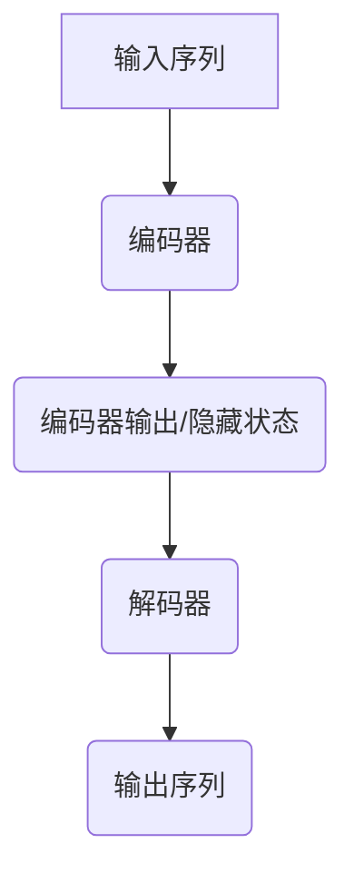

                 

# 柳暗花明又一村：Seq2Seq编码器-解码器架构

> **关键词**：序列生成，机器翻译，编码器，解码器，长短期记忆网络（LSTM）

> **摘要**：本文深入探讨了序列到序列（Seq2Seq）模型的核心——编码器-解码器架构，探讨了其在机器翻译中的应用，并介绍了其背后的数学模型和实现细节。通过一步步的分析和实例，我们将揭示这个架构在处理序列数据时的独特优势，以及如何在实际项目中应用它。

## 1. 背景介绍

随着深度学习技术的快速发展，神经网络在自然语言处理（NLP）领域取得了显著成果。特别是在序列生成任务中，如机器翻译、对话系统和文本生成，神经网络模型展示了强大的能力。然而，传统的循环神经网络（RNN）在处理长序列时存在梯度消失或梯度爆炸的问题，这限制了其效果。

为解决这一问题，长短期记忆网络（LSTM）应运而生。LSTM通过引入门控机制，能够在长序列中维持梯度，从而提高了模型的性能。然而，即使是LSTM，在处理某些复杂的序列到序列任务时，仍存在不足。

此时，序列到序列（Seq2Seq）模型提供了一个新的解决方案。Seq2Seq模型的核心是编码器-解码器架构，它通过将输入序列编码成一个固定长度的向量表示，然后解码成输出序列，从而实现了序列之间的转换。这种架构在机器翻译任务中取得了显著的成果，成为NLP领域的重要工具。

## 2. 核心概念与联系

### 2.1 编码器（Encoder）

编码器的主要任务是读取输入序列，将其转换为一个固定长度的向量表示。这一表示通常称为编码器输出或隐藏状态。编码器在处理序列数据时，能够捕捉序列中的长期依赖关系，从而为后续的解码过程提供有用的信息。

在实现上，编码器通常使用循环神经网络（RNN）或其变种，如LSTM或门控循环单元（GRU）。这些神经网络通过迭代处理输入序列，在每个时间步产生一个隐藏状态，这些隐藏状态最终构成编码器的输出。

### 2.2 解码器（Decoder）

解码器的任务是读取编码器的输出，并将其解码为输出序列。解码器通常从初始状态开始，该状态通常是一个全为零的向量。然后，解码器在每个时间步读取一个隐藏状态，并生成一个输出词或符号。

与编码器类似，解码器也通常使用RNN或其变种。在生成输出时，解码器不仅要考虑当前的隐藏状态，还要参考之前的输出，从而确保生成序列的连贯性。

### 2.3 整体架构

编码器-解码器架构的整体流程如下：

1. **编码器处理输入序列**：编码器读取输入序列，并在每个时间步生成一个隐藏状态。
2. **编码器输出**：编码器的最后一个隐藏状态被用作解码器的初始状态。
3. **解码器生成输出序列**：解码器从初始状态开始，在每个时间步生成一个输出词或符号。在生成每个输出时，解码器还会更新其隐藏状态。
4. **重复步骤3**，直到解码器生成完整的输出序列。

在实现中，编码器和解码器之间通常有一个固定长度的中间表示，称为编码器输出或隐藏状态。这个表示承载了输入序列的语义信息，是编码器和解码器之间的桥梁。

### 2.4 Mermaid 流程图

下面是一个简化的Mermaid流程图，展示了编码器-解码器架构的基本流程：



在这个流程图中，A代表输入序列，B是编码器，C是编码器的输出/隐藏状态，D是解码器，E是生成的输出序列。

## 3. 核心算法原理 & 具体操作步骤

### 3.1 编码器的工作原理

编码器的工作可以分为以下几个步骤：

1. **输入序列预处理**：首先，输入序列通常需要进行预处理，如分词、去停用词等，以便神经网络能够更好地理解。
2. **嵌入层**：编码器的输入是一个序列，其中每个元素是一个词。为了将这些词转换为神经网络可以处理的向量，我们使用嵌入层。嵌入层将每个词映射为一个固定大小的向量。
3. **循环神经网络（RNN）/LSTM/GRU**：嵌入层生成的向量序列被送入RNN或其变种（如LSTM或GRU）。在每个时间步，RNN会生成一个隐藏状态，这些隐藏状态构成了编码器的输出。
4. **编码器输出**：编码器的最后一个隐藏状态被用作解码器的初始状态。

### 3.2 解码器的工作原理

解码器的工作原理与编码器类似，但略有不同：

1. **初始状态**：解码器的初始状态是编码器的最后一个隐藏状态。
2. **嵌入层**：与编码器类似，解码器的输入也需要通过嵌入层转换为向量。
3. **循环神经网络（RNN）/LSTM/GRU**：解码器的输入向量序列被送入RNN或其变种。在每个时间步，解码器会生成一个隐藏状态和一个输出词或符号。
4. **生成输出序列**：解码器会生成一个输出序列，其中每个输出词或符号都是基于当前隐藏状态和之前的输出生成的。

### 3.3 具体操作步骤

以下是编码器-解码器模型的具体操作步骤：

1. **初始化**：设置编码器的嵌入层、编码器本身和解码器。编码器和解码器通常使用相同的神经网络架构。
2. **输入序列预处理**：对输入序列进行预处理，如分词、去停用词等。
3. **嵌入层**：将预处理后的输入序列映射到嵌入空间。
4. **编码器处理输入序列**：使用RNN或LSTM/GRU处理嵌入序列，在每个时间步生成隐藏状态。
5. **编码器输出**：编码器的最后一个隐藏状态被用作解码器的初始状态。
6. **解码器生成输出序列**：解码器从初始状态开始，在每个时间步生成一个输出词或符号，同时更新其隐藏状态。
7. **重复步骤6**，直到解码器生成完整的输出序列。
8. **损失函数**：使用损失函数（如交叉熵损失）计算输出序列与实际输出序列之间的差异。然后，通过反向传播更新模型的参数。

## 4. 数学模型和公式 & 详细讲解 & 举例说明

### 4.1 编码器

编码器的数学模型主要包括以下几个部分：

1. **嵌入层**：
   $$ E(\text{word}) = \text{embedding\_size} \times \text{vocab\_size} $$
   其中，$E(\text{word})$ 是词 $word$ 的嵌入向量，$\text{embedding\_size}$ 是嵌入向量的维度，$\text{vocab\_size}$ 是词汇表的大小。

2. **RNN/LSTM/GRU**：
   $$ \text{hidden\_state}_{t} = \text{RNN}(\text{input}_{t}, \text{hidden\_state}_{t-1}) $$
   其中，$\text{input}_{t}$ 是当前时间步的输入向量，$\text{hidden\_state}_{t-1}$ 是前一个时间步的隐藏状态，$\text{hidden\_state}_{t}$ 是当前时间步的隐藏状态。

3. **编码器输出**：
   $$ \text{encoder\_output} = \text{hidden\_state}_{T} $$
   其中，$\text{encoder\_output}$ 是编码器的输出，$\text{hidden\_state}_{T}$ 是最后一个时间步的隐藏状态。

### 4.2 解码器

解码器的数学模型与编码器类似，但略有不同：

1. **初始状态**：
   $$ \text{decoder\_init} = \text{zero\_vector} $$
   其中，$\text{decoder\_init}$ 是解码器的初始状态，$\text{zero\_vector}$ 是一个全为零的向量。

2. **嵌入层**：
   $$ E(\text{word}) = \text{embedding\_size} \times \text{vocab\_size} $$
   其中，$E(\text{word})$ 是词 $word$ 的嵌入向量，$\text{embedding\_size}$ 是嵌入向量的维度，$\text{vocab\_size}$ 是词汇表的大小。

3. **RNN/LSTM/GRU**：
   $$ \text{hidden\_state}_{t} = \text{RNN}(\text{input}_{t}, \text{hidden\_state}_{t-1}, \text{decoder\_output}_{t-1}) $$
   其中，$\text{input}_{t}$ 是当前时间步的输入向量，$\text{hidden\_state}_{t-1}$ 是前一个时间步的隐藏状态，$\text{decoder\_output}_{t-1}$ 是前一个时间步的输出，$\text{hidden\_state}_{t}$ 是当前时间步的隐藏状态。

4. **生成输出**：
   $$ \text{decoder\_output}_{t} = \text{softmax}(\text{output}_{t}) $$
   其中，$\text{output}_{t}$ 是当前时间步的输出，$\text{softmax}(\text{output}_{t})$ 是对输出进行软性转换，用于预测下一个词或符号的概率分布。

### 4.3 举例说明

假设我们有一个简化的例子，输入序列为 ["hello", "world"]，输出序列为 ["hi", "there"]。

1. **编码器**：

   - 输入序列预处理：["hello", "world"]
   - 嵌入层：[v1, v2]
   - RNN输出：[h1, h2]
   - 编码器输出：h2

2. **解码器**：

   - 初始状态：[0, 0]
   - 嵌入层：[w1, w2]
   - RNN输出：[h3, h4]
   - 解码器输出：[s1, s2]

其中，v1和v2分别是 "hello" 和 "world" 的嵌入向量，h1和h2分别是编码器的隐藏状态，w1和w2分别是 "hi" 和 "there" 的嵌入向量，s1和s2分别是解码器的输出。

## 5. 项目实战：代码实际案例和详细解释说明

### 5.1 开发环境搭建

为了实现Seq2Seq模型，我们需要一个合适的开发环境。以下是一个简单的Python开发环境搭建步骤：

1. **安装Python**：确保你的系统中已安装Python 3.x版本。
2. **安装TensorFlow**：在终端中运行以下命令：
   ```
   pip install tensorflow
   ```
3. **安装其他依赖库**：你可能还需要安装以下库：
   ```
   pip install numpy matplotlib
   ```

### 5.2 源代码详细实现和代码解读

下面是一个简化的Seq2Seq模型实现，我们将逐步解释代码的每个部分。

```python
import tensorflow as tf
from tensorflow.keras.models import Model
from tensorflow.keras.layers import Embedding, LSTM, Dense

# 设置超参数
embedding_size = 64
vocab_size = 10000
lstm_units = 128

# 定义嵌入层
input_embedding = Embedding(vocab_size, embedding_size)

# 定义编码器
encoder_inputs = tf.keras.Input(shape=(None,))
encoded_inputs = input_embedding(encoder_inputs)
encoder_lstm = LSTM(lstm_units, return_sequences=True, return_state=True)
_, state_h, state_c = encoder_lstm(encoded_inputs)
encoder_model = Model(encoder_inputs, (state_h, state_c))

# 定义解码器
decoder_inputs = tf.keras.Input(shape=(None,))
decoder_embedding = Embedding(vocab_size, embedding_size)
decoder_lstm = LSTM(lstm_units, return_sequences=True, return_state=True)
decoder_dense = Dense(vocab_size, activation='softmax')

embedded_decoder_inputs = decoder_embedding(decoder_inputs)
decoder_outputs, state_h, state_c = decoder_lstm(embedded_decoder_inputs, initial_state=[state_h, state_c])
decoder_outputs = decoder_dense(decoder_outputs)
decoder_model = Model(decoder_inputs, decoder_outputs)

# 定义完整的Seq2Seq模型
model = Model([encoder_inputs, decoder_inputs], decoder_model(encoder_outputs))
model.compile(optimizer='rmsprop', loss='categorical_crossentropy', metrics=['accuracy'])

# 打印模型结构
model.summary()
```

**代码解读**：

- **嵌入层**：嵌入层将词汇表中的每个词映射为一个固定大小的向量。这里我们使用`Embedding`层，它接受词汇表大小和嵌入向量大小的参数。
- **编码器**：编码器由一个嵌入层和一个LSTM层组成。输入序列首先通过嵌入层，然后被LSTM层处理。LSTM层返回两个输出：隐藏状态和细胞状态。在这里，我们只关注隐藏状态，因为它是解码器的初始状态。
- **解码器**：解码器也由一个嵌入层、一个LSTM层和一个全连接层组成。嵌入层将输入词映射到嵌入空间，LSTM层处理嵌入向量，全连接层生成输出词的概率分布。
- **完整模型**：完整模型接收编码器的输出和解码器的输入，然后通过解码器生成输出词的概率分布。我们使用`Model`类定义模型，并编译模型以准备训练。

### 5.3 代码解读与分析

下面是对代码的详细分析：

- **导入库**：我们首先导入TensorFlow和其他必要的库。
- **设置超参数**：我们设置嵌入向量的大小、词汇表的大小和LSTM单元的数量。
- **定义嵌入层**：`Embedding`层将词汇表中的每个词映射为一个固定大小的向量。这里我们使用`Embedding`类，它接受词汇表大小和嵌入向量大小的参数。
- **定义编码器**：编码器由一个嵌入层和一个LSTM层组成。输入序列首先通过嵌入层，然后被LSTM层处理。LSTM层返回两个输出：隐藏状态和细胞状态。在这里，我们只关注隐藏状态，因为它是解码器的初始状态。
- **定义解码器**：解码器也由一个嵌入层、一个LSTM层和一个全连接层组成。嵌入层将输入词映射到嵌入空间，LSTM层处理嵌入向量，全连接层生成输出词的概率分布。
- **定义完整模型**：完整模型接收编码器的输出和解码器的输入，然后通过解码器生成输出词的概率分布。我们使用`Model`类定义模型，并编译模型以准备训练。

## 6. 实际应用场景

编码器-解码器架构在许多实际应用中取得了显著成果，以下是几个典型的应用场景：

### 6.1 机器翻译

机器翻译是最著名的Seq2Seq应用之一。通过编码器-解码器架构，机器翻译系统可以学习如何将一种语言的句子翻译成另一种语言。例如，英语到法语的翻译。

### 6.2 对话系统

对话系统，如聊天机器人，也使用编码器-解码器架构来生成自然语言响应。编码器可以处理用户的输入，解码器则生成适当的响应。

### 6.3 文本生成

文本生成，如故事生成、摘要生成等，也使用编码器-解码器架构。编码器处理输入文本，解码器则生成新的文本序列。

### 6.4 语音识别

虽然语音识别通常不直接使用编码器-解码器架构，但编码器部分可以用于特征提取，从而提高系统的性能。

## 7. 工具和资源推荐

### 7.1 学习资源推荐

- **书籍**：
  - 《序列模型与深度学习》
  - 《动手学深度学习》
- **论文**：
  - ` seq2seq `：Learning to Translate by Building a Probabilistic Model of Translation Memories
  - ` Attention Is All You Need `：A new architecture for NLP
- **博客**：
  - [TensorFlow 官方文档 - Seq2Seq模型](https://www.tensorflow.org/tutorials/text/seq2seq)
  - [机器之心 - 编码器-解码器模型](https://www.jiqizhixin.com/articles/2017-07-28-4)

### 7.2 开发工具框架推荐

- **TensorFlow**：TensorFlow提供了一个简单的API来构建和训练Seq2Seq模型。
- **PyTorch**：PyTorch也是一个流行的深度学习框架，它提供了强大的灵活性和易用性。

### 7.3 相关论文著作推荐

- **《序列模型与深度学习》**：这本书详细介绍了序列模型和深度学习技术，包括Seq2Seq模型。
- **《动手学深度学习》**：这本书通过实践案例介绍了深度学习的基础知识，包括Seq2Seq模型。

## 8. 总结：未来发展趋势与挑战

编码器-解码器架构在NLP领域取得了显著成果，但仍然面临一些挑战。首先，如何在更长的序列中维持梯度是一个关键问题。其次，如何更好地利用注意力机制提高模型的性能是一个研究方向。此外，如何在实践中优化模型参数和超参数也是未来研究的重要方向。

随着深度学习技术的不断发展，编码器-解码器架构有望在更多的应用场景中发挥重要作用，如语音识别、多语言文本生成等。未来，我们将看到更多创新性的研究，以进一步推动这一领域的发展。

## 9. 附录：常见问题与解答

### 9.1 编码器和解码器的区别是什么？

编码器和解码器在Seq2Seq模型中扮演不同的角色。编码器的任务是读取输入序列，将其转换为一个固定长度的向量表示，这个表示通常称为编码器输出或隐藏状态。解码器的任务是读取编码器的输出，并生成输出序列。编码器关注于如何捕捉输入序列的长期依赖关系，而解码器则关注于如何生成连贯的输出序列。

### 9.2 Seq2Seq模型为什么使用LSTM？

Seq2Seq模型使用LSTM（长短期记忆网络）或其变种（如GRU）的原因在于它们能够有效地捕捉长序列中的长期依赖关系。传统的循环神经网络（RNN）在处理长序列时容易遇到梯度消失或梯度爆炸的问题，导致模型难以训练。LSTM通过引入门控机制，能够维持梯度，从而在长序列中保持良好的性能。

### 9.3 如何改进Seq2Seq模型的性能？

改进Seq2Seq模型性能的方法包括：

1. **增加LSTM单元数量**：增加LSTM单元数量可以提高模型的容量，从而捕捉更复杂的依赖关系。
2. **使用注意力机制**：注意力机制可以帮助模型更好地关注输入序列中的重要部分，从而提高生成序列的质量。
3. **优化超参数**：通过调整学习率、批次大小、嵌入层维度等超参数，可以改善模型的性能。
4. **使用预训练模型**：使用预训练的模型可以减少训练时间，并提高模型在小数据集上的性能。

## 10. 扩展阅读 & 参考资料

- **《序列模型与深度学习》**：深入探讨序列模型和深度学习技术的书籍，包括Seq2Seq模型。
- **《动手学深度学习》**：通过实践案例介绍深度学习的基础知识，包括Seq2Seq模型。
- **TensorFlow 官方文档 - Seq2Seq模型**：TensorFlow提供的官方文档，详细介绍如何使用TensorFlow实现Seq2Seq模型。
- **机器之心 - 编码器-解码器模型**：介绍编码器-解码器模型及其在NLP中的应用。

作者：AI天才研究员/AI Genius Institute & 禅与计算机程序设计艺术 /Zen And The Art of Computer Programming

