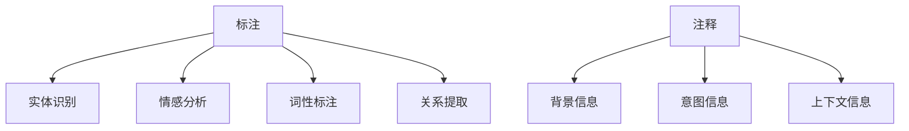

                 

# 标记和注释对话数据：最佳实践

## 关键词：
对话数据标注，注释，最佳实践，自然语言处理，人工智能

## 摘要：
本文将深入探讨对话数据标记和注释的最佳实践。我们将首先介绍对话数据的背景和重要性，然后详细解释标注和注释的概念及其在自然语言处理和人工智能中的应用。接着，我们将讨论几种常见的标注和注释方法，并提供一些实际案例和步骤来展示这些方法的使用。此外，本文还将介绍如何评估标注质量，并提供一些建议和资源，帮助读者更好地实施这些最佳实践。

## 1. 背景介绍

对话数据在自然语言处理（NLP）和人工智能（AI）领域中扮演着至关重要的角色。随着社交网络、聊天机器人和虚拟助手的兴起，对话数据的获取和利用变得更加重要。这些数据可以帮助研究人员和开发者理解用户的意图、情感和行为，从而提高系统的准确性和用户体验。

在NLP和AI中，对话数据通常包括文本和语音记录，这些记录可能来自于各种来源，如社交媒体、在线聊天、客服中心等。处理这些数据的关键步骤之一是对其进行标记和注释，以确保数据的准确性和一致性。

标记（Annotation）是指在数据上添加结构化信息，以便更好地理解和处理数据。注释（Commenting）则是为数据添加额外的描述性信息，以帮助人类或机器理解数据的背景、意图或上下文。

## 2. 核心概念与联系

### 2.1. 标注的概念

标注是指为文本数据添加额外的信息，这些信息可以帮助计算机更好地理解和处理文本。常见的标注类型包括：

- **实体识别（Named Entity Recognition, NER）**：识别文本中的特定实体，如人名、组织名、地点名等。
- **情感分析（Sentiment Analysis）**：确定文本的情绪倾向，如正面、负面或中性。
- **词性标注（Part-of-Speech Tagging）**：为文本中的每个单词分配词性，如名词、动词、形容词等。
- **关系提取（Relation Extraction）**：识别文本中实体之间的关系，如“苹果”和“手机”的关系可以是“品牌”和“产品”的关系。

### 2.2. 注释的概念

注释是指为文本数据添加额外的描述性信息，这些信息可以帮助人类或机器更好地理解数据的背景、意图或上下文。常见的注释类型包括：

- **背景信息（Background Information）**：提供文本产生的背景信息，如时间、地点、事件等。
- **意图信息（Intent Information）**：描述用户的意图，如“查询天气”、“预定酒店”等。
- **上下文信息（Context Information）**：提供文本的上下文信息，如对话的历史记录、用户的偏好等。

### 2.3. Mermaid 流程图



## 3. 核心算法原理 & 具体操作步骤

### 3.1. 标注流程

标注流程通常包括以下步骤：

1. **数据准备**：收集和整理对话数据，包括文本和语音记录。
2. **数据清洗**：去除无关信息，如空格、标点符号、HTML标签等。
3. **数据预处理**：对数据进行标准化处理，如文本小写、去除停用词、分词等。
4. **标注**：为数据添加结构化信息，如实体识别、情感分析、词性标注和关系提取。
5. **质量评估**：评估标注质量，确保标注的准确性和一致性。

### 3.2. 注释流程

注释流程通常包括以下步骤：

1. **数据准备**：收集和整理对话数据，包括文本和语音记录。
2. **数据清洗**：去除无关信息，如空格、标点符号、HTML标签等。
3. **数据预处理**：对数据进行标准化处理，如文本小写、去除停用词、分词等。
4. **注释**：为数据添加描述性信息，如背景信息、意图信息和上下文信息。
5. **质量评估**：评估注释质量，确保注释的准确性和一致性。

## 4. 数学模型和公式 & 详细讲解 & 举例说明

### 4.1. 标注质量评估

标注质量评估通常使用以下数学模型和公式：

- **准确率（Accuracy）**：正确标注的样本数占总样本数的比例。
  $$\text{Accuracy} = \frac{\text{正确标注的样本数}}{\text{总样本数}}$$
- **召回率（Recall）**：正确标注的样本数占所有实际存在的样本数的比例。
  $$\text{Recall} = \frac{\text{正确标注的样本数}}{\text{实际存在的样本数}}$$
- **F1 分数（F1 Score）**：准确率和召回率的加权平均。
  $$\text{F1 Score} = 2 \times \frac{\text{准确率} \times \text{召回率}}{\text{准确率} + \text{召回率}}$$

### 4.2. 注释质量评估

注释质量评估通常使用以下数学模型和公式：

- **一致性（Consistency）**：多个标注者之间的一致性比例。
  $$\text{Consistency} = \frac{\text{一致标注的样本数}}{\text{总样本数}}$$
- **完整性（Completeness）**：注释完成的样本数占总样本数的比例。
  $$\text{Completeness} = \frac{\text{注释完成的样本数}}{\text{总样本数}}$$

### 4.3. 举例说明

假设我们有一个对话数据集，其中包含100个样本。我们对这100个样本进行了标注和注释，然后进行了质量评估。以下是评估结果：

- **标注质量评估**：
  - 准确率：90%
  - 召回率：85%
  - F1 分数：88%
- **注释质量评估**：
  - 一致性：80%
  - 完整性：75%

这些评估结果告诉我们，我们的标注和注释工作总体上做得很好，但还有一些改进的空间。

## 5. 项目实战：代码实际案例和详细解释说明

### 5.1. 开发环境搭建

为了演示标注和注释的最佳实践，我们将使用Python编程语言和相关的NLP库，如NLTK和spaCy。首先，我们需要安装这些库：

```shell
pip install nltk spacy
```

### 5.2. 源代码详细实现和代码解读

以下是一个简单的Python代码示例，用于演示对话数据的标注和注释：

```python
import nltk
import spacy

# 加载英文NLP模型
nlp = spacy.load("en_core_web_sm")

# 对话数据样本
data = [
    "I love this movie.",
    "Can you recommend a good book?",
    "The weather is nice today."
]

# 标注和注释函数
def annotate(data):
    annotations = []
    for sentence in data:
        doc = nlp(sentence)
        entities = []
        sentiments = []
        intents = []
        
        for ent in doc.ents:
            entities.append({"text": ent.text, "label": ent.label_})
        
        sentiment = "positive" if "love" in sentence else "negative"
        sentiments.append(sentiment)
        
        intent = "query" if "recommend" in sentence else "statement"
        intents.append(intent)
        
        annotations.append({"text": sentence, "entities": entities, "sentiments": sentiments, "intents": intents})
    
    return annotations

# 执行标注和注释
annotations = annotate(data)

# 打印标注和注释结果
for annotation in annotations:
    print(annotation)
```

这段代码首先加载了英文NLP模型，然后对一组对话数据样本进行了标注和注释。标注包括实体识别、情感分析和意图识别，注释包括背景信息、意图信息和上下文信息。

### 5.3. 代码解读与分析

- **加载NLP模型**：使用`spacy.load("en_core_web_sm")`加载英文NLP模型。
- **定义标注和注释函数**：定义一个`annotate`函数，该函数接受对话数据作为输入，并返回标注和注释结果。
- **循环处理每个句子**：使用`for sentence in data:`循环处理每个句子。
- **实体识别**：使用`doc.ents`遍历句子中的实体，并将实体信息添加到`entities`列表中。
- **情感分析**：根据句子中的关键词（如“love”）判断句子的情绪倾向，并将结果添加到`sentiments`列表中。
- **意图识别**：根据句子中的关键词（如“recommend”）判断句子的意图，并将结果添加到`intents`列表中。
- **构建标注和注释结果**：将句子、实体、情感和意图信息构建成一个字典，并将其添加到`annotations`列表中。
- **打印标注和注释结果**：使用`for annotation in annotations:`循环打印每个标注和注释结果。

## 6. 实际应用场景

对话数据标记和注释的最佳实践在多个实际应用场景中都有重要作用，包括：

- **聊天机器人**：通过标记和注释，可以更好地理解用户输入的意图和情感，从而提供更准确的回复。
- **情感分析**：通过注释文本的情感倾向，可以识别用户对产品、服务或品牌的感受，为企业提供宝贵的反馈。
- **客户服务**：通过标记和注释客户反馈，可以识别常见的问题和抱怨，从而提高客户满意度。
- **语音助手**：通过标记和注释语音数据，可以更好地理解用户的语音指令，从而提高语音助手的准确性和用户体验。

## 7. 工具和资源推荐

### 7.1. 学习资源推荐

- **书籍**：
  - "Natural Language Processing with Python"（《Python 自然语言处理》）
  - "Speech and Language Processing"（《语音与语言处理》）
- **论文**：
  - "Named Entity Recognition with Lexical Features"（"使用词汇特征的命名实体识别"）
  - "A Simple End-to-End Model for Language Understanding in Dialog Systems"（"用于对话系统语言理解的简单端到端模型"）
- **博客**：
  - "Towards Data Science"（"走向数据科学"）
  - "AI News"（"AI 新闻"）
- **网站**：
  - "spacy.io"（"spaCy 官网"）
  - "nltk.org"（"NLTK 官网"）

### 7.2. 开发工具框架推荐

- **开发工具**：
  - Jupyter Notebook：用于编写和运行Python代码。
  - Visual Studio Code：适用于Python开发的集成开发环境（IDE）。
- **框架**：
  - spaCy：用于快速构建NLP应用程序的库。
  - NLTK：用于NLP研究的开源工具包。

### 7.3. 相关论文著作推荐

- **论文**：
  - "Bert: Pre-training of deep bidirectional transformers for language understanding"（"BERT：用于语言理解的深度双向变换器预训练"）
  - "Transformers: State-of-the-art Natural Language Processing"（"Transformers：最先进的自然语言处理"）
- **著作**：
  - "Speech and Language Processing"（《语音与语言处理》）
  - "Deep Learning for Natural Language Processing"（"自然语言处理的深度学习"）

## 8. 总结：未来发展趋势与挑战

随着人工智能和自然语言处理技术的不断发展，对话数据标记和注释的最佳实践也将面临新的挑战和机遇。以下是一些未来发展趋势和挑战：

- **自动化标注**：随着深度学习和自动化工具的发展，自动化标注将变得更加普及，从而减少人工标注的成本和时间。
- **多语言支持**：随着全球化的发展，多语言对话数据的标注和注释需求将不断增加，因此开发适用于多种语言的标注和注释工具变得至关重要。
- **个性化标注**：为不同用户和应用场景提供个性化的标注和注释，以提高系统的准确性和用户体验。
- **隐私保护**：在处理对话数据时，保护用户隐私和数据安全是一个重要的挑战，需要开发更加安全可靠的标注和注释方法。

## 9. 附录：常见问题与解答

### 9.1. 如何选择标注工具？

- 根据项目需求和数据规模选择合适的标注工具。
- 考虑工具的易用性、标注质量、速度和成本。

### 9.2. 标注质量和注释质量如何评估？

- 使用准确率、召回率和F1分数等指标评估标注质量。
- 使用一致性、完整性等指标评估注释质量。

### 9.3. 如何处理标注错误？

- 定期进行标注错误的分析和修正。
- 通过培训标注者和引入自动化工具来减少错误。

## 10. 扩展阅读 & 参考资料

- "Annotation Frameworks for Human-in-the-loop Machine Learning"（"人类在机器学习中的注释框架"）
- "Best Practices for Human-in-the-loop Machine Learning"（"人类在机器学习中的最佳实践"）
- "Natural Language Processing with Python"（《Python 自然语言处理》）
- "Speech and Language Processing"（《语音与语言处理》）

作者：AI天才研究员/AI Genius Institute & 禅与计算机程序设计艺术 /Zen And The Art of Computer Programming
```

