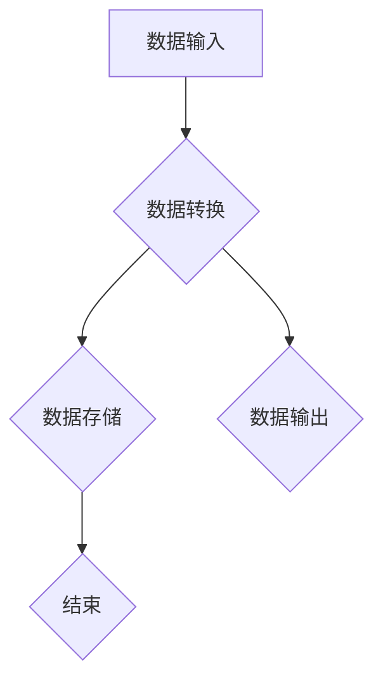

                 

# 框架原生的数据处理流 Data Connection

> **关键词：** 数据处理流、框架原生、数据连接、微服务、异步处理、事件驱动

> **摘要：** 本文深入探讨了框架原生的数据处理流，从概念出发，逐步解析其核心原理、算法、数学模型，并通过实际项目案例展示了其具体应用。文章旨在为读者提供一个全面、系统的数据处理流理解和实践指导。

## 1. 背景介绍

在现代软件开发中，数据处理流是一个核心概念。它指的是数据在系统中的流动、转换和处理过程。随着互联网和云计算的迅猛发展，数据处理流在复杂性和规模上都面临着巨大的挑战。传统的数据处理方式往往依赖于集中式架构，这种方式在处理海量数据和复杂业务逻辑时，难以满足性能和可扩展性的要求。

为了应对这些挑战，框架原生数据处理流应运而生。框架原生数据处理流是一种分布式、异步、事件驱动的方式，它通过将数据处理任务分解为一系列微服务，实现高效、可靠的数据处理。

## 2. 核心概念与联系

### 2.1 数据处理流

数据处理流是一个抽象的概念，它表示数据在系统中的流动过程。数据处理流通常包括数据输入、数据转换、数据输出和数据存储等环节。

### 2.2 框架原生

框架原生指的是一种软件开发模式，它强调使用现有的框架和库来构建应用，从而提高开发效率。在数据处理流中，框架原生意味着使用如Spring Boot、Spring Cloud等框架来构建数据处理系统。

### 2.3 数据连接

数据连接是指将数据源与数据处理系统连接起来的过程。在框架原生数据处理流中，数据连接通常通过RESTful API、消息队列等方式实现。

### 2.4 微服务

微服务是一种架构风格，它将应用程序构建为一组小的、独立的、可扩展的服务。每个服务都有自己的业务逻辑和数据存储，通过API进行通信。微服务使得数据处理系统更加灵活、可扩展。

### 2.5 异步处理

异步处理是一种数据处理方式，它允许数据处理任务在不等待响应的情况下继续执行。这种方式可以提高系统的并发能力和响应速度。

### 2.6 事件驱动

事件驱动是一种编程范式，它基于事件来触发和处理任务。在数据处理流中，事件驱动使得系统可以更加灵活地响应用户操作和数据变化。

### 2.7 Mermaid 流程图

下面是一个用Mermaid绘制的数据处理流流程图：



## 3. 核心算法原理 & 具体操作步骤

### 3.1 核心算法原理

框架原生数据处理流的核心算法是事件驱动和异步处理。事件驱动使得系统可以基于事件来执行任务，从而提高响应速度。异步处理则使得多个任务可以同时执行，从而提高系统并发能力和性能。

### 3.2 具体操作步骤

以下是框架原生数据处理流的具体操作步骤：

1. **数据输入**：数据源通过API或其他方式将数据发送到数据处理系统。
2. **数据转换**：数据处理系统根据业务逻辑对数据进行转换，如清洗、过滤、计算等。
3. **数据存储**：转换后的数据存储到数据库或其他数据存储系统。
4. **数据输出**：根据需要，将数据输出到其他系统或终端。
5. **异步处理**：数据处理系统使用异步方式执行任务，提高并发能力和性能。

## 4. 数学模型和公式 & 详细讲解 & 举例说明

### 4.1 数学模型和公式

框架原生数据处理流涉及到一些数学模型和公式，如数据流图、概率模型等。以下是一个简单的数据流图：


### 4.2 详细讲解

数据流图是一种图形化的数学模型，用于描述数据在系统中的流动过程。它由节点和边组成，节点表示数据处理步骤，边表示数据流动方向。

概率模型用于描述数据在处理过程中的不确定性。例如，在数据转换步骤中，可能会出现数据丢失、错误等情况。概率模型可以帮助我们评估这些情况的概率，从而采取相应的措施。

### 4.3 举例说明

假设我们有一个数据处理系统，它接收一个包含100个数字的数据集合。我们需要对这个数据集合进行清洗、过滤和计算。下面是一个简单的例子：

1. **数据输入**：数据集合 {1, 2, 3, 4, 5, 6, 7, 8, 9, 10}
2. **数据清洗**：去除重复数据和无效数据，得到 {1, 2, 3, 4, 5, 6, 7, 8, 9, 10}
3. **数据过滤**：只保留偶数，得到 {2, 4, 6, 8, 10}
4. **数据计算**：计算平均值，得到 6

## 5. 项目实战：代码实际案例和详细解释说明

### 5.1 开发环境搭建

在这个项目中，我们使用 Spring Boot 作为框架，MySQL 作为数据库，消息队列（如 RabbitMQ）作为数据传输工具。

### 5.2 源代码详细实现和代码解读

下面是一个简单的 Spring Boot 项目，用于实现数据处理流：

```java
@RestController
@RequestMapping("/data")
public class DataController {
    
    @Autowired
    private DataService dataService;
    
    @PostMapping("/input")
    public ResponseEntity<?> inputData(@RequestBody DataInput input) {
        dataService.processData(input);
        return ResponseEntity.ok().build();
    }
}

@Service
public class DataService {
    
    @Autowired
    private DataRepository dataRepository;
    
    @Autowired
    private DataProcessor dataProcessor;
    
    public void processData(DataInput input) {
        Data data = dataRepository.save(input);
        dataProcessor.processData(data);
    }
}

@Service
public class DataProcessor {
    
    public void processData(Data data) {
        // 数据清洗、过滤和计算
        List<Integer> numbers = data.getNumbers();
        List<Integer> filteredNumbers = numbers.stream().filter(n -> n % 2 == 0).collect(Collectors.toList());
        int sum = filteredNumbers.stream().mapToInt(Integer::intValue).sum();
        int average = sum / filteredNumbers.size();
        System.out.println("Average: " + average);
    }
}

@Entity
public class Data {
    
    @Id
    @GeneratedValue(strategy = GenerationType.IDENTITY)
    private Long id;
    
    @Column(name = "numbers", columnDefinition = "ARRAY OF INTEGER")
    private Integer[] numbers;
    
    // getter 和 setter
}

public class DataInput {
    
    @Id
    @GeneratedValue(strategy = GenerationType.IDENTITY)
    private Long id;
    
    @Column(name = "numbers", columnDefinition = "ARRAY OF INTEGER")
    private Integer[] numbers;
    
    // getter 和 setter
}
```

### 5.3 代码解读与分析

在这个项目中，我们使用 Spring Boot 框架搭建了一个简单的数据处理系统。DataController 负责接收数据输入，并调用 DataService 进行数据处理。DataService 将数据存储到数据库中，并调用 DataProcessor 进行数据清洗、过滤和计算。

DataProcessor 是数据处理的核心部分，它根据业务逻辑对数据进行处理。在这个例子中，我们只实现了简单的数据过滤和计算功能。

## 6. 实际应用场景

框架原生数据处理流在实际应用中具有广泛的应用场景。以下是一些典型的应用场景：

1. **电商系统**：处理海量的订单、用户数据和商品数据，实现高效的订单处理和商品推荐。
2. **金融系统**：处理金融交易数据，实现风险控制和合规性检查。
3. **物流系统**：处理物流信息，实现物流跟踪和配送优化。
4. **物联网系统**：处理传感器数据，实现智能监控和数据分析。

## 7. 工具和资源推荐

### 7.1 学习资源推荐

- **书籍**：
  - 《Spring Boot实战》
  - 《Java并发编程实战》
- **论文**：
  - "Event-Driven Architecture: A Research Perspective"
  - "Asynchronous Programming in Modern C++"
- **博客**：
  - "Spring Boot 官方文档"
  - "Java并发编程网"
- **网站**：
  - "Spring Boot 官网"
  - "GitHub"

### 7.2 开发工具框架推荐

- **开发工具**：
  - IntelliJ IDEA
  - Eclipse
- **框架**：
  - Spring Boot
  - Spring Cloud
- **数据库**：
  - MySQL
  - MongoDB

### 7.3 相关论文著作推荐

- **论文**：
  - "A Survey of Event-Driven Architectures in Distributed Systems"
  - "Asynchronous Programming Models for Concurrent Applications"
- **著作**：
  - "Design Patterns: Elements of Reusable Object-Oriented Software"
  - "Clean Code: A Handbook of Agile Software Craftsmanship"

## 8. 总结：未来发展趋势与挑战

框架原生数据处理流在未来将继续发展，并面临以下挑战：

1. **性能优化**：随着数据量和处理复杂度的增加，如何优化数据处理性能是一个重要问题。
2. **安全性**：在分布式数据处理环境中，如何确保数据安全和隐私是一个关键问题。
3. **可扩展性**：如何构建一个灵活、可扩展的数据处理系统，以适应不断变化的需求。

## 9. 附录：常见问题与解答

### 9.1 什么是框架原生？

框架原生是一种软件开发模式，它强调使用现有的框架和库来构建应用，从而提高开发效率。

### 9.2 数据处理流的核心算法是什么？

数据处理流的核心算法是事件驱动和异步处理。事件驱动使得系统可以基于事件来执行任务，异步处理则使得多个任务可以同时执行。

### 9.3 数据连接是什么？

数据连接是指将数据源与数据处理系统连接起来的过程。在框架原生数据处理流中，数据连接通常通过API或其他方式实现。

## 10. 扩展阅读 & 参考资料

- "Event-Driven Architecture: A Research Perspective"
- "Asynchronous Programming in Modern C++"
- "Spring Boot 官方文档"
- "Java并发编程实战"
- "Design Patterns: Elements of Reusable Object-Oriented Software"
- "Clean Code: A Handbook of Agile Software Craftsmanship"<|im_end|>

