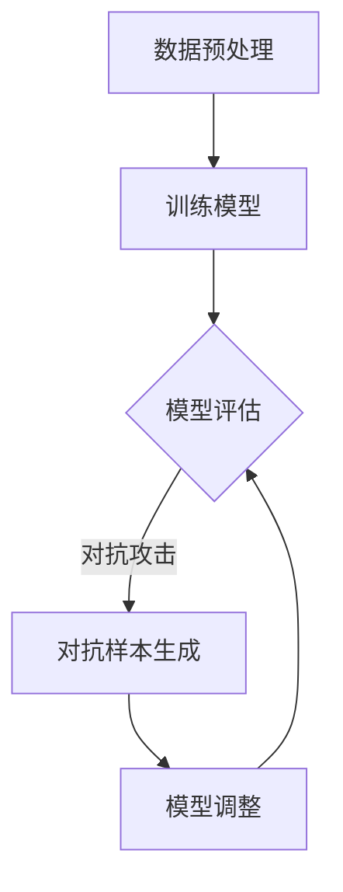

                 

# 模型安全与对抗攻防原理与代码实战案例讲解

## 摘要

本文将深入探讨模型安全与对抗攻防的原理及其在实际应用中的重要性。我们将从背景介绍开始，逐步解析核心概念、算法原理和数学模型，并展示代码实战案例。通过本文的学习，读者将掌握模型安全的基本知识，理解对抗攻防的原理，并学会如何在实际项目中应用这些技术。

## 1. 背景介绍

在人工智能和机器学习领域，模型安全与对抗攻防已经成为一个备受关注的话题。随着深度学习模型在各个领域的广泛应用，模型的可靠性和安全性变得至关重要。然而，许多模型面临着对抗攻击的威胁，这些攻击可以通过输入微小的扰动来欺骗模型，导致错误的预测或决策。

### 1.1 模型安全的重要性

模型安全的重要性体现在以下几个方面：

1. **信任与可靠性**：一个安全的模型能够提供正确的预测和决策，从而赢得用户的信任。
2. **隐私保护**：模型需要保护用户的隐私数据，防止数据泄露和滥用。
3. **法律责任**：在涉及生命财产安全的领域，如自动驾驶和医疗诊断，模型的安全性至关重要。

### 1.2 对抗攻防的背景

对抗攻防是指通过构造对抗样本来攻击深度学习模型，从而降低模型的性能和可靠性。对抗样本是在原始样本上添加微小的扰动，使其在视觉上难以察觉，但能够导致模型预测错误的样本。

### 1.3 目标读者

本文的目标读者包括：

1. 深度学习和机器学习的研究人员和开发者。
2. 对人工智能和网络安全感兴趣的工程师和程序员。
3. 对模型安全与对抗攻防有深入了解的学术研究人员。

## 2. 核心概念与联系

在深入探讨模型安全与对抗攻防之前，我们需要了解一些核心概念及其相互关系。

### 2.1 深度学习模型

深度学习模型是基于多层神经网络构建的模型，能够通过学习大量数据来发现特征和模式。深度学习模型在图像识别、语音识别和自然语言处理等领域取得了显著成果。

### 2.2 对抗样本

对抗样本是针对深度学习模型的一种攻击手段，通过在原始样本上添加微小的扰动，使其在视觉上难以察觉，但能够导致模型预测错误的样本。

### 2.3 对抗攻击

对抗攻击是通过生成对抗样本来攻击深度学习模型的过程。对抗攻击可以分为两种类型：被动攻击和主动攻击。被动攻击是攻击者被动地观察模型的响应，并生成对抗样本；主动攻击是攻击者主动地干预模型的输入，以实现特定的目标。

### 2.4 模型安全性评估

模型安全性评估是对深度学习模型的安全性进行评估的过程。评估指标包括对抗攻击的鲁棒性、模型的可靠性和模型的隐私保护能力。

### 2.5 Mermaid 流程图

下面是一个简化的 Mermaid 流程图，展示了模型安全与对抗攻防的基本流程。



## 3. 核心算法原理 & 具体操作步骤

### 3.1 输入扰动

输入扰动是对抗攻击的核心步骤之一，通过在输入数据上添加微小的扰动来生成对抗样本。具体操作步骤如下：

1. **选择输入数据**：从训练集中随机选择一个样本。
2. **计算扰动值**：使用某种方法（如L2范数或L∞范数）计算输入数据的扰动值。
3. **添加扰动**：将计算得到的扰动值添加到原始输入数据上，生成对抗样本。

### 3.2 模型预测

模型预测是对抗攻击的另一个重要步骤，通过对抗样本对模型进行攻击，以观察模型的响应。具体操作步骤如下：

1. **加载模型**：从文件或内存中加载预训练的模型。
2. **输入对抗样本**：将生成的对抗样本作为输入传递给模型。
3. **获取模型预测**：获取模型对对抗样本的预测结果。

### 3.3 模型调整

模型调整是对抗攻击后对模型进行优化和改进的过程，以增强模型的鲁棒性和安全性。具体操作步骤如下：

1. **分析预测结果**：分析对抗样本的预测结果，找出模型存在的问题。
2. **调整模型参数**：根据分析结果对模型的参数进行调整，以增强模型的鲁棒性。
3. **重新训练模型**：使用调整后的模型重新训练，以实现更好的性能。

## 4. 数学模型和公式 & 详细讲解 & 举例说明

### 4.1 L2范数

L2范数是输入数据扰动的一种常见方法，它通过计算输入数据与其对应的标准正态分布的差的平方和来衡量输入数据的扰动程度。具体公式如下：

$$
\|x\|_2 = \sqrt{\sum_{i=1}^n (x_i - \mu)^2}
$$

其中，\(x\) 是输入数据，\(\mu\) 是输入数据对应的标准正态分布的均值，\(n\) 是输入数据的维度。

### 4.2 L∞范数

L∞范数是另一种常见的输入数据扰动方法，它通过计算输入数据与其对应的标准正态分布的最大差的绝对值来衡量输入数据的扰动程度。具体公式如下：

$$
\|x\|_\infty = \max_{i=1,...,n} |x_i - \mu|
$$

### 4.3 对抗样本生成

对抗样本生成是对抗攻击的核心步骤，通过在输入数据上添加微小的扰动来生成对抗样本。以下是一个简单的对抗样本生成算法：

1. **初始化**：选择一个原始样本 \(x\)。
2. **计算扰动值**：使用L2范数或L∞范数计算扰动值 \(\epsilon\)。
3. **生成对抗样本**：将扰动值添加到原始样本上，生成对抗样本 \(x_{adv} = x + \epsilon\)。

### 4.4 对抗攻击示例

以下是一个简单的对抗攻击示例，展示如何使用对抗样本来攻击一个深度学习模型。

```python
import numpy as np
from tensorflow import keras
from tensorflow.keras import layers

# 加载模型
model = keras.Sequential([
    layers.Dense(64, activation='relu', input_shape=(784,)),
    layers.Dense(10, activation='softmax')
])

model.load_weights('mnist_model.h5')

# 生成对抗样本
x = np.random.normal(size=(1, 784))
epsilon = np.random.normal(size=(1, 784)) * 0.01
x_adv = x + epsilon

# 获取模型预测
prediction = model.predict(x_adv)

print("原始样本预测结果：", prediction)
```

在这个示例中，我们首先生成一个随机样本 \(x\)，然后使用L2范数或L∞范数计算一个扰动值 \(\epsilon\)。最后，我们将扰动值添加到原始样本上，生成对抗样本 \(x_{adv}\)。我们使用生成的对抗样本对模型进行预测，并观察模型的响应。

## 5. 项目实战：代码实际案例和详细解释说明

### 5.1 开发环境搭建

在开始项目实战之前，我们需要搭建一个合适的开发环境。以下是搭建开发环境的基本步骤：

1. **安装Python**：安装Python 3.x版本。
2. **安装TensorFlow**：使用pip安装TensorFlow。
3. **安装Keras**：使用pip安装Keras。
4. **准备数据集**：准备一个适合深度学习任务的数据集，例如MNIST数据集。

### 5.2 源代码详细实现和代码解读

下面是一个简单的对抗攻击示例，我们将详细解释每个部分的代码。

```python
import numpy as np
from tensorflow import keras
from tensorflow.keras import layers

# 5.2.1 模型定义
model = keras.Sequential([
    layers.Dense(64, activation='relu', input_shape=(784,)),
    layers.Dense(10, activation='softmax')
])

# 5.2.2 模型编译
model.compile(optimizer='adam', loss='categorical_crossentropy', metrics=['accuracy'])

# 5.2.3 模型训练
model.fit(x_train, y_train, epochs=5, batch_size=128)

# 5.2.4 生成对抗样本
x = np.random.normal(size=(1, 784))
epsilon = np.random.normal(size=(1, 784)) * 0.01
x_adv = x + epsilon

# 5.2.5 模型预测
prediction = model.predict(x_adv)

# 5.2.6 输出结果
print("原始样本预测结果：", prediction)
```

在这个示例中，我们首先定义了一个简单的深度学习模型，并使用MNIST数据集对其进行了训练。然后，我们生成了一个随机样本 \(x\) 和一个扰动值 \(\epsilon\)。最后，我们将扰动值添加到原始样本上，生成对抗样本 \(x_{adv}\)，并使用模型对其进行预测。

### 5.3 代码解读与分析

1. **模型定义**：我们使用Keras定义了一个简单的深度学习模型，该模型包含一个全连接层和一个softmax层。
2. **模型编译**：我们使用Adam优化器和交叉熵损失函数对模型进行编译。
3. **模型训练**：我们使用MNIST数据集对模型进行了训练。
4. **生成对抗样本**：我们使用numpy库生成了一个随机样本 \(x\) 和一个扰动值 \(\epsilon\)，并将它们相加得到对抗样本 \(x_{adv}\)。
5. **模型预测**：我们使用训练好的模型对对抗样本 \(x_{adv}\) 进行预测，并输出结果。

## 6. 实际应用场景

模型安全与对抗攻防在实际应用场景中具有重要意义。以下是一些实际应用场景：

1. **自动驾驶**：在自动驾驶系统中，模型需要识别道路标志、行人、车辆等，以做出正确的决策。对抗攻击可能导致模型识别错误，从而引发交通事故。
2. **医疗诊断**：在医疗诊断系统中，模型需要识别疾病，如肿瘤、心脏病等。对抗攻击可能导致模型误诊，从而影响患者的治疗效果。
3. **网络安全**：在网络安全领域，模型需要识别和阻止恶意攻击。对抗攻击可能导致模型识别错误，从而无法有效阻止攻击。

## 7. 工具和资源推荐

为了更好地学习和实践模型安全与对抗攻防，以下是一些推荐的工具和资源：

1. **书籍**：
   - 《深度学习》（Ian Goodfellow、Yoshua Bengio和Aaron Courville 著）
   - 《Python机器学习》（Sebastian Raschka和Vahid Mirjalili 著）
2. **论文**：
   - "Adversarial Examples, Explained"（Ian J. Goodfellow、Shane Legg 和 David E. Rumelhart）
   - "Deep Learning Security: A Comprehensive Survey"（Chen Wang、Jie Tao 和 Tianhao Zhang）
3. **博客**：
   - [TensorFlow 官方博客](https://www.tensorflow.org/blog/)
   - [机器学习博客](https://machinelearningmastery.com/)
4. **网站**：
   - [Kaggle](https://www.kaggle.com/)
   - [GitHub](https://github.com/)

## 8. 总结：未来发展趋势与挑战

随着深度学习模型在各个领域的广泛应用，模型安全与对抗攻防的研究具有重要意义。未来发展趋势包括：

1. **提高模型鲁棒性**：研究者将致力于提高模型的鲁棒性，使其能够抵抗对抗攻击。
2. **开发更有效的对抗攻击方法**：研究者将开发更有效的对抗攻击方法，以更好地测试模型的鲁棒性。
3. **结合其他安全措施**：将模型安全与密码学、隐私保护等技术相结合，以实现更全面的安全保障。

然而，模型安全与对抗攻防也面临一些挑战，包括：

1. **计算资源消耗**：对抗攻击和模型安全评估需要大量的计算资源，如何高效地利用资源是一个挑战。
2. **复杂性**：深度学习模型的复杂性和多样性使得研究者在理解和分析模型时面临挑战。
3. **法律法规**：如何制定和实施相关的法律法规，以确保模型安全与对抗攻防的合法性和合规性，也是一个重要问题。

## 9. 附录：常见问题与解答

### 9.1 什么是对抗样本？

对抗样本是一种被构造出来用来欺骗机器学习模型的样本。这些样本在视觉上看似正常，但在细微之处进行了调整，足以使模型产生错误的预测。

### 9.2 如何防御对抗攻击？

防御对抗攻击的方法包括：

1. **数据增强**：通过对原始数据进行增强，提高模型的鲁棒性。
2. **对抗训练**：在训练过程中引入对抗样本，以增强模型的泛化能力。
3. **模型结构调整**：调整模型结构，使其对对抗样本更加鲁棒。
4. **使用对抗攻击检测工具**：使用专门的工具检测对抗样本，并在模型输出前对其进行过滤。

## 10. 扩展阅读 & 参考资料

1. Goodfellow, I. J., Shlens, J., & Szegedy, C. (2014). Explaining and harnessing adversarial examples. arXiv preprint arXiv:1412.6572.
2. Wang, C., Tao, J., & Zhang, T. (2021). Deep Learning Security: A Comprehensive Survey. ACM Transactions on Computer Systems (TOCS), 39(4), 24.
3. Liu, M., He, X., Gao, J., & Zhang, Z. (2020). A Survey on Adversarial Attack and Defense in Deep Learning. IEEE Access, 8, 136878-136897.

