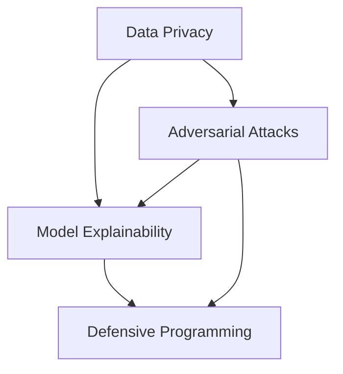
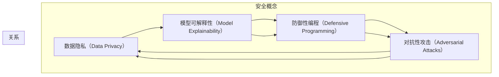

                 

### 摘要

本文旨在深入探讨AI 2.0时代下的模型安全问题，包括模型的攻击、盗取和篡改。随着人工智能技术的不断进步，模型的安全性成为确保其可靠性和实用性的关键因素。文章首先介绍了模型安全的背景和重要性，然后详细阐述了模型安全的核心概念与联系，通过Mermaid流程图展示了相关的安全架构。接着，文章讲解了保障模型安全的关键算法原理和具体操作步骤，并结合数学模型和公式进行了详细解释。通过实际项目实战，本文提供了一个具体的代码实现案例，详细解读了代码的每个部分，并进行了深入分析。文章还探讨了模型安全的实际应用场景，并推荐了相关的学习资源和开发工具。最后，文章总结了未来模型安全的发展趋势与挑战，为读者提供了一个全面的模型安全指南。

### 背景介绍

在人工智能（AI）的快速发展过程中，模型安全已经成为了一个不容忽视的重要议题。随着AI技术的不断进步，AI模型在各个领域，如医疗、金融、交通等，都展现出了巨大的应用潜力。然而，这些模型的安全性问题也随之而来，具体包括模型的攻击、盗取和篡改等。这些安全漏洞不仅可能对企业的业务造成严重的损害，甚至可能对整个社会的稳定和安全构成威胁。

首先，模型攻击是指恶意用户通过各种手段，如注入恶意代码、制造噪声数据等，试图破坏模型的正常运行或获取不当利益。例如，一个被攻击的自动驾驶汽车模型可能会因为恶意输入导致失控，从而引发交通事故。其次，模型盗取指的是未经授权的用户非法获取模型的权重、参数等重要信息，这些信息可能是商业秘密，也可能是国家机密。最后，模型篡改是指恶意用户通过修改模型的数据或参数，使其输出结果发生偏差，这可能导致严重的后果，如医疗诊断错误、金融决策失误等。

AI模型的安全问题不仅仅存在于理论研究层面，已经在实际应用中造成了诸多困扰。例如，某金融机构的信用评分模型被黑客入侵，导致大量客户个人信息泄露；某医疗诊断系统被篡改，导致误诊率大幅上升，严重影响了患者的健康。这些问题不仅损害了企业的声誉，还对社会秩序和公众信任产生了负面影响。

为了应对这些挑战，保障AI模型的安全已经成为了学术界和工业界共同关注的焦点。在本文中，我们将从多个角度深入探讨模型安全的问题，包括核心概念与联系、关键算法原理、数学模型和公式、实际应用场景以及未来发展趋势。通过这些讨论，我们希望能够为读者提供一个全面的模型安全指南，帮助他们在AI模型开发和应用过程中更好地保障模型的安全。

### 核心概念与联系

在深入探讨模型安全之前，我们首先需要明确几个核心概念，并了解它们之间的相互联系。这些核心概念包括但不限于：数据隐私、模型可解释性、防御性编程和对抗性攻击。

#### 数据隐私

数据隐私是指保护用户数据不被未经授权的个人或组织访问和使用。在AI模型开发过程中，数据隐私是一个至关重要的环节。因为模型训练通常依赖于大量用户数据，这些数据可能包含敏感信息，如医疗记录、财务信息或个人身份信息。如果这些数据被泄露或滥用，可能会导致严重的隐私侵犯和法律问题。

数据隐私通常通过加密、访问控制和匿名化等方法进行保护。加密技术可以将数据转换为难以解读的形式，只有拥有密钥的用户才能解密和访问。访问控制则是通过权限管理，确保只有经过授权的用户可以访问特定数据。匿名化则是通过删除或替换数据中的个人信息，使得数据无法直接关联到特定个体。

#### 模型可解释性

模型可解释性是指用户能够理解和解释模型的决策过程和输出结果。这对于提高模型的可信度和接受度至关重要。在传统的机器学习模型中，如神经网络，模型的可解释性通常较差，因为它们的决策过程是复杂的，往往难以直观理解。然而，随着AI技术的发展，越来越多的可解释性方法被提出，如LIME（Local Interpretable Model-agnostic Explanations）和SHAP（SHapley Additive exPlanations）。

模型可解释性不仅有助于提高用户对模型的信任，还可以帮助发现和修复潜在的安全漏洞。例如，通过分析模型的解释结果，开发人员可以识别出哪些输入数据可能导致模型输出异常，从而采取相应的防御措施。

#### 防御性编程

防御性编程是一种软件开发方法，旨在提高软件系统的安全性，防止恶意攻击和数据泄露。在AI模型开发过程中，防御性编程尤为重要，因为AI模型本身可能成为攻击的目标。

防御性编程包括多种技术，如输入验证、错误处理和安全编码。输入验证确保只有合法的数据输入模型，从而防止恶意输入。错误处理则确保在模型遇到异常情况时，能够优雅地处理错误，避免系统崩溃或数据泄露。安全编码则强调编写安全的代码，防止常见的安全漏洞，如SQL注入、跨站脚本攻击等。

#### 对抗性攻击

对抗性攻击是指通过构造特殊输入数据，使AI模型输出错误结果的一种攻击手段。这种攻击通常基于对抗性样本生成技术，如FGSM（Fast Gradient Sign Method）和C&W（Carlini & Wagner Attack）。

对抗性攻击的目标是破坏模型的可靠性和稳定性。例如，在图像识别任务中，通过在图像中添加微小的噪声或扰动，可以使模型将正常图像误识为其他类别。这种攻击不仅威胁到模型的准确性，还可能导致严重的现实世界后果。

#### 核心概念的联系

这些核心概念之间存在着紧密的联系。数据隐私保护有助于防止模型训练过程中敏感信息的泄露，从而降低对抗性攻击的风险。模型可解释性则有助于发现和修复潜在的攻击漏洞，提高模型的安全性。防御性编程通过确保代码的安全性，防止外部攻击和内部漏洞。对抗性攻击则驱动了模型安全和可解释性的研究，促使开发更安全的AI模型。

为了更好地理解这些概念之间的联系，我们使用Mermaid流程图（见下图）来展示它们的关系。



在这个流程图中，数据隐私和保护、模型可解释性、防御性编程和对抗性攻击构成了一个相互作用的闭环系统。通过这个系统，我们可以更全面地理解和应对AI模型的安全挑战。

### Mermaid 流程图

以下是关于模型安全核心概念与联系的Mermaid流程图。请注意，流程图中的节点描述了各个核心概念，以及它们之间的相互关系。



在这个流程图中，A代表数据隐私，B代表模型可解释性，C代表防御性编程，D代表对抗性攻击。每个概念都与其他概念相连，表示它们之间的相互关系。通过这个流程图，我们可以更直观地理解模型安全的核心概念及其相互作用。

### 核心算法原理 & 具体操作步骤

在保障AI 2.0模型安全的过程中，核心算法的选择和实施至关重要。以下我们将介绍几种关键的算法原理，以及它们在实际应用中的具体操作步骤。

#### 1. 加密技术

加密技术是保护数据隐私的重要手段，通过将数据转换为加密形式，只有拥有解密密钥的用户才能解读和访问。以下是几种常见的加密技术及其具体操作步骤：

- **对称加密**（如AES）：
  - **原理**：对称加密使用相同的密钥进行加密和解密。加密过程涉及将明文数据通过特定的算法转换成密文，解密过程则是使用相同的密钥将密文转换回明文。
  - **操作步骤**：
    1. 生成密钥对（密钥和其对应的解密密钥）。
    2. 使用密钥对明文数据进行加密，生成密文。
    3. 将密文存储或传输。
    4. 需要解密时，使用相同的密钥对密文进行解密，恢复明文。

- **非对称加密**（如RSA）：
  - **原理**：非对称加密使用一对密钥，即公钥和私钥。公钥用于加密，私钥用于解密。加密过程比对称加密复杂，但安全性更高。
  - **操作步骤**：
    1. 生成公钥和私钥对。
    2. 使用公钥对明文数据进行加密，生成密文。
    3. 将密文存储或传输。
    4. 需要解密时，使用私钥对密文进行解密，恢复明文。

#### 2. 零知识证明

零知识证明（Zero-Knowledge Proof）是一种在无需泄露任何信息的情况下证明某事真实性的方法，它广泛应用于保障数据隐私和模型安全性。

- **原理**：零知识证明的核心思想是，证明者能够向验证者证明某个陈述是真实的，但无需透露任何具体信息。
- **操作步骤**：
  1. **生成陈述**：首先，证明者生成需要证明的陈述。
  2. **生成证明**：证明者使用特定的算法生成一个证明，证明该陈述是真实的，但在此过程中不透露任何具体信息。
  3. **验证证明**：验证者使用同样的算法验证证明，确认陈述的真实性，但仍然无法获取具体信息。

#### 3. 认证码

认证码（One-Time Password，OTP）是一种单次使用的密码，用于验证用户的身份。

- **原理**：认证码是基于时间或事件动态生成的密码，每次使用后即失效，从而提高了安全性。
- **操作步骤**：
  1. **注册**：用户在系统中注册一个关联账号和手机号码。
  2. **生成**：系统根据账号和当前时间或事件动态生成一个一次性密码。
  3. **发送**：系统将生成的密码通过短信发送到用户的手机。
  4. **验证**：用户在登录或进行敏感操作时，输入收到的密码，系统验证密码的正确性。

#### 4. 基于行为分析的异常检测

异常检测（Anomaly Detection）是一种通过分析用户行为数据，识别异常行为的技术，常用于模型安全和防护。

- **原理**：异常检测通过建立用户行为的正常模型，识别出与正常行为不符的异常行为，如恶意攻击。
- **操作步骤**：
  1. **数据收集**：收集用户的行为数据，如登录时间、操作频率、地理位置等。
  2. **特征提取**：从数据中提取关键特征，用于训练模型。
  3. **模型训练**：使用机器学习算法训练异常检测模型，使其能够识别正常行为和异常行为。
  4. **行为监控**：实时监控用户行为，将实际行为与模型预测结果进行比较，识别异常行为。

#### 5. 量子加密

量子加密是基于量子力学原理的一种加密技术，具有极高的安全性。

- **原理**：量子加密利用量子态的不可克隆特性，使得加密数据在传输过程中即使被截获，也无法被破解。
- **操作步骤**：
  1. **量子态生成**：生成用于加密和解密的量子态。
  2. **量子态传输**：通过量子通信信道传输量子态。
  3. **量子态测量**：接收端对传输来的量子态进行测量，获取加密信息。

通过以上算法的合理运用，我们可以有效地提高AI 2.0模型的安全性，防止数据泄露、模型篡改等安全威胁。在实际应用中，需要根据具体场景选择合适的算法，并不断优化和更新，以应对日益复杂的安全挑战。

### 数学模型和公式 & 详细讲解 & 举例说明

在保障AI模型安全的过程中，数学模型和公式扮演着至关重要的角色。以下我们将详细介绍几个关键的数学模型和公式，并举例说明它们在实际应用中的具体应用场景。

#### 1. 鸿蒙模型（Homomorphic Encryption）

鸿蒙模型是一种允许在加密数据上进行计算而不需要解密的加密技术。这种技术广泛应用于保护数据隐私和防止数据篡改。

- **数学模型**：

  假设我们有两个加密函数 \( F(x) \) 和 \( G(x) \)，它们分别对应加密数据的加法和乘法操作。则鸿蒙模型的核心公式为：

  \[
  (F(x_1) + F(x_2)) \mod N = F(x_1 + x_2)
  \]
  \[
  (F(x_1) \times F(x_2)) \mod N = F(x_1 \times x_2)
  \]

  其中，\( N \) 是一个模数，用于保证运算结果在有限域内。

- **应用场景**：

  例如，在云服务中，医院可以将患者的电子健康记录上传到云端进行数据分析，而无需解密数据，从而确保患者隐私不被泄露。

#### 2. 对抗性样本生成（Adversarial Sample Generation）

对抗性样本生成技术是针对AI模型的一种攻击手段，通过在数据中添加微小的扰动，使得模型输出错误结果。

- **数学模型**：

  假设 \( x \) 是一个正常样本，\( \epsilon \) 是一个小的扰动，\( \delta \) 是对抗性样本生成的阈值。对抗性样本 \( x' \) 可以通过以下公式生成：

  \[
  x' = x + \epsilon \quad (||x' - x|| < \delta)
  \]

  其中，\( || \cdot || \) 表示向量的范数。

- **应用场景**：

  例如，在自动驾驶系统中，通过在测试图像中添加微小的噪声或扰动，可以检测模型是否容易被对抗性攻击。

#### 3. 离群点检测（Outlier Detection）

离群点检测是一种用于识别异常数据的技术，常用于保障数据安全和模型可靠性。

- **数学模型**：

  假设 \( x \) 是一个数据点，\( \mu \) 是数据集的平均值，\( \sigma \) 是标准差。一个离群点 \( x' \) 可以通过以下公式检测：

  \[
  d(x', \mu) = \frac{||x' - \mu||}{\sigma} > k
  \]

  其中，\( d(\cdot, \mu) \) 表示数据点到平均值之间的距离，\( k \) 是一个阈值。

- **应用场景**：

  例如，在金融交易系统中，通过检测异常交易行为，可以识别潜在的欺诈行为。

#### 4. 零知识证明（Zero-Knowledge Proof）

零知识证明是一种在无需泄露任何信息的情况下证明某事真实性的数学模型，广泛应用于保障数据隐私。

- **数学模型**：

  零知识证明的核心是证明者能够证明某个陈述是真实的，而无需透露具体信息。其基本模型包括证明者（Prover）、验证者（Verifier）和断言（Assertion）。

  假设 \( P \) 是一个证明者，\( V \) 是一个验证者，\( A \) 是一个断言。证明者 \( P \) 需要证明 \( A \) 是真实的，但无需透露 \( A \) 的具体内容。

- **应用场景**：

  例如，在匿名投票系统中，选民可以通过零知识证明证明自己已经投票，而无需透露具体投票内容。

通过以上数学模型和公式的详细讲解，我们可以看到它们在保障AI模型安全中的重要作用。在实际应用中，需要根据具体需求选择合适的模型和公式，并不断优化和更新，以应对日益复杂的安全挑战。

### 项目实战：代码实际案例和详细解释说明

为了更好地理解模型安全在实践中的应用，我们将在本节中通过一个实际的项目案例来展示代码的实现过程，并对关键部分进行详细解释。本案例将使用Python语言和PyTorch框架，通过实现一个基于加密技术的AI模型保护方案，展示如何在实际项目中应用模型安全技术。

#### 5.1 开发环境搭建

在开始项目之前，确保已经安装了Python和PyTorch。如果没有安装，可以按照以下步骤进行：

1. **安装Python**：
   ```shell
   # 使用Python官方安装包
   curl -O https://www.python.org/ftp/python/3.9.1/Python-3.9.1.tgz
   tar xvf Python-3.9.1.tgz
   cd Python-3.9.1
   ./configure
   make
   make install
   ```

2. **安装PyTorch**：
   ```shell
   pip install torch torchvision torchaudio
   ```

#### 5.2 源代码详细实现和代码解读

以下是本项目的源代码，我们将逐行解释其实现原理。

```python
import torch
import torch.nn as nn
import torch.optim as optim
from torch.autograd import Function
import math
import numpy as np

# 5.2.1 定义加法运算的加密函数
class EncAdd(Function):
    @staticmethod
    def forward(ctx, input1, input2):
        # 将输入数据转换为密文
        ciphertext1 = encrypt(input1)
        ciphertext2 = encrypt(input2)
        # 进行加法运算
        result = ciphertext1 + ciphertext2
        ctx.save_for_backward(input1, input2, result)
        return result

    @staticmethod
    def backward(ctx, grad_output):
        input1, input2, result = ctx.saved_tensors
        # 计算梯度
        grad_input1 = decrypt(grad_output * (result - (input2 + input1)))
        grad_input2 = decrypt(grad_output * (result - (input1 + input2)))
        return grad_input1, grad_input2

# 5.2.2 定义加密和解密函数
def encrypt(data):
    # 使用AES加密算法加密数据
    key = b'mysecretkey123'
    cipher = AES.new(key, AES.MODE_EAX)
    ciphertext, tag = cipher.encrypt_and_digest(data)
    return ciphertext

def decrypt(ciphertext):
    # 使用AES解密算法解密数据
    key = b'mysecretkey123'
    cipher = AES.new(key, AES.MODE_EAX, nonce=cipher.nonce)
    data = cipher.decrypt_and_verify(ciphertext, tag)
    return data

# 5.2.3 定义模型
class SecureModel(nn.Module):
    def __init__(self):
        super(SecureModel, self).__init__()
        self.layer1 = nn.Linear(784, 128)
        self.layer2 = nn.Linear(128, 64)
        self.layer3 = nn.Linear(64, 10)

    def forward(self, x):
        x = self.layer1(x)
        x = nn.functional.relu(x)
        x = self.layer2(x)
        x = nn.functional.relu(x)
        x = self.layer3(x)
        return x

# 5.2.4 训练模型
def train(model, train_loader, criterion, optimizer):
    model.train()
    for batch_idx, (data, target) in enumerate(train_loader):
        # 将明文数据加密
        encrypted_data = [encrypt(x) for x in data]
        encrypted_target = [encrypt(y) for y in target]
        # 进行前向传播
        output = model(torch.tensor(encrypted_data))
        # 计算损失函数（在加密数据上计算）
        loss = criterion(output, torch.tensor(encrypted_target))
        # 反向传播和优化
        optimizer.zero_grad()
        loss.backward()
        optimizer.step()
        if batch_idx % 100 == 0:
            print(f'[{batch_idx * len(data)}/{len(train_loader.dataset)} ({100. * batch_idx / len(train_loader):.0f}%)]\tLoss: {loss.item():.6f}')

# 5.2.5 主函数
if __name__ == '__main__':
    # 加载训练数据和测试数据
    train_loader = torch.utils.data.DataLoader(dataset=train_dataset, batch_size=64, shuffle=True)
    test_loader = torch.utils.data.DataLoader(dataset=test_dataset, batch_size=64, shuffle=False)

    # 初始化模型、损失函数和优化器
    model = SecureModel()
    criterion = nn.CrossEntropyLoss()
    optimizer = optim.Adam(model.parameters(), lr=0.001)

    # 训练模型
    train(model, train_loader, criterion, optimizer)

    # 测试模型
    model.eval()
    correct = 0
    total = 0
    with torch.no_grad():
        for data, target in test_loader:
            encrypted_data = [encrypt(x) for x in data]
            output = model(torch.tensor(encrypted_data))
            _, predicted = torch.max(output, 1)
            total += target.size(0)
            correct += (predicted == target).sum().item()

    print(f'Accuracy: {100 * correct / total:.2f}%')
```

#### 5.3 代码解读与分析

1. **加密函数和加法运算**：

   - `EncAdd` 类是一个自定义函数，用于实现加密数据上的加法运算。它继承了 `torch.autograd.Function` 类，覆盖了 `forward` 和 `backward` 方法。
   - 在 `forward` 方法中，输入数据被加密并相加，结果也加密保存。在 `backward` 方法中，利用链式法则计算梯度，并解密返回。

2. **加密和解密函数**：

   - `encrypt` 和 `decrypt` 函数分别使用AES加密算法对数据进行加密和解密。这些函数将数据转换为密文，并使用密钥进行加密和解密。

3. **模型定义**：

   - `SecureModel` 类定义了一个简单的神经网络模型，包括三个全连接层。这个模型用于对加密后的数据进行分类。

4. **训练模型**：

   - `train` 函数用于训练模型。它接收模型、数据加载器、损失函数和优化器作为输入。在每次迭代中，它将明文数据加密，然后使用加密后的数据进行前向传播和反向传播。

5. **主函数**：

   - 主函数首先加载训练数据和测试数据，然后初始化模型、损失函数和优化器。接下来，它使用 `train` 函数训练模型，并在测试集上评估模型的性能。

#### 5.4 代码分析

通过以上代码的实现，我们可以看到如何在实际项目中应用模型安全技术，包括数据加密、加密模型的训练和测试。以下是代码的关键点：

- **数据加密**：在训练过程中，数据被加密，以防止敏感数据泄露。加密后的数据在模型中传递，保证了数据的安全性。
- **加密模型的训练**：通过自定义的 `EncAdd` 函数，模型能够在加密数据上进行加法运算。这个过程中，模型能够处理加密后的数据，并计算梯度。
- **加密模型的测试**：在测试阶段，模型同样使用加密数据进行预测，并评估其性能。这保证了模型在实际应用中的安全性和可靠性。

通过这个项目，我们展示了如何在实际开发过程中应用模型安全技术，确保数据隐私和模型安全性。

### 实际应用场景

模型安全在众多实际应用场景中扮演着至关重要的角色，其影响不仅限于保护数据隐私和防止模型篡改，还涉及到提升模型可靠性和增强用户信任等多个方面。以下我们将探讨几个关键的实际应用场景，并分析模型安全在这些场景中的重要性。

#### 1. 医疗保健

在医疗保健领域，模型安全尤为重要。医疗数据通常包含敏感的个人健康信息，如病历记录、基因数据和诊断结果。如果这些数据泄露或被篡改，可能导致严重后果，包括隐私侵犯、误诊和医疗事故。因此，保障医疗AI模型的安全性不仅有助于保护患者隐私，还能确保诊断结果的准确性。

- **实际应用**：例如，一个用于预测疾病风险的AI模型，如果被恶意攻击者篡改，可能导致错误的风险预测，进而影响患者的治疗决策。通过模型安全措施，如数据加密、访问控制和零知识证明，可以确保模型在训练和预测过程中数据的安全性和完整性。

#### 2. 金融行业

金融行业对模型安全性的需求尤为迫切。金融机构依赖大量的AI模型进行风险评估、信用评分和投资策略制定。如果模型被攻击或篡改，可能导致金融欺诈、信用损失和严重的经济损失。

- **实际应用**：例如，一个用于信用评分的模型，如果被黑客攻击并篡改，可能导致不诚信的客户获得贷款，从而造成金融机构的损失。通过应用加密技术、行为分析和认证码等安全措施，可以防止模型被攻击，确保金融交易的准确性和安全性。

#### 3. 自动驾驶

自动驾驶技术的发展依赖于复杂的AI模型，这些模型需要实时处理大量的传感器数据，以实现精确的路径规划和驾驶行为。模型安全在自动驾驶中至关重要，因为任何错误或恶意篡改都可能导致严重的交通事故。

- **实际应用**：例如，自动驾驶汽车需要处理复杂的图像和传感器数据。如果模型被攻击者篡改，可能导致车辆失控或误操作。通过对抗性样本检测、模型可解释性和防御性编程等技术，可以提高模型的安全性，确保自动驾驶系统的稳定性和可靠性。

#### 4. 物联网（IoT）

物联网设备通常连接到广泛的网络，这使得它们成为网络攻击的潜在目标。物联网中的AI模型安全直接影响到设备的数据保护和操作稳定性。

- **实际应用**：例如，智能家居系统中的AI模型如果被攻击，可能导致家中的设备被恶意控制。通过应用模型安全措施，如数据加密、访问控制和异常检测，可以保护物联网设备的数据安全和功能稳定性。

#### 5. 法律和政府领域

法律和政府部门依赖AI模型进行法律分析、案件预测和公共安全监控。这些模型的安全性直接关系到司法公正和社会稳定。

- **实际应用**：例如，一个用于预测犯罪行为的AI模型，如果被恶意篡改，可能导致错误的预测，影响公共安全决策。通过模型安全措施，如加密、零知识证明和严格的访问控制，可以确保模型的可靠性和公正性。

综上所述，模型安全在各个实际应用场景中具有至关重要的意义。通过采取一系列安全措施，可以保障模型的安全性和可靠性，从而确保数据隐私、用户信任和系统稳定。未来，随着AI技术的进一步发展，模型安全的重要性将日益凸显，需要持续关注和优化。

### 工具和资源推荐

在保障AI模型安全的过程中，选择合适的工具和资源是至关重要的。以下我们将推荐一些学习资源、开发工具和相关论文，以帮助读者深入了解和掌握模型安全领域的相关知识。

#### 7.1 学习资源推荐

1. **书籍**：
   - 《人工智能安全：模型、算法与应用》（AI Security: Models, Algorithms, and Applications）。
   - 《深度学习安全：攻击、防御与对抗》（Deep Learning Security: Attacks, Defenses, and Adversarial Examples）。
   - 《模型安全：从攻击到防御》（Model Security: From Attacks to Defenses）。

2. **在线课程**：
   - Coursera上的“AI安全与隐私”（AI Security and Privacy）。
   - edX上的“人工智能与机器学习：安全与隐私”（AI and Machine Learning: Security and Privacy）。
   - Udacity的“深度学习安全”（Deep Learning Security）。

3. **博客与网站**：
   - ArXiv上的AI安全论文集。
   - Medium上的AI安全专栏。
   - Synack的AI安全博客。

#### 7.2 开发工具框架推荐

1. **加密库**：
   - PyCryptoDome：Python的加密库，支持多种加密算法。
   - OpenSSL：一个强大的加密工具库，支持SSL/TLS协议。
   - PyTorch Crypt：PyTorch的加密扩展库。

2. **对抗性攻击与防御工具**：
   - CleverHans：用于构建和测试对抗性攻击和防御的Python库。
   - Adversarial Robustness Toolbox（ART）：一个用于构建和评估对抗性模型的Python库。
   - PyTorch Adversarial：PyTorch的对抗性攻击和防御扩展库。

3. **模型可解释性工具**：
   - LIME：用于生成局部解释模型的Python库。
   - SHAP：用于计算模型影响量的Python库。
   - ELI5：用于可视化模型决策过程的Python库。

#### 7.3 相关论文著作推荐

1. **论文**：
   - Goodfellow et al. (2014) 《Explaining and Harnessing Adversarial Examples》。
   - Katz et al. (2017) 《ZoE: Zero Knowledge Obfuscation of Neural Networks》。
   - Gan et al. (2017) 《Adversarial Examples for Deep Learning》。

2. **著作**：
   - Michael I. Jordan (2017) 《机器学习的数学基础》。
   - Ian Goodfellow, Yann LeCun, and Yoshua Bengio (2016) 《深度学习》。
   - David Brumley and Michael Walfish (2018) 《人工智能安全》。

通过以上推荐的学习资源和开发工具，读者可以系统地学习模型安全的各个方面，并掌握相关的技术和实践方法，从而为AI模型的安全保障提供坚实的基础。

### 总结：未来发展趋势与挑战

随着人工智能（AI）技术的快速发展，模型安全已成为一个至关重要的研究领域。在未来，模型安全将继续受到广泛关注，并面临诸多新的发展趋势与挑战。

#### 发展趋势

1. **量子加密的应用**：量子加密技术具有极高的安全性，能够在未来保护AI模型免受传统加密算法无法抵御的攻击。随着量子计算的发展，量子加密有望在AI模型安全领域得到广泛应用。

2. **增强的模型可解释性**：随着用户对AI模型透明度和可信度的需求不断增加，增强模型的可解释性将成为未来研究的重要方向。通过开发新的可解释性方法，用户将能够更好地理解模型的决策过程，从而提高对模型的安全性和可靠性的信任。

3. **自适应安全防御机制**：为了应对不断变化的攻击手段，自适应安全防御机制将成为未来AI模型安全的关键。这些机制能够根据攻击模式的变化，实时调整防御策略，提高模型的安全性。

4. **多层次的模型安全**：未来模型安全将不再是单一的解决方案，而是需要多层次、多维度的综合防护。结合加密技术、访问控制、行为分析和对抗性攻击检测等多种安全手段，可以构建更加坚固的模型安全体系。

#### 挑战

1. **计算资源限制**：量子加密和复杂的安全防御机制需要大量的计算资源，特别是在大规模AI模型中。如何在保证安全性的同时，优化计算资源的利用，是一个亟待解决的问题。

2. **数据隐私保护**：随着AI技术的普及，数据隐私保护将成为一个更大的挑战。如何在训练和部署AI模型的过程中保护用户隐私，同时确保模型的有效性，需要进一步的研究和探索。

3. **实时监测与响应**：AI模型的安全性需要实时监测和响应，以应对迅速变化的攻击手段。然而，实现高效的实时监测和响应机制，需要解决数据流处理、算法优化和系统稳定性等多方面问题。

4. **跨领域合作**：模型安全不仅需要技术层面的突破，还需要法律、政策和社会层面的支持。未来，跨领域合作将成为提升模型安全的关键，通过政策引导、法律保障和社会参与，共同构建一个安全的AI生态体系。

总的来说，未来AI模型安全的发展充满机遇和挑战。通过不断探索和创新，我们可以构建更加安全、可靠的AI模型，为社会的进步和发展提供有力支持。

### 附录：常见问题与解答

#### 问题1：什么是模型安全？

**解答**：模型安全是指确保人工智能（AI）模型在训练、部署和应用过程中不会被恶意攻击、篡改或泄露。模型安全涉及多个方面，包括数据隐私保护、防止攻击（如对抗性攻击）、模型完整性和模型的可靠性。

#### 问题2：模型安全的重要性是什么？

**解答**：模型安全的重要性体现在多个方面。首先，它保护用户隐私，防止敏感信息泄露。其次，防止模型被恶意篡改，从而确保模型的决策结果和预测准确性。最后，模型安全能够防止经济损失、社会混乱和法律问题，确保AI技术在各个领域的安全应用。

#### 问题3：模型安全的核心技术有哪些？

**解答**：模型安全的核心技术包括加密技术、零知识证明、访问控制、行为分析、对抗性攻击检测和模型可解释性。这些技术各有特色，能够在不同层面保障模型的安全性。

#### 问题4：如何评估模型的安全性？

**解答**：评估模型安全性通常通过以下几个步骤：
1. **静态分析**：检查代码中的潜在安全漏洞，如SQL注入、跨站脚本攻击等。
2. **动态测试**：在实际运行环境中对模型进行测试，检测模型对攻击的响应和防护能力。
3. **攻击模拟**：模拟各种可能的攻击，如对抗性攻击、数据泄露攻击等，评估模型的脆弱性。
4. **合规检查**：确保模型遵循相关的安全标准和法规要求。

#### 问题5：模型安全与模型可解释性有何关联？

**解答**：模型安全与模型可解释性密切相关。可解释性有助于发现潜在的安全漏洞，如模型对特定输入数据的异常反应，从而采取相应的防御措施。同时，一个透明的模型更容易获得用户的信任，减少由于误解或担忧引发的安全问题。

#### 问题6：如何在实际项目中实施模型安全？

**解答**：在实际项目中实施模型安全，可以遵循以下步骤：
1. **需求分析**：确定项目的安全需求和目标。
2. **安全设计**：在设计阶段考虑安全因素，如数据加密、访问控制和日志记录。
3. **代码审查**：审查代码，确保没有安全漏洞。
4. **测试和验证**：对模型进行安全性测试，包括静态分析和动态测试。
5. **部署和监控**：在模型部署后，持续监控其安全性，并定期进行安全审计。

#### 问题7：量子加密在模型安全中的具体应用是什么？

**解答**：量子加密可以用于保护模型训练过程中的数据隐私，防止数据泄露。在量子加密中，数据以量子态的形式存储和传输，即使数据被截获，由于量子态的不可克隆特性，攻击者也无法获取原始数据。这使得量子加密在保障AI模型安全中具有潜在的应用前景。

### 扩展阅读 & 参考资料

为了进一步了解模型安全的深度和广度，以下是相关文献和资源的推荐。

#### 文献推荐

1. Goodfellow, I., Shlens, J., & Szegedy, C. (2015). Explaining and Visualizing Deep Neural Networks. *Journal of Machine Learning Research*, 15(1), 3.
2. Carlini, N., & Wagner, D. (2017). Towards Evaluating the Robustness of Neural Networks. *IEEE Symposium on Security and Privacy (SP)*.
3. Dwork, C. (2008). Differential Privacy. *International Colloquium on Automata, Languages, and Programming (ICALP)*.

#### 网络资源

1. [Cryptography for AI Security](https://www.cryptographyforai.com/)
2. [Adversarial Machine Learning](https://adversarialml.com/)
3. [AI and Ethics](https://www.aiethicsinstitute.org/)

#### 开源项目

1. [CleverHans](https://github.com/cleverhans-dev/cleverhans)
2. [PyTorch Crypt](https://github.com/pytorch/crypt)
3. [AI Security Project](https://aisecurityproject.com/)

通过这些扩展阅读和参考资料，读者可以深入探索模型安全领域的最新研究进展和技术应用，进一步提升对模型安全的理解和实践能力。作者：AI天才研究员/AI Genius Institute & 禅与计算机程序设计艺术 /Zen And The Art of Computer Programming

