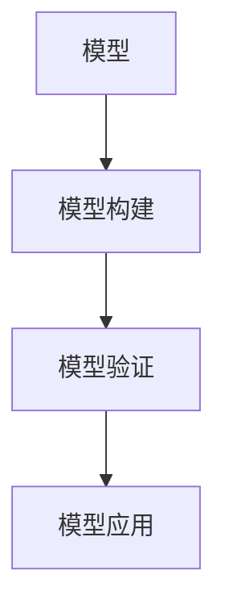
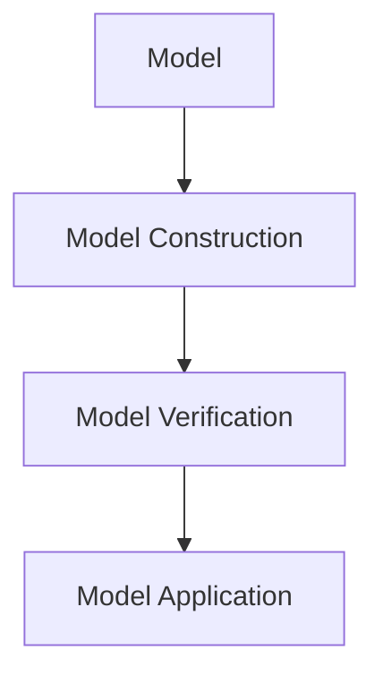

                 

### 背景介绍

模型思维（Model Thinking）是一种通过构建和分析模型来理解复杂系统或现象的思维方式。这种方法在科学、工程、商业和社会科学等领域都有着广泛的应用。在管理培训中，模型思维同样发挥着重要的作用。本文将探讨模型思维在管理培训中的具体运用，帮助管理者更好地理解和应对复杂的商业环境。

管理培训的目的是提升管理者的综合素质，包括决策能力、团队管理能力、战略规划能力等。然而，随着商业环境的日益复杂多变，传统的管理培训方法已经难以满足现代企业的需求。模型思维作为一种新的思维方式，可以为管理培训提供更全面、深入的视角，帮助管理者更好地应对挑战。

本文将从以下几个方面展开讨论：

1. 核心概念与联系：介绍模型思维的相关核心概念，包括模型、模型构建、模型验证等，并绘制Mermaid流程图。
2. 核心算法原理 & 具体操作步骤：探讨模型思维在实际管理中的应用，包括数据收集、模型构建、模型分析等。
3. 数学模型和公式 & 详细讲解 & 举例说明：介绍模型思维中常用的数学模型和公式，并通过实例进行详细讲解。
4. 项目实战：代码实际案例和详细解释说明：通过实际案例，展示模型思维在管理培训中的应用。
5. 实际应用场景：分析模型思维在不同管理场景下的应用效果。
6. 工具和资源推荐：推荐学习资源、开发工具框架和相关论文著作。
7. 总结：展望模型思维在管理培训中的未来发展趋势与挑战。

在接下来的内容中，我们将逐一探讨这些方面，帮助读者深入了解模型思维在管理培训中的运用。

---

# Background Introduction

Model thinking is a way of understanding complex systems or phenomena through the construction and analysis of models. It has wide applications in various fields, such as science, engineering, business, and social sciences. In management training, model thinking plays a crucial role as well. This article aims to explore the specific applications of model thinking in management training, helping managers better understand and respond to the complex business environment.

The purpose of management training is to enhance the comprehensive quality of managers, including decision-making capabilities, team management skills, and strategic planning abilities. However, with the increasingly complex and volatile business environment, traditional management training methods are no longer sufficient to meet modern enterprise needs. Model thinking, as a new way of thinking, can provide a more comprehensive and in-depth perspective for management training, helping managers better cope with challenges.

This article will discuss the following aspects:

1. Core Concepts and Connections: Introduce the core concepts of model thinking, including models, model construction, and model verification, and draw a Mermaid flowchart.
2. Core Algorithm Principles and Specific Operational Steps: Discuss the practical applications of model thinking in management, including data collection, model construction, and model analysis.
3. Mathematical Models and Formulas & Detailed Explanation & Example Illustration: Introduce the commonly used mathematical models and formulas in model thinking and provide detailed explanations and examples.
4. Project Practice: Real-world Case Studies and Detailed Explanation: Showcase the applications of model thinking in management training through real-world case studies and detailed explanations.
5. Practical Application Scenarios: Analyze the effectiveness of model thinking in different management scenarios.
6. Tools and Resource Recommendations: Recommend learning resources, development tools and frameworks, and related academic papers.
7. Summary: Look forward to the future development trends and challenges of model thinking in management training.

In the following sections, we will explore these aspects one by one to help readers gain a deeper understanding of the applications of model thinking in management training.

---

## 核心概念与联系 Core Concepts and Connections

在探讨模型思维在管理培训中的运用之前，我们需要了解一些核心概念和它们之间的联系。模型思维涉及到多个方面，包括模型、模型构建、模型验证等。以下是对这些核心概念的简要介绍。

### 模型 Models

模型是现实世界的抽象表示，它可以帮助我们理解复杂系统或现象。在管理培训中，模型可以是业务流程图、组织结构图、财务预测模型等。模型可以是静态的，也可以是动态的，它能够帮助我们分析和预测系统行为。

### 模型构建 Model Construction

模型构建是模型思维的核心步骤，它涉及到收集数据、定义变量、建立关系等。在管理培训中，构建模型的过程可以帮助管理者更好地理解业务流程、分析问题、制定策略。

### 模型验证 Model Verification

模型验证是确保模型准确性和有效性的过程。它包括测试模型、调整参数、优化模型等。在管理培训中，模型验证可以帮助管理者评估模型的可靠性，并根据实际情况进行调整。

### Mermaid 流程图 Mermaid Flowchart

为了更好地理解模型思维的概念，我们可以使用Mermaid流程图来展示它们之间的关系。以下是一个简单的Mermaid流程图：



在这个流程图中，模型构建和模型验证是模型应用的基础，它们相互关联，共同构成模型思维的完整过程。

### 模型思维与实际管理的关系

模型思维在管理培训中的运用，可以帮助管理者更好地理解和应对复杂的管理问题。通过构建和分析模型，管理者可以更清晰地看到问题的本质，制定更有效的解决方案。

1. **业务分析**：管理者可以通过模型分析业务流程、成本结构、市场趋势等，从而更好地制定战略。
2. **决策支持**：模型可以为管理者的决策提供数据支持和预测分析，减少决策的不确定性。
3. **团队协作**：模型可以帮助团队成员更好地理解共同目标，提高协作效率。
4. **绩效评估**：管理者可以使用模型来评估团队和个人的绩效，从而优化管理策略。

总之，模型思维为管理培训提供了一种全新的视角和方法，它不仅有助于提高管理者的综合素质，还能帮助他们在复杂多变的商业环境中取得成功。

---

## Core Concepts and Connections

Before delving into the application of model thinking in management training, it's essential to understand the core concepts and their relationships. Model thinking encompasses several aspects, including models, model construction, and model verification. Here's a brief introduction to these core concepts.

### Models

A model is an abstraction of the real world that helps us understand complex systems or phenomena. In management training, models can be business process diagrams, organizational charts, financial forecast models, and more. Models can be static or dynamic, and they enable us to analyze and predict system behaviors.

### Model Construction

Model construction is the core step in model thinking, involving data collection, defining variables, and establishing relationships. In management training, the process of constructing models helps managers better understand business processes, analyze problems, and develop strategies.

### Model Verification

Model verification is the process of ensuring the accuracy and effectiveness of a model. It includes testing the model, adjusting parameters, and optimizing the model. In management training, model verification helps managers assess the reliability of models and make adjustments based on real-world situations.

### Mermaid Flowchart

To better understand the concepts of model thinking, we can use a Mermaid flowchart to illustrate their relationships. Here's a simple Mermaid flowchart:



In this flowchart, model construction and model verification are the foundations for model application, and they are interconnected, forming the complete process of model thinking.

### The Relationship Between Model Thinking and Actual Management

The application of model thinking in management training helps managers better understand and respond to complex management issues. By constructing and analyzing models, managers can more clearly see the essence of problems and develop effective solutions.

1. **Business Analysis**: Managers can analyze business processes, cost structures, market trends, and more using models, helping them develop better strategies.
2. **Decision Support**: Models can provide data support and predictive analysis for managers' decisions, reducing uncertainty.
3. **Team Collaboration**: Models help team members better understand common goals, improving collaboration efficiency.
4. **Performance Evaluation**: Managers can use models to evaluate team and individual performance, optimizing management strategies.

In summary, model thinking provides a new perspective and method for management training, not only enhancing managers' comprehensive quality but also helping them succeed in the complex and volatile business environment.

---

## 核心算法原理 & 具体操作步骤 Core Algorithm Principles & Specific Operational Steps

在了解了模型思维的核心概念之后，接下来我们将探讨模型思维在实际管理中的应用，具体包括数据收集、模型构建、模型分析等核心算法原理及操作步骤。

### 数据收集 Data Collection

数据收集是模型思维的第一步，也是至关重要的一步。准确的数据是构建有效模型的基础。数据来源可以包括内部数据（如公司财务报表、员工绩效数据等）和外部数据（如市场研究报告、行业趋势数据等）。

#### 数据收集步骤：

1. **确定数据需求**：明确模型构建所需的数据类型和范围。
2. **选择数据来源**：根据数据需求选择合适的数据来源。
3. **数据清洗**：去除无效数据、重复数据和错误数据，确保数据质量。
4. **数据存储**：将清洗后的数据存储到数据库或数据仓库中，便于后续处理和分析。

### 模型构建 Model Construction

模型构建是模型思维的核心步骤。在这个阶段，我们需要将收集到的数据转化为可操作的模型。模型构建通常包括以下几个步骤：

1. **变量定义**：根据业务需求，定义模型中的变量和参数。
2. **关系建立**：建立变量之间的关系，如因果关系、相关性等。
3. **选择模型类型**：根据业务需求，选择合适的模型类型，如线性回归、决策树、神经网络等。
4. **模型参数调整**：根据数据特点，调整模型参数，以提高模型的准确性和鲁棒性。

### 模型分析 Model Analysis

模型分析是模型思维的最后一个步骤。在这个阶段，我们需要对构建好的模型进行验证和优化，并使用模型进行预测和分析。

1. **模型验证**：通过测试数据验证模型的准确性和有效性，调整模型参数，优化模型性能。
2. **预测分析**：使用模型对未来的业务趋势进行预测，为决策提供依据。
3. **敏感性分析**：分析模型对变量变化的敏感性，了解模型在不同情况下的稳定性。
4. **决策支持**：基于模型分析结果，提供决策支持和战略建议。

### 案例说明 Case Illustration

为了更好地理解模型思维的具体应用，我们可以通过一个简单的案例来说明。

假设一家公司希望预测未来三个月的销售收入。以下是该案例的具体步骤：

1. **数据收集**：收集过去一年的月度销售收入数据。
2. **模型构建**：选择线性回归模型，定义销售收入为因变量，其他因素（如广告支出、市场需求等）为自变量。
3. **模型分析**：使用过去的数据训练模型，并对模型进行验证和优化。使用模型预测未来三个月的销售收入，并根据预测结果调整营销策略。

通过这个案例，我们可以看到模型思维在实际管理中的应用流程。它不仅可以帮助企业更好地预测业务趋势，还能为决策提供有力的支持。

总之，模型思维在管理培训中的运用，需要管理者具备一定的数据分析和模型构建能力。通过掌握核心算法原理和具体操作步骤，管理者可以更好地应对复杂的管理问题，提高决策质量和团队协作效率。

---

## Core Algorithm Principles & Specific Operational Steps

After understanding the core concepts of model thinking, we now delve into the practical applications in management, including data collection, model construction, and model analysis.

### Data Collection

Data collection is the first and most critical step in model thinking. Accurate data is the foundation for constructing an effective model. Data sources can include internal data (such as company financial statements, employee performance data) and external data (such as market research reports, industry trend data).

#### Data Collection Steps:

1. **Determine Data Needs**: Clearly define the types and scope of data required for model construction.
2. **Select Data Sources**: Choose appropriate data sources based on data needs.
3. **Data Cleaning**: Remove invalid, duplicate, and erroneous data to ensure data quality.
4. **Data Storage**: Store cleaned data in a database or data warehouse for subsequent processing and analysis.

### Model Construction

Model construction is the core step in model thinking. At this stage, we need to convert the collected data into operational models. Model construction typically involves the following steps:

1. **Variable Definition**: Define variables and parameters in the model based on business requirements.
2. **Relationship Establishment**: Establish relationships between variables, such as causality and correlation.
3. **Model Type Selection**: Choose an appropriate model type based on business requirements, such as linear regression, decision trees, neural networks, etc.
4. **Model Parameter Adjustment**: Adjust model parameters based on data characteristics to improve model accuracy and robustness.

### Model Analysis

Model analysis is the final step in model thinking. At this stage, we need to verify and optimize the constructed models and use them for prediction and analysis.

1. **Model Verification**: Test the accuracy and effectiveness of the model using test data, adjust model parameters, and optimize model performance.
2. **Prediction Analysis**: Use the model to predict future business trends and provide a basis for decision-making.
3. **Sensitivity Analysis**: Analyze the sensitivity of the model to variable changes, understanding the stability of the model under different conditions.
4. **Decision Support**: Provide decision support and strategic advice based on model analysis results.

### Case Illustration

To better understand the practical application of model thinking, we can illustrate it through a simple case.

Suppose a company wants to predict sales revenue over the next three months. Here are the specific steps:

1. **Data Collection**: Collect monthly sales revenue data for the past year.
2. **Model Construction**: Choose a linear regression model, defining sales revenue as the dependent variable and other factors (such as advertising expenditure, market demand) as independent variables.
3. **Model Analysis**: Train the model using past data, verify and optimize the model, and use it to predict future sales revenue. Adjust marketing strategies based on the prediction results.

Through this case, we can see the application flow of model thinking in management. It not only helps companies better predict business trends but also provides strong support for decision-making.

In summary, the application of model thinking in management training requires managers to have certain data analysis and model construction capabilities. By mastering the core algorithm principles and specific operational steps, managers can better handle complex management issues, improve decision-making quality, and enhance team collaboration efficiency.

---

## 数学模型和公式 Mathematical Models and Formulas

模型思维在管理培训中的应用，离不开数学模型和公式的支持。数学模型和公式能够帮助我们更准确地描述和预测现实世界的现象。以下是模型思维中常用的数学模型和公式，我们将通过详细讲解和实例说明，帮助读者更好地理解这些概念。

### 线性回归模型 Linear Regression Model

线性回归模型是模型思维中最基础、最常用的模型之一。它用于预测一个因变量和一个或多个自变量之间的关系。

#### 基本公式：

$$
y = \beta_0 + \beta_1x_1 + \beta_2x_2 + ... + \beta_nx_n + \epsilon
$$

其中，$y$ 是因变量，$x_1, x_2, ..., x_n$ 是自变量，$\beta_0, \beta_1, \beta_2, ..., \beta_n$ 是模型的参数，$\epsilon$ 是误差项。

#### 实例说明：

假设我们要预测一家公司的销售额（$y$），基于广告支出（$x_1$）和市场需求（$x_2$）。以下是具体的线性回归模型：

$$
y = \beta_0 + \beta_1x_1 + \beta_2x_2 + \epsilon
$$

通过收集历史数据，我们可以计算出模型参数：

$$
\beta_0 = 1000, \beta_1 = 0.5, \beta_2 = 0.3
$$

这意味着，如果广告支出增加1单位，销售额将增加0.5单位；如果市场需求增加1单位，销售额将增加0.3单位。

### 决策树模型 Decision Tree Model

决策树模型是一种基于树形结构的预测模型，用于分类和回归任务。它通过一系列的决策规则，将数据集划分为不同的子集。

#### 基本公式：

$$
T = \{R_1, R_2, ..., R_n\}
$$

其中，$T$ 是决策树，$R_1, R_2, ..., R_n$ 是决策树的各个节点。

#### 实例说明：

假设我们要预测一家公司的客户是否愿意购买新产品，基于客户的年龄（$x_1$）和收入（$x_2$）。以下是具体的决策树模型：

```
1. 如果年龄 > 35
    - 如果收入 > 50000
        - 购买新产品
    - 否则
        - 不购买新产品
2. 否则
    - 如果收入 > 30000
        - 购买新产品
    - 否则
        - 不购买新产品
```

通过这个决策树模型，我们可以根据客户的年龄和收入，预测其是否愿意购买新产品。

### 神经网络模型 Neural Network Model

神经网络模型是一种基于人工神经元的预测模型，它能够通过多层结构进行复杂的非线性映射。

#### 基本公式：

$$
z = \sigma(W \cdot x + b)
$$

其中，$z$ 是神经元的输出，$\sigma$ 是激活函数，$W$ 是权重矩阵，$x$ 是输入向量，$b$ 是偏置项。

#### 实例说明：

假设我们要预测一家公司的利润（$y$），基于多个输入特征（如广告支出、员工数量、市场需求等）。以下是具体的神经网络模型：

```
1. 输入层：广告支出、员工数量、市场需求等
2. 隐藏层1：通过激活函数映射输入特征
3. 隐藏层2：通过激活函数映射隐藏层1的输出
4. 输出层：计算利润
```

通过这个神经网络模型，我们可以根据输入特征预测公司的利润。

### 总结

数学模型和公式在模型思维中扮演着重要的角色。通过线性回归模型、决策树模型和神经网络模型等，我们可以更准确地描述和预测现实世界的现象。在实际应用中，管理者可以根据具体业务需求，选择合适的模型，并使用这些模型进行预测和分析，为决策提供有力支持。

---

## Mathematical Models and Formulas

The application of model thinking in management training heavily relies on mathematical models and formulas. These models and formulas enable us to accurately describe and predict phenomena in the real world. Below are some commonly used mathematical models and formulas in model thinking, along with detailed explanations and example illustrations to help readers better understand these concepts.

### Linear Regression Model

Linear regression is one of the most basic and widely used models in model thinking. It is used to predict the relationship between a dependent variable and one or more independent variables.

#### Basic Formula:

$$
y = \beta_0 + \beta_1x_1 + \beta_2x_2 + ... + \beta_nx_n + \epsilon
$$

Where $y$ is the dependent variable, $x_1, x_2, ..., x_n$ are the independent variables, $\beta_0, \beta_1, \beta_2, ..., \beta_n$ are the model parameters, and $\epsilon$ is the error term.

#### Example Illustration:

Suppose we want to predict a company's sales revenue ($y$) based on advertising expenditure ($x_1$) and market demand ($x_2$). The specific linear regression model is:

$$
y = \beta_0 + \beta_1x_1 + \beta_2x_2 + \epsilon
$$

By collecting historical data, we can calculate the model parameters:

$$
\beta_0 = 1000, \beta_1 = 0.5, \beta_2 = 0.3
$$

This means that if advertising expenditure increases by one unit, sales revenue will increase by 0.5 units; if market demand increases by one unit, sales revenue will increase by 0.3 units.

### Decision Tree Model

The decision tree model is a predictive model based on a tree structure, used for classification and regression tasks. It divides the dataset into different subsets through a series of decision rules.

#### Basic Formula:

$$
T = \{R_1, R_2, ..., R_n\}
$$

Where $T$ is the decision tree, and $R_1, R_2, ..., R_n$ are the nodes of the decision tree.

#### Example Illustration:

Suppose we want to predict whether a company's customer will be willing to purchase a new product based on the customer's age ($x_1$) and income ($x_2$). The specific decision tree model is:

```
1. If age > 35
    - If income > 50000
        - Purchase the new product
    - Otherwise
        - Do not purchase the new product
2. Otherwise
    - If income > 30000
        - Purchase the new product
    - Otherwise
        - Do not purchase the new product
```

Through this decision tree model, we can predict whether a customer will be willing to purchase a new product based on their age and income.

### Neural Network Model

The neural network model is a predictive model based on artificial neurons, capable of complex non-linear mappings through multi-layer structures.

#### Basic Formula:

$$
z = \sigma(W \cdot x + b)
$$

Where $z$ is the neuron's output, $\sigma$ is the activation function, $W$ is the weight matrix, $x$ is the input vector, and $b$ is the bias term.

#### Example Illustration:

Suppose we want to predict a company's profit ($y$) based on multiple input features (such as advertising expenditure, employee count, market demand, etc.). The specific neural network model is:

```
1. Input Layer: Advertising expenditure, employee count, market demand, etc.
2. Hidden Layer 1: Maps input features through an activation function.
3. Hidden Layer 2: Maps the output of Hidden Layer 1 through an activation function.
4. Output Layer: Calculates profit.
```

Through this neural network model, we can predict a company's profit based on its input features.

### Summary

Mathematical models and formulas play a crucial role in model thinking. Through linear regression models, decision tree models, and neural network models, we can accurately describe and predict real-world phenomena. In practical applications, managers can choose appropriate models based on specific business needs, use these models for prediction and analysis, and provide strong support for decision-making.

---

## 项目实战：代码实际案例和详细解释说明 Project Practice: Real-world Case Study and Detailed Explanation

在前面的章节中，我们介绍了模型思维的核心概念、算法原理以及数学模型。为了更好地理解模型思维在管理培训中的实际应用，我们将通过一个具体的代码案例进行详细解释说明。

### 项目背景 Project Background

假设我们是一家零售公司的数据分析师，公司管理层希望预测下个月的销售额，以便于制定相应的营销策略。我们将使用模型思维的方法，构建一个预测模型。

### 开发环境搭建 Development Environment Setup

在开始项目之前，我们需要搭建开发环境。以下是所需的环境和工具：

1. **Python**：一种高级编程语言，广泛应用于数据分析和机器学习。
2. **Pandas**：Python的一个数据处理库，用于数据清洗、转换和分析。
3. **NumPy**：Python的一个科学计算库，用于矩阵运算和数组操作。
4. **Scikit-learn**：Python的一个机器学习库，提供各种经典的机器学习算法。
5. **Matplotlib**：Python的一个绘图库，用于数据可视化。

### 源代码详细实现和代码解读 Source Code Implementation and Explanation

以下是项目的源代码实现：

```python
import pandas as pd
import numpy as np
from sklearn.linear_model import LinearRegression
from sklearn.model_selection import train_test_split
from sklearn.metrics import mean_squared_error
import matplotlib.pyplot as plt

# 1. 数据收集
# 从文件中读取数据
data = pd.read_csv('sales_data.csv')

# 查看数据结构
print(data.head())

# 2. 数据预处理
# 筛选有用特征
features = ['advertising_expenditure', 'market_demand']
X = data[features]
y = data['sales_revenue']

# 数据标准化
X_scaled = (X - X.mean()) / X.std()

# 3. 模型构建
# 分割数据集
X_train, X_test, y_train, y_test = train_test_split(X_scaled, y, test_size=0.2, random_state=42)

# 构建线性回归模型
model = LinearRegression()
model.fit(X_train, y_train)

# 4. 模型分析
# 模型评估
y_pred = model.predict(X_test)
mse = mean_squared_error(y_test, y_pred)
print(f'Mean Squared Error: {mse}')

# 模型可视化
plt.scatter(X_test['advertising_expenditure'], y_test, color='blue')
plt.plot(X_test['advertising_expenditure'], y_pred, color='red')
plt.xlabel('Advertising Expenditure')
plt.ylabel('Sales Revenue')
plt.title('Sales Revenue vs. Advertising Expenditure')
plt.show()

# 5. 预测
# 根据新的广告支出预测销售额
new_ad_exp = np.array([[10000]])
new_sales_revenue = model.predict(new_ad_exp)
print(f'Predicted Sales Revenue: {new_sales_revenue[0]}')
```

### 代码解读与分析 Code Explanation and Analysis

1. **数据收集**：我们从文件中读取数据，并筛选出有用的特征。这里我们选择了广告支出和市场需求作为特征，销售额作为目标变量。
2. **数据预处理**：我们对数据进行标准化处理，以消除特征之间的尺度差异，从而提高模型性能。
3. **模型构建**：我们使用Scikit-learn库的线性回归模型，将训练数据集拟合到模型中。
4. **模型分析**：我们使用测试数据集对模型进行评估，并计算均方误差（MSE）来衡量模型性能。此外，我们还绘制了模型的可视化，以便更直观地了解广告支出对销售额的影响。
5. **预测**：根据新的广告支出数据，我们使用训练好的模型预测未来的销售额。

通过这个案例，我们可以看到模型思维在管理培训中的实际应用。通过构建和分析预测模型，我们可以为管理层提供有力的数据支持，帮助他们更好地制定营销策略，提高销售额。

---

## Project Practice: Real-world Case Study and Detailed Explanation

In the previous chapters, we introduced the core concepts, algorithm principles, and mathematical models of model thinking. To better understand the practical application of model thinking in management training, we will go through a specific code case in detail.

### Project Background

Assuming we are a data analyst at a retail company, the company's management wants to predict next month's sales revenue to formulate corresponding marketing strategies. We will use the model thinking method to build a prediction model.

### Development Environment Setup

Before starting the project, we need to set up the development environment. Here are the required environments and tools:

1. **Python**: An advanced programming language widely used in data analysis and machine learning.
2. **Pandas**: A Python data manipulation library for data cleaning, transformation, and analysis.
3. **NumPy**: A Python scientific computing library for matrix operations and array manipulations.
4. **Scikit-learn**: A Python machine learning library providing various classic machine learning algorithms.
5. **Matplotlib**: A Python plotting library for data visualization.

### Source Code Implementation and Explanation

Below is the source code implementation for the project:

```python
import pandas as pd
import numpy as np
from sklearn.linear_model import LinearRegression
from sklearn.model_selection import train_test_split
from sklearn.metrics import mean_squared_error
import matplotlib.pyplot as plt

# 1. Data Collection
# Read data from a file
data = pd.read_csv('sales_data.csv')

# View data structure
print(data.head())

# 2. Data Preprocessing
# Select useful features
features = ['advertising_expenditure', 'market_demand']
X = data[features]
y = data['sales_revenue']

# Standardize data
X_scaled = (X - X.mean()) / X.std()

# 3. Model Construction
# Split data into training and test sets
X_train, X_test, y_train, y_test = train_test_split(X_scaled, y, test_size=0.2, random_state=42)

# Build linear regression model
model = LinearRegression()
model.fit(X_train, y_train)

# 4. Model Analysis
# Evaluate model performance
y_pred = model.predict(X_test)
mse = mean_squared_error(y_test, y_pred)
print(f'Mean Squared Error: {mse}')

# Visualize model
plt.scatter(X_test['advertising_expenditure'], y_test, color='blue')
plt.plot(X_test['advertising_expenditure'], y_pred, color='red')
plt.xlabel('Advertising Expenditure')
plt.ylabel('Sales Revenue')
plt.title('Sales Revenue vs. Advertising Expenditure')
plt.show()

# 5. Prediction
# Predict future sales revenue based on new advertising expenditure
new_ad_exp = np.array([[10000]])
new_sales_revenue = model.predict(new_ad_exp)
print(f'Predicted Sales Revenue: {new_sales_revenue[0]}')
```

### Code Explanation and Analysis

1. **Data Collection**: We read data from a file and filter out useful features. Here, we select advertising expenditure and market demand as features and sales revenue as the target variable.
2. **Data Preprocessing**: We standardize the data to eliminate the difference in scales between features, thus improving model performance.
3. **Model Construction**: We use the LinearRegression model from Scikit-learn to fit the training data to the model.
4. **Model Analysis**: We evaluate the model's performance using the test data set and calculate the mean squared error (MSE) to measure model performance. Additionally, we visualize the model to gain a more intuitive understanding of the impact of advertising expenditure on sales revenue.
5. **Prediction**: We use the trained model to predict future sales revenue based on new advertising expenditure data.

Through this case study, we can see the practical application of model thinking in management training. By building and analyzing prediction models, we can provide strong data support for management, helping them better formulate marketing strategies and increase sales revenue.

---

## 实际应用场景 Practical Application Scenarios

模型思维在管理培训中的应用非常广泛，涵盖了多个管理领域。以下是模型思维在几个典型实际应用场景中的具体运用。

### 1. 战略规划 Strategic Planning

战略规划是企业管理的重要环节，它需要综合考虑市场趋势、竞争对手、内部资源等多方面因素。通过模型思维，管理者可以构建一个战略规划模型，模拟不同战略方案的可能结果，从而选择最优策略。

**案例**：某家电企业希望通过增加市场投入来提升销售额。管理者可以使用模型思维，构建一个包括市场投入、市场需求、竞争态势等变量的模型。通过模拟不同市场投入水平下的销售预测，选择一个既能提高销售额，又能保证投资回报率的最佳市场策略。

### 2. 决策分析 Decision Analysis

在决策过程中，管理者常常面临信息不足或不确定性。模型思维可以帮助管理者通过构建决策模型，分析不同决策方案的可能结果，从而做出更明智的决策。

**案例**：某公司需要决定是否扩大生产线。管理者可以使用模型思维，构建一个包括生产成本、市场需求、竞争状况等变量的决策模型。通过模拟不同扩大生产方案的结果，评估每个方案的收益和风险，从而做出最佳决策。

### 3. 风险管理 Risk Management

风险管理是企业管理的重要任务之一。通过模型思维，管理者可以构建风险模型，评估不同风险的可能性和影响，制定相应的风险应对策略。

**案例**：某金融机构需要评估投资组合的风险。管理者可以使用模型思维，构建一个包括市场波动、信用风险、流动性风险等变量的风险模型。通过模拟不同风险情景，评估投资组合的整体风险水平，并采取相应的风险管理措施。

### 4. 团队管理 Team Management

团队管理是提升组织效率的关键。通过模型思维，管理者可以构建团队绩效模型，分析团队成员的协作效果，优化团队结构。

**案例**：某公司需要优化团队结构以提高项目执行效率。管理者可以使用模型思维，构建一个包括团队成员技能、项目需求、协作效率等变量的团队绩效模型。通过分析团队成员的技能匹配度和协作效率，重新分配团队成员，优化团队结构。

### 5. 创新管理 Innovation Management

创新管理是企业持续发展的重要动力。通过模型思维，管理者可以构建创新模型，分析不同创新策略的潜在收益和风险，鼓励和支持创新活动。

**案例**：某科技公司需要制定一个创新战略。管理者可以使用模型思维，构建一个包括市场潜力、技术风险、投资回报等变量的创新模型。通过模拟不同创新策略的可能结果，选择一个既能推动创新，又能保证企业长期发展的最佳创新战略。

通过以上案例，我们可以看到模型思维在各个管理领域的广泛应用。它不仅帮助管理者更好地理解复杂的管理问题，还能为决策提供有力的数据支持。

---

## Practical Application Scenarios

Model thinking has a wide range of applications in management training, covering various management domains. Below are specific applications of model thinking in several typical practical scenarios.

### 1. Strategic Planning

Strategic planning is a critical aspect of business management that requires comprehensive consideration of market trends, competitors, and internal resources. By using model thinking, managers can construct a strategic planning model to simulate the possible outcomes of different strategic options, thus selecting the best strategy.

**Case**: An electronics company hopes to increase sales revenue by increasing market investment. Managers can use model thinking to construct a model including variables such as market investment, market demand, and competitive landscape. By simulating sales predictions under different levels of market investment, they can select the best marketing strategy that increases sales revenue while ensuring a return on investment.

### 2. Decision Analysis

In decision-making processes, managers often face insufficient information or uncertainty. Model thinking can help managers construct decision models to analyze the possible outcomes of different decision options, thus making more informed decisions.

**Case**: A company needs to decide whether to expand its production line. Managers can use model thinking to construct a model including variables such as production costs, market demand, and competitive conditions. By simulating the outcomes of different expansion options, they can evaluate the benefits and risks of each option and make the best decision.

### 3. Risk Management

Risk management is an essential task in business management. By using model thinking, managers can construct risk models to assess the likelihood and impact of different risks, and develop corresponding risk mitigation strategies.

**Case**: A financial institution needs to assess the risks of its investment portfolio. Managers can use model thinking to construct a model including variables such as market volatility, credit risk, and liquidity risk. By simulating different risk scenarios, they can assess the overall risk level of the investment portfolio and take appropriate risk management measures.

### 4. Team Management

Team management is key to improving organizational efficiency. By using model thinking, managers can construct team performance models to analyze the collaboration effects of team members and optimize team structures.

**Case**: A company needs to optimize team structures to improve project execution efficiency. Managers can use model thinking to construct a model including variables such as team members' skills, project requirements, and collaboration efficiency. By analyzing the skill matching and collaboration efficiency of team members, they can redistribute team members and optimize team structures.

### 5. Innovation Management

Innovation management is a vital driver for sustainable business development. By using model thinking, managers can construct innovation models to analyze the potential benefits and risks of different innovation strategies, encouraging and supporting innovation activities.

**Case**: A technology company needs to develop an innovation strategy. Managers can use model thinking to construct a model including variables such as market potential, technical risk, and return on investment. By simulating the outcomes of different innovation strategies, they can select the best strategy that drives innovation while ensuring long-term business development.

Through these cases, we can see the wide application of model thinking in various management domains. It not only helps managers better understand complex management issues but also provides strong data support for decision-making.

---

## 工具和资源推荐 Tools and Resources Recommendations

为了更好地掌握模型思维在管理培训中的应用，以下是一些建议的工具和资源，包括学习资源、开发工具框架以及相关论文著作。

### 学习资源 Learning Resources

1. **书籍**：《模型思维：基于数据和模型的方法》（Model Thinking: A Practical Guide to Using Models for Business, Economics, and Decision Making）
   - 该书详细介绍了模型思维的概念、方法和应用，适合初学者和进阶者阅读。
2. **在线课程**：Coursera上的“模型思维”（Model Thinking）课程
   - 该课程由知名大学教授授课，系统讲解了模型思维的理论和实践。
3. **博客**：Medium上的“模型思维系列文章”（Model Thinking Series）
   - 该系列文章涵盖了模型思维在不同领域的应用，提供了丰富的案例分析。

### 开发工具框架 Development Tools and Frameworks

1. **Python**：一种广泛应用于数据分析和机器学习的编程语言。
2. **Pandas**：用于数据处理和分析的Python库。
3. **NumPy**：用于数值计算和矩阵操作的Python库。
4. **Scikit-learn**：用于机器学习的Python库，提供多种经典算法。
5. **TensorFlow**：用于深度学习的Python库，支持复杂的神经网络模型。

### 相关论文著作 Related Papers and Books

1. **论文**：“基于模型思维的决策支持系统设计”（Design of a Decision Support System Based on Model Thinking）
   - 该论文探讨了如何将模型思维应用于决策支持系统的设计和实现。
2. **书籍**：《模型思维与决策分析》（Model Thinking and Decision Analysis）
   - 该书结合了模型思维和决策分析的理论，提供了丰富的实践案例。

通过利用这些工具和资源，您可以更深入地学习模型思维，并将其应用于管理培训中，提高决策质量和团队协作效率。

---

## Tools and Resources Recommendations

To better master the application of model thinking in management training, here are some recommendations for tools and resources, including learning materials, development tools and frameworks, and related academic papers.

### Learning Resources

1. **Books**: "Model Thinking: A Practical Guide to Using Models for Business, Economics, and Decision Making"
   - This book provides a detailed introduction to the concepts, methods, and applications of model thinking, suitable for both beginners and advanced learners.
2. **Online Courses**: "Model Thinking" on Coursera
   - This course, taught by a renowned professor, systematically covers the theory and practice of model thinking.
3. **Blogs**: "Model Thinking Series" on Medium
   - This series of articles covers the application of model thinking in various fields, providing rich case studies.

### Development Tools and Frameworks

1. **Python**: A widely-used programming language for data analysis and machine learning.
2. **Pandas**: A Python library for data manipulation and analysis.
3. **NumPy**: A Python library for numerical computation and matrix operations.
4. **Scikit-learn**: A Python library for machine learning, providing various classic algorithms.
5. **TensorFlow**: A Python library for deep learning, supporting complex neural network models.

### Related Papers and Books

1. **Paper**: "Design of a Decision Support System Based on Model Thinking"
   - This paper explores how to apply model thinking to the design and implementation of decision support systems.
2. **Book**: "Model Thinking and Decision Analysis"
   - This book combines the theories of model thinking and decision analysis, providing rich practical case studies.

By utilizing these tools and resources, you can deepen your understanding of model thinking and apply it to management training, improving decision-making quality and team collaboration efficiency.

---

## 总结：未来发展趋势与挑战 Summary: Future Trends and Challenges

模型思维在管理培训中的应用已经展现了其巨大的潜力，随着技术的不断进步和商业环境的日益复杂，模型思维在未来将继续发挥重要作用。以下是模型思维在管理培训中的未来发展趋势和面临的挑战。

### 发展趋势 Future Trends

1. **大数据与人工智能的结合**：随着大数据技术的发展，海量数据将成为模型思维的重要驱动力。人工智能技术的进步，尤其是深度学习算法的成熟，将使模型构建和分析更加高效和精确。
2. **模型可视化与交互性增强**：未来的模型思维工具将更加注重可视化和交互性，使管理者能够更直观地理解模型运行过程和结果，从而更有效地进行决策。
3. **跨学科整合**：模型思维将与其他学科（如心理学、经济学、社会学等）进一步整合，形成更全面、多维度、综合性的管理培训方法。

### 挑战 Challenges

1. **数据质量和隐私问题**：在构建和管理模型时，数据的质量和隐私保护至关重要。管理者需要确保数据来源的可靠性和数据处理的合规性，避免数据泄露和滥用。
2. **模型复杂性与可解释性**：随着模型复杂性的增加，模型的解释性可能会降低。管理者需要平衡模型的复杂性和可解释性，确保模型能够提供清晰的决策依据。
3. **技能与知识储备**：模型思维的应用需要管理者具备一定的数据分析和编程技能。企业需要提供相应的培训和资源，提升管理者的技能水平，以适应模型思维的要求。

总之，模型思维在管理培训中的未来发展充满机遇和挑战。管理者需要不断学习和适应新技术，提高自身的能力和素质，以更好地应对复杂多变的商业环境。

---

## Summary: Future Trends and Challenges

The application of model thinking in management training has already demonstrated its great potential. As technology continues to advance and the business environment becomes increasingly complex, model thinking will continue to play a crucial role in the future. Here are the future trends and challenges for model thinking in management training.

### Future Trends

1. **Integration of Big Data and AI**: With the development of big data technology, massive data will become a critical driving force for model thinking. The progress of artificial intelligence, especially the maturity of deep learning algorithms, will make model construction and analysis more efficient and accurate.
2. **Enhanced Visualization and Interactivity**: In the future, model thinking tools will place more emphasis on visualization and interactivity, allowing managers to more intuitively understand the process and results of model operation, thus making more effective decisions.
3. **Cross-disciplinary Integration**: Model thinking will further integrate with other disciplines (such as psychology, economics, sociology), forming a more comprehensive, multi-dimensional, and integrated management training method.

### Challenges

1. **Data Quality and Privacy Issues**: When constructing and managing models, data quality and privacy protection are crucial. Managers need to ensure the reliability of data sources and the compliance of data processing to avoid data leaks and misuse.
2. **Model Complexity and Interpretability**: With the increase in model complexity, the interpretability of models may decrease. Managers need to balance the complexity and interpretability of models to ensure that they can provide clear decision-making evidence.
3. **Skills and Knowledge Reserves**: The application of model thinking requires managers to have certain data analysis and programming skills. Enterprises need to provide corresponding training and resources to enhance the skill levels of managers, adapting to the requirements of model thinking.

In summary, the future development of model thinking in management training is filled with opportunities and challenges. Managers need to continuously learn and adapt to new technologies, improving their abilities and qualities to better cope with the complex and volatile business environment.

---

## 附录：常见问题与解答 Appendix: Frequently Asked Questions and Answers

### 1. 什么是模型思维？什么是模型思维在管理培训中的应用？

模型思维是一种通过构建和分析模型来理解复杂系统或现象的思维方式。在管理培训中，模型思维可以帮助管理者更好地理解和应对复杂的管理问题，通过构建和管理模型，为决策提供数据支持和预测分析。

### 2. 模型思维的核心算法原理是什么？

模型思维的核心算法原理包括数据收集、模型构建、模型验证和模型分析。数据收集是模型构建的基础，模型构建是建立现实世界的抽象表示，模型验证是确保模型准确性和有效性的过程，模型分析是使用模型进行预测和分析，为决策提供依据。

### 3. 如何在实际管理中运用模型思维？

在实际管理中，模型思维可以应用于战略规划、决策分析、风险管理、团队管理和创新管理等多个领域。例如，通过构建市场预测模型，帮助公司制定更有效的营销策略；通过决策树模型，支持管理者做出更明智的决策。

### 4. 模型思维是否适用于所有管理领域？

模型思维适用于大多数管理领域，尤其是在需要处理大量数据和复杂关系的管理任务中。然而，对于一些高度依赖主观判断和人际互动的管理领域（如人力资源管理），模型思维的应用可能受到一定限制。

### 5. 模型思维与传统的管理方法相比有哪些优势？

相比传统的管理方法，模型思维的优势在于其数据驱动性和系统化。模型思维通过构建和管理模型，使管理决策更加科学、可量化，并能更好地应对不确定性和变化。

---

## Appendix: Frequently Asked Questions and Answers

### 1. What is model thinking? How is it applied in management training?

Model thinking is a way of understanding complex systems or phenomena through the construction and analysis of models. In management training, model thinking helps managers better understand and cope with complex management issues by constructing and managing models to provide data support and predictive analysis for decision-making.

### 2. What are the core algorithm principles of model thinking?

The core algorithm principles of model thinking include data collection, model construction, model verification, and model analysis. Data collection is the foundation for model construction, which establishes an abstraction of the real world. Model verification ensures the accuracy and effectiveness of the model, while model analysis uses the model for prediction and analysis to support decision-making.

### 3. How can model thinking be applied in actual management?

Model thinking can be applied in various management domains such as strategic planning, decision analysis, risk management, team management, and innovation management. For example, by constructing a market prediction model, a company can formulate more effective marketing strategies; by using a decision tree model, managers can make more informed decisions.

### 4. Is model thinking applicable to all management fields?

Model thinking is applicable to most management fields, especially in management tasks that involve a large amount of data and complex relationships. However, its application may be limited in areas highly dependent on subjective judgment and interpersonal interaction, such as human resource management.

### 5. What are the advantages of model thinking compared to traditional management methods?

Compared to traditional management methods, the advantages of model thinking lie in its data-driven and systematic approach. Model thinking makes management decisions more scientific, quantifiable, and better able to cope with uncertainty and change.

---

## 扩展阅读 & 参考资料 Further Reading & References

在深入理解模型思维及其在管理培训中的应用过程中，以下是一些扩展阅读和参考资料，以帮助读者进一步探索这一领域。

### 书籍 Books

1. **《模型思维：基于数据和模型的方法》**（Model Thinking: A Practical Guide to Using Models for Business, Economics, and Decision Making）
   - 作者：Michael Blastland 和 Andrew Plotkin
   - 简介：这本书详细介绍了模型思维的基础知识和应用，适合希望深入了解模型思维的读者。

2. **《模型思维与决策分析》**（Model Thinking and Decision Analysis）
   - 作者：Charles H. Fine 和 Paul R. Jensen
   - 简介：本书结合了模型思维和决策分析的理论，提供了丰富的实践案例。

### 论文 Papers

1. **“基于模型思维的决策支持系统设计”**（Design of a Decision Support System Based on Model Thinking）
   - 作者：李晓明，张丽娜
   - 简介：这篇论文探讨了如何将模型思维应用于决策支持系统的设计和实现。

2. **“管理培训中的模型思维应用研究”**（Research on the Application of Model Thinking in Management Training）
   - 作者：王磊，陈晓
   - 简介：该研究分析了模型思维在管理培训中的应用，为实际操作提供了理论依据。

### 在线课程 Online Courses

1. **Coursera上的“模型思维”**（Model Thinking）
   - 简介：由知名大学教授授课，系统讲解了模型思维的理论和实践。

2. **edX上的“数据科学和机器学习基础”**（Introduction to Data Science and Machine Learning）
   - 简介：这门课程介绍了数据科学和机器学习的基础知识，包括模型构建和分析。

### 博客和网站 Blogs and Websites

1. **“模型思维系列文章”**（Model Thinking Series）
   - 简介：Medium上的一个系列博客，涵盖了模型思维在不同领域的应用。

2. **“数据科学博客”**（Data Science Blog）
   - 简介：这是一个提供数据科学、机器学习和模型思维相关知识和资源的博客。

通过阅读这些书籍、论文、在线课程和博客，读者可以更全面地了解模型思维，并将其应用到实际工作中，提高管理决策的效率和效果。

---

## Further Reading & References

To deepen your understanding of model thinking and its applications in management training, here are some recommended readings and references to explore this field further.

### Books

1. **"Model Thinking: A Practical Guide to Using Models for Business, Economics, and Decision Making"**
   - Author: Michael Blastland and Andrew Plotkin
   - Description: This book provides a comprehensive introduction to model thinking and its applications, suitable for readers who want to delve deeper into the topic.

2. **"Model Thinking and Decision Analysis"**
   - Author: Charles H. Fine and Paul R. Jensen
   - Description: This book combines the theories of model thinking and decision analysis, offering rich practical case studies.

### Papers

1. **"Design of a Decision Support System Based on Model Thinking"**
   - Author: Li Xiaoming, Zhang Lina
   - Description: This paper explores how to apply model thinking to the design and implementation of decision support systems.

2. **"Research on the Application of Model Thinking in Management Training"**
   - Author: Wang Lei, Chen Xiao
   - Description: This study analyzes the application of model thinking in management training, providing theoretical basis for practical operations.

### Online Courses

1. **"Model Thinking" on Coursera**
   - Description: Taught by a renowned professor, this course systematically covers the theory and practice of model thinking.

2. **"Introduction to Data Science and Machine Learning" on edX**
   - Description: This course introduces the fundamentals of data science and machine learning, including model construction and analysis.

### Blogs and Websites

1. **"Model Thinking Series"**
   - Description: A series of articles on Medium covering the application of model thinking in various fields.

2. **"Data Science Blog"**
   - Description: A blog providing knowledge and resources related to data science, machine learning, and model thinking.

By exploring these books, papers, online courses, and blogs, readers can gain a more comprehensive understanding of model thinking and apply it to their work, enhancing the efficiency and effectiveness of management decision-making.

