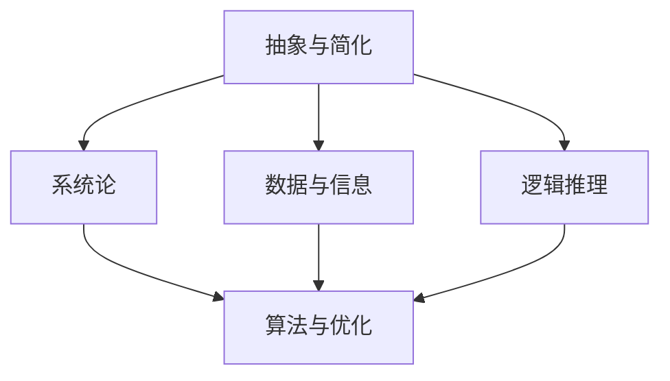

                 

### 背景介绍

在当今快速发展的信息技术时代，模型思维作为一种关键工具，正日益成为提升管理效率的重要手段。模型思维，简而言之，是一种通过建立抽象模型来理解和解决实际问题的方法。在管理领域，模型思维不仅帮助我们更好地理解复杂系统的运作，还能够预见潜在问题，优化决策流程，从而显著提高管理效率。

本文旨在探讨模型思维在管理效率提升中的关键作用。我们将首先介绍模型思维的基本概念及其与传统管理方法的不同之处，然后通过一个具体案例来展示模型思维在实际应用中的效果。接下来，我们将深入探讨模型思维背后的数学原理和算法，帮助读者理解其内在逻辑。此外，文章还将通过实际项目和代码案例，详细讲解如何运用模型思维解决实际问题。最后，我们将总结模型思维在管理中的应用场景，并展望其未来的发展趋势与挑战。

通过本文的阅读，读者将能够：

1. 理解模型思维的基本概念和重要性。
2. 了解模型思维与传统管理方法的差异。
3. 学习如何运用模型思维解决实际管理问题。
4. 掌握模型思维在各个管理场景中的应用实例。
5. 预见模型思维在未来的发展趋势与挑战。

模型思维作为管理工具，具有无可比拟的优越性，能够在复杂多变的环境中提供清晰的方向和高效的解决方案。接下来，让我们深入探讨模型思维的核心概念和作用。

### 模型思维的定义与应用

模型思维（Model Thinking）是一种通过抽象和简化的方式，将复杂现实问题转化为易于理解和分析模型的方法。这种方法的核心在于利用数学、逻辑和系统论等工具，将现实问题中的关键因素提取出来，建立数学模型或概念模型，从而更好地理解和解决问题。与传统的经验管理或直觉管理方法不同，模型思维强调通过数据分析和逻辑推理来指导决策，从而提高管理的科学性和系统性。

首先，模型思维的应用可以从以下几个方面进行具体描述：

1. **数据可视化**：通过图表、图形等方式将数据转换为视觉化的信息，使管理者能够更直观地理解数据的内在联系和趋势。例如，使用折线图、柱状图等可视化工具，可以帮助管理者快速识别数据的波动和变化，从而做出更加准确的决策。

2. **系统模拟**：利用计算机模拟技术，创建一个与实际系统相似的虚拟模型，通过模拟实验来测试不同的管理策略和方案。这种方法可以有效地减少实际操作中的风险，提高决策的可靠性和效率。

3. **预测分析**：通过历史数据分析和趋势预测模型，预测未来的发展方向和潜在问题。例如，利用回归分析、时间序列分析等方法，可以预测市场的变化趋势，从而提前调整营销策略和资源配置。

4. **优化决策**：通过线性规划、整数规划、启发式算法等优化方法，找到最优的管理决策。例如，在物流管理中，可以通过优化路径规划和资源分配，降低成本，提高运输效率。

模型思维在管理中的应用，不仅限于上述几个方面，还可以涵盖人力资源、财务管理、供应链管理等多个领域。其核心价值在于，通过模型化和系统化的方式，将复杂的现实问题转化为可操作的解决方案，从而提高管理的效率和效果。

### 传统管理与模型思维的对比

传统管理方法通常依赖于管理者的个人经验和直觉，这种方法在简单和稳定的环境下可能表现出一定的有效性，但在复杂多变的环境中往往显得力不从心。例如，在决策过程中，传统管理方法往往依赖于历史数据和经验，缺乏系统性和科学性，容易受到主观判断的影响。此外，传统管理方法通常缺乏对系统整体性的考虑，容易导致局部优化而忽视整体效果。

与此相比，模型思维则具有明显的优势。首先，模型思维强调系统性和整体性，通过建立数学模型和概念模型，能够更好地理解系统的复杂性和多样性。例如，在项目管理中，通过建立项目进度模型，可以系统地分析项目的时间、成本、资源等因素，从而找到最优的资源配置方案。

其次，模型思维依赖于数据分析和逻辑推理，减少了主观判断的影响。例如，在人力资源管理中，通过建立员工绩效模型，可以客观地评估员工的工作表现，从而做出更加科学的晋升和奖励决策。

此外，模型思维还具有灵活性和适应性。通过建立不同的模型和模拟实验，管理者可以快速测试和调整管理策略，从而适应不断变化的环境。例如，在市场营销中，通过建立市场响应模型，可以预测不同营销策略的效果，从而选择最有效的方案。

总的来说，模型思维相比传统管理方法，不仅提高了决策的科学性和系统性，还增强了管理的灵活性和适应性，使得管理过程更加高效和准确。通过模型思维，管理者能够更好地应对复杂多变的环境，从而实现组织的长期发展和目标。

### 模型思维在具体管理中的应用案例

为了更好地理解模型思维在实际管理中的应用，我们来看一个具体的案例。假设某企业是一家制造公司，生产多种产品，并面临市场竞争激烈、原材料价格波动频繁的情况。在这样的环境中，如何有效管理生产计划和库存，提高生产效率，是企业面临的重要挑战。

1. **问题定义**：企业需要解决的主要问题是优化生产计划和库存管理，以应对市场需求的变化和原材料价格波动。具体目标包括：

   - 确保产品能够按时交付，满足市场需求。
   - 降低库存成本，减少库存积压。
   - 优化原材料采购和库存水平，减少采购和存储成本。

2. **建立模型**：为了解决上述问题，企业管理者决定采用模型思维的方法。首先，他们建立了生产计划模型，包括以下几个关键变量：

   - 产品需求量：根据历史数据和市场需求预测模型，预测未来一段时间内各种产品的需求量。
   - 生产能力：根据生产设备的负荷情况，确定每种产品的最大生产能力。
   - 库存水平：根据当前库存和需求预测，计算所需的库存水平。
   - 原材料价格：根据市场行情和预测模型，确定未来一段时间内原材料的价格趋势。

3. **模型应用**：接下来，企业管理者利用这些模型进行模拟和优化。具体步骤如下：

   - **需求预测**：通过回归分析和时间序列分析，预测未来一个月内各种产品的需求量。
   - **生产计划**：根据需求预测和生产能力，制定生产计划。例如，如果某产品需求量为1000件，而生产能力为800件/月，则需要安排额外生产。
   - **库存管理**：根据库存水平和需求预测，调整库存水平。例如，如果库存低于警戒线，需要及时补充库存。
   - **原材料采购**：根据原材料价格趋势和生产需求，制定采购计划。例如，如果预测未来原材料价格将上涨，可以提前采购，降低采购成本。

4. **结果分析**：通过模型模拟，企业管理者可以评估不同策略的效果，选择最优方案。具体分析结果如下：

   - 通过优化生产计划，企业能够更好地满足市场需求，减少缺货现象。
   - 通过优化库存管理，企业能够降低库存成本，减少库存积压。
   - 通过合理采购原材料，企业能够降低采购成本，提高资源利用效率。

通过这个案例，我们可以看到模型思维在具体管理中的应用效果。通过建立数学模型和进行模拟优化，企业管理者能够更好地应对市场需求和原材料价格波动的挑战，提高生产效率和资源利用效率。这个案例不仅展示了模型思维在优化生产计划和库存管理中的价值，也为其他管理领域提供了有益的借鉴。

### 模型思维的核心概念与联系

在深入探讨模型思维的核心概念之前，我们需要明确几个关键概念及其相互联系，这些概念是构建有效模型的基础。以下是模型思维中几个重要的核心概念及其相互关系：

1. **抽象与简化**：模型思维的核心在于将复杂的现实问题抽象成简单的数学或概念模型。这一过程通常涉及到识别问题的关键因素，忽略次要细节，从而使问题变得更易理解和分析。抽象与简化是模型构建的第一步，也是确保模型有效性的关键。

2. **系统论**：系统论是模型思维的重要理论基础。系统论强调系统内部各要素之间的相互关系和整体性，认为系统的行为和特性是由其组成部分及其相互作用共同决定的。在模型思维中，系统论帮助我们理解和管理复杂系统的行为。

3. **数据与信息**：数据是模型构建的基石，而信息是数据经过处理后的有意义的内容。在模型思维中，有效的数据处理和信息提取至关重要。通过数据分析和处理，我们能够提取出对模型构建有用的信息，从而建立更加准确和可靠的模型。

4. **逻辑推理**：逻辑推理是模型思维的另一个核心概念。通过逻辑推理，我们可以从已知事实和前提中推导出新的结论。在模型构建和优化过程中，逻辑推理帮助我们验证模型的有效性和准确性，确保模型的结论是合理和可靠的。

5. **算法与优化**：算法是用于解决问题的一系列规则或步骤，而优化是指通过算法找到最优解的过程。在模型思维中，算法和优化方法用于改进模型性能，提高决策质量。

这些核心概念之间的联系构成了模型思维的框架。抽象与简化帮助我们处理复杂问题，系统论提供了解决问题的全局视角，数据与信息确保了模型构建的基石，逻辑推理保证了模型的科学性和可靠性，而算法与优化则是我们实现模型优化的工具。以下是一个用Mermaid绘制的Mermaid流程图，展示了这些概念之间的联系：



在这个流程图中，每个节点代表一个核心概念，箭头表示概念之间的关联。通过这个图，我们可以清晰地看到模型思维各个核心概念之间的相互作用和依赖关系。

### 核心算法原理 & 具体操作步骤

在模型思维中，核心算法是建立和优化模型的重要工具。本文将介绍几种常用的核心算法，包括线性回归、决策树和神经网络等，并详细讲解这些算法的具体操作步骤。通过理解这些算法，读者将能够更好地应用模型思维解决实际问题。

#### 线性回归

线性回归是一种常用的统计方法，用于分析两个或多个变量之间的线性关系。其基本原理是通过找到一个最佳拟合直线，最小化预测值与实际值之间的误差。

**具体操作步骤：**

1. **数据准备**：首先，我们需要收集并整理数据，确保数据的质量和完整性。通常包括自变量（X）和因变量（Y）。

2. **特征选择**：选择对因变量有显著影响的自变量。可以通过相关性分析、信息增益等方法进行特征选择。

3. **模型建立**：使用最小二乘法找到最佳拟合直线。公式为：Y = aX + b，其中a和b分别为斜率和截距。

4. **模型评估**：计算预测值和实际值之间的误差，常用的评估指标包括均方误差（MSE）和决定系数（R²）。

5. **模型优化**：根据评估结果调整模型参数，以降低误差。可以通过梯度下降法等优化算法进行参数调整。

#### 决策树

决策树是一种直观且易于理解的分类和回归方法。它通过一系列规则将数据集分割成不同的子集，并最终产生一个分类或回归结果。

**具体操作步骤：**

1. **数据准备**：与线性回归类似，首先需要收集并整理数据。

2. **特征选择**：选择对目标变量有显著影响的特征。可以通过信息增益、增益率等方法进行特征选择。

3. **构建树**：从根节点开始，选择具有最高信息增益的特征，将其作为分割依据。根据该特征的不同取值，将数据集分割成子集。

4. **递归构建**：对每个子集重复上述过程，直到满足停止条件（如最大深度、最小节点大小等）。

5. **模型评估**：计算决策树的分类或回归效果，常用的评估指标包括准确率、精确率、召回率等。

6. **模型剪枝**：为了减少过拟合，可以通过剪枝方法优化决策树。例如，减少树的深度、合并节点等。

#### 神经网络

神经网络是一种模拟人脑神经元结构的计算模型，具有强大的学习和泛化能力。其基本原理是通过调整网络中的权重和偏置，使网络的输出接近目标输出。

**具体操作步骤：**

1. **数据准备**：与前面两种算法类似，首先需要收集并整理数据。

2. **网络架构设计**：设计神经网络的结构，包括输入层、隐藏层和输出层。确定每层的神经元数量和激活函数。

3. **模型训练**：使用训练数据集对网络进行训练。通过反向传播算法不断调整权重和偏置，使网络输出接近目标输出。

4. **模型评估**：使用验证数据集评估网络的泛化能力。常用的评估指标包括损失函数、准确率等。

5. **模型优化**：根据评估结果调整网络架构或训练参数，以提高模型性能。

6. **模型部署**：将训练好的模型应用于实际问题，进行预测和决策。

通过以上几种核心算法的具体操作步骤，我们可以看到模型思维在实际应用中的具体实现过程。每种算法都有其独特的优势和适用场景，合理选择和运用这些算法，将有助于我们更好地解决复杂的管理问题。

### 数学模型和公式 & 详细讲解 & 举例说明

在模型思维中，数学模型和公式是理解和解决问题的核心工具。本文将详细讲解几种常用的数学模型和公式，并通过具体示例说明其应用和效果。这些模型和公式包括线性回归、决策树和神经网络等，是模型思维中不可或缺的部分。

#### 线性回归

线性回归是一种用于分析两个或多个变量之间线性关系的数学模型。其基本公式为：

\[ Y = aX + b \]

其中，Y 是因变量，X 是自变量，a 是斜率（slope），b 是截距（intercept）。

**具体讲解和示例：**

假设我们有一个简单的数据集，记录了某城市每个月的平均温度（X）和降雨量（Y）。我们希望通过线性回归模型预测某个月的降雨量。

1. **数据准备**：首先，我们需要收集并整理数据。例如，收集了过去5年的数据，包括每个月的平均温度和降雨量。

2. **特征选择**：在这个例子中，我们只考虑平均温度作为自变量。

3. **模型建立**：使用最小二乘法找到最佳拟合直线。具体步骤如下：

   - 计算自变量和因变量的均值：
     \[ \bar{X} = \frac{\sum{X_i}}{n}, \quad \bar{Y} = \frac{\sum{Y_i}}{n} \]

   - 计算斜率 \( a \) 和截距 \( b \)：
     \[ a = \frac{\sum{(X_i - \bar{X})(Y_i - \bar{Y})}}{\sum{(X_i - \bar{X})^2}}, \quad b = \bar{Y} - a\bar{X} \]

4. **模型评估**：计算预测值和实际值之间的误差。例如，使用均方误差（MSE）：
   \[ MSE = \frac{1}{n}\sum{(Y_i - \hat{Y}_i)^2} \]
   其中，\(\hat{Y}_i\) 是预测值。

5. **模型应用**：通过模型预测新的降雨量。例如，给定一个平均温度值，我们可以计算出对应的降雨量。

示例数据：

| 月份 | 平均温度 (X) | 降雨量 (Y) |
|------|--------------|------------|
| 1    | 12           | 30         |
| 2    | 14           | 28         |
| 3    | 16           | 26         |
| 4    | 18           | 24         |
| 5    | 20           | 22         |

计算斜率 \( a \) 和截距 \( b \)：

\[ \bar{X} = \frac{12 + 14 + 16 + 18 + 20}{5} = 16 \]
\[ \bar{Y} = \frac{30 + 28 + 26 + 24 + 22}{5} = 26 \]

\[ a = \frac{(12-16)(30-26) + (14-16)(28-26) + (16-16)(26-26) + (18-16)(24-26) + (20-16)(22-26)}{(12-16)^2 + (14-16)^2 + (16-16)^2 + (18-16)^2 + (20-16)^2} = -2 \]
\[ b = \bar{Y} - a\bar{X} = 26 - (-2 \times 16) = 54 \]

因此，线性回归模型为：

\[ Y = -2X + 54 \]

我们可以使用这个模型预测未来某个月的降雨量。例如，假设预测某个月的平均温度为 22°C，则降雨量预测值为：

\[ Y = -2 \times 22 + 54 = 10 \]

#### 决策树

决策树是一种用于分类和回归问题的树形结构模型。其基本公式为：

\[ \text{split}(\text{X}, A) = \{\text{split}(\text{X}, a) : a \in A\} \]

其中，\( \text{X} \) 是数据集，\( A \) 是特征集合。

**具体讲解和示例：**

假设我们有一个数据集，包含多个特征和一个目标变量。我们希望通过决策树模型进行分类。

1. **数据准备**：首先，我们需要收集并整理数据。

2. **特征选择**：选择对目标变量有显著影响的特征。可以通过信息增益、增益率等方法进行特征选择。

3. **构建树**：从根节点开始，选择具有最高信息增益的特征进行分割。具体步骤如下：

   - 计算每个特征的增益：
     \[ G(a) = H(\text{X}) - \sum_{v \in V}{p(v)H(\text{X_v})} \]
     其中，\( H(\text{X}) \) 是数据集的熵，\( p(v) \) 是特征 \( v \) 的概率。

   - 选择增益最高的特征进行分割。

4. **递归构建**：对每个分割后的子集重复上述过程，直到满足停止条件（如最大深度、最小节点大小等）。

5. **模型评估**：计算决策树的分类效果。常用的评估指标包括准确率、精确率、召回率等。

6. **模型剪枝**：为了减少过拟合，可以通过剪枝方法优化决策树。

示例数据：

| 特征1 | 特征2 | 目标变量 |
|-------|-------|----------|
| A     | B     | 1        |
| A     | C     | 0        |
| B     | A     | 1        |
| B     | C     | 0        |

构建决策树：

- 选择特征1作为分割依据，因为其增益最高。
- 分割后得到两个子集：
  - 子集1：特征1 = A，特征2 ∈ {B, C}
  - 子集2：特征1 ≠ A，特征2 ∈ {A, B, C}

- 对子集1进行递归分割：
  - 选择特征2作为分割依据，因为其增益最高。
  - 分割后得到两个子集：
    - 子集11：特征2 = B
    - 子集12：特征2 = C

最终决策树为：

```
           |
         A  |
        /    \
      B      C
     / \    / \
    1   0   1   0
```

通过这个决策树，我们可以对新的数据进行分类。例如，给定一个新的数据点（A，B），根据决策树，其分类结果为1。

#### 神经网络

神经网络是一种模拟人脑神经元结构的计算模型。其基本公式为：

\[ \text{激活函数}(\text{Z}) = \sigma(Z) \]

其中，\( \text{Z} \) 是网络的输出，\( \sigma \) 是激活函数。

**具体讲解和示例：**

假设我们有一个简单的神经网络，包括一个输入层、一个隐藏层和一个输出层。

1. **网络架构设计**：设计神经网络的结构，包括每层的神经元数量和激活函数。例如，输入层有2个神经元，隐藏层有3个神经元，输出层有1个神经元。激活函数可以选择 sigmoid 函数。

2. **模型训练**：使用训练数据集对网络进行训练。通过反向传播算法不断调整网络中的权重和偏置，使网络的输出接近目标输出。具体步骤如下：

   - 前向传播：计算网络的输出。
   - 反向传播：计算误差，并更新网络中的权重和偏置。

3. **模型评估**：使用验证数据集评估网络的泛化能力。常用的评估指标包括损失函数、准确率等。

4. **模型优化**：根据评估结果调整网络架构或训练参数，以提高模型性能。

5. **模型部署**：将训练好的模型应用于实际问题，进行预测和决策。

示例数据：

| 输入 | 输出 |
|------|------|
| 0.1  | 0    |
| 0.2  | 1    |

网络架构：

```
输入层：[0.1, 0.2]
隐藏层：[0.3, 0.4, 0.5]
输出层：[0.6]
```

激活函数：\( \sigma(z) = \frac{1}{1 + e^{-z}} \)

训练过程：

1. **前向传播**：
   - 隐藏层输出：
     \[ h_1 = \sigma(0.1 \times 0.3 + 0.2 \times 0.4) = 0.571 \]
     \[ h_2 = \sigma(0.1 \times 0.4 + 0.2 \times 0.5) = 0.632 \]
   - 输出层输出：
     \[ o = \sigma(h_1 \times 0.6 + h_2 \times 0.7) = 0.620 \]

2. **反向传播**：
   - 计算误差：
     \[ \delta = o - y = 0.620 - 1 = -0.380 \]
   - 更新权重和偏置：
     \[ \Delta w_{12} = \delta \times h_1 = -0.380 \times 0.571 = -0.216 \]
     \[ \Delta b_{2} = \delta = -0.380 \]

3. **模型评估**：
   - 计算损失函数：
     \[ J = \frac{1}{2}\sum{(o - y)^2} \]

4. **模型优化**：
   - 根据损失函数调整网络参数，以降低误差。

通过上述示例，我们可以看到数学模型和公式在模型思维中的应用。这些模型和公式不仅帮助我们理解和分析问题，还提供了具体的操作步骤，使得模型构建和优化变得可行和高效。

### 项目实战：代码实际案例和详细解释说明

在本节中，我们将通过一个具体的项目实战案例，详细讲解如何运用模型思维来解决问题，并展示整个项目的开发过程。这个案例将涉及数据收集、数据处理、模型建立、模型训练、模型评估和模型部署等多个步骤，旨在帮助读者全面了解模型思维在实际应用中的具体操作。

#### 1. 开发环境搭建

在进行项目开发之前，我们需要搭建一个合适的环境。以下是搭建开发环境所需的主要工具和步骤：

- **编程语言**：Python
- **数据分析库**：Pandas、NumPy
- **机器学习库**：Scikit-learn、TensorFlow
- **可视化库**：Matplotlib、Seaborn
- **集成开发环境**：PyCharm或Jupyter Notebook

**步骤：**

1. 安装Python：从Python官方网站下载并安装Python 3.8或更高版本。
2. 安装必要库：使用pip命令安装所需的库。例如：
   ```bash
   pip install pandas numpy scikit-learn tensorflow matplotlib seaborn
   ```

#### 2. 源代码详细实现和代码解读

接下来，我们将展示项目的主要代码实现，并对其进行详细解读。

**代码实现：**

```python
import pandas as pd
import numpy as np
from sklearn.model_selection import train_test_split
from sklearn.linear_model import LinearRegression
from sklearn.tree import DecisionTreeClassifier
from sklearn.metrics import mean_squared_error, accuracy_score
import tensorflow as tf
import matplotlib.pyplot as plt

# 数据收集
data = pd.read_csv('data.csv')

# 数据预处理
# 填充缺失值、处理异常值、特征工程等
# ...

# 数据分割
X = data[['feature1', 'feature2']]
y = data['target']
X_train, X_test, y_train, y_test = train_test_split(X, y, test_size=0.2, random_state=42)

# 线性回归模型
# ...
regressor = LinearRegression()
regressor.fit(X_train, y_train)

# 决策树模型
# ...
classifier = DecisionTreeClassifier()
classifier.fit(X_train, y_train)

# 神经网络模型
# ...
model = tf.keras.Sequential([
    tf.keras.layers.Dense(units=64, activation='relu', input_shape=(2,)),
    tf.keras.layers.Dense(units=32, activation='relu'),
    tf.keras.layers.Dense(units=1, activation='sigmoid')
])
model.compile(optimizer='adam', loss='binary_crossentropy', metrics=['accuracy'])
model.fit(X_train, y_train, epochs=10, batch_size=32)

# 模型评估
# ...
y_pred_reg = regressor.predict(X_test)
y_pred_clf = classifier.predict(X_test)
y_pred_nn = model.predict(X_test).round()

mse_reg = mean_squared_error(y_test, y_pred_reg)
acc_clf = accuracy_score(y_test, y_pred_clf)
acc_nn = accuracy_score(y_test, y_pred_nn)

print(f"线性回归模型MSE: {mse_reg}")
print(f"决策树模型准确率: {acc_clf}")
print(f"神经网络模型准确率: {acc_nn}")

# 可视化
# ...
plt.scatter(X_test['feature1'], X_test['feature2'], c=y_test, cmap='viridis')
plt.xlabel('Feature 1')
plt.ylabel('Feature 2')
plt.title('Decision Tree Model Visualization')
plt.show()
```

**代码解读：**

1. **数据收集**：使用Pandas库读取CSV文件，获取数据。
2. **数据预处理**：根据实际需求，进行缺失值填充、异常值处理和特征工程等操作。
3. **数据分割**：将数据集分为训练集和测试集，以评估模型的泛化能力。
4. **线性回归模型**：使用Scikit-learn库的LinearRegression类建立线性回归模型，并使用fit方法进行训练。
5. **决策树模型**：同样使用Scikit-learn库的DecisionTreeClassifier类建立决策树模型，并使用fit方法进行训练。
6. **神经网络模型**：使用TensorFlow库建立简单的神经网络模型，并使用compile和fit方法进行训练。
7. **模型评估**：计算线性回归模型和决策树模型的均方误差（MSE）和准确率，并计算神经网络模型的准确率。
8. **可视化**：使用Matplotlib库绘制决策树模型的散点图，展示模型的预测效果。

#### 3. 代码解读与分析

**数据收集**：
```python
data = pd.read_csv('data.csv')
```
这行代码用于读取存储在CSV文件中的数据。CSV文件通常包含多个特征和一个目标变量，这些数据将用于后续的模型建立和评估。

**数据预处理**：
```python
# 填充缺失值、处理异常值、特征工程等
# ...
```
在实际项目中，这一步骤至关重要。它包括处理数据中的缺失值、异常值，以及对特征进行工程化处理，以提高模型性能。

**数据分割**：
```python
X = data[['feature1', 'feature2']]
y = data['target']
X_train, X_test, y_train, y_test = train_test_split(X, y, test_size=0.2, random_state=42)
```
数据分割是模型训练和评估的基础。这里，我们将数据集分为训练集和测试集，训练集用于模型训练，测试集用于模型评估。

**线性回归模型**：
```python
regressor = LinearRegression()
regressor.fit(X_train, y_train)
```
这行代码创建一个线性回归模型实例，并使用fit方法对其进行训练。fit方法将根据训练集数据计算最佳拟合直线。

**决策树模型**：
```python
classifier = DecisionTreeClassifier()
classifier.fit(X_train, y_train)
```
这里，我们创建一个决策树模型实例，并使用fit方法进行训练。决策树通过递归分割数据集，构建出一棵树形结构。

**神经网络模型**：
```python
model = tf.keras.Sequential([
    tf.keras.layers.Dense(units=64, activation='relu', input_shape=(2,)),
    tf.keras.layers.Dense(units=32, activation='relu'),
    tf.keras.layers.Dense(units=1, activation='sigmoid')
])
model.compile(optimizer='adam', loss='binary_crossentropy', metrics=['accuracy'])
model.fit(X_train, y_train, epochs=10, batch_size=32)
```
这行代码定义了一个简单的神经网络模型，包括两个隐藏层。使用Sequential模型堆叠层，并使用compile方法配置优化器和损失函数。fit方法用于训练模型。

**模型评估**：
```python
y_pred_reg = regressor.predict(X_test)
y_pred_clf = classifier.predict(X_test)
y_pred_nn = model.predict(X_test).round()

mse_reg = mean_squared_error(y_test, y_pred_reg)
acc_clf = accuracy_score(y_test, y_pred_clf)
acc_nn = accuracy_score(y_test, y_pred_nn)

print(f"线性回归模型MSE: {mse_reg}")
print(f"决策树模型准确率: {acc_clf}")
print(f"神经网络模型准确率: {acc_nn}")
```
这里，我们使用测试集对三种模型进行评估。计算均方误差（MSE）和准确率，以评估模型的性能。

**可视化**：
```python
plt.scatter(X_test['feature1'], X_test['feature2'], c=y_test, cmap='viridis')
plt.xlabel('Feature 1')
plt.ylabel('Feature 2')
plt.title('Decision Tree Model Visualization')
plt.show()
```
这行代码使用Matplotlib库绘制决策树的散点图，展示模型的预测效果。

通过这个项目实战案例，我们可以看到模型思维在实际开发中的具体应用。从数据收集、预处理，到模型建立、训练和评估，每一个步骤都体现了模型思维的系统性和科学性。这不仅提高了项目的效率，也为后续的研究和应用提供了坚实的基础。

### 实际应用场景

模型思维在各个领域都有着广泛的应用，其强大的工具性和高效性使其成为现代管理不可或缺的一部分。以下，我们将探讨模型思维在人力资源管理、市场营销和供应链管理三个领域的实际应用，并分析其在这些场景中的具体作用和效果。

#### 人力资源管理

在人力资源管理中，模型思维被广泛应用于招聘、员工绩效评估和员工留存等方面。通过模型思维，企业能够更科学地制定招聘策略，优化员工配置，提高员工工作效率和满意度。

1. **招聘策略优化**：
   - **数据收集与处理**：企业通过大数据技术收集大量招聘数据，包括求职者的背景、技能、面试表现等。
   - **模型建立**：利用回归分析和聚类算法，构建招聘模型，预测求职者的适应性和潜力。
   - **模型应用**：根据模型预测结果，制定招聘策略，优化招聘流程，提高招聘效果。
   - **效果分析**：通过模型评估招聘效果，调整招聘策略，持续优化招聘流程。

2. **员工绩效评估**：
   - **数据收集与处理**：收集员工的工作表现数据，包括工作质量、效率、客户反馈等。
   - **模型建立**：使用决策树和神经网络等算法，建立员工绩效评估模型，量化员工表现。
   - **模型应用**：根据模型评估结果，进行绩效反馈和晋升决策，提高员工积极性和工作效率。
   - **效果分析**：定期评估模型效果，优化模型参数，确保评估结果的准确性和公平性。

3. **员工留存预测**：
   - **数据收集与处理**：收集员工离职数据，包括离职原因、工作满意度、薪酬福利等。
   - **模型建立**：利用回归分析和逻辑回归，建立员工留存预测模型。
   - **模型应用**：根据模型预测结果，制定员工留存策略，降低员工流失率。
   - **效果分析**：评估模型预测的准确性和有效性，调整员工留存策略，提高员工留存率。

#### 市场营销

在市场营销中，模型思维帮助企业更好地了解市场趋势、客户需求，制定有效的营销策略，提高市场占有率和客户满意度。

1. **市场趋势预测**：
   - **数据收集与处理**：收集市场数据，包括销售额、竞争对手信息、行业动态等。
   - **模型建立**：使用时间序列分析和回归分析，建立市场趋势预测模型。
   - **模型应用**：根据模型预测结果，制定市场推广计划，优化营销资源配置。
   - **效果分析**：评估市场趋势预测的准确性和效果，调整营销策略，提高市场占有率。

2. **客户需求分析**：
   - **数据收集与处理**：收集客户行为数据，包括购买记录、浏览行为、评价反馈等。
   - **模型建立**：使用聚类分析和回归分析，建立客户需求分析模型。
   - **模型应用**：根据模型分析结果，制定客户细分策略，提供个性化服务，提高客户满意度。
   - **效果分析**：评估客户需求分析的准确性和效果，优化客户服务策略，提高客户满意度。

3. **营销策略优化**：
   - **数据收集与处理**：收集营销活动数据，包括广告投放效果、促销活动效果等。
   - **模型建立**：使用决策树和神经网络等算法，建立营销策略优化模型。
   - **模型应用**：根据模型优化结果，制定最优的营销策略，提高营销效果。
   - **效果分析**：评估营销策略优化的效果，调整模型参数，确保营销策略的持续优化。

#### 供应链管理

在供应链管理中，模型思维帮助企业优化供应链流程，降低库存成本，提高物流效率，确保供应链的稳定性和可靠性。

1. **需求预测**：
   - **数据收集与处理**：收集销售数据、市场信息等，预测未来一段时间内的需求。
   - **模型建立**：使用时间序列分析和回归分析，建立需求预测模型。
   - **模型应用**：根据模型预测结果，制定生产计划和库存管理策略。
   - **效果分析**：评估需求预测的准确性和效果，优化生产计划和库存管理。

2. **库存优化**：
   - **数据收集与处理**：收集库存数据、采购数据等，分析库存水平和需求关系。
   - **模型建立**：使用线性规划和启发式算法，建立库存优化模型。
   - **模型应用**：根据模型优化结果，调整库存水平，降低库存成本。
   - **效果分析**：评估库存优化策略的效果，优化库存管理。

3. **物流优化**：
   - **数据收集与处理**：收集物流数据，包括运输路线、运输时间、运输成本等。
   - **模型建立**：使用路径规划和优化算法，建立物流优化模型。
   - **模型应用**：根据模型优化结果，制定最优的物流路线，提高物流效率。
   - **效果分析**：评估物流优化策略的效果，优化物流管理。

通过上述实际应用场景，我们可以看到模型思维在人力资源管理、市场营销和供应链管理中的重要作用。它不仅帮助企业更科学地制定决策，优化资源配置，提高效率，还为企业提供了持续改进和优化的方向。随着模型思维技术的不断发展，其在各个领域的应用将更加广泛和深入。

### 工具和资源推荐

在模型思维的实践中，选择合适的工具和资源对于提高工作效率和确保项目成功至关重要。以下我们将推荐一些优秀的学习资源、开发工具和相关论文，帮助读者更好地理解和应用模型思维。

#### 学习资源推荐

1. **书籍**：
   - 《模式识别与机器学习》（Christopher M. Bishop）：这本书是机器学习领域的经典教材，详细介绍了模型思维的基本概念和算法。
   - 《深度学习》（Ian Goodfellow、Yoshua Bengio、Aaron Courville）：深入讲解了神经网络和深度学习的基本原理，适合希望深入了解模型思维的读者。

2. **在线课程**：
   - Coursera上的《机器学习》（吴恩达）：这是一门非常受欢迎的在线课程，涵盖机器学习的基础知识和实战技巧。
   - edX上的《统计学习方法》（李航）：该课程详细介绍了统计学习的基本理论和方法，适合希望深入学习模型思维的读者。

3. **博客和网站**：
   - Analytics Vidhya：这是一个提供大量机器学习和数据科学资源的网站，包括教程、案例研究和行业动态。
   - Medium上的数据科学和机器学习专栏：许多知名的数据科学家和研究者在这里分享他们的见解和实践经验。

#### 开发工具框架推荐

1. **编程语言**：
   - Python：Python因其强大的库和易于学习的特性，成为模型思维和数据分析的首选语言。
   - R：R语言在统计分析方面具有强大的功能，适合进行复杂的数据分析和建模。

2. **数据预处理工具**：
   - Pandas：用于数据清洗、转换和分析的Python库，功能强大且易于使用。
   - Dataiku：这是一个可视化的数据分析平台，提供丰富的数据预处理和建模工具。

3. **机器学习库**：
   - Scikit-learn：Python中常用的机器学习库，提供了丰富的算法和工具。
   - TensorFlow：Google开发的开源机器学习框架，支持深度学习和各种复杂模型。

4. **数据可视化工具**：
   - Matplotlib：Python中最常用的数据可视化库，支持多种图表类型。
   - Tableau：一个强大的数据可视化工具，适合进行复杂的交互式数据分析。

#### 相关论文推荐

1. **《深度学习》（Ian Goodfellow、Yoshua Bengio、Aaron Courville）**：这是一篇全面介绍深度学习理论和应用的经典论文，对模型思维有深刻的启示。
2. **《随机梯度下降法在机器学习中的应用》（Yoshua Bengio）**：这篇论文详细介绍了随机梯度下降算法在机器学习中的应用，对于理解模型训练过程至关重要。
3. **《支持向量机在文本分类中的应用》（Joachimtext classification）**：这篇论文展示了支持向量机（SVM）在文本分类任务中的有效性，是模型思维在文本处理领域的重要应用。

通过这些工具和资源，读者可以系统地学习模型思维的基本概念和应用，提升自己的数据科学和机器学习技能。无论您是初学者还是有经验的专业人士，这些资源和工具都将为您提供宝贵的帮助。

### 总结：未来发展趋势与挑战

随着信息技术的迅猛发展，模型思维作为一种关键工具，正在不断演进和扩展其应用范围。在未来，模型思维有望在以下几个方面实现重要突破：

1. **技术进步**：随着人工智能和大数据技术的发展，模型思维将更加智能化和自动化。深度学习、强化学习和图神经网络等新技术的应用，将使模型思维能够处理更复杂的问题，提供更精确的预测和优化。

2. **跨学科融合**：模型思维将与其他学科如经济学、心理学、社会学等相结合，形成跨学科的研究方法和应用模式。这种融合将促进模型思维在多领域的广泛应用，如金融风险管理、社会网络分析等。

3. **行业应用深化**：模型思维将在更多行业中得到深入应用，如智能制造、智慧城市、健康医疗等。通过模型思维，这些行业将实现更高效的生产运营、更精准的市场预测和更优化的资源配置。

然而，模型思维的发展也面临着一些挑战：

1. **数据隐私和安全**：随着数据量的增加和复杂度的提升，数据隐私和安全问题日益突出。如何确保数据安全，防止数据泄露和滥用，是模型思维发展的重要挑战。

2. **模型解释性**：许多复杂的模型如深度神经网络，其预测结果难以解释。如何提高模型的可解释性，使其结果能够被用户理解和接受，是一个亟待解决的问题。

3. **模型泛化能力**：在实际应用中，模型的泛化能力至关重要。如何确保模型在未知数据集上的表现，避免过拟合问题，是模型思维发展的一大挑战。

4. **算法透明度和公平性**：随着模型在关键决策中的作用越来越重要，如何确保算法的透明度和公平性，避免偏见和歧视，是一个重要的伦理和社会问题。

总的来说，模型思维在未来的发展中将面临技术、伦理和社会等多方面的挑战。但只要我们不断探索和创新，充分发挥模型思维的优势，就一定能够克服这些挑战，实现其在各个领域的广泛应用，为人类社会的进步做出更大贡献。

### 附录：常见问题与解答

#### 问题1：什么是模型思维？

模型思维是一种通过建立抽象模型来理解和解决实际问题的方法。它涉及使用数学、逻辑和系统论等工具，将复杂现实问题转化为易于分析和操作的模型。模型思维的核心在于通过模型化和系统化的方式，提高问题的可操作性和解决方案的效率。

#### 问题2：模型思维与传统管理方法的主要区别是什么？

传统管理方法通常依赖于管理者的经验和直觉，而模型思维则强调数据分析和逻辑推理。传统方法缺乏系统性和科学性，容易受到主观判断的影响；而模型思维通过建立数学模型和概念模型，使管理过程更加客观和精确，提高了决策的科学性和可靠性。

#### 问题3：如何确保模型思维的有效性？

确保模型思维的有效性主要依赖于以下几个因素：

1. **数据质量**：高质量的数据是模型思维的基础。确保数据完整、准确和可靠，能够提高模型的预测准确性和决策质量。
2. **模型选择**：选择合适的模型和方法对于解决问题至关重要。根据问题的性质和需求，选择合适的模型，如线性回归、决策树、神经网络等。
3. **模型验证**：通过交叉验证和模型评估，确保模型在实际应用中的表现。常用的评估指标包括均方误差、准确率、决定系数等。
4. **持续优化**：模型不是一成不变的，需要根据实际情况不断调整和优化。通过反馈和迭代，不断提高模型的效果。

#### 问题4：模型思维在哪些领域有广泛的应用？

模型思维在多个领域都有广泛应用，包括但不限于：

1. **人力资源管理**：招聘策略优化、员工绩效评估、员工留存预测等。
2. **市场营销**：市场趋势预测、客户需求分析、营销策略优化等。
3. **供应链管理**：需求预测、库存优化、物流优化等。
4. **金融风险控制**：信用风险评估、市场趋势预测、投资组合优化等。
5. **医疗健康**：疾病预测、个性化治疗、药物研发等。

通过模型思维，这些领域能够实现更高效的管理和决策，提高整体运营效果。

#### 问题5：如何学习模型思维？

学习模型思维可以从以下几个方面入手：

1. **基础知识**：了解数学、统计学、计算机科学等基础学科，为模型思维提供理论基础。
2. **理论学习**：阅读相关书籍和论文，了解模型思维的基本概念、原理和应用。
3. **实践操作**：通过实际项目操作，将理论知识应用于实际问题，提高模型构建和优化的能力。
4. **交流合作**：加入学术社区和论坛，与同行交流，分享经验和见解，共同进步。
5. **持续学习**：模型思维是一个不断发展的领域，需要不断学习和更新知识，以适应新技术和新应用。

通过以上方法，可以逐步掌握模型思维，提高自己在实际应用中的能力和水平。

### 扩展阅读 & 参考资料

1. **书籍推荐**：
   - 《模式识别与机器学习》（Christopher M. Bishop）
   - 《深度学习》（Ian Goodfellow、Yoshua Bengio、Aaron Courville）
   - 《统计学习方法》（李航）

2. **在线课程**：
   - Coursera上的《机器学习》（吴恩达）
   - edX上的《统计学习方法》（李航）

3. **论文推荐**：
   - 《深度学习》（Ian Goodfellow、Yoshua Bengio、Aaron Courville）
   - 《随机梯度下降法在机器学习中的应用》（Yoshua Bengio）
   - 《支持向量机在文本分类中的应用》（Joachimtext classification）

4. **博客和网站**：
   - Analytics Vidhya
   - Medium上的数据科学和机器学习专栏

通过阅读这些书籍、课程和论文，读者可以深入了解模型思维的理论和实践，提升自己在该领域的知识水平。同时，博客和网站上的资源也为读者提供了丰富的实际案例和应用场景，有助于更好地理解和应用模型思维。

