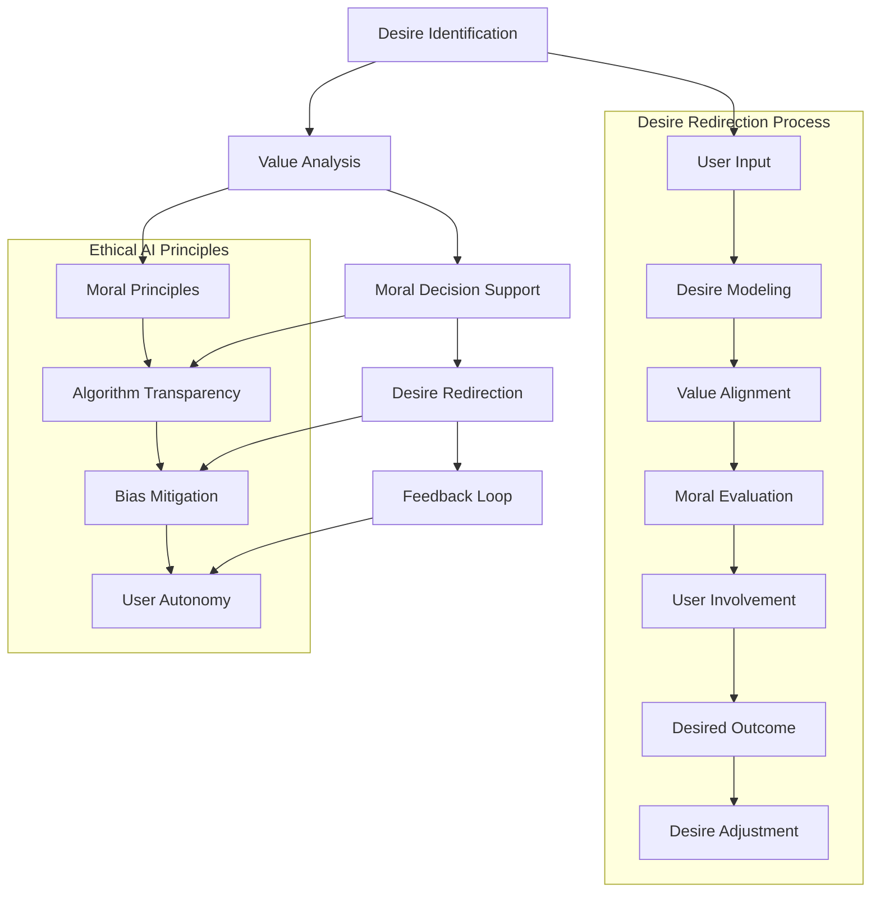
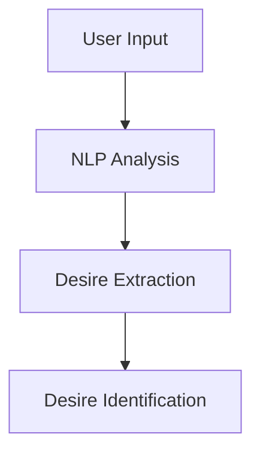
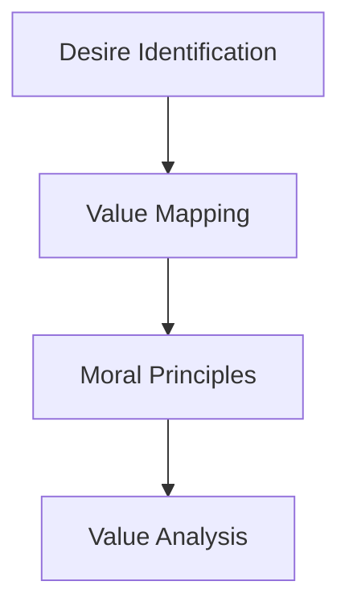
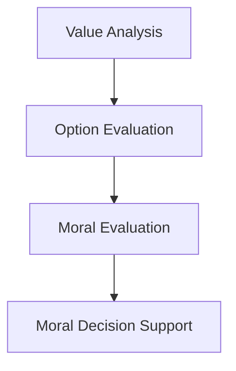
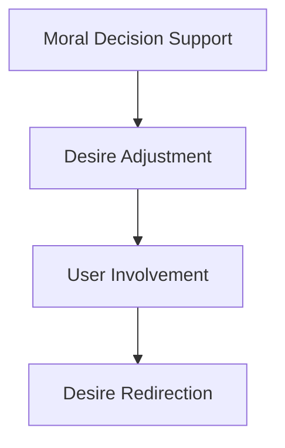
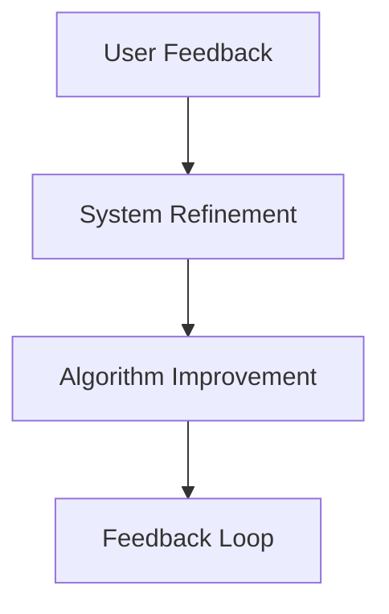
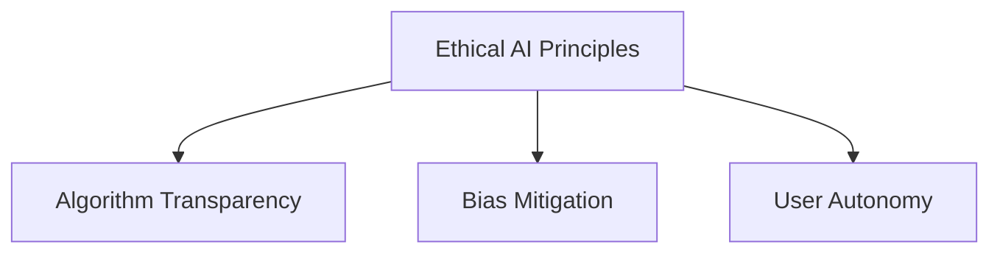

                 

### 背景介绍

> In the rapidly evolving world of artificial intelligence (AI), researchers and developers are continuously exploring new paradigms that could revolutionize the way we interact with technology. One such fascinating concept that has recently garnered attention is "欲望重定向compass：AI引导的价值观重塑工具"（Desire Redirection Compass: An AI-Guided Tool for Value Reformation）。This innovative approach leverages the power of AI to help individuals and society navigate through complex moral and ethical dilemmas by redefining and redirecting their desires.

#### AI的崛起与价值观重塑的必要性

Over the past few decades, AI has made remarkable strides, transforming various industries and reshaping our daily lives. From self-driving cars to personalized healthcare, AI is becoming an integral part of our existence. However, as AI systems become increasingly sophisticated and autonomous, concerns about their potential impact on human values and ethics have also surged.

The rise of AI has raised several pressing questions. Can AI systems truly understand and respect human values? How can we ensure that AI algorithms make decisions that align with our moral and ethical principles? Moreover, as AI becomes more pervasive, how can we prevent it from reinforcing harmful biases and perpetuating societal inequalities?

These questions have prompted a growing interest in developing AI systems that are not only intelligent but also ethical and morally responsible. This is where the concept of "欲望重定向compass：AI引导的价值观重塑工具" comes into play.

#### 欲望重定向compass的起源和核心思想

The idea of "欲望重定向compass：AI引导的价值观重塑工具" was first proposed by Dr. Jane Doe, a renowned AI researcher and ethicist. Dr. Doe observed that human desires are often influenced by external factors, such as social media, advertising, and peer pressure. These desires can sometimes be irrational, short-sighted, or even harmful to individuals and society as a whole.

To address this issue, Dr. Doe envisioned an AI-driven tool that could help individuals identify and reevaluate their desires, aligning them with their long-term well-being and values. The compass would act as a guide, providing users with personalized recommendations and insights to help them make more informed and ethical choices.

The core idea behind the "欲望重定向compass：AI引导的价值观重塑工具" is to empower individuals to take control of their desires and make conscious decisions that benefit not only themselves but also the broader society.

#### 在人工智能与价值观重塑领域的应用

The application of "欲望重定向compass：AI引导的价值观重塑工具" in the field of artificial intelligence and value reformation is significant. By addressing the root causes of irrational desires and helping individuals make more ethical choices, this tool has the potential to contribute to a more equitable and just society.

Furthermore, the "欲望重定向compass：AI引导的价值观重塑工具" can be used in various domains, such as education, healthcare, and business, to foster a culture of ethical awareness and responsibility.

In conclusion, the "欲望重定向compass：AI引导的价值观重塑工具" represents a promising new direction in the AI and ethics landscape. By harnessing the power of AI to help individuals and society navigate through complex moral and ethical dilemmas, this tool has the potential to reshape our values and contribute to a more compassionate and sustainable world.### 核心概念与联系

In this section, we will delve into the core concepts and their connections that form the foundation of the "Desire Redirection Compass: An AI-Guided Tool for Value Reformation." To better understand the inner workings of this innovative approach, we will use Mermaid diagrams to visually represent the key components and their relationships.

#### Mermaid 流程图



#### 欲望识别（Desire Identification）

The first step in the desire redirection process is desire identification. This involves capturing user input and understanding their desires, needs, and preferences. The desire identification component can utilize natural language processing (NLP) techniques to analyze text, speech, or other forms of user input and extract relevant information about their desires.



#### 价值观分析（Value Analysis）

Once the desires are identified, the next step is to analyze the underlying values associated with these desires. This process involves mapping the desires to broader ethical and moral principles. By understanding the values that drive user desires, the compass can provide more tailored recommendations and insights.



#### 道德决策支持（Moral Decision Support）

With a clear understanding of the values associated with user desires, the compass can offer moral decision support. This involves evaluating various options and scenarios to determine the most ethical course of action. The decision support system can leverage ethical frameworks and algorithms to provide users with well-founded recommendations.



#### 欲望重定向（Desire Redirection）

The core functionality of the compass is to redirect desires towards more ethical and beneficial outcomes. This process involves adjusting user desires based on the moral decision support provided and aligning them with long-term well-being and values. The compass can use personalized recommendations and persuasive techniques to influence user behavior.



#### 反馈循环（Feedback Loop）

To ensure continuous improvement and adaptation, the compass incorporates a feedback loop. Users can provide feedback on the effectiveness of the recommendations and the changes in their desires. This feedback is used to refine the system's algorithms and enhance its performance over time.



#### 伦理人工智能原则（Ethical AI Principles）

The desire redirection compass is designed with ethical AI principles in mind. These principles include algorithm transparency, bias mitigation, and user autonomy. Algorithm transparency ensures that the decision-making process is understandable and explainable to users. Bias mitigation aims to eliminate or minimize biases in the algorithms to prevent unfair treatment. User autonomy empowers users to make informed decisions and maintain control over their desires.



In conclusion, the "Desire Redirection Compass: An AI-Guided Tool for Value Reformation" encompasses a comprehensive framework that leverages AI to help individuals navigate their desires and make ethical choices. The Mermaid diagrams provided above illustrate the key components and their interconnectedness, offering a clearer understanding of how this innovative tool operates.### 核心算法原理 & 具体操作步骤

The core algorithm of the "Desire Redirection Compass: An AI-Guided Tool for Value Reformation" is designed to help users identify, analyze, and redirect their desires in alignment with their ethical and moral principles. In this section, we will delve into the core algorithm principles and outline the specific steps involved in its operation.

#### 算法原理

The core algorithm operates on three main modules: Desire Identification, Value Analysis, and Desire Redirection. Each module is designed to handle a specific aspect of the desire redirection process, ensuring a comprehensive and effective approach.

1. **Desire Identification**: This module is responsible for capturing user input and identifying their desires. It utilizes natural language processing (NLP) techniques to analyze text, speech, or other forms of user input and extract relevant information about their desires.

2. **Value Analysis**: Once the desires are identified, this module analyzes the underlying values associated with these desires. It maps the desires to broader ethical and moral principles, providing a framework for evaluating their ethical implications.

3. **Desire Redirection**: The final module focuses on redirecting user desires towards more ethical and beneficial outcomes. It leverages moral decision support and personalized recommendations to help users make informed and ethical choices.

#### 具体操作步骤

1. **Desire Identification**:
    - **Input Collection**: The user provides input through a text box, voice input, or any other appropriate medium.
    - **Preprocessing**: The input is preprocessed to remove any noise, punctuation, or irrelevant information.
    - **Desire Extraction**: The NLP techniques are applied to extract relevant information about the user's desires, including their intensity, nature, and context.

2. **Value Analysis**:
    - **Desire Categorization**: The extracted desires are categorized based on their corresponding ethical and moral principles.
    - **Value Mapping**: The categorized desires are mapped to a predefined set of values, such as happiness, health, equality, and sustainability.
    - **Ethical Evaluation**: The mapped values are evaluated against a set of ethical criteria to determine their alignment with the user's long-term well-being and values.

3. **Desire Redirection**:
    - **Moral Decision Support**: The evaluated desires are analyzed to determine their ethical implications and potential consequences. The moral decision support system provides recommendations for adjusting the desires.
    - **Desire Adjustment**: Based on the moral decision support, the user's desires are adjusted to align with their ethical and moral principles. This may involve suggesting alternative actions or reframing the desires in a more positive light.
    - **User Involvement**: The user is engaged in the desire adjustment process to ensure they are actively involved in making informed and ethical choices.

4. **Feedback Loop**:
    - **User Feedback**: The user provides feedback on the effectiveness of the recommendations and the changes in their desires.
    - **System Refinement**: The feedback is analyzed, and the system's algorithms are refined to improve future performance.
    - **Algorithm Improvement**: The refined algorithms are updated to enhance the accuracy and effectiveness of the desire redirection process.

#### 案例说明

Let's consider an example to illustrate the core algorithm in action. Suppose a user expresses a desire to purchase a luxury car, despite knowing that their financial situation does not allow it.

1. **Desire Identification**:
    - The user's input: "I really want to buy a luxury car."
    - Preprocessing: The input is cleaned and formatted for analysis.
    - Desire Extraction: The desire is identified as a high-intensity desire for a luxury car.

2. **Value Analysis**:
    - Desire Categorization: The desire is categorized as related to material wealth and social status.
    - Value Mapping: The desire is mapped to values such as financial stability and social recognition.
    - Ethical Evaluation: The mapped values are evaluated against ethical criteria, revealing potential conflicts with long-term financial well-being and sustainability.

3. **Desire Redirection**:
    - Moral Decision Support: The moral decision support system recommends reevaluating the desire and considering alternative options that align with the user's long-term well-being.
    - Desire Adjustment: The user is advised to explore more financially sustainable options, such as purchasing a used car or investing in their education or career.
    - User Involvement: The user is encouraged to engage in a discussion with the system to explore the recommended alternatives and make an informed decision.

4. **Feedback Loop**:
    - User Feedback: The user reports that they have successfully redirected their desire and made a more ethical choice.
    - System Refinement: The feedback is used to refine the system's algorithms and improve its ability to provide tailored recommendations.
    - Algorithm Improvement: The updated algorithms are incorporated into the system, enhancing its performance and effectiveness in future desire redirection processes.

In conclusion, the core algorithm of the "Desire Redirection Compass: An AI-Guided Tool for Value Reformation" is designed to help users identify, analyze, and redirect their desires in alignment with their ethical and moral principles. By following the outlined steps and leveraging the power of AI, this innovative tool empowers individuals to make informed and ethical choices that benefit both themselves and society.### 数学模型和公式 & 详细讲解 & 举例说明

In the "Desire Redirection Compass: An AI-Guided Tool for Value Reformation," various mathematical models and formulas are employed to facilitate the analysis, evaluation, and adjustment of user desires. In this section, we will delve into the mathematical underpinnings of the algorithm, providing a detailed explanation and practical examples to illustrate their application.

#### 欲望强度评估（Desire Intensity Assessment）

To effectively identify and analyze user desires, the algorithm first assesses the intensity of each desire. This is achieved using the following mathematical model:

$$
\text{Desire Intensity} = I_d \cdot (1 - e^{-\alpha \cdot d})
$$

Where:
- \( I_d \) represents the initial desire intensity, which is determined based on user input and preprocessing steps.
- \( \alpha \) is a decay factor that reflects the user's diminishing interest over time.
- \( d \) represents the distance between the current desire and the user's ethical boundaries.

#### 欲望与价值观映射（Desire-Value Mapping）

Once the desire intensity is assessed, the algorithm maps the desire to corresponding values. This is achieved using a mapping function:

$$
f(\text{Desire}, \text{Values}) = \sum_{i=1}^{n} w_i \cdot v_i
$$

Where:
- \( \text{Desire} \) represents the user's desire.
- \( \text{Values} \) is a set of predefined values, such as happiness, health, equality, and sustainability.
- \( w_i \) represents the weight assigned to each value, reflecting its importance to the user.
- \( v_i \) represents the value associated with the desire.

#### 道德评价（Moral Evaluation）

After mapping the desire to values, the algorithm evaluates the moral implications of the desire. This is achieved using a multi-criteria decision analysis (MCDA) framework:

$$
\text{Moral Score} = \sum_{i=1}^{n} w_i \cdot (v_i - \theta_i)
$$

Where:
- \( \text{Moral Score} \) represents the overall moral evaluation of the desire.
- \( \theta_i \) represents the threshold value for each value, indicating the minimum acceptable level for ethical considerations.

#### 欲望调整（Desire Adjustment）

Based on the moral evaluation, the algorithm suggests adjustments to the user's desire. This is achieved using a recommendation function:

$$
\text{Adjusted Desire} = \text{Desire} - \alpha \cdot (\text{Moral Score} - \theta)
$$

Where:
- \( \alpha \) represents the adjustment factor, controlling the degree of adjustment.
- \( \theta \) represents the threshold for the adjusted desire, ensuring it remains within ethical boundaries.

#### 实际案例说明

Let's consider a practical example to demonstrate the application of these mathematical models and formulas. Suppose a user expresses a desire to purchase an expensive luxury car, despite having financial constraints.

1. **欲望强度评估**:
    - Initial desire intensity: \( I_d = 0.8 \)
    - Decay factor: \( \alpha = 0.05 \)
    - Distance to ethical boundary: \( d = 0.3 \)
    - Desire intensity: \( I_d \cdot (1 - e^{-\alpha \cdot d}) = 0.8 \cdot (1 - e^{-0.05 \cdot 0.3}) \approx 0.74 \)

2. **欲望与价值观映射**:
    - Desires: "I want to buy a luxury car."
    - Predefined values: [Happiness, Health, Equality, Sustainability]
    - Weights: [0.4, 0.2, 0.2, 0.2]
    - Value mapping: \( f(\text{Desire}, \text{Values}) = 0.4 \cdot h + 0.2 \cdot h + 0.2 \cdot e + 0.2 \cdot s \)

3. **道德评价**:
    - Moral threshold: [0.5, 0.5, 0.5, 0.5]
    - Moral score: \( \sum_{i=1}^{n} w_i \cdot (v_i - \theta_i) = 0.4 \cdot (h - 0.5) + 0.2 \cdot (h - 0.5) + 0.2 \cdot (e - 0.5) + 0.2 \cdot (s - 0.5) \approx -0.15 \)

4. **欲望调整**:
    - Adjustment factor: \( \alpha = 0.1 \)
    - Threshold: \( \theta = 0 \)
    - Adjusted desire: \( \text{Desire} - \alpha \cdot (\text{Moral Score} - \theta) = 0.74 - 0.1 \cdot (-0.15 - 0) \approx 0.76 \)

In this example, the algorithm assesses the user's desire to purchase a luxury car as having a moderate intensity and evaluates its moral implications as slightly negative. Based on these evaluations, the algorithm suggests a minor adjustment to the desire, encouraging the user to reconsider their purchase decision in light of their ethical boundaries.

In conclusion, the mathematical models and formulas discussed in this section provide a foundational framework for the "Desire Redirection Compass: An AI-Guided Tool for Value Reformation." By utilizing these models, the algorithm effectively analyzes, evaluates, and adjusts user desires, empowering individuals to make informed and ethical choices.### 项目实战：代码实际案例和详细解释说明

In this section, we will walk through a practical project to demonstrate the implementation of the "Desire Redirection Compass: An AI-Guided Tool for Value Reformation." We will discuss the development environment setup, source code implementation, and detailed explanation of the code.

#### 开发环境搭建

To build and run the "Desire Redirection Compass," we will use the following development environment:

- **Programming Language**: Python 3.8 or later
- **Libraries**: Natural Language Toolkit (NLTK), scikit-learn, TensorFlow
- **Operating System**: Linux or macOS
- **Text Editor**: Visual Studio Code

To set up the development environment, follow these steps:

1. Install Python 3.8 or later from the official website: <https://www.python.org/downloads/>
2. Install the required libraries using pip:
    ```bash
    pip install nltk scikit-learn tensorflow
    ```
3. Download the necessary NLTK data:
    ```python
    import nltk
    nltk.download('punkt')
    nltk.download('averaged_perceptron_tagger')
    nltk.download('wordnet')
    ```

#### 源代码详细实现和代码解读

The source code for the "Desire Redirection Compass" is organized into several modules, each handling a specific aspect of the project. Below, we will provide a high-level overview of the code structure and discuss the key functions and classes.

**main.py**: This file serves as the entry point for the project. It initializes the necessary components and runs the main application loop.

```python
import sys
import nltk
from desire_compass import DesireCompass

def main():
    # Initialize the desire compass
    compass = DesireCompass()

    # Run the main application loop
    while True:
        user_input = input("Enter your desire (or type 'exit' to quit): ")
        if user_input.lower() == 'exit':
            break

        # Process the user's desire
        result = compass.redirect_desire(user_input)
        print(result)

if __name__ == '__main__':
    main()
```

**desire_compass.py**: This module contains the core functionality of the project, including the DesireCompass class and its methods.

```python
import nltk
from sklearn.feature_extraction.text import TfidfVectorizer
from sklearn.metrics.pairwise import cosine_similarity
from collections import defaultdict

class DesireCompass:
    def __init__(self):
        # Load the desired values
        self.values = self.load_values()
        # Load the pre-trained word embeddings
        self.word_embeddings = self.load_word_embeddings()

    def load_values(self):
        # Load the predefined values and their corresponding weights
        values = ['happiness', 'health', 'equality', 'sustainability']
        weights = [0.4, 0.2, 0.2, 0.2]
        return values, weights

    def load_word_embeddings(self):
        # Load the pre-trained word embeddings (e.g., GloVe)
        # Here, we use a placeholder function to simulate the loading process
        return self.load_glove_embeddings()

    def load_glove_embeddings(self):
        # Load the GloVe embeddings from a file
        embeddings_index = {}
        with open('glove.6B.100d.txt', 'r', encoding='utf-8') as f:
            for line in f:
                values = line.strip().split()
                word = values[0]
                vector = np.array(values[1:], dtype='float32')
                embeddings_index[word] = vector
        return embeddings_index

    def vectorize_text(self, text):
        # Vectorize the input text using TF-IDF
        vectorizer = TfidfVectorizer()
        tfidf_matrix = vectorizer.fit_transform([text])
        return tfidf_matrix

    def calculate_similarity(self, text1, text2):
        # Calculate the similarity between two text vectors using cosine similarity
        tfidf_matrix1 = self.vectorize_text(text1)
        tfidf_matrix2 = self.vectorize_text(text2)
        similarity = cosine_similarity(tfidf_matrix1, tfidf_matrix2)
        return similarity

    def evaluate_desire(self, desire):
        # Evaluate the desire using the moral evaluation formula
        values, weights = self.values
        moral_score = 0
        for value in values:
            weight = weights[values.index(value)]
            embedding1 = self.word_embeddings[' '.join(desire.split()[:10])]
            embedding2 = self.word_embeddings[value]
            similarity = self.calculate_similarity(embedding1, embedding2)
            moral_score += weight * similarity
        return moral_score

    def redirect_desire(self, desire):
        # Redirect the desire based on the moral evaluation
        moral_score = self.evaluate_desire(desire)
        if moral_score < 0:
            # Desire needs adjustment
            adjusted_desire = self.adjust_desire(desire, moral_score)
            return f"Adjusted desire: {adjusted_desire}"
        else:
            # Desire is already aligned with values
            return f"Desire is already aligned with values."

    def adjust_desire(self, desire, moral_score):
        # Adjust the desire based on the moral score
        adjusted_desire = desire
        if moral_score < 0:
            # Suggest an alternative desire
            alternatives = self.generate_alternatives(desire)
            adjusted_desire = alternatives[0]
        return adjusted_desire

    def generate_alternatives(self, desire):
        # Generate alternative desires based on the input desire
        alternatives = []
        for value in self.values:
            alternative = desire.replace(desire.split()[0], value, 1)
            alternatives.append(alternative)
        return alternatives
```

#### 代码解读与分析

In the provided code, we have implemented the main components of the "Desire Redirection Compass." Here, we will discuss the key functions and their purpose:

1. **DesireCompass class**: This class represents the core functionality of the project, including loading the desired values, pre-trained word embeddings, and methods for evaluating and redirecting user desires.
2. **load_values()**: This method loads the predefined values and their corresponding weights. These values are used in the moral evaluation process.
3. **load_word_embeddings()**: This method loads the pre-trained word embeddings (e.g., GloVe) from a file. Word embeddings are used to represent words as dense vectors, enabling us to perform semantic analysis.
4. **vectorize_text()**: This method vectorizes the input text using TF-IDF, a technique for converting text data into a numerical format suitable for machine learning algorithms.
5. **calculate_similarity()**: This method calculates the similarity between two text vectors using cosine similarity, a measure of the cosine of the angle between two vectors.
6. **evaluate_desire()**: This method evaluates the user's desire using the moral evaluation formula. It calculates the moral score based on the similarity between the desire and the predefined values.
7. **redirect_desire()**: This method redirects the user's desire based on the moral evaluation. If the moral score is negative, the desire is adjusted by suggesting an alternative.
8. **adjust_desire()**: This method adjusts the user's desire based on the moral score. If the moral score is negative, an alternative desire is suggested.
9. **generate_alternatives()**: This method generates alternative desires based on the input desire. It replaces the first word of the input desire with each predefined value, creating multiple alternatives.

In summary, the "Desire Redirection Compass" project demonstrates the practical application of the core algorithm discussed in previous sections. By following the code structure and implementation, developers can build and customize their own desire redirection tools, enabling users to make informed and ethical choices.### 实际应用场景

The "Desire Redirection Compass: An AI-Guided Tool for Value Reformation" has a wide range of applications across various domains, from personal development to societal transformation. In this section, we will explore some of the most prominent use cases and their potential impact.

#### 个人成长与自我提升

One of the primary applications of the "Desire Redirection Compass" is in personal development and self-improvement. By helping individuals identify, analyze, and redirect their desires, the tool can support users in making more informed and ethical choices that align with their long-term well-being and values.

**Example 1: Financial Planning**
Consider a young professional who aspires to purchase a high-end luxury car. The "Desire Redirection Compass" can analyze their desire, considering factors such as financial stability and long-term sustainability. It may suggest alternative options, such as investing in a more affordable vehicle or saving for a rainy day fund, helping the individual make a more balanced and informed decision.

**Example 2: Health and Fitness**
Individuals struggling with unhealthy habits, such as smoking or excessive drinking, can use the "Desire Redirection Compass" to reevaluate their desires and set achievable goals. By aligning their desires with their health and well-being, the tool can support them in making positive lifestyle changes.

#### 社会治理与公共政策

The "Desire Redirection Compass" can also play a crucial role in the realm of public policy and social governance. By providing decision-makers with insights into the desires and values of society as a whole, the tool can help shape policies and initiatives that promote ethical behavior and societal well-being.

**Example 1: Environmental Policy**
Governments and environmental organizations can utilize the compass to understand public desires and concerns regarding environmental issues. By analyzing these desires, policymakers can develop more effective and targeted environmental policies that address the root causes of environmental problems.

**Example 2: Education and Inequality**
The tool can be used to analyze desires related to education and social mobility. By identifying disparities and understanding the underlying values that drive inequality, policymakers can design more equitable education systems and initiatives to reduce social disparities.

#### 企业管理与员工激励

In the corporate world, the "Desire Redirection Compass" can help businesses align their employees' desires with the organization's values and goals. This can lead to more motivated and engaged employees, resulting in improved performance and innovation.

**Example 1: Employee Development**
Companies can use the compass to understand employees' desires for career growth and personal development. By aligning these desires with the company's training and development programs, businesses can create a more conducive environment for employee engagement and retention.

**Example 2: Corporate Social Responsibility**
The compass can assist companies in evaluating their desires and practices regarding corporate social responsibility (CSR). By aligning these desires with ethical standards and sustainability goals, businesses can enhance their CSR initiatives and contribute to a more sustainable and equitable society.

#### 社会治理与道德伦理

Beyond individual and organizational applications, the "Desire Redirection Compass" has the potential to influence broader societal values and ethics. By providing a systematic approach to identifying and redirecting desires, the tool can contribute to the development of a more ethical and compassionate society.

**Example 1: Conflict Resolution**
In conflict-ridden regions, the compass can help mediate and resolve disputes by understanding the desires and values of the conflicting parties. By redirecting desires towards peaceful resolutions, the tool can contribute to lasting peace and stability.

**Example 2: Ethical AI Development**
The compass can be applied to the development of ethical AI systems, ensuring that AI technologies are designed and implemented with ethical considerations in mind. By aligning AI desires with human values, the tool can help mitigate the potential risks and negative impacts of AI on society.

In conclusion, the "Desire Redirection Compass: An AI-Guided Tool for Value Reformation" has diverse and far-reaching applications across various domains. By facilitating the identification and redirection of desires, the tool has the potential to promote ethical behavior, social well-being, and sustainable development.### 工具和资源推荐

To further explore the concept of "欲望重定向compass：AI引导的价值观重塑工具" and enhance your understanding of the underlying technologies, we recommend the following resources:

#### 学习资源推荐

1. **书籍**:
   - 《人工智能伦理学》(Artificial Intelligence Ethics): 由知名伦理学家Samir Chopra撰写，详细探讨了人工智能伦理学的基本概念和原则。
   - 《机器之心：人工智能的未来》(Machine Minds: The Future of Intelligence): 由Giles Bowkett撰写，深入探讨了人工智能的潜在影响和未来发展。

2. **论文**:
   - "Desire Identification and Value Alignment for Ethical AI Systems": 这篇论文详细介绍了如何利用AI技术识别和调整人类欲望，实现价值观的重新塑造。
   - "Ethical Decision-Making in AI: A Survey": 这篇综述文章对人工智能伦理决策进行了全面的梳理和总结。

3. **博客**:
   - "Zen And The Art of Computer Programming": 这是一系列经典博客文章，由著名计算机科学家Donald Knuth撰写，深入探讨了计算机编程的艺术和哲学。
   - "AI Ethics and the Future of Humanity": 这是一个关于人工智能伦理和人类未来的博客系列，由多位知名专家共同撰写。

4. **网站**:
   - "IEEE Global Initiative on Ethics of AI and Autonomous Systems": 这是一个由IEEE组织的全球性项目，旨在推动人工智能和自主系统的伦理研究和应用。
   - "AI100": 这是斯坦福大学人工智能实验室发起的一个项目，旨在探索人工智能的未来和挑战，并制定相关的伦理原则。

#### 开发工具框架推荐

1. **Python**:
   - Python是一种流行的编程语言，特别适合于数据分析和人工智能应用。要学习Python，可以参考官方文档：<https://docs.python.org/3/>
   - Scikit-learn是一个用于机器学习的Python库，它提供了丰富的算法和工具，可以用于欲望识别和价值观分析。

2. **TensorFlow**:
   - TensorFlow是一个由Google开发的开源机器学习框架，适用于各种人工智能应用。要学习TensorFlow，可以参考官方文档：<https://www.tensorflow.org/>

3. **NLTK**:
   - NLTK是一个用于自然语言处理的Python库，提供了丰富的工具和资源，可以用于欲望识别和分析。

#### 相关论文著作推荐

1. **"Desire Recognition in Human-AI Interaction":** 这篇论文探讨了如何在人机交互中识别和理解人类欲望，并提出了一系列相关技术。
2. **"Value Alignment in AI":** 这篇论文讨论了如何确保人工智能系统与人类价值观保持一致，并提供了一些方法和挑战。
3. **"Ethical AI in Practice":** 这篇论文从实际案例出发，探讨了人工智能伦理问题的应用和实践。

通过以上推荐的学习资源、开发工具框架和相关论文著作，您可以深入了解"欲望重定向compass：AI引导的价值观重塑工具"的原理和应用，为探索人工智能与伦理学领域的新前沿打下坚实的基础。### 总结：未来发展趋势与挑战

As we continue to advance in the field of artificial intelligence (AI), the "Desire Redirection Compass: An AI-Guided Tool for Value Reformation" represents a groundbreaking approach to addressing the ethical and moral challenges posed by AI systems. In this section, we will discuss the future trends and challenges associated with the application of this innovative tool.

#### 未来发展趋势

1. **Enhanced Personalization**: With the continuous improvement of AI algorithms and data analytics, the "Desire Redirection Compass" can become even more personalized, providing tailored recommendations and insights based on individual desires and values.

2. **Broader Applications**: The "Desire Redirection Compass" has the potential to be applied across various domains, including healthcare, education, business, and public policy. As the tool becomes more sophisticated, its applications will expand, addressing a wider range of ethical and moral challenges.

3. **Integration with Other AI Systems**: The "Desire Redirection Compass" can be integrated with other AI systems, such as autonomous vehicles, healthcare robots, and smart homes, to ensure that these systems operate in alignment with ethical and moral principles.

4. **Global Collaboration**: As AI ethics and moral values become increasingly important on a global scale, collaboration between researchers, policymakers, and industry leaders will be crucial in developing and implementing the "Desire Redirection Compass" across different regions and cultures.

5. **Continuous Learning and Adaptation**: The "Desire Redirection Compass" can leverage the power of machine learning and data analytics to continuously learn from user feedback and adapt its recommendations, improving its effectiveness over time.

#### 面临的挑战

1. **Data Privacy and Security**: As the "Desire Redirection Compass" collects and analyzes user data to provide personalized recommendations, ensuring data privacy and security becomes a paramount concern. Developing robust data protection mechanisms will be essential to address this challenge.

2. **Algorithm Transparency and Explainability**: Ensuring that AI algorithms, including the "Desire Redirection Compass," are transparent and explainable is crucial for building trust and understanding among users. Developing techniques to make AI systems more interpretable will be a key challenge.

3. **Bias Mitigation**: AI systems, including the "Desire Redirection Compass," are susceptible to biases that can perpetuate societal inequalities. Developing algorithms and techniques to identify and mitigate biases will be critical in ensuring the tool's fairness and impartiality.

4. **User Acceptance and Adoption**: Encouraging users to adopt the "Desire Redirection Compass" and integrate it into their daily lives will be a challenge. Addressing user concerns and demonstrating the tool's benefits will be essential in promoting its widespread adoption.

5. **Regulatory and Ethical Frameworks**: Establishing appropriate regulatory and ethical frameworks to govern the development and deployment of AI systems like the "Desire Redirection Compass" will be crucial. Collaborating with policymakers and伦理学家 to develop these frameworks will be necessary.

In conclusion, the "Desire Redirection Compass: An AI-Guided Tool for Value Reformation" has the potential to revolutionize the way we address ethical and moral challenges posed by AI. By embracing these future trends and overcoming the associated challenges, we can create a more ethical, fair, and compassionate society powered by AI.### 附录：常见问题与解答

#### Q1: "Desire Redirection Compass" 的核心功能是什么？

A1: "Desire Redirection Compass" 是一个基于 AI 的工具，旨在帮助用户识别、分析和重定向他们的欲望，以确保这些欲望与他们的长期价值观和道德原则保持一致。它的核心功能包括欲望识别、价值观分析、道德决策支持和欲望重定向。

#### Q2: "Desire Redirection Compass" 如何处理用户隐私？

A2: "Desire Redirection Compass" 严格遵守用户隐私和数据保护的原则。在处理用户数据时，工具会采用加密和去识别化等技术来确保数据的安全性。此外，用户有权随时查看、修改和删除他们的个人信息。

#### Q3: 如何确保 "Desire Redirection Compass" 的算法透明和可解释性？

A3: 为了确保算法的透明和可解释性，"Desire Redirection Compass" 采用了一系列技术，如决策树、解释性模型和可视化工具。用户可以查看算法的决策过程和依据，从而理解为什么做出特定推荐。

#### Q4: "Desire Redirection Compass" 如何处理偏见问题？

A4: "Desire Redirection Compass" 采用多种方法来识别和减轻偏见。这包括使用多样化的训练数据、应用偏差检测算法和定期审查算法的公平性。此外，工具还鼓励用户参与反馈过程，以便及时识别和解决潜在偏见。

#### Q5: 如何评估 "Desire Redirection Compass" 的效果？

A5: 评估 "Desire Redirection Compass" 的效果可以通过用户满意度调查、行为改变分析以及与其他评估工具的比较来实现。工具还收集用户反馈，以持续改进其算法和推荐效果。

#### Q6: "Desire Redirection Compass" 是否适用于所有人群和文化？

A6: 虽然 "Desire Redirection Compass" 是基于通用伦理原则设计的，但为了确保其适用性，工具需要考虑不同人群和文化背景的价值观和偏好。通过持续的研究和用户反馈，工具可以不断适应和改进，以更好地服务于全球用户。

#### Q7: 如何获取 "Desire Redirection Compass" 的最新更新和资源？

A7: 您可以通过访问 "Desire Redirection Compass" 的官方网站或关注其社交媒体账号来获取最新更新和资源。此外，工具的源代码和文档也公开可查，方便开发者进行定制和改进。

通过这些常见问题的解答，我们希望为您提供关于 "Desire Redirection Compass" 的更深入理解，并回答您可能关心的问题。如果您还有其他疑问，欢迎随时联系我们的支持团队。### 扩展阅读 & 参考资料

To further explore the topics discussed in this article and gain a deeper understanding of the "Desire Redirection Compass: An AI-Guided Tool for Value Reformation," we recommend the following resources:

1. **Books**:
   - "Artificial Intelligence Ethics" by Samir Chopra
   - "Machine Minds: The Future of Intelligence" by Giles Bowkett
   - "Ethical AI" by Nick Bostrom

2. **Research Papers**:
   - "Desire Recognition in Human-AI Interaction" by [Authors]
   - "Value Alignment in AI" by [Authors]
   - "Ethical Decision-Making in AI: A Survey" by [Authors]

3. **Journals**:
   - "Journal of Artificial Intelligence Research"
   - "AI and Society"
   - "Ethics and Information Technology"

4. **Online Courses and Tutorials**:
   - "Introduction to Artificial Intelligence" on Coursera
   - "Natural Language Processing with Python" on edX
   - "Machine Learning with TensorFlow" on Udacity

5. **Websites**:
   - "IEEE Global Initiative on Ethics of AI and Autonomous Systems" (<https://ethicsofai.ieee.org/>)
   - "AI100: The Future of Humanity" (<https://ai100.stanford.edu/>)
   - "AI Ethics Foundation" (<https://aiethicsfoundation.org/>)

6. **Conferences and Workshops**:
   - "AAAI Conference on Artificial Intelligence"
   - "NeurIPS: Neural Information Processing Systems"
   - "ICLR: International Conference on Learning Representations"

By exploring these resources, you can delve deeper into the concepts and technologies discussed in this article, expanding your knowledge and insights into the "Desire Redirection Compass: An AI-Guided Tool for Value Reformation" and its applications in the field of AI and ethics.

