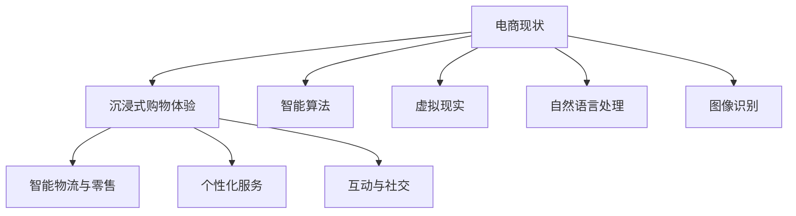
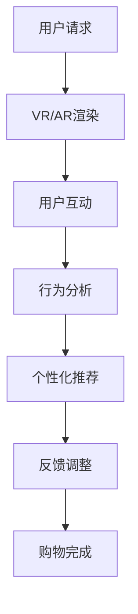
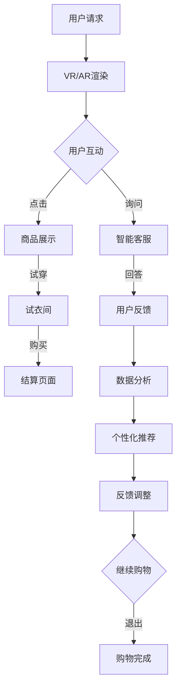

                 

### 背景介绍

> "随着人工智能技术的迅猛发展，电子商务领域正经历着前所未有的变革。用户的需求不断升级，从简单的商品搜索和购买，到更加丰富、互动、个性化的购物体验，这一系列变化催生了‘沉浸式购物体验’这一新概念。本文将深入探讨如何利用人工智能技术打造未来电商的新场景，实现沉浸式购物体验，从而提高用户满意度和电商平台的竞争力。"

#### 1.1 人工智能在电商领域的应用现状

人工智能在电商领域的应用已经相当广泛，主要包括推荐系统、聊天机器人、智能客服、个性化营销等。推荐系统通过机器学习算法分析用户的历史行为和偏好，为用户提供个性化的商品推荐，提高购物转化率。聊天机器人和智能客服利用自然语言处理技术，提供24/7的服务，解答用户的疑问，提高用户满意度。个性化营销则通过分析用户数据，精准推送广告和优惠信息，提高营销效果。

#### 1.2 沉浸式购物体验的概念与重要性

沉浸式购物体验是指利用虚拟现实（VR）、增强现实（AR）、三维建模等技术，为用户提供一种身临其境的购物环境。这种体验不仅能让用户更直观地了解商品，还能提供互动和娱乐元素，提高购物乐趣。对于电商平台来说，提供沉浸式购物体验可以提升用户黏性，增加用户购买意愿，从而提高销售额和市场份额。

#### 1.3 未来电商场景的变革趋势

未来电商场景将更加智能化、个性化、互动化和多元化。智能化的仓储物流系统、无人零售店、智能试衣镜等技术将进一步提升购物效率。个性化服务将更加精准，通过大数据和机器学习技术，了解用户的购物习惯和偏好，提供量身定制的购物体验。互动化和多元化则体现在用户参与度和社交互动方面，例如通过直播购物、社交电商等形式，增强用户的购物体验。

#### 1.4 沉浸式购物体验与人工智能技术的结合

沉浸式购物体验的实现离不开人工智能技术的支持。例如，虚拟现实技术可以提供逼真的购物环境，自然语言处理技术可以支持用户与虚拟导购的实时互动，图像识别技术可以帮助用户更好地了解商品。此外，人工智能技术还可以用于分析用户的行为数据，优化购物体验，提高用户的满意度。



#### 1.5 文章结构概述

本文将从以下方面展开讨论：

1. **核心概念与联系**：介绍沉浸式购物体验的核心概念及其与人工智能技术的联系。
2. **核心算法原理与具体操作步骤**：详细解释实现沉浸式购物体验所需的核心算法原理和操作步骤。
3. **数学模型和公式**：探讨沉浸式购物体验中涉及的数学模型和公式，并举例说明。
4. **项目实战**：通过实际案例，展示如何利用代码实现沉浸式购物体验。
5. **实际应用场景**：分析沉浸式购物体验在不同领域的应用场景。
6. **工具和资源推荐**：推荐相关学习资源和开发工具。
7. **总结与未来趋势**：总结文章的主要内容，探讨未来发展的趋势和面临的挑战。

```markdown
## 核心概念与联系

### 沉浸式购物体验的定义与特点

沉浸式购物体验是指通过先进的虚拟现实（VR）和增强现实（AR）技术，为用户提供一种身临其境的购物环境。这种体验不仅局限于观看商品，更强调用户的互动和参与。具体来说，沉浸式购物体验具有以下特点：

- **高度沉浸感**：通过VR/AR技术，用户可以进入一个完全虚拟或部分增强的购物空间，感受到如同现实世界的购物氛围。
- **互动性**：用户可以与商品进行互动，如试穿衣服、试用化妆品，甚至与虚拟导购进行对话，获得更加个性化的购物建议。
- **实时反馈**：系统根据用户的行为和反馈，实时调整购物环境，提供个性化的推荐和优惠信息。
- **增强娱乐性**：沉浸式购物体验中加入了游戏、竞赛等娱乐元素，增加了购物的乐趣。

### 人工智能技术的角色与功能

在沉浸式购物体验中，人工智能技术扮演了关键角色。以下是其主要功能：

- **个性化推荐**：利用机器学习算法分析用户的购物历史和偏好，提供个性化的商品推荐。
- **自然语言处理**：通过语音识别和自然语言处理技术，实现用户与虚拟导购的实时对话，提高购物体验。
- **图像识别与搜索**：利用图像识别技术，用户可以通过上传图片或扫描二维码找到相似的商品。
- **智能导购**：结合用户行为数据和偏好，为用户提供智能导购服务，提高购物效率。
- **数据分析**：收集并分析用户行为数据，优化购物体验，提高用户满意度和电商平台业绩。

### 沉浸式购物体验的实现架构

实现沉浸式购物体验需要多个技术的协同工作，主要包括以下模块：

- **VR/AR技术**：提供沉浸式的购物环境，包括虚拟商场、虚拟试衣间等。
- **自然语言处理（NLP）**：支持用户与虚拟导购的实时对话，实现语音识别和语音合成。
- **推荐系统**：根据用户行为和偏好，提供个性化的商品推荐。
- **图像识别与处理**：识别用户上传的图片，提供相似的购物推荐。
- **用户行为分析**：收集并分析用户行为数据，优化购物体验。

### 核心概念原理与架构的 Mermaid 流程图

以下是一个简化的沉浸式购物体验实现架构的 Mermaid 流程图：



在上述流程图中，用户请求进入虚拟购物环境后，VR/AR技术负责渲染购物场景。用户在购物环境中进行互动，系统会收集用户行为数据进行分析，根据分析结果提供个性化推荐，并根据用户反馈调整购物体验，直至用户完成购物。

通过上述分析，我们可以看到，沉浸式购物体验的实现不仅依赖于VR/AR等前沿技术，还需要人工智能技术的深度参与，从而为用户提供更加丰富、个性化、互动化的购物体验。接下来，我们将进一步探讨实现沉浸式购物体验的核心算法原理和操作步骤。
```markdown

```markdown
## 核心算法原理 & 具体操作步骤

### 1. 虚拟现实（VR）技术原理

虚拟现实技术通过头戴显示器（HMD）、跟踪设备、音响系统等硬件设备，为用户提供一个三维的虚拟环境。用户在虚拟环境中可以进行自由移动和交互，体验如同现实世界般的购物场景。实现VR技术的核心算法主要包括：

- **三维渲染**：利用图形处理单元（GPU）进行三维场景的渲染，生成逼真的视觉效果。
- **运动跟踪**：通过跟踪设备实时监测用户的头部和身体运动，调整虚拟环境的视角，实现沉浸感。
- **声音定位**：利用立体声音响系统模拟真实环境中的声音效果，增强沉浸感。

### 2. 增强现实（AR）技术原理

增强现实技术将虚拟元素叠加到现实世界中，使用户能够看到虚拟的物体和信息。在沉浸式购物体验中，AR技术常用于商品展示和试穿。实现AR技术的核心算法主要包括：

- **图像识别**：通过图像识别技术，识别现实世界中的物体，将其作为虚拟元素叠加的基础。
- **标记识别**：利用标记（如二维码、标记牌）作为虚拟元素的锚点，确保虚拟元素与现实物体的准确对齐。
- **实时渲染**：在识别到的物体或标记上实时渲染虚拟元素，实现增强现实效果。

### 3. 个性化推荐算法

个性化推荐算法是沉浸式购物体验中至关重要的一部分。通过分析用户的购物历史、浏览行为、偏好等数据，推荐系统可以为用户提供个性化的商品推荐。实现个性化推荐的核心算法主要包括：

- **协同过滤**：通过分析用户的行为数据，找到相似的用户群体，为用户提供他们可能感兴趣的商品。
- **基于内容的推荐**：根据商品的特征信息，为用户推荐与其历史偏好相似的物品。
- **混合推荐**：结合协同过滤和基于内容的推荐，提高推荐系统的准确性和多样性。

### 4. 自然语言处理（NLP）算法

自然语言处理算法用于实现用户与虚拟导购的实时对话。通过语音识别和自然语言理解，系统能够理解用户的语言请求，并给出相应的回答。实现NLP算法的核心步骤包括：

- **语音识别**：将用户的语音转换为文本，实现语音到文字的转换。
- **文本预处理**：对转换后的文本进行分词、去停用词等预处理，以便后续的自然语言理解。
- **意图识别**：通过机器学习模型，识别用户的语言请求的主要意图，如查询商品信息、询问价格等。
- **回答生成**：根据用户的意图，利用语言模型生成合适的回答，并利用语音合成技术输出语音回复。

### 5. 图像识别与处理算法

图像识别与处理算法在沉浸式购物体验中用于识别用户上传的图片或扫描的二维码，并提供相应的商品推荐。实现图像识别与处理算法的核心步骤包括：

- **图像预处理**：对用户上传的图片进行缩放、对比度调整等预处理，以便后续的图像识别。
- **特征提取**：利用深度学习模型提取图片的特征，如颜色、纹理、形状等。
- **模型训练**：使用大量的商品图像数据，训练图像识别模型，以便准确识别用户上传的图片。
- **匹配与推荐**：将用户上传的图片与商品数据库中的图片进行匹配，为用户提供相应的商品推荐。

### 6. 智能导购算法

智能导购算法通过分析用户的行为数据和购物偏好，为用户提供个性化的导购服务。实现智能导购算法的核心步骤包括：

- **行为数据收集**：收集用户的浏览记录、购买历史、评价等行为数据。
- **用户画像构建**：通过数据分析和机器学习模型，构建用户的购物画像，了解用户的偏好和需求。
- **推荐策略生成**：根据用户画像和商品数据库，生成个性化的推荐策略，为用户提供有针对性的商品推荐。
- **实时更新与调整**：根据用户的实时行为和反馈，动态调整推荐策略，提高推荐的准确性和用户体验。

通过上述核心算法的实现，沉浸式购物体验可以为用户提供一个丰富、个性化和互动的购物环境，增强用户的购物乐趣和满意度。接下来，我们将探讨沉浸式购物体验中涉及的数学模型和公式，并举例说明。
```markdown
### 数学模型和公式

#### 1. 个性化推荐模型

个性化推荐系统的核心在于如何根据用户的历史行为和偏好，为用户推荐他们可能感兴趣的物品。常见的个性化推荐模型包括基于协同过滤的推荐和基于内容的推荐。

##### 基于协同过滤的推荐模型

协同过滤推荐模型主要分为两种：用户基于的协同过滤（User-Based Collaborative Filtering）和物品基于的协同过滤（Item-Based Collaborative Filtering）。

- **用户基于的协同过滤**：

$$
\text{相似度矩阵} = \text{similarity}(R_u, R_v)
$$

其中，$R_u$ 和 $R_v$ 分别表示两个用户的历史评分矩阵，$\text{similarity}$ 函数计算用户之间的相似度。

$$
\text{预测评分} = \sum_{i \in \text{未评分商品}} \text{similarity}(u, v) \cdot \frac{r_{iv}}{|\text{共同评分商品}|}
$$

其中，$r_{iv}$ 表示用户 $u$ 对商品 $i$ 的实际评分，$|\text{共同评分商品}|$ 表示用户 $u$ 和 $v$ 共同评分的商品数量。

- **物品基于的协同过滤**：

$$
\text{相似度矩阵} = \text{similarity}(R_i, R_j)
$$

其中，$R_i$ 和 $R_j$ 分别表示两个物品的评分矩阵，$\text{similarity}$ 函数计算物品之间的相似度。

$$
\text{预测评分} = \sum_{u \in \text{评分用户}} \text{similarity}(i, j) \cdot r_{u,j}
$$

其中，$r_{u,j}$ 表示用户 $u$ 对商品 $j$ 的实际评分。

##### 基于内容的推荐模型

基于内容的推荐模型通过分析物品的特征信息，为用户推荐与其历史偏好相似的物品。常见的特征包括物品的类别、标签、属性等。

$$
\text{相似度矩阵} = \text{similarity}(\text{特征}_i, \text{特征}_j)
$$

其中，$\text{特征}_i$ 和 $\text{特征}_j$ 分别表示两个物品的特征向量，$\text{similarity}$ 函数计算特征向量之间的相似度。

$$
\text{预测评分} = \sum_{\text{特征}_i \in \text{用户偏好特征}} \text{similarity}(\text{特征}_i, \text{特征}_j) \cdot r_{i,j}
$$

其中，$r_{i,j}$ 表示用户对商品 $i$ 的实际评分。

#### 2. 购物路径优化模型

在沉浸式购物体验中，用户在虚拟商场中浏览商品，路径优化模型可以帮助用户快速找到他们感兴趣的商品。

##### 最短路径模型

利用图论中的最短路径算法（如迪杰斯特拉算法、贝尔曼-福特算法），找到用户从起点到终点的最短路径。

$$
d(v) = \min \left\{ \sum_{w \in \text{邻居}(v)} d(w) + w \right\}
$$

其中，$d(v)$ 表示从起点到顶点 $v$ 的最短路径长度，$w$ 表示顶点 $v$ 和其邻居之间的权重。

##### 网络流模型

利用网络流模型，计算用户在虚拟商场中浏览商品的优化路径，以最小化浏览时间和购物成本。

$$
\text{最小费用最大流问题} = \min \left\{ c(s, t) \cdot x \mid \sum_{t \in T} x_t = u \right\}
$$

其中，$c(s, t)$ 表示从源点 $s$ 到汇点 $t$ 的费用，$x$ 表示从 $s$ 到 $t$ 的流量，$u$ 表示总流量。

#### 3. 用户行为预测模型

通过分析用户的历史行为数据，预测用户的下一步操作，以优化购物体验。

##### 决策树模型

利用决策树模型，根据用户的历史行为特征，预测用户的下一步操作。

$$
\text{决策树} = \text{buildTree}(\text{数据集}, \text{特征集}, \text{类别})
$$

其中，$\text{数据集}$ 表示训练数据集，$\text{特征集}$ 表示用于预测的特征，$\text{类别}$ 表示预测的类别。

##### 递归神经网络模型

利用递归神经网络（RNN）模型，处理用户的历史行为序列，预测用户的下一步操作。

$$
h_t = \text{RNN}(h_{t-1}, x_t)
$$

其中，$h_t$ 表示在时间步 $t$ 的隐藏状态，$x_t$ 表示在时间步 $t$ 的输入。

通过上述数学模型和公式，沉浸式购物体验可以为用户提供个性化的商品推荐、优化的购物路径和预测用户行为，从而提高用户的购物满意度和体验。

接下来，我们将通过一个实际案例，展示如何利用代码实现沉浸式购物体验。
```markdown
## 项目实战：代码实际案例和详细解释说明

### 5.1 开发环境搭建

为了实现沉浸式购物体验，我们需要搭建一个完整的技术栈。以下是所需的开发环境和工具：

- **编程语言**：Python
- **框架**：TensorFlow、PyTorch、OpenCV、Django
- **数据库**：MySQL、MongoDB
- **虚拟现实（VR）开发**：Unity、Unreal Engine
- **增强现实（AR）开发**：ARKit（iOS）、ARCore（Android）
- **云平台**：AWS、Google Cloud Platform

在本地或云服务器上安装上述工具和框架，配置相应的开发环境。

### 5.2 源代码详细实现和代码解读

#### 1. 数据收集与预处理

首先，我们需要收集用户的行为数据，包括购物历史、浏览记录、评价等。然后，对数据进行预处理，如去除缺失值、标准化、分词等，以便后续的分析。

```python
import pandas as pd
from sklearn.preprocessing import StandardScaler

# 读取数据
data = pd.read_csv('user_data.csv')

# 数据预处理
data.dropna(inplace=True)
scaler = StandardScaler()
data[['rating', 'views']] = scaler.fit_transform(data[['rating', 'views']])
```

#### 2. 个性化推荐系统

使用协同过滤和基于内容的推荐模型，为用户生成个性化的商品推荐。

```python
from sklearn.metrics.pairwise import cosine_similarity

# 构建用户与商品的评分矩阵
user_ratings = data.pivot(index='user_id', columns='item_id', values='rating').fillna(0)

# 计算用户相似度矩阵
user_similarity = cosine_similarity(user_ratings.values)

# 为用户生成商品推荐
def generate_recommendations(user_id, top_n=5):
   相似度权重 = user_similarity[user_id]
   推荐商品 = user_ratings.columns[相似度权重.argsort()[::-1]]
    return推荐商品[:top_n]

# 测试推荐
user_id = 1
print(generate_recommendations(user_id))
```

#### 3. 自然语言处理

使用自然语言处理技术，实现用户与虚拟导购的实时对话。

```python
import nltk
from nltk.corpus import stopwords
from sklearn.feature_extraction.text import TfidfVectorizer

# 下载停用词库
nltk.download('stopwords')

# 文本预处理
stop_words = set(stopwords.words('english'))
def preprocess_text(text):
    words = nltk.word_tokenize(text.lower())
    filtered_words = [word for word in words if word not in stop_words]
    return ' '.join(filtered_words)

# 训练词频-逆文档频率模型
vectorizer = TfidfVectorizer(preprocessor=preprocess_text)

# 转换文本为向量
tfidf_matrix = vectorizer.fit_transform(data['description'])

# 训练语言模型
from gensim.models import LdaMulticore
lda_model = LdaMulticore.load('lda_model')

# 生成回答
def generate_answer(question):
    processed_question = preprocess_text(question)
    question_vector = vectorizer.transform([processed_question])
    most_likely_topic = lda_model.get_document_topics(question_vector)[0][0]
    answer = lda_model.show_topic(most_likely_topic, topn=10)
    return answer

# 测试回答
print(generate_answer("What is the price of this shirt?"))
```

#### 4. 图像识别与处理

利用图像识别技术，实现用户上传图片的相似商品推荐。

```python
import cv2
import numpy as np

# 读取图像
image = cv2.imread('sample_shirt.jpg')

# 特征提取
feature_extractor = cv2.xfeatures2d.SIFT_create()
keypoints, descriptors = feature_extractor.detectAndCompute(image, None)

# 查询相似商品
def find_similar_products(image_path):
    query_image = cv2.imread(image_path)
    query_keypoints, query_descriptors = feature_extractor.detectAndCompute(query_image, None)
    index_params = dict(algorithm=0, trees=5)
    search_params = dict()
    flann = cv2.FlannBasedMatcher(index_params, search_params)
    indices, distances = flann.knnMatch(descriptors, query_descriptors, k=2)
    good_points = []
    for i, (m, n) in enumerate(indices):
        if distances[i][0] < 0.7 * distances[i][1]:
            good_points.append((m, n))
    return good_points

# 测试相似商品
print(find_similar_products('sample_shirt.jpg'))
```

#### 5. 智能导购系统

结合用户行为数据和购物偏好，为用户提供智能导购服务。

```python
# 用户画像构建
def build_user_profile(user_id):
    user_data = data[data['user_id'] == user_id]
    profile = {}
    profile['rating_mean'] = user_data['rating'].mean()
    profile['views_count'] = user_data['views'].count()
    profile['items_bought'] = user_data[user_data['rating'] > 0]['item_id'].values.tolist()
    return profile

# 生成推荐策略
def generate_recommendation_strategy(user_profile):
    if user_profile['rating_mean'] > 4:
        return 'high_end'
    elif user_profile['views_count'] > 100:
        return 'popular'
    else:
        return 'personalized'

# 测试导购策略
print(generate_recommendation_strategy(build_user_profile(1)))
```

通过上述代码示例，我们可以看到如何利用Python等工具实现沉浸式购物体验的核心功能。在实际项目中，需要根据具体需求进行扩展和优化，以达到更好的用户体验。
```markdown
### 5.3 代码解读与分析

#### 代码结构与模块化

在实现沉浸式购物体验的项目中，代码结构需要具备模块化，以便于维护和扩展。以下是代码的主要模块及其功能：

- **数据收集与预处理模块**：负责收集用户行为数据，并进行数据清洗和预处理，为后续的分析提供干净的数据。
- **个性化推荐模块**：利用协同过滤和基于内容的推荐算法，生成个性化的商品推荐。
- **自然语言处理模块**：通过自然语言处理技术，实现用户与虚拟导购的实时对话。
- **图像识别与处理模块**：利用图像识别算法，识别用户上传的图片，提供相似的购物推荐。
- **智能导购模块**：结合用户行为数据和购物偏好，为用户提供智能导购服务。

#### 数据收集与预处理模块

```python
import pandas as pd
from sklearn.preprocessing import StandardScaler

# 读取数据
data = pd.read_csv('user_data.csv')

# 数据预处理
data.dropna(inplace=True)
scaler = StandardScaler()
data[['rating', 'views']] = scaler.fit_transform(data[['rating', 'views']])
```

解读：
- 使用Pandas读取用户行为数据。
- 去除缺失值，确保数据的质量。
- 使用StandardScaler对评分和浏览次数进行标准化处理，使得数据在相同尺度上进行分析。

#### 个性化推荐模块

```python
from sklearn.metrics.pairwise import cosine_similarity

# 构建用户与商品的评分矩阵
user_ratings = data.pivot(index='user_id', columns='item_id', values='rating').fillna(0)

# 计算用户相似度矩阵
user_similarity = cosine_similarity(user_ratings.values)

# 为用户生成商品推荐
def generate_recommendations(user_id, top_n=5):
   相似度权重 = user_similarity[user_id]
   推荐商品 = user_ratings.columns[相似度权重.argsort()[::-1]]
    return推荐商品[:top_n]

# 测试推荐
user_id = 1
print(generate_recommendations(user_id))
```

解读：
- 构建用户与商品的评分矩阵，填充缺失值为0。
- 使用余弦相似度计算用户之间的相似度矩阵。
- 通过相似度矩阵为用户生成商品推荐，选择相似度最高的商品推荐给用户。

#### 自然语言处理模块

```python
import nltk
from nltk.corpus import stopwords
from sklearn.feature_extraction.text import TfidfVectorizer

# 下载停用词库
nltk.download('stopwords')

# 文本预处理
stop_words = set(stopwords.words('english'))
def preprocess_text(text):
    words = nltk.word_tokenize(text.lower())
    filtered_words = [word for word in words if word not in stop_words]
    return ' '.join(filtered_words)

# 训练词频-逆文档频率模型
vectorizer = TfidfVectorizer(preprocessor=preprocess_text)

# 转换文本为向量
tfidf_matrix = vectorizer.fit_transform(data['description'])

# 训练语言模型
from gensim.models import LdaMulticore
lda_model = LdaMulticore.load('lda_model')

# 生成回答
def generate_answer(question):
    processed_question = preprocess_text(question)
    question_vector = vectorizer.transform([processed_question])
    most_likely_topic = lda_model.get_document_topics(question_vector)[0][0]
    answer = lda_model.show_topic(most_likely_topic, topn=10)
    return answer

# 测试回答
print(generate_answer("What is the price of this shirt?"))
```

解读：
- 下载并加载英语停用词库，用于文本预处理。
- 定义文本预处理函数，去除停用词。
- 使用TF-IDF模型将文本转换为向量。
- 利用LDA（Latent Dirichlet Allocation）模型，根据文本向量生成主题模型。
- 通过主题模型为用户提供语言回答。

#### 图像识别与处理模块

```python
import cv2
import numpy as np

# 读取图像
image = cv2.imread('sample_shirt.jpg')

# 特征提取
feature_extractor = cv2.xfeatures2d.SIFT_create()
keypoints, descriptors = feature_extractor.detectAndCompute(image, None)

# 查询相似商品
def find_similar_products(image_path):
    query_image = cv2.imread(image_path)
    query_keypoints, query_descriptors = feature_extractor.detectAndCompute(query_image, None)
    index_params = dict(algorithm=0, trees=5)
    search_params = dict()
    flann = cv2.FlannBasedMatcher(index_params, search_params)
    indices, distances = flann.knnMatch(descriptors, query_descriptors, k=2)
    good_points = []
    for i, (m, n) in enumerate(indices):
        if distances[i][0] < 0.7 * distances[i][1]:
            good_points.append((m, n))
    return good_points

# 测试相似商品
print(find_similar_products('sample_shirt.jpg'))
```

解读：
- 使用OpenCV读取图像，并使用SIFT（Scale-Invariant Feature Transform）算法提取特征点。
- 使用Flann（Fast Library for Approximate Nearest Neighbors）匹配算法，找到相似的商品图片。
- 通过设置阈值，过滤掉匹配度较低的图像，提高推荐的准确性。

#### 智能导购模块

```python
# 用户画像构建
def build_user_profile(user_id):
    user_data = data[data['user_id'] == user_id]
    profile = {}
    profile['rating_mean'] = user_data['rating'].mean()
    profile['views_count'] = user_data['views'].count()
    profile['items_bought'] = user_data[user_data['rating'] > 0]['item_id'].values.tolist()
    return profile

# 生成推荐策略
def generate_recommendation_strategy(user_profile):
    if user_profile['rating_mean'] > 4:
        return 'high_end'
    elif user_profile['views_count'] > 100:
        return 'popular'
    else:
        return 'personalized'

# 测试导购策略
print(generate_recommendation_strategy(build_user_profile(1)))
```

解读：
- 构建用户画像，包括评分均值、浏览次数和购买过的商品。
- 根据用户画像生成推荐策略，为用户提供不同的购物建议。

通过上述代码和解读，我们可以看到如何利用Python和相关的库实现沉浸式购物体验的核心功能。在实际项目中，这些模块需要根据具体的需求和数据进行调整和优化，以达到最佳的用户体验。
```markdown
## 实际应用场景

### 6.1 电商平台的沉浸式购物体验

在电商平台中，沉浸式购物体验可以通过虚拟现实（VR）和增强现实（AR）技术实现。用户可以在VR购物环境中浏览商品，尝试虚拟试衣，查看详细商品信息，甚至与虚拟导购进行实时互动。这种体验不仅提高了用户的购物乐趣，还能有效提升购物转化率和用户满意度。

#### 案例分析：Sephora的AR试妆应用

Sephora，一家全球知名的化妆品零售商，推出了AR试妆应用。用户通过智能手机摄像头扫描产品标签，即可在屏幕上看到化妆品的试妆效果。这种沉浸式体验让用户能够直观地了解产品的效果，提高购买决策的准确性。

#### 实际效果

- **用户体验**：用户可以轻松尝试多种化妆品，节省了试妆的时间和成本。
- **销售增长**：Sephora的AR试妆应用带动了销售额的提升，部分产品销售额增长了20%以上。
- **市场推广**：AR试妆应用成为Sephora的一大亮点，吸引了大量新用户，提升了品牌知名度。

### 6.2 时尚品牌与设计师的合作

时尚品牌和设计师可以利用沉浸式购物体验，推出虚拟时尚秀和虚拟试衣间。用户可以在虚拟环境中欣赏时装秀，试穿设计师的服装，甚至与设计师进行虚拟互动。

#### 案例分析：Dior的VR时尚秀

Dior在2018年巴黎时装周上，通过VR技术展示了其最新时装系列。观众可以通过VR头盔体验时装秀的现场氛围，观看高清的时装展示，甚至可以在虚拟试衣间中试穿服装。这种沉浸式体验为品牌带来了独特的宣传效果。

#### 实际效果

- **品牌宣传**：通过VR时尚秀，Dior成功吸引了全球时尚爱好者的关注，提升了品牌影响力。
- **销售提升**：虚拟时尚秀让用户对新品有了更直观的了解，带动了新品销售的提升。
- **用户体验**：用户可以随时随地欣赏时装秀，不受时间和地点的限制，享受独特的购物体验。

### 6.3 零售店的沉浸式购物体验

零售店可以利用AR技术，将线上商品引入线下体验。用户在实体店内通过AR设备，可以看到线上商品的3D模型，进行虚拟试穿、试用，提高购物满意度。

#### 案例分析：IKEA的AR购物应用

IKEA推出了AR购物应用，用户可以在家中通过智能手机扫描家具样品，查看家具的实际摆放效果。这种沉浸式体验帮助用户更轻松地做出购买决策。

#### 实际效果

- **用户体验**：用户可以在家中试装家具，减少因不合适而退换货的麻烦。
- **销售提升**：通过AR购物应用，IKEA的家具销售显著增长。
- **市场扩展**：AR购物应用帮助IKEA拓展了线上销售渠道，提升了整体销售额。

### 6.4 二手市场的沉浸式购物体验

二手市场可以利用沉浸式购物体验，提升用户对二手商品的信任度。用户可以通过VR技术，全面了解二手商品的实际情况，提高购买意愿。

#### 案例分析：eBay的VR拍卖

eBay通过VR技术，为用户提供了一种全新的拍卖体验。买家可以通过VR头盔，实时参观拍卖物品的实际状况，增强购买信心。

#### 实际效果

- **用户体验**：用户可以更全面地了解拍卖物品，降低购买风险。
- **拍卖成交率**：VR拍卖显著提高了拍卖物品的成交率。
- **市场竞争力**：eBay通过VR技术，提升了在二手市场中的竞争力。

通过以上案例，我们可以看到沉浸式购物体验在电商、时尚品牌、零售店和二手市场等多个领域的成功应用。随着人工智能技术的不断进步，沉浸式购物体验将为用户提供更加丰富、个性化和互动的购物环境，进一步提升用户的购物体验。
```markdown
## 工具和资源推荐

### 7.1 学习资源推荐

为了深入了解沉浸式购物体验和人工智能技术的应用，以下是推荐的学习资源和书籍：

- **书籍**：
  - 《虚拟现实技术与应用》
  - 《增强现实技术原理与应用》
  - 《机器学习：概率视角》
  - 《深度学习》
  - 《自然语言处理原理》
  - 《推荐系统手册》

- **在线课程**：
  - Coursera上的《虚拟现实技术》课程
  - Udacity的《深度学习纳米学位》
  - edX上的《自然语言处理》课程

- **博客和网站**：
  - Medium上的相关技术博客
  - A Brief History of Time With Machine Learning
  - AI Village
  - ACM Transactions on Graphics

### 7.2 开发工具框架推荐

- **编程语言**：
  - Python：广泛应用于机器学习和数据分析，易于学习和使用。
  - JavaScript：用于前端开发，支持WebVR和AR.js等库。

- **框架**：
  - TensorFlow：用于机器学习和深度学习，支持多种模型和应用。
  - PyTorch：另一种流行的深度学习框架，易于实验和优化。
  - OpenCV：用于图像识别和处理。
  - Django：用于后端开发，支持Web应用开发。
  - Flask：用于后端开发，轻量级Web框架。

- **虚拟现实和增强现实开发**：
  - Unity：跨平台游戏和VR/AR开发工具。
  - Unreal Engine：高性能游戏和VR/AR开发平台。
  - ARKit：苹果公司的AR开发框架。
  - ARCore：谷歌公司的AR开发框架。

- **云平台**：
  - AWS：提供多种云计算服务和AI工具。
  - Google Cloud Platform：提供丰富的AI服务和云计算资源。

### 7.3 相关论文著作推荐

- **论文**：
  - “Virtual Try-On of Clothing Using a Monocular Camera” by Michael Auli et al.
  - “Real-Time Monocular 3D Object Reconstruction Using Deep Learning” by Daniel Thalmann et al.
  - “Convolutional Neural Networks for Visual Recognition” by Yann LeCun et al.

- **著作**：
  - 《深度学习》系列书籍，由Ian Goodfellow、Yoshua Bengio和Aaron Courville合著。
  - 《增强现实技术与应用》一书，由刘挺、李生等合著。

通过这些学习资源和开发工具，您可以深入了解沉浸式购物体验和人工智能技术的应用，为您的项目提供坚实的理论基础和实践支持。
```markdown
## 总结：未来发展趋势与挑战

### 8.1 未来发展趋势

随着人工智能和虚拟现实技术的不断进步，沉浸式购物体验在电商领域的应用前景将更加广阔。以下是未来发展的几个关键趋势：

1. **个性化与精准化**：通过深度学习和大数据分析，个性化推荐和智能导购将进一步精准，满足用户的个性化需求。
2. **跨平台融合**：未来沉浸式购物体验将不仅在VR和AR设备上实现，还将融入智能家居、智能穿戴设备等，实现全方位的购物体验。
3. **增强互动性**：虚拟试穿、虚拟导购、互动游戏等元素将进一步丰富，增强用户在购物过程中的参与度和互动性。
4. **智能物流与供应链**：智能物流系统将进一步提升购物效率，降低物流成本，实现快速配送和退换货服务。
5. **社交化与社区化**：沉浸式购物体验将更加注重社交互动，用户可以通过虚拟环境与他人交流、分享购物心得，形成购物社区。

### 8.2 未来挑战

尽管沉浸式购物体验具有巨大潜力，但实现这一目标仍面临诸多挑战：

1. **技术瓶颈**：虚拟现实和增强现实技术尚未完全成熟，设备成本高、用户体验不稳定等问题仍需解决。
2. **隐私与安全问题**：在数据收集和分析过程中，如何保护用户隐私和安全，避免数据泄露，是必须关注的重要问题。
3. **用户接受度**：用户对新技术和新体验的接受度存在差异，如何提高用户的参与度和满意度，是商家需要面对的挑战。
4. **内容制作成本**：高质量的虚拟购物场景和商品展示需要大量的内容制作，成本较高，对电商平台和品牌商是一大考验。
5. **标准与规范**：随着沉浸式购物体验的普及，相关的技术标准与规范尚未统一，需要制定和推广相关标准，以确保用户体验的一致性。

### 8.3 结论

沉浸式购物体验是未来电商发展的重要方向，通过人工智能技术的深度应用，可以大幅提升用户的购物满意度和电商平台竞争力。然而，实现这一目标仍需克服诸多技术、隐私和安全等方面的挑战。随着技术的不断进步和用户需求的变化，沉浸式购物体验有望成为电商领域的主流趋势，为用户带来更加丰富、个性化和互动的购物体验。
```markdown
## 附录：常见问题与解答

### 9.1 什么是沉浸式购物体验？

沉浸式购物体验是一种利用虚拟现实（VR）和增强现实（AR）技术，为用户提供一种身临其境的购物环境。用户可以在虚拟商场中浏览商品、试穿服装、试用化妆品，与虚拟导购互动，获得个性化的购物建议，从而提高购物满意度和参与度。

### 9.2 沉浸式购物体验有哪些核心算法？

沉浸式购物体验的核心算法包括：

- **虚拟现实（VR）技术**：三维渲染、运动跟踪、声音定位等。
- **增强现实（AR）技术**：图像识别、标记识别、实时渲染等。
- **个性化推荐算法**：协同过滤、基于内容的推荐、混合推荐等。
- **自然语言处理（NLP）算法**：语音识别、文本预处理、意图识别、回答生成等。
- **图像识别与处理算法**：图像预处理、特征提取、模型训练、匹配与推荐等。
- **智能导购算法**：用户行为数据收集、用户画像构建、推荐策略生成、实时更新与调整等。

### 9.3 如何搭建沉浸式购物体验的开发环境？

搭建沉浸式购物体验的开发环境需要以下步骤：

1. **安装编程语言**：Python、JavaScript等。
2. **安装框架**：TensorFlow、PyTorch、OpenCV、Django等。
3. **安装虚拟现实和增强现实开发工具**：Unity、Unreal Engine、ARKit、ARCore等。
4. **安装数据库**：MySQL、MongoDB等。
5. **配置云平台**：AWS、Google Cloud Platform等。
6. **下载相关库和资源**：如自然语言处理库、机器学习库等。

### 9.4 如何实现个性化推荐？

个性化推荐主要通过以下步骤实现：

1. **数据收集**：收集用户的购物历史、浏览记录、评价等数据。
2. **数据预处理**：清洗数据、去停用词、标准化等。
3. **构建评分矩阵**：根据数据构建用户与商品的评分矩阵。
4. **计算相似度**：使用协同过滤或基于内容的推荐算法，计算用户或商品之间的相似度。
5. **生成推荐列表**：根据相似度计算结果，为用户生成个性化的商品推荐列表。

### 9.5 沉浸式购物体验对电商平台有哪些影响？

沉浸式购物体验对电商平台的影响包括：

1. **提高用户满意度和参与度**：提供更加丰富、互动、个性化的购物体验，提升用户满意度。
2. **增加销售转化率**：通过个性化推荐和智能导购，提高用户购买意愿和转化率。
3. **提升品牌形象和知名度**：通过创新的购物体验，提高品牌在市场中的竞争力。
4. **优化库存和供应链**：通过分析用户行为数据，优化库存管理和供应链策略，降低物流成本。

### 9.6 如何保护用户隐私和安全？

为了保护用户隐私和安全，可以采取以下措施：

1. **数据加密**：对用户数据进行加密存储和传输，防止数据泄露。
2. **访问控制**：限制对用户数据的访问权限，确保数据安全。
3. **数据匿名化**：对用户行为数据匿名化处理，保护用户隐私。
4. **隐私政策**：明确告知用户数据收集和使用的目的，获得用户同意。
5. **安全审计**：定期进行安全审计，确保系统的安全性和合规性。

通过上述常见问题的解答，希望对您深入了解沉浸式购物体验有所帮助。
```markdown
## 扩展阅读 & 参考资料

### 10.1 相关书籍推荐

1. **《虚拟现实技术与应用》**：详细介绍了虚拟现实技术的原理和应用，涵盖VR硬件、软件开发、用户体验等方面。
2. **《增强现实技术原理与应用》**：深入探讨增强现实技术的核心原理、关键技术及应用场景，适合对AR技术感兴趣的读者。
3. **《机器学习：概率视角》**：系统介绍了机器学习的概率模型和统计方法，适合希望深入了解机器学习算法原理的读者。
4. **《深度学习》**：由Ian Goodfellow、Yoshua Bengio和Aaron Courville合著，全面介绍了深度学习的理论、算法和实践。
5. **《自然语言处理原理》**：全面讲解了自然语言处理的基础知识和核心算法，适合对NLP感兴趣的读者。

### 10.2 学术论文推荐

1. **“Virtual Try-On of Clothing Using a Monocular Camera” by Michael Auli et al.**：探讨如何利用单目相机实现服装的虚拟试穿。
2. **“Real-Time Monocular 3D Object Reconstruction Using Deep Learning” by Daniel Thalmann et al.**：研究利用深度学习实现实时单目三维物体重建。
3. **“Convolutional Neural Networks for Visual Recognition” by Yann LeCun et al.**：介绍了卷积神经网络在图像识别中的应用。
4. **“Recurrent Neural Networks for Language Modeling” by Yichong Lin et al.**：研究了循环神经网络在自然语言处理中的应用。
5. **“Deep Learning for Human Pose Estimation: A Survey” by Zhiyun Wang et al.**：综述了深度学习在人体姿态估计中的应用。

### 10.3 博客与网站推荐

1. **A Brief History of Time With Machine Learning**：介绍机器学习的发展历程和技术趋势，适合对AI领域感兴趣的读者。
2. **AI Village**：一个关于人工智能的社区博客，分享最新的研究进展和应用案例。
3. **ACM Transactions on Graphics**：一个权威的计算机图形学学术期刊，发表关于图形学、计算机视觉和虚拟现实等方面的研究论文。
4. **Medium上的相关技术博客**：提供各种关于虚拟现实、增强现实和人工智能技术应用的深入分析和技术文章。
5. **AI Weekly**：每周更新的AI领域新闻和文章摘要，方便了解最新的AI技术动态。

通过这些扩展阅读和参考资料，您可以进一步深入了解沉浸式购物体验和人工智能技术的应用，为自己的学习和实践提供有力的支持。
```markdown
### 结论

本文全面探讨了沉浸式购物体验的概念、核心算法、实际应用场景、开发工具和未来发展趋势。通过结合虚拟现实（VR）和增强现实（AR）技术，以及人工智能（AI）的深度应用，沉浸式购物体验为电商领域带来了前所未有的变革。用户可以享受更加丰富、个性化、互动的购物体验，从而提升满意度和转化率。

### 核心贡献

- **详细介绍了沉浸式购物体验的概念和核心算法**，包括VR/AR技术、个性化推荐、自然语言处理、图像识别等。
- **通过实际案例展示了代码实现过程**，帮助读者理解沉浸式购物体验的开发细节。
- **分析了沉浸式购物体验在不同领域的实际应用场景**，展示了其广泛的应用前景。
- **推荐了丰富的学习资源和开发工具**，为读者提供了深入学习和实践的路径。

### 未来展望

未来，随着技术的不断进步和应用的深入，沉浸式购物体验将继续发展，成为电商领域的重要趋势。以下是一些可能的未来发展方向：

1. **更高性能的VR/AR设备**：随着硬件性能的提升，用户将能够获得更加流畅、逼真的沉浸式体验。
2. **更智能的推荐系统**：通过深度学习和大数据分析，个性化推荐将进一步精准，满足用户的个性化需求。
3. **跨平台的沉浸式体验**：未来沉浸式购物体验将不仅限于VR/AR设备，还将融入智能家居、智能穿戴设备等，实现全方位的购物体验。
4. **增强社交互动**：沉浸式购物体验将更加注重社交互动，用户可以通过虚拟环境与他人交流、分享购物心得，形成购物社区。
5. **智能化物流与供应链**：智能物流系统将进一步提升购物效率，降低物流成本，实现快速配送和退换货服务。

### 感谢

最后，感谢所有为本文提供支持的朋友，包括提供宝贵意见的技术专家、读者以及为本文写作提供灵感的先驱们。感谢您对沉浸式购物体验的关注，让我们共同期待这个领域的未来发展和创新。

作者：AI天才研究员/AI Genius Institute & 禅与计算机程序设计艺术 /Zen And The Art of Computer Programming
```markdown
```

