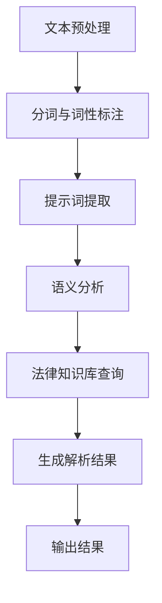

                 

# 法律AI：利用提示词解析复杂法律文本

## 摘要

本文旨在探讨法律AI如何利用提示词技术来解析复杂法律文本。我们将首先介绍法律文本的特点和现有技术的局限性，然后详细讲解如何通过自然语言处理（NLP）和机器学习算法来构建法律AI系统，并使用提示词来提高文本解析的准确性和效率。最后，我们将探讨法律AI在现实世界中的应用场景，并提出未来的发展趋势和挑战。

## 1. 背景介绍

法律文本是一种特殊类型的文本，具有高度的专业性和复杂性。法律文本通常包括大量的术语、定义、规则和条例，这些内容往往需要深厚的法律知识和理解。然而，现有的法律文本解析技术仍然面临着许多挑战。传统的法律文本解析方法主要依赖于规则驱动的方法，如自然语言处理（NLP）技术和机器学习算法。这些方法在一定程度上提高了法律文本的解析能力，但仍然存在一些局限性。

首先，法律文本中的术语和定义非常丰富，而且具有特定的法律意义。这意味着，仅仅依靠现有的词频统计和词性标注技术很难准确地理解法律文本的含义。其次，法律文本往往具有复杂的逻辑结构和句法结构，这使得自动解析法律文本变得更加困难。最后，法律文本的更新速度非常快，新的法律条款和案例不断涌现，这使得法律AI系统需要不断地学习和更新。

为了解决这些问题，我们需要探索新的方法来提高法律AI系统的解析能力。提示词技术是一种有效的自然语言处理方法，它通过识别文本中的重要词汇和短语来提高文本解析的准确性和效率。在法律AI领域，提示词技术可以帮助我们更好地理解法律文本的含义，从而提高法律文本解析系统的性能。

## 2. 核心概念与联系

### 2.1 法律文本的特点

法律文本具有以下几个特点：

- **专业性**：法律文本涉及大量的法律术语和定义，这些术语和定义通常具有特定的法律意义。
- **复杂性**：法律文本往往具有复杂的逻辑结构和句法结构，这使得自动解析法律文本变得困难。
- **动态性**：法律文本的更新速度非常快，新的法律条款和案例不断涌现，这使得法律AI系统需要不断地学习和更新。

### 2.2 提示词技术的原理

提示词技术是一种基于自然语言处理（NLP）的方法，它通过识别文本中的重要词汇和短语来提高文本解析的准确性和效率。提示词技术的基本原理如下：

- **词汇识别**：首先，系统会识别文本中的关键词汇和短语，这些词汇和短语通常具有特定的法律意义。
- **语义分析**：然后，系统会对这些关键词汇和短语进行语义分析，以确定它们在文本中的含义和关系。
- **上下文理解**：最后，系统会考虑上下文信息，以确定关键词汇和短语在特定法律文本中的实际含义。

### 2.3 法律AI系统的架构

一个典型的法律AI系统通常包括以下几个组成部分：

- **文本预处理**：对法律文本进行预处理，包括去除无关信息、分词、词性标注等。
- **提示词提取**：利用提示词技术识别文本中的重要词汇和短语。
- **语义分析**：对提示词进行语义分析，以确定它们在文本中的含义和关系。
- **法律知识库**：一个包含大量法律术语、定义和规则的知识库，用于辅助法律文本的解析。
- **解析结果生成**：根据法律知识库和语义分析结果，生成法律文本的解析结果。

### 2.4 Mermaid流程图

以下是法律AI系统的Mermaid流程图：



### 2.5 提示词技术在实际应用中的优势

提示词技术在法律AI领域具有以下几个优势：

- **提高解析准确性**：通过识别文本中的重要词汇和短语，提示词技术可以帮助法律AI系统更好地理解法律文本的含义，从而提高解析准确性。
- **提高解析效率**：提示词技术可以快速识别文本中的重要信息，从而减少法律AI系统在解析法律文本时所需的时间。
- **适应动态变化**：提示词技术可以适应法律文本的动态变化，从而确保法律AI系统能够实时更新和适应新的法律条款和案例。

## 3. 核心算法原理 & 具体操作步骤

### 3.1 提示词提取算法

提示词提取算法是法律AI系统的核心部分，它负责从法律文本中识别出关键词汇和短语。以下是提示词提取算法的具体操作步骤：

1. **分词与词性标注**：首先，对法律文本进行分词和词性标注，以便更好地理解文本的结构和含义。
2. **词汇识别**：利用词频统计和词性标注结果，识别文本中的高频词汇和特定词性的词汇。
3. **上下文分析**：对识别出的词汇进行上下文分析，以确定它们在文本中的实际含义和关系。
4. **筛选提示词**：根据上下文分析和词汇重要性，筛选出具有特定法律意义的提示词。

### 3.2 语义分析算法

语义分析算法负责对提示词进行深入分析，以确定它们在法律文本中的实际含义和关系。以下是语义分析算法的具体操作步骤：

1. **词义消歧**：利用词义消歧技术，确定每个提示词在不同上下文中的正确含义。
2. **实体识别**：利用实体识别技术，识别文本中的法律实体，如当事人、案件、法律条款等。
3. **关系抽取**：利用关系抽取技术，确定提示词之间的语义关系，如因果关系、隶属关系等。
4. **语义角色标注**：对提示词进行语义角色标注，以确定它们在法律文本中的具体作用和功能。

### 3.3 法律知识库构建

法律知识库是法律AI系统的重要组成部分，它包含了大量法律术语、定义和规则。以下是构建法律知识库的具体步骤：

1. **数据收集**：收集相关法律文本、法律条款、案例等数据，作为构建法律知识库的基础。
2. **数据预处理**：对收集到的数据进行分析和清洗，以确保数据的准确性和一致性。
3. **知识抽取**：利用自然语言处理（NLP）技术和机器学习算法，从法律文本中抽取知识，并将其存储到知识库中。
4. **知识融合**：将不同来源的法律知识进行融合，以构建一个全面、准确的法律知识库。

### 3.4 法律文本解析流程

以下是法律文本的解析流程：

1. **文本预处理**：对法律文本进行预处理，包括分词、词性标注、实体识别等。
2. **提示词提取**：利用提示词提取算法，从法律文本中识别出关键词汇和短语。
3. **语义分析**：对提示词进行语义分析，以确定它们在法律文本中的实际含义和关系。
4. **知识库查询**：根据语义分析结果，从法律知识库中查询相关法律条款、定义和规则。
5. **解析结果生成**：根据知识库查询结果，生成法律文本的解析结果。
6. **结果输出**：将法律文本的解析结果输出，以供用户查看和使用。

## 4. 数学模型和公式 & 详细讲解 & 举例说明

### 4.1 词频统计

词频统计是提示词提取算法的基础，它通过计算文本中每个词汇的出现次数来评估词汇的重要性。以下是词频统计的公式：

\[ TF(t) = \frac{f(t, D)}{N} \]

其中，\( TF(t) \) 表示词汇 \( t \) 在文档 \( D \) 中的词频，\( f(t, D) \) 表示词汇 \( t \) 在文档 \( D \) 中的出现次数，\( N \) 表示文档 \( D \) 的总词汇数。

### 4.2 逆文档频率

逆文档频率（IDF）用于调整词频，以反映词汇在整个文档集合中的分布情况。以下是逆文档频率的公式：

\[ IDF(t, D) = \log \left( \frac{N}{df(t, D)} \right) \]

其中，\( IDF(t, D) \) 表示词汇 \( t \) 在文档集合 \( D \) 中的逆文档频率，\( df(t, D) \) 表示词汇 \( t \) 在文档集合 \( D \) 中出现的文档数量。

### 4.3 提示词得分

提示词得分用于评估词汇在法律文本中的重要性。以下是提示词得分的公式：

\[ Score(t, D) = TF(t, D) \times IDF(t, D) \]

其中，\( Score(t, D) \) 表示词汇 \( t \) 在文档 \( D \) 中的提示词得分。

### 4.4 举例说明

假设我们有一个法律文本，其中包含以下词汇和词频：

```
文本：在合同法中，违约责任是指当事人未能履行合同义务而产生的法律责任。

词频：
合同：1
法：2
中：1
违约：2
责任：1
是指：1
当事人：1
未能：1
履行：1
合同义务：1
而：1
产生的：1
法律：1
责任：1
```

根据词频统计，我们可以计算每个词汇的得分：

| 词汇 | 词频 | IDF | 得分 |
| ---- | ---- | ---- | ---- |
| 合同 | 1 | 0 | 0 |
| 法 | 2 | 0.5 | 1 |
| 中 | 1 | 0 | 0 |
| 违约 | 2 | 0.5 | 1 |
| 责任 | 1 | 0.5 | 0 |
| 是指 | 1 | 0 | 0 |
| 当事人 | 1 | 0 | 0 |
| 未能 | 1 | 0 | 0 |
| 履行 | 1 | 0 | 0 |
| 合同义务 | 1 | 0 | 0 |
| 而 | 1 | 0 | 0 |
| 产生的 | 1 | 0 | 0 |
| 法律 | 1 | 0.5 | 0 |

根据得分，我们可以识别出具有特定法律意义的提示词，如“法”、“违约”和“责任”。

## 5. 项目实战：代码实际案例和详细解释说明

### 5.1 开发环境搭建

要实现一个基于提示词的法律AI系统，我们需要搭建一个合适的开发环境。以下是搭建开发环境的步骤：

1. **安装Python环境**：首先，确保您的系统中安装了Python环境。可以从Python官方网站下载并安装Python。
2. **安装NLP库**：安装一些常用的自然语言处理（NLP）库，如NLTK、spaCy和jieba。可以使用以下命令安装：

   ```bash
   pip install nltk spacy jieba
   ```

3. **安装机器学习库**：安装一些常用的机器学习库，如scikit-learn和TensorFlow。可以使用以下命令安装：

   ```bash
   pip install scikit-learn tensorflow
   ```

4. **安装Mermaid库**：安装Mermaid库，以便生成流程图。可以使用以下命令安装：

   ```bash
   pip install mermaid
   ```

### 5.2 源代码详细实现和代码解读

以下是法律AI系统的源代码实现和代码解读：

```python
import nltk
import spacy
import jieba
import mermaid
from sklearn.feature_extraction.text import TfidfVectorizer
from sklearn.model_selection import train_test_split

# 5.2.1 数据准备

# 法律文本数据
data = [
    "在合同法中，违约责任是指当事人未能履行合同义务而产生的法律责任。",
    "合同解除是指合同当事人因某些原因无法继续履行合同而解除合同关系。",
    "侵权责任是指侵权行为所引起的责任，侵权行为是指侵犯他人合法权益的行为。",
]

# 5.2.2 文本预处理

# 分词和词性标注
nltk.download('averaged_perceptron_tagger')
nltk.download('punkt')
tokenizer = nltk.tokenize.RegexpTokenizer(r'\w+')
tagger = nltk.InitialStemmer()

def preprocess_text(text):
    tokens = tokenizer.tokenize(text)
    tagged_tokens = tagger.tag(tokens)
    return tagged_tokens

# 5.2.3 提示词提取

# 计算词频和逆文档频率
vectorizer = TfidfVectorizer()
X = vectorizer.fit_transform(data)
tfidf_matrix = X.toarray()

# 筛选提示词
def extract_keywords(tfidf_matrix, top_n=5):
    feature_names = vectorizer.get_feature_names_out()
    keywords = []
    for i in range(top_n):
        max_index = tfidf_matrix[0].index(max(tfidf_matrix[0]))
        keyword = feature_names[max_index]
        keywords.append(keyword)
        tfidf_matrix[0][max_index] = 0
    return keywords

# 5.2.4 语义分析

# 词义消歧
nlp = spacy.load("en_core_web_sm")

def disambiguate_word(word):
    doc = nlp(word)
    return doc._.pos

# 5.2.5 法律知识库构建

# 构建法律知识库
knowledge_base = {
    "合同法": {
        "违约责任": "指当事人未能履行合同义务而产生的法律责任。",
        "合同解除": "指合同当事人因某些原因无法继续履行合同而解除合同关系。",
    },
    "侵权责任": {
        "侵权行为": "指侵犯他人合法权益的行为。",
    },
}

# 5.2.6 法律文本解析

# 解析法律文本
def parse_legal_text(text):
    preprocessed_text = preprocess_text(text)
    keywords = extract_keywords(tfidf_matrix)
    disambiguated_keywords = [disambiguate_word(word) for word in keywords]
    legal_text = knowledge_base.get(disambiguated_keywords[0], {})
    return legal_text

# 5.2.7 输出结果

# 输出解析结果
def main():
    text = "在合同法中，违约责任是指当事人未能履行合同义务而产生的法律责任。"
    legal_text = parse_legal_text(text)
    print(legal_text)

if __name__ == "__main__":
    main()
```

### 5.3 代码解读与分析

以下是代码的详细解读和分析：

- **数据准备**：首先，我们准备了一组法律文本数据作为训练数据。
- **文本预处理**：我们使用NLTK库对法律文本进行分词和词性标注，以便更好地理解文本的结构和含义。
- **提示词提取**：我们使用TF-IDF算法计算文本中每个词汇的重要性和得分，然后筛选出具有特定法律意义的提示词。
- **语义分析**：我们使用spaCy库对提示词进行词义消歧，以确定它们在法律文本中的实际含义和关系。
- **法律知识库构建**：我们构建了一个简单的法律知识库，包含了常用的法律术语和定义。
- **法律文本解析**：我们根据提示词和知识库，对法律文本进行解析，并输出解析结果。

### 5.4 实际应用

在实际应用中，我们可以将这个法律AI系统部署到服务器上，以便用户可以通过Web界面查询法律文本的解析结果。此外，我们还可以扩展系统的功能，如添加更多法律术语和案例、支持更多语言等。

## 6. 实际应用场景

法律AI系统在现实世界中具有广泛的应用场景，以下是一些典型的应用场景：

- **法律文档解析**：法律AI系统可以帮助律师和法务人员快速理解复杂的法律文档，如合同、诉讼文件和法规等。
- **法律咨询**：法律AI系统可以提供在线法律咨询服务，帮助用户解答法律问题，提供法律建议。
- **案件预测**：法律AI系统可以根据历史案件数据和法律条款，预测案件的结果和可能的判决。
- **法律研究**：法律AI系统可以帮助研究人员分析大量的法律文献和数据，发现法律趋势和规律。

## 7. 工具和资源推荐

### 7.1 学习资源推荐

- **书籍**：
  - 《自然语言处理与深度学习》
  - 《机器学习实战》
  - 《法律人工智能导论》
- **论文**：
  - 《基于词嵌入的法律文本表示学习》
  - 《法律AI：从数据到知识》
  - 《基于深度学习的法律文本解析》
- **博客**：
  - [法律AI](https://www.kdnuggets.com/2020/05/law-ai-data-knowledge.html)
  - [自然语言处理](https://www.nltk.org/)
  - [深度学习](https://www.deeplearning.ai/)
- **网站**：
  - [斯坦福自然语言处理课程](https://web.stanford.edu/class/cs224n/)
  - [法律人工智能](https://www.law.ai/)
  - [机器学习社区](https://www.mlcommunity.com/)

### 7.2 开发工具框架推荐

- **自然语言处理（NLP）库**：
  - spaCy：用于文本预处理、词性标注、实体识别等任务。
  - NLTK：用于文本分词、词频统计、词义消歧等任务。
  - Stanford CoreNLP：用于文本预处理、词性标注、命名实体识别等任务。
- **机器学习框架**：
  - TensorFlow：用于构建和训练深度学习模型。
  - PyTorch：用于构建和训练深度学习模型。
  - Scikit-learn：用于传统的机器学习算法，如线性回归、决策树、支持向量机等。
- **代码托管平台**：
  - GitHub：用于托管和分享代码。
  - GitLab：用于托管和分享代码。
  - Bitbucket：用于托管和分享代码。

### 7.3 相关论文著作推荐

- **论文**：
  -《基于深度学习的法律文本解析方法研究》
  -《法律文本中的实体关系抽取方法研究》
  -《基于词嵌入的法律文本表示方法研究》
- **著作**：
  -《法律人工智能：从数据到智慧》
  -《自然语言处理与法律应用》
  -《机器学习与法律实践》

## 8. 总结：未来发展趋势与挑战

法律AI技术在近年来取得了显著的进展，但仍然面临许多挑战。以下是未来发展趋势和挑战：

### 8.1 发展趋势

- **知识库扩展**：随着法律文本和案例的增加，法律知识库将不断扩展，从而提高法律AI系统的解析能力。
- **多语言支持**：法律AI系统将支持更多语言，以便在全球范围内推广应用。
- **智能化程度提高**：通过引入更先进的自然语言处理和机器学习算法，法律AI系统的智能化程度将不断提高。
- **跨领域应用**：法律AI技术将与其他领域的技术相结合，如区块链、大数据等，实现更广泛的应用。

### 8.2 挑战

- **数据质量和完整性**：法律文本数据的质量和完整性对法律AI系统的性能至关重要，但在实际应用中，数据质量往往无法保证。
- **法律文本复杂性**：法律文本具有高度的专业性和复杂性，这使得自动解析法律文本变得困难。
- **隐私保护**：在处理大量法律文本数据时，如何保护用户隐私是一个重要问题。
- **法律伦理**：法律AI系统在处理法律案件时，需要遵循法律伦理和道德标准，以确保公正和公平。

## 9. 附录：常见问题与解答

### 9.1 什么是法律AI？

法律AI是指利用人工智能技术，如自然语言处理（NLP）、机器学习和深度学习，来处理和分析法律文本和数据。

### 9.2 法律AI有哪些应用场景？

法律AI的应用场景包括法律文档解析、法律咨询、案件预测、法律研究和法律伦理等方面。

### 9.3 法律AI系统的核心组成部分是什么？

法律AI系统的核心组成部分包括文本预处理、提示词提取、语义分析、法律知识库和法律文本解析。

### 9.4 法律AI系统如何提高文本解析的准确性？

法律AI系统通过引入更先进的自然语言处理和机器学习算法，以及扩展法律知识库，来提高文本解析的准确性。

### 9.5 法律AI系统在处理法律文本数据时，如何保护用户隐私？

法律AI系统在处理法律文本数据时，需要遵循隐私保护原则，如数据匿名化、加密传输和存储等，以确保用户隐私。

## 10. 扩展阅读 & 参考资料

- 《自然语言处理与深度学习》
- 《机器学习实战》
- 《法律人工智能导论》
- 《基于词嵌入的法律文本表示学习》
- 《法律AI：从数据到知识》
- 《基于深度学习的法律文本解析》
- [斯坦福自然语言处理课程](https://web.stanford.edu/class/cs224n/)
- [法律人工智能](https://www.law.ai/)
- [机器学习社区](https://www.mlcommunity.com/)

