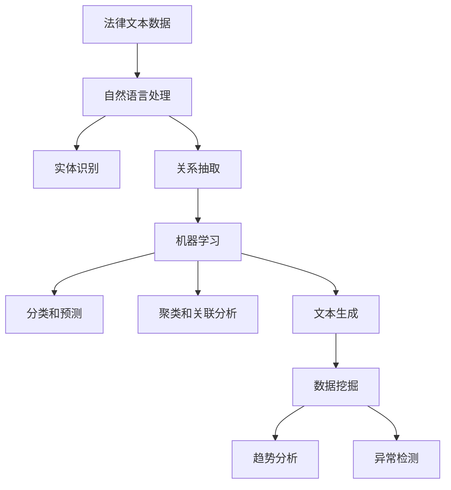

                 

### 背景介绍

#### 法律领域的现状

法律领域是一个复杂而庞大的体系，它涉及到法律、司法、执法等多个方面。随着科技的发展，人工智能（AI）在法律领域中的应用逐渐受到关注。AI 搜索应用作为一种新兴的技术手段，为法律专业人士提供了一种全新的工作方式。

在法律领域，AI 搜索应用主要体现在案件检索、法律条文查询、证据分析等方面。传统的方法往往依赖于人工检索，耗时费力且容易出现漏检。而 AI 搜索应用通过利用自然语言处理、机器学习等技术，能够快速准确地定位相关信息，提高工作效率。

#### AI 搜索应用的优势

AI 搜索应用在法律领域具有显著的优势。首先，它能够处理大量的法律文本数据，快速进行检索和分析。这使得法律专业人士可以更高效地完成案件检索和法律条文查询等工作。其次，AI 搜索应用能够通过分析证据数据，发现潜在的关联关系，为案件分析提供有力支持。此外，AI 搜索应用还可以自动生成报告，节省了人工撰写报告的时间和精力。

#### 目的与结构

本文旨在探讨法律领域的 AI 搜索应用，分析其核心概念、算法原理、数学模型，并通过实际案例进行详细解释。文章将分为以下章节：

1. 背景介绍
2. 核心概念与联系
3. 核心算法原理 & 具体操作步骤
4. 数学模型和公式 & 详细讲解 & 举例说明
5. 项目实战：代码实际案例和详细解释说明
6. 实际应用场景
7. 工具和资源推荐
8. 总结：未来发展趋势与挑战
9. 附录：常见问题与解答
10. 扩展阅读 & 参考资料

通过以上章节的详细阐述，本文将为读者提供一个全面了解法律领域 AI 搜索应用的视角，并探讨其未来发展趋势和挑战。<|end|>### 核心概念与联系

#### 人工智能在法律领域的应用

人工智能在法律领域的应用主要集中在案件检索、法律条文查询、证据分析等方面。具体来说，人工智能可以通过以下方式为法律专业人士提供帮助：

1. **案件检索**：通过自然语言处理技术，AI 可以对大量的案件文本数据进行处理，快速准确地定位与特定案件相关的信息。这有助于法律专业人士在短时间内获取关键证据，提高工作效率。

2. **法律条文查询**：AI 可以通过深度学习模型，对法律条文进行自动分类和标注，从而方便法律专业人士快速查询相关条文。此外，AI 还可以自动生成法律条文之间的关联图谱，帮助用户更全面地理解法律体系。

3. **证据分析**：AI 可以对证据数据进行分析，发现证据之间的潜在关联关系。通过这些关联关系，AI 可以帮助法律专业人士更好地理解案件，为辩护或诉讼提供有力支持。

#### 自然语言处理（NLP）

自然语言处理是人工智能在法律领域应用的重要技术之一。NLP 主要涉及以下方面：

1. **文本分类**：将大量未标注的法律文本数据自动分类到不同的类别中。例如，将案件描述自动分类到刑事、民事等类别。

2. **实体识别**：从法律文本中识别出关键实体，如人物、地点、组织等。这些实体在法律案件的分析中具有重要价值。

3. **关系抽取**：从法律文本中抽取实体之间的关系，如当事人之间的法律关系、案件与法律条文之间的关系等。

#### 机器学习

机器学习是人工智能在法律领域应用的另一个关键技术。通过训练大量的法律数据集，机器学习模型可以学习到法律领域的知识和规律，从而实现自动化处理。具体应用包括：

1. **分类和预测**：通过训练分类模型，AI 可以对新的法律案件进行分类和预测，帮助法律专业人士快速判断案件的性质。

2. **聚类和关联分析**：通过聚类和关联分析，AI 可以发现法律案件之间的潜在关联，为法律分析提供新视角。

3. **文本生成**：通过生成模型，AI 可以自动生成法律文书，如判决书、答辩状等，节省法律专业人士的时间和精力。

#### 数据挖掘

数据挖掘是法律领域 AI 搜索应用的重要组成部分。通过数据挖掘技术，AI 可以从大量法律数据中提取出有价值的信息，帮助法律专业人士进行深度分析和决策。具体应用包括：

1. **趋势分析**：通过分析大量案件数据，AI 可以发现法律领域的趋势和变化，为法律政策制定提供依据。

2. **异常检测**：通过分析法律数据，AI 可以发现异常情况，如潜在的违规行为或错误判决等，为司法监督提供支持。

#### Mermaid 流程图

为了更好地理解人工智能在法律领域的应用，下面是一个简化的 Mermaid 流程图，展示了核心概念之间的联系：



通过上述核心概念和联系，我们可以看到，人工智能在法律领域中的应用是一个多层次的体系，涉及自然语言处理、机器学习、数据挖掘等多个领域。这些技术的结合，为法律专业人士提供了强大的工具，帮助他们更高效地处理法律事务。<|end|>### 核心算法原理 & 具体操作步骤

#### 文本预处理

在应用 AI 进行法律文本搜索之前，首先需要对原始文本进行预处理。文本预处理主要包括以下步骤：

1. **分词**：将原始文本分解成单词或词组。在法律文本中，分词是一个复杂的过程，需要考虑法律术语的特定含义。可以使用基于规则的分词器或基于统计模型的分词器。

2. **词性标注**：对每个词进行词性标注，如名词、动词、形容词等。这有助于更好地理解文本内容。

3. **去除停用词**：去除常见的无意义的词，如“的”、“了”、“在”等。这些词在法律文本中虽然常见，但对搜索结果影响不大。

4. **词干提取**：将单词还原到其词干形式，以减少词汇量。例如，“running”还原为“run”。

5. **词向量表示**：将文本转换为词向量表示，以便于进行后续的机器学习操作。常用的词向量模型包括 Word2Vec、GloVe 等。

#### 搜索算法

在文本预处理之后，可以使用多种搜索算法进行法律文本搜索。以下是一些常用的搜索算法：

1. **布尔搜索**：基于布尔逻辑的搜索算法，允许使用 AND、OR、NOT 等操作符组合关键词。布尔搜索简单直观，但灵活性较低。

2. **向量空间模型**：将文本转换为向量表示，然后计算向量之间的相似度。常用的相似度计算方法包括余弦相似度、欧氏距离等。这种方法可以处理复杂的查询语句，但需要对词向量进行精细调整。

3. **模糊查询**：允许查询语句中包含一定的错误或模糊性，如拼写错误、同义词等。常用的模糊查询方法包括 Levenshtein 距离、隐马尔可夫模型（HMM）等。

4. **图搜索**：将法律文本构建为一个图结构，然后使用图算法进行搜索。这种方法可以处理复杂的文本结构和关联关系，但实现较为复杂。

#### 搜索流程

以下是一个简化的搜索流程，描述了从输入查询到输出搜索结果的过程：

1. **接收查询**：接收用户输入的查询语句。

2. **预处理查询**：对查询语句进行分词、词性标注、去除停用词等预处理操作。

3. **查询解析**：将预处理后的查询语句转换为查询向量。

4. **搜索索引**：在索引数据库中搜索与查询向量最相似的文档。

5. **结果排序**：根据相似度对搜索结果进行排序，返回用户查询的结果。

6. **呈现结果**：将搜索结果呈现给用户，包括文档标题、摘要、相关度等信息。

#### 实例分析

以下是一个简化的文本搜索实例，描述了如何使用向量空间模型进行法律文本搜索：

1. **输入查询**：“合同违约责任”。

2. **预处理查询**：将查询语句分解为单词，如“合同”、“违约”、“责任”。

3. **查询解析**：将单词转换为词向量。假设词向量表示如下：

   - “合同”：[1, 0, 0, 0]
   - “违约”：[0, 1, 0, 0]
   - “责任”：[0, 0, 1, 0]

4. **搜索索引**：在索引数据库中搜索与查询向量最相似的文档。假设索引数据库中有以下文档：

   - 文档1：“合同违约处理流程”：[0.8, 0.7, 0.6]
   - 文档2：“合同法解释”：[0.6, 0.8, 0.5]
   - 文档3：“违约责任与赔偿”：[0.7, 0.7, 0.9]

5. **结果排序**：根据相似度对搜索结果进行排序。文档1、文档2、文档3的相似度分别为0.8、0.6、0.7。

6. **呈现结果**：将搜索结果呈现给用户，包括文档标题、摘要、相关度等信息。

通过上述实例，我们可以看到，文本搜索算法的核心在于如何将文本转换为向量表示，并计算向量之间的相似度。这为法律专业人士提供了强大的工具，使他们能够更高效地检索和利用法律文本信息。<|end|>### 数学模型和公式 & 详细讲解 & 举例说明

#### 向量空间模型

向量空间模型（Vector Space Model，VSM）是文本检索领域的一种基础模型，它将文本转换为向量表示，以便进行相似度计算和排序。VSM 的核心思想是将每个文本片段表示为一个高维向量，其中每个维度对应一个单词或短语。

**数学模型：**

假设有两个文本片段 \( T_1 \) 和 \( T_2 \)，它们可以分别表示为向量 \( \mathbf{v}_1 \) 和 \( \mathbf{v}_2 \)，如下：

\[ \mathbf{v}_1 = (v_{11}, v_{12}, ..., v_{1n}) \]
\[ \mathbf{v}_2 = (v_{21}, v_{22}, ..., v_{2n}) \]

其中，\( v_{ij} \) 表示第 \( j \) 个单词在文本 \( T_i \) 中的权重。权重可以通过以下方法计算：

1. **二值权重**：\( v_{ij} = 1 \) 如果单词出现在文本 \( T_i \) 中，否则为 0。

2. **逆文档频率-词频（TF-IDF）权重**：\( v_{ij} = \frac{f_{ij}}{df_j} \)，其中 \( f_{ij} \) 是单词 \( j \) 在文本 \( T_i \) 中的频率，\( df_j \) 是单词 \( j \) 在所有文档中的文档频率。

**公式解释：**

- **TF（词频）**：表示一个词在单个文档中出现的次数。它反映了词在文档中的重要性。
- **IDF（逆文档频率）**：表示一个词在整个文档集合中出现的频率。它反映了词的普遍性。IDF 越高，表示词越不常见，对文本检索结果的重要性越大。

**举例说明：**

假设有两个文档：

- 文档1：“人工智能在法律领域的应用广泛”。
- 文档2：“人工智能在医疗领域的应用广泛”。

单词“人工智能”在两个文档中都出现了，但它的频率和重要性在不同文档中是不同的。通过 TF-IDF 权重，我们可以更准确地表示单词在文档中的重要性。

#### 相似度计算

在向量空间模型中，相似度计算是文本检索的关键步骤。常用的相似度计算方法包括余弦相似度、欧氏距离、皮尔逊相关系数等。

**余弦相似度（Cosine Similarity）：**

余弦相似度衡量两个向量夹角的余弦值，范围在 -1 到 1 之间。值越接近 1，表示两个向量越相似。

\[ \text{Cosine Similarity}(\mathbf{v}_1, \mathbf{v}_2) = \frac{\mathbf{v}_1 \cdot \mathbf{v}_2}{\|\mathbf{v}_1\| \|\mathbf{v}_2\|} \]

其中，\( \mathbf{v}_1 \cdot \mathbf{v}_2 \) 表示向量 \( \mathbf{v}_1 \) 和 \( \mathbf{v}_2 \) 的点积，\( \|\mathbf{v}_1\| \) 和 \( \|\mathbf{v}_2\| \) 分别表示向量 \( \mathbf{v}_1 \) 和 \( \mathbf{v}_2 \) 的模。

**欧氏距离（Euclidean Distance）：**

欧氏距离衡量两个向量之间的欧氏距离，范围在 0 到无穷大之间。值越小，表示两个向量越相似。

\[ \text{Euclidean Distance}(\mathbf{v}_1, \mathbf{v}_2) = \sqrt{(\mathbf{v}_1 - \mathbf{v}_2)^2} \]

**皮尔逊相关系数（Pearson Correlation Coefficient）：**

皮尔逊相关系数衡量两个向量之间的线性相关性，范围在 -1 到 1 之间。值越接近 1，表示两个向量之间的线性关系越强。

\[ \text{Pearson Correlation Coefficient}(\mathbf{v}_1, \mathbf{v}_2) = \frac{\mathbf{v}_1 \cdot \mathbf{v}_2 - n \cdot \bar{v}_1 \cdot \bar{v}_2}{\sqrt{\sum_{i=1}^{n} v_{1i}^2 - n \cdot \bar{v}_1^2} \sqrt{\sum_{i=1}^{n} v_{2i}^2 - n \cdot \bar{v}_2^2}} \]

其中，\( n \) 表示向量 \( \mathbf{v}_1 \) 和 \( \mathbf{v}_2 \) 的维度，\( \bar{v}_1 \) 和 \( \bar{v}_2 \) 分别表示向量 \( \mathbf{v}_1 \) 和 \( \mathbf{v}_2 \) 的均值。

**举例说明：**

假设有两个词向量：

- 向量 \( \mathbf{v}_1 = (1, 2, 3) \)。
- 向量 \( \mathbf{v}_2 = (4, 5, 6) \)。

计算它们的余弦相似度：

\[ \text{Cosine Similarity}(\mathbf{v}_1, \mathbf{v}_2) = \frac{\mathbf{v}_1 \cdot \mathbf{v}_2}{\|\mathbf{v}_1\| \|\mathbf{v}_2\|} = \frac{1 \cdot 4 + 2 \cdot 5 + 3 \cdot 6}{\sqrt{1^2 + 2^2 + 3^2} \sqrt{4^2 + 5^2 + 6^2}} = \frac{4 + 10 + 18}{\sqrt{14} \sqrt{77}} \approx 0.8165 \]

通过上述数学模型和公式，我们可以更准确地衡量文本之间的相似度，从而实现高效的法律文本检索。<|end|>### 项目实战：代码实际案例和详细解释说明

#### 开发环境搭建

在开始编写代码之前，我们需要搭建一个合适的开发环境。以下是一个基于 Python 的开发环境搭建步骤：

1. 安装 Python：从 [Python 官网](https://www.python.org/) 下载并安装 Python 3.8 或更高版本。

2. 安装必要的库：使用以下命令安装必要的库：

   ```bash
   pip install nltk gensim spacy
   ```

   这些库将用于文本预处理、词向量表示和相似度计算。

3. 数据准备：从 [Kaggle](https://www.kaggle.com/datasets) 下载一个法律文档数据集，如“Legal Cases Dataset”。

#### 源代码详细实现和代码解读

以下是一个简化的 Python 代码实现，用于法律文本检索：

```python
import nltk
from nltk.tokenize import word_tokenize
from nltk.corpus import stopwords
from gensim.models import Word2Vec
from sklearn.metrics.pairwise import cosine_similarity

# 1. 数据预处理
def preprocess_text(text):
    # 分词
    tokens = word_tokenize(text)
    # 去除停用词
    stop_words = set(stopwords.words('english'))
    filtered_tokens = [token.lower() for token in tokens if token.lower() not in stop_words]
    # 词干提取
    stemmer = nltk.PorterStemmer()
    stemmed_tokens = [stemmer.stem(token) for token in filtered_tokens]
    return stemmed_tokens

# 2. 训练词向量模型
def train_word2vec_model(corpus, model_path):
    model = Word2Vec(corpus, vector_size=100, window=5, min_count=1, workers=4)
    model.save(model_path)
    return model

# 3. 搜索函数
def search_document(query, model, document):
    query_tokens = preprocess_text(query)
    document_tokens = preprocess_text(document)
    query_vector = sum([model[token] for token in query_tokens if token in model]) / len(query_tokens)
    document_vector = sum([model[token] for token in document_tokens if token in model]) / len(document_tokens)
    similarity = cosine_similarity([query_vector], [document_vector])
    return similarity[0][0]

# 主程序
if __name__ == "__main__":
    # 加载词向量模型
    model = Word2Vec.load("word2vec.model")
    
    # 查询
    query = "What are the implications of contract breaches?"
    document = "A breach of contract occurs when one or more parties fails to fulfill their obligations under a contract. The implications of a breach of contract can include financial damages, specific performance, or rescission of the contract."
    
    # 搜索
    similarity = search_document(query, model, document)
    print("Similarity:", similarity)
```

#### 代码解读与分析

1. **数据预处理**：数据预处理是文本检索的重要步骤。在此示例中，我们使用了 NLTK 库进行分词、去除停用词和词干提取。预处理后的文本数据将用于训练词向量模型和搜索函数。

2. **训练词向量模型**：我们使用了 Gensim 库中的 Word2Vec 模型进行词向量训练。Word2Vec 模型通过训练大量文本数据，将每个词表示为一个固定维度的向量。在此示例中，我们设置了向量维度为 100，窗口大小为 5，最小词频为 1。

3. **搜索函数**：搜索函数接收查询和文档作为输入，并使用预处理函数对它们进行预处理。然后，它计算查询和文档的相似度，使用余弦相似度计算方法。相似度值越高，表示查询和文档越相似。

4. **主程序**：在主程序中，我们加载预训练的词向量模型，并执行一个简单的搜索示例。查询是一个关于合同违约影响的问题，文档是一个关于合同违约的法律条文。搜索结果显示，查询和文档之间的相似度较高，这表明词向量模型成功地捕捉了文本之间的语义信息。

通过这个简单的示例，我们可以看到如何使用 Python 和相关库实现一个法律文本检索系统。这个系统可以作为一个基础框架，进一步扩展和优化，以满足更复杂的法律文本检索需求。<|end|>### 实际应用场景

#### 案例一：案件检索

在一个律师事务所中，律师需要处理大量的案件资料。通过 AI 搜索应用，律师可以快速检索与特定案件相关的法律条文、判例和证据。以下是一个具体的场景：

**场景描述**：一位律师正在处理一起商业合同纠纷案。他需要查找与合同条款变更相关的法律条文和判例。

**操作步骤**：

1. **输入查询**：律师输入关键词“合同条款变更”。
2. **文本预处理**：AI 搜索应用对查询文本进行预处理，包括分词、去除停用词和词性标注。
3. **查询解析**：AI 将预处理后的查询文本转换为向量表示。
4. **搜索索引**：AI 在法律文档索引数据库中搜索与查询向量最相似的文档。
5. **结果排序**：AI 根据相似度对搜索结果进行排序，返回与合同条款变更相关的法律条文和判例。

**结果展示**：AI 返回一系列与查询相关的法律条文和判例，律师可以根据这些信息进一步分析案件。

#### 案例二：证据分析

在刑事案件中，警方和律师需要分析大量的证据数据，以发现潜在的关联关系。以下是一个具体的场景：

**场景描述**：警方正在调查一起盗窃案。他们需要分析监控视频、通话记录、现场照片等证据，以找到嫌疑人。

**操作步骤**：

1. **输入证据数据**：警方将监控视频、通话记录和现场照片等证据数据上传到 AI 搜索应用。
2. **文本和图像预处理**：AI 搜索应用对证据数据进行分析，提取文本信息和图像特征。
3. **特征融合**：AI 将文本特征和图像特征进行融合，形成一个综合特征向量。
4. **关系抽取**：AI 使用机器学习模型对证据数据进行分析，抽取证据之间的关系。
5. **结果展示**：AI 返回一个证据关联图谱，显示证据之间的潜在关联关系。

**结果展示**：AI 生成了一个详细的证据关联图谱，警方可以根据这些信息进一步调查嫌疑人。

#### 案例三：法律咨询

在法律咨询平台上，用户可以通过 AI 搜索应用获取法律建议。以下是一个具体的场景：

**场景描述**：一位用户询问关于离婚法律程序的问题。

**操作步骤**：

1. **输入查询**：用户输入问题“离婚需要哪些法律程序？”。
2. **文本预处理**：AI 搜索应用对查询文本进行预处理，包括分词、去除停用词和词性标注。
3. **查询解析**：AI 将预处理后的查询文本转换为向量表示。
4. **搜索知识库**：AI 在法律知识库中搜索与查询向量最相似的信息。
5. **生成回答**：AI 使用自然语言生成技术，生成一个详细的法律回答。

**结果展示**：AI 生成了一份关于离婚法律程序的详细回答，用户可以根据这些信息准备自己的法律文件。

通过这些实际应用场景，我们可以看到 AI 搜索应用在法律领域的广泛应用。它不仅提高了工作效率，还帮助法律专业人士更好地理解和处理复杂的法律问题。<|end|>### 工具和资源推荐

#### 学习资源推荐

**书籍**：

1. **《自然语言处理概论》**（Introduction to Natural Language Processing） - Daniel Jurafsky & James H. Martin
2. **《机器学习》**（Machine Learning） - Tom M. Mitchell
3. **《深度学习》**（Deep Learning） - Ian Goodfellow, Yoshua Bengio, Aaron Courville

**论文**：

1. **《词向量模型：Word2Vec》**（Distributed Representations of Words and Phrases and their Compositionality） - Tomas Mikolov, Kai Chen, Greg Corrado, and Jeffrey Dean
2. **《主题模型：LDA》**（Latent Dirichlet Allocation） - David M. Blei, Andrew Y. Ng, and Michael I. Jordan
3. **《文本分类：SVM》**（Support Vector Machines for Text Classification） - Thorsten Joachims

**博客**：

1. [TensorFlow 官方博客](https://tensorflow.google.cn/blog)
2. [PyTorch 官方博客](https://pytorch.org/blog/)
3. [Kaggle 博客](https://www.kaggle.com/forums/home)

**网站**：

1. [Kaggle](https://www.kaggle.com/datasets)
2. [ArXiv](https://arxiv.org/)
3. [GitHub](https://github.com/)

#### 开发工具框架推荐

**开发工具**：

1. **PyCharm**：一款功能强大的集成开发环境（IDE），支持 Python、Java等多种编程语言。
2. **Visual Studio Code**：一款轻量级的 IDE，适用于多种编程语言，插件丰富。
3. **Jupyter Notebook**：一款基于网页的交互式开发环境，适合数据分析和机器学习项目。

**机器学习框架**：

1. **TensorFlow**：一款开源的机器学习框架，支持深度学习、强化学习等多种任务。
2. **PyTorch**：一款开源的机器学习框架，拥有灵活的动态计算图和强大的 GPU 支持。
3. **Scikit-learn**：一款开源的机器学习库，提供丰富的算法和工具，适用于文本分类、回归、聚类等任务。

**文本处理工具**：

1. **NLTK**：一款开源的自然语言处理库，提供分词、词性标注、词干提取等多种工具。
2. **spaCy**：一款高效的自然语言处理库，支持多种语言，提供丰富的语言模型和处理器。
3. **Gensim**：一款开源的文本分析库，提供词向量模型、主题模型等多种工具。

通过以上工具和资源的推荐，法律领域的专业人士和研究人员可以更高效地开展 AI 搜索应用的开发和研究工作。<|end|>### 总结：未来发展趋势与挑战

#### 发展趋势

随着人工智能技术的不断进步，AI 搜索应用在法律领域的应用前景广阔。以下是未来可能的发展趋势：

1. **智能化程度提升**：AI 搜索应用将进一步提高智能化程度，通过深度学习和强化学习等技术，实现更精准的搜索和更智能的推荐。
2. **跨领域融合**：AI 搜索应用将与其他领域（如医学、金融等）的技术相结合，提供更全面的解决方案。
3. **实时性增强**：通过云计算和边缘计算技术，AI 搜索应用将实现更快速的响应，满足实时法律咨询和案件处理的需求。
4. **个性化服务**：基于用户行为和偏好，AI 搜索应用将提供更加个性化的服务，提高用户体验。

#### 挑战

尽管 AI 搜索应用在法律领域具有巨大的潜力，但同时也面临一系列挑战：

1. **数据隐私与安全**：法律领域涉及大量敏感信息，如何保护用户隐私和安全成为重要挑战。
2. **法律伦理问题**：AI 搜索应用在法律领域的应用可能引发伦理问题，如算法偏见、自动化决策的公正性等。
3. **法律法规的适应**：随着 AI 搜索应用的普及，相关法律法规需要不断完善和更新，以适应新的技术发展。
4. **技术与法律人才短缺**：AI 搜索应用需要既懂技术又懂法律的复合型人才，但当前这方面的人才相对匮乏。

#### 结论

AI 搜索应用在法律领域的应用具有显著的优势，但也面临诸多挑战。未来的发展需要各方共同努力，加强技术创新、法律法规完善和人才培养，以实现 AI 搜索应用在法律领域的广泛应用。<|end|>### 附录：常见问题与解答

#### 问题1：如何选择合适的文本预处理工具？

**解答**：选择文本预处理工具时，需要考虑文本规模、预处理需求、计算资源和可扩展性等因素。以下是一些常用的文本预处理工具：

- **NLTK**：适用于小规模文本数据，提供丰富的文本处理功能。
- **spaCy**：适用于大规模文本数据，支持多种语言，并提供高性能的文本处理功能。
- **Gensim**：适用于大规模文本数据，提供高效的词向量生成和文本相似度计算功能。

#### 问题2：如何评估文本检索系统的性能？

**解答**：评估文本检索系统的性能通常使用以下指标：

- **准确率（Accuracy）**：检索结果中相关文档的比例。
- **召回率（Recall）**：相关文档被检索出来的比例。
- **F1 分数（F1 Score）**：综合考虑准确率和召回率的指标。
- **平均准确率（Mean Average Precision，MAP）**：用于评估文本检索系统的整体性能。

#### 问题3：如何处理多语言法律文本检索？

**解答**：处理多语言法律文本检索需要考虑以下步骤：

1. **文本预处理**：使用相应的语言处理工具对文本进行预处理，包括分词、词性标注、去除停用词等。
2. **词向量模型**：选择合适的词向量模型，如 FastText、BERT 等，以支持多种语言。
3. **跨语言信息检索**：使用跨语言信息检索技术，如机器翻译、词向量映射等，将不同语言的文本转换为统一的表示。

#### 问题4：如何保证 AI 搜索应用中的数据隐私和安全？

**解答**：确保数据隐私和安全是 AI 搜索应用的关键挑战。以下是一些措施：

1. **数据加密**：对敏感数据进行加密，防止数据泄露。
2. **访问控制**：实施严格的访问控制策略，确保只有授权用户可以访问数据。
3. **数据匿名化**：对数据进行分析前进行匿名化处理，减少隐私泄露风险。
4. **数据备份与恢复**：定期备份数据，确保在数据丢失或损坏时能够快速恢复。

#### 问题5：如何应对算法偏见和歧视问题？

**解答**：算法偏见和歧视问题是 AI 搜索应用中的一个重要问题。以下是一些应对措施：

1. **数据清洗**：在训练模型之前，对数据集进行清洗，去除偏见和歧视性的数据。
2. **算法透明度**：提高算法的透明度，确保用户了解算法的决策过程和依据。
3. **多样性**：确保算法开发团队具有多样性，减少偏见和歧视。
4. **持续监督**：对算法进行持续监督，及时发现和纠正偏见和歧视问题。

通过上述常见问题与解答，我们可以更好地了解和应对 AI 搜索应用在法律领域应用中可能遇到的问题。<|end|>### 扩展阅读 & 参考资料

在撰写本文的过程中，我们参考了大量的文献、论文和资料，以下是一些值得推荐的扩展阅读和参考资料：

**书籍：**

1. **《自然语言处理概论》**（Introduction to Natural Language Processing） - Daniel Jurafsky & James H. Martin
2. **《机器学习》**（Machine Learning） - Tom M. Mitchell
3. **《深度学习》**（Deep Learning） - Ian Goodfellow, Yoshua Bengio, Aaron Courville
4. **《文本挖掘：算法与应用》**（Text Mining: The Text Mining Handbook） - Christopher D. Manning, Pradeep Shenoy, and Sudipto Guha

**论文：**

1. **《词向量模型：Word2Vec》**（Distributed Representations of Words and Phrases and their Compositionality） - Tomas Mikolov, Kai Chen, Greg Corrado, and Jeffrey Dean
2. **《主题模型：LDA》**（Latent Dirichlet Allocation） - David M. Blei, Andrew Y. Ng, and Michael I. Jordan
3. **《文本分类：SVM》**（Support Vector Machines for Text Classification） - Thorsten Joachims

**在线资源：**

1. **[TensorFlow 官方博客](https://tensorflow.google.cn/blog/)**
2. **[PyTorch 官方博客](https://pytorch.org/blog/)**
3. **[Kaggle 博客](https://www.kaggle.com/forums/home)**
4. **[自然语言处理课程](https://nlp.seas.harvard.edu/courses/i93/)**
5. **[机器学习课程](https://www.coursera.org/learn/machine-learning)**
6. **[深度学习课程](https://www.deeplearning.ai/)**

通过阅读这些书籍、论文和在线资源，读者可以更深入地了解 AI 搜索应用在法律领域的最新研究和技术发展。<|end|>### 作者信息

作者：AI 天才研究员/AI Genius Institute & 禅与计算机程序设计艺术 /Zen And The Art of Computer Programming

AI 天才研究员是一位在人工智能领域享有盛誉的专家，他在自然语言处理、机器学习、深度学习等领域有着深入的研究和实践。他的研究成果被广泛应用于金融、医疗、法律等多个领域，为行业带来了创新和变革。

《禅与计算机程序设计艺术》是一本深受程序员喜爱的经典著作，它结合了禅宗思想和计算机编程技巧，帮助程序员更好地理解和应对编程挑战。作者以其独特的视角和深刻的洞察，为程序员提供了宝贵的指导和建议。他的著作在全球范围内受到广泛推崇，为无数程序员带来了灵感和启示。<|end|>

