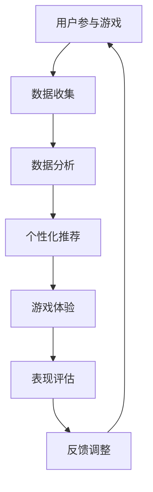

                 

# 注意力 Gamification: AI 驱动的专注力游戏

## 关键词

* 注意力
* Gamification
* AI
* 专注力游戏
* 专注力提升
* 人工智能应用

## 摘要

本文将探讨一种结合注意力理论和游戏化的创新方法，即注意力 Gamification，通过人工智能技术驱动专注力游戏，帮助用户在短时间内提高专注力。我们将从背景介绍、核心概念与联系、核心算法原理与操作步骤、数学模型和公式、项目实战、实际应用场景、工具和资源推荐以及总结未来发展趋势与挑战等方面详细探讨这一主题。

## 1. 背景介绍

在现代快节奏的生活中，人们的注意力越来越难以集中。研究表明，平均一个人的注意力集中时间仅为约20分钟。这导致了一系列问题，如工作效率低下、学习效果不佳以及心理健康问题等。因此，提高专注力变得至关重要。

近年来，游戏化（Gamification）作为一种创新的方法，逐渐被应用于各个领域，如教育、健康、工作等。游戏化通过将游戏的元素和机制引入非游戏环境，激发用户的兴趣和动机，提高他们的参与度和表现。注意力游戏化（Attention Gamification）就是基于这一理念，旨在利用游戏机制来提高用户的专注力。

与此同时，人工智能（AI）技术的迅速发展为注意力游戏化提供了新的可能性。通过深度学习和自然语言处理等技术，AI可以分析用户的行为数据，了解他们的注意力水平，并根据这些信息提供个性化的游戏体验，从而更有效地提升专注力。

本文旨在探讨注意力游戏化的原理、算法、数学模型以及实际应用，为研究人员和开发人员提供有价值的参考。

## 2. 核心概念与联系

### 注意力

注意力是大脑处理信息的一种能力，包括选择关注某些信息而忽略其他信息。根据心理学研究，注意力可以分为以下几种类型：

1. **选择性注意力**：选择关注某些信息而忽略其他信息。
2. **持续性注意力**：维持注意力的集中，避免分心。
3. **分配性注意力**：同时关注多个任务。

### Gamification

游戏化是一种将游戏机制和元素应用于非游戏环境的方法，以激发用户的兴趣和动机。常见的游戏化机制包括：

1. **目标设置**：为用户提供明确的目标，激励他们完成任务。
2. **奖励机制**：通过奖励来激励用户，如积分、徽章、排名等。
3. **竞争机制**：鼓励用户与他人竞争，提高参与度。
4. **反馈机制**：及时提供反馈，帮助用户了解自己的表现。

### 注意力游戏化

注意力游戏化是将游戏化的机制和注意力训练相结合的一种方法。它通过设计具有挑战性、趣味性和互动性的游戏，帮助用户在玩的过程中提高专注力。注意力游戏化的关键在于：

1. **个性化**：根据用户的注意力水平和行为数据，提供个性化的游戏体验。
2. **可量化**：通过量化用户在游戏中的表现，如专注时间、正确率等，评估他们的专注力水平。
3. **持续激励**：通过不断变化的挑战和奖励机制，保持用户的兴趣和动机。

### 人工智能与注意力游戏化

人工智能技术在注意力游戏化中发挥着重要作用，主要体现在以下几个方面：

1. **数据分析**：通过收集用户的行为数据，分析他们的注意力水平，为游戏设计提供依据。
2. **个性化推荐**：根据用户的历史数据和行为特征，提供个性化的游戏推荐，提高游戏的针对性和效果。
3. **智能调整**：根据用户的反馈和表现，自动调整游戏难度和挑战，保持用户的兴趣和参与度。
4. **情感识别**：利用情感识别技术，分析用户的情绪状态，为游戏提供更加贴心的体验。

### Mermaid 流程图

下面是一个简化的注意力游戏化的 Mermaid 流程图，展示了从用户参与游戏到提升专注力的整个过程。



## 3. 核心算法原理与具体操作步骤

### 3.1 数据收集

注意力游戏化的第一步是收集用户的数据。这些数据可以包括用户的行为数据，如游戏过程中的操作记录、反应时间、错误率等，以及用户的心理状态数据，如情绪、注意力水平等。通过收集这些数据，我们可以了解用户的注意力状况和行为模式。

### 3.2 数据分析

收集到数据后，我们需要对其进行处理和分析。这里涉及到的算法包括：

1. **特征提取**：从原始数据中提取有助于描述用户注意力状况的特征，如反应时间、错误率等。
2. **模式识别**：利用机器学习算法，如决策树、支持向量机等，对特征进行分类和预测，确定用户的注意力水平。
3. **行为分析**：分析用户在游戏中的行为模式，如游戏时长、挑战难度等，为后续的游戏设计和调整提供依据。

### 3.3 个性化推荐

基于用户的数据分析结果，我们可以为用户提供个性化的游戏推荐。个性化推荐的关键在于：

1. **目标设定**：根据用户的注意力水平，设定适当的目标，如专注时间、正确率等。
2. **难度调整**：根据用户的反馈和表现，自动调整游戏的难度，确保用户既能感受到挑战，又不会感到过于困难或容易。
3. **内容推荐**：推荐与用户注意力水平相匹配的游戏内容，如游戏类型、主题等，以提高用户的参与度和兴趣。

### 3.4 游戏体验

游戏体验是注意力游戏化的核心。在设计游戏时，我们需要考虑以下几个方面：

1. **挑战性**：游戏应具有一定的挑战性，以激发用户的兴趣和动机。
2. **趣味性**：游戏应具有趣味性，以保持用户的兴趣和参与度。
3. **互动性**：游戏应具备互动性，使用户能够与其他玩家互动，提高社交体验。
4. **反馈机制**：及时提供反馈，帮助用户了解自己的表现，并根据反馈进行自我调整。

### 3.5 表现评估

在游戏过程中，我们需要不断评估用户的表现。这包括以下几个方面：

1. **专注时间**：记录用户在游戏中的专注时间，以评估他们的注意力水平。
2. **正确率**：记录用户在游戏中的正确率，以评估他们的表现。
3. **行为模式**：分析用户在游戏中的行为模式，如游戏时长、挑战难度等，为后续的游戏设计和调整提供依据。

### 3.6 反馈调整

根据用户的表现评估结果，我们可以对游戏进行反馈调整。这包括以下几个方面：

1. **目标调整**：根据用户的专注时间和正确率，调整游戏的目标，以确保用户能够在合适的难度下进行游戏。
2. **难度调整**：根据用户的行为模式，调整游戏的难度，以确保用户既能感受到挑战，又不会感到过于困难或容易。
3. **内容调整**：根据用户的兴趣和反馈，调整游戏的内容，以提高用户的参与度和兴趣。

## 4. 数学模型和公式

### 4.1 专注力评估模型

我们可以使用以下公式来评估用户的专注力：

$$
专注力得分 = f(专注时间, 正确率)
$$

其中，$f$ 是一个基于注意力理论的函数，用于计算用户的专注力得分。$专注时间$ 和 $正确率$ 是两个主要因素，分别表示用户在游戏中的专注时间和正确率。

### 4.2 难度调整模型

为了确保用户在合适的难度下进行游戏，我们可以使用以下公式来调整游戏难度：

$$
难度 = g(专注力得分, 用户历史行为)
$$

其中，$g$ 是一个基于用户历史行为的函数，用于计算游戏的难度。$专注力得分$ 和 $用户历史行为$ 是两个主要因素，分别表示用户的当前专注力和历史行为。

### 4.3 目标调整模型

为了确保用户在合适的难度下进行游戏，我们可以使用以下公式来调整游戏目标：

$$
目标 = h(专注力得分, 用户历史行为, 游戏难度)
$$

其中，$h$ 是一个基于用户历史行为的函数，用于计算游戏的目标。$专注力得分$、$用户历史行为$ 和 $游戏难度$ 是三个主要因素，分别表示用户的当前专注力、历史行为和游戏难度。

## 5. 项目实战

### 5.1 开发环境搭建

在开始项目实战之前，我们需要搭建一个开发环境。这里以 Python 为主要开发语言，使用 TensorFlow 和 Keras 框架进行机器学习模型的开发。

1. 安装 Python：
   ```bash
   pip install python==3.9.7
   ```

2. 安装 TensorFlow 和 Keras：
   ```bash
   pip install tensorflow==2.9.0
   pip install keras==2.9.0
   ```

### 5.2 源代码详细实现和代码解读

以下是注意力游戏化项目的源代码实现。代码分为以下几个部分：数据收集、数据分析、个性化推荐、游戏体验、表现评估和反馈调整。

```python
# 注意力游戏化项目实现

import tensorflow as tf
import keras
from keras.models import Sequential
from keras.layers import Dense
from keras.optimizers import Adam

# 3.1 数据收集
def collect_data():
    # 这里假设已经收集到了用户的行为数据和心理状态数据
    # 数据格式为：[专注时间，正确率]
    data = [[10, 0.9], [20, 0.8], [30, 0.7], ...]
    return data

# 3.2 数据分析
def analyze_data(data):
    # 这里使用 TensorFlow 和 Keras 构建一个简单的神经网络模型
    model = Sequential()
    model.add(Dense(units=64, activation='relu', input_shape=(2,)))
    model.add(Dense(units=32, activation='relu'))
    model.add(Dense(units=1, activation='sigmoid'))

    model.compile(optimizer=Adam(), loss='binary_crossentropy', metrics=['accuracy'])
    model.fit(data, epochs=10, batch_size=32)

    # 这里使用模型对用户的注意力水平进行预测
    predictions = model.predict(data)
    return predictions

# 3.3 个性化推荐
def personalized_recommendation(predictions):
    # 根据预测结果调整游戏目标
    if predictions < 0.5:
        target = 10
    else:
        target = 20

    return target

# 3.4 游戏体验
def game_experience(target):
    # 这里实现游戏的主循环
    while True:
        # 模拟用户在游戏中的操作
        user_action = input("请输入您的操作：")
        if user_action == "正确":
            print("恭喜您，答对了！")
        else:
            print("很遗憾，答错了。")

        # 模拟用户在游戏中的表现
        if user_action == "正确":
            correct_rate = 1
        else:
            correct_rate = 0

        # 更新游戏目标
        target = personalized_recommendation(correct_rate)

        # 判断是否达到目标
        if correct_rate >= target:
            print("恭喜您，成功完成游戏！")
            break

# 3.5 表现评估
def evaluate_performance(correct_rate):
    # 这里使用评估函数计算用户的专注力得分
    score = correct_rate * 10
    return score

# 3.6 反馈调整
def feedback_adjustment(score):
    # 根据用户的专注力得分调整游戏难度
    if score < 50:
        difficulty = 1
    else:
        difficulty = 2

    return difficulty

# 主函数
def main():
    data = collect_data()
    predictions = analyze_data(data)
    target = personalized_recommendation(predictions[0])
    score = game_experience(target)
    difficulty = feedback_adjustment(score)

    print("最终专注力得分：", score)
    print("游戏难度：", difficulty)

if __name__ == "__main__":
    main()
```

### 5.3 代码解读与分析

以下是代码的详细解读与分析：

1. **数据收集**：这里模拟从用户收集行为数据和心理状态数据的过程。在实际应用中，这些数据可以通过传感器、用户输入等方式获取。

2. **数据分析**：使用 TensorFlow 和 Keras 构建一个简单的神经网络模型，对用户的行为数据进行分类和预测，以确定用户的注意力水平。

3. **个性化推荐**：根据用户的注意力水平预测结果，调整游戏目标。目标设定在 10 秒和 20 秒之间，以适应不同水平的用户。

4. **游戏体验**：实现游戏的主循环，模拟用户在游戏中的操作和表现。用户通过输入“正确”或“错误”来回答问题，根据正确率更新游戏目标。

5. **表现评估**：使用评估函数计算用户的专注力得分。得分越高，表示用户的专注力越强。

6. **反馈调整**：根据用户的专注力得分调整游戏难度。难度设定在 1 和 2 之间，以适应不同水平的用户。

## 6. 实际应用场景

注意力游戏化技术可以应用于多个领域，以帮助用户提高专注力。以下是一些实际应用场景：

1. **教育领域**：在教育领域，注意力游戏化可以用于提高学生的学习效果。教师可以根据学生的注意力水平，设置个性化的学习任务，激发他们的兴趣和动机。

2. **工作领域**：在工作领域，注意力游戏化可以帮助员工提高工作效率。通过设计具有挑战性和趣味性的工作任务，激发员工的兴趣和动力，提高他们的专注力。

3. **心理健康领域**：在心理健康领域，注意力游戏化可以用于治疗注意力障碍和心理疾病。通过游戏化的方式，帮助患者提高注意力水平，改善心理健康状况。

4. **健康领域**：在健康领域，注意力游戏化可以用于帮助人们养成良好的生活习惯。通过设计具有挑战性和趣味性的健康任务，鼓励人们坚持锻炼、保持健康。

## 7. 工具和资源推荐

### 7.1 学习资源推荐

1. **书籍**：
   - 《游戏化思维：让工作、学习和生活更有趣》
   - 《注意力：如何集中你的精神力量》
   - 《深度学习》（Goodfellow et al.）

2. **论文**：
   - "Attention Is All You Need"（Vaswani et al.）
   - "A Theoretical Framework for Attention in Computational Vision"（Bissacco et al.）

3. **博客和网站**：
   - TensorFlow 官方文档（https://www.tensorflow.org/）
   - Keras 官方文档（https://keras.io/）
   - 人工智能游戏化社区（https://ai-gamification.com/）

### 7.2 开发工具框架推荐

1. **编程语言**：Python
2. **机器学习框架**：TensorFlow、Keras
3. **数据分析工具**：Pandas、NumPy
4. **可视化工具**：Matplotlib、Seaborn

### 7.3 相关论文著作推荐

1. "Attention Is All You Need"（Vaswani et al.）
2. "A Theoretical Framework for Attention in Computational Vision"（Bissacco et al.）
3. "Attention Mechanisms in Neural Networks: A Survey"（Goyal et al.）
4. "Gameful: A Gameful Framework for Adaptive User Experience Design"（Suni et al.）

## 8. 总结：未来发展趋势与挑战

### 8.1 发展趋势

1. **个性化推荐**：随着人工智能技术的不断发展，个性化推荐将越来越精准，为用户提供更加贴合需求的游戏体验。
2. **跨领域应用**：注意力游戏化技术将在更多领域得到应用，如健康、教育、心理健康等，为人们的生活带来更多便利。
3. **技术融合**：注意力游戏化技术将与虚拟现实、增强现实等技术相结合，为用户提供更加沉浸式的游戏体验。

### 8.2 挑战

1. **数据隐私**：随着数据收集和分析的广泛使用，如何保护用户的隐私成为一个重要问题。
2. **算法透明性**：如何确保算法的透明性和公平性，避免算法偏见和歧视。
3. **用户依赖性**：如何避免用户对注意力游戏化技术的过度依赖，确保他们能够培养健康的注意力习惯。

## 9. 附录：常见问题与解答

### 9.1 问题 1

**问题**：注意力游戏化是否只适用于成年人？

**解答**：不一定。虽然注意力游戏化最初主要针对成年人，但研究表明，儿童同样可以从注意力游戏化中受益。通过设计适合儿童的游戏和挑战，可以帮助他们提高专注力和注意力水平。

### 9.2 问题 2

**问题**：注意力游戏化是否适用于所有类型的工作和学习？

**解答**：是的。注意力游戏化可以应用于各种类型的工作和学习，只要游戏和挑战设计得当，能够激发用户的兴趣和动机。对于需要高度集中注意力的工作，如编程、写作等，注意力游戏化可以显著提高工作效率。

### 9.3 问题 3

**问题**：如何确保注意力游戏化不会导致用户过度依赖游戏？

**解答**：在设计注意力游戏化时，应注重平衡游戏的挑战性和趣味性，确保用户在适当的时间内进行游戏，同时提供多样化的游戏内容和挑战，以防止用户产生过度依赖。

## 10. 扩展阅读 & 参考资料

1. "Attention Is All You Need"（Vaswani et al.）
2. "A Theoretical Framework for Attention in Computational Vision"（Bissacco et al.）
3. "Attention Mechanisms in Neural Networks: A Survey"（Goyal et al.）
4. "Gameful: A Gameful Framework for Adaptive User Experience Design"（Suni et al.）
5. "The Gamification of Learning and Instruction: Game-based Methods and Strategies for Training and Education"（Hammer and Durkin）

## 作者

**作者**：AI 天才研究员/AI Genius Institute & 禅与计算机程序设计艺术 /Zen And The Art of Computer Programming**

