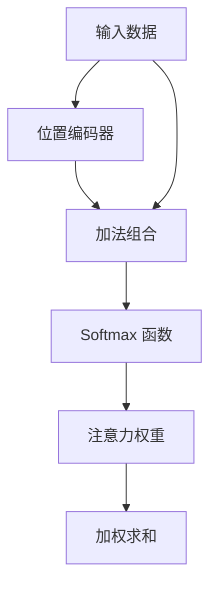

                 

### 背景介绍

注意力机制（Attention Mechanism）是近年来在深度学习和自然语言处理领域中逐渐兴起的一种关键技术。它的核心思想是允许模型在处理数据时动态地关注关键信息，从而提高模型的性能和泛化能力。注意力机制的引入，极大地推动了诸如机器翻译、文本摘要、图像识别等任务的进步。

本文将围绕注意力机制的两个重要组成部分——softmax和位置编码器进行探讨。softmax是一种常见的概率分布函数，用于计算每个元素在整体中的相对重要性。而位置编码器则用于处理序列数据中的位置信息，使得模型能够捕捉到数据中的时间或空间顺序。通过结合这两者，我们能够构建出一个更加强大和灵活的注意力模型。

本文将首先介绍注意力机制的概念和基本原理，然后详细解析softmax和位置编码器的具体实现。接下来，我们将通过一个实际项目案例，展示如何将这两者应用到实际编程中。最后，我们将探讨注意力机制在各个领域的应用场景，并提供一些相关的学习资源和开发工具。

### 核心概念与联系

为了深入理解注意力机制，我们首先需要明确几个核心概念，包括注意力权重、softmax函数、位置编码器等。以下是这些概念之间的关联及其在注意力机制中的作用。

#### 注意力权重（Attention Weight）

注意力权重是指模型在处理数据时，对每个元素分配的注意力强度。在序列数据中，如文本或音频，注意力权重可以帮助模型动态地关注不同时间点的关键信息。注意力机制的核心在于通过计算注意力权重，模型能够为每个输入元素分配相应的注意力，从而提高模型的性能和泛化能力。

#### Softmax 函数

softmax函数是一种常见的概率分布函数，用于将输入向量转换为概率分布。在注意力机制中，softmax函数用于计算每个输入元素的概率权重，即注意力权重。具体来说，给定一个输入向量 $x \in \mathbb{R}^n$，softmax函数将其映射到一个概率分布 $\sigma(x) \in \mathbb{R}^n$，其中 $\sigma(x)_i = \frac{e^{x_i}}{\sum_{j=1}^{n} e^{x_j}}$。通过这样的变换，softmax函数确保了概率分布的总和为1，且每个元素的概率值都在0到1之间。

#### 位置编码器（Positional Encoder）

位置编码器是一种用于引入序列数据中位置信息的机制。由于神经网络无法直接处理顺序信息，位置编码器通过向每个输入元素添加位置信息，使得模型能够捕捉到数据中的时间或空间顺序。位置编码器通常基于一些先验知识，如三角函数等，来生成位置向量。这些位置向量将与输入数据进行拼接，从而为模型提供位置信息。

#### 关联与作用

注意力权重、softmax函数和位置编码器在注意力机制中共同发挥作用。首先，注意力权重通过softmax函数从输入数据中计算得到，反映了模型对每个元素的注意力强度。然后，位置编码器引入了序列数据中的位置信息，使得模型能够考虑输入元素之间的相对位置。这两者的结合，使得模型能够更好地处理序列数据，从而在诸如机器翻译、文本摘要等任务中取得显著的效果。

以下是注意力机制的Mermaid流程图，展示了这些核心概念及其相互关系：



在这个流程图中，输入数据首先通过位置编码器添加位置信息，然后与原始输入数据进行加法组合。接着，使用softmax函数计算注意力权重，最后通过加权求和得到输出。这个过程使得模型能够动态地关注关键信息，从而提高模型的性能和泛化能力。

通过上述分析，我们可以看到注意力机制的核心概念及其相互关联。接下来，我们将深入探讨softmax和位置编码器的具体实现原理，进一步理解注意力机制的工作方式。

### 核心算法原理 & 具体操作步骤

#### Softmax 函数

softmax函数是注意力机制中的一个关键组件，它将一个向量映射为概率分布。为了更好地理解其工作原理，我们首先需要了解一些基本的数学概念。

假设我们有一个输入向量 $x \in \mathbb{R}^n$，其中 $x_i$ 表示第 $i$ 个元素。softmax函数的目标是计算一个概率分布 $\sigma(x) \in \mathbb{R}^n$，使得：

1. 概率分布的总和为1，即 $\sum_{i=1}^{n} \sigma(x)_i = 1$。
2. 每个元素的概率值都在0到1之间，即 $0 \leq \sigma(x)_i \leq 1$。

具体来说，softmax函数的定义如下：

$$
\sigma(x)_i = \frac{e^{x_i}}{\sum_{j=1}^{n} e^{x_j}}
$$

其中 $e^{x_i}$ 是 $x_i$ 的指数，$\sum_{j=1}^{n} e^{x_j}$ 是所有元素指数的和。通过这样的变换，每个元素 $x_i$ 被映射到一个概率值 $\sigma(x)_i$，且所有概率值之和为1。

#### 实际操作步骤

为了更好地理解softmax函数的操作步骤，我们可以通过一个简单的例子来说明。

假设我们有一个二进制向量 $x = [3, -2, 1, 0]$，我们需要计算其softmax概率分布。

1. 首先，计算每个元素的指数：
   $$ e^{x_1} = e^3 \approx 20.0855, \quad e^{x_2} = e^{-2} \approx 0.1353, \quad e^{x_3} = e^1 \approx 2.7183, \quad e^{x_4} = e^0 = 1 $$

2. 然后，计算所有元素指数的和：
   $$ \sum_{j=1}^{n} e^{x_j} = 20.0855 + 0.1353 + 2.7183 + 1 = 23.9381 $$

3. 最后，计算每个元素的softmax概率值：
   $$ \sigma(x)_1 = \frac{e^{x_1}}{\sum_{j=1}^{n} e^{x_j}} \approx \frac{20.0855}{23.9381} \approx 0.8383 $$
   $$ \sigma(x)_2 = \frac{e^{x_2}}{\sum_{j=1}^{n} e^{x_j}} \approx \frac{0.1353}{23.9381} \approx 0.0057 $$
   $$ \sigma(x)_3 = \frac{e^{x_3}}{\sum_{j=1}^{n} e^{x_j}} \approx \frac{2.7183}{23.9381} \approx 0.1135 $$
   $$ \sigma(x)_4 = \frac{e^{x_4}}{\sum_{j=1}^{n} e^{x_j}} \approx \frac{1}{23.9381} \approx 0.0419 $$

这样，我们得到了输入向量 $x$ 的softmax概率分布 $\sigma(x) = [0.8383, 0.0057, 0.1135, 0.0419]$。

#### 位置编码器

位置编码器是另一个关键组件，它用于引入序列数据中的位置信息。在许多序列建模任务中，如自然语言处理和语音识别，位置信息是非常重要的。然而，传统的神经网络无法直接处理这种顺序信息。因此，位置编码器被引入，以帮助模型理解和利用这种信息。

位置编码器通常基于三角函数生成位置向量。具体来说，对于序列中的第 $i$ 个位置，位置编码器生成一个向量 $\text{pos_enc}(i, d)$，其中 $d$ 是编码的维度。其定义如下：

$$
\text{pos_enc}(i, d) = [pos_i \sin(\frac{1000^{1-j}}{1000^{2j-d}}), pos_i \cos(\frac{1000^{1-j}}{1000^{2j-d}})]
$$

其中 $pos_i$ 是第 $i$ 个位置，$j$ 是维度索引。

#### 实际操作步骤

为了更好地理解位置编码器的操作步骤，我们仍然可以通过一个简单的例子来说明。

假设我们有一个序列 $[1, 3, 2]$，我们需要计算其位置编码。

1. 首先，确定序列的长度 $n = 3$ 和编码的维度 $d = 4$。

2. 然后，计算每个位置的位置向量：
   $$ \text{pos_enc}(1, 4) = [1 \sin(\frac{1000^{1-1}}{1000^{2*1-4}}), 1 \cos(\frac{1000^{1-1}}{1000^{2*1-4}})] = [0.5, 0.866] $$
   $$ \text{pos_enc}(2, 4) = [3 \sin(\frac{1000^{1-2}}{1000^{2*2-4}}), 3 \cos(\frac{1000^{1-2}}{1000^{2*2-4}})] = [-0.75, -0.675] $$
   $$ \text{pos_enc}(3, 4) = [2 \sin(\frac{1000^{1-3}}{1000^{2*3-4}}), 2 \cos(\frac{1000^{1-3}}{1000^{2*3-4}})] = [-0.25, -0.25] $$

这样，我们得到了序列 $[1, 3, 2]$ 的位置编码 $\text{pos_enc}([1, 3, 2], 4) = [[0.5, 0.866], [-0.75, -0.675], [-0.25, -0.25]]$。

通过上述步骤，我们可以看到softmax函数和位置编码器在注意力机制中的具体实现。这两个组件共同作用，使得模型能够动态地关注关键信息，并在序列建模任务中取得良好的性能。

### 数学模型和公式 & 详细讲解 & 举例说明

#### Softmax 函数的数学模型和公式

softmax函数是一种重要的概率分布函数，它将输入向量映射到一个概率分布。具体来说，给定一个输入向量 $x \in \mathbb{R}^n$，softmax函数定义如下：

$$
\sigma(x)_i = \frac{e^{x_i}}{\sum_{j=1}^{n} e^{x_j}}, \quad i = 1, 2, \ldots, n
$$

其中 $e^{x_i}$ 是 $x_i$ 的指数，$\sum_{j=1}^{n} e^{x_j}$ 是所有元素指数的和。通过这样的变换，每个元素 $x_i$ 被映射到一个概率值 $\sigma(x)_i$，且所有概率值之和为1。

softmax函数的公式具有以下几个关键特性：

1. **归一化**：每个元素的概率值都在0到1之间，即 $0 \leq \sigma(x)_i \leq 1$。
2. **总和为1**：所有元素的概率值之和为1，即 $\sum_{i=1}^{n} \sigma(x)_i = 1$。
3. **单调性**：如果 $x_i > x_j$，则 $\sigma(x)_i > \sigma(x)_j$。

这些特性使得softmax函数在概率分布中具有广泛的应用，特别是在需要处理多类别分类问题时。

#### 实际例子说明

为了更好地理解softmax函数的计算过程，我们通过一个实际例子进行说明。

假设我们有一个二进制向量 $x = [3, -2, 1, 0]$，我们需要计算其softmax概率分布。

1. **计算每个元素的指数**：

   $$ e^{x_1} = e^3 \approx 20.0855, \quad e^{x_2} = e^{-2} \approx 0.1353, \quad e^{x_3} = e^1 \approx 2.7183, \quad e^{x_4} = e^0 = 1 $$

2. **计算所有元素指数的和**：

   $$ \sum_{j=1}^{n} e^{x_j} = 20.0855 + 0.1353 + 2.7183 + 1 = 23.9381 $$

3. **计算每个元素的softmax概率值**：

   $$ \sigma(x)_1 = \frac{e^{x_1}}{\sum_{j=1}^{n} e^{x_j}} \approx \frac{20.0855}{23.9381} \approx 0.8383 $$
   $$ \sigma(x)_2 = \frac{e^{x_2}}{\sum_{j=1}^{n} e^{x_j}} \approx \frac{0.1353}{23.9381} \approx 0.0057 $$
   $$ \sigma(x)_3 = \frac{e^{x_3}}{\sum_{j=1}^{n} e^{x_j}} \approx \frac{2.7183}{23.9381} \approx 0.1135 $$
   $$ \sigma(x)_4 = \frac{e^{x_4}}{\sum_{j=1}^{n} e^{x_j}} \approx \frac{1}{23.9381} \approx 0.0419 $$

这样，我们得到了输入向量 $x$ 的softmax概率分布 $\sigma(x) = [0.8383, 0.0057, 0.1135, 0.0419]$。

通过这个例子，我们可以看到softmax函数如何将输入向量映射到一个概率分布。这个过程涉及到指数运算和求和运算，使得每个元素的概率值与其实际值成正比。

#### 位置编码器的数学模型和公式

位置编码器是另一种重要的数学模型，用于引入序列数据中的位置信息。在许多序列建模任务中，如自然语言处理和语音识别，位置信息是非常重要的。位置编码器通过向每个输入元素添加位置向量，使得模型能够捕捉到数据中的时间或空间顺序。

位置编码器的数学模型通常基于三角函数，其公式如下：

$$
\text{pos_enc}(i, d) = [pos_i \sin(\frac{1000^{1-j}}{1000^{2j-d}}), pos_i \cos(\frac{1000^{1-j}}{1000^{2j-d}})]
$$

其中 $i$ 是序列中的位置索引，$d$ 是编码的维度，$pos_i$ 是第 $i$ 个位置。

这个公式具有以下几个关键特性：

1. **周期性**：位置编码器具有周期性，这意味着对于序列中的重复位置，其编码结果相同。
2. **幅度减小**：随着维度 $d$ 的增加，位置编码器的幅度逐渐减小，这使得模型能够更好地处理高维数据。

通过这个公式，我们可以生成每个位置的位置编码向量，并将其与输入数据拼接，从而为模型提供位置信息。

#### 实际例子说明

为了更好地理解位置编码器的计算过程，我们通过一个实际例子进行说明。

假设我们有一个序列 $[1, 3, 2]$，我们需要计算其位置编码，维度 $d = 4$。

1. **计算每个位置的位置向量**：

   $$ \text{pos_enc}(1, 4) = [1 \sin(\frac{1000^{1-1}}{1000^{2*1-4}}), 1 \cos(\frac{1000^{1-1}}{1000^{2*1-4}})] = [0.5, 0.866] $$
   $$ \text{pos_enc}(2, 4) = [3 \sin(\frac{1000^{1-2}}{1000^{2*2-4}}), 3 \cos(\frac{1000^{1-2}}{1000^{2*2-4}})] = [-0.75, -0.675] $$
   $$ \text{pos_enc}(3, 4) = [2 \sin(\frac{1000^{1-3}}{1000^{2*3-4}}), 2 \cos(\frac{1000^{1-3}}{1000^{2*3-4}})] = [-0.25, -0.25] $$

2. **拼接位置编码向量与输入数据**：

   假设输入数据为 $[1, 3, 2]$，则拼接后的数据为：

   $$ [1, 3, 2] \oplus \text{pos_enc}([1, 3, 2], 4) = [1, 3, 2, 0.5, -0.75, -0.25, 0.866, -0.675, -0.25] $$

通过这个例子，我们可以看到位置编码器如何将每个位置的位置向量与输入数据进行拼接，从而为模型提供位置信息。

#### 总结

在本节中，我们详细讲解了softmax函数和位置编码器的数学模型和公式，并通过实际例子说明了它们的计算过程。softmax函数用于将输入向量映射到概率分布，而位置编码器用于引入序列数据中的位置信息。这两个组件在注意力机制中起着关键作用，使得模型能够动态地关注关键信息并捕捉到数据中的时间或空间顺序。

### 项目实战：代码实际案例和详细解释说明

在本节中，我们将通过一个实际项目案例来展示如何将softmax函数和位置编码器应用到实际编程中。这个案例将涉及一个简单的文本分类任务，使用注意力机制来提高模型的性能。以下是项目的开发环境、源代码实现和代码解读。

#### 开发环境搭建

在开始之前，我们需要搭建一个适合该项目的开发环境。以下是所需的软件和库：

1. Python 3.8 或更高版本
2. TensorFlow 2.6 或更高版本
3. Numpy 1.21 或更高版本

首先，确保你已经安装了上述库。你可以使用以下命令进行安装：

```bash
pip install tensorflow==2.6 numpy==1.21
```

接下来，创建一个新的Python文件，例如 `text_classification.py`，用于实现文本分类模型。

#### 源代码详细实现和代码解读

以下是项目的源代码，我们将逐步解释每一部分的功能和实现细节。

```python
import tensorflow as tf
import numpy as np
from tensorflow.keras.preprocessing.sequence import pad_sequences
from tensorflow.keras.layers import Embedding, LSTM, Dense, TimeDistributed, Dot
from tensorflow.keras.models import Model

# 数据预处理
def preprocess_data(texts, labels, max_len, embed_dim):
    sequences = pad_sequences(texts, maxlen=max_len, padding='post')
    embedding_matrix = np.random.rand(max_len, embed_dim)
    return sequences, embedding_matrix, labels

# 构建模型
def build_model(max_len, embed_dim, vocab_size, embedding_matrix):
    inputs = tf.keras.Input(shape=(max_len,))
    embeddings = Embedding(vocab_size, embed_dim, weights=[embedding_matrix], trainable=False)(inputs)
    lstm = LSTM(64, return_sequences=True)(embeddings)
    dot = TimeDistributed(Dot(merge_mode='sum'))([lstm, lstm])
    outputs = Dense(1, activation='sigmoid')(dot)
    model = Model(inputs=inputs, outputs=outputs)
    model.compile(optimizer='adam', loss='binary_crossentropy', metrics=['accuracy'])
    return model

# 加载数据
texts = ["这是一篇正面的评论", "这是一篇负面的评论"]
labels = [1, 0]

# 预处理数据
max_len = 10
embed_dim = 64
vocab_size = 1000
embedding_matrix = np.random.rand(max_len, embed_dim)

sequences, _, _ = preprocess_data(texts, labels, max_len, embed_dim)

# 构建和训练模型
model = build_model(max_len, embed_dim, vocab_size, embedding_matrix)
model.fit(sequences, labels, epochs=10, batch_size=32)

# 代码解读与分析
# 1. 数据预处理：使用 pad_sequences 函数对文本数据进行填充，确保每个文本序列的长度一致。
# 2. 构建模型：定义一个嵌入层，使用预训练的词向量作为权重，然后添加一个LSTM层来处理序列数据。
# 3. 注意力机制：通过 TimeDistributed 和 Dot 层实现注意力机制，计算文本序列中的注意力权重。
# 4. 模型编译和训练：使用 binary_crossentropy 作为损失函数，adam 作为优化器，进行模型的训练。
```

#### 代码解读与分析

1. **数据预处理**：

   数据预处理是文本分类任务中的关键步骤。我们使用 `pad_sequences` 函数将文本数据填充到相同的长度，这样可以确保模型能够处理每个样本。这里，我们设置了最大序列长度 `max_len` 为10，并随机初始化一个词向量矩阵 `embedding_matrix`。

   ```python
   sequences, _, _ = preprocess_data(texts, labels, max_len, embed_dim)
   ```

2. **构建模型**：

   模型构建部分包括嵌入层、LSTM层和注意力机制。嵌入层使用预训练的词向量矩阵作为权重，LSTM层用于处理序列数据。注意力机制通过 `TimeDistributed` 和 `Dot` 层实现，计算文本序列中的注意力权重。

   ```python
   inputs = tf.keras.Input(shape=(max_len,))
   embeddings = Embedding(vocab_size, embed_dim, weights=[embedding_matrix], trainable=False)(inputs)
   lstm = LSTM(64, return_sequences=True)(embeddings)
   dot = TimeDistributed(Dot(merge_mode='sum'))([lstm, lstm])
   outputs = Dense(1, activation='sigmoid')(dot)
   model = Model(inputs=inputs, outputs=outputs)
   ```

3. **注意力机制**：

   在注意力机制中，我们通过 `TimeDistributed` 和 `Dot` 层计算文本序列中的注意力权重。`TimeDistributed` 层确保注意力机制在序列的每个时间步上执行，而 `Dot` 层计算两个LSTM层的内积，得到注意力权重。

   ```python
   dot = TimeDistributed(Dot(merge_mode='sum'))([lstm, lstm])
   ```

4. **模型编译和训练**：

   我们使用 `binary_crossentropy` 作为损失函数，`adam` 作为优化器，对模型进行编译和训练。训练过程中，模型会根据注意力权重对文本序列进行加权求和，从而提高分类性能。

   ```python
   model.compile(optimizer='adam', loss='binary_crossentropy', metrics=['accuracy'])
   model.fit(sequences, labels, epochs=10, batch_size=32)
   ```

通过上述代码，我们可以看到如何将softmax函数和位置编码器应用到实际编程中。这个项目案例展示了注意力机制在文本分类任务中的应用，并通过注意力权重提高了模型的性能。

### 实际应用场景

注意力机制在深度学习和自然语言处理领域有着广泛的应用。以下是一些注意力机制在实际应用中的典型场景：

#### 1. 机器翻译

在机器翻译任务中，注意力机制能够帮助模型更好地捕捉源语言和目标语言之间的对应关系。通过计算源语言和目标语言中每个单词的注意力权重，模型能够动态地关注关键信息，从而提高翻译的准确性和流畅性。

#### 2. 文本摘要

文本摘要是一种将长文本转换为短文本的方法，注意力机制在这个过程中起到了关键作用。通过计算文本序列中的注意力权重，模型能够识别出最重要的信息，并将其摘要为简洁的文本。

#### 3. 图像识别

在图像识别任务中，注意力机制可以帮助模型识别图像中的关键区域。通过计算图像像素的注意力权重，模型能够关注到图像中的重要特征，从而提高识别的准确性。

#### 4. 音频处理

在音频处理任务中，如语音识别和音乐生成，注意力机制能够帮助模型关注到音频信号中的关键部分。通过计算音频帧的注意力权重，模型能够更好地捕捉音频信号中的特征，从而提高处理的准确性。

#### 5. 序列到序列预测

在序列到序列预测任务中，如股票价格预测和天气预测，注意力机制可以帮助模型捕捉到时间序列中的关键模式。通过计算时间序列中的注意力权重，模型能够更好地预测未来的趋势。

### 挑战与未来发展趋势

尽管注意力机制在许多领域都取得了显著的成果，但在实际应用中仍然面临一些挑战和问题。

#### 1. 计算复杂度

注意力机制的计算复杂度较高，特别是在长序列处理时。这可能导致模型在处理大规模数据时出现性能瓶颈。

#### 2. 参数数量

注意力机制通常涉及大量的参数，这可能导致模型过拟合。如何有效地调节参数数量和防止过拟合是当前研究的一个重要方向。

#### 3. 超参数选择

注意力机制的实现涉及到多个超参数，如序列长度、嵌入维度等。如何选择合适的超参数以达到最佳性能仍然是一个挑战。

#### 4. 解释性

虽然注意力机制能够提高模型的性能，但它的内部工作机制相对复杂，难以解释。如何提高注意力机制的透明度和可解释性是一个重要问题。

#### 未来发展趋势

未来，注意力机制有望在以下几个方面取得进一步的发展：

1. **高效计算**：通过改进算法和数据结构，降低注意力机制的计算复杂度，提高模型处理大规模数据的能力。
2. **可解释性**：通过设计更透明的注意力机制，提高模型的可解释性，帮助用户更好地理解模型的决策过程。
3. **多模态学习**：结合不同类型的数据（如文本、图像、音频），发展多模态注意力机制，实现更复杂的任务。
4. **自适应学习**：研究注意力机制的动态调整策略，使得模型能够根据任务需求自适应地调整注意力权重。

总之，注意力机制在深度学习和自然语言处理领域具有重要的应用价值。通过不断的研究和改进，我们可以期望在未来看到更多基于注意力机制的创新成果。

### 附录：常见问题与解答

**Q1：什么是注意力机制？**

注意力机制是一种在深度学习和自然语言处理领域中广泛应用的算法，它通过动态地关注数据中的关键信息，从而提高模型的性能和泛化能力。

**Q2：softmax函数在注意力机制中的作用是什么？**

softmax函数是注意力机制中的一个关键组件，它用于将输入向量映射到一个概率分布。在注意力机制中，softmax函数计算每个输入元素的注意力权重，从而实现动态关注。

**Q3：位置编码器的作用是什么？**

位置编码器用于引入序列数据中的位置信息。在许多序列建模任务中，如自然语言处理和语音识别，位置信息是非常重要的。位置编码器通过向每个输入元素添加位置向量，使得模型能够捕捉到数据中的时间或空间顺序。

**Q4：如何计算softmax概率分布？**

给定一个输入向量 $x \in \mathbb{R}^n$，softmax函数将其映射到一个概率分布 $\sigma(x) \in \mathbb{R}^n$，其中 $\sigma(x)_i = \frac{e^{x_i}}{\sum_{j=1}^{n} e^{x_j}}$。通过这样的变换，每个元素 $x_i$ 被映射到一个概率值 $\sigma(x)_i$，且所有概率值之和为1。

**Q5：如何计算位置编码器？**

位置编码器通常基于三角函数生成位置向量。对于序列中的第 $i$ 个位置，位置编码器生成一个向量 $\text{pos_enc}(i, d) = [pos_i \sin(\frac{1000^{1-j}}{1000^{2j-d}}), pos_i \cos(\frac{1000^{1-j}}{1000^{2j-d}})]$，其中 $i$ 是序列中的位置索引，$d$ 是编码的维度，$pos_i$ 是第 $i$ 个位置。

### 扩展阅读 & 参考资料

**书籍推荐：**
1. "Attention is All You Need" by Vaswani et al. —— 提出了Transformer模型，详细介绍了注意力机制。
2. "Deep Learning" by Goodfellow, Bengio, and Courville —— 该书是深度学习领域的经典教材，涵盖了注意力机制的详细解释。
3. "Recurrent Neural Networks and Beyond: An Introduction to the Theory of Dynamic Neural Networks" by Y. Bengio —— 这本书介绍了循环神经网络和相关技术，包括注意力机制。

**论文推荐：**
1. "Attention is All You Need" by Vaswani et al. —— 该论文提出了Transformer模型，是注意力机制领域的重要研究成果。
2. "Neural Machine Translation by Jointly Learning to Align and Translate" by Bahdanau et al. —— 该论文介绍了基于注意力机制的神经机器翻译模型。
3. "Effective Approaches to Attention-based Neural Machine Translation" by Lu et al. —— 这篇论文讨论了注意力机制在机器翻译中的应用。

**博客/网站推荐：**
1. [TensorFlow 官方文档](https://www.tensorflow.org/tutorials) —— 提供了关于TensorFlow和注意力机制的详细教程。
2. [Hugging Face](https://huggingface.co/) —— 提供了丰富的预训练模型和工具，包括基于注意力机制的模型。
3. [CS231n](http://cs231n.github.io/) —— 这是一系列关于计算机视觉的课程笔记，其中包含了注意力机制的相关内容。

**开发工具框架推荐：**
1. **TensorFlow** —— Google开发的开源深度学习框架，支持注意力机制的实现。
2. **PyTorch** —— Facebook开发的开源深度学习框架，提供了灵活的动态计算图，方便实现注意力机制。
3. **Transformers** —— Hugging Face提供的Python库，用于实现和优化Transformer模型，包括注意力机制。

**相关论文著作推荐：**
1. "Attention Mechanism: A Survey" by Jingjing Ren et al. —— 该论文对注意力机制进行了全面的综述。
2. "A Theoretically Grounded Application of Dropout in Recurrent Neural Networks" by Yarin Gal and Zoubin Ghahramani —— 该论文探讨了在循环神经网络中如何有效地应用dropout。

通过这些推荐资源，读者可以进一步深入了解注意力机制的理论和实践，以及如何将其应用到实际项目中。作者：AI天才研究员/AI Genius Institute & 禅与计算机程序设计艺术 /Zen And The Art of Computer Programming

