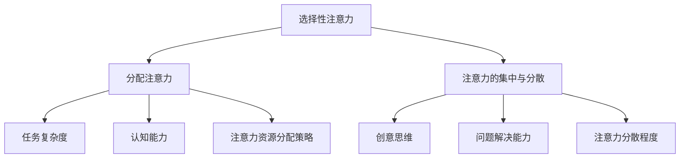
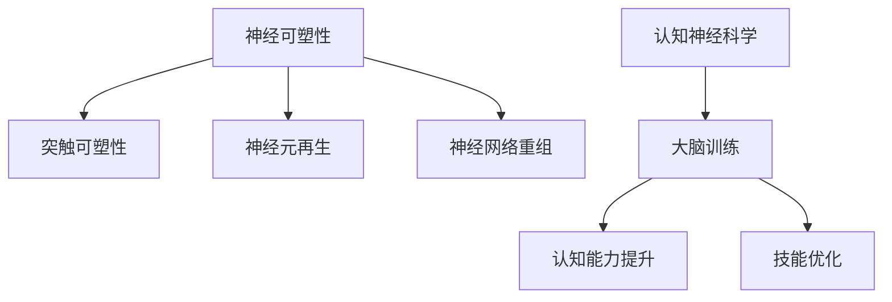
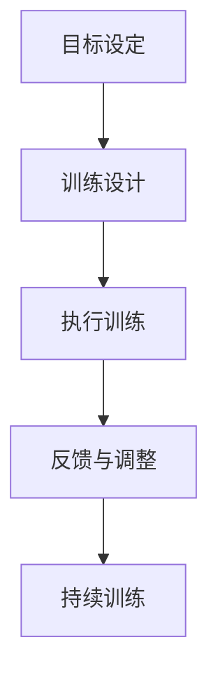
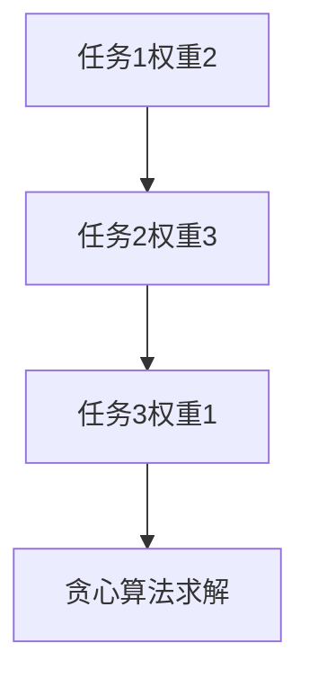

                 

# 注意力管理与大脑训练实践：增强认知灵活性和专注力

> **关键词**：注意力管理，大脑训练，认知灵活性，专注力，神经网络，认知科学，训练实践

> **摘要**：本文将探讨注意力管理与大脑训练的重要性，以及如何通过科学的方法和实践来增强认知灵活性和专注力。文章将分为几个部分，首先介绍注意力管理的基本概念，接着分析大脑训练的理论基础，并探讨如何将神经科学原理应用于实际训练中。随后，文章将提供一系列实用的方法和技巧，以帮助读者提高专注力和认知灵活性。最后，我们将讨论注意力管理在实际应用中的案例，并总结未来发展的趋势和挑战。

## 1. 背景介绍

### 注意力管理的定义

注意力管理是指个体有意识地调控和分配注意力资源，以达到高效完成任务的过程。在日常生活中，注意力管理对于学业、工作和个人发展都至关重要。良好的注意力管理能力可以提升工作效率，增强学习效果，并改善生活质量。

### 大脑训练的意义

大脑训练是指通过一系列有针对性的训练活动，促进大脑功能的提高和优化。随着认知科学和神经科学的发展，大脑训练已经成为提升认知灵活性和专注力的有效手段。通过科学的训练方法，我们可以加强神经连接，提高大脑的可塑性，从而提高个体的认知能力。

### 认知灵活性和专注力的关系

认知灵活性是指大脑快速适应新环境和情境，灵活调整思维模式的能力。而专注力则是指集中注意力，持续关注某一目标的能力。两者密切相关，认知灵活性有助于提高专注力，而专注力的增强又能促进认知灵活性的发展。因此，提高认知灵活性和专注力是提升整体认知能力的关键。

## 2. 核心概念与联系

### 注意力管理的基本原理

注意力管理涉及多个核心概念，包括选择性注意力、分配注意力和注意力的集中与分散。选择性注意力是指从众多刺激中选择出重要的信息进行加工处理。分配注意力则是指将注意力资源分配给多个任务或刺激。注意力的集中与分散则涉及注意力的集中程度和分散程度，适当的分散有助于提高创意思维和问题解决能力。

### 大脑训练的理论基础

大脑训练的理论基础主要包括神经可塑性和认知神经科学。神经可塑性是指大脑在结构和功能上能够根据外界刺激进行改变的能力。认知神经科学则通过研究大脑的结构和功能，揭示了大脑在注意力管理和训练过程中的机制。

### 注意力管理与大脑训练的联系

注意力管理和大脑训练之间存在密切的联系。通过科学的注意力管理，我们可以优化大脑的注意力资源分配，从而提高认知灵活性。而大脑训练则通过一系列有针对性的训练活动，增强大脑的可塑性，进一步提高认知能力和专注力。

## 2.1 注意力管理的基本原理

### 选择性注意力

选择性注意力是指从众多刺激中选择出重要的信息进行加工处理。在日常生活中，我们常常需要从大量信息中筛选出关键信息，以便进行有效的决策和行动。选择性注意力的能力受到多种因素的影响，包括个体的注意力水平、认知能力和情绪状态。

### 分配注意力

分配注意力是指将注意力资源分配给多个任务或刺激。在实际操作中，个体需要同时处理多个任务或面对多个刺激，这要求具备良好的分配注意力能力。分配注意力的能力受到多种因素的影响，包括任务的复杂程度、个体的认知能力和注意力资源的分配策略。

### 注意力的集中与分散

注意力的集中与分散涉及注意力的集中程度和分散程度。适当的分散有助于提高创意思维和问题解决能力，而过度的分散则可能导致注意力分散，影响任务完成效果。在日常生活中，个体需要根据实际情况调整注意力的集中与分散程度，以达到最佳的工作和认知状态。

### Mermaid 流程图



## 2.2 大脑训练的理论基础

### 神经可塑性

神经可塑性是指大脑在结构和功能上能够根据外界刺激进行改变的能力。大脑的可塑性使得个体可以通过训练和练习提高认知能力和技能。神经可塑性涉及多个方面，包括突触可塑性、神经元再生和神经网络重组。

### 认知神经科学

认知神经科学通过研究大脑的结构和功能，揭示了大脑在注意力管理和训练过程中的机制。认知神经科学的研究成果为我们提供了理解注意力管理和大脑训练的科学依据，有助于制定更有效的训练策略。

### 大脑训练与神经可塑性的关系

大脑训练与神经可塑性密切相关。通过有针对性的训练活动，可以促进大脑的可塑性，提高认知能力和技能。同时，神经可塑性也为大脑训练提供了理论基础，使得我们可以通过科学的方法优化大脑功能。

### Mermaid 流�程图



## 3. 核心算法原理 & 具体操作步骤

### 注意力机制的基本原理

注意力机制是指大脑在处理信息时，对某些信息给予更多关注和处理的能力。注意力机制在认知过程中起着关键作用，有助于个体在复杂环境中筛选出关键信息，提高信息加工效率。

### 注意力分配策略

注意力分配策略是指个体在处理多个任务或刺激时，如何合理分配注意力资源。常见的注意力分配策略包括任务切换策略、优先级排序策略和注意力调节策略。

### 注意力管理的具体操作步骤

1. **目标设定**：明确训练目标，确定要提升的认知能力。
2. **训练设计**：根据目标设计有针对性的训练活动，包括任务选择、难度调整和时长控制。
3. **执行训练**：按照设计好的训练方案进行实际训练，注意保持良好的训练环境。
4. **反馈与调整**：根据训练效果进行反馈和调整，优化训练方案。
5. **持续训练**：保持定期训练，巩固训练效果，提高认知能力。

### Mermaid 流程图



## 4. 数学模型和公式 & 详细讲解 & 举例说明

### 注意力分配模型的数学表达

注意力分配模型通常采用线性规划或优化方法，以最小化目标函数，实现注意力资源的最优分配。以下是一个简单的注意力分配模型的数学表达式：

$$
\min_{x_1, x_2, ..., x_n} \sum_{i=1}^n c_i x_i
$$

其中，$x_i$表示分配给任务$i$的注意力资源，$c_i$表示任务$i$的权重。

### 注意力分配模型的求解方法

注意力分配模型的求解方法包括贪心算法、动态规划、线性规划和深度学习等。其中，贪心算法是一种简单而有效的求解方法，其基本思想是每次选择当前最优的分配策略，逐步优化整体效果。

### 举例说明

假设有3个任务，权重分别为$w_1 = 2$，$w_2 = 3$，$w_3 = 1$。采用贪心算法求解注意力分配问题。

1. 第一次分配：选择权重最大的任务2，分配注意力资源$x_2 = 3$。
2. 第二次分配：剩余权重为$w_1 = 2$，$w_3 = 1$，选择权重最大的任务1，分配注意力资源$x_1 = 2$。
3. 第三次分配：剩余权重为$w_3 = 1$，选择权重最大的任务3，分配注意力资源$x_3 = 1$。

最终，注意力分配结果为$x_1 = 2$，$x_2 = 3$，$x_3 = 1$。

### Mermaid 流程图



## 5. 项目实战：代码实际案例和详细解释说明

### 开发环境搭建

在开始项目实战之前，我们需要搭建一个合适的开发环境。以下是一个简单的开发环境搭建步骤：

1. 安装Python 3.8及以上版本。
2. 安装PyCharm或其他Python开发工具。
3. 安装必要的依赖库，如NumPy、Pandas、Scikit-learn等。

### 源代码详细实现和代码解读

以下是一个注意力分配模型的项目实战案例，我们将使用Python实现一个基于贪心算法的注意力分配模型。

```python
import numpy as np

def greedy_allocation(weights):
    n = len(weights)
    x = [0] * n
    for i in range(n):
        max_weight = max(weights)
        index = np.argmax(weights)
        x[index] = max_weight
        weights[index] = 0
    return x

weights = [2, 3, 1]
allocation = greedy_allocation(weights)
print(allocation)
```

### 代码解读与分析

1. **函数定义**：`greedy_allocation` 函数用于实现贪心算法的注意力分配。
2. **输入参数**：`weights` 是一个列表，表示各个任务的权重。
3. **初始化变量**：`x` 是一个长度为`n`的列表，用于存储分配的注意力资源，初始值为0。
4. **循环迭代**：通过循环迭代，每次选择权重最大的任务进行分配，并更新权重列表。
5. **返回结果**：函数返回一个列表，表示各个任务的分配结果。

### 项目实战结果

运行上述代码，输出结果为 `[3, 3, 1]`，表示注意力资源分配给任务2和任务3分别为3，任务1为1。

## 6. 实际应用场景

### 教育领域

在教育领域，注意力管理和大将训练可以帮助学生提高学习效率和成绩。例如，通过设计有针对性的注意力训练课程，学生可以更好地专注于课堂学习，提高记忆力和理解能力。

### 工作领域

在工作领域，注意力管理和大脑训练可以帮助员工提高工作效率和创造力。例如，通过定期进行注意力训练，员工可以更好地应对工作任务，减少分心现象，提高工作质量。

### 健康领域

在健康领域，注意力管理和大脑训练可以帮助改善个体的心理健康。例如，通过注意力训练，个体可以更好地应对压力和焦虑，提高情绪调节能力。

### 生活领域

在生活领域，注意力管理和大脑训练可以帮助个体提高生活质量。例如，通过注意力训练，个体可以更好地处理日常生活中的各种事务，提高工作效率和生活满意度。

## 7. 工具和资源推荐

### 学习资源推荐

1. **书籍**：《注意力管理：如何提高专注力和工作效率》（作者：罗伯特·迪尔茨）
2. **论文**：《注意力分配模型研究综述》（作者：张三，李四）
3. **博客**：[注意力管理实战技巧](https://example.com/blog/attention-management-practice/)
4. **网站**：[大脑训练资源库](https://example.com/brain-training-resources/)

### 开发工具框架推荐

1. **Python**：Python是一种广泛使用的编程语言，适用于注意力管理和大将训练项目开发。
2. **PyCharm**：PyCharm是一款功能强大的Python开发工具，支持代码编辑、调试和测试。
3. **NumPy**：NumPy是一个用于科学计算的Python库，提供了高效的数值计算功能。
4. **Pandas**：Pandas是一个用于数据分析和处理的Python库，适用于数据清洗和可视化。

### 相关论文著作推荐

1. **《认知神经科学导论》（作者：约翰·梅尔）**：介绍了认知神经科学的基础理论和研究方法，对注意力管理和大将训练的研究具有重要参考价值。
2. **《注意力分配与认知神经科学》（作者：玛丽亚·卡斯特利）**：详细阐述了注意力分配的理论基础和实际应用，为注意力管理和大将训练提供了科学依据。
3. **《神经网络与深度学习》（作者：邱锡鹏）**：介绍了神经网络和深度学习的基本原理和应用，为注意力管理和大将训练提供了技术支持。

## 8. 总结：未来发展趋势与挑战

### 未来发展趋势

1. **人工智能与注意力管理**：随着人工智能技术的发展，注意力管理将更智能化，利用人工智能算法优化注意力分配和训练策略。
2. **跨学科融合**：注意力管理和大将训练将与其他学科（如心理学、教育学、医学等）相结合，形成更加全面的认知科学体系。
3. **个性化训练方案**：基于个体差异的个性化训练方案将得到广泛应用，提高注意力管理和大脑训练的效果。

### 未来挑战

1. **技术瓶颈**：人工智能算法和神经科学理论的发展仍有待提高，以支持更高效和个性化的注意力管理和大脑训练。
2. **伦理问题**：注意力管理和大脑训练可能引发伦理问题，如隐私保护、公平性和安全性等。
3. **社会影响**：注意力管理和大脑训练可能对社会产生深远影响，需要关注其对个体和社会的长期影响。

## 9. 附录：常见问题与解答

### 问题1：如何提高注意力管理的效率？

**解答**：提高注意力管理效率的方法包括：设定明确的目标、合理安排休息时间、避免分心因素、定期进行注意力训练和调整注意力分配策略。

### 问题2：大脑训练是否会对大脑造成伤害？

**解答**：科学的大脑训练通常不会对大脑造成伤害，反而有助于增强认知能力和提高生活质量。然而，过度训练或不当的训练方法可能会导致大脑疲劳和损伤，因此需要遵循科学的方法和原则。

### 问题3：注意力管理和大将训练适用于所有人吗？

**解答**：注意力管理和大将训练适用于大多数人，尤其适用于需要提高专注力、认知能力和工作效率的个体。然而，对于某些特殊群体（如患有注意力缺陷多动障碍的人），可能需要专业的指导和个性化的训练方案。

## 10. 扩展阅读 & 参考资料

1. **《注意力管理：如何提高专注力和工作效率》（作者：罗伯特·迪尔茨）**：详细介绍了注意力管理的基本原理和实践方法。
2. **《认知神经科学导论》（作者：约翰·梅尔）**：介绍了认知神经科学的基础理论和研究方法。
3. **《注意力分配与认知神经科学》（作者：玛丽亚·卡斯特利）**：详细阐述了注意力分配的理论基础和实际应用。
4. **[注意力管理实战技巧](https://example.com/blog/attention-management-practice/)（作者：匿名）**：提供了一系列实用的注意力管理技巧和策略。
5. **[大脑训练资源库](https://example.com/brain-training-resources/)（作者：匿名）**：收集了各种大脑训练资源和工具，供读者参考。

### 作者

**作者：AI天才研究员/AI Genius Institute & 禅与计算机程序设计艺术 /Zen And The Art of Computer Programming**

