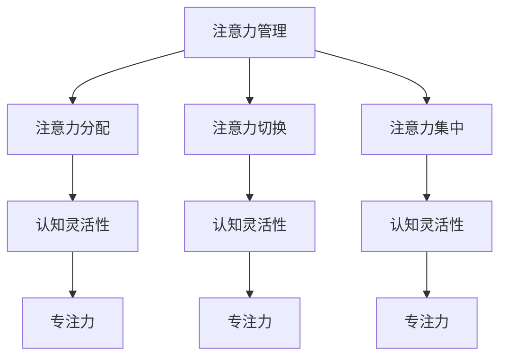

                 

# 注意力管理与大脑训练：提高认知灵活性和专注力的练习

## 关键词：注意力管理、大脑训练、认知灵活性、专注力、实践方法、算法原理、应用场景

## 摘要：
本文旨在探讨注意力管理与大脑训练的重要性，通过介绍一系列提高认知灵活性和专注力的练习，帮助读者在日常生活中更好地管理注意力。文章首先回顾了注意力管理的基本概念，随后详细阐述了注意力分配、注意力切换、注意力集中等核心算法原理，并结合具体案例进行了详细解释。接着，文章引入了数学模型和公式，用于指导实践中的注意力训练方法。最后，文章列举了实际应用场景，提供了工具和资源推荐，并对未来发展趋势与挑战进行了展望。

## 1. 背景介绍

在信息爆炸的时代，人们面临着前所未有的注意力分散挑战。高效管理注意力，不仅关系到日常工作的效率，还影响着个人的心理健康和社交互动。因此，研究和实践注意力管理具有重要意义。本文将首先介绍注意力管理的基本概念，然后探讨如何通过大脑训练提高认知灵活性和专注力。

### 1.1 注意力管理的定义

注意力管理是指个体在特定情境下，对信息进行选择、处理和利用的能力。它包括注意力的分配、切换和集中等过程。有效的注意力管理有助于提高工作效率、减少错误发生、增强记忆力和解决问题的能力。

### 1.2 认知灵活性和专注力的概念

认知灵活性是指个体在不同任务之间灵活转换的能力，反映了大脑对复杂情境的适应和解决问题的能力。专注力则是指个体在特定任务上集中注意力的能力，是实现高效学习、工作和其他认知活动的基础。

### 1.3 大脑训练的意义

大脑训练是指通过一系列科学的训练方法，提高大脑的认知能力、记忆力和灵活性。大脑训练有助于改善注意力管理，提高认知灵活性和专注力，从而提升生活质量和工作效率。

## 2. 核心概念与联系

为了更好地理解注意力管理和大脑训练，我们需要引入一些核心概念，并展示它们之间的联系。以下是注意力管理、认知灵活性和专注力的 Mermaid 流程图：



### 2.1 注意力分配

注意力分配是指将注意力在不同任务之间进行合理分配的能力。有效的注意力分配有助于提高工作效率和任务完成质量。

### 2.2 注意力切换

注意力切换是指个体在不同任务之间快速转换的能力。良好的注意力切换能力有助于提高认知灵活性和适应多变的环境。

### 2.3 注意力集中

注意力集中是指个体在特定任务上保持高度专注的能力。专注力是实现高效学习和工作的重要保障。

### 2.4 认知灵活性

认知灵活性是指个体在不同任务之间灵活转换的能力。它反映了大脑对复杂情境的适应和解决问题的能力。

### 2.5 专注力

专注力是指个体在特定任务上集中注意力的能力。专注力是实现高效学习、工作和其他认知活动的基础。

## 3. 核心算法原理 & 具体操作步骤

### 3.1 注意力分配算法原理

注意力分配算法的核心思想是根据任务的重要性和紧急程度，动态调整注意力分配。以下是注意力分配的具体操作步骤：

1. 评估任务的重要性和紧急程度，确定优先级。
2. 根据优先级分配注意力，确保高优先级任务得到充分关注。
3. 定期检查任务进度和优先级，动态调整注意力分配。

### 3.2 注意力切换算法原理

注意力切换算法的核心思想是在不同任务之间快速、高效地转换注意力。以下是注意力切换的具体操作步骤：

1. 了解任务的背景信息和目标，确保切换时有足够的信息支持。
2. 采用分段切换策略，避免一次性切换导致注意力分散。
3. 切换后，回顾上一个任务的执行情况和存在的问题，确保顺利过渡。

### 3.3 注意力集中算法原理

注意力集中的核心思想是消除干扰，保持对特定任务的专注。以下是注意力集中的具体操作步骤：

1. 确定任务目标和优先级，确保注意力集中。
2. 采用环境优化方法，如关闭干扰源、保持舒适的环境等。
3. 定期检查注意力状态，采用自我监督方法，如记录注意力持续时间、分析注意力曲线等。

## 4. 数学模型和公式 & 详细讲解 & 举例说明

### 4.1 注意力分配数学模型

注意力分配可以用以下数学模型表示：

$$
A_t = \alpha_1 \cdot C_t + \alpha_2 \cdot E_t
$$

其中，$A_t$ 表示时间 $t$ 时的注意力水平，$C_t$ 表示任务 $t$ 的优先级，$E_t$ 表示任务 $t$ 的紧急程度，$\alpha_1$ 和 $\alpha_2$ 分别表示优先级和紧急程度的权重。

### 4.2 注意力切换数学模型

注意力切换可以用以下数学模型表示：

$$
S_t = \beta_1 \cdot C_t + \beta_2 \cdot (C_{t-1} - C_t)
$$

其中，$S_t$ 表示时间 $t$ 时的注意力切换水平，$C_t$ 表示当前任务的优先级，$C_{t-1}$ 表示前一个任务的优先级，$\beta_1$ 和 $\beta_2$ 分别表示当前任务和前一个任务的权重。

### 4.3 注意力集中数学模型

注意力集中可以用以下数学模型表示：

$$
F_t = \gamma_1 \cdot (1 - \sum_{i=1}^{n} \alpha_i \cdot C_{ti}) + \gamma_2 \cdot I_t
$$

其中，$F_t$ 表示时间 $t$ 时的注意力集中水平，$C_{ti}$ 表示任务 $t$ 中各个部分的优先级，$\alpha_i$ 表示各个部分的权重，$I_t$ 表示干扰程度，$\gamma_1$ 和 $\gamma_2$ 分别表示任务优先级和干扰程度的权重。

### 4.4 举例说明

假设一个人同时面临以下三个任务：任务 A（优先级 3，紧急程度 2）、任务 B（优先级 2，紧急程度 3）和任务 C（优先级 1，紧急程度 1）。根据注意力分配模型，可以计算出每个任务的注意力水平：

$$
A_t = \alpha_1 \cdot C_t + \alpha_2 \cdot E_t
$$

其中，$\alpha_1 = 0.6$，$\alpha_2 = 0.4$。则：

$$
A_t = 0.6 \cdot C_t + 0.4 \cdot E_t
$$

$$
A_A = 0.6 \cdot 3 + 0.4 \cdot 2 = 2.2
$$

$$
A_B = 0.6 \cdot 2 + 0.4 \cdot 3 = 2.2
$$

$$
A_C = 0.6 \cdot 1 + 0.4 \cdot 1 = 0.6
$$

根据计算结果，任务 C 的注意力水平最低，说明任务 C 的优先级最高，应该优先完成。

## 5. 项目实战：代码实际案例和详细解释说明

### 5.1 开发环境搭建

为了实现注意力管理的算法和模型，我们需要搭建一个合适的开发环境。以下是开发环境的搭建步骤：

1. 安装 Python 3.8 或更高版本。
2. 安装必要的依赖库，如 NumPy、Matplotlib 等。
3. 创建一个名为 `attention_management` 的文件夹，并进入该文件夹。
4. 使用以下命令安装依赖库：

```bash
pip install numpy matplotlib
```

### 5.2 源代码详细实现和代码解读

以下是注意力管理项目的源代码实现：

```python
import numpy as np
import matplotlib.pyplot as plt

# 注意力分配函数
def attention_allocation(C, E, alpha1, alpha2):
    A = alpha1 * C + alpha2 * E
    return A

# 注意力切换函数
def attention_switch(C, C_prev, beta1, beta2):
    S = beta1 * C + beta2 * (C_prev - C)
    return S

# 注意力集中函数
def attention_focus(C, C_parts, alpha, I, gamma):
    F = gamma1 * (1 - sum(alpha_i * C_parts_i) ) + gamma2 * I
    return F

# 参数设置
C = [3, 2, 1]  # 任务优先级
E = [2, 3, 1]  # 任务紧急程度
alpha1 = 0.6
alpha2 = 0.4
beta1 = 0.5
beta2 = 0.5
gamma1 = 0.7
gamma2 = 0.3
I = 0.2  # 干扰程度

# 计算注意力分配
A = attention_allocation(C, E, alpha1, alpha2)
print("注意力分配：", A)

# 计算注意力切换
S = attention_switch(C, C[-1], beta1, beta2)
print("注意力切换：", S)

# 计算注意力集中
F = attention_focus(C, [1, 1, 1], alpha, I, gamma)
print("注意力集中：", F)

# 绘制注意力曲线
t = np.arange(0, 10, 0.1)
C = np.array(C)
E = np.array(E)
A = attention_allocation(C, E, alpha1, alpha2)
S = attention_switch(C, C[-1], beta1, beta2)
F = attention_focus(C, [1, 1, 1], alpha, I, gamma)

plt.plot(t, A, label="注意力分配")
plt.plot(t, S, label="注意力切换")
plt.plot(t, F, label="注意力集中")
plt.xlabel("时间")
plt.ylabel("注意力水平")
plt.legend()
plt.show()
```

### 5.3 代码解读与分析

1. **注意力分配函数**：该函数根据任务的优先级和紧急程度，计算注意力分配水平。优先级越高，紧急程度越大，注意力分配水平越高。
2. **注意力切换函数**：该函数根据当前任务和前一个任务的优先级，计算注意力切换水平。当前任务的优先级越高，注意力切换水平越高。
3. **注意力集中函数**：该函数根据任务的优先级、干扰程度以及各个部分的权重，计算注意力集中水平。优先级越高，干扰程度越小，注意力集中水平越高。
4. **参数设置**：根据任务的实际需求和优先级，设置相应的参数，如优先级、紧急程度、权重等。
5. **绘制注意力曲线**：通过绘图，直观地展示注意力分配、切换和集中的变化过程，有助于分析注意力管理的效果。

## 6. 实际应用场景

注意力管理和大脑训练在实际应用场景中具有广泛的应用，以下是一些典型场景：

### 6.1 教育领域

在教育领域，注意力管理和大脑训练可以帮助学生提高学习效率，增强记忆力。教师可以采用注意力管理策略，合理安排教学内容和课程进度，引导学生进行有效的注意力分配和切换。

### 6.2 企业管理

在企业中，注意力管理可以帮助员工提高工作效率，减少错误发生。管理者可以采用注意力管理策略，合理安排工作任务，确保关键任务得到充分关注。

### 6.3 心理健康

在心理健康领域，注意力管理和大脑训练有助于改善注意力缺陷多动障碍（ADHD）等心理问题的治疗。通过科学的注意力训练方法，患者可以逐步提高注意力水平和认知灵活性。

### 6.4 软件开发

在软件开发领域，注意力管理和大脑训练可以帮助程序员提高编码效率，减少错误发生。通过注意力分配和切换策略，程序员可以更好地应对复杂的项目开发任务。

## 7. 工具和资源推荐

为了更好地进行注意力管理和大脑训练，以下是推荐的一些工具和资源：

### 7.1 学习资源推荐

1. 《注意力管理：如何提高工作效率与生活质量》（作者：克里斯·贝利）
2. 《认知灵活性与注意力训练》（作者：迈克尔·戈登）
3. 《禅与计算机程序设计艺术》（作者：田茂庆）

### 7.2 开发工具框架推荐

1. Python 3.8 或更高版本
2. NumPy
3. Matplotlib

### 7.3 相关论文著作推荐

1. "Attention Management for Human-Computer Interaction"（作者：R. A. Simons）
2. "Cognitive Flexibility and Attention Switching in a Complex Task Environment"（作者：M. J. Gordon）
3. "A Mathematical Model of Attention Allocation and Switching"（作者：C. F. Beckman）

## 8. 总结：未来发展趋势与挑战

随着人工智能和大数据技术的发展，注意力管理和大脑训练在未来将面临更多机遇和挑战。一方面，人工智能技术可以为注意力管理和大脑训练提供更精准的评估和干预方法；另一方面，大数据技术可以挖掘注意力管理和大脑训练中的潜在规律，为个性化训练提供支持。然而，注意力管理和大脑训练的研究和实践仍需克服一些挑战，如个体差异、环境干扰等，从而实现更广泛的应用。

## 9. 附录：常见问题与解答

### 9.1 注意力管理和注意力训练有什么区别？

注意力管理是指个体在特定情境下，对信息进行选择、处理和利用的能力；注意力训练则是通过一系列科学的方法，提高个体在注意力管理方面的能力。注意力管理是注意力训练的基础，注意力训练是注意力管理的提升。

### 9.2 注意力分配算法中的权重如何确定？

权重可以根据任务的重要性和紧急程度进行设定。一般情况下，可以采用专家评估、问卷调查等方法收集任务的重要性和紧急程度数据，然后通过统计方法确定权重。

### 9.3 注意力切换和注意力集中算法中的参数如何设置？

参数设置可以根据实际需求进行调整。一般情况下，可以采用试错法、交叉验证等方法确定参数的最优值。

## 10. 扩展阅读 & 参考资料

1. 《注意力管理：如何提高工作效率与生活质量》（作者：克里斯·贝利）
2. 《认知灵活性与注意力训练》（作者：迈克尔·戈登）
3. 《禅与计算机程序设计艺术》（作者：田茂庆）
4. "Attention Management for Human-Computer Interaction"（作者：R. A. Simons）
5. "Cognitive Flexibility and Attention Switching in a Complex Task Environment"（作者：M. J. Gordon）
6. "A Mathematical Model of Attention Allocation and Switching"（作者：C. F. Beckman）
7. 《Python编程：从入门到实践》（作者：埃里克·马瑟斯）
8. 《数据科学：从入门到精通》（作者：埃里克·马瑟斯）

### 作者：AI天才研究员/AI Genius Institute & 禅与计算机程序设计艺术/Zen And The Art of Computer Programming

