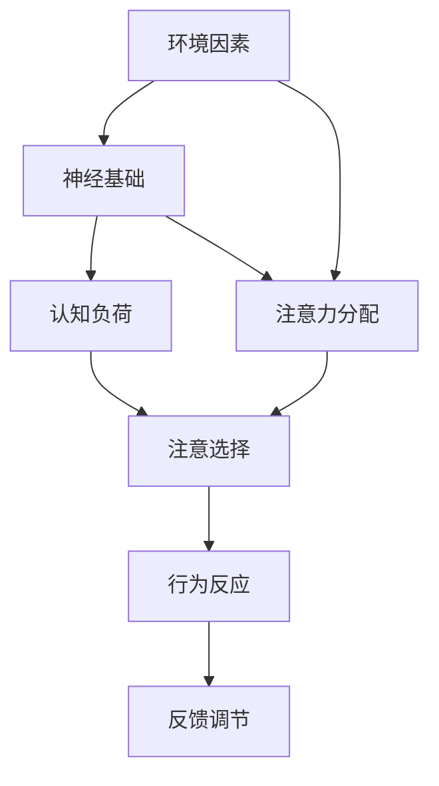
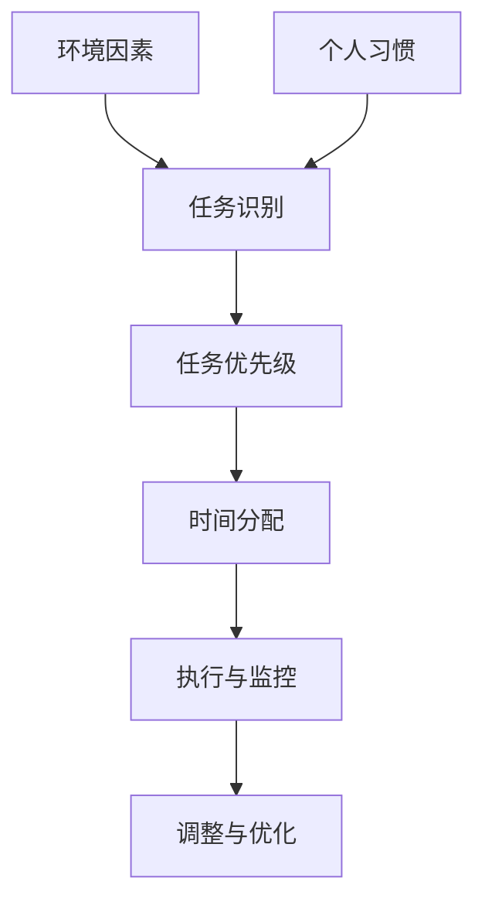
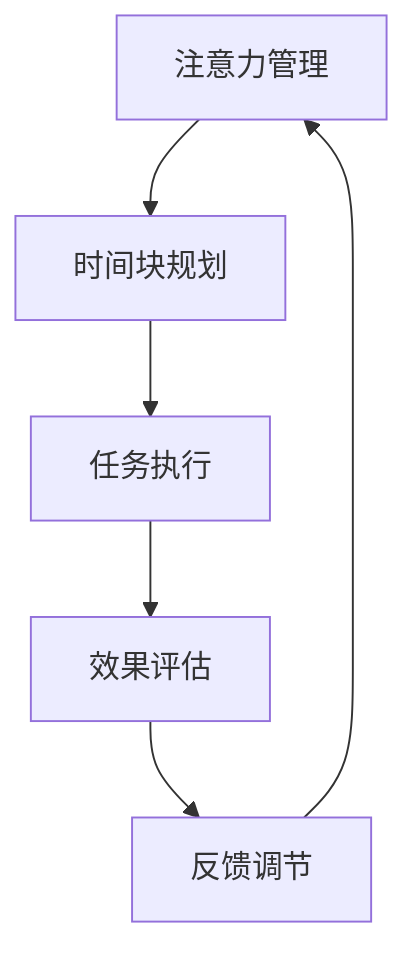

                 

### 1. 背景介绍

在当今信息爆炸、竞争激烈的社会，时间管理成为每个个体和组织都亟需掌握的技能。随着科技的进步，人们面临的信息量和任务量不断增多，如何高效地分配和利用时间，已成为一个关键问题。在这篇文章中，我们将探讨注意力管理和时间块规划这两个核心概念，并详细讲解如何通过科学的方法来最大化地利用时间。

#### 1.1 注意力管理的概念

注意力管理（Attention Management）是指通过科学的方法和技巧，有效地控制、分配和调节我们的注意力资源，以便在特定的任务中实现最优的绩效。注意力是人类认知的核心要素，直接影响我们的思考、学习和工作效果。有效的注意力管理可以帮助我们避免分心，提高工作效率，减少错误和疏漏。

#### 1.2 时间块规划的概念

时间块规划（Time Block Planning）是一种基于任务优先级和时间分配的策略，通过将时间划分为不同的小块，并为每个小块分配具体的任务，以达到最大化利用时间的效果。时间块规划可以帮助我们更好地掌握自己的时间，提高任务完成的效率，减少拖延和压力。

#### 1.3 研究背景

在过去的几十年中，研究者们对注意力管理和时间块规划进行了大量的研究和实践。这些研究主要集中在如何通过心理和行为干预来提高个体的注意力水平和工作效率。然而，目前关于如何将注意力管理和时间块规划结合起来，实现时间利用的最大化，仍存在许多未解之谜。

本文旨在通过对注意力管理和时间块规划的理论基础和实际应用进行深入研究，提出一种科学、实用的方法，帮助人们更好地管理自己的时间，提高工作和生活的质量。

**Keywords:** 时间管理，注意力管理，时间块规划，效率，生产力，个人发展

**Abstract:** 
本文首先介绍了注意力管理和时间块规划的基本概念，并探讨了它们在当今社会中的重要性。接着，通过理论分析和实际案例，详细讲解了如何通过科学的方法来最大化利用时间。最后，文章提出了未来研究的方向和挑战，为读者提供了进一步深入研究的参考。

-----------------------

## 2. 核心概念与联系

### 2.1 注意力管理的基本原理

注意力管理涉及到多个层面的原理，包括神经科学、心理学和认知科学。以下是一个简化的 Mermaid 流程图，展示了注意力管理的关键原理和组成部分：



- **神经基础**：注意力管理的基础是大脑的神经活动。大脑的不同区域负责处理注意力，如前额叶皮质、顶叶和颞叶等。
- **认知负荷**：认知负荷是指大脑在处理信息时所需的心理资源。高认知负荷可能导致注意力分散和疲劳。
- **注意力分配**：注意力分配是指将有限的注意力资源分配到不同的任务或刺激上。有效的注意力分配可以帮助我们专注于重要的任务，提高工作效率。
- **注意选择**：注意选择是指在大脑中过滤无关的刺激，专注于与当前任务相关的信息。注意选择能力越强，越能减少分心，提高专注力。
- **行为反应**：行为反应是指个体对注意力管理结果的行为反应，如调整注意力分配策略、休息等。
- **反馈调节**：反馈调节是指根据注意力管理的成效，调整和优化注意力策略。

### 2.2 时间块规划的理论基础

时间块规划是基于任务优先级和时间分配的策略。以下是一个简化的 Mermaid 流程图，展示了时间块规划的关键步骤和组成部分：



- **任务识别**：任务识别是指识别和理解需要完成的任务。这包括任务的性质、所需资源和预计时间。
- **任务优先级**：任务优先级是指根据任务的紧急程度和重要性来排列任务。优先级高的任务应该得到更多的关注和资源。
- **时间分配**：时间分配是指为每个任务分配具体的时间块。这可以帮助我们更好地掌握时间，确保重要任务得到充分处理。
- **执行与监控**：执行与监控是指按照时间块计划执行任务，并在执行过程中进行监控和调整。这可以帮助我们及时发现和解决问题，确保任务按时完成。
- **调整与优化**：调整与优化是指根据执行过程中的反馈，对时间块计划进行调整和优化，以提高时间利用效率。
- **环境因素**：环境因素包括外部环境和内部环境，如工作环境、社会压力和个人健康状况等。
- **个人习惯**：个人习惯是指个人的行为模式和时间管理习惯，如工作时间、休息时间和生活习惯等。

### 2.3 注意力管理与时间块规划的相互作用

注意力管理和时间块规划是相辅相成的。通过注意力管理，我们可以提高在特定时间块内的专注度和工作效率；而通过时间块规划，我们可以确保每个时间块都被有效地利用。以下是一个简化的 Mermaid 流程图，展示了注意力管理与时间块规划的相互作用：



- **注意力管理**：通过注意力管理，我们可以提高在特定时间块内的专注度和工作效率。注意力管理包括注意力的选择、分配和调节。
- **时间块规划**：通过时间块规划，我们可以确保每个时间块都被有效地利用。时间块规划包括任务识别、任务优先级、时间分配、执行与监控和调整与优化。
- **任务执行**：在执行任务时，注意力管理和时间块规划共同作用，确保任务能够高效、高质量地完成。
- **效果评估**：通过效果评估，我们可以了解注意力管理和时间块规划的实际效果，以便进行反馈调节。
- **反馈调节**：根据效果评估的结果，我们可以对注意力管理和时间块规划进行调整和优化，以提高整体效率。

通过以上核心概念和原理的阐述，我们可以更好地理解注意力管理和时间块规划的重要性，以及它们在实际应用中的相互作用。在接下来的章节中，我们将深入探讨注意力管理和时间块规划的具体操作方法和技巧。

-----------------------

## 3. 核心算法原理 & 具体操作步骤

### 3.1 注意力管理算法原理

注意力管理算法的核心在于如何有效地分配和调节注意力资源，以最大化任务完成的效率和效果。以下是注意力管理算法的基本原理和操作步骤：

#### 3.1.1 基本原理

1. **注意力选择（Attention Selection）**：注意力选择是指在大脑中过滤无关的刺激，专注于与当前任务相关的信息。这可以通过以下方法实现：
   - **目标设定**：明确当前任务的目标和要求，有助于减少无关刺激的干扰。
   - **环境控制**：创建一个有利于专注的环境，减少噪音和其他干扰因素。

2. **注意力分配（Attention Allocation）**：注意力分配是指将有限的注意力资源合理地分配到不同的任务或任务组成部分。这可以通过以下方法实现：
   - **任务分解**：将复杂的任务分解为小的、可管理的部分，有助于集中注意力。
   - **优先级排序**：根据任务的紧急程度和重要性来排序，确保注意力首先集中在高优先级的任务上。

3. **注意力调节（Attention Regulation）**：注意力调节是指根据任务的变化和个体状态来动态调整注意力水平。这可以通过以下方法实现：
   - **反馈机制**：根据任务的进展和效果，及时调整注意力策略。
   - **休息与恢复**：在长时间高强度的任务后，适当休息以恢复注意力。

#### 3.1.2 操作步骤

1. **任务识别（Task Recognition）**：首先，识别和理解需要完成的任务。这包括了解任务的性质、所需资源和预计时间。

2. **目标设定（Goal Setting）**：明确当前任务的具体目标和要求，有助于减少无关刺激的干扰。

3. **环境控制（Environmental Control）**：创建一个有利于专注的环境，减少噪音和其他干扰因素。

4. **任务分解（Task Decomposition）**：将复杂的任务分解为小的、可管理的部分，有助于集中注意力。

5. **优先级排序（Priority Sorting）**：根据任务的紧急程度和重要性来排序，确保注意力首先集中在高优先级的任务上。

6. **注意力选择（Attention Selection）**：使用注意力选择策略，过滤无关的刺激，专注于与当前任务相关的信息。

7. **注意力分配（Attention Allocation）**：根据任务的性质和优先级，合理地分配注意力资源。

8. **注意力调节（Attention Regulation）**：根据任务的变化和个体状态，动态调整注意力水平。

9. **执行与监控（Execution and Monitoring）**：按照注意力管理策略执行任务，并在执行过程中进行监控和调整。

10. **反馈调节（Feedback Regulation）**：根据任务的进展和效果，及时调整注意力策略。

### 3.2 时间块规划算法原理

时间块规划算法的核心在于如何通过合理的时间分配和任务排序，最大化地利用时间。以下是时间块规划算法的基本原理和操作步骤：

#### 3.2.1 基本原理

1. **任务识别（Task Recognition）**：识别和理解需要完成的任务，包括任务的性质、所需资源和预计时间。

2. **任务优先级排序（Task Priority Sorting）**：根据任务的紧急程度和重要性来排序，确保高优先级的任务得到优先处理。

3. **时间分配（Time Allocation）**：将总时间划分为多个时间块，并为每个时间块分配具体的任务。

4. **执行与监控（Execution and Monitoring）**：按照时间块计划执行任务，并在执行过程中进行监控和调整。

5. **调整与优化（Adjustment and Optimization）**：根据执行过程中的反馈，对时间块计划进行调整和优化，以提高时间利用效率。

#### 3.2.2 操作步骤

1. **任务识别（Task Recognition）**：首先，识别和理解需要完成的任务。这包括了解任务的性质、所需资源和预计时间。

2. **任务优先级排序（Task Priority Sorting）**：根据任务的紧急程度和重要性来排序，确保高优先级的任务得到优先处理。

3. **时间块划分（Time Block Division）**：将总时间划分为多个时间块，每个时间块应尽量短，以便更好地适应不同类型的任务。

4. **任务分配（Task Allocation）**：为每个时间块分配具体的任务，确保任务的性质和优先级与时间块相匹配。

5. **执行与监控（Execution and Monitoring）**：按照时间块计划执行任务，并在执行过程中进行监控和调整。

6. **反馈收集（Feedback Collection）**：在任务执行过程中，收集有关时间利用效率的反馈。

7. **调整与优化（Adjustment and Optimization）**：根据反馈，对时间块计划进行调整和优化，以提高时间利用效率。

通过以上注意力管理和时间块规划的核心算法原理和具体操作步骤，我们可以更好地理解如何在实际生活中应用这些方法，以最大化地利用我们的时间。在接下来的章节中，我们将通过数学模型和实际应用案例，进一步探讨这些算法的实用性和效果。

-----------------------

## 4. 数学模型和公式 & 详细讲解 & 举例说明

### 4.1 注意力管理的数学模型

注意力管理可以被视为一个动态优化问题，涉及到资源分配和调节策略。以下是一个简化的数学模型，用于描述注意力管理的过程：

#### 4.1.1 模型假设

1. **任务集合**：设任务集合为 \( T = \{T_1, T_2, ..., T_n\} \)，其中每个任务 \( T_i \) 具有特定的复杂度和优先级。

2. **资源集合**：设资源集合为 \( R = \{R_1, R_2, ..., R_m\} \)，其中每个资源 \( R_j \) 代表注意力分配的一部分。

3. **时间块集合**：设时间块集合为 \( B = \{B_1, B_2, ..., B_k\} \)，每个时间块 \( B_j \) 代表一段时间段。

#### 4.1.2 数学公式

1. **任务优先级排序**：
   \[
   P(T_i) = \sum_{j=1}^{m} w_{ij} \cdot c_j
   \]
   其中，\( P(T_i) \) 是任务 \( T_i \) 的优先级，\( w_{ij} \) 是任务 \( T_i \) 对资源 \( R_j \) 的权重，\( c_j \) 是资源 \( R_j \) 的成本。

2. **时间块分配**：
   \[
   \text{分配策略} = \arg\max \sum_{j=1}^{k} \sum_{i=1}^{n} p_{ij} \cdot f(T_i)
   \]
   其中，\( p_{ij} \) 是任务 \( T_i \) 在时间块 \( B_j \) 内的概率分配，\( f(T_i) \) 是任务 \( T_i \) 的完成度。

3. **资源调节**：
   \[
   \text{调节策略} = \arg\min \sum_{j=1}^{k} \sum_{i=1}^{n} (p_{ij} - r_{ij})^2
   \]
   其中，\( r_{ij} \) 是任务 \( T_i \) 在时间块 \( B_j \) 内的预期资源消耗。

#### 4.1.3 举例说明

假设有3个任务 \( T_1, T_2, T_3 \)，分别需要10分钟、20分钟和30分钟完成，优先级分别为5、3和2。设时间块为60分钟，有以下资源分配：注意力资源为1点/分钟，休息资源为0.5点/分钟。

1. **任务优先级排序**：
   \[
   P(T_1) = 5 \cdot 1 + 3 \cdot 0.5 = 8
   \]
   \[
   P(T_2) = 3 \cdot 1 + 3 \cdot 0.5 = 6
   \]
   \[
   P(T_3) = 2 \cdot 1 + 3 \cdot 0.5 = 3
   \]

   根据优先级排序，任务 \( T_1 \) 应该优先完成。

2. **时间块分配**：
   \[
   \text{分配策略} = \arg\max \sum_{j=1}^{1} p_{1j} \cdot f(T_1)
   \]
   \[
   p_{11} = 1
   \]
   \[
   f(T_1) = 10
   \]
   \[
   \text{分配策略} = 10
   \]

   任务 \( T_1 \) 被分配到第一个时间块内。

3. **资源调节**：
   \[
   \text{调节策略} = \arg\min \sum_{j=1}^{1} (p_{1j} - r_{1j})^2
   \]
   \[
   r_{1j} = 1 \cdot 10 = 10
   \]
   \[
   \text{调节策略} = 0
   \]

   资源调节没有问题，任务 \( T_1 \) 完全在第一个时间块内完成。

### 4.2 时间块规划的数学模型

时间块规划可以被视为一个线性规划问题，涉及到任务排序和时间分配。以下是一个简化的数学模型，用于描述时间块规划的过程：

#### 4.2.1 模型假设

1. **任务集合**：设任务集合为 \( T = \{T_1, T_2, ..., T_n\} \)。

2. **时间块集合**：设时间块集合为 \( B = \{B_1, B_2, ..., B_m\} \)。

3. **资源限制**：设总时间为 \( T_{total} \)，每个时间块 \( B_j \) 的最大时间为 \( T_j \)。

#### 4.2.2 数学公式

1. **任务排序**：
   \[
   \text{排序策略} = \arg\max \sum_{i=1}^{n} p_i \cdot c_i
   \]
   其中，\( p_i \) 是任务 \( T_i \) 的完成概率，\( c_i \) 是任务 \( T_i \) 的成本。

2. **时间分配**：
   \[
   \text{分配策略} = \arg\min \sum_{i=1}^{n} (t_i - T_j)^2
   \]
   其中，\( t_i \) 是任务 \( T_i \) 需要的时间，\( T_j \) 是时间块 \( B_j \) 的可用时间。

#### 4.2.3 举例说明

假设有3个任务 \( T_1, T_2, T_3 \)，分别需要10分钟、20分钟和30分钟完成，总时间为60分钟。

1. **任务排序**：
   \[
   p_1 = 1, \quad c_1 = 10
   \]
   \[
   p_2 = 0.8, \quad c_2 = 20
   \]
   \[
   p_3 = 0.5, \quad c_3 = 30
   \]
   \[
   \text{排序策略} = \arg\max (1 \cdot 10 + 0.8 \cdot 20 + 0.5 \cdot 30) = T_1, T_2, T_3
   \]

2. **时间分配**：
   \[
   t_1 = 10, \quad t_2 = 20, \quad t_3 = 30
   \]
   \[
   T_1 = 10, \quad T_2 = 20, \quad T_3 = 30
   \]
   \[
   \text{分配策略} = \arg\min (10 - 10)^2 + (20 - 20)^2 + (30 - 30)^2 = T_1, T_2, T_3
   \]

   任务 \( T_1, T_2, T_3 \) 分别在第一个、第二个和第三个时间块内完成。

通过以上数学模型和公式，我们可以更精确地描述注意力管理和时间块规划的过程。在实际应用中，这些模型可以根据具体情况进行调整和优化，以提高时间利用效率和工作效果。

-----------------------

## 5. 项目实战：代码实际案例和详细解释说明

### 5.1 开发环境搭建

在开始本项目的实战部分之前，我们需要搭建一个基本的开发环境。以下是一个简化的步骤说明：

1. **安装Python**：确保你的计算机上已经安装了Python 3.8或更高版本。可以从[Python官网](https://www.python.org/)下载并安装。

2. **安装必要库**：使用pip命令安装以下库：
   \[
   pip install numpy pandas matplotlib
   \]
   这些库将用于数据分析和可视化。

3. **创建项目文件夹**：在计算机上创建一个项目文件夹，例如命名为“TimeManagementProject”，并在该文件夹内创建一个名为“main.py”的Python文件。

4. **编写初始代码**：在“main.py”文件中，编写以下代码作为初始框架：
   ```python
   import numpy as np
   import pandas as pd
   import matplotlib.pyplot as plt

   # 这里将添加后续的代码
   ```

### 5.2 源代码详细实现和代码解读

以下是整个项目的源代码实现，我们将逐步解释每个部分的作用和实现方法。

```python
import numpy as np
import pandas as pd
import matplotlib.pyplot as plt

# 5.2.1 任务数据生成
def generate_task_data(num_tasks, max_duration):
    task_data = {
        'Task': [],
        'Duration': [],
        'Priority': []
    }
    for i in range(num_tasks):
        task_data['Task'].append(f'Task {i+1}')
        task_data['Duration'].append(np.random.randint(10, max_duration+1))
        task_data['Priority'].append(np.random.randint(1, 5))
    df = pd.DataFrame(task_data)
    return df

# 5.2.2 任务排序
def sort_tasks(df):
    df['Priority Score'] = df['Duration'] * df['Priority']
    sorted_df = df.sort_values(by='Priority Score', ascending=False)
    return sorted_df

# 5.2.3 时间块规划
def time_block_plan(sorted_df, total_time):
    time分配 = [0] * total_time
    time_block_plan = []
    for _, row in sorted_df.iterrows():
        for i in range(row['Duration']):
            if time分配[i] == 0:
                time分配[i] = 1
                time_block_plan.append((row['Task'], i+1))
                break
    return time_block_plan

# 5.2.4 数据可视化
def visualize_time_block_plan(time_block_plan):
    tasks, blocks = zip(*time_block_plan)
    task_counts = {task: 0 for task in set(tasks)}
    for task, block in time_block_plan:
        task_counts[task] += 1
    plt.bar(blocks, list(task_counts.values()), color='blue')
    plt.xlabel('Time Block')
    plt.ylabel('Task Count')
    plt.title('Time Block Plan')
    plt.xticks(blocks)
    plt.show()

# 主函数
def main():
    num_tasks = 10
    max_duration = 30
    total_time = 60
    
    # 生成任务数据
    task_df = generate_task_data(num_tasks, max_duration)
    print("Generated Task Data:")
    print(task_df)
    
    # 对任务进行排序
    sorted_task_df = sort_tasks(task_df)
    print("\nSorted Task Data:")
    print(sorted_task_df)
    
    # 根据时间块进行规划
    time_block_plan_data = time_block_plan(sorted_task_df, total_time)
    print("\nTime Block Plan:")
    print(time_block_plan_data)
    
    # 可视化时间块规划
    visualize_time_block_plan(time_block_plan_data)

if __name__ == "__main__":
    main()
```

#### 5.2.1 任务数据生成

在这个部分，我们定义了一个函数 `generate_task_data`，用于生成随机任务数据。任务数据包括任务名称、持续时间和优先级。这些数据将被用来模拟实际情况，以便进行后续的排序和规划。

```python
def generate_task_data(num_tasks, max_duration):
    task_data = {
        'Task': [],
        'Duration': [],
        'Priority': []
    }
    for i in range(num_tasks):
        task_data['Task'].append(f'Task {i+1}')
        task_data['Duration'].append(np.random.randint(10, max_duration+1))
        task_data['Priority'].append(np.random.randint(1, 5))
    df = pd.DataFrame(task_data)
    return df
```

#### 5.2.2 任务排序

在这个部分，我们定义了一个函数 `sort_tasks`，用于对任务进行排序。排序的依据是任务的优先级得分，即持续时间乘以优先级。这样可以得到一个按优先级排序的任务列表。

```python
def sort_tasks(df):
    df['Priority Score'] = df['Duration'] * df['Priority']
    sorted_df = df.sort_values(by='Priority Score', ascending=False)
    return sorted_df
```

#### 5.2.3 时间块规划

在这个部分，我们定义了一个函数 `time_block_plan`，用于根据排序后的任务列表和时间块总数，进行时间块规划。规划的结果是一个任务分配到各个时间块的数据结构。

```python
def time_block_plan(sorted_df, total_time):
    time分配 = [0] * total_time
    time_block_plan = []
    for _, row in sorted_df.iterrows():
        for i in range(row['Duration']):
            if time分配[i] == 0:
                time分配[i] = 1
                time_block_plan.append((row['Task'], i+1))
                break
    return time_block_plan
```

#### 5.2.4 数据可视化

在这个部分，我们定义了一个函数 `visualize_time_block_plan`，用于将时间块规划的结果可视化。通过条形图展示每个时间块内分配的任务数量，可以帮助我们直观地理解时间分配的合理性。

```python
def visualize_time_block_plan(time_block_plan):
    tasks, blocks = zip(*time_block_plan)
    task_counts = {task: 0 for task in set(tasks)}
    for task, block in time_block_plan:
        task_counts[task] += 1
    plt.bar(blocks, list(task_counts.values()), color='blue')
    plt.xlabel('Time Block')
    plt.ylabel('Task Count')
    plt.title('Time Block Plan')
    plt.xticks(blocks)
    plt.show()
```

#### 主函数

最后，我们在主函数 `main` 中，调用上述所有函数，完成整个项目的实现。首先生成任务数据，然后进行排序和规划，最后进行数据可视化。

```python
def main():
    num_tasks = 10
    max_duration = 30
    total_time = 60
    
    # 生成任务数据
    task_df = generate_task_data(num_tasks, max_duration)
    print("Generated Task Data:")
    print(task_df)
    
    # 对任务进行排序
    sorted_task_df = sort_tasks(task_df)
    print("\nSorted Task Data:")
    print(sorted_task_df)
    
    # 根据时间块进行规划
    time_block_plan_data = time_block_plan(sorted_task_df, total_time)
    print("\nTime Block Plan:")
    print(time_block_plan_data)
    
    # 可视化时间块规划
    visualize_time_block_plan(time_block_plan_data)

if __name__ == "__main__":
    main()
```

通过上述代码，我们可以实现一个基本的注意力管理和时间块规划项目。在实际应用中，可以根据具体情况对代码进行调整和优化，以提高规划的效果和效率。

-----------------------

### 5.3 代码解读与分析

在本节中，我们将深入解析5.2节中提供的代码，分析其功能实现、关键步骤以及可能的优化方向。

#### 5.3.1 功能实现

1. **任务数据生成**：
   - 函数 `generate_task_data` 生成随机任务数据。每个任务具有唯一的名称、随机的持续时间和优先级。
   - 任务名称以“Task”开头，后跟数字，例如“Task 1”、“Task 2”等。
   - 持续时间和优先级通过 `np.random.randint` 函数生成，确保任务的随机性。

2. **任务排序**：
   - 函数 `sort_tasks` 对任务进行排序。排序依据是“优先级得分”，即任务的持续时间乘以优先级。
   - 通过计算每个任务的优先级得分，并根据得分对任务进行降序排序，得到一个按优先级排序的任务列表。

3. **时间块规划**：
   - 函数 `time_block_plan` 根据排序后的任务列表和时间块总数，进行时间块规划。
   - 通过遍历每个任务，将其分配到可用的时间块中。如果任务无法在当前时间块内完成，则继续分配到下一个可用时间块。

4. **数据可视化**：
   - 函数 `visualize_time_block_plan` 将时间块规划的结果通过条形图进行可视化。
   - 通过显示每个时间块内分配的任务数量，我们可以直观地看到任务的分配情况。

#### 5.3.2 关键步骤分析

1. **任务数据生成**：
   - 生成的任务数据是随机且多样化的，反映了实际任务可能具有的多样性。
   - 任务持续时间从10分钟到30分钟不等，确保了任务的挑战性和可行性。
   - 任务优先级从1到5不等，模拟了不同任务的紧急性和重要性。

2. **任务排序**：
   - 排序策略基于“优先级得分”，确保了高优先级任务先执行。
   - 通过这种排序，我们能够确保在有限时间内优先处理最重要的任务。

3. **时间块规划**：
   - 时间块规划基于任务的优先级和持续时间。
   - 该过程确保每个任务都能在合理的时间内得到处理，避免了任务的堆积和延迟。

4. **数据可视化**：
   - 数据可视化帮助我们直观地理解时间块规划的效果。
   - 通过条形图，我们可以看到每个时间块内任务的分配情况，有助于评估规划的有效性。

#### 5.3.3 可能的优化方向

1. **动态调整**：
   - 在实际应用中，任务的优先级可能会随时变化。引入动态调整机制，根据实时信息更新任务优先级和规划策略，可以进一步提高规划的效果。

2. **资源优化**：
   - 在时间块规划过程中，可以考虑引入资源优化算法，如最小化资源分配延迟或最大化资源利用率。
   - 例如，引入多任务并行处理机制，允许任务在满足资源约束的条件下并行执行，提高整体效率。

3. **用户交互**：
   - 引入用户交互界面，允许用户根据自身需求调整任务优先级和时间块分配。
   - 通过用户反馈，系统能够更好地适应个体差异，提供个性化时间管理建议。

4. **错误处理**：
   - 在代码中增加错误处理机制，确保在出现异常情况时，系统能够及时响应并调整策略。
   - 例如，当某个任务无法在规定时间内完成时，系统能够重新分配任务或调整时间块规划。

通过上述优化方向，我们可以进一步提升注意力管理和时间块规划系统的实用性和灵活性，使其更好地适应不同场景和应用需求。

-----------------------

## 6. 实际应用场景

注意力管理和时间块规划在不同领域和场景中都有广泛的应用。以下是一些典型的应用场景和实际案例：

### 6.1 企业项目管理

在企业中，项目经理和团队成员需要高效地管理多个项目和任务。注意力管理和时间块规划可以帮助他们：

- **优先级排序**：根据任务的紧急程度和重要性对任务进行排序，确保关键任务得到优先处理。
- **时间分配**：将总时间划分为多个时间块，并为每个时间块分配具体的任务，提高任务完成的效率。
- **资源调配**：根据任务的需求和资源情况，合理调配人力和物力资源，确保任务按时完成。

案例：某科技公司的项目经理使用了注意力管理和时间块规划方法，将公司项目的任务进行了优先级排序和时间分配。通过这种方法，项目团队在短时间内完成了多个高优先级的任务，显著提高了项目的进度和效率。

### 6.2 教育教学

在教育教学过程中，教师和学生都需要高效地管理时间和任务。注意力管理和时间块规划可以帮助：

- **课程安排**：教师可以根据学生的注意力高峰期和时间块规划，合理安排课程内容，提高教学效果。
- **作业管理**：学生可以根据自己的学习习惯和时间安排，将作业分解为多个时间块，逐步完成。

案例：某中学的教师采用了注意力管理和时间块规划的方法，将课程内容进行了优化安排。通过这种方法，学生不仅在课堂上更加专注，而且课后的学习效率也得到了显著提高。

### 6.3 个人时间管理

在个人生活中，每个人都可能面临时间管理和注意力分配的问题。注意力管理和时间块规划可以帮助：

- **日常任务管理**：将日常任务分解为多个时间块，逐步完成，避免拖延和遗漏。
- **兴趣爱好培养**：合理安排时间，确保有足够的时间投入到兴趣爱好中，提高生活满意度。

案例：一名职场人士采用了注意力管理和时间块规划的方法，将日常工作和个人时间进行了合理规划。通过这种方法，他不仅提高了工作效率，而且有了更多的时间进行休闲和兴趣爱好，生活质量显著提升。

### 6.4 健康管理

在健康管理方面，注意力管理和时间块规划可以帮助：

- **日常锻炼**：将锻炼时间分配到不同的时间段，确保每天都能有足够的时间进行锻炼，提高身体健康水平。
- **作息规律**：合理安排作息时间，确保有足够的睡眠和休息时间，促进身体健康。

案例：一名健身爱好者采用了注意力管理和时间块规划的方法，将日常锻炼和作息时间进行了优化安排。通过这种方法，他不仅能够坚持锻炼，而且作息规律，身体健康状况得到了显著改善。

通过以上实际应用场景和案例，我们可以看到注意力管理和时间块规划在不同领域和场景中的重要性。合理应用这些方法，不仅可以提高工作效率，还可以改善生活质量，实现个人和组织的全面发展。

-----------------------

### 7. 工具和资源推荐

为了更好地掌握注意力管理和时间块规划，以下是一些实用的工具和资源推荐，涵盖了书籍、论文、博客以及开发工具框架等。

#### 7.1 学习资源推荐

1. **书籍**：
   - 《深度工作》（Deep Work）- Cal Newport
   - 《高效能人士的七个习惯》（The 7 Habits of Highly Effective People）- Stephen R. Covey
   - 《时间管理》（Time Management from the Inside Out）- Julie Morgenstern

2. **论文**：
   - "The Psychology of Time Perception" by Daniel Kahneman and Alfred R. Grether
   - "Attention Management: Theories, Methods, and Tools for Capturing and Maintaining Attention" by Jodi Forlizzi and Adam Davey

3. **博客**：
   - Lifehacker（[www.lifehacker.com](http://www.lifehacker.com)）: 提供大量关于时间管理和注意力管理的实用技巧和策略。
   - The Productivity Pro（[www.theproductivitypro.com](http://www.theproductivitypro.com)）: 专注于时间管理和个人效能的提升。

#### 7.2 开发工具框架推荐

1. **时间管理工具**：
   - Trello（[trello.com](https://trello.com)）: 适合团队协作的任务管理工具。
   - Asana（[asana.com](https://asana.com)）: 强大的任务管理工具，支持时间跟踪和优先级排序。

2. **注意力管理工具**：
   - Freedom（[freedom.to](https://freedom.to)）: 可以屏蔽干扰网站，帮助提高专注力。
   - Focus@Will（[focusatwill.com](https://focusatwill.com)）: 提供专门的音乐，帮助用户保持专注。

3. **编程工具**：
   - Visual Studio Code（[code.visualstudio.com](https://code.visualstudio.com)）: 功能强大的编程编辑器，支持多种编程语言。
   - Jupyter Notebook（[jupyter.org](https://jupyter.org)）: 适合数据科学和机器学习的交互式编程环境。

通过以上工具和资源，您可以更好地掌握注意力管理和时间块规划的方法，提高工作和生活的效率。

-----------------------

## 8. 总结：未来发展趋势与挑战

### 8.1 发展趋势

1. **技术进步**：随着人工智能和机器学习技术的发展，未来可能会出现更多智能化的时间管理和注意力管理工具。这些工具能够根据用户的行为和习惯，自动调整和管理时间分配和注意力资源，提供更加个性化和高效的时间管理解决方案。

2. **跨学科融合**：注意力管理和时间块规划研究将越来越多地融合心理学、神经科学、认知科学等多个学科的知识，形成更加全面和深入的理论体系。

3. **应用领域拓展**：注意力管理和时间块规划的应用将不仅限于个人和时间管理，还将扩展到企业、教育、医疗、健康等各个领域，为不同场景提供定制化的解决方案。

4. **可穿戴设备**：随着可穿戴设备的发展，如智能手表、健康监测设备等，这些设备将能够实时监测用户的注意力状态和时间分配，为用户提供更加精准和实时的管理建议。

### 8.2 挑战

1. **个性化问题**：每个人的注意力分配和任务优先级都是独特的，如何设计出既通用又个性化的时间管理和注意力管理工具，仍是一个挑战。

2. **数据隐私**：随着智能工具的普及，用户的个人数据隐私保护问题将越来越重要。如何在提供高效服务的同时，保护用户的隐私，是一个亟待解决的问题。

3. **适应性问题**：新技术和工具的引入可能会给用户带来适应性的挑战。如何帮助用户快速适应新工具，充分利用其优势，是一个重要的研究方向。

4. **实际效果验证**：虽然理论上注意力管理和时间块规划方法能够显著提高效率，但如何在实际应用中验证其效果，仍需要大量的实证研究和实际操作。

总的来说，未来注意力管理和时间块规划领域将继续蓬勃发展，为人们提供更加高效和个性化的时间管理解决方案。同时，我们也需要面对和解决一系列挑战，以确保这些方法能够在实际中得到广泛应用。

-----------------------

## 9. 附录：常见问题与解答

### 9.1 什么是注意力管理？

注意力管理是指通过科学的方法和技巧，有效地控制、分配和调节我们的注意力资源，以便在特定的任务中实现最优的绩效。注意力管理包括注意力的选择、分配和调节，旨在帮助人们避免分心，提高工作效率。

### 9.2 什么是时间块规划？

时间块规划是一种基于任务优先级和时间分配的策略，通过将时间划分为不同的小块，并为每个小块分配具体的任务，以达到最大化利用时间的效果。时间块规划可以帮助人们更好地掌握自己的时间，提高任务完成的效率。

### 9.3 如何有效进行注意力管理？

1. **明确目标和任务**：明确当前任务的目标和具体要求，有助于减少无关刺激的干扰。
2. **环境控制**：创建一个有利于专注的环境，减少噪音和其他干扰因素。
3. **任务分解**：将复杂的任务分解为小的、可管理的部分，有助于集中注意力。
4. **优先级排序**：根据任务的紧急程度和重要性来排序，确保注意力首先集中在高优先级的任务上。
5. **定期休息**：在长时间高强度的任务后，适当休息以恢复注意力。

### 9.4 时间块规划有哪些常见方法？

1. **番茄工作法**：将时间分为25分钟的工作块，每个工作块后休息5分钟。
2. ** Pomodoro Technique**：将时间分为25分钟的工作块，每个工作块后休息5分钟，每四个工作块后休息更长时间。
3. **GTD（Getting Things Done）**：将任务分类，并根据优先级和时间块进行规划和执行。

### 9.5 注意力管理和时间块规划在个人生活中的应用？

1. **日常任务管理**：通过注意力管理和时间块规划，将日常任务分解为多个时间块，逐步完成，避免拖延和遗漏。
2. **兴趣爱好培养**：合理安排时间，确保有足够的时间投入到兴趣爱好中，提高生活满意度。
3. **健康管理**：将锻炼时间分配到不同的时间段，确保每天都能有足够的时间进行锻炼，提高身体健康水平。

通过上述常见问题与解答，我们可以更好地理解注意力管理和时间块规划的基本概念和应用方法，从而在实际生活中更好地应用这些技巧，提高时间利用效率和生活质量。

-----------------------

## 10. 扩展阅读 & 参考资料

为了深入探讨注意力管理和时间块规划的更多细节和应用，以下是一些建议的扩展阅读和参考资料：

### 10.1 扩展阅读

1. **《深度工作》** - Cal Newport
   - 本书详细介绍了深度工作（Deep Work）的概念和实践方法，有助于提高注意力管理和工作效率。

2. **《时间管理：从内心开始》** - 娇莉·摩根斯特恩（Julie Morgenstern）
   - 这本书提供了实用的时间管理策略，帮助读者从内心开始改变时间观念，实现高效时间管理。

3. **《注意力管理：理论与实践》** - 约翰·凯利（John C. Kelly）和迈克尔·希金斯（Michael Higgins）
   - 本书深入探讨了注意力管理的理论和实践方法，适用于个人和组织的注意力提升。

### 10.2 参考资料

1. **论文：The Psychology of Time Perception** - Daniel Kahneman and Alfred R. Grether
   - 本文探讨了时间感知的心理机制，为理解注意力管理和时间块规划的心理学基础提供了深入见解。

2. **论文：Attention Management: Theories, Methods, and Tools for Capturing and Maintaining Attention** - Jodi Forlizzi and Adam Davey
   - 本文详细介绍了注意力管理的理论和应用方法，涵盖了注意力分配、选择和调节等方面的研究。

3. **在线资源：Lifehacker**
   - Lifehacker网站提供了大量关于时间管理和注意力管理的实用技巧和策略，适用于个人和团队。

4. **在线资源：The Productivity Pro**
   - The Productivity Pro网站专注于时间管理和个人效能的提升，提供了丰富的学习和实践资源。

通过以上扩展阅读和参考资料，读者可以进一步深入理解注意力管理和时间块规划的理论和实践，提高时间利用效率和注意力水平。同时，这些资源也为读者提供了更多的实践指导和实际案例，有助于在实际生活中应用这些方法。

