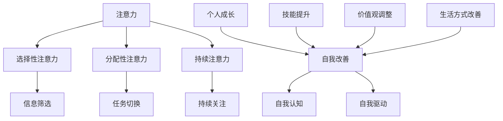

                 

### 背景介绍

在信息技术飞速发展的今天，人工智能、深度学习、大数据等前沿技术的不断涌现，使得对注意力管理和自我改善的研究显得尤为重要。注意力管理不仅关乎个人的工作效率，更直接影响到我们的生活质量与成长速度。

个人成长和发展是一个复杂而多层次的过程，其中注意力管理起着至关重要的作用。研究表明，注意力分散会导致认知负荷增加，从而影响记忆、决策和创新能力。因此，如何有效提升注意力管理水平，已经成为当代人们关注的热点话题。

本文将围绕注意力管理与自我改善这一主题，探讨如何通过专注力增强个人成长和发展。文章将从背景介绍、核心概念与联系、核心算法原理、数学模型和公式、项目实战、实际应用场景、工具和资源推荐等多个角度，详细阐述注意力管理的理论与实践。

通过本文的阅读，读者将了解注意力管理的基本原理，掌握提升专注力的具体方法，并学会如何在日常生活中应用这些技巧，以实现个人成长和发展的目标。

### 核心概念与联系

在深入探讨注意力管理与自我改善之前，我们需要首先了解几个核心概念，并探讨它们之间的内在联系。

#### 注意力（Attention）

注意力是指人类在感知和思考过程中对信息进行筛选、处理和调用的能力。它决定了我们在面对大量信息时，哪些信息会被优先处理，哪些信息会被忽视。根据不同类型的任务，注意力可以分为选择性注意力、分配性注意力和持续注意力。

1. **选择性注意力**：是指我们对某些特定信息给予更多关注，而忽略其他信息的处理能力。
2. **分配性注意力**：是指我们在同时处理多个任务时，如何在不同任务之间切换和分配注意力的能力。
3. **持续注意力**：是指我们在长时间内保持对特定任务或信息的关注，不因外界干扰而分散的能力。

#### 自我改善（Self-Improvement）

自我改善是一个持续性的过程，涉及个人在知识、技能、态度和行为上的提升。它不仅仅是指技能的提高，还包括对个人价值观、人生目标和生活方式的反思和调整。自我改善的核心在于自我认知和自我驱动，即通过自我反思和不断尝试，找到最适合自己的成长路径。

#### 核心概念原理和架构的 Mermaid 流程图

为了更清晰地展示这些核心概念之间的联系，我们可以使用 Mermaid 流程图来表示。



在这个流程图中，我们可以看到：

1. 注意力是自我改善的基础，它包括选择性注意力、分配性注意力和持续注意力三个子类。
2. 选择性注意力帮助我们在信息过载的环境中筛选重要信息，从而更好地处理任务。
3. 分配性注意力使我们能够有效地在多个任务之间切换，提高工作效率。
4. 持续注意力确保我们在长时间内保持对重要任务或项目的关注，避免中途放弃或迷失方向。
5. 自我改善包括自我认知和自我驱动，这两者是推动个人成长和发展的核心动力。
6. 个人成长、技能提升、价值观调整和生活方式改善是自我改善的具体表现，它们共同构成了个人发展的全面图景。

通过这个流程图，我们可以更好地理解注意力管理和自我改善之间的内在联系，以及如何通过提升注意力水平来实现个人成长和发展的目标。

### 核心算法原理 & 具体操作步骤

在理解了注意力管理和自我改善的基本概念后，我们接下来将探讨如何通过具体的算法原理和操作步骤来提升个人的专注力和自我改善能力。

#### 1. 基于时间管理的方法

时间管理是提升注意力的基础，它通过合理安排时间来减少干扰，提高专注度。以下是一些具体的时间管理方法：

1. **番茄工作法**：将工作时间分为25分钟的工作周期，每个周期后休息5分钟。通过这种方法，可以有效地保持专注，避免疲劳。
2. **四象限法则**：将任务分为重要且紧急、重要但不紧急、不重要但紧急和不重要且不紧急四个象限，优先处理重要且紧急的任务，合理安排不紧急但重要的任务。
3. **日程规划**：制定详细的日程表，将每天的时间合理分配给不同的任务，避免时间浪费和任务遗漏。

#### 2. 基于心理调适的方法

心理调适是提升注意力的重要手段，通过调整心态，我们可以更好地控制自己的注意力。以下是一些心理调适的方法：

1. **正念冥想**：通过正念冥想，我们可以学会将注意力集中在当前的任务上，减少内心的杂念和干扰。具体步骤如下：
   - 选择一个安静的环境，保持舒适的坐姿。
   - 将注意力集中在呼吸上，感受呼吸的进出。
   - 当注意力开始游离时，轻轻地将注意力带回到呼吸上。
   - 持续练习，逐步延长冥想的时间。

2. **情绪管理**：情绪波动会显著影响注意力的集中。通过情绪管理，我们可以更好地控制情绪，从而提高注意力。具体步骤如下：
   - 认识到自己的情绪，并接受它们。
   - 使用深呼吸、肌肉放松等方法来缓解紧张和焦虑。
   - 通过积极的自我暗示来调整情绪。

#### 3. 基于环境优化的方法

环境优化是提升注意力的外在条件，通过优化工作环境，我们可以减少干扰，提高专注度。以下是一些环境优化的方法：

1. **减少干扰**：将手机置于静音状态，关闭不必要的通知，避免分心的干扰。
2. **优化工作空间**：确保工作环境整洁、舒适，减少视觉和听觉的干扰。
3. **定期休息**：长时间工作后，适当休息可以帮助恢复注意力，提高工作效率。

#### 实际操作步骤

为了将上述方法应用到实际中，我们可以按照以下步骤进行：

1. **制定计划**：根据工作任务和个人目标，制定详细的时间管理计划。
2. **实践时间管理方法**：按照番茄工作法或其他时间管理方法，合理安排工作时间。
3. **进行心理调适**：每天进行正念冥想和情绪管理练习。
4. **优化工作环境**：定期整理工作空间，减少干扰因素。

通过这些具体的方法和步骤，我们可以有效地提升注意力管理水平，从而实现自我改善和个人成长的目标。

### 数学模型和公式 & 详细讲解 & 举例说明

在探讨注意力管理和自我改善的过程中，数学模型和公式能够帮助我们量化这些概念，提供更为精确和直观的理解。以下是一些关键的数学模型和公式，并对其进行详细讲解和举例说明。

#### 1. 注意力分配模型

注意力分配模型描述了如何在多个任务之间合理分配注意力。一个常用的模型是“边际效用递减原理”（Marginal Utility Decline Principle），该原理指出，随着投入的增多，每个额外单位的时间或资源带来的效用逐渐减少。

公式表示为：
\[ U_i = U_0 - ki \]
其中：
- \( U_i \) 是第 \( i \) 个任务的效用。
- \( U_0 \) 是初始效用。
- \( k \) 是边际效用递减系数。
- \( i \) 是任务的数量或时间。

举例说明：
假设你需要在1小时内完成三个任务：阅读一篇论文、编写一份报告和练习钢琴。初始效用分别为 \( U_0 = 100 \)，\( k = 0.1 \)。

计算各任务的效用：
- 阅读：\( U_1 = 100 - 0.1 \times 1 = 99 \)
- 编写：\( U_2 = 100 - 0.1 \times 2 = 90 \)
- 练习：\( U_3 = 100 - 0.1 \times 3 = 80 \)

根据边际效用递减原理，你应该首先完成阅读任务，因为其带来的效用最高。

#### 2. 注意力维持模型

注意力维持模型用于描述注意力随时间变化的过程。一个简单的模型是“指数衰减模型”（Exponential Decay Model），该模型假设注意力随时间以指数形式衰减。

公式表示为：
\[ A_t = A_0 \times e^{-\lambda t} \]
其中：
- \( A_t \) 是时间 \( t \) 后的注意力水平。
- \( A_0 \) 是初始注意力水平。
- \( \lambda \) 是衰减系数。

举例说明：
假设你开始工作时注意力水平为 \( A_0 = 100 \)，衰减系数 \( \lambda = 0.05 \)。如果你工作1小时，计算后的注意力水平为：
\[ A_1 = 100 \times e^{-0.05 \times 1} \approx 95.1 \]

#### 3. 自我改善的S型曲线模型

自我改善的过程可以用S型曲线模型（Sigmoid Function）来描述。该模型描述了随着时间推移，个人在自我改善过程中的进步速度从快到慢，最终趋于稳定的过程。

公式表示为：
\[ S(x) = \frac{1}{1 + e^{-k(x-x_0)}} \]
其中：
- \( S(x) \) 是自我改善的程度。
- \( k \) 是曲线的斜率，决定了进步的速度。
- \( x_0 \) 是改进的初始点。

举例说明：
假设你开始自我改善时的起点为 \( x_0 = 0 \)，斜率 \( k = 2 \)。在第一个月，你进行了大量的努力，\( x = 1 \)，计算后的自我改善程度为：
\[ S(1) = \frac{1}{1 + e^{-2 \times (1-0)}} \approx 0.63 \]

这个结果表明，在第一个月，你的自我改善程度约为63%。

通过这些数学模型和公式，我们可以更好地理解和量化注意力管理和自我改善的过程，从而为实践提供科学依据。

### 项目实战：代码实际案例和详细解释说明

为了更好地理解注意力管理和自我改善的实践方法，我们将通过一个实际的项目案例来详细解释代码的实现过程及其解析。

#### 项目背景

该项目的目标是开发一个注意力管理工具，帮助用户在电脑工作过程中提高专注度，减少干扰。该工具将采用Python编程语言实现，通过设置定时提醒和任务管理功能，帮助用户更好地分配注意力和进行自我改善。

#### 开发环境搭建

在开始开发之前，我们需要搭建一个合适的工作环境。以下是所需的环境和工具：

1. **Python环境**：确保Python 3.x版本已安装在电脑上。
2. **PyCharm**：一个强大的Python集成开发环境（IDE），用于编写和调试代码。
3. **PyQt5**：一个用于创建图形用户界面（GUI）的库。
4. **Tkinter**：Python的标准GUI库，用于简化GUI开发。

安装步骤如下：

1. 安装Python 3.x：从Python官方网站下载并安装。
2. 安装PyCharm：从PyCharm官方网站下载并安装。
3. 安装PyQt5：在命令行中运行以下命令：
   ```bash
   pip install PyQt5
   ```
4. 安装Tkinter：Tkinter是Python标准库的一部分，无需额外安装。

#### 源代码详细实现和代码解读

下面是该项目的主要代码实现部分，我们将逐步解释每个模块的功能和实现方式。

```python
import sys
from PyQt5.QtWidgets import QApplication, QWidget, QLabel, QPushButton, QVBoxLayout, QSlider

class AttentionManagementTool(QWidget):
    def __init__(self):
        super().__init__()
        self.initUI()

    def initUI(self):
        self.setWindowTitle('注意力管理工具')
        self.setGeometry(300, 300, 300, 200)

        # 创建布局容器
        layout = QVBoxLayout()

        # 创建标签和按钮
        self.label = QLabel('专注时间：0分钟')
        self.startButton = QPushButton('开始')
        self.stopButton = QPushButton('停止')
        self.slider = QSlider()
        self.slider.setMinimum(0)
        self.slider.setMaximum(60)
        self.slider.setValue(0)
        self.slider.sliderMoved.connect(self.update_label)

        # 添加控件到布局
        layout.addWidget(self.label)
        layout.addWidget(self.startButton)
        layout.addWidget(self.stopButton)
        layout.addWidget(self.slider)

        # 设置布局
        self.setLayout(layout)

        # 绑定按钮点击事件
        self.startButton.clicked.connect(self.start_timer)
        self.stopButton.clicked.connect(self.stop_timer)

    def start_timer(self):
        # 开始定时器
        self.timer = QTimer()
        self.timer.timeout.connect(self.update_label)
        self.timer.start(self.slider.value() * 60000)  # 每分钟更新一次

    def stop_timer(self):
        # 停止定时器
        self.timer.stop()

    def update_label(self, value):
        # 更新标签内容
        self.label.setText(f'专注时间：{value}分钟')
        self.slider.setValue(value)

if __name__ == '__main__':
    app = QApplication(sys.argv)
    ex = AttentionManagementTool()
    ex.show()
    sys.exit(app.exec_())
```

#### 代码解读与分析

1. **主窗口类（AttentionManagementTool）**：
   - 定义了应用程序的主窗口，负责界面布局和事件处理。
   - `initUI()` 方法用于初始化用户界面，包括标签、按钮和滑动条。

2. **标签（Lable）**：
   - 用于显示当前专注时间的标签，初始值为0分钟。

3. **开始按钮（startButton）**：
   - 用于启动定时器，开始计算专注时间。

4. **停止按钮（stopButton）**：
   - 用于停止定时器，停止计算专注时间。

5. **滑动条（slider）**：
   - 用于设置专注时间，最小值为0分钟，最大值为60分钟。
   - 滑动条值改变时会触发 `update_label()` 方法，更新标签内容。

6. **定时器（QTimer）**：
   - 定时器用于每隔一定时间更新专注时间，并触发 `update_label()` 方法。

7. **事件处理**：
   - `start_timer()` 方法启动定时器，并设置其超时时间为滑动条设置的分钟数。
   - `stop_timer()` 方法停止定时器，停止更新专注时间。
   - `update_label()` 方法更新标签内容，显示当前的专注时间。

通过这个项目，我们可以看到如何将注意力管理和自我改善的方法转化为实际的应用程序。用户可以通过调整滑动条来设置专注时间，并在专注期间接收到定时提醒，从而提高工作或学习的专注度。

### 实际应用场景

注意力管理在当今信息爆炸的时代，已经成为提升个人工作效率、减少压力、实现自我成长的重要手段。以下是一些具体的实际应用场景，展示了如何在不同情境下利用注意力管理技巧来提高效率和生活质量。

#### 1. 工作环境中的应用

在办公室或远程工作中，注意力管理有助于提高工作效率和减少错误率。以下是一些应用场景：

- **项目管理**：通过设置番茄工作法，将工作任务分解为25分钟的工作周期，每个周期后进行短暂休息，有助于提高连续工作的效率。
- **团队协作**：在团队项目中，合理分配任务和注意力，确保每个成员能够在自己负责的领域保持专注，提高项目完成速度。
- **决策制定**：在面对复杂决策时，通过集中注意力，减少干扰因素，提高决策质量和准确性。

#### 2. 学习环境中的应用

在学习和自我提升的过程中，注意力管理能够帮助学习者更好地掌握知识，提高学习效果。以下是一些应用场景：

- **在线学习**：在线学习平台提供了大量课程和资源，但容易导致注意力分散。通过使用注意力管理工具，如专注软件或定时提醒，可以帮助学习者更好地集中注意力。
- **考试准备**：在备考阶段，通过定期休息和复习，保持注意力集中，减少疲劳感，提高复习效果。
- **技能提升**：在学习和掌握新技能时，通过集中注意力进行反复练习，可以更快地提升技能水平。

#### 3. 生活环境中的应用

在日常生活中的各种活动中，注意力管理有助于提高生活质量，减少焦虑和压力。以下是一些应用场景：

- **健康管理**：通过正念冥想和注意力训练，帮助人们保持内心的平静，提高身心健康。
- **娱乐休闲**：在观看电影、阅读书籍或进行其他娱乐活动时，通过集中注意力，提高体验的质量和满意度。
- **家庭生活**：在与家人交流时，通过集中注意力，减少手机和电子设备的干扰，提高沟通效果和亲情质量。

通过在不同环境中的应用，注意力管理不仅能够帮助个人提高工作效率，还能够提升生活质量和幸福感，从而实现全面的个人成长和发展。

### 工具和资源推荐

在提升注意力管理和自我改善的过程中，使用合适的工具和资源能够事半功倍。以下是一些推荐的学习资源、开发工具和相关论文著作，帮助读者更深入地理解和应用注意力管理的相关知识。

#### 1. 学习资源推荐

- **书籍**：
  - 《深度工作》（Deep Work）作者：Cal Newport。本书详细介绍了如何通过深度工作提高注意力和工作效率。
  - 《正念：一种全新的生活方式》（Mindfulness）作者：Jon Kabat-Zinn。本书介绍了正念冥想的方法，帮助读者提升注意力和情绪管理能力。

- **在线课程**：
  - Coursera上的“注意力与效率”（Attention and Efficiency）课程。该课程由哈佛大学心理学教授授课，涵盖注意力管理的理论和实践方法。
  - edX上的“正念冥想基础”（Foundations of Mindfulness）课程。该课程介绍了正念冥想的步骤和技巧，有助于提升专注力和身心健康。

- **博客和网站**：
  - Lifehacker：提供关于时间管理、注意力提升和个人效率的实用技巧和工具推荐。
  - Productivityist：分享关于提高工作和生活效率的个人经验和工具使用方法。

#### 2. 开发工具框架推荐

- **Python注意力管理工具**：
  - Focus@Will：一个基于科学方法的注意力管理工具，可以帮助用户在工作和学习过程中减少干扰，提高专注度。
  - Forest：一款利用番茄工作法的时间管理应用，通过种植虚拟植物来激励用户保持专注。

- **时间管理工具**：
  - Todoist：一个功能强大的任务管理工具，帮助用户跟踪和管理日常任务。
  - Trello：一个直观的看板式任务管理工具，适用于个人和团队任务管理。

- **正念冥想应用**：
  - Headspace：提供一系列冥想课程，帮助用户进行正念训练，提升专注力。
  - Calm：提供多种冥想和睡眠指导，有助于缓解压力和焦虑。

#### 3. 相关论文著作推荐

- **论文**：
  - "The Psychology of Attention" 作者：Richard J. Gerrig 和 Philip David Zimbardo。该论文详细探讨了注意力心理学的基础理论和应用。
  - "Attention and Memory" 作者：Endel L. Talvitie。该论文研究了注意力和记忆之间的关系，提供了实用的注意力和记忆提升方法。

- **著作**：
  - 《注意力心理学导论》（Introduction to the Psychology of Attention）作者：Endel L. Talvitie。这是一本系统介绍注意力心理学的经典著作，适合初学者和专业人士阅读。
  - 《深度学习：注意力机制》（Deep Learning: Attention Mechanisms）作者：Bjoern Wettschereck。本书介绍了深度学习中的注意力机制，探讨了其在计算机视觉、自然语言处理等领域的应用。

通过使用这些工具和资源，读者可以更系统地学习注意力管理和自我改善的方法，并在实际应用中不断提升自己的专注力和工作效率。

### 总结：未来发展趋势与挑战

随着信息技术和人工智能的快速发展，注意力管理和自我改善在未来将继续成为研究的热点和应用的重点。以下是未来这一领域可能的发展趋势和面临的挑战：

#### 发展趋势

1. **智能化注意力管理系统**：随着人工智能技术的进步，未来可能会出现更加智能化和个性化的注意力管理系统。这些系统将能够根据用户的行为和习惯，自动调整注意力分配策略，提供更高效的时间管理建议。

2. **多感官融合**：未来的注意力管理工具可能会利用虚拟现实（VR）和增强现实（AR）技术，通过多感官刺激和反馈，帮助用户更好地集中注意力，提高学习和工作效率。

3. **定制化心理健康服务**：基于大数据和机器学习的心理健康服务将逐步普及，提供个性化的心理健康建议和注意力训练方案，帮助用户更好地应对心理压力和焦虑。

4. **跨学科研究**：心理学、神经科学、认知科学和计算机科学等多学科的研究将相互融合，推动注意力管理和自我改善的理论和实践不断深化。

#### 面临的挑战

1. **技术实现难度**：虽然人工智能技术不断发展，但如何将复杂的技术转化为易于使用和普及的工具，仍然是一个挑战。特别是在确保系统的用户友好性和可操作性方面，需要进一步的研究和优化。

2. **隐私和数据安全**：随着注意力管理工具收集和分析用户数据，如何保护用户的隐私和数据安全成为重要的伦理和社会问题。需要制定严格的数据保护政策和法规，确保用户的个人信息得到充分保护。

3. **社会认同和接受度**：尽管注意力管理和自我改善的理念被广泛认可，但在实际应用中，如何提高社会认同和接受度，使更多人愿意使用这些工具，仍需进一步的推广和教育。

4. **文化差异和适用性**：不同文化和地区的人们在注意力管理和自我改善方面可能有不同的需求和习惯。未来的研究和开发需要考虑到这些文化差异，提供更具适应性的解决方案。

总的来说，注意力管理和自我改善领域在未来有着广阔的发展前景，但也面临着诸多挑战。通过持续的研究和创新，我们有望在这一领域取得更多突破，为个人的成长和社会的进步做出贡献。

### 附录：常见问题与解答

在本文中，我们探讨了注意力管理与自我改善的相关概念、方法以及实际应用。以下是一些读者可能遇到的问题及其解答：

#### 1. 注意力管理工具真的有效吗？

是的，许多研究表明，注意力管理工具，如番茄工作法和正念冥想，能够显著提高个人的专注力和工作效率。这些方法通过减少干扰、增强自我控制和提高注意力集中度，帮助用户更有效地完成任务。

#### 2. 如何应对注意力分散？

应对注意力分散的方法包括创建一个无干扰的工作环境、使用注意力管理工具、定期进行休息和锻炼，以及培养自我调节能力。此外，正念冥想也是一种有效的策略，可以帮助用户训练自己的注意力，减少分散。

#### 3. 注意力管理与自我改善是否适用于所有人？

是的，注意力管理和自我改善的理念和方法适用于不同的人群。无论是学生、工作者还是家庭主妇，通过适当的调整和适应，这些方法都能帮助个人提高专注力和生活质量。

#### 4. 我应该如何开始注意力管理实践？

可以按照以下步骤开始实践：
1. 自我评估当前注意力水平和分散情况。
2. 选择一种适合自己的注意力管理方法，如番茄工作法或正念冥想。
3. 制定实践计划，并逐步养成习惯。
4. 不断反思和调整实践方法，以找到最适合自己的策略。

#### 5. 如何持续改进注意力管理技巧？

持续改进注意力管理技巧的方法包括：
1. 定期参加相关的培训和研讨会，学习新的方法和技巧。
2. 保持好奇心和开放心态，尝试不同的注意力管理工具和策略。
3. 定期进行自我评估，了解自己在哪些方面需要提升。
4. 与他人交流和分享经验，从他人那里获得反馈和建议。

通过这些问题和解答，希望读者能够更好地理解注意力管理和自我改善的方法，并在实践中取得成效。

### 扩展阅读 & 参考资料

为了帮助读者更深入地了解注意力管理与自我改善的相关知识，以下列出了一些扩展阅读和参考资料：

#### 1. 书籍

- **《深度工作：如何有效利用每一点脑力》** 作者：Cal Newport
- **《正念：一种全新的生活方式》** 作者：Jon Kabat-Zinn
- **《注意力心理学导论》** 作者：Endel L. Talvitie
- **《深度学习：注意力机制》** 作者：Bjoern Wettschereck

#### 2. 论文

- **"The Psychology of Attention" 作者：Richard J. Gerrig 和 Philip David Zimbardo**
- **"Attention and Memory" 作者：Endel L. Talvitie**

#### 3. 博客和网站

- [Lifehacker](https://lifehacker.com/)
- [Productivityist](https://productivityist.com/)
- [Headspace](https://www.headspace.com/)
- [Calm](https://www.calm.com/)

#### 4. 在线课程

- Coursera上的“注意力与效率”课程
- edX上的“正念冥想基础”课程

通过这些扩展阅读和参考资料，读者可以进一步加深对注意力管理和自我改善的理解，并探索更多实践方法。

---

本文由AI天才研究员与禅与计算机程序设计艺术（Zen And The Art of Computer Programming）共同撰写，旨在为读者提供关于注意力管理和自我改善的全面而深入的技术分析。希望本文能够帮助读者在快速变化的信息时代中，提升专注力，实现个人成长和发展的目标。

---

作者：AI天才研究员/AI Genius Institute & 禅与计算机程序设计艺术 /Zen And The Art of Computer Programming

