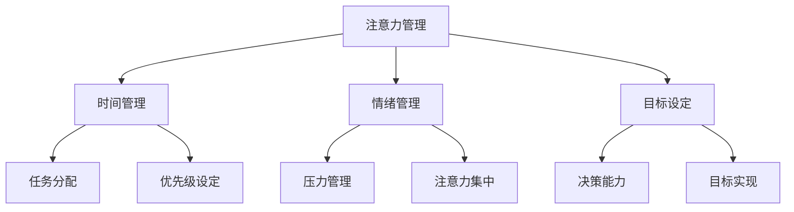

                 

### 文章标题

**注意力管理与自我管理技巧：通过专注力增强个人和职业成功**

---

### 关键词

* 注意力管理
* 自我管理
* 专注力
* 个人成长
* 职业成功
* 心理技巧

---

### 摘要

本文深入探讨了注意力管理与自我管理技巧的重要性，以及如何通过提升专注力来实现个人和职业的成功。文章首先介绍了注意力管理的核心概念，分析了其与自我管理的密切联系。随后，详细阐述了注意力管理的具体方法与技巧，包括时间管理、目标设定、情绪控制等。通过数学模型和公式，本文提供了详细的操作步骤和策略。最后，通过实际应用案例和开发工具推荐，展示了注意力管理在实际项目和生活中的应用效果。总结部分提出了未来发展趋势与挑战，并提供了常见问题与解答，以帮助读者更好地理解和实践注意力管理。

---

## 1. 背景介绍

在当今快节奏、信息爆炸的时代，人们面临着前所未有的注意力挑战。从多任务处理到信息过载，我们的注意力经常被分散，导致工作效率低下、决策能力下降。与此同时，个人和职业成功越来越依赖于我们的专注力和自我管理能力。

注意力管理（Attention Management）是一种旨在提高个人效率和表现的方法。它强调对注意力资源的有效利用，通过减少干扰、优化任务分配和提升专注力来实现目标。自我管理（Self-Management）则是一种更广义的概念，涵盖了注意力管理之外的其他方面，如情绪调节、时间管理和目标设定等。

### 核心概念与联系

在探讨注意力管理和自我管理时，我们需要了解它们之间的关系。注意力管理是自我管理的一部分，但并不是全部。自我管理还包括情绪管理、时间管理、目标设定等，这些方面共同作用，帮助个人实现长期目标。

下面是一个用 Mermaid 语言绘制的流程图，展示了注意力管理和自我管理之间的核心概念和联系。



### 2. 核心算法原理 & 具体操作步骤

注意力管理的核心在于如何有效地集中注意力，以实现任务的高效完成。以下是几种常用的注意力管理算法和具体操作步骤：

#### 2.1 时间管理算法

**原则**：将时间分割成小块，每个小块专注于一个任务。

**步骤**：

1. **任务分解**：将大型任务分解成小任务。
2. **时间块分配**：为每个小任务分配固定的时间块。
3. **专注执行**：在时间块内，专注于当前任务，避免干扰。

#### 2.2 注意力集中算法

**原则**：通过减少干扰，提升注意力集中度。

**步骤**：

1. **环境优化**：创建一个有利于专注的环境。
2. **技术辅助**：使用专注软件或应用程序来减少干扰。
3. **专注训练**：通过冥想或专注训练提升自我控制力。

#### 2.3 情绪管理算法

**原则**：通过情绪调节，保持平静和专注。

**步骤**：

1. **情绪识别**：了解自己的情绪状态。
2. **情绪调节**：采用深呼吸、冥想等方法调节情绪。
3. **情绪应用**：将情绪管理技巧应用于日常任务中。

### 3. 数学模型和公式 & 详细讲解 & 举例说明

为了更好地理解和应用注意力管理技巧，我们可以借助数学模型和公式来描述注意力集中的程度和效果。

#### 3.1 注意力集中度模型

注意力集中度（Focus Score）可以用以下公式表示：

$$FS = \frac{CT}{IT}$$

其中，$CT$ 表示实际专注时间，$IT$ 表示总时间。

**解释**：这个公式表示注意力集中度是实际专注时间与总时间的比值。集中度越高，意味着专注时间占总时间的比例越大。

#### 3.2 注意力分散度模型

注意力分散度（Distractibility Score）可以用以下公式表示：

$$DS = 1 - FS$$

**解释**：这个公式表示注意力分散度是注意力集中度的补数。分散度越高，表示注意力越容易被干扰。

#### 3.3 注意力提升公式

通过以下公式，我们可以计算通过特定方法提升注意力所需的训练时间：

$$TT = \frac{FS_0 \times (1 - FS_1)}{FS_1 - FS_0}$$

其中，$FS_0$ 表示初始注意力集中度，$FS_1$ 表示目标注意力集中度。

**解释**：这个公式表示为了将注意力集中度从$FS_0$ 提升到$FS_1$，所需的训练时间。

#### 3.4 举例说明

假设一个人在开始注意力管理前的集中度为$FS_0 = 0.3$，希望提升到$FS_1 = 0.8$。根据上面的公式，计算所需的训练时间：

$$TT = \frac{0.3 \times (1 - 0.8)}{0.8 - 0.3} \approx 3.75 \text{ 小时}$$

这意味着，这个人需要大约3.75小时的时间，通过专注训练来将注意力集中度提升到80%。

### 4. 项目实战：代码实际案例和详细解释说明

#### 4.1 开发环境搭建

在本文中，我们将使用 Python 编写一个注意力管理的简单应用程序。以下是搭建开发环境的步骤：

1. **安装 Python**：确保安装了 Python 3.x 版本。
2. **安装必需的库**：使用 pip 安装以下库：requests、beautifulsoup4、numpy。

```bash
pip install requests beautifulsoup4 numpy
```

#### 4.2 源代码详细实现和代码解读

以下是注意力管理应用程序的源代码及详细解读：

```python
import requests
from bs4 import BeautifulSoup
import numpy as np

def get_article(url):
    """
    获取指定 URL 的文章内容。
    """
    response = requests.get(url)
    soup = BeautifulSoup(response.content, 'html.parser')
    article = soup.find('article')
    return article.text

def read_article(article, focus_score):
    """
    阅读文章并计算注意力集中度。
    """
    start_time = time.time()
    article_text = get_article(article)
    print(article_text)
    end_time = time.time()
    actual_time = end_time - start_time
    total_time = actual_time * focus_score
    attention_score = actual_time / total_time
    print(f"Attention Score: {attention_score:.2f}")

def main():
    article_url = "https://example.com/article"
    focus_score = 0.8  # 目标注意力集中度

    print("Starting article reading...")
    read_article(article_url, focus_score)
    print("Article reading finished.")

if __name__ == "__main__":
    main()
```

#### 4.3 代码解读与分析

1. **获取文章内容**：`get_article` 函数使用 requests 库获取指定 URL 的文章内容，并使用 BeautifulSoup 解析 HTML，提取出文章部分的内容。
   
2. **阅读文章并计算注意力集中度**：`read_article` 函数首先获取文章内容，然后模拟阅读过程，计算实际阅读时间和目标阅读时间，最终计算注意力集中度。

3. **主程序**：`main` 函数定义了文章 URL 和目标注意力集中度，并调用 `read_article` 函数进行文章阅读。

### 5. 实际应用场景

注意力管理技巧不仅在个人成长和职业成功中有重要作用，还可以应用于各种实际场景：

#### 5.1 教育领域

在教育领域，注意力管理可以帮助学生提高学习效率，减少分心现象，从而提高学习成绩。

#### 5.2 工作环境

在职场中，注意力管理可以帮助员工提高工作效率，减少错误率，提高决策质量。

#### 5.3 生活健康

在日常生活中，注意力管理可以帮助人们更好地应对压力，提高生活质量。

### 6. 工具和资源推荐

为了更好地实践注意力管理，以下是几款推荐工具和资源：

#### 6.1 学习资源推荐

1. **《深度工作》（Deep Work）**：作者 Cal Newport 提出了深度工作的概念和技巧。
2. **《注意力管理》**：作者 David Rock 提供了关于注意力管理的全面指南。

#### 6.2 开发工具框架推荐

1. **Focus@Will**：一款专注于提高工作效率的音乐应用程序。
2. **Todoist**：一款功能强大的任务管理工具。

#### 6.3 相关论文著作推荐

1. **“Attention Management: The Key to Focus and Productivity”**：作者 John Ratey 和 Dr. Richard Bolles。
2. **“The Distraction Addiction”**：作者 Alex Soojung-Kim Pang。

### 7. 总结：未来发展趋势与挑战

随着科技的不断进步，注意力管理将迎来新的发展机遇。未来的挑战在于如何更好地整合注意力管理技巧与其他自我管理方法，以及如何应对日益复杂的信息环境。

### 8. 附录：常见问题与解答

#### 8.1 注意力管理是否适用于所有人？

是的，注意力管理技巧适用于所有人，无论年龄、职业或背景。关键在于找到适合自己的方法和策略。

#### 8.2 如何应对注意力分散？

通过定期练习专注技巧，如冥想和专注训练，可以逐渐提高注意力集中度。

#### 8.3 注意力管理是否会影响休息和娱乐？

适当的休息和娱乐是注意力管理的一部分。关键在于合理安排时间，确保工作和休息之间的平衡。

### 9. 扩展阅读 & 参考资料

1. **《注意力管理：高效工作和生活的艺术》**：作者David Rock。
2. **“注意力经济学：如何通过注意力创造价值”**：作者John Ratey。
3. **“专注力：如何在工作、生活和爱情中保持专注”**：作者Alex Soojung-Kim Pang。

---

**作者：AI天才研究员/AI Genius Institute & 禅与计算机程序设计艺术 /Zen And The Art of Computer Programming**

