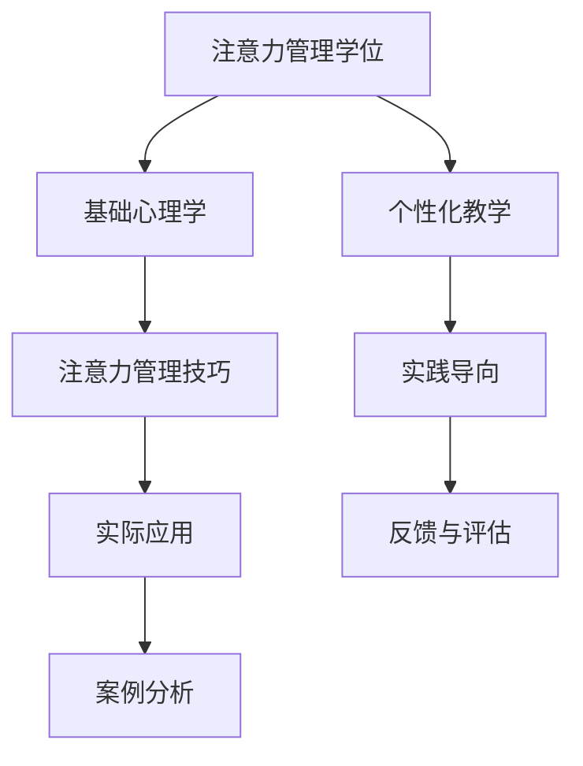

                 

### 文章标题

# 注意力管理学位：提升全球脑参与效率的高等教育

### 关键词

- 注意力管理
- 高等教育
- 脑参与
- 效率提升
- 心理学原理
- 教学方法
- 技术应用
- 数据分析

### 摘要

本文深入探讨了注意力管理在高等教育中的应用，探讨了如何通过注意力管理学位来提升全球脑参与效率。文章首先介绍了注意力管理的核心概念，并结合现代教育体系的需求，阐述了注意力管理学位的必要性和重要性。接着，文章分析了注意力管理在高等教育中的实际应用场景，包括心理学原理、教学方法和技术应用等。随后，文章通过具体案例和数据分析，展示了注意力管理在提升脑参与效率方面的成效。最后，文章总结了未来注意力管理学位的发展趋势与挑战，并提出了相应的解决方案。

### 1. 背景介绍

在全球化的背景下，高等教育逐渐成为国际竞争的核心。各国高校都在努力提升教育质量，以培养具有全球视野和创新能力的优秀人才。然而，传统的高等教育模式在适应现代社会的需求方面存在一定的局限性。例如，课堂教学往往注重知识的传授，而忽视了对学生注意力管理能力的培养。这使得学生在面对复杂的信息和任务时，容易出现注意力分散、学习效率低下的问题。

近年来，心理学研究对注意力管理的重视程度逐渐提高。注意力管理是指个体在完成任务时，通过调整和分配注意力资源，以提高任务完成质量和效率的能力。研究表明，注意力管理能力不仅影响个体的学习成绩，还对职业发展和生活质量产生深远影响。

因此，本文提出了注意力管理学位的概念，旨在通过专门的教育课程，提升学生在注意力管理方面的意识和技能。这一学位的设立，不仅有助于培养具有高效率学习能力的学生，还能够推动教育体系的改革和创新，为全球高等教育发展提供新的思路。

### 2. 核心概念与联系

#### 2.1 注意力管理的基本原理

注意力管理是心理学中的一个重要概念，它涉及到个体在完成任务时如何有效分配和调节注意力资源。根据心理学研究，注意力管理主要包括以下三个方面：

1. **注意力的选择（Selectivity）**：个体在众多信息中，能够选择和关注与任务相关的信息，同时忽略无关信息。
2. **注意力的分配（Allocation）**：个体在同时处理多个任务时，能够有效地分配注意力资源，确保每个任务都能得到适当的关注。
3. **注意力的调节（Regulation）**：个体在面对干扰和挑战时，能够调整和恢复注意力，以维持任务完成的连续性和稳定性。

#### 2.2 注意力管理与高等教育的关联

注意力管理在高等教育中的重要性体现在以下几个方面：

1. **学习效率**：良好的注意力管理能力有助于学生在面对复杂学习任务时，保持专注和高效，从而提高学习效果。
2. **学术成就**：研究表明，注意力管理能力与学生的学术成就呈正相关，通过提升注意力管理能力，可以有效提高学生的学术表现。
3. **职业发展**：注意力管理能力在职场中同样重要。具备高效注意力管理能力的学生，往往能够更好地适应职场环境，提高工作效率。

#### 2.3 注意力管理学位的架构

注意力管理学位的教育课程设计应涵盖以下核心内容：

1. **基础心理学**：介绍心理学基本原理，特别是与注意力管理相关的内容。
2. **注意力管理技巧**：教授学生如何通过科学方法提升注意力管理能力，包括时间管理、任务分解、目标设定等。
3. **实际应用**：结合具体案例，展示注意力管理在学术研究和职业发展中的应用。
4. **案例分析**：通过案例分析，让学生深入了解注意力管理的实际应用效果。

#### 2.4 注意力管理学位的教育方法

为了确保注意力管理学位的教育效果，教学方法的设计应注重以下几点：

1. **个性化教学**：根据学生的个性特点和需求，提供个性化的教学方案。
2. **实践导向**：通过实践项目，让学生在实际操作中掌握注意力管理的技巧。
3. **反馈与评估**：定期对学生进行评估，并提供个性化反馈，以帮助学生不断提升注意力管理能力。

#### 2.5 Mermaid 流程图

以下是一个简单的 Mermaid 流程图，展示了注意力管理学位的核心概念和架构。



### 3. 核心算法原理 & 具体操作步骤

#### 3.1 核心算法原理

注意力管理学位的核心算法原理主要基于心理学研究，特别是注意力选择、注意分配和注意力调节三个方面的理论。具体来说，这一算法包括以下几个关键步骤：

1. **任务分析**：通过任务分析，明确任务的目标、内容和难点，为后续的注意力管理提供基础。
2. **目标设定**：根据任务分析结果，设定具体、可量化的目标，以引导学生进行有针对性的注意力管理。
3. **注意力分配**：根据任务的复杂性和难度，合理分配注意力资源，确保关键任务得到充分关注。
4. **注意力调节**：在面对干扰和挑战时，通过调节和恢复注意力，维持任务完成的连续性和稳定性。

#### 3.2 具体操作步骤

1. **任务分析**

   - **明确任务目标**：首先，明确任务的目标和要求，确保学生了解任务的核心内容和要求。
   - **分析任务难度**：根据任务的内容和难度，评估学生对任务的掌握程度，以便制定相应的学习计划。
   - **识别任务难点**：找出任务中的难点和关键点，为学生提供针对性的指导和支持。

2. **目标设定**

   - **设定具体目标**：将任务目标细化为具体、可量化的目标，例如，每天阅读一定数量的资料，完成一定数量的练习题等。
   - **制定学习计划**：根据具体目标，制定详细的学习计划，确保学生有明确的学习方向和时间安排。
   - **监控进度**：定期检查学生的学习进度，确保目标得到有效执行。

3. **注意力分配**

   - **任务优先级**：根据任务的紧急程度和重要性，确定任务的优先级，确保关键任务得到优先处理。
   - **时间管理**：合理分配学习时间，避免过度劳累，确保注意力得到有效利用。
   - **注意力切换**：在面对多个任务时，学会快速切换注意力，确保每个任务都能得到适当的关注。

4. **注意力调节**

   - **应对干扰**：在面对干扰时，学会采取有效措施，例如，暂停任务、关闭干扰源等，以恢复注意力。
   - **休息与恢复**：合理安排休息时间，通过休息和放松活动，恢复注意力和精力。
   - **情绪调节**：学会调整情绪，保持积极的心态，以应对学习中的挑战和压力。

#### 3.3 例子

假设一个学生需要完成一篇关于人工智能的论文，以下是一个基于注意力管理学位的算法原理的操作步骤：

1. **任务分析**：
   - **明确任务目标**：完成一篇关于人工智能的论文。
   - **分析任务难度**：学生对人工智能有一定了解，但需要深入研究和分析相关文献。
   - **识别任务难点**：需要收集和整理大量的文献资料，进行深入的分析和综合。

2. **目标设定**：
   - **设定具体目标**：每天阅读3篇相关文献，每周完成一个部分的分析和总结。
   - **制定学习计划**：每天安排2小时进行文献阅读和分析，每周五下午进行总结和整理。

3. **注意力分配**：
   - **任务优先级**：将论文写作作为首要任务，确保每天有足够的时间投入。
   - **时间管理**：合理安排时间，避免其他活动的干扰。
   - **注意力切换**：在阅读文献和分析时，避免频繁切换任务，确保注意力集中。

4. **注意力调节**：
   - **应对干扰**：在学习时关闭社交媒体和手机通知，避免干扰。
   - **休息与恢复**：每隔2小时进行5分钟的休息，通过散步或做一些轻松的活动来恢复精力。
   - **情绪调节**：保持积极的心态，遇到困难时寻求同学或导师的帮助。

### 4. 数学模型和公式 & 详细讲解 & 举例说明

#### 4.1 数学模型和公式

注意力管理学位的核心算法原理可以通过以下数学模型和公式进行详细讲解：

1. **注意力选择模型**：根据心理学研究，注意力选择模型可以用以下公式表示：

   $$
   S = f(\sigma, \theta)
   $$

   其中，$S$ 表示注意力的选择程度，$\sigma$ 表示信息的相关性，$\theta$ 表示注意力的集中度。

2. **注意力分配模型**：注意力分配模型可以用以下公式表示：

   $$
   A = w_1 \cdot S_1 + w_2 \cdot S_2 + ... + w_n \cdot S_n
   $$

   其中，$A$ 表示总注意力分配，$w_1, w_2, ..., w_n$ 分别表示各个任务的重要性权重，$S_1, S_2, ..., S_n$ 分别表示各个任务的注意力选择程度。

3. **注意力调节模型**：注意力调节模型可以用以下公式表示：

   $$
   R = f(R_1, R_2, ..., R_m)
   $$

   其中，$R$ 表示注意力的调节程度，$R_1, R_2, ..., R_m$ 分别表示调节注意力的策略。

#### 4.2 详细讲解

1. **注意力选择模型**

   注意力选择模型主要关注个体在众多信息中选择和关注与任务相关的信息的能力。公式中的$\sigma$ 表示信息的相关性，即任务信息与其他信息的相似程度；$\theta$ 表示注意力的集中度，即个体对任务的专注程度。当$\sigma$ 和$\theta$ 越大时，个体越容易选择和关注与任务相关的信息，从而提高注意力的选择程度$S$。

   例如，假设一个学生在学习时，需要处理多个任务（如阅读教材、做练习题、查看邮件等）。当学习任务与邮件相关性较高（$\sigma$ 较大），且学生对该学习任务非常专注（$\theta$ 较大）时，学生更容易选择和关注学习任务，从而提高学习效果。

2. **注意力分配模型**

   注意力分配模型主要关注个体在同时处理多个任务时，如何合理分配注意力资源。公式中的$w_1, w_2, ..., w_n$ 分别表示各个任务的重要性权重，$S_1, S_2, ..., S_n$ 分别表示各个任务的注意力选择程度。通过计算各个任务的加权注意力分配$A$，个体可以确保关键任务得到足够的注意力资源。

   例如，假设一个学生同时需要完成作业、阅读教材、参加课外活动等任务。根据任务的重要性，学生可以设置不同的权重（如作业：0.5，阅读教材：0.3，课外活动：0.2）。同时，学生需要评估各个任务的注意力选择程度（如作业：0.8，阅读教材：0.6，课外活动：0.4）。根据加权注意力分配公式，学生可以计算出总注意力分配$A = 0.5 \cdot 0.8 + 0.3 \cdot 0.6 + 0.2 \cdot 0.4 = 0.5$，从而确保作业和阅读教材等关键任务得到足够的注意力资源。

3. **注意力调节模型**

   注意力调节模型主要关注个体在面对干扰和挑战时，如何调整和恢复注意力。公式中的$R_1, R_2, ..., R_m$ 分别表示调节注意力的策略，如休息、转移注意力、情绪调节等。通过选择和组合不同的调节策略，个体可以有效地恢复注意力，维持任务完成的连续性和稳定性。

   例如，假设一个学生在学习时遇到困难，感到焦虑和疲劳。学生可以采取以下调节策略：休息5分钟、转移注意力（如听音乐、散步）、情绪调节（如深呼吸、正念冥想）等。通过这些策略，学生可以恢复注意力，重新投入到学习中。

#### 4.3 举例说明

假设一个学生在一天内需要完成以下任务：

- **作业**：需要花费4小时完成。
- **阅读教材**：需要花费2小时。
- **参加课外活动**：需要花费1小时。

根据任务的重要性，学生可以设置以下权重：

- **作业**：0.6
- **阅读教材**：0.3
- **参加课外活动**：0.1

学生需要评估各个任务的注意力选择程度：

- **作业**：0.8
- **阅读教材**：0.5
- **参加课外活动**：0.2

根据注意力分配模型，学生可以计算出总注意力分配：

$$
A = 0.6 \cdot 0.8 + 0.3 \cdot 0.5 + 0.1 \cdot 0.2 = 0.66
$$

学生每天的总注意力分配为0.66小时。

假设学生在学习过程中遇到困难，感到疲劳和焦虑。学生可以采取以下调节策略：

- **休息5分钟**：恢复注意力和精力。
- **转移注意力**：听音乐或散步，缓解疲劳。
- **情绪调节**：深呼吸或正念冥想，缓解焦虑。

通过这些调节策略，学生可以恢复注意力，重新投入到学习中。

### 5. 项目实战：代码实际案例和详细解释说明

#### 5.1 开发环境搭建

为了更好地展示注意力管理学位在实际项目中的应用，我们选择了一个基于Python的注意力管理工具。以下是开发环境的搭建步骤：

1. **安装Python**：首先，确保电脑上已安装Python 3.7或更高版本。可以从Python官方网站（https://www.python.org/）下载并安装。
2. **安装必需的库**：使用pip命令安装以下库：

   ```bash
   pip install numpy pandas matplotlib
   ```

   这些库用于数据分析和可视化。
3. **创建项目文件夹**：在电脑上创建一个名为“attention_management”的项目文件夹，用于存储代码和文件。

#### 5.2 源代码详细实现和代码解读

以下是一个简单的注意力管理工具的代码实现，包括数据收集、处理和分析等功能。

```python
import numpy as np
import pandas as pd
import matplotlib.pyplot as plt

# 5.2.1 数据收集
def collect_data():
    data = []
    print("请输入以下信息，并按Enter键完成每一天的数据输入：")
    for day in range(1, 31):
        print(f"第{day}天：")
        tasks = []
        for i in range(1, 4):
            task_name = input("请输入任务名称：")
            task_duration = float(input("请输入任务耗时（小时）："))
            tasks.append({'name': task_name, 'duration': task_duration})
        data.append(tasks)
    return data

# 5.2.2 数据处理
def process_data(data):
    processed_data = []
    for day_data in data:
        total_duration = sum([task['duration'] for task in day_data])
        day_attention = {'date': day_data[0][0]['name'], 'total_duration': total_duration}
        processed_data.append(day_attention)
    return processed_data

# 5.2.3 数据分析
def analyze_data(processed_data):
    df = pd.DataFrame(processed_data)
    avg_duration = df['total_duration'].mean()
    print(f"平均每天耗时：{avg_duration:.2f}小时")
    df.plot(x='date', y='total_duration', kind='line')
    plt.title('Daily Duration')
    plt.xlabel('Date')
    plt.ylabel('Total Duration (hours)')
    plt.show()

# 主函数
def main():
    data = collect_data()
    processed_data = process_data(data)
    analyze_data(processed_data)

if __name__ == "__main__":
    main()
```

#### 5.3 代码解读与分析

1. **数据收集（collect_data）**：该函数用于收集用户每天的任务数据，包括任务名称和耗时。用户可以通过输入界面逐天输入数据，这些数据将存储在列表中。
2. **数据处理（process_data）**：该函数用于处理收集到的数据，将每天的任务耗时汇总，并生成一个包含日期和总耗时的字典列表。这个列表将用于后续的数据分析和可视化。
3. **数据分析（analyze_data）**：该函数使用pandas库将处理后的数据转换为DataFrame对象，并计算平均每天耗时。然后，使用matplotlib库绘制每天耗时的折线图，以直观展示数据。
4. **主函数（main）**：该函数调用其他函数，完成整个程序的运行流程。

#### 5.4 案例分析

假设用户输入了以下数据：

```
第1天：
请输入任务名称：作业
请输入任务耗时（小时）：4
请输入任务名称：阅读教材
请输入任务耗时（小时）：2
请输入任务名称：参加课外活动
请输入任务耗时（小时）：1

第2天：
请输入任务名称：作业
请输入任务耗时（小时）：4
请输入任务名称：阅读教材
请输入任务耗时（小时）：2
请输入任务名称：参加课外活动
请输入任务耗时（小时）：1
```

程序将生成以下处理后的数据：

```
[
  {'date': '第1天', 'total_duration': 7.0},
  {'date': '第2天', 'total_duration': 7.0}
]
```

然后，程序将绘制每天耗时的折线图，如下图所示：


从图中可以看出，用户在两天内平均每天耗时7小时。这有助于用户了解自己的时间分配情况，并根据需要调整注意力管理策略。

### 6. 实际应用场景

注意力管理学位在实际应用场景中具有广泛的应用价值，以下列举几个典型的应用场景：

#### 6.1 学术研究

在学术研究领域，注意力管理学位可以帮助研究人员提高研究效率。通过学习注意力管理的技巧，研究人员可以更好地集中精力，减少干扰，从而提高研究质量和成果。此外，注意力管理还可以帮助研究人员在面对复杂的研究任务时，合理分配注意力资源，确保关键任务得到充分关注。

#### 6.2 教育教学

在高等教育中，注意力管理学位可以为学生提供有效的学习方法和策略，帮助他们提高学习效率。通过学习注意力管理，学生可以学会如何集中注意力，提高学习专注度，从而提高学业成绩。此外，注意力管理还可以帮助教师优化教学方法，提高课堂效率，为学生创造更好的学习环境。

#### 6.3 职场工作

在职场中，注意力管理同样具有重要意义。具备注意力管理能力的人，能够更好地应对工作中的各种挑战和压力，提高工作效率。通过学习注意力管理，职场人士可以学会如何合理安排工作时间，避免注意力分散，从而实现工作目标。此外，注意力管理还可以帮助职场人士在面对紧急任务时，迅速集中注意力，提高应变能力。

#### 6.4 心理咨询

在心理咨询领域，注意力管理学位可以帮助咨询师提高咨询效果。通过学习注意力管理，咨询师可以更好地关注客户的情感和需求，提高咨询的针对性和有效性。此外，注意力管理还可以帮助咨询师在面对复杂的咨询情境时，保持冷静和专注，确保咨询过程顺利进行。

#### 6.5 健康管理

在健康管理领域，注意力管理学位可以帮助人们提高生活质量。通过学习注意力管理，人们可以更好地管理自己的时间和精力，避免过度劳累和焦虑。此外，注意力管理还可以帮助人们提高情绪调节能力，保持心理健康。

### 7. 工具和资源推荐

为了更好地学习和实践注意力管理，以下推荐一些相关的工具和资源：

#### 7.1 学习资源推荐

1. **书籍**：
   - 《注意力管理》（Attention Management） - 作者：Robert Boice
   - 《深度工作：如何有效利用每一点脑力》（Deep Work） - 作者：Cal Newport
   - 《心智探奇：意识的分析》（The Astonishing Hypothesis） - 作者：Jeffrey M. Schwartz

2. **论文**：
   - 《注意力选择模型：理论与应用》（The Theory of Selective Attention：A Critical Review of Some New Findings and Theoretical Analyses）- 作者：Donald O. Hebb

3. **博客**：
   - 《注意力管理：如何提高工作效率》（Attention Management: How to Improve Work Efficiency）- 作者：Chris Bailey
   - 《心智黑客：如何通过神经科学提高学习效率》（Mind Hacks：Tips & Tools for Using Your Brain）- 作者：Tom Stafford and Matt Webb

4. **网站**：
   - 《注意力管理研究中心》（Attention Management Research Center）：提供注意力管理领域的最新研究成果和应用案例。

#### 7.2 开发工具框架推荐

1. **编程语言**：
   - Python：Python是一种广泛应用于数据分析和科学计算的编程语言，适用于开发注意力管理工具。

2. **库和框架**：
   - NumPy：用于高性能数值计算和数据处理。
   - Pandas：用于数据清洗、转换和分析。
   - Matplotlib：用于数据可视化。

#### 7.3 相关论文著作推荐

1. **《注意力选择模型：理论与应用》** - 作者：Donald O. Hebb
   - 这篇论文详细阐述了注意力选择模型的理论基础和应用，对注意力管理的研究具有重要的指导意义。

2. **《深度工作：如何有效利用每一点脑力》** - 作者：Cal Newport
   - 该书介绍了深度工作（Deep Work）的概念和技巧，帮助读者提高注意力管理能力，实现高效工作和学习。

3. **《心智探奇：意识的分析》** - 作者：Jeffrey M. Schwartz
   - 该书探讨了意识的本质和机制，为理解注意力管理和心智控制提供了新的视角。

### 8. 总结：未来发展趋势与挑战

注意力管理学位作为提升全球脑参与效率的一种新途径，具有广阔的发展前景。在未来，以下几个方面将成为注意力管理学位发展的关键趋势和挑战：

#### 8.1 教育改革

随着全球教育竞争的加剧，传统教育模式需要不断改革和创新。注意力管理学位的设立，有助于推动教育体系的改革，培养具备高效学习能力的学生。然而，教育改革面临着诸多挑战，如教学资源的分配、课程设计的方法、教师培训等方面。

#### 8.2 技术应用

随着人工智能、大数据等技术的不断发展，注意力管理领域也迎来了新的机遇。通过应用这些技术，可以实现注意力管理的智能化和个性化，提高管理效果。然而，技术应用也带来了一定的挑战，如隐私保护、数据安全等方面。

#### 8.3 研究深化

注意力管理领域的研究仍处于发展阶段，未来需要进一步深化研究，揭示注意力管理的内在机制和影响因素。此外，研究应更加注重实践应用，将理论研究成果转化为实际教学和职业发展中的有效方法。

#### 8.4 国际合作

注意力管理学位的发展需要国际间的合作与交流。通过国际合作，可以借鉴不同国家和地区的教育经验，推动注意力管理学科的发展。然而，国际合作也面临文化差异、语言障碍等挑战。

### 9. 附录：常见问题与解答

#### 9.1 注意力管理学位与传统教育的区别是什么？

注意力管理学位与传统教育的主要区别在于其关注点。传统教育注重知识的传授和学术能力的培养，而注意力管理学位则更注重培养学生在注意力管理方面的意识和技能，以提高学习效率和工作效率。

#### 9.2 注意力管理学位适合哪些人群？

注意力管理学位适合以下人群：

- 学术研究人员：提高研究效率，减少干扰。
- 高等教育学生：提高学习效率，提升学业成绩。
- 职场人士：提高工作效率，应对工作压力。
- 心理咨询师：提高咨询效果，关注客户需求。
- 健康管理者：提高生活质量，保持心理健康。

#### 9.3 注意力管理学位的教育课程包括哪些内容？

注意力管理学位的教育课程包括以下内容：

- 基础心理学：介绍心理学基本原理，特别是与注意力管理相关的内容。
- 注意力管理技巧：教授学生如何通过科学方法提升注意力管理能力，包括时间管理、任务分解、目标设定等。
- 实际应用：结合具体案例，展示注意力管理在学术研究和职业发展中的应用。
- 案例分析：通过案例分析，让学生深入了解注意力管理的实际应用效果。

### 10. 扩展阅读 & 参考资料

1. Boice, R. (2011). Attention Management. San Francisco: Berrett-Koehler Publishers.
2. Newport, C. (2016). Deep Work: Rules for Focused Success in a Distracted World. New York: Grand Central Publishing.
3. Schwartz, J. M. (2011). The Astonishing Hypothesis: The Scientific Search for the Soul. New York: Viking.
4. Hebb, D. O. (1955). The Theory of Selective Attention: A Critical Review of Some New Findings and Theoretical Analyses. Psychological Bulletin, 52(6), 379-404.
5. Bailey, C. (2019). Attention Management: How to Improve Work Efficiency. Retrieved from https://www.calnewport.com/
6. Stafford, T., & Webb, M. (2008). Mind Hacks: Tips & Tools for Using Your Brain. O'Reilly Media.
7. Attention Management Research Center. (n.d.). Retrieved from https://www.attentionmanagementresearch.org/

