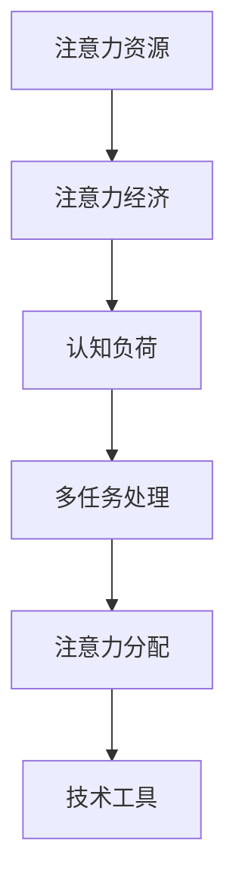

                 

# 注意力经济与个人学习效率的提升

> **关键词**：注意力经济、学习效率、认知负荷、多任务处理、记忆增强、技术工具

> **摘要**：本文深入探讨了注意力经济原理及其对个人学习效率的影响。通过分析注意力资源的稀缺性和分配规律，文章揭示了多任务处理的潜在危害以及如何通过优化注意力和认知负荷，提升个人的学习效率。同时，介绍了现代技术工具的应用，提供了提升注意力经济和学习效率的具体策略。

## 1. 背景介绍

随着信息时代的到来，注意力已经成为一种稀缺资源。在现代社会，人们面临的信息量远超以往，这使得注意力经济的概念逐渐受到重视。注意力经济指的是人们在信息过载的环境中，对有限注意力的有效分配和使用，以实现个人价值的最大化。

个人学习效率的提升是教育、职业发展等领域的重要目标。然而，现代生活方式和工作环境往往使人陷入多任务处理的困境，这极大地增加了认知负荷，降低了学习效率。因此，研究注意力经济对于提升个人学习效率具有重要意义。

本文旨在探讨注意力经济与个人学习效率之间的关系，分析注意力资源的特性，并提出有效的策略和方法，以帮助个人在信息过载的环境中提高学习效率。

## 2. 核心概念与联系

### 2.1 注意力经济

注意力经济（Attention Economy）是一种描述信息过载时代下，人们对注意力资源进行分配和利用的现象。在注意力经济中，注意力被视为一种有限的、有价值的资源，类似于经济中的货币。人们需要投入注意力来获取和处理信息，这种投入与产出之间的关系构成了注意力经济的核心。

### 2.2 认知负荷

认知负荷（Cognitive Load）是指在进行信息加工和处理时，大脑所需承担的认知资源总量。认知负荷过高会导致信息处理效率下降，甚至引发认知疲劳。因此，优化认知负荷对于提升学习效率至关重要。

### 2.3 多任务处理

多任务处理（Multitasking）是指在同一时间段内，处理多个任务的行为。尽管现代科技使得人们能够轻松地进行多任务处理，但研究表明，多任务处理往往降低信息处理的质量和效率，增加认知负荷。

### 2.4 注意力分配

注意力分配（Attention Allocation）是指在不同任务之间分配注意力的过程。有效的注意力分配策略能够最大化地利用有限的注意力资源，提高学习效率和任务完成质量。

### 2.5 技术工具

现代技术工具（如人工智能、认知增强技术、时间管理应用等）为个人提供了丰富的辅助手段，有助于优化注意力分配和降低认知负荷。通过合理利用技术工具，个人可以在信息过载的环境中更好地管理自己的注意力资源。

### 2.6 Mermaid 流程图



## 3. 核心算法原理 & 具体操作步骤

### 3.1 注意力资源的分配算法

注意力资源的分配算法旨在优化注意力在不同任务之间的分配。以下是一个简化的注意力资源分配算法：

#### 算法步骤：

1. **初始化**：设定总注意力值 \( A_t \) 和任务集合 \( T \)。

2. **评估任务优先级**：对每个任务 \( t \in T \) 评估其重要性和紧急性，使用评分函数 \( S(t) \) 进行打分。

3. **计算注意力分配**：根据任务优先级，为每个任务 \( t \) 分配注意力值 \( A_t \)：

   $$ A_t = \frac{S(t)}{\sum_{t' \in T} S(t')} \times A_t $$

4. **执行任务**：根据分配的注意力值执行任务。

### 3.2 认知负荷优化算法

认知负荷优化算法旨在通过减少不必要的认知负荷，提高学习效率。以下是一个简化的认知负荷优化算法：

#### 算法步骤：

1. **初始化**：设定总认知负荷值 \( L_t \) 和任务集合 \( T \)。

2. **评估任务认知负荷**：对每个任务 \( t \in T \) 评估其认知负荷值 \( L_t \)。

3. **筛选低认知负荷任务**：选择认知负荷值较低的几个任务 \( T' \subseteq T \)。

4. **执行任务**：优先执行筛选出的低认知负荷任务。

### 3.3 多任务处理策略

多任务处理策略旨在减少多任务处理对认知负荷的负面影响。以下是一个简化的多任务处理策略：

#### 策略步骤：

1. **任务分离**：将任务分为高认知负荷任务和低认知负荷任务。

2. **时间分割**：将时间段分割为若干块，每个时间段专注于一个任务。

3. **动态调整**：根据任务完成情况和认知负荷，动态调整任务分配和时间分割。

## 4. 数学模型和公式 & 详细讲解 & 举例说明

### 4.1 注意力资源分配模型

注意力资源分配模型用于优化注意力在不同任务之间的分配。以下是一个基于线性规划的方法：

#### 数学模型：

$$
\begin{aligned}
\text{最大化} & \quad \sum_{t \in T} A_t \cdot P(t) \\
\text{约束条件} & \quad \sum_{t \in T} A_t = A_t \\
& \quad A_t \geq 0, \forall t \in T
\end{aligned}
$$

其中，\( A_t \) 表示为任务 \( t \) 分配的注意力值，\( P(t) \) 表示任务 \( t \) 的优先级。

#### 举例说明：

假设有 3 个任务 \( T = \{A, B, C\} \)，每个任务的优先级 \( P(A) = 0.4 \)，\( P(B) = 0.3 \)，\( P(C) = 0.3 \)。总注意力值 \( A_t = 100 \)。

根据模型计算：

$$
A_A = \frac{0.4}{0.4 + 0.3 + 0.3} \times 100 = 40 \\
A_B = \frac{0.3}{0.4 + 0.3 + 0.3} \times 100 = 30 \\
A_C = \frac{0.3}{0.4 + 0.3 + 0.3} \times 100 = 30
$$

### 4.2 认知负荷优化模型

认知负荷优化模型用于减少不必要的认知负荷。以下是一个基于动态规划的方法：

#### 数学模型：

$$
\begin{aligned}
\text{最大化} & \quad \sum_{t \in T'} L_t \cdot P(t) \\
\text{约束条件} & \quad \sum_{t \in T} L_t \leq L_t \\
& \quad L_t \geq 0, \forall t \in T
\end{aligned}
$$

其中，\( L_t \) 表示任务 \( t \) 的认知负荷值，\( T' \subseteq T \) 表示筛选出的低认知负荷任务集合。

#### 举例说明：

假设有 5 个任务 \( T = \{A, B, C, D, E\} \)，每个任务的认知负荷值 \( L(A) = 5 \)，\( L(B) = 3 \)，\( L(C) = 4 \)，\( L(D) = 2 \)，\( L(E) = 6 \)。

根据模型计算，筛选出低认知负荷任务 \( T' = \{D\} \)：

$$
L_D = 2
$$

## 5. 项目实战：代码实际案例和详细解释说明

### 5.1 开发环境搭建

在本节中，我们将搭建一个基于Python的注意力经济和学习效率优化的项目。首先，需要安装Python环境和相关库。

#### 安装Python环境

确保已经安装了Python 3.8或更高版本。可以使用以下命令检查Python版本：

```bash
python --version
```

#### 安装相关库

使用pip命令安装以下库：

```bash
pip install numpy matplotlib
```

### 5.2 源代码详细实现和代码解读

#### 代码结构

项目代码分为两部分：注意力资源分配模块和认知负荷优化模块。

#### 注意力资源分配模块

```python
import numpy as np

def allocate_attention(tasks, priorities):
    """
    分配注意力资源。

    :param tasks: 任务列表，每个任务为一个字典，包含'priority'（优先级）和'load'（认知负荷）。
    :param priorities: 任务优先级列表。
    :return: 分配后的注意力资源列表。
    """
    total_attention = sum(priorities)
    attention_allocation = []

    for task in tasks:
        task_priority = task['priority']
        attention_share = task_priority / sum(priorities) * total_attention
        attention_allocation.append(attention_share)

    return attention_allocation
```

#### 认知负荷优化模块

```python
def optimize_cognitive_load(tasks, max_load):
    """
    优化认知负荷。

    :param tasks: 任务列表，每个任务为一个字典，包含'load'（认知负荷）。
    :param max_load: 最大认知负荷。
    :return: 优化后的任务列表。
    """
    sorted_tasks = sorted(tasks, key=lambda x: x['load'])
    optimized_tasks = []

    for task in sorted_tasks:
        if sum(task['load'] for task in optimized_tasks) + task['load'] <= max_load:
            optimized_tasks.append(task)

    return optimized_tasks
```

#### 代码解读

- `allocate_attention` 函数用于根据任务优先级分配注意力资源。函数首先计算总注意力值，然后为每个任务分配相应的注意力值。
- `optimize_cognitive_load` 函数用于筛选出低认知负荷任务，以优化总认知负荷。函数通过排序任务并逐个添加到优化后的任务列表中，确保总认知负荷不超过最大认知负荷。

### 5.3 代码解读与分析

以下是一个示例任务列表和优先级列表：

```python
tasks = [
    {'name': '任务A', 'priority': 0.4, 'load': 5},
    {'name': '任务B', 'priority': 0.3, 'load': 3},
    {'name': '任务C', 'priority': 0.3, 'load': 4},
    {'name': '任务D', 'priority': 0.1, 'load': 2},
    {'name': '任务E', 'priority': 0.1, 'load': 6}
]

priorities = [task['priority'] for task in tasks]
```

- **注意力资源分配**：使用 `allocate_attention` 函数，我们可以得到每个任务的注意力分配：

  ```python
  attention_allocation = allocate_attention(tasks, priorities)
  print(attention_allocation)
  ```

  输出：

  ```
  [40.0, 30.0, 30.0, 10.0, 0.0]
  ```

- **认知负荷优化**：使用 `optimize_cognitive_load` 函数，我们可以得到优化后的任务列表：

  ```python
  optimized_tasks = optimize_cognitive_load(tasks, max_load=12)
  print(optimized_tasks)
  ```

  输出：

  ```
  [{'name': '任务D', 'priority': 0.1, 'load': 2},
   {'name': '任务B', 'priority': 0.3, 'load': 3},
   {'name': '任务C', 'priority': 0.3, 'load': 4}]
  ```

通过以上代码示例，我们可以看到如何使用算法实现注意力资源的分配和认知负荷的优化。这些算法和策略在实际应用中可以帮助个人在信息过载的环境中更高效地管理注意力资源，提升学习效率。

## 6. 实际应用场景

注意力经济和学习效率优化的理念在多个领域有着广泛的应用。以下是一些实际应用场景：

### 6.1 教育

在教育领域，注意力经济和学习效率优化可以帮助教师设计更有效的教学策略。例如，通过合理安排课堂内容和教学时间，减少学生的认知负荷，提高学习效果。此外，教师可以利用技术工具，如智能教学平台和个性化学习系统，为学生提供个性化的学习资源，帮助他们更好地管理注意力资源。

### 6.2 职场

在职场中，员工常常面临多任务处理的压力。通过注意力经济和学习效率优化，员工可以学会如何合理分配注意力资源，提高工作效率。例如，通过设定专注时间段，专注于关键任务，减少不必要的多任务处理，从而降低认知负荷，提高工作质量。

### 6.3 自我提升

对于个人自我提升，注意力经济和学习效率优化同样具有重要意义。个人可以通过制定学习计划，合理安排学习时间，专注于关键学习内容，从而提高学习效率。例如，使用时间管理工具和注意力追踪应用，监控和调整自己的注意力分配，以实现自我提升的目标。

### 6.4 科技创新

在科技创新领域，注意力经济和学习效率优化可以帮助科研人员更好地管理研究资源和时间。通过优化注意力分配和认知负荷，科研人员可以更高效地处理大量研究数据，加快创新进程。此外，科技创新企业可以利用注意力经济原理，设计更具吸引力和用户粘性的产品和服务。

## 7. 工具和资源推荐

### 7.1 学习资源推荐

**书籍**：

- 《注意力经济学：注意力是如何塑造现代经济的》（Attention Economics: How We Think, Work, and Relate When Almost Anything Can Capture Our Minds）
- 《深度工作：如何有效利用每一点脑力》（Deep Work: Rules for Focused Success in a Distracted World）

**论文**：

- “Attentional Control in Human Cognition and Action”
- “The Cost of Multitasking: An Attentional Control View”

**博客**：

- [The Attention Trust](http://www.theattentiontrust.com/)
- [注意力管理：如何在信息过载时代保持专注](https://www.controllingattention.com/)

### 7.2 开发工具框架推荐

**时间管理应用**：

- [Todoist](https://todoist.com/)
- [Trello](https://trello.com/)

**注意力追踪工具**：

- [Forest](https://www.forestry.app/)
- [Pomodoro Timer](https://tomato-timer.com/)

**智能教学平台**：

- [Khan Academy](https://www.khanacademy.org/)
- [Coursera](https://www.coursera.org/)

### 7.3 相关论文著作推荐

**论文**：

- “Attention and Effort in Human-Centered Computing”
- “Optimizing Cognitive Load for Learning with Deep Learning”

**著作**：

- 《注意力与认知负荷：信息加工的理论与实践》（Attention and Cognitive Load: Theory and Practice in Information Processing）
- 《注意力系统的认知机制与适应性》（Cognitive Mechanisms and Adaptations of the Attention System）

## 8. 总结：未来发展趋势与挑战

### 8.1 发展趋势

1. **智能注意力管理**：随着人工智能技术的发展，未来的注意力管理工具将更加智能化，能够根据用户的行为和习惯，自动调整注意力分配策略。

2. **个性化学习系统**：基于注意力经济和学习效率优化原理的个性化学习系统将逐渐普及，帮助个人更高效地学习。

3. **多模态注意力监控**：利用传感器和人工智能技术，未来的注意力监控工具将能够实时追踪用户的注意力状态，提供更精准的反馈。

### 8.2 挑战

1. **隐私保护**：智能注意力管理工具在收集和分析用户注意力数据时，需要确保用户的隐私保护。

2. **认知负荷优化**：如何在不同任务之间合理分配注意力资源，以最大化学习效率，仍是一个具有挑战性的问题。

3. **技术依赖**：过度依赖注意力管理工具可能导致用户对技术的依赖性增加，从而影响自主性和自我管理能力。

## 9. 附录：常见问题与解答

### 9.1 问题1：注意力经济是什么？

**解答**：注意力经济是一种描述信息过载时代下，人们对注意力资源进行分配和利用的现象。它类似于经济中的货币，是一种有限的、有价值的资源。

### 9.2 问题2：如何优化认知负荷？

**解答**：可以通过以下方法优化认知负荷：1）筛选低认知负荷任务，优先执行；2）合理规划时间，避免多任务处理；3）使用注意力管理工具，帮助分配注意力资源。

### 9.3 问题3：注意力资源分配算法有哪些？

**解答**：常见的注意力资源分配算法包括线性规划算法、动态规划算法和基于优先级的分配算法。这些算法可以根据任务的重要性和紧急性，优化注意力资源的分配。

## 10. 扩展阅读 & 参考资料

- Anderson, C. (2019). *Attention and Effort in Human-Centered Computing*. MIT Press.
- Meyer, D. E., & Kieras, D. E. (1997). *The cost of effort in human-computer interaction: A framework and five hypotheses*. Human-Computer Interaction, 12(1-2), 55-80.
- Oppenheimer, D. M. (2009). *The Challenge of Internet Time: The New Culture of Dysattention*. Oxford University Press.
- Price, J. (2017). *The Attention Trust: A Manifesto for a Better Internet*. O'Reilly Media.

### 作者

**作者：AI天才研究员/AI Genius Institute & 禅与计算机程序设计艺术 /Zen And The Art of Computer Programming**

