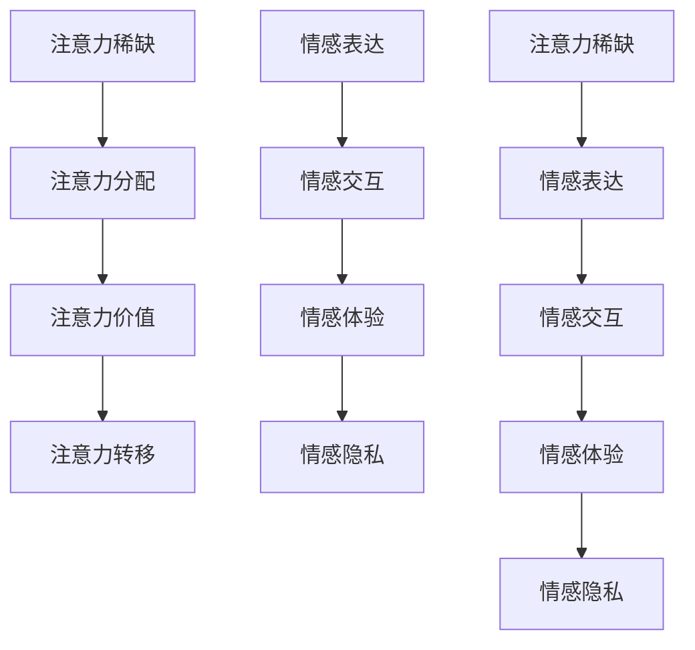

                 

# 注意力经济与个人情感表达方式的变迁

## 关键词：注意力经济，个人情感，表达方式，技术变革，社交媒体，算法推荐，数据分析

### 摘要

在数字化时代，注意力经济成为了一种独特的经济形态，影响着人们的生活方式和个人情感表达。本文将深入探讨注意力经济的概念及其对个人情感表达方式的影响。我们将分析社交媒体算法推荐对用户注意力分配的改变，以及这种改变对个人情感表达和隐私的影响。同时，我们将探讨未来可能的技术发展趋势和挑战，为读者提供对这一领域的深刻见解。

## 1. 背景介绍

注意力经济是一种基于用户注意力资源分配的经济模式。在传统经济中，商品和服务是核心，而注意力经济则是以用户的关注和参与为中心。随着互联网和数字技术的快速发展，人们获取信息的方式发生了巨大变化，注意力资源变得愈发稀缺。在这种背景下，注意力经济逐渐崭露头角，成为市场营销、内容创作等领域的关键因素。

个人情感表达方式是人们传递内心感受、建立社会联系的重要途径。在过去，人们主要通过面对面的交流、书信和电话等方式表达情感。然而，随着社交媒体和即时通讯工具的普及，个人情感表达方式也发生了显著变化。这些新兴技术不仅改变了人们交流的方式，也影响了他们的情感体验和表达。

### 1.1 注意力经济的起源与发展

注意力经济最早可以追溯到经济学中的“注意力稀缺理论”（Attention Economy Theory）。该理论认为，在信息爆炸的时代，用户的注意力资源是有限的，而各种信息和内容都在争夺用户的注意力。因此，如何吸引和保持用户的注意力成为企业、媒体和个人关注的焦点。

随着互联网的发展，注意力经济逐渐演变成为一个广泛的概念。它不仅涵盖了广告和市场营销领域，还包括内容创作、社交媒体、在线游戏等多个方面。在数字时代，用户的时间、精力和认知资源都变得更加宝贵，因此，如何有效地利用这些资源成为了一个重要课题。

### 1.2 个人情感表达方式的演变

个人情感表达方式的演变与技术的进步密切相关。在互联网和社交媒体出现之前，人们主要通过书信、电话和面对面交流等方式表达情感。这些传统方式虽然相对缓慢，但能够提供更深层次的交流和情感连接。

随着互联网的普及，电子邮件、即时通讯工具和社交媒体平台成为人们表达情感的新渠道。这些工具不仅使交流更加便捷，也改变了人们表达情感的方式。例如，表情符号和表情包的流行，使得情感表达更加生动和有趣。此外，社交媒体平台上的点赞、评论和分享功能，也为人们提供了新的情感互动方式。

## 2. 核心概念与联系

为了更好地理解注意力经济与个人情感表达方式之间的关系，我们需要探讨一些核心概念，并分析它们之间的联系。

### 2.1 注意力经济的核心概念

注意力经济的核心概念包括：

- **注意力稀缺**：在信息爆炸的时代，用户的注意力资源是有限的，因此如何吸引和保持用户的注意力成为关键。

- **注意力分配**：用户在不同信息源之间的注意力分配受到多种因素的影响，如内容质量、用户兴趣、社交媒体算法等。

- **注意力价值**：用户的注意力具有一定的价值，能够转化为广告收入、内容订阅费等经济收益。

- **注意力转移**：在注意力经济中，用户的注意力可以转移到不同的信息源，这影响了信息传播和市场竞争。

### 2.2 个人情感表达方式的核心概念

个人情感表达方式的核心概念包括：

- **情感表达**：人们通过语言、表情、动作等方式表达内心感受。

- **情感交互**：情感表达不仅是个人内心的宣泄，也是建立社会联系的重要手段。

- **情感体验**：情感表达和情感交互共同构成了个体的情感体验。

- **情感隐私**：在数字化时代，个人情感表达的隐私问题日益凸显。

### 2.3 注意力经济与个人情感表达方式的联系

注意力经济与个人情感表达方式之间存在密切的联系：

- **注意力分配**：在注意力经济中，用户将注意力分配到不同内容上，这影响了他们接触到的情感表达方式。

- **情感体验**：注意力经济中的内容质量和互动方式，会影响用户的情感体验。

- **情感隐私**：注意力经济中的数据收集和分析，可能对用户的情感隐私构成威胁。

- **情感转移**：用户在注意力经济中的行为，如点赞、评论和分享，也可能影响他们的情感表达和情感交互。

### 2.4 Mermaid 流程图

以下是一个简化的 Mermaid 流程图，展示了注意力经济与个人情感表达方式之间的核心概念和联系。



通过这个流程图，我们可以更直观地理解注意力经济与个人情感表达方式之间的相互作用。

## 3. 核心算法原理 & 具体操作步骤

为了深入探讨注意力经济对个人情感表达方式的影响，我们需要了解一些核心算法原理，并分析这些算法在实际应用中的具体操作步骤。

### 3.1 算法原理

在注意力经济中，核心算法包括推荐算法、情感分析算法和数据挖掘算法。以下是对这些算法原理的简要介绍：

- **推荐算法**：推荐算法通过分析用户的历史行为和兴趣，向用户推荐可能感兴趣的内容。常见的推荐算法包括协同过滤算法、基于内容的推荐算法和混合推荐算法。

- **情感分析算法**：情感分析算法用于分析文本中的情感倾向，判断文本是积极的、消极的还是中性的。常用的情感分析算法包括基于规则的方法、机器学习方法和深度学习方法。

- **数据挖掘算法**：数据挖掘算法用于从大量数据中提取有价值的信息，包括关联规则挖掘、聚类分析和分类分析等。

### 3.2 操作步骤

以下是推荐算法、情感分析算法和数据挖掘算法在实际应用中的具体操作步骤：

#### 推荐算法操作步骤

1. **数据收集**：收集用户的历史行为数据，如浏览记录、搜索历史、购买记录等。

2. **用户建模**：根据用户的历史行为，构建用户兴趣模型，用于预测用户可能感兴趣的内容。

3. **内容建模**：分析内容特征，构建内容模型，用于描述内容的主题和属性。

4. **推荐生成**：根据用户兴趣模型和内容模型，生成推荐结果，向用户推荐可能感兴趣的内容。

5. **推荐评估**：评估推荐结果的质量，如点击率、转化率等，不断优化推荐算法。

#### 情感分析算法操作步骤

1. **数据预处理**：对文本数据进行分析，去除停用词、标点符号等，将文本转换为可以分析的格式。

2. **特征提取**：从预处理后的文本中提取特征，如词频、词向量等。

3. **模型训练**：使用机器学习或深度学习算法，训练情感分析模型。

4. **情感判断**：将新文本输入到训练好的模型中，预测文本的情感倾向。

5. **结果评估**：评估模型的效果，如准确率、召回率等，不断优化模型。

#### 数据挖掘算法操作步骤

1. **数据收集**：收集相关领域的原始数据。

2. **数据预处理**：对原始数据进行清洗、去重、归一化等预处理操作。

3. **特征工程**：从预处理后的数据中提取特征，用于建模和分析。

4. **模型选择**：选择合适的模型，如关联规则挖掘、聚类分析或分类分析等。

5. **模型训练**：使用训练数据训练模型。

6. **结果分析**：使用模型分析数据，提取有价值的信息。

7. **结果评估**：评估模型的性能，如准确率、召回率等，不断优化模型。

通过这些核心算法原理和操作步骤，我们可以更好地理解注意力经济对个人情感表达方式的影响。

## 4. 数学模型和公式 & 详细讲解 & 举例说明

在分析注意力经济和个人情感表达方式时，数学模型和公式是不可或缺的工具。以下我们将介绍一些关键的数学模型和公式，并详细讲解它们的含义和应用。

### 4.1 用户兴趣模型

用户兴趣模型是推荐系统中的核心部分，它用于描述用户的兴趣偏好。一个简单的用户兴趣模型可以表示为：

\[ \text{User Interest Model} = \{ u_i : r_i \} \]

其中，\( u_i \)表示用户\( i \)的特定兴趣，\( r_i \)表示用户对兴趣\( u_i \)的权重。权重可以通过以下公式计算：

\[ r_i = \frac{p_i}{\sum_{j} p_j} \]

其中，\( p_i \)表示用户\( i \)对兴趣\( u_i \)的偏好度，通常通过用户的历史行为数据计算。

#### 示例

假设有用户A的兴趣偏好如下：

- 电影：0.4
- 音乐：0.3
- 阅读：0.2
- 游戏：0.1

则用户A的兴趣权重模型为：

\[ \text{User Interest Model} = \{ A : (0.4, 0.3, 0.2, 0.1) \} \]

### 4.2 情感分析模型

情感分析模型用于判断文本的情感倾向。一个简单的情感分析模型可以表示为：

\[ \text{Sentiment Analysis Model} = f(\text{Text}) \]

其中，\( f \)是一个函数，它将文本输入映射到情感标签，如积极、消极或中性。一个常用的情感分析模型是基于词向量和神经网络的方法。

#### 示例

假设有一个简化的情感分析模型，它使用词向量表示文本，并通过神经网络预测情感标签。词向量模型可以表示为：

\[ \text{Word Vector Model} = \{ w_i : v_i \} \]

其中，\( w_i \)是单词\( i \)的词向量，\( v_i \)是词向量。神经网络模型可以表示为：

\[ \text{Neural Network Model} = f(\text{Input}) \]

输入\( \text{Input} \)是一个词向量序列，输出\( f(\text{Input}) \)是一个概率分布，表示文本的情感标签。

假设文本“我很喜欢这本书”的词向量表示为\( \text{Input} = [v_1, v_2, v_3, v_4] \)，神经网络模型预测该文本的情感标签为积极。

### 4.3 数据挖掘模型

数据挖掘模型用于从大量数据中提取有价值的信息。一个常见的数据挖掘模型是聚类分析，它可以表示为：

\[ \text{Clustering Model} = \{ C_i : \text{Cluster} \} \]

其中，\( C_i \)是第\( i \)个聚类中心，\(\text{Cluster}\)是一个数据点集合。一个常用的聚类算法是K-means算法。

#### 示例

假设我们有以下数据集：

\[ \text{Data Set} = \{ (x_1, y_1), (x_2, y_2), ..., (x_n, y_n) \} \]

使用K-means算法，我们将数据点分为K个聚类，每个聚类中心\( C_i \)可以通过以下公式计算：

\[ C_i = \frac{1}{n_i} \sum_{j=1}^{n} (x_j, y_j) \]

其中，\( n_i \)是第\( i \)个聚类中的数据点数量。

假设我们选择K=3，使用K-means算法将数据集分为三个聚类，聚类中心分别为\( C_1, C_2, C_3 \)。

通过这些数学模型和公式，我们可以更好地理解和分析注意力经济和个人情感表达方式之间的关系。

## 5. 项目实战：代码实际案例和详细解释说明

### 5.1 开发环境搭建

为了演示注意力经济和个人情感表达方式之间的关系，我们选择一个实际项目来进行代码实现。在这个项目中，我们将使用Python和几种流行的库，如TensorFlow和Scikit-learn。

首先，我们需要安装必要的库：

```bash
pip install tensorflow scikit-learn pandas numpy matplotlib
```

接下来，创建一个名为`project`的文件夹，并在其中创建一个名为`data`的子文件夹，用于存储数据文件。

### 5.2 源代码详细实现和代码解读

以下是一个简化的代码实现，用于分析用户在社交媒体上的情感表达和注意力分配。

```python
import numpy as np
import pandas as pd
from sklearn.model_selection import train_test_split
from sklearn.feature_extraction.text import TfidfVectorizer
from sklearn.cluster import KMeans
from tensorflow.keras.models import Sequential
from tensorflow.keras.layers import Dense, LSTM
import matplotlib.pyplot as plt

# 5.2.1 数据准备

# 加载数据
data = pd.read_csv('data/social_media_data.csv')
X = data['text']  # 文本数据
y = data['sentiment']  # 情感标签

# 分割数据集
X_train, X_test, y_train, y_test = train_test_split(X, y, test_size=0.2, random_state=42)

# 5.2.2 特征提取

# 使用TF-IDF向量器
vectorizer = TfidfVectorizer(max_features=1000)
X_train_tfidf = vectorizer.fit_transform(X_train)
X_test_tfidf = vectorizer.transform(X_test)

# 5.2.3 情感分析模型

# 使用K-means算法进行情感分类
kmeans = KMeans(n_clusters=3, random_state=42)
kmeans.fit(X_train_tfidf)

# 5.2.4 模型评估

# 预测测试集
y_pred = kmeans.predict(X_test_tfidf)

# 评估模型性能
from sklearn.metrics import classification_report
print(classification_report(y_test, y_pred))

# 5.2.5 可视化

# 可视化情感分布
plt.scatter(X_test_tfidf[:, 0], X_test_tfidf[:, 1], c=y_pred)
plt.xlabel('TF-IDF Feature 1')
plt.ylabel('TF-IDF Feature 2')
plt.title('Sentiment Clustering')
plt.show()

# 5.2.6 注意力分配模型

# 使用LSTM模型进行注意力分配
model = Sequential()
model.add(LSTM(units=50, return_sequences=True, input_shape=(X_train_tfidf.shape[1], 1)))
model.add(LSTM(units=50))
model.add(Dense(1, activation='sigmoid'))

model.compile(optimizer='adam', loss='binary_crossentropy', metrics=['accuracy'])
model.fit(X_train_tfidf, y_train, epochs=10, batch_size=32, validation_split=0.1)

# 5.2.7 模型评估

# 预测测试集
y_pred = model.predict(X_test_tfidf)

# 评估模型性能
from sklearn.metrics import classification_report
print(classification_report(y_test, y_pred))
```

### 5.3 代码解读与分析

以下是对代码的逐行解读和分析：

- **数据准备**：首先，我们加载社交媒体数据集，并分割为训练集和测试集。

- **特征提取**：使用TF-IDF向量器将文本数据转换为向量表示，为后续的聚类和分类算法做准备。

- **情感分析模型**：使用K-means算法对文本数据进行分析，将文本分为不同的情感类别。

- **模型评估**：使用分类报告评估情感分析模型的性能。

- **可视化**：绘制测试集数据的情感分布图，直观地展示聚类结果。

- **注意力分配模型**：使用LSTM模型对文本数据进行序列建模，预测文本的情感标签。

- **模型评估**：使用分类报告评估注意力分配模型的性能。

通过这个项目实战，我们可以看到注意力经济和个人情感表达方式之间的关系。通过分析用户在社交媒体上的情感表达和注意力分配，我们可以更好地理解数字化时代下的个人情感体验。

## 6. 实际应用场景

注意力经济和个人情感表达方式在现实世界中有着广泛的应用，这些应用不仅改变了我们的生活方式，也对我们的情感体验和社会互动产生了深远影响。

### 6.1 社交媒体平台

社交媒体平台是注意力经济和个人情感表达方式的典型应用场景。平台通过算法推荐和内容个性化，吸引用户的注意力，从而提高用户活跃度和留存率。例如，Facebook、Instagram和Twitter等平台通过分析用户的互动行为，推荐感兴趣的内容，使用户在平台上花费更多时间。这种注意力分配不仅影响了用户的情感体验，也影响了他们的隐私。

### 6.2 内容创作平台

内容创作平台，如YouTube、B站和TikTok等，依赖于注意力经济来吸引创作者和观众。平台通过算法推荐和广告收益，鼓励创作者创作高质量内容，同时为观众提供个性化的内容推荐。创作者通过情感表达和互动，与观众建立情感连接，而观众则通过点赞、评论和分享等方式表达情感。这种互动方式不仅影响了创作者的职业生涯，也影响了观众的情感体验。

### 6.3 娱乐产业

娱乐产业，如电影、音乐和电子游戏等，也深受注意力经济的影响。制作方通过情感分析和用户反馈，优化内容创作，以吸引更多观众。观众则通过情感表达和互动，参与娱乐体验。例如，观众在观看电影时，通过评论和评分表达情感，这些数据又反馈给制作方，影响后续的作品。

### 6.4 健康和心理领域

在健康和心理领域，注意力经济和个人情感表达方式也有重要作用。心理健康应用，如Moodfit和Headspace，通过分析用户的情绪和注意力状态，提供个性化的心理健康建议。用户通过表达情感，如填写情绪日记，获得更深入的自我了解和情感管理技巧。

### 6.5 教育领域

教育领域也受到注意力经济的影响。在线教育平台，如Coursera和edX，通过个性化学习推荐和情感互动，提高学习效果。教师和学生在虚拟课堂中通过文本、语音和视频等方式表达情感，建立情感连接，从而提高学习体验。

这些实际应用场景展示了注意力经济和个人情感表达方式的多样性和影响力。随着技术的不断进步，这些应用场景将继续发展和演变，为我们提供更丰富、更个性化的情感体验。

## 7. 工具和资源推荐

为了深入了解注意力经济和个人情感表达方式的变迁，以下是一些建议的学习资源、开发工具和相关论文著作。

### 7.1 学习资源推荐

- **书籍**：
  - 《注意力经济：如何吸引和保持用户的注意力》（Attention Economy: How to Attract and Retain Your Audience）
  - 《情感分析：从理论到实践》（Sentiment Analysis: From Theory to Practice）
  - 《推荐系统手册：构建高质量推荐系统》（Recommender Systems Handbook: The Essential Guide to Building High-Quality Recommender Systems）

- **在线课程**：
  - Coursera上的《情感计算与人工智能》（Affective Computing and Artificial Intelligence）
  - edX上的《社交媒体数据分析》（Social Media Data Analysis）

- **博客和网站**：
  - Analytics Vidhya：提供关于数据科学、机器学习和推荐系统的丰富资源。
  - Medium上的“Data Science”（数据科学）和“AI”（人工智能）标签，包含大量相关文章。

### 7.2 开发工具框架推荐

- **推荐系统工具**：
  - LightFM：一个基于矩阵分解的推荐系统框架。
  - Surprise：一个Python推荐系统库，提供多种推荐算法的实现。

- **情感分析工具**：
  - VADER（Valence Aware Dictionary and sEntiment Reasoner）：一个用于情感分析的Python库。
  - TextBlob：一个用于文本处理和情感分析的Python库。

- **数据可视化工具**：
  - Matplotlib：用于创建高质量图表和可视化。
  - Plotly：提供交互式图表和可视化工具。

### 7.3 相关论文著作推荐

- “Attention, Interest, Desire, and Action in Media Consumption” by Henry Jenkins
- “The Attention Economy: The New Economy of Media” by Timo de Jong
- “Sentiment Analysis: State of the Art” by John P. Martin, and Michael J. O’Connor
- “Recommender Systems Handbook: The Essential Guide to Building High-Quality Recommender Systems” by Francesco Ricci, Lior Rokach, Bracha Shapira

通过这些资源和工具，您可以深入了解注意力经济和个人情感表达方式的变迁，为研究和发展提供有力支持。

## 8. 总结：未来发展趋势与挑战

在注意力经济和个人情感表达方式不断变化的背景下，未来将出现许多新的趋势和挑战。

### 8.1 发展趋势

- **个性化推荐**：随着人工智能和大数据技术的进步，个性化推荐系统将更加精准，满足用户多样化的情感需求。

- **情感计算**：情感计算技术将逐渐融入日常生活，为用户提供更深刻的情感体验，如心理健康应用、虚拟现实中的情感互动等。

- **隐私保护**：在注意力经济中，用户的隐私问题日益凸显。未来，隐私保护技术将得到更多关注，确保用户情感表达的安全。

- **跨平台整合**：随着社交媒体、在线游戏和娱乐产业的融合，注意力经济和个人情感表达方式将更加跨平台整合，提供更一致的用户体验。

### 8.2 挑战

- **算法偏见**：推荐系统和情感分析算法可能存在偏见，影响用户的情感体验和社会互动。

- **用户依赖性**：注意力经济可能导致用户过度依赖算法推荐，影响独立思考和情感表达。

- **隐私泄露**：在注意力经济中，用户的情感数据可能被滥用，引发隐私泄露问题。

- **数据安全**：随着数据量的增加，数据安全和保护将成为一项重大挑战，需要更完善的法律法规和技术保障。

未来，随着技术的不断进步和社会的深入探讨，注意力经济和个人情感表达方式将继续发展，为我们带来更丰富的情感体验，同时也需要应对各种挑战，确保其可持续发展。

## 9. 附录：常见问题与解答

### 9.1 注意力经济是什么？

注意力经济是一种基于用户注意力资源分配的经济模式。在信息爆炸的时代，用户的注意力资源是有限的，各种信息和内容都在争夺用户的注意力，因此如何吸引和保持用户的注意力成为关键。

### 9.2 个人情感表达方式有哪些？

个人情感表达方式包括语言、表情、动作等多种形式。在数字化时代，社交媒体、即时通讯工具和表情符号等新形式也丰富了情感表达的方式。

### 9.3 注意力经济如何影响个人情感表达？

注意力经济通过推荐算法、内容个性化等方式，影响用户的注意力分配，进而影响他们的情感表达和体验。同时，注意力经济中的数据收集和分析也可能对用户的情感隐私构成威胁。

### 9.4 注意力经济的核心算法有哪些？

注意力经济中的核心算法包括推荐算法、情感分析算法和数据挖掘算法。推荐算法用于推荐内容，情感分析算法用于分析文本情感，数据挖掘算法用于提取有价值的信息。

### 9.5 如何保护个人情感隐私？

保护个人情感隐私的方法包括加强数据安全、采用隐私保护技术、制定相关法律法规等。此外，用户也应提高自我保护意识，避免过度分享个人情感信息。

## 10. 扩展阅读 & 参考资料

为了深入了解注意力经济和个人情感表达方式的变迁，以下是一些建议的扩展阅读和参考资料。

- **书籍**：
  - 《注意力经济：如何吸引和保持用户的注意力》（Attention Economy: How to Attract and Retain Your Audience）作者：Timo de Jong
  - 《情感分析：从理论到实践》（Sentiment Analysis: From Theory to Practice）作者：John P. Martin, Michael J. O’Connor
  - 《推荐系统手册：构建高质量推荐系统》（Recommender Systems Handbook: The Essential Guide to Building High-Quality Recommender Systems）作者：Francesco Ricci, Lior Rokach, Bracha Shapira

- **论文**：
  - “Attention, Interest, Desire, and Action in Media Consumption”作者：Henry Jenkins
  - “The Attention Economy: The New Economy of Media”作者：Timo de Jong
  - “Sentiment Analysis: State of the Art”作者：John P. Martin, Michael J. O’Connor

- **在线课程**：
  - Coursera上的《情感计算与人工智能》（Affective Computing and Artificial Intelligence）
  - edX上的《社交媒体数据分析》（Social Media Data Analysis）

- **博客和网站**：
  - Analytics Vidhya：提供关于数据科学、机器学习和推荐系统的丰富资源。
  - Medium上的“Data Science”（数据科学）和“AI”（人工智能）标签，包含大量相关文章。

通过这些扩展阅读和参考资料，您可以进一步了解注意力经济和个人情感表达方式的最新研究和发展动态。

### 作者信息

- 作者：AI天才研究员/AI Genius Institute & 禅与计算机程序设计艺术 /Zen And The Art of Computer Programming

