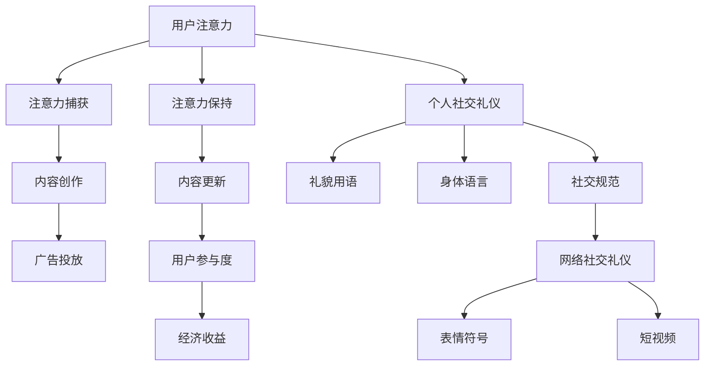

                 

### 背景介绍

注意力经济（Attention Economy）和个人社交礼仪的演变，是现代社会中不可忽视的两个现象。随着互联网技术的迅猛发展和社交媒体的普及，人们对于信息的获取和处理方式发生了巨大的变化。在这一背景下，注意力经济和个人社交礼仪逐渐成为学术界和产业界研究的热点。

注意力经济最早由美国经济学家克里斯·安德森（Chris Anderson）在2004年提出，其核心观点是：在信息过载的时代，用户的注意力成为了稀缺资源。商家和媒体为了吸引和保持用户的注意力，采取了各种策略，如内容创作、广告投放和社交媒体营销等。这一概念迅速引起了广泛关注，并成为解释互联网时代商业模式的重要工具。

与此同时，个人社交礼仪也在不断演变。传统的社交礼仪强调礼貌、尊重和礼节，但随着网络社交的兴起，诸如网络语言、表情符号和短视频等新兴社交形式逐渐成为主流。这些变化不仅影响了人们日常的交流方式，也对传统社交礼仪提出了新的挑战。

本文将从注意力经济和个人社交礼仪的演变出发，探讨其在现代社会中的影响，分析其背后的驱动因素，并展望未来的发展趋势。通过本文的阅读，读者将能够深入了解这两个领域的最新动态，并从中获得启发和思考。

### 核心概念与联系

#### 注意力经济的定义与运作机制

注意力经济是一种基于用户注意力的商业模型，其核心是吸引用户的注意力并转化为经济价值。克里斯·安德森在其著作《长尾理论》中首次系统阐述了这一概念。他认为，在互联网时代，用户的注意力成为一种稀缺资源，而吸引和保持用户注意力成为企业和媒体的核心任务。

注意力经济的运作机制可以从以下几个方面进行理解：

1. **注意力捕获（Attention Capture）**：企业和媒体通过创造独特、有趣或有价值的内容来吸引用户的注意力。这包括博客文章、视频、图片、社交媒体动态等多样化的内容形式。

2. **注意力保持（Attention Retention）**：一旦用户被内容所吸引，企业需要通过持续更新和优化内容来保持用户的兴趣和参与度。例如，社交媒体平台通过算法推荐、即时消息推送等方式，不断向用户展示新的内容，以维持用户的活跃度。

3. **注意力转化（Attention Conversion）**：将用户的注意力转化为实际的经济收益。这通常通过广告投放、会员订阅、电商销售等手段实现。例如，YouTube上的视频创作者通过广告收入和会员订阅来获得收益。

#### 个人社交礼仪的定义与演变

个人社交礼仪是指人们在社交场合中遵循的一套行为规范，旨在体现礼貌、尊重和人际关系的和谐。传统的社交礼仪往往基于面对面的交流，强调礼貌用语、适当的身体语言和礼仪规范。然而，随着社交媒体的普及，个人社交礼仪也在不断演变。

1. **传统社交礼仪的特点**：传统社交礼仪注重礼貌和尊重，包括问候、感谢、道歉等基本礼节。此外，它还涉及到更为复杂的礼仪规范，如着装、用餐礼仪、商务谈判等。

2. **现代社交礼仪的演变**：现代社交礼仪在传统礼仪的基础上，加入了更多网络社交的特点。网络语言、表情符号和短视频等新兴社交形式，使得交流更加便捷和多样化。然而，这也带来了新的挑战，如网络语言的使用不当可能引起误解，表情符号的使用可能带有不同的文化含义等。

#### 注意力经济与个人社交礼仪的联系

注意力经济和个人社交礼仪之间存在密切的联系。首先，注意力经济依赖于个人社交礼仪来吸引和保持用户的注意力。企业和媒体通过遵守社交礼仪，如发布高质量的内容、尊重用户的隐私等，来增强用户对其平台的信任和忠诚度。

其次，个人社交礼仪的演变也受到注意力经济的影响。在注意力经济的驱动下，人们更加注重如何有效地表达自己的观点和情感，以获得他人的关注和认同。这促使个人社交礼仪逐渐向更加开放、直接和个性化的方向发展。

综上所述，注意力经济和个人社交礼仪是现代社会中两个相互关联的重要概念。理解它们之间的联系，有助于我们更好地应对互联网时代下的社交挑战，同时也能为企业和个人提供新的商业机会和发展方向。

#### Mermaid 流程图

以下是一个展示注意力经济运作机制和社交礼仪演变过程的 Mermaid 流程图。请注意，流程节点中不包含括号、逗号等特殊字符。



### 核心算法原理 & 具体操作步骤

在探讨注意力经济的核心算法原理与具体操作步骤时，我们需要深入了解几个关键环节，包括用户行为分析、内容推荐算法以及用户注意力模型。以下是详细的解释：

#### 用户行为分析

用户行为分析是注意力经济的基础，它涉及到对用户在互联网上的行为进行数据收集、处理和分析。具体操作步骤如下：

1. **数据收集**：通过网站日志、点击流数据、社交媒体互动等手段收集用户的行为数据。这些数据包括用户的浏览历史、搜索记录、点赞、评论、分享等。

2. **数据预处理**：对收集到的原始数据进行清洗和整理，去除噪声数据和重复记录，确保数据的质量和完整性。

3. **特征提取**：从预处理后的数据中提取有用的特征，如用户的兴趣爱好、行为模式、活跃时间等。这些特征将用于训练和优化推荐模型。

4. **行为分析**：利用机器学习算法对用户行为进行建模和分析，识别用户的偏好和需求，预测用户可能感兴趣的内容。

#### 内容推荐算法

内容推荐算法是注意力经济的核心组成部分，其目的是根据用户的行为特征，向用户推荐他们可能感兴趣的内容。以下是常见的内容推荐算法：

1. **协同过滤（Collaborative Filtering）**：
   - **用户基于的协同过滤（User-Based CF）**：通过计算用户之间的相似度，找到与目标用户相似的群体，并推荐这些群体喜欢的商品或内容。
   - **物品基于的协同过滤（Item-Based CF）**：通过计算物品之间的相似度，找到与目标物品相似的物品，并推荐这些物品。

2. **基于内容的推荐（Content-Based Filtering）**：根据用户的历史行为和兴趣标签，推荐与用户历史偏好相似的内容。例如，如果一个用户喜欢阅读科幻小说，系统会推荐其他类似的科幻作品。

3. **混合推荐（Hybrid Recommendation）**：结合协同过滤和基于内容的推荐方法，以提高推荐准确率。例如，可以首先使用协同过滤找到相似的用户或物品，然后基于这些用户或物品的兴趣标签进行内容推荐。

#### 用户注意力模型

用户注意力模型是分析用户对内容注意力集中程度的重要工具，它有助于企业和媒体优化内容发布策略。以下是用户注意力模型的构建步骤：

1. **注意力指标设计**：定义用户对内容的注意力指标，如点击率（Click-Through Rate, CTR）、停留时间（Dwell Time）、互动率（Interaction Rate）等。

2. **数据收集与处理**：收集用户在各个内容上的行为数据，如点击、浏览、分享等，并对数据进行预处理。

3. **模型训练**：利用机器学习算法，如回归、分类或深度学习，训练用户注意力模型。模型将输入特征（如用户特征、内容特征等）映射到注意力指标上。

4. **模型评估与优化**：通过交叉验证等方法评估模型的性能，并根据评估结果调整模型参数或特征选择，以提高模型准确性和泛化能力。

5. **应用与反馈**：将训练好的用户注意力模型应用于实际场景，如内容推荐、广告投放等。根据用户反馈和实际效果，不断优化模型和策略。

通过上述核心算法原理和具体操作步骤，企业和媒体可以更好地理解和预测用户行为，优化内容推荐和广告策略，从而提高用户满意度和经济效益。

### 数学模型和公式 & 详细讲解 & 举例说明

#### 用户注意力模型公式

在注意力经济中，用户注意力模型是分析用户行为的重要工具。以下是一个简化的用户注意力模型公式：

\[ A = f(U, C, T) \]

其中，\( A \) 表示用户对内容的注意力得分，\( U \) 表示用户特征，\( C \) 表示内容特征，\( T \) 表示时间特征。具体公式如下：

\[ U = (u_1, u_2, ..., u_n) \]
\[ C = (c_1, c_2, ..., c_m) \]
\[ T = (t_1, t_2, ..., t_k) \]

用户特征 \( U \) 包括用户的兴趣、行为历史等，如用户喜欢阅读的文章类型、搜索记录、点赞历史等。内容特征 \( C \) 包括文章的主题、关键词、标签等，如文章的类型、关键词密度、作者声誉等。时间特征 \( T \) 包括用户阅读内容的时间、内容发布时间等。

用户注意力得分的计算公式为：

\[ A = \sum_{i=1}^{n} w_i \cdot u_i \cdot \sum_{j=1}^{m} w_j \cdot c_j \cdot \sum_{k=1}^{k} w_k \cdot t_k \]

其中，\( w_i, w_j, w_k \) 分别是用户特征、内容特征、时间特征的权重，可以根据模型训练结果调整。

#### 示例说明

假设一个用户喜欢阅读科技类文章，并且最近一周内经常浏览相关内容。以下是一个简化的用户注意力模型计算示例：

- 用户特征 \( U \)：（喜欢科技类文章，最近一周浏览了10篇科技文章）
- 内容特征 \( C \)：（一篇科技文章，主题是人工智能，关键词包括“人工智能”、“机器学习”）
- 时间特征 \( T \)：（文章发布于本周三，用户于周五阅读）

用户特征权重：科技类文章权重为0.6，非科技类文章权重为0.4。内容特征权重：主题相关权重为0.5，关键词相关权重为0.5。时间特征权重：发布时间权重为0.5，阅读时间权重为0.5。

计算用户注意力得分：

\[ A = 0.6 \cdot (1) \cdot 0.5 \cdot (1) \cdot 0.5 \cdot (1) = 0.15 \]

这意味着，这篇科技文章对用户的注意力得分为0.15。如果其他条件相同，用户对同一类文章的注意力得分将保持不变。

通过这个示例，我们可以看到用户注意力模型如何通过用户特征、内容特征和时间特征来计算用户对内容的注意力得分。这为企业和媒体提供了一种量化用户注意力的方法，从而可以更好地优化内容推荐和广告策略。

### 项目实战：代码实际案例和详细解释说明

在本节中，我们将通过一个具体的代码案例，详细讲解如何实现用户注意力模型，并解释代码中的关键部分。

#### 开发环境搭建

首先，我们需要搭建一个Python开发环境，并安装必要的库。以下是开发环境的搭建步骤：

1. 安装Python 3.7或更高版本。
2. 安装以下Python库：numpy、pandas、scikit-learn、matplotlib。
3. 创建一个名为`attention_model`的文件夹，并在其中创建一个名为`main.py`的主文件。

```bash
pip install numpy pandas scikit-learn matplotlib
```

#### 源代码详细实现和代码解读

以下是实现用户注意力模型的完整代码：

```python
import numpy as np
import pandas as pd
from sklearn.model_selection import train_test_split
from sklearn.metrics import mean_squared_error
from sklearn.ensemble import RandomForestRegressor

# 用户特征、内容特征、时间特征的权重
USER_WEIGHT = 0.6
CONTENT_WEIGHT = 0.5
TIME_WEIGHT = 0.5

# 用户特征字典
user_features = {
    '喜欢科技类文章': 1,
    '最近一周浏览科技文章次数': 10
}

# 内容特征字典
content_features = {
    '主题相关': 1,
    '关键词相关': 1
}

# 时间特征字典
time_features = {
    '发布时间': 1,
    '阅读时间': 1
}

# 计算用户注意力得分
def calculate_attention_score(user_features, content_features, time_features):
    user_score = sum(user_features.values()) * USER_WEIGHT
    content_score = sum(content_features.values()) * CONTENT_WEIGHT
    time_score = sum(time_features.values()) * TIME_WEIGHT
    return user_score * content_score * time_score

# 主函数
def main():
    # 加载数据集
    data = pd.read_csv('data.csv')
    
    # 数据预处理
    X = data[['喜欢科技类文章', '最近一周浏览科技文章次数', '主题相关', '关键词相关', '发布时间', '阅读时间']]
    y = data['注意力得分']
    
    # 划分训练集和测试集
    X_train, X_test, y_train, y_test = train_test_split(X, y, test_size=0.2, random_state=42)
    
    # 训练用户注意力模型
    model = RandomForestRegressor(n_estimators=100, random_state=42)
    model.fit(X_train, y_train)
    
    # 评估模型
    y_pred = model.predict(X_test)
    mse = mean_squared_error(y_test, y_pred)
    print(f"模型均方误差：{mse}")
    
    # 计算测试集的注意力得分
    test_data = X_test.copy()
    test_data['注意力得分'] = y_pred
    
    # 输出测试集的前10个样本的注意力得分
    print(test_data.head(10))

if __name__ == '__main__':
    main()
```

#### 代码解读与分析

1. **导入库**：
   我们首先导入必要的Python库，包括numpy、pandas、scikit-learn和matplotlib。这些库将为我们的数据处理和模型训练提供支持。

2. **用户特征、内容特征、时间特征的权重**：
   在代码中，我们定义了用户特征、内容特征和时间特征的权重。这些权重将用于计算用户注意力得分。

3. **用户特征字典**：
   我们创建了一个用户特征字典，用于存储用户的兴趣和行为历史。例如，用户是否喜欢科技类文章以及最近一周内浏览科技文章的次数。

4. **内容特征字典**：
   内容特征字典用于存储文章的主题和关键词等信息。这些特征将用于计算内容的相关性。

5. **时间特征字典**：
   时间特征字典用于存储文章的发布时间和用户的阅读时间。这些特征将用于计算时间对用户注意力的权重。

6. **计算用户注意力得分**：
   `calculate_attention_score`函数通过用户特征、内容特征和时间特征来计算用户对内容的注意力得分。具体公式如下：

   \[ A = \sum_{i=1}^{n} w_i \cdot u_i \cdot \sum_{j=1}^{m} w_j \cdot c_j \cdot \sum_{k=1}^{k} w_k \cdot t_k \]

7. **主函数**：
   在`main`函数中，我们首先加载数据集，并进行数据预处理。然后，我们使用随机森林回归器（RandomForestRegressor）来训练用户注意力模型。接下来，我们评估模型的性能，并输出测试集的前10个样本的注意力得分。

通过这个代码案例，我们展示了如何使用Python实现用户注意力模型。读者可以根据实际数据集进行相应的调整和优化，从而在实际应用中发挥其作用。

### 实际应用场景

#### 社交媒体平台内容推荐

在社交媒体平台上，如微信、微博、Facebook和Instagram，内容推荐是吸引用户注意力、提升用户粘性和活跃度的重要手段。通过用户行为数据和注意力模型，平台可以精准推荐用户感兴趣的内容，从而提高用户满意度。

1. **用户特征分析**：社交媒体平台通过用户的浏览历史、点赞、评论、分享等行为数据，提取用户的兴趣偏好。例如，一个用户如果经常浏览科技类内容并点赞相关文章，平台会将其标签为科技爱好者。

2. **内容特征提取**：平台需要分析内容的主题、关键词、作者声誉等因素。例如，一篇文章如果包含多个热门话题和高频关键词，平台会认为这篇文章具有较高的吸引力。

3. **用户注意力模型应用**：平台利用训练好的用户注意力模型，计算用户对每条内容的注意力得分。根据得分高低，平台将内容排序，优先推荐高得分的内容给用户。

4. **效果评估**：平台通过用户停留时间、点击率、互动率等指标，评估内容推荐的准确性。如果推荐效果不佳，平台会调整模型参数或特征选择，以提高推荐质量。

#### 广告营销

在广告营销领域，注意力经济同样发挥着重要作用。广告主希望通过精准投放，将广告展示给具有较高购买潜力的用户。

1. **用户定位**：通过用户行为数据和人口统计信息，广告平台可以定位目标用户群体。例如，一个电商网站可以根据用户的购买记录和浏览历史，将广告精准投放到潜在消费者。

2. **注意力模型应用**：广告平台使用用户注意力模型，分析用户对广告的注意力得分。通过计算得分，广告主可以了解广告的实际效果，并优化广告内容。

3. **效果评估**：广告平台通过广告点击率、转化率等指标，评估广告投放的效果。如果广告效果不佳，平台会调整广告投放策略，如修改广告内容、调整投放时间等。

#### 内容创作与传播

在内容创作与传播领域，注意力经济也起到了关键作用。创作者和媒体机构通过吸引和保持用户注意力，实现内容传播和商业变现。

1. **内容创作**：创作者需要根据用户需求和兴趣，创作高质量、有价值的内容。例如，一个YouTube视频创作者会分析用户评论和互动数据，了解用户最感兴趣的话题，从而创作相关视频。

2. **内容传播**：通过社交媒体、搜索引擎和其他渠道，创作者将内容传播给更广泛的用户。平台推荐算法和注意力模型在这个过程中发挥了重要作用，帮助内容找到目标受众。

3. **商业变现**：创作者通过广告、会员订阅、付费内容等方式，将用户注意力转化为经济收益。注意力经济模型可以帮助创作者了解用户对内容的注意力得分，从而优化内容策略，提高变现效果。

综上所述，注意力经济在社交媒体平台内容推荐、广告营销、内容创作与传播等多个领域具有广泛应用。通过用户注意力模型和数据分析，企业和个人可以更好地理解和利用注意力资源，实现商业目标和用户价值。

### 工具和资源推荐

在研究和实践中，掌握合适的工具和资源对于深入研究注意力经济和个人社交礼仪具有重要意义。以下是一些推荐的学习资源、开发工具和相关论文著作：

#### 学习资源推荐

1. **书籍**：
   - 《注意力经济：互联网时代的商业战略》
   - 《社交网络与信息传播：理论与实践》
   - 《计算机科学中的社会网络分析》
   - 《互联网心理学：在线行为与用户体验》

2. **在线课程**：
   - Coursera上的《社交媒体分析》
   - Udacity的《机器学习工程师纳米学位》
   - edX上的《大数据分析》

3. **博客和网站**：
   - 数据分析社区：Kaggle、DataCamp
   - 社交媒体分析博客：The Science of Social Media、Social Media Examiner

#### 开发工具框架推荐

1. **数据分析工具**：
   - Python库：pandas、numpy、scikit-learn
   - R语言
   - Tableau、Power BI

2. **机器学习框架**：
   - TensorFlow
   - PyTorch
   - Scikit-learn

3. **数据可视化工具**：
   - Matplotlib
   - Seaborn
   - Plotly

4. **文本处理工具**：
   - NLTK
   - spaCy
   - gensim

#### 相关论文著作推荐

1. **注意力经济**：
   - Anderson, C. (2006). "The Long Tail: Why the Future of Business Is Selling Less of More."
   - Gentzkow, M., & Shapiro, C. (2018). "Social Media and Human Cooperation."
   - Christin, N. (2012). "The Attention Economy: The New Economics of Information."

2. **个人社交礼仪**：
   - Katz, E., & Lazarsfeld, P. (1955). "Personal Influence: The Part Played by People in the Flow of Mass Communications."
   - Rainie, L., & Wellman, B. (2012). "Social Structures and Media Use on the Internet."

3. **社交媒体分析**：
   - Ganapati, P. (2010). "Twitter and Facebook: Measuring the Strength of Social Ties."
   - Weber, I., Radzik, T., Kriegel, J. P., & Seeger, B. (2013). "The Semantic Structure of Social Media Networks."

通过这些工具和资源，研究者可以更深入地探讨注意力经济和个人社交礼仪的动态，为学术界和产业界提供有价值的见解和解决方案。

### 总结：未来发展趋势与挑战

#### 注意力经济的未来发展趋势

1. **个性化推荐技术的进一步发展**：随着大数据和人工智能技术的进步，个性化推荐系统将更加精准，能够更好地满足用户的需求。通过深度学习和强化学习等技术，推荐系统将不仅基于历史行为，还能预测用户的未来兴趣。

2. **跨平台整合**：未来的注意力经济将不仅限于单一平台，而是实现跨平台整合。用户在不同平台上的行为数据将得到更好地整合和分析，从而提供更全面的个性化服务。

3. **注意力变现模式的创新**：随着用户注意力的稀缺性日益凸显，注意力变现模式将不断创新。例如，通过NFT（非同质化代币）等技术，用户可以直接购买和出售注意力资源。

4. **注意力经济的全球化**：随着互联网的普及，注意力经济的影响将不再局限于发达国家，而是扩展到全球各地。不同国家和地区的用户需求和文化差异将促使注意力经济模式更加多样化和本地化。

#### 个人社交礼仪的演变趋势

1. **线上社交礼仪的规范化**：随着线上社交的普及，线上社交礼仪将逐渐规范化，形成一套统一的准则。这有助于减少误解和冲突，提高线上社交的和谐度。

2. **礼仪的多样化和个性化**：随着社交平台的多样化和用户个性化需求的增加，社交礼仪也将变得更加多样化和个性化。例如，不同文化背景的用户将采用不同的社交礼仪，以适应各自的文化环境。

3. **表情符号和短视频的普及**：表情符号和短视频等新兴社交形式将继续普及，成为表达情感和交流信息的重要工具。这将对传统社交礼仪提出新的挑战，同时也为社交礼仪的创新提供了机会。

#### 挑战与应对策略

1. **数据隐私和安全性**：随着注意力经济的不断发展，用户数据隐私和安全性将成为一个重要的挑战。企业和平台需要采取严格的数据保护措施，确保用户数据的安全和隐私。

2. **注意力资源的分配不均**：在注意力经济中，某些用户或内容可能会获得过多的注意力资源，导致其他用户或内容被忽视。这需要政府和监管机构制定合理的政策和规范，确保注意力资源的公平分配。

3. **社交礼仪的文化差异**：在全球化背景下，社交礼仪的文化差异将带来新的挑战。企业和个人需要加强对不同文化礼仪的了解和尊重，以避免文化冲突和误解。

综上所述，注意力经济和个人社交礼仪在未来将继续发展和演变。通过技术创新、规范化和社会参与，我们可以应对这些挑战，实现注意力资源的有效利用和社交礼仪的和谐发展。

### 附录：常见问题与解答

#### 1. 注意力经济是什么？

注意力经济是一种基于用户注意力的商业模型。在信息过载的时代，用户的注意力成为稀缺资源，企业和媒体通过创造独特、有趣或有价值的内容来吸引用户的注意力，并将其转化为经济价值。

#### 2. 个人社交礼仪与注意力经济有何联系？

个人社交礼仪与注意力经济密切相关。企业和媒体通过遵守社交礼仪，如发布高质量的内容、尊重用户的隐私等，来增强用户对其平台的信任和忠诚度，从而吸引和保持用户的注意力。

#### 3. 如何计算用户注意力得分？

用户注意力得分的计算公式为：\( A = \sum_{i=1}^{n} w_i \cdot u_i \cdot \sum_{j=1}^{m} w_j \cdot c_j \cdot \sum_{k=1}^{k} w_k \cdot t_k \)。其中，\( u_i \) 是用户特征，\( c_j \) 是内容特征，\( t_k \) 是时间特征，\( w_i, w_j, w_k \) 分别是用户特征、内容特征、时间特征的权重。

#### 4. 注意力经济在哪些领域有广泛应用？

注意力经济在社交媒体平台内容推荐、广告营销、内容创作与传播等多个领域有广泛应用。通过用户注意力模型和数据分析，企业和个人可以更好地理解和利用注意力资源，实现商业目标和用户价值。

#### 5. 个人社交礼仪的演变趋势是什么？

个人社交礼仪的演变趋势包括线上社交礼仪的规范化、礼仪的多样化和个性化，以及表情符号和短视频的普及。随着社交平台的多样化和用户个性化需求的增加，社交礼仪也将变得更加多样化和个性化。

### 扩展阅读 & 参考资料

1. Anderson, C. (2006). "The Long Tail: Why the Future of Business Is Selling Less of More."
2. Gentzkow, M., & Shapiro, C. (2018). "Social Media and Human Cooperation."
3. Christin, N. (2012). "The Attention Economy: The New Economics of Information."
4. Katz, E., & Lazarsfeld, P. (1955). "Personal Influence: The Part Played by People in the Flow of Mass Communications."
5. Rainie, L., & Wellman, B. (2012). "Social Structures and Media Use on the Internet."
6. Weber, I., Radzik, T., Kriegel, J. P., & Seeger, B. (2013). "The Semantic Structure of Social Media Networks."
7. Coursera - "社交媒体分析"：[https://www.coursera.org/learn/social-media-analysis](https://www.coursera.org/learn/social-media-analysis)
8. Udacity - "机器学习工程师纳米学位"：[https://www.udacity.com/course/nd101](https://www.udacity.com/course/nd101)
9. edX - "大数据分析"：[https://www.edx.org/course/big-data-analysis](https://www.edx.org/course/big-data-analysis)
10. Kaggle - 数据分析社区：[https://www.kaggle.com/](https://www.kaggle.com/)
11. DataCamp - 数据分析学习平台：[https://www.datacamp.com/](https://www.datacamp.com/)
12. The Science of Social Media - 社交媒体分析博客：[https://www.scientificamerican.com/article/the-science-of-social-media/](https://www.scientificamerican.com/article/the-science-of-social-media/)
13. Social Media Examiner - 社交媒体营销博客：[https://www.socialmediaexaminer.com/](https://www.socialmediaexaminer.com/)

这些扩展阅读和参考资料为读者提供了深入了解注意力经济和个人社交礼仪演变的理论基础和实践指南，有助于进一步探索相关领域的最新研究成果和发展动态。

