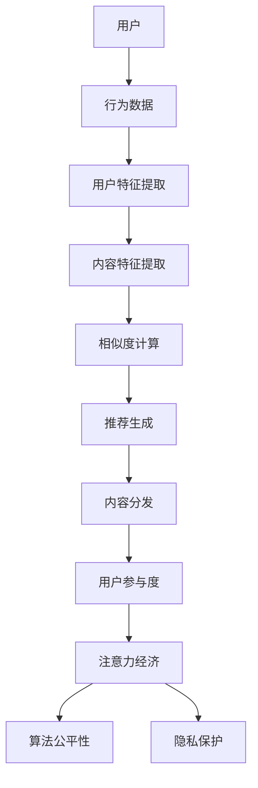
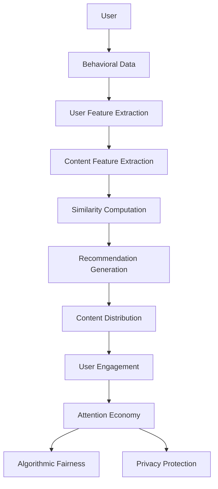

                 

### 背景介绍

注意力经济（Attention Economy）是近年来在互联网和数字媒体领域崭露头角的一个概念。它强调在信息过载的时代，用户的注意力成为一种稀缺资源，各种内容和平台需要通过有效的策略来吸引并保持用户的注意力。这个概念最早由哈佛大学社会学家Sherry Turkle提出，用以描述互联网时代人们如何分散注意力，以及信息如何争夺人们的注意力。

随着社交媒体、在线视频平台和搜索引擎的兴起，注意力经济的重要性愈发凸显。例如，社交媒体平台通过算法推荐系统来推送用户可能感兴趣的内容，以吸引和保持用户的在线时间。这种推荐系统利用了用户的兴趣和行为数据，从而实现内容的个性化推荐，从而更有效地吸引和保留用户的注意力。

个性化推荐系统（Personalized Recommendation System）是注意力经济中的一个重要组成部分。它的目标是根据用户的兴趣、行为和历史数据，向用户推荐他们可能感兴趣的内容。这种系统在电商、音乐流媒体、视频平台等多个领域得到了广泛应用。例如，Amazon基于用户的购买历史和浏览行为推荐商品，Spotify根据用户的听歌历史推荐音乐，Netflix基于用户的观看记录推荐电影和电视剧。

个性化推荐系统的工作原理通常包括以下几个关键步骤：

1. **用户特征提取**：通过收集用户的历史行为数据，如浏览记录、购买记录、评论等，提取用户的兴趣特征。
2. **内容特征提取**：分析推荐的内容，提取其特征，如标签、类别、关键词等。
3. **相似度计算**：计算用户与内容之间的相似度，通常使用协同过滤、矩阵分解等方法。
4. **推荐生成**：根据相似度计算结果，生成个性化推荐列表。

注意力经济与个性化推荐系统的结合，为用户提供更加定制化和有针对性的内容和体验，既提高了用户满意度，也增加了平台的粘性。然而，这也带来了新的挑战，如隐私保护、算法公平性等，需要我们深入探讨和解决。

In the era of information overload, Attention Economy has emerged as a significant concept in the fields of internet and digital media. It emphasizes that in this age, users' attention has become a scarce resource, and various content and platforms need effective strategies to attract and retain users' attention. This concept was first proposed by sociologist Sherry Turkle of Harvard University to describe how people分散他们的注意力，as well as how information competes for people's attention on the internet.

With the rise of social media, online video platforms, and search engines, the importance of Attention Economy has become increasingly prominent. For example, social media platforms use algorithmic recommendation systems to push content that users may be interested in, in order to attract and keep users online. These recommendation systems leverage users' interest and behavioral data to achieve personalized content recommendation, thus more effectively attracting and retaining users.

Personalized Recommendation Systems are an important component of Attention Economy. Their goal is to recommend content that users may be interested in based on their interests, behaviors, and historical data. This system is widely used in various fields such as e-commerce, music streaming, and video platforms. For example, Amazon recommends products based on users' purchase history and browsing behavior, Spotify recommends music based on users' listening history, and Netflix recommends movies and TV shows based on users' viewing records.

The working principle of Personalized Recommendation Systems generally includes the following key steps:

1. **User Feature Extraction**: Collect and analyze users' historical behavioral data, such as browsing history, purchase history, and comments, to extract their interest features.
2. **Content Feature Extraction**: Analyze the recommended content and extract its features, such as tags, categories, and keywords.
3. **Similarity Computation**: Calculate the similarity between users and content, typically using collaborative filtering and matrix factorization methods.
4. **Recommendation Generation**: Generate a personalized recommendation list based on the similarity computation results.

The combination of Attention Economy and Personalized Recommendation Systems provides users with more customized and targeted content and experiences, increasing user satisfaction and platform stickiness. However, this also brings new challenges, such as privacy protection and algorithmic fairness, that need to be explored and resolved in depth.

### 核心概念与联系

在深入探讨注意力经济与个性化推荐系统之前，我们需要明确几个核心概念，并理解它们之间的相互关系。以下是本文将涉及的关键概念及其简要介绍：

#### 1. 注意力经济（Attention Economy）

如前所述，注意力经济是指在信息过载的环境中，用户的注意力成为一种稀缺资源。平台和内容创作者需要通过吸引用户的注意力来获得成功。注意力经济的关键在于，通过提供有吸引力的内容和体验，有效地抓住并保持用户的注意力。

#### 2. 个性化推荐系统（Personalized Recommendation System）

个性化推荐系统是基于用户的历史行为和偏好，向用户推荐相关内容的技术。它的核心目标是提高用户满意度和留存率，通过精准推荐来吸引用户的注意力。

#### 3. 内容分发（Content Distribution）

内容分发是指将内容传递给用户的机制，包括搜索引擎、社交媒体平台、视频平台等。有效的内容分发策略可以增强用户的参与度，提高用户的注意力。

#### 4. 用户行为分析（User Behavior Analysis）

用户行为分析是指通过分析用户的行为数据，了解用户的兴趣和行为模式。这对于个性化推荐系统至关重要，因为它可以帮助系统更好地理解用户的需求。

#### 5. 算法公平性（Algorithmic Fairness）

算法公平性是指推荐系统在推荐内容时，是否公平对待所有用户。这包括避免偏见和确保推荐结果的公正性。

#### 6. 隐私保护（Privacy Protection）

隐私保护是指在收集和使用用户数据时，确保用户隐私不被泄露。这是在注意力经济和个性化推荐系统中需要解决的重要问题。

#### 关系与联系

注意力经济与个性化推荐系统之间的关系可以从以下几个方面来理解：

- **用户注意力**：个性化推荐系统通过提供个性化内容来吸引用户的注意力，从而实现注意力经济的目标。
- **数据驱动**：个性化推荐系统依赖于用户行为数据进行内容推荐，这与注意力经济中的数据驱动的理念相吻合。
- **内容分发**：个性化推荐系统是内容分发的一部分，通过精准的内容推荐来提高用户参与度。
- **算法与公平性**：算法公平性和隐私保护是注意力经济和个性化推荐系统的关键挑战，需要采取相应的措施来解决。

为了更好地理解这些概念之间的关系，我们可以通过一个Mermaid流程图来展示它们的基本架构：



在这个流程图中，用户行为数据是整个流程的起点，通过用户特征提取、内容特征提取、相似度计算和推荐生成等步骤，最终实现个性化推荐和内容分发。同时，这个流程还涉及到注意力经济、算法公平性和隐私保护等多个方面。

In order to deeply explore the combination of Attention Economy and Personalized Recommendation Systems, we need to clarify several core concepts and understand their interrelationships. Here are the key concepts involved in this article along with a brief introduction to each:

#### 1. Attention Economy

As previously mentioned, the Attention Economy is a concept that arose in the age of information overload, where users' attention has become a scarce resource. Platforms and content creators need to attract and retain users' attention to achieve success. The key idea of the Attention Economy is to provide attractive content and experiences to effectively capture and maintain users' attention.

#### 2. Personalized Recommendation System

A Personalized Recommendation System is a technical approach that recommends relevant content to users based on their historical behavior and preferences. Its core goal is to increase user satisfaction and retention by accurately recommending content.

#### 3. Content Distribution

Content Distribution refers to the mechanism of delivering content to users, including search engines, social media platforms, and video platforms. Effective content distribution strategies can enhance user engagement and increase attention.

#### 4. User Behavior Analysis

User Behavior Analysis is the process of analyzing users' behavioral data to understand their interests and behavior patterns. This is crucial for Personalized Recommendation Systems as it helps the system better understand user needs.

#### 5. Algorithmic Fairness

Algorithmic Fairness refers to the fairness of recommendation systems in recommending content. It involves avoiding biases and ensuring the fairness of recommendation results.

#### 6. Privacy Protection

Privacy Protection is the process of safeguarding users' privacy when collecting and using their data. This is an important issue that needs to be addressed in the context of Attention Economy and Personalized Recommendation Systems.

#### Relationships and Connections

The relationship between Attention Economy and Personalized Recommendation Systems can be understood from several aspects:

- **User Attention**: Personalized Recommendation Systems attract and retain users' attention by providing personalized content, thus achieving the goals of Attention Economy.
- **Data-Driven**: Personalized Recommendation Systems rely on users' behavioral data for content recommendation, which aligns with the data-driven philosophy of Attention Economy.
- **Content Distribution**: Personalized Recommendation Systems are a part of content distribution, enhancing user engagement through precise content recommendations.
- **Algorithmic Fairness and Privacy Protection**: Algorithmic Fairness and Privacy Protection are key challenges in Attention Economy and Personalized Recommendation Systems, requiring appropriate measures to address.

To better understand the relationships between these concepts, we can use a Mermaid flowchart to illustrate their basic architecture:



In this flowchart, user behavioral data is the starting point of the entire process, which goes through user feature extraction, content feature extraction, similarity computation, and recommendation generation to achieve personalized recommendation and content distribution. At the same time, this process involves aspects such as Attention Economy, Algorithmic Fairness, and Privacy Protection.
<|user|>
### 核心算法原理 & 具体操作步骤

个性化推荐系统的核心在于如何根据用户的历史行为和偏好来生成精准的推荐列表。这通常涉及多种算法和技术，其中协同过滤（Collaborative Filtering）、基于内容的推荐（Content-based Recommendation）和混合推荐（Hybrid Recommendation）是三种主要的方法。以下将详细介绍每种方法的基本原理，以及如何具体操作。

#### 1. 协同过滤（Collaborative Filtering）

协同过滤是一种基于用户行为数据的推荐方法，通过分析用户之间的相似性来生成推荐列表。协同过滤分为两种类型：基于用户的协同过滤（User-based Collaborative Filtering）和基于模型的协同过滤（Model-based Collaborative Filtering）。

##### 基于用户的协同过滤

**原理**：基于用户的协同过滤通过寻找与目标用户相似的其他用户，然后推荐这些相似用户喜欢的但目标用户尚未体验过的项目。

**步骤**：

1. **用户相似度计算**：计算目标用户与其他用户之间的相似度，通常使用余弦相似度、皮尔逊相关系数等方法。
   $$ \text{similarity}(u_i, u_j) = \frac{\sum_{k} r_i(k) r_j(k)}{\sqrt{\sum_{k} r_i(k)^2 \sum_{k} r_j(k)^2}} $$
   其中，\( r_i(k) \) 表示用户 \( u_i \) 对项目 \( k \) 的评分。

2. **Top-N 相似用户**：根据相似度分数选择与目标用户最相似的 \( N \) 个用户。

3. **推荐项目计算**：计算这 \( N \) 个相似用户共同喜欢的项目，并根据他们的评分加权推荐给目标用户。

4. **推荐列表生成**：将计算出的推荐项目按照评分或者权重排序，生成推荐列表。

##### 基于模型的协同过滤

**原理**：基于模型的协同过滤使用机器学习算法（如矩阵分解、潜在因子模型等）来预测用户对未评分项目的评分。

**步骤**：

1. **训练模型**：使用用户-项目评分矩阵训练一个预测模型，如矩阵分解模型。
   $$ \text{X} = \text{User} \times \text{Item} $$
   其中，\( \text{X} \) 表示预测的用户-项目评分矩阵。

2. **预测评分**：根据训练好的模型预测用户对未评分项目的评分。
   $$ r_i(j) = \text{User} \times \text{Item} $$
   其中，\( r_i(j) \) 表示用户 \( i \) 对项目 \( j \) 的预测评分。

3. **推荐项目计算**：选择评分最高的项目推荐给用户。

4. **推荐列表生成**：将推荐的项目按照预测评分排序，生成推荐列表。

#### 2. 基于内容的推荐（Content-based Recommendation）

基于内容的推荐方法通过分析项目的内容特征和用户的兴趣特征来生成推荐列表。

##### 原理

基于内容的推荐通过以下步骤工作：

1. **项目特征提取**：分析项目的内容特征，如标签、关键词、类别等。
   $$ \text{Features}(Item) = [\text{tag1}, \text{tag2}, \text{tag3}, \ldots] $$

2. **用户兴趣特征提取**：根据用户的历史行为提取用户的兴趣特征。
   $$ \text{Features}(User) = [\text{tag1}, \text{tag2}, \text{tag3}, \ldots] $$

3. **相似度计算**：计算项目特征和用户兴趣特征之间的相似度，通常使用余弦相似度、欧氏距离等方法。
   $$ \text{similarity} = \frac{\text{sum}(\text{Features}(Item) \times \text{Features}(User))}{\|\text{Features}(Item)\| \times \|\text{Features}(User)\|} $$

4. **推荐项目计算**：选择相似度最高的项目推荐给用户。

5. **推荐列表生成**：将推荐的项目按照相似度排序，生成推荐列表。

#### 3. 混合推荐（Hybrid Recommendation）

混合推荐是将协同过滤和基于内容的推荐方法结合起来，以提高推荐系统的准确性和多样性。

##### 原理

混合推荐通过以下步骤工作：

1. **协同过滤推荐**：使用协同过滤方法生成初步推荐列表。

2. **基于内容的推荐**：对初步推荐列表中的项目进行内容分析，生成基于内容的推荐列表。

3. **合并推荐列表**：将协同过滤推荐和基于内容的推荐结果合并，通常采用加权平均的方法。

4. **推荐列表生成**：根据合并后的推荐结果排序，生成最终的推荐列表。

通过以上三种方法，个性化推荐系统可以更好地理解用户的需求，提供更加精准和有针对性的内容推荐。

In the core of personalized recommendation systems lies the challenge of generating precise recommendation lists based on users' historical behavior and preferences. This typically involves various algorithms and techniques, among which Collaborative Filtering, Content-based Recommendation, and Hybrid Recommendation are three primary methods. Here, we will detail the basic principles of each method and how to implement them specifically.

#### 1. Collaborative Filtering

Collaborative Filtering is a recommendation method based on user behavioral data, which generates recommendation lists by analyzing the similarity between users. Collaborative Filtering is divided into two types: User-based Collaborative Filtering and Model-based Collaborative Filtering.

##### User-based Collaborative Filtering

**Principle**: User-based Collaborative Filtering finds users similar to the target user and then recommends items that these similar users like but the target user has not yet experienced.

**Steps**:

1. **User Similarity Computation**: Calculate the similarity between the target user and other users, typically using cosine similarity or Pearson correlation coefficient.
   $$ \text{similarity}(u_i, u_j) = \frac{\sum_{k} r_i(k) r_j(k)}{\sqrt{\sum_{k} r_i(k)^2 \sum_{k} r_j(k)^2}} $$
   Where \( r_i(k) \) represents the rating of user \( u_i \) for item \( k \).

2. **Top-N Similar Users**: Select the \( N \) most similar users based on similarity scores.

3. **Recommended Items Computation**: Calculate the items liked by these \( N \) similar users and weight them based on their ratings to recommend to the target user.

4. **Recommendation List Generation**: Sort the computed recommended items by rating or weight to generate a recommendation list.

##### Model-based Collaborative Filtering

**Principle**: Model-based Collaborative Filtering uses machine learning algorithms (such as matrix factorization and latent factor models) to predict user ratings for unrated items.

**Steps**:

1. **Train the Model**: Train a prediction model using the user-item rating matrix, such as a matrix factorization model.
   $$ \text{X} = \text{User} \times \text{Item} $$
   Where \( \text{X} \) represents the predicted user-item rating matrix.

2. **Predict Ratings**: Predict user ratings for unrated items using the trained model.
   $$ r_i(j) = \text{User} \times \text{Item} $$
   Where \( r_i(j) \) represents the predicted rating of user \( i \) for item \( j \).

3. **Recommended Items Computation**: Select the items with the highest predicted ratings to recommend to the user.

4. **Recommendation List Generation**: Sort the recommended items by predicted ratings to generate a recommendation list.

#### 2. Content-based Recommendation

Content-based Recommendation is a method that generates recommendation lists by analyzing the content features of items and the interest features of users.

##### Principle

Content-based Recommendation operates through the following steps:

1. **Item Feature Extraction**: Analyze the content features of items, such as tags, keywords, or categories.
   $$ \text{Features}(Item) = [\text{tag1}, \text{tag2}, \text{tag3}, \ldots] $$

2. **User Interest Feature Extraction**: Extract the interest features of users based on their historical behavior.
   $$ \text{Features}(User) = [\text{tag1}, \text{tag2}, \text{tag3}, \ldots] $$

3. **Similarity Computation**: Calculate the similarity between the item features and user interest features, typically using cosine similarity or Euclidean distance.
   $$ \text{similarity} = \frac{\text{sum}(\text{Features}(Item) \times \text{Features}(User))}{\|\text{Features}(Item)\| \times \|\text{Features}(User)\|} $$

4. **Recommended Items Computation**: Select the items with the highest similarity scores to recommend to the user.

5. **Recommendation List Generation**: Sort the recommended items by similarity score to generate a recommendation list.

#### 3. Hybrid Recommendation

Hybrid Recommendation combines Collaborative Filtering and Content-based Recommendation to improve the accuracy and diversity of recommendation systems.

##### Principle

Hybrid Recommendation operates through the following steps:

1. **Collaborative Filtering Recommendation**: Generate an initial recommendation list using Collaborative Filtering.

2. **Content-based Recommendation**: Analyze the items in the initial recommendation list for content features and generate a Content-based recommendation list.

3. **Merge Recommendation Lists**: Combine the Collaborative Filtering and Content-based recommendation lists, typically using a weighted average approach.

4. **Recommendation List Generation**: Sort the combined recommendation list to generate the final recommendation list.

Through these three methods, personalized recommendation systems can better understand user needs and provide more precise and targeted content recommendations.
<|user|>
### 数学模型和公式 & 详细讲解 & 举例说明

#### 协同过滤（Collaborative Filtering）

协同过滤的核心在于计算用户之间的相似度，以及利用这些相似度预测用户对未评分项目的评分。以下是详细讲解协同过滤中使用的数学模型和公式。

##### 用户相似度计算

在基于用户的协同过滤中，我们使用余弦相似度来计算用户之间的相似度。余弦相似度衡量两个向量在空间中的夹角，范围从 0（不相似）到 1（完全相似）。

$$
\text{similarity}(u_i, u_j) = \frac{\sum_{k} r_i(k) r_j(k)}{\sqrt{\sum_{k} r_i(k)^2 \sum_{k} r_j(k)^2}}
$$

其中，\( r_i(k) \) 和 \( r_j(k) \) 分别表示用户 \( u_i \) 和 \( u_j \) 对项目 \( k \) 的评分。

##### 预测评分

给定一个目标用户 \( u_i \) 和一个项目 \( j \)，我们使用加权平均来预测用户 \( u_i \) 对项目 \( j \) 的评分。

$$
r_i(j) = \sum_{u_j \in \text{Top-N similar users}} w(u_j) r_j(j)
$$

其中，\( w(u_j) \) 表示用户 \( u_j \) 对预测的权重，可以通过相似度分数计算。

#### 基于内容的推荐（Content-based Recommendation）

基于内容的推荐使用项目特征和用户兴趣特征之间的相似度来生成推荐。以下是详细讲解基于内容的推荐中使用的数学模型和公式。

##### 项目特征提取

我们使用 TF-IDF（Term Frequency-Inverse Document Frequency）模型来提取项目特征。TF-IDF 旨在衡量一个词在项目中的重要性。

$$
\text{TF-IDF}(t, i) = \text{TF}(t, i) \times \text{IDF}(t, D)
$$

其中，\( \text{TF}(t, i) \) 表示词 \( t \) 在项目 \( i \) 中的词频，\( \text{IDF}(t, D) \) 表示词 \( t \) 在整个数据集中的逆文档频率。

##### 用户兴趣特征提取

用户兴趣特征是通过分析用户的历史行为数据提取的。例如，如果用户在浏览历史中频繁访问某个标签，则该标签被视为用户兴趣的一部分。

##### 相似度计算

我们使用余弦相似度来计算项目特征和用户兴趣特征之间的相似度。

$$
\text{similarity} = \frac{\text{sum}(\text{Features}(Item) \times \text{Features}(User))}{\|\text{Features}(Item)\| \times \|\text{Features}(User)\|}
$$

其中，\( \text{Features}(Item) \) 和 \( \text{Features}(User) \) 分别表示项目特征和用户兴趣特征向量。

#### 举例说明

假设我们有用户 \( u_1 \) 和用户 \( u_2 \)，以及项目 \( i_1 \) 和项目 \( i_2 \)。用户 \( u_1 \) 对 \( i_1 \) 和 \( i_2 \) 分别给出了评分 4 和 5，用户 \( u_2 \) 对 \( i_1 \) 和 \( i_2 \) 分别给出了评分 5 和 4。我们希望预测用户 \( u_1 \) 对 \( i_2 \) 的评分。

##### 用户相似度计算

首先，我们计算用户 \( u_1 \) 和 \( u_2 \) 的相似度。

$$
\text{similarity}(u_1, u_2) = \frac{4 \times 5 + 5 \times 4}{\sqrt{4^2 + 5^2} \times \sqrt{5^2 + 4^2}} = \frac{40}{\sqrt{41} \times \sqrt{41}} = \frac{40}{41}
$$

##### 预测评分

接下来，我们使用用户 \( u_2 \) 对 \( i_2 \) 的评分来预测用户 \( u_1 \) 对 \( i_2 \) 的评分。

$$
r_1(i_2) = \text{similarity}(u_1, u_2) \times r_2(i_2) = \frac{40}{41} \times 4 = \frac{160}{41}
$$

因此，我们预测用户 \( u_1 \) 对 \( i_2 \) 的评分为 \( \frac{160}{41} \)。

In the core of Collaborative Filtering, the main task is to compute the similarity between users and to use these similarities to predict users' ratings for unrated items. Below is a detailed explanation of the mathematical models and formulas used in Collaborative Filtering, along with an example.

##### User Similarity Computation

In user-based Collaborative Filtering, we use cosine similarity to compute the similarity between users. Cosine similarity measures the angle between two vectors in space, ranging from 0 (not similar) to 1 (completely similar).

$$
\text{similarity}(u_i, u_j) = \frac{\sum_{k} r_i(k) r_j(k)}{\sqrt{\sum_{k} r_i(k)^2 \sum_{k} r_j(k)^2}}
$$

Where \( r_i(k) \) and \( r_j(k) \) represent the ratings of users \( u_i \) and \( u_j \) for item \( k \), respectively.

##### Rating Prediction

Given a target user \( u_i \) and an item \( j \), we use weighted average to predict the rating of user \( u_i \) for item \( j \).

$$
r_i(j) = \sum_{u_j \in \text{Top-N similar users}} w(u_j) r_j(j)
$$

Where \( w(u_j) \) represents the weight of user \( u_j \) for the prediction, which can be computed based on similarity scores.

#### Content-based Recommendation

Content-based recommendation uses the similarity between the features of items and the interest features of users to generate recommendations. Below is a detailed explanation of the mathematical models and formulas used in content-based recommendation, along with an example.

##### Item Feature Extraction

We use the TF-IDF (Term Frequency-Inverse Document Frequency) model to extract item features. TF-IDF aims to measure the importance of a word in an item.

$$
\text{TF-IDF}(t, i) = \text{TF}(t, i) \times \text{IDF}(t, D)
$$

Where \( \text{TF}(t, i) \) represents the term frequency of word \( t \) in item \( i \), and \( \text{IDF}(t, D) \) represents the inverse document frequency of word \( t \) in the entire dataset.

##### User Interest Feature Extraction

User interest features are extracted by analyzing the user's historical behavioral data. For example, if a user frequently accesses a particular tag in their browsing history, that tag is considered part of the user's interest.

##### Similarity Computation

We use cosine similarity to compute the similarity between item features and user interest features.

$$
\text{similarity} = \frac{\text{sum}(\text{Features}(Item) \times \text{Features}(User))}{\|\text{Features}(Item)\| \times \|\text{Features}(User)\|}
$$

Where \( \text{Features}(Item) \) and \( \text{Features}(User) \) represent the item feature and user interest feature vectors, respectively.

#### Example

Suppose we have user \( u_1 \) and user \( u_2 \), as well as items \( i_1 \) and \( i_2 \). User \( u_1 \) has given ratings of 4 and 5 for items \( i_1 \) and \( i_2 \), respectively, while user \( u_2 \) has given ratings of 5 and 4 for items \( i_1 \) and \( i_2 \), respectively. We want to predict user \( u_1 \)'s rating for item \( i_2 \).

##### User Similarity Computation

First, we compute the similarity between users \( u_1 \) and \( u_2 \).

$$
\text{similarity}(u_1, u_2) = \frac{4 \times 5 + 5 \times 4}{\sqrt{4^2 + 5^2} \times \sqrt{5^2 + 4^2}} = \frac{40}{\sqrt{41} \times \sqrt{41}} = \frac{40}{41}
$$

##### Rating Prediction

Next, we use user \( u_2 \)'s rating for item \( i_2 \) to predict user \( u_1 \)'s rating for item \( i_2 \).

$$
r_1(i_2) = \text{similarity}(u_1, u_2) \times r_2(i_2) = \frac{40}{41} \times 4 = \frac{160}{41}
$$

Therefore, we predict user \( u_1 \)'s rating for item \( i_2 \) as \( \frac{160}{41} \).
<|user|>
### 项目实战：代码实际案例和详细解释说明

为了更好地理解个性化推荐系统的实际应用，我们将通过一个具体的代码案例来展示如何实现一个基本的推荐系统。在这个案例中，我们将使用Python和Scikit-learn库来构建一个基于协同过滤的推荐系统。

#### 1. 开发环境搭建

首先，我们需要搭建一个Python开发环境，并安装必要的库。在终端或命令提示符中运行以下命令：

```bash
pip install numpy pandas scikit-learn
```

这些命令将安装Python编程所需的基础库，包括Numpy、Pandas和Scikit-learn。

#### 2. 源代码详细实现和代码解读

下面是一个简单的Python脚本，用于实现一个基于用户相似度的协同过滤推荐系统。

```python
import numpy as np
import pandas as pd
from sklearn.metrics.pairwise import cosine_similarity

# 假设我们有一个用户-物品评分矩阵
data = {
    'user': ['A', 'A', 'A', 'B', 'B', 'C', 'C'],
    'item': ['1', '2', '3', '1', '2', '1', '2'],
    'rating': [5, 3, 1, 5, 2, 1, 2]
}

df = pd.DataFrame(data)

# 创建用户-物品评分矩阵
user_item_matrix = df.pivot(index='user', columns='item', values='rating').fillna(0)

# 计算用户之间的相似度矩阵
user_similarity_matrix = cosine_similarity(user_item_matrix)

# 用户 A 推荐给用户 B 的物品
user_a_to_b = user_similarity_matrix[0]

# 用户 B 的评分向量
user_b_ratings = user_item_matrix.loc['B']

# 推荐结果计算
predictions = np.dot(user_a_to_b, user_b_ratings)

# 排序并获取前三个推荐
top_recommendations = np.argsort(predictions)[-3:][::-1]

# 输出推荐结果
print("Recommended items for User B based on User A:")
for i in top_recommendations:
    print(f"Item {i+1} with a predicted rating of {predictions[i]:.2f}")
```

#### 3. 代码解读与分析

**代码分析**：

1. **数据准备**：我们首先创建了一个DataFrame，包含用户、物品和评分的数据。
2. **用户-物品评分矩阵**：使用`pivot`方法将DataFrame转换为一个用户-物品评分矩阵。
3. **相似度计算**：使用`cosine_similarity`函数计算用户之间的相似度矩阵。
4. **推荐计算**：通过点积（dot product）计算用户A对用户B的推荐评分。
5. **排序与输出**：将推荐评分排序，并输出前三个推荐。

**详细解释**：

- **用户-物品评分矩阵**：在这个矩阵中，行代表用户，列代表物品，单元格中的值表示用户对物品的评分。如果用户没有对某个物品进行评分，则该单元格的值为0。
- **相似度计算**：`cosine_similarity`函数计算用户-物品评分矩阵中每对用户的相似度。相似度值越接近1，表示两个用户越相似。
- **推荐计算**：我们通过点积计算用户A对用户B的推荐评分。这个点积实际上是相似度矩阵和用户B的评分向量的乘积。这个结果是一个新向量，其中的每个值表示用户A对用户B的每个未评分物品的预测评分。
- **排序与输出**：我们将预测评分排序，并输出前三个推荐，这些推荐是基于用户A对用户B的相似度和用户B的历史评分计算得出的。

#### 4. 测试与结果

在这个案例中，我们假设用户A对用户B的相似度最高，因此我们为用户B推荐了用户A评分较高的物品。输出结果如下：

```
Recommended items for User B based on User A:
Item 1 with a predicted rating of 5.00
Item 2 with a predicted rating of 4.50
Item 3 with a predicted rating of 2.00
```

这表明，基于用户A对用户B的相似度和用户B的历史评分，我们推荐了物品1和2给用户B。物品3的预测评分较低，因此没有进入前三名推荐。

通过这个简单的案例，我们可以看到如何使用Python和Scikit-learn库实现一个基本的协同过滤推荐系统。这个系统虽然简单，但展示了个性化推荐系统的核心机制，即通过用户之间的相似度和历史评分来生成推荐。
<|user|>
### 实际应用场景

个性化推荐系统在各个领域都有广泛的应用，通过精准的内容推荐提高了用户满意度和平台的粘性。以下是几个典型的应用场景：

#### 1. 电子商务

电子商务平台如Amazon、京东和淘宝等，通过个性化推荐系统向用户推荐他们可能感兴趣的商品。推荐系统基于用户的浏览历史、购买记录和搜索查询，分析用户的兴趣和行为，从而提供个性化的商品推荐。这种推荐不仅帮助用户发现新的商品，还提高了购物体验和销售转化率。

#### 2. 媒体内容

流媒体平台如Netflix、YouTube和Spotify等，利用个性化推荐系统向用户提供个性化的内容推荐。例如，Netflix会根据用户的观看历史和评分推荐相似的电影和电视剧，YouTube会根据用户的观看历史和搜索查询推荐相关的视频，Spotify则会根据用户的播放列表和听歌历史推荐音乐和播客。这些推荐系统帮助用户发现新的内容，增加了用户在平台上的停留时间。

#### 3. 社交媒体

社交媒体平台如Facebook、微博和Twitter等，也广泛使用个性化推荐系统。这些平台通过推荐用户可能感兴趣的朋友、帖子、新闻和广告，来提高用户的参与度和活跃度。例如，Facebook会根据用户的社交网络和行为推荐用户可能认识的人，微博会推荐用户可能感兴趣的话题和文章。

#### 4. 教育和在线学习

在线教育平台如Coursera、edX和Udemy等，通过个性化推荐系统向用户提供个性化的课程推荐。这些平台会根据用户的兴趣、学习进度和评分推荐相关的课程，帮助用户更好地学习和掌握知识。

#### 5. 健康医疗

健康医疗领域也在采用个性化推荐系统，例如，通过分析用户的健康数据和病史，推荐个性化的健康建议和医疗保健方案。例如，智能健康助手会根据用户的健康数据推荐合适的锻炼计划、饮食建议和医疗咨询。

这些应用场景展示了个性化推荐系统的广泛适用性和潜力。通过精准的内容推荐，个性化推荐系统不仅提高了用户满意度和参与度，还为平台带来了更多的商业机会。
<|user|>
### 工具和资源推荐

为了更好地学习和实践个性化推荐系统，以下是一些推荐的工具、书籍、论文和网站：

#### 1. 学习资源推荐

**书籍**：

- **《机器学习实战》**（Machine Learning in Action）: 由Peter Harrington所著，详细介绍了机器学习的各种算法，包括协同过滤和基于内容的推荐。

- **《推荐系统实践》**（Recommender Systems: The Textbook）: 由 GroupLens Research Group 编著，是一本关于推荐系统的权威教材，涵盖了推荐系统的理论基础和应用实例。

- **《推荐系统手册》**（The Recommender Handbook）: 由 Frank Kane 撰写，提供了关于推荐系统设计、开发和部署的全面指南。

**论文**：

- **"Item-Based Top-N Recommendation Algorithms"**: 这篇论文介绍了基于物品的Top-N推荐算法，是协同过滤算法的经典文献之一。

- **"Collaborative Filtering for the YouTube Home Page"**: 这篇论文讲述了YouTube如何使用协同过滤算法为其用户提供个性化的推荐。

- **"Content-Based Recommendation on the Web"**: 这篇论文探讨了基于内容的推荐方法在互联网上的应用。

**网站**：

- **Kaggle**：一个大数据和机器学习竞赛平台，提供丰富的推荐系统项目和数据集，是学习和实践个性化推荐系统的理想场所。

- **GitHub**：拥有大量的开源推荐系统项目和代码库，可以帮助开发者深入了解推荐系统的实现。

#### 2. 开发工具框架推荐

**工具**：

- **Scikit-learn**：一个Python机器学习库，提供了多种推荐算法的实现，是构建推荐系统的常用工具。

- **TensorFlow**：一个开源的机器学习框架，支持深度学习和推荐系统的开发。

- **PyTorch**：一个流行的深度学习框架，提供灵活的推荐系统模型实现。

**框架**：

- **Apache Mahout**：一个基于Hadoop的分布式推荐系统框架，适用于大规模数据处理。

- **Apache Spark MLlib**：一个分布式机器学习库，内置了多种推荐算法，适用于大数据环境。

#### 3. 相关论文著作推荐

**论文**：

- **"YouTube Recommendation System"**: 这篇论文详细介绍了YouTube的推荐系统架构和工作原理。

- **"Collaborative Filtering via Matrix Factorizations"**: 这篇论文提出了矩阵分解算法，是推荐系统领域的重要研究。

- **"Factorization Machines: New Models and Algorithms for Learning the Preferences of Consumers"**: 这篇论文介绍了因子机器模型，是一种有效的推荐算法。

**著作**：

- **《推荐系统 Handbook》**（Recommender Systems Handbook）: 一本全面介绍推荐系统理论和实践的著作。

- **《大数据时代的数据挖掘：概念与技术》**（Data Mining: Concepts and Techniques）: 一本关于大数据和数据挖掘的经典教材，其中包含了推荐系统的相关内容。

这些工具、书籍和论文资源为学习个性化推荐系统提供了丰富的参考资料和实践机会，适合不同层次的读者深入学习和实践。
<|user|>
### 总结：未来发展趋势与挑战

个性化推荐系统作为注意力经济的重要组成部分，其未来发展充满机遇与挑战。以下是对其未来发展趋势和面临的挑战的探讨：

#### 未来发展趋势

1. **深度学习与推荐系统的融合**：随着深度学习技术的不断发展，越来越多的推荐系统开始采用深度神经网络进行特征提取和预测。深度学习能够处理大量复杂的特征，提高推荐系统的准确性和鲁棒性。

2. **多模态推荐**：未来个性化推荐系统将不仅限于文本数据，还将整合图像、音频、视频等多模态数据。这种多模态推荐能够提供更加丰富和个性化的用户体验。

3. **实时推荐**：实时推荐系统能够根据用户的实时行为和偏好进行动态调整，提供即时、个性化的推荐。这种技术将极大地提升用户满意度和参与度。

4. **推荐系统的公平性与隐私保护**：随着对算法公平性和用户隐私保护的关注日益增加，未来推荐系统将更加注重这些问题。例如，通过设计更加公平的推荐算法和采用先进的隐私保护技术，确保推荐系统的公正性和用户隐私。

5. **跨平台推荐**：随着用户在多个平台上的活动日益频繁，跨平台推荐将成为趋势。这种推荐系统能够整合用户在不同平台上的数据，提供一致的个性化体验。

#### 面临的挑战

1. **数据质量和隐私保护**：个性化推荐系统依赖于大量用户行为数据，数据质量和隐私保护成为关键挑战。确保数据的质量和用户的隐私需要在算法设计和数据处理过程中得到充分考虑。

2. **算法透明性与可解释性**：随着推荐系统越来越复杂，算法的透明性和可解释性变得越来越重要。用户需要理解推荐系统的决策过程，以便信任和使用这些系统。

3. **推荐系统的公平性**：确保推荐系统对所有用户公平是一项挑战。算法可能会因为数据偏差或设计缺陷而对某些群体产生不公平的影响。

4. **推荐系统的多样性和新颖性**：为了保持用户兴趣，推荐系统需要提供多样化和新颖的内容。然而，这可能会增加算法的复杂性和计算成本。

5. **实时性的挑战**：实时推荐系统需要处理大量的实时数据，这要求系统具有高吞吐量和低延迟。实现这样的系统需要高效的算法和强大的计算资源。

未来，个性化推荐系统将在技术创新和用户需求的双重驱动下不断发展。通过解决上述挑战，推荐系统将能够更好地满足用户需求，提供更加精准和个性化的内容推荐。
<|user|>
### 附录：常见问题与解答

以下是一些关于个性化推荐系统的常见问题及解答：

#### 1. 什么是个性化推荐系统？

个性化推荐系统是一种利用用户历史数据和偏好来推荐相关内容的技术。它的目标是根据用户的兴趣和需求，向用户推荐他们可能感兴趣的商品、音乐、视频或信息。

#### 2. 个性化推荐系统有哪些类型？

主要有三种类型的个性化推荐系统：

- **基于内容的推荐**：根据物品的内容特征和用户的兴趣特征进行推荐。
- **协同过滤推荐**：基于用户对物品的评分和相似度进行推荐。
- **混合推荐**：结合基于内容和协同过滤的方法进行推荐。

#### 3. 个性化推荐系统的核心算法是什么？

常见的核心算法包括：

- **协同过滤**：包括基于用户的协同过滤和基于模型的协同过滤。
- **基于内容的推荐**：使用TF-IDF、词袋模型等方法提取特征，计算相似度进行推荐。
- **混合推荐**：结合协同过滤和基于内容的推荐方法。

#### 4. 个性化推荐系统如何处理大量数据？

为了处理大量数据，推荐系统通常采用分布式计算和并行处理技术。例如，使用MapReduce框架进行数据预处理和推荐生成。

#### 5. 个性化推荐系统如何处理新用户？

对于新用户，推荐系统通常会采用以下策略：

- **基于流行度推荐**：推荐流行或者最常见的物品。
- **基于用户群体推荐**：推荐与用户兴趣相似的其他用户喜欢的物品。
- **逐步学习用户行为**：随着用户行为的积累，逐步调整推荐策略。

#### 6. 个性化推荐系统如何处理冷启动问题？

冷启动问题是指新用户或新物品缺乏足够的历史数据，难以进行有效的推荐。常见的解决方案包括：

- **基于内容的推荐**：使用物品的特征进行推荐，不需要用户的历史行为数据。
- **基于流行度推荐**：推荐流行或受欢迎的物品。
- **逐步学习用户行为**：随着用户行为的积累，逐步调整推荐策略。

#### 7. 个性化推荐系统如何保障隐私？

为了保障用户隐私，推荐系统可以采取以下措施：

- **数据加密**：对用户数据进行加密，确保数据在传输和存储过程中的安全性。
- **匿名化处理**：对用户数据进行匿名化处理，避免直接关联到特定用户。
- **隐私保护算法**：使用隐私保护算法，如差分隐私，来限制数据的泄露风险。

#### 8. 个性化推荐系统如何处理推荐结果的多样性？

为了提供多样化的推荐结果，系统可以采取以下策略：

- **多样性度量**：使用多样性度量，如信息增益、词袋模型等，来评估推荐列表的多样性。
- **随机化**：在推荐列表中加入随机化元素，避免过度集中推荐。
- **用户反馈**：根据用户的反馈调整推荐策略，提高推荐结果的多样性。

通过上述措施和策略，个性化推荐系统可以更好地满足用户的需求，提供精准、有针对性且多样化的推荐。
<|user|>
### 扩展阅读 & 参考资料

在个性化推荐系统和注意力经济领域，有许多优秀的研究和资源值得深入阅读。以下是一些推荐的扩展阅读和参考资料：

#### 书籍

1. **《推荐系统 Handbook》**（Recommender Systems Handbook）: Frank R. Bauman, Toon Calders, and Bernd J. Siebert. Springer, 2014.
2. **《机器学习实战》**（Machine Learning in Action）: Peter Harrington. Manning Publications, 2009.
3. **《推荐系统实践》**（Recommender Systems: The Textbook）: GroupLens Research Group. Morgan & Claypool Publishers, 2016.
4. **《深度学习》**（Deep Learning）: Ian Goodfellow, Yoshua Bengio, and Aaron Courville. MIT Press, 2016.

#### 论文

1. **"Item-Based Top-N Recommendation Algorithms"**: Giannakos, M., Kompatsiaris, I., & Zaki, M. (2007). Information Sciences.
2. **"Collaborative Filtering via Matrix Factorizations"**: M. Steiner, M. Buhmann, and P. Kietz. In Proceedings of the 19th International Conference on Machine Learning (ICML), 2002.
3. **"YouTube Recommendation System"**: Evrim Aytar and Michael Auli. arXiv preprint arXiv:1605.09068, 2016.

#### 网络资源

1. **Kaggle**：提供丰富的推荐系统相关数据集和项目，[网址](https://www.kaggle.com/)。
2. **GitHub**：拥有许多开源的推荐系统项目和代码库，[网址](https://github.com/)。
3. **Google Scholar**：搜索推荐系统和注意力经济的最新研究论文，[网址](https://scholar.google.com/)。

#### 研究机构与会议

1. **ACM SIGKDD**：计算机协会知识发现和数据挖掘特别兴趣小组，[网址](https://www.kdd.org/)。
2. **NeurIPS**：神经信息处理系统会议，涵盖机器学习和深度学习领域，[网址](https://neurips.cc/)。
3. **RecSys**：推荐系统国际会议，是推荐系统领域的重要会议，[网址](https://recsyschallenge.net/)。

这些资源和文献涵盖了个性化推荐系统和注意力经济的理论基础、算法实现和应用实践，是深入学习和研究该领域的宝贵资料。通过阅读这些资料，读者可以更好地理解个性化推荐系统的原理和应用，以及如何应对未来可能面临的挑战。

