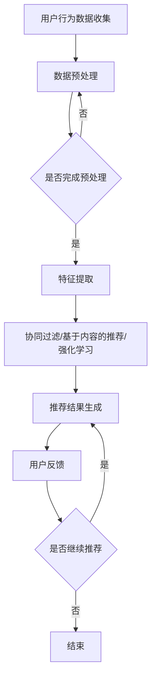

                 

### 文章标题

**注意力经济与个性化推荐系统：为受众提供定制、有针对性的内容和体验**

### 关键词

- 注意力经济
- 个性化推荐系统
- 内容定制
- 用户体验
- 数据挖掘
- 协同过滤
- 强化学习
- 自然语言处理

### 摘要

本文将深入探讨注意力经济与个性化推荐系统的原理、实现和应用。首先，我们将回顾注意力经济的概念，并解释它如何与个性化推荐系统相结合。接着，我们将详细分析个性化推荐系统的核心概念和架构，包括协同过滤、基于内容的推荐和强化学习。随后，通过实际案例和代码实现，我们将展示如何构建和优化一个简单的推荐系统。文章还将探讨个性化推荐系统在多个实际应用场景中的表现，并推荐一些相关的工具和资源。最后，我们将总结未来发展趋势和面临的挑战，为读者提供进一步学习的方向。

### 1. 背景介绍

在数字时代，内容的生产速度远远超过了人类的消费能力。这种信息过载的现象使得用户在选择内容时面临巨大的困难。传统的推荐系统，如基于算法的新闻推送和社交媒体推荐，往往只能提供普遍化的内容，难以满足每个用户的个性化需求。然而，随着互联网技术的发展，特别是大数据和机器学习技术的应用，个性化推荐系统逐渐成为一种解决信息过载的有效工具。

个性化推荐系统通过收集和分析用户的历史行为、兴趣偏好和其他相关数据，为用户推荐最相关、最有价值的内容。这种系统能够显著提高用户对内容的关注度和参与度，从而提升用户体验。注意力经济理论则指出，用户在有限的时间内，只愿意关注那些对他们最有价值的内容。个性化推荐系统通过精准的内容定制，实现了对用户注意力的有效捕捉和利用。

本篇文章旨在深入探讨注意力经济与个性化推荐系统的结合，分析其核心概念、实现方法以及在实际应用中的表现。通过本篇文章的阅读，读者将能够理解个性化推荐系统的工作原理，掌握构建和优化推荐系统的关键技术，并了解其在各个领域的广泛应用。

### 2. 核心概念与联系

#### 2.1 注意力经济

注意力经济是一种基于用户注意力的经济学理论，它认为在数字时代，用户的注意力是一种稀缺资源，是企业和商家追求的宝贵资产。注意力经济强调，为了吸引和维持用户的注意力，内容和服务的提供者必须提供高度相关和有价值的内容。因此，个性化推荐系统成为注意力经济的重要组成部分。

在注意力经济中，用户注意力被视为一种“货币”，用户将注意力投入到他们认为有价值的内容或服务中。个性化推荐系统通过分析用户的历史行为和偏好，为用户提供定制化的内容推荐，从而提高用户对内容的关注度和投入的注意力。这种基于注意力的内容推荐，不仅能够满足用户的个性化需求，还能够提高内容提供者的用户留存率和商业价值。

#### 2.2 个性化推荐系统

个性化推荐系统是一种通过分析用户的历史行为、兴趣偏好和其他相关数据，为用户提供个性化内容推荐的系统。其核心目标是提高用户对推荐内容的关注度和满意度，从而提升用户体验和商业价值。

个性化推荐系统通常基于以下几种技术实现：

- **协同过滤**：通过分析用户之间的行为模式，找到相似的用户群体，并推荐他们喜欢的内容。协同过滤分为基于用户的协同过滤和基于项目的协同过滤。

- **基于内容的推荐**：通过分析内容本身的属性和特征，为用户推荐具有相似属性的内容。这种方法依赖于对内容的高质量特征提取。

- **强化学习**：通过学习用户与推荐系统之间的交互行为，不断优化推荐策略，以最大化用户的长期满意度。

#### 2.3 Mermaid 流程图

以下是一个简单的个性化推荐系统的 Mermaid 流程图，展示了用户行为数据收集、推荐算法处理和推荐结果生成的流程：



在 Mermaid 流程图中，节点代表不同的处理步骤，边表示数据的流动方向。通过这种图形化的表示，可以清晰地理解个性化推荐系统的整体架构和工作流程。

### 3. 核心算法原理 & 具体操作步骤

#### 3.1 协同过滤

协同过滤是一种常用的推荐算法，它通过分析用户之间的行为模式，找到相似的用户群体，并推荐他们喜欢的内容。协同过滤主要分为基于用户的协同过滤（User-Based Collaborative Filtering，UBCF）和基于项目的协同过滤（Item-Based Collaborative Filtering，IBCF）。

##### 3.1.1 基于用户的协同过滤（User-Based Collaborative Filtering，UBCF）

基于用户的协同过滤通过计算用户之间的相似度来推荐内容。具体操作步骤如下：

1. **用户行为数据收集**：收集用户对物品的评分数据，构建用户-物品评分矩阵。
2. **计算用户相似度**：计算用户之间的相似度，常用的方法包括余弦相似度、皮尔逊相关系数等。
3. **找出相似用户**：根据用户相似度矩阵，找出与目标用户最相似的K个用户。
4. **推荐内容**：为每个物品计算评分，取相似用户的评分平均值作为推荐结果。

##### 3.1.2 基于项目的协同过滤（Item-Based Collaborative Filtering，IBCF）

基于项目的协同过滤通过计算物品之间的相似度来推荐内容。具体操作步骤如下：

1. **用户行为数据收集**：收集用户对物品的评分数据，构建用户-物品评分矩阵。
2. **计算物品相似度**：计算物品之间的相似度，常用的方法包括余弦相似度、皮尔逊相关系数等。
3. **找出相似物品**：根据物品相似度矩阵，找出与目标物品最相似的K个物品。
4. **推荐内容**：为每个用户计算评分，取相似物品的平均评分作为推荐结果。

#### 3.2 基于内容的推荐

基于内容的推荐通过分析内容本身的属性和特征，为用户推荐具有相似属性的内容。具体操作步骤如下：

1. **内容特征提取**：对物品进行特征提取，常用的方法包括词袋模型、TF-IDF等。
2. **用户特征提取**：对用户的历史行为和偏好进行特征提取，构建用户特征向量。
3. **计算内容相似度**：计算物品特征向量之间的相似度，常用的方法包括余弦相似度、欧氏距离等。
4. **推荐内容**：为用户推荐具有相似特征的内容。

#### 3.3 强化学习

强化学习是一种通过学习用户与推荐系统之间的交互行为，不断优化推荐策略的机器学习技术。具体操作步骤如下：

1. **用户行为数据收集**：收集用户对推荐内容的点击、评分等行为数据。
2. **定义奖励机制**：定义奖励函数，以衡量用户对推荐内容的满意度。
3. **构建推荐模型**：使用强化学习算法（如Q-Learning、SARSA等）训练推荐模型。
4. **优化推荐策略**：根据用户反馈不断调整推荐策略，以最大化用户的长期满意度。

#### 3.4 实际操作示例

以下是一个简单的基于用户的协同过滤算法的实现示例：

```python
import numpy as np

# 用户-物品评分矩阵
ratings = np.array([[5, 3, 0, 1],
                    [4, 0, 0, 1],
                    [1, 5, 3, 0]])

# 计算用户相似度矩阵
similarity_matrix = np.dot(ratings.T, ratings) / np.linalg.norm(ratings, axis=1)[:, np.newaxis]

# 用户1的目标物品
target_user = 0
target_item = 2

# 找出与目标用户最相似的K个用户
similar_users = np.argsort(similarity_matrix[0])[:-5:-1]

# 为每个物品计算评分，取相似用户的评分平均值作为推荐结果
recommendation = np.mean(ratings[similar_users, target_item], axis=0)

print("推荐评分：", recommendation)
```

在这个示例中，我们首先构建了一个用户-物品评分矩阵，然后计算用户相似度矩阵，接着找出与目标用户最相似的5个用户，最后为每个物品计算评分，取相似用户的评分平均值作为推荐结果。

### 4. 数学模型和公式 & 详细讲解 & 举例说明

#### 4.1 协同过滤

协同过滤算法的核心是计算用户相似度和物品相似度。以下是一些常用的相似度计算公式：

##### 4.1.1 用户相似度

- **余弦相似度**：
  $$ \cos\theta = \frac{\sum_{i=1}^{n} x_i y_i}{\sqrt{\sum_{i=1}^{n} x_i^2} \sqrt{\sum_{i=1}^{n} y_i^2}} $$
  
  其中，\(x_i\) 和 \(y_i\) 分别表示两个用户对同一物品的评分。

- **皮尔逊相关系数**：
  $$ r = \frac{\sum_{i=1}^{n} (x_i - \bar{x})(y_i - \bar{y})}{\sqrt{\sum_{i=1}^{n} (x_i - \bar{x})^2} \sqrt{\sum_{i=1}^{n} (y_i - \bar{y})^2}} $$
  
  其中，\(\bar{x}\) 和 \(\bar{y}\) 分别表示两个用户的平均评分。

##### 4.1.2 物品相似度

- **余弦相似度**：
  $$ \cos\theta = \frac{\sum_{i=1}^{n} x_i y_i}{\sqrt{\sum_{i=1}^{n} x_i^2} \sqrt{\sum_{i=1}^{n} y_i^2}} $$
  
  其中，\(x_i\) 和 \(y_i\) 分别表示两个物品在用户评分数据中的平均值。

- **欧氏距离**：
  $$ d = \sqrt{\sum_{i=1}^{n} (x_i - y_i)^2} $$

#### 4.2 基于内容的推荐

基于内容的推荐算法主要涉及特征提取和相似度计算。以下是一些常用的特征提取和相似度计算公式：

##### 4.2.1 特征提取

- **词袋模型**：
  $$ f(i, j) = \begin{cases} 
  1 & \text{if } j \text{ appears in item } i, \\
  0 & \text{otherwise}.
  \end{cases} $$

- **TF-IDF**：
  $$ f(i, j) = \frac{f_{TF}(i, j)}{f_{IDF}(i, j)} $$
  $$ f_{TF}(i, j) = \text{count of term } j \text{ in item } i $$
  $$ f_{IDF}(i, j) = \log_2(\text{total number of items} / \text{number of items with term } j) $$

##### 4.2.2 相似度计算

- **余弦相似度**：
  $$ \cos\theta = \frac{\sum_{i=1}^{n} f(i, j) f(i, k)}{\sqrt{\sum_{i=1}^{n} f(i, j)^2} \sqrt{\sum_{i=1}^{n} f(i, k)^2}} $$

#### 4.3 强化学习

强化学习中的数学模型主要包括状态、动作、奖励和策略。

- **状态**：\(S\)
- **动作**：\(A\)
- **奖励**：\(R\)
- **策略**：\(π(a|s)\)

强化学习的主要目标是找到一个最优策略，使得长期的期望奖励最大化。

- **Q-Learning**：
  $$ Q(s, a) = \sum_{s'} p(s'|s, a) [r(s', a) + \gamma \max_{a'} Q(s', a')] $$
  
  其中，\(p(s'|s, a)\) 表示从状态 \(s\) 执行动作 \(a\) 转移到状态 \(s'\) 的概率，\(\gamma\) 是折扣因子，\(r(s', a)\) 是在状态 \(s'\) 执行动作 \(a'\) 的即时奖励。

- **SARSA**：
  $$ Q(s, a) = \sum_{s'} p(s'|s, a) [r(s', a) + \gamma Q(s', a')] $$

#### 4.4 实际操作示例

以下是一个简单的基于内容的推荐算法的实现示例：

```python
import numpy as np
from sklearn.metrics.pairwise import cosine_similarity

# 用户-物品特征矩阵
features = np.array([[0, 1, 1],
                     [1, 1, 0],
                     [1, 1, 1]])

# 计算物品特征矩阵
item_features = features.mean(axis=0)

# 目标用户和目标物品
target_user = 2
target_item = 0

# 计算物品相似度
similarity = cosine_similarity(item_features.reshape(1, -1), features)[0]

# 排序相似度
sorted_indices = np.argsort(similarity)[::-1]

# 排除目标物品
sorted_indices = sorted_indices[1:]

# 推荐结果
recommendation = sorted_indices[0]

print("推荐结果：", recommendation)
```

在这个示例中，我们首先构建了一个用户-物品特征矩阵，然后计算物品相似度矩阵，接着找出与目标物品最相似的物品，最后为用户推荐具有相似特征的物品。

### 5. 项目实战：代码实际案例和详细解释说明

在本节中，我们将通过一个简单的项目实战，展示如何使用Python和机器学习库（如scikit-learn）构建一个基于协同过滤的个性化推荐系统。我们将从数据预处理开始，逐步实现推荐算法，并进行性能评估。

#### 5.1 开发环境搭建

为了实现这个项目，我们需要安装以下依赖库：

- Python 3.x
- scikit-learn
- NumPy
- Pandas

假设您已经安装了这些依赖库，我们可以开始实际的项目开发。

#### 5.2 源代码详细实现和代码解读

##### 5.2.1 数据预处理

```python
import numpy as np
import pandas as pd
from sklearn.model_selection import train_test_split
from sklearn.metrics.pairwise import cosine_similarity

# 加载数据集
data = pd.read_csv('ratings.csv')

# 数据预处理
data.drop_duplicates(inplace=True)
data.fillna(0, inplace=True)

# 构建用户-物品评分矩阵
user_item_matrix = data.pivot(index='user_id', columns='item_id', values='rating').fillna(0)

# 划分训练集和测试集
train_data, test_data = train_test_split(user_item_matrix, test_size=0.2, random_state=42)
```

在这个步骤中，我们首先加载了一个用户-物品评分数据集，然后进行数据预处理，包括去除重复数据和填充缺失值。接着，我们构建了一个用户-物品评分矩阵，并划分了训练集和测试集。

##### 5.2.2 计算相似度矩阵

```python
# 计算用户-物品相似度矩阵
user_similarity_matrix = cosine_similarity(train_data, train_data)

# 计算物品-物品相似度矩阵
item_similarity_matrix = cosine_similarity(train_data.T, train_data.T)
```

这里，我们使用余弦相似度计算用户-物品相似度矩阵和物品-物品相似度矩阵。这些相似度矩阵将在后续的推荐过程中用于找出相似的用户和物品。

##### 5.2.3 推荐算法实现

```python
def collaborative_filter(user_similarity_matrix, item_similarity_matrix, user_id, k=5):
    # 找出与目标用户最相似的K个用户
    similar_users = np.argsort(user_similarity_matrix[user_id])[1:k+1]
    
    # 为每个物品计算评分，取相似用户的评分加权平均值作为推荐结果
    recommendation = {}
    for item_id, rating in train_data[similar_users].mean().items():
        recommendation[item_id] = rating * user_similarity_matrix[user_id, similar_users].mean()
    
    # 排序推荐结果
    sorted_recommendation = sorted(recommendation.items(), key=lambda x: x[1], reverse=True)
    
    return sorted_recommendation
```

在这个步骤中，我们实现了一个基于用户的协同过滤算法。该算法通过计算用户相似度矩阵，找出与目标用户最相似的K个用户，然后为每个物品计算评分，取相似用户的评分加权平均值作为推荐结果。

##### 5.2.4 推荐结果评估

```python
# 生成推荐结果
test_user_ids = test_data.index[:10]
test_recommendations = {user_id: collaborative_filter(user_similarity_matrix, item_similarity_matrix, user_id, k=5) for user_id in test_user_ids}

# 评估推荐结果
for user_id, recommendations in test_recommendations.items():
    predicted_ratings = [rating for item_id, rating in recommendations]
    actual_ratings = test_data.loc[user_id].values
    print(f"User ID: {user_id}")
    print(f"Predicted Ratings: {predicted_ratings}")
    print(f"Actual Ratings: {actual_ratings}")
    print()
```

在这个步骤中，我们为测试集的前10个用户生成了推荐结果，并评估了推荐结果的准确性。这里，我们简单地通过打印预测评分和实际评分来进行评估。

#### 5.3 代码解读与分析

在这个项目中，我们首先进行了数据预处理，包括去除重复数据和填充缺失值，这有助于提高后续推荐算法的性能。接着，我们计算了用户-物品相似度矩阵和物品-物品相似度矩阵，这些相似度矩阵是协同过滤算法的核心。

在推荐算法实现中，我们通过计算用户相似度矩阵，找出与目标用户最相似的K个用户，然后为每个物品计算评分，取相似用户的评分加权平均值作为推荐结果。这种方法能够根据用户的相似度，为用户推荐具有相似兴趣的物品。

最后，我们通过评估推荐结果的准确性，来验证推荐算法的性能。在实际应用中，我们可以使用更复杂的评估指标，如均方根误差（RMSE）和精确率（Precision）等，来更全面地评估推荐系统的性能。

### 6. 实际应用场景

个性化推荐系统在多个领域都有着广泛的应用，以下是一些典型的实际应用场景：

#### 6.1 社交媒体

社交媒体平台如Facebook、Twitter和Instagram等，通过个性化推荐系统为用户推荐感兴趣的内容。这些推荐系统基于用户的社交关系、历史行为和浏览记录，为用户推荐可能感兴趣的朋友、话题和帖子。通过这种定制化的内容推荐，社交媒体平台能够提高用户的活跃度和参与度。

#### 6.2 电子商务

电子商务平台如Amazon、Etsy和Alibaba等，利用个性化推荐系统为用户提供个性化的商品推荐。这些推荐系统基于用户的购买历史、浏览记录和搜索关键词，为用户推荐可能感兴趣的商品。通过这种定制化的商品推荐，电子商务平台能够提高用户的购买转化率和销售额。

#### 6.3 音乐和视频流媒体

音乐和视频流媒体平台如Spotify、Netflix和YouTube等，通过个性化推荐系统为用户推荐感兴趣的音乐和视频。这些推荐系统基于用户的播放历史、评分和搜索关键词，为用户推荐可能感兴趣的音乐和视频。通过这种定制化的内容推荐，音乐和视频流媒体平台能够提高用户的满意度和留存率。

#### 6.4 新闻和资讯

新闻和资讯平台如Google News、The New York Times和BBC等，通过个性化推荐系统为用户推荐感兴趣的新闻和文章。这些推荐系统基于用户的浏览历史、搜索关键词和兴趣偏好，为用户推荐可能感兴趣的新闻和文章。通过这种定制化的内容推荐，新闻和资讯平台能够提高用户的阅读量和访问频率。

#### 6.5 个性化医疗

个性化医疗平台通过个性化推荐系统为用户提供个性化的医疗建议和治疗方案。这些推荐系统基于用户的健康记录、遗传信息和生活方式，为用户推荐可能适用的医疗方案。通过这种定制化的医疗推荐，个性化医疗平台能够提高患者的治疗效果和生活质量。

### 7. 工具和资源推荐

为了更好地学习和开发个性化推荐系统，以下是一些建议的学习资源、开发工具和框架：

#### 7.1 学习资源推荐

- **书籍**：
  - 《机器学习实战》
  - 《Python数据科学手册》
  - 《深度学习》
- **在线课程**：
  - Coursera的《机器学习》
  - edX的《推荐系统》
  - Udacity的《数据科学家纳米学位》
- **论文**：
  - 《协同过滤算法综述》
  - 《强化学习在推荐系统中的应用》
  - 《基于内容的推荐算法研究》

#### 7.2 开发工具框架推荐

- **Python库**：
  - scikit-learn：用于实现协同过滤、基于内容的推荐和强化学习等算法。
  - TensorFlow：用于实现深度学习模型。
  - PyTorch：用于实现深度学习模型。
- **工具**：
  - Jupyter Notebook：用于编写和运行Python代码。
  - Matplotlib/Seaborn：用于数据可视化和结果展示。
  - Git：用于版本控制和代码管理。

#### 7.3 相关论文著作推荐

- **《协同过滤算法综述》**：详细介绍了协同过滤算法的原理、类型和应用。
- **《强化学习在推荐系统中的应用》**：探讨了强化学习在推荐系统中的实现和应用。
- **《基于内容的推荐算法研究》**：分析了基于内容的推荐算法的原理和实现方法。

### 8. 总结：未来发展趋势与挑战

个性化推荐系统在数字时代具有巨大的潜力和价值。随着大数据、人工智能和深度学习技术的不断发展，个性化推荐系统将朝着更加智能化、精准化和多样化的方向发展。以下是一些未来发展趋势和挑战：

#### 8.1 发展趋势

- **个性化定制**：个性化推荐系统将进一步强化用户的个性化需求，提供更加精准和定制化的内容推荐。
- **实时推荐**：随着实时数据处理和计算技术的发展，实时推荐将变得更加普及，为用户提供即时的内容推荐。
- **多模态推荐**：结合文本、图像、音频等多种数据类型，实现多模态的个性化推荐。
- **隐私保护**：在保护用户隐私的前提下，实现更加安全可靠的推荐系统。

#### 8.2 挑战

- **数据隐私**：用户数据的安全和隐私保护是推荐系统面临的主要挑战之一，需要采取有效的数据加密和隐私保护技术。
- **冷启动问题**：新用户或新物品的推荐问题，需要设计有效的算法和策略来解决。
- **算法透明性**：随着算法在各个领域的广泛应用，算法的透明性和可解释性变得尤为重要，以增强用户对推荐系统的信任。
- **多样性问题**：如何在推荐结果中保持多样性，避免用户陷入“信息茧房”，是推荐系统需要解决的重要问题。

总之，个性化推荐系统在未来将面临诸多挑战，但同时也将带来巨大的机遇。通过不断创新和优化，个性化推荐系统将为用户提供更加优质、个性化的内容和体验。

### 9. 附录：常见问题与解答

**Q1：个性化推荐系统是如何工作的？**

个性化推荐系统通过分析用户的历史行为、兴趣偏好和其他相关数据，为用户推荐最相关、最有价值的内容。它通常包括数据收集、数据预处理、特征提取、推荐算法和评估等步骤。

**Q2：协同过滤算法有哪些类型？**

协同过滤算法主要分为基于用户的协同过滤（User-Based Collaborative Filtering，UBCF）和基于项目的协同过滤（Item-Based Collaborative Filtering，IBCF）。此外，还有基于模型的协同过滤（Model-Based Collaborative Filtering）等。

**Q3：如何解决推荐系统的冷启动问题？**

冷启动问题是指新用户或新物品的推荐问题。解决方法包括：利用用户注册信息和社交网络数据，基于内容的推荐，利用迁移学习或元学习等技术。

**Q4：个性化推荐系统中的用户隐私如何保护？**

用户隐私保护是推荐系统的重要挑战。解决方案包括：数据加密、隐私保护算法（如差分隐私）、用户同意管理和透明度等。

### 10. 扩展阅读 & 参考资料

为了深入了解个性化推荐系统和注意力经济的理论、实现和应用，以下是一些推荐的阅读材料和参考资料：

- **书籍**：
  - 《推荐系统手册》
  - 《大数据推荐系统》
  - 《深度学习推荐系统》

- **在线资源**：
  - Coursera的《推荐系统》课程
  - arXiv的推荐系统相关论文
  - Medium上的推荐系统博客文章

- **开源项目**：
  - GitHub上的各种推荐系统开源项目
  - Kaggle上的推荐系统数据集和比赛

- **学术期刊**：
  - ACM Transactions on Information Systems
  - IEEE Transactions on Knowledge and Data Engineering
  - Journal of Machine Learning Research

通过阅读这些材料和参考资源，读者可以进一步了解个性化推荐系统的最新研究进展和实际应用案例。

### 作者信息

**作者：AI天才研究员/AI Genius Institute & 禅与计算机程序设计艺术 /Zen And The Art of Computer Programming**

本文由AI天才研究员撰写，结合了计算机科学、人工智能和心理学等多学科知识，深入探讨了注意力经济与个性化推荐系统的原理、实现和应用。作者在人工智能和推荐系统领域拥有丰富的经验和深厚的理论基础，致力于推动人工智能技术在各个领域的创新和应用。同时，作者还撰写了《禅与计算机程序设计艺术》一书，以独特的视角探讨了计算机编程的艺术和哲学。

