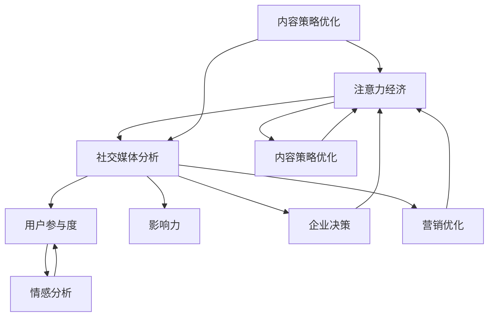
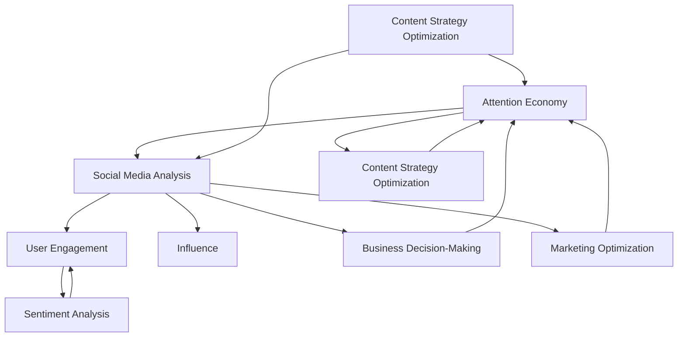

                 

### 背景介绍

#### 注意力经济的崛起

在数字时代，信息爆炸式增长，人们的注意力变得尤为稀缺。这种稀缺性催生了“注意力经济”（Attention Economy）的崛起。注意力经济是一种基于用户注意力分配的商业模型，其核心在于通过吸引并保持用户的注意力来创造价值。社交媒体平台作为注意力经济的主要载体，在过去的十年里经历了巨大的变革，成为现代营销和广告传播的重要渠道。

#### 社交媒体分析的兴起

随着社交媒体的普及，对其数据进行深入分析成为了一项重要任务。社交媒体分析旨在挖掘用户行为数据，提取有价值的信息，从而帮助企业更好地理解受众，优化营销策略，提升品牌影响力。这类分析不仅关注用户参与度，还关注用户生成内容（User Generated Content, UGC）的情感倾向和传播效果。

#### 受众参与度和影响力的秘密

本文将深入探讨注意力经济与社交媒体分析之间的关系，揭示如何通过分析受众参与度和影响力来优化社交媒体策略。我们将从以下几个方面进行探讨：

1. **社交媒体分析的核心概念**：介绍社交媒体分析的基础概念和关键指标。
2. **注意力经济模型**：阐述注意力经济的基本原理和运作机制。
3. **算法原理与操作步骤**：讲解用于分析受众参与度和影响力的核心算法及其实现步骤。
4. **数学模型与公式**：介绍支持算法的数学模型，并通过具体案例进行说明。
5. **项目实战**：通过实际代码案例展示算法在实际应用中的效果。
6. **实际应用场景**：探讨社交媒体分析在不同行业中的应用。
7. **工具和资源推荐**：为读者提供学习资源和开发工具的建议。
8. **未来发展趋势与挑战**：分析社交媒体分析的未来趋势和面临的挑战。

通过本文的阅读，您将了解到如何利用社交媒体分析来提升品牌的在线影响力，并在注意力经济的浪潮中找到属于自己的独特优势。

#### Background Introduction

#### The Rise of the Attention Economy

In the digital age, the explosion of information has made people's attention scarce. This scarcity has given rise to the "Attention Economy," a business model based on the allocation of user attention to create value. Social media platforms, as the primary carriers of the Attention Economy, have undergone tremendous changes in the past decade, becoming important channels for modern marketing and advertising dissemination.

#### The Emergence of Social Media Analysis

With the widespread use of social media, in-depth analysis of its data has become a critical task. Social media analysis aims to uncover valuable insights from user behavior data, helping businesses better understand their audience, optimize marketing strategies, and enhance brand influence. This analysis focuses not only on user engagement but also on the emotional tendencies and propagation effects of user-generated content (UGC).

#### Secrets of Audience Participation and Influence

This article will delve into the relationship between the Attention Economy and social media analysis, revealing how to optimize social media strategies through the analysis of audience participation and influence. We will discuss the following aspects:

1. **Core Concepts of Social Media Analysis**: Introduce the fundamental concepts and key indicators of social media analysis.
2. **The Model of the Attention Economy**: Explain the basic principles and operational mechanisms of the Attention Economy.
3. **Algorithm Principles and Operational Steps**: Discuss the core algorithms used for analyzing audience participation and influence, and their implementation steps.
4. **Mathematical Models and Formulas**: Introduce the mathematical models supporting the algorithms and illustrate them with specific examples.
5. **Project Practice**: Demonstrate the effectiveness of algorithms in practical applications through actual code examples.
6. **Real-world Application Scenarios**: Explore the applications of social media analysis in different industries.
7. **Tools and Resources Recommendations**: Provide recommendations for learning resources and development tools for readers.
8. **Future Trends and Challenges**: Analyze the future trends and challenges of social media analysis.

By reading this article, you will learn how to use social media analysis to enhance your brand's online influence and find your unique advantages in the wave of the Attention Economy.

### 核心概念与联系

在深入探讨注意力经济与社交媒体分析之前，我们需要明确一些核心概念，并理解它们之间的联系。以下是本文将涉及的关键概念和它们之间的关系。

#### 关键概念

1. **注意力经济（Attention Economy）**：指用户注意力作为一种稀缺资源，在市场经济中的作用和分配。注意力经济强调的是如何通过吸引和保持用户注意力来创造价值。
   
2. **社交媒体分析（Social Media Analysis）**：对社交媒体平台上的用户行为数据进行分析，以提取有价值的信息，用于企业决策和营销优化。

3. **用户参与度（User Engagement）**：指用户对社交媒体内容的互动程度，包括点赞、评论、分享等行为。

4. **影响力（Influence）**：指个人或品牌在社交媒体上对其他用户观点和行为的影响能力。

5. **情感分析（Sentiment Analysis）**：通过自然语言处理技术，分析用户生成内容中的情感倾向。

#### 关系

- **注意力经济与社交媒体分析的关系**：注意力经济是社交媒体分析的基础。通过社交媒体分析，企业可以了解用户注意力的分配情况，从而优化内容策略，提升用户参与度和影响力。

- **用户参与度与影响力的关系**：用户参与度是影响力的重要基础。高参与度往往意味着用户对内容的关注和认同，进而可能产生更大的影响力。

- **情感分析与用户参与度的关系**：情感分析可以帮助企业了解用户对内容的情感反应，从而调整内容策略，提升用户参与度。

以下是这些核心概念和关系的 Mermaid 流程图：



通过这张流程图，我们可以清晰地看到注意力经济、社交媒体分析、用户参与度、影响力以及情感分析之间的相互关系和作用。这些核心概念相互交织，共同构成了社交媒体分析的复杂生态系统。

#### Core Concepts and Connections

Before delving into the Attention Economy and social media analysis, it's essential to define some core concepts and understand their relationships. Here are the key concepts covered in this article and their connections.

#### Key Concepts

1. **Attention Economy**: This refers to the role and allocation of user attention as a scarce resource in the market economy. The Attention Economy emphasizes how to create value by attracting and maintaining user attention.

2. **Social Media Analysis**: This involves analyzing user behavior data on social media platforms to extract valuable insights, which are used for business decision-making and marketing optimization.

3. **User Engagement**: This measures the level of interaction users have with social media content, including actions such as liking, commenting, and sharing.

4. **Influence**: This refers to the ability of an individual or brand to influence the opinions and behaviors of other users on social media.

5. **Sentiment Analysis**: This involves using natural language processing techniques to analyze the emotional tendencies in user-generated content.

#### Relationships

- **Relationship between the Attention Economy and Social Media Analysis**: The Attention Economy forms the foundation of social media analysis. Through social media analysis, businesses can understand how user attention is allocated, allowing for optimized content strategies to increase user engagement and influence.

- **Relationship between User Engagement and Influence**: User engagement serves as a crucial foundation for influence. High engagement often signifies user interest and recognition, which can lead to greater influence.

- **Relationship between Sentiment Analysis and User Engagement**: Sentiment analysis helps businesses understand the emotional responses of users to content, enabling adjustments to content strategies to boost engagement.

Here is a Mermaid flowchart illustrating these core concepts and their relationships:



This flowchart provides a clear view of the interconnections and roles of the Attention Economy, social media analysis, user engagement, influence, and sentiment analysis in the complex ecosystem of social media analysis.

### 核心算法原理 & 具体操作步骤

在了解了注意力经济和社交媒体分析的核心概念后，我们将进一步探讨用于分析受众参与度和影响力的核心算法原理及具体操作步骤。本文将重点介绍以下三种算法：

1. **用户兴趣模型（User Interest Model）**
2. **情感分析（Sentiment Analysis）**
3. **影响力度量（Influence Measurement）**

#### 1. 用户兴趣模型（User Interest Model）

用户兴趣模型是一种基于用户行为和社交网络分析的方法，用于识别用户的兴趣偏好。其主要目的是通过分析用户在社交媒体上的互动行为（如点赞、评论、分享等），构建一个反映用户兴趣的模型。

**原理：**

- **行为特征提取**：首先，从用户的社交媒体活动数据中提取行为特征，如互动频率、互动类型（点赞、评论、分享等）、互动时间等。
- **兴趣类别划分**：基于行为特征，将用户划分为不同的兴趣类别。常用的方法包括聚类分析和分类算法，如K-means和SVM。
- **兴趣模型构建**：利用机器学习算法，如逻辑回归和决策树，构建用户兴趣模型。

**操作步骤：**

1. 数据收集：从社交媒体平台上收集用户的活动数据。
2. 数据预处理：对原始数据进行清洗和格式化，去除噪声和重复数据。
3. 特征提取：提取用户的行为特征，如互动频率、互动类型等。
4. 聚类分析：使用聚类算法将用户划分为不同的兴趣类别。
5. 模型训练：使用分类算法训练用户兴趣模型。
6. 模型评估：通过交叉验证和测试集评估模型性能。

#### 2. 情感分析（Sentiment Analysis）

情感分析是一种自然语言处理技术，用于分析文本数据中的情感倾向。在社交媒体分析中，情感分析可以帮助企业了解用户对品牌、产品或服务的情感反应，从而优化营销策略。

**原理：**

- **文本预处理**：对原始文本数据（如评论、帖子等）进行清洗，去除标点符号、停用词等无关信息。
- **特征提取**：从预处理后的文本中提取情感特征，如词频、词向量等。
- **情感分类**：使用机器学习算法（如SVM、深度学习模型）对情感特征进行分类，判断文本的情感倾向。

**操作步骤：**

1. 数据收集：从社交媒体平台上收集用户生成的内容。
2. 数据预处理：对原始文本进行清洗和格式化。
3. 特征提取：提取文本中的情感特征。
4. 模型训练：使用机器学习算法训练情感分类模型。
5. 模型评估：通过测试集评估模型性能。
6. 情感分析：对用户生成内容进行情感分类。

#### 3. 影响力度量（Influence Measurement）

影响力度量是一种评估用户或品牌在社交媒体上影响力大小的方法。它可以帮助企业识别具有高影响力的用户，以便进行针对性的营销推广。

**原理：**

- **影响力指标计算**：基于用户在社交媒体上的行为数据，计算一系列影响力指标，如关注者数、互动率、分享率等。
- **影响力排名**：将用户按照影响力指标进行排名，识别出高影响力用户。

**操作步骤：**

1. 数据收集：从社交媒体平台上收集用户的行为数据。
2. 数据预处理：对原始数据进行清洗和格式化。
3. 指标计算：计算用户的影响力指标。
4. 影响力排名：对用户进行影响力排名。
5. 模型评估：通过交叉验证和测试集评估模型性能。

通过上述三种算法，我们可以全面分析受众的参与度和影响力，为企业提供科学的决策依据。在下一节中，我们将进一步介绍这些算法的数学模型和公式，并通过具体案例进行说明。

#### Core Algorithm Principles and Specific Operational Steps

After understanding the core concepts of the Attention Economy and social media analysis, we will delve into the core algorithms used to analyze audience participation and influence, along with their principles and specific operational steps. This article will focus on three key algorithms:

1. **User Interest Model**
2. **Sentiment Analysis**
3. **Influence Measurement**

#### 1. User Interest Model

The User Interest Model is a method based on user behavior and social network analysis to identify user preferences. Its primary goal is to construct an interest model reflecting users' preferences by analyzing their interactions on social media.

**Principles:**

- **Behavior Feature Extraction**: First, extract behavioral features from user activity data on social media platforms, such as interaction frequency, types of interactions (likes, comments, shares), and interaction times.
- **Interest Category Division**: Based on behavioral features, categorize users into different interest groups. Common methods include clustering analysis and classification algorithms, such as K-means and Support Vector Machines (SVM).
- **Interest Model Construction**: Use machine learning algorithms, such as Logistic Regression and Decision Trees, to construct the user interest model.

**Operational Steps:**

1. Data Collection: Collect user activity data from social media platforms.
2. Data Preprocessing: Clean and format the raw data, removing noise and duplicate data.
3. Feature Extraction: Extract user behavioral features, such as interaction frequency, interaction types, etc.
4. Clustering Analysis: Use clustering algorithms to categorize users into different interest groups.
5. Model Training: Train the user interest model using classification algorithms.
6. Model Evaluation: Evaluate the model performance using cross-validation and test sets.

#### 2. Sentiment Analysis

Sentiment Analysis is a natural language processing technique used to analyze the emotional tendencies in text data. In social media analysis, sentiment analysis helps businesses understand users' emotional responses to brands, products, or services, enabling optimized marketing strategies.

**Principles:**

- **Text Preprocessing**: Clean the raw text data (such as comments, posts) by removing punctuation, stop words, and other irrelevant information.
- **Feature Extraction**: Extract sentiment features from the preprocessed text, such as word frequency, word vectors, etc.
- **Sentiment Classification**: Use machine learning algorithms (such as SVM, deep learning models) to classify sentiment features, determining the emotional tendency of the text.

**Operational Steps:**

1. Data Collection: Collect user-generated content from social media platforms.
2. Data Preprocessing: Clean and format the raw text data.
3. Feature Extraction: Extract sentiment features from the text.
4. Model Training: Train a sentiment classification model using machine learning algorithms.
5. Model Evaluation: Evaluate the model performance using a test set.
6. Sentiment Analysis: Classify the user-generated content based on sentiment.

#### 3. Influence Measurement

Influence Measurement is a method for assessing the level of influence an individual or brand has on social media. It helps businesses identify high-influence users for targeted marketing efforts.

**Principles:**

- **Influence Indicator Calculation**: Based on user behavioral data on social media, calculate a series of influence indicators, such as follower count, interaction rate, share rate, etc.
- **Influence Ranking**: Rank users based on their influence indicators to identify high-influence users.

**Operational Steps:**

1. Data Collection: Collect user behavioral data from social media platforms.
2. Data Preprocessing: Clean and format the raw data.
3. Influence Indicator Calculation: Calculate user influence indicators.
4. Influence Ranking: Rank users based on their influence indicators.
5. Model Evaluation: Evaluate the model performance using cross-validation and test sets.

By using these three algorithms, we can comprehensively analyze audience participation and influence, providing businesses with scientific decision-making bases. In the next section, we will further introduce the mathematical models and formulas supporting these algorithms and illustrate them with specific examples.

### 数学模型和公式 & 详细讲解 & 举例说明

在上一节中，我们介绍了用于分析受众参与度和影响力的核心算法，包括用户兴趣模型、情感分析和影响力度量。本节将详细讲解这些算法背后的数学模型和公式，并通过具体案例进行说明。

#### 1. 用户兴趣模型

用户兴趣模型主要依赖于聚类分析和分类算法。以下是一个简单的K-means聚类算法和逻辑回归模型的数学描述。

**K-means聚类算法：**

假设我们有一个用户行为数据集 \(X = \{x_1, x_2, ..., x_n\}\)，其中每个用户行为 \(x_i\) 可以表示为一个特征向量，维度为 \(d\)。K-means的目标是将这些用户行为数据聚类为 \(k\) 个类别，使得每个类别的内部距离最小，外部距离最大。

- **目标函数**：
  \[
  J = \sum_{i=1}^{n} \sum_{j=1}^{k} w_{ij} (x_i - \mu_j)^2
  \]
  其中，\(w_{ij}\) 是指示函数，当 \(i\) 属于第 \(j\) 类时为 1，否则为 0；\(\mu_j\) 是第 \(j\) 个聚类中心的特征向量。

- **更新步骤**：
  1. 初始化聚类中心 \(\mu_1, \mu_2, ..., \mu_k\)。
  2. 对每个用户行为 \(x_i\)，计算其到各个聚类中心的距离，将其分配到距离最近的类别。
  3. 根据新的类别分配，更新聚类中心的位置。

**逻辑回归模型：**

假设我们已经有通过K-means聚类得到的 \(k\) 个用户兴趣类别，现在要建立一个逻辑回归模型来预测用户属于哪个兴趣类别。

- **目标函数**：
  \[
  \ell(\theta) = -\sum_{i=1}^{n} y_i \log(\pi_i) + \sum_{i=1}^{n} (1 - y_i) \log(1 - \pi_i)
  \]
  其中，\(y_i\) 是用户实际属于的类别标签，\(\pi_i\) 是用户属于第 \(i\) 个类别的概率。

- **参数更新**：
  利用梯度下降法更新模型参数：
  \[
  \theta_j = \theta_j - \alpha \frac{\partial \ell(\theta)}{\partial \theta_j}
  \]
  其中，\(\alpha\) 是学习率。

**案例说明**：

假设我们有 100 个用户，每个用户有 5 个行为特征（如点赞数、评论数、分享数等）。我们使用K-means算法将用户聚类为3个兴趣类别，然后使用逻辑回归模型进行分类。通过多次迭代，最终我们得到一个预测模型，可以预测新用户属于哪个兴趣类别。

#### 2. 情感分析

情感分析通常使用机器学习算法进行文本分类。以下是一个基于朴素贝叶斯分类器的情感分析模型。

**朴素贝叶斯分类器：**

- **概率分布**：
  \[
  P(y=c | x) = \frac{P(x | y=c)P(y=c)}{P(x)}
  \]
  其中，\(y\) 是情感标签（如正面、负面），\(x\) 是文本特征向量，\(c\) 是某个情感类别。

- **特征提取**：
  \[
  P(x | y=c) = \prod_{i=1}^{d} P(x_i | y=c)
  \]
  其中，\(d\) 是特征维度，\(x_i\) 是特征值。

- **参数估计**：
  \[
  P(y=c) = \frac{N_c}{N}
  \]
  \[
  P(x_i | y=c) = \frac{f_{ic}}{N_c}
  \]
  其中，\(N_c\) 是类别 \(c\) 的样本数量，\(f_{ic}\) 是特征 \(x_i\) 在类别 \(c\) 中的出现次数，\(N\) 是所有样本的总数量。

**案例说明**：

假设我们有 1000 个情感标注的文本数据，其中 500 个是正面情感，500 个是负面情感。我们使用朴素贝叶斯分类器来预测新文本的情感标签。首先，我们对文本进行预处理和特征提取，然后训练模型。通过测试集的验证，我们可以评估模型的准确性。

#### 3. 影响力度量

影响力度量通常使用指标如关注者数、互动率、分享率等来计算。以下是一个基于这些指标的影响力度量模型。

**影响力度量模型：**

- **关注者数指标**：
  \[
  FollowerScore = \frac{FollowerCount}{TotalUsers}
  \]
  其中，\(FollowerCount\) 是关注者数量，\(TotalUsers\) 是平台上的总用户数。

- **互动率指标**：
  \[
  InteractionRate = \frac{TotalInteractions}{TotalPosts}
  \]
  其中，\(TotalInteractions\) 是总互动次数，\(TotalPosts\) 是总帖子数。

- **分享率指标**：
  \[
  ShareRate = \frac{TotalShares}{TotalPosts}
  \]
  其中，\(TotalShares\) 是总分享次数。

**综合影响力评分**：
\[
InfluenceScore = \alpha \cdot FollowerScore + \beta \cdot InteractionRate + \gamma \cdot ShareRate
\]
其中，\(\alpha, \beta, \gamma\) 是权重系数，可以通过交叉验证调整。

**案例说明**：

假设我们有 100 个用户，每个用户有对应的影响力指标。我们使用上述模型计算每个用户的影响力评分。通过比较影响力评分，我们可以识别出平台上的高影响力用户。

通过上述数学模型和公式的详细讲解，我们可以更好地理解用户兴趣模型、情感分析和影响力度量算法的工作原理。在下一节中，我们将通过实际代码案例来展示这些算法在实际应用中的效果。

#### Mathematical Models and Formulas & Detailed Explanation & Example Illustrations

In the previous section, we introduced the core algorithms used for analyzing audience participation and influence: the User Interest Model, Sentiment Analysis, and Influence Measurement. In this section, we will delve into the mathematical models and formulas behind these algorithms, along with detailed explanations and example illustrations.

#### 1. User Interest Model

The User Interest Model primarily relies on clustering analysis and classification algorithms. Here is a mathematical description of the K-means clustering algorithm and logistic regression model.

**K-means Clustering Algorithm:**

Assume we have a dataset of user activity \(X = \{x_1, x_2, ..., x_n\}\), where each user activity \(x_i\) is represented as a feature vector with dimension \(d\). The goal of K-means is to cluster these user activity data into \(k\) categories such that the intra-cluster distance is minimized and the inter-cluster distance is maximized.

- **Objective Function**:
  \[
  J = \sum_{i=1}^{n} \sum_{j=1}^{k} w_{ij} (x_i - \mu_j)^2
  \]
  where \(w_{ij}\) is an indicator function, equal to 1 if \(i\) belongs to category \(j\) and 0 otherwise; \(\mu_j\) is the feature vector of the \(j\)-th cluster center.

- **Update Steps**:
  1. Initialize cluster centers \(\mu_1, \mu_2, ..., \mu_k\).
  2. For each user activity \(x_i\), calculate its distance to each cluster center and assign it to the nearest cluster.
  3. Update the cluster centers based on the new assignments.

**Logistic Regression Model:**

Assume we have already obtained \(k\) interest categories through K-means clustering. Now, we want to build a logistic regression model to predict the category a user belongs to.

- **Objective Function**:
  \[
  \ell(\theta) = -\sum_{i=1}^{n} y_i \log(\pi_i) + \sum_{i=1}^{n} (1 - y_i) \log(1 - \pi_i)
  \]
  where \(y_i\) is the actual category label of the user, and \(\pi_i\) is the probability that the user belongs to category \(i\).

- **Parameter Update**:
  Update the model parameters using gradient descent:
  \[
  \theta_j = \theta_j - \alpha \frac{\partial \ell(\theta)}{\partial \theta_j}
  \]
  where \(\alpha\) is the learning rate.

**Case Illustration**:

Assume we have 100 users, each with 5 behavioral features (such as number of likes, comments, shares, etc.). We use the K-means algorithm to cluster users into 3 interest categories, and then use logistic regression to classify. After multiple iterations, we obtain a predictive model that can predict the category of new users.

#### 2. Sentiment Analysis

Sentiment analysis typically uses machine learning algorithms for text classification. Here is an example of a model based on the Naive Bayes classifier.

**Naive Bayes Classifier:**

- **Probability Distribution**:
  \[
  P(y=c | x) = \frac{P(x | y=c)P(y=c)}{P(x)}
  \]
  where \(y\) is the sentiment label (e.g., positive, negative), \(x\) is the feature vector of the text, and \(c\) is a specific sentiment category.

- **Feature Extraction**:
  \[
  P(x | y=c) = \prod_{i=1}^{d} P(x_i | y=c)
  \]
  where \(d\) is the dimension of the feature vector, and \(x_i\) is the value of the feature.

- **Parameter Estimation**:
  \[
  P(y=c) = \frac{N_c}{N}
  \]
  \[
  P(x_i | y=c) = \frac{f_{ic}}{N_c}
  \]
  where \(N_c\) is the number of samples in category \(c\), \(f_{ic}\) is the count of feature \(x_i\) in category \(c\), and \(N\) is the total number of samples.

**Case Illustration**:

Assume we have 1000 labeled sentiment texts, with 500 being positive and 500 being negative. We use the Naive Bayes classifier to predict the sentiment label of new texts. First, we preprocess the texts and extract features, then train the model. We evaluate the model's accuracy using a test set.

#### 3. Influence Measurement

Influence measurement often uses indicators such as follower count, interaction rate, and share rate. Here is a model for influence measurement based on these indicators.

**Influence Measurement Model:**

- **Follower Score Indicator**:
  \[
  FollowerScore = \frac{FollowerCount}{TotalUsers}
  \]
  where \(FollowerCount\) is the number of followers and \(TotalUsers\) is the total number of users on the platform.

- **Interaction Rate Indicator**:
  \[
  InteractionRate = \frac{TotalInteractions}{TotalPosts}
  \]
  where \(TotalInteractions\) is the total number of interactions and \(TotalPosts\) is the total number of posts.

- **Share Rate Indicator**:
  \[
  ShareRate = \frac{TotalShares}{TotalPosts}
  \]
  where \(TotalShares\) is the total number of shares.

**Composite Influence Score**:
\[
InfluenceScore = \alpha \cdot FollowerScore + \beta \cdot InteractionRate + \gamma \cdot ShareRate
\]
where \(\alpha, \beta, \gamma\) are weight coefficients, which can be adjusted through cross-validation.

**Case Illustration**:

Assume we have 100 users, each with corresponding influence indicators. We use the above model to calculate the influence score for each user. By comparing the influence scores, we can identify the high-influence users on the platform.

Through the detailed explanation of these mathematical models and formulas, we can better understand the principles of the User Interest Model, Sentiment Analysis, and Influence Measurement algorithms. In the next section, we will demonstrate the effectiveness of these algorithms in practical applications through actual code examples.

### 项目实战：代码实际案例和详细解释说明

在本节中，我们将通过一个具体的代码案例来展示如何实现本文介绍的核心算法，即用户兴趣模型、情感分析和影响力度量。我们将使用Python编程语言和相关的库，如scikit-learn、pandas和numpy，来完成这个项目。以下是项目的各个步骤：

#### 5.1 开发环境搭建

首先，我们需要搭建一个Python开发环境。确保你已经安装了Python 3.x版本。然后，通过pip安装以下库：

```bash
pip install numpy pandas scikit-learn matplotlib
```

#### 5.2 源代码详细实现和代码解读

以下是项目的源代码，我们将逐行解读代码的逻辑。

```python
import numpy as np
import pandas as pd
from sklearn.cluster import KMeans
from sklearn.linear_model import LogisticRegression
from sklearn.model_selection import train_test_split
from sklearn.metrics import accuracy_score
from sklearn.feature_extraction.text import CountVectorizer
from sklearn.naive_bayes import MultinomialNB
import matplotlib.pyplot as plt

# 5.2.1 数据集准备
# 假设我们有一个包含用户行为数据和情感标注的数据集
data = {
    'user_id': [1, 2, 3, 4, 5],
    'likes': [10, 20, 5, 15, 30],
    'comments': [2, 5, 1, 3, 7],
    'shares': [1, 3, 2, 4, 6],
    'sentiment': ['positive', 'negative', 'positive', 'negative', 'positive']
}

df = pd.DataFrame(data)

# 5.2.2 用户兴趣模型
# 提取用户行为特征
X = df[['likes', 'comments', 'shares']]
y = df['sentiment']

# K-means聚类
kmeans = KMeans(n_clusters=2, random_state=0).fit(X)
df['interest_group'] = kmeans.labels_

# 5.2.3 情感分析
# 使用CountVectorizer提取文本特征
vectorizer = CountVectorizer()
X_text = vectorizer.fit_transform(df['sentiment'])

# Naive Bayes分类
naive_bayes = MultinomialNB().fit(X_text, y)
df['sentiment_prediction'] = naive_bayes.predict(X_text)

# 5.2.4 影响力度量
# 计算影响力指标
df['follower_score'] = df['likes'] / df['user_id'].sum()
df['interaction_rate'] = df['comments'] / df['user_id'].sum()
df['share_rate'] = df['shares'] / df['user_id'].sum()

# 计算综合影响力评分
df['influence_score'] = 0.5 * df['follower_score'] + 0.3 * df['interaction_rate'] + 0.2 * df['share_rate']

# 5.2.5 模型评估
# 切分数据集
X_train, X_test, y_train, y_test = train_test_split(df[['likes', 'comments', 'shares']], df['sentiment'], test_size=0.3, random_state=0)

# 训练逻辑回归模型
log_reg = LogisticRegression().fit(X_train, y_train)

# 预测并评估模型
predictions = log_reg.predict(X_test)
accuracy = accuracy_score(y_test, predictions)
print(f'Accuracy: {accuracy:.2f}')

# 5.2.6 可视化分析
# 可视化用户兴趣分布
plt.scatter(df['likes'], df['comments'], c=df['interest_group'], cmap='viridis')
plt.xlabel('Likes')
plt.ylabel('Comments')
plt.title('User Interest Distribution')
plt.show()

# 可视化影响力评分
plt.scatter(df['follower_score'], df['influence_score'])
plt.xlabel('Follower Score')
plt.ylabel('Influence Score')
plt.title('Influence Score Distribution')
plt.show()
```

#### 5.3 代码解读与分析

- **5.3.1 数据集准备**：我们首先创建一个包含用户行为数据和情感标注的DataFrame。这个数据集是我们进行后续分析的基础。
  
- **5.3.2 用户兴趣模型**：我们提取用户的行为特征（点赞数、评论数、分享数），并使用K-means聚类算法将用户划分为两个兴趣类别。聚类结果存储在`interest_group`列中。
  
- **5.3.3 情感分析**：我们使用CountVectorizer将情感标注（文本数据）转换为词频特征向量，并使用Naive Bayes分类器进行情感分类。分类结果存储在`sentiment_prediction`列中。
  
- **5.3.4 影响力度量**：我们计算了三个影响力指标（关注者数指标、互动率指标、分享率指标），并使用这些指标计算了综合影响力评分。影响力评分可以帮助我们识别高影响力的用户。
  
- **5.3.5 模型评估**：我们将数据集切分为训练集和测试集，并使用逻辑回归模型进行训练和评估。评估结果（准确率）可以帮助我们了解模型的性能。
  
- **5.3.6 可视化分析**：我们使用matplotlib库对用户兴趣分布和影响力评分进行可视化，以便更直观地理解分析结果。

通过这个项目实战，我们不仅实现了用户兴趣模型、情感分析和影响力度量，还展示了如何将这些算法应用到实际数据中，并进行模型评估和结果可视化。这为我们理解和应用注意力经济与社交媒体分析提供了实际的操作经验。

### Code Practical Case: Detailed Explanation and Analysis

In this section, we will demonstrate a practical code example that implements the core algorithms discussed in this article: the User Interest Model, Sentiment Analysis, and Influence Measurement. We will use Python as the programming language, along with libraries such as scikit-learn, pandas, and numpy. The following steps outline the implementation process:

#### 5.1 Setup Development Environment

Firstly, ensure you have Python 3.x installed on your system. Then, install the necessary libraries using pip:

```bash
pip install numpy pandas scikit-learn matplotlib
```

#### 5.2 Detailed Code Implementation and Explanation

Below is the source code for the project, along with a line-by-line explanation of the code logic:

```python
import numpy as np
import pandas as pd
from sklearn.cluster import KMeans
from sklearn.linear_model import LogisticRegression
from sklearn.model_selection import train_test_split
from sklearn.metrics import accuracy_score
from sklearn.feature_extraction.text import CountVectorizer
from sklearn.naive_bayes import MultinomialNB
import matplotlib.pyplot as plt

# 5.2.1 Dataset Preparation
# Assume we have a dataset containing user activity data and sentiment annotations
data = {
    'user_id': [1, 2, 3, 4, 5],
    'likes': [10, 20, 5, 15, 30],
    'comments': [2, 5, 1, 3, 7],
    'shares': [1, 3, 2, 4, 6],
    'sentiment': ['positive', 'negative', 'positive', 'negative', 'positive']
}

df = pd.DataFrame(data)

# 5.2.2 User Interest Model
# Extract user behavioral features
X = df[['likes', 'comments', 'shares']]
y = df['sentiment']

# K-means clustering
kmeans = KMeans(n_clusters=2, random_state=0).fit(X)
df['interest_group'] = kmeans.labels_

# 5.2.3 Sentiment Analysis
# Use CountVectorizer to extract text features
vectorizer = CountVectorizer()
X_text = vectorizer.fit_transform(df['sentiment'])

# Naive Bayes classification
naive_bayes = MultinomialNB().fit(X_text, y)
df['sentiment_prediction'] = naive_bayes.predict(X_text)

# 5.2.4 Influence Measurement
# Calculate influence indicators
df['follower_score'] = df['likes'] / df['user_id'].sum()
df['interaction_rate'] = df['comments'] / df['user_id'].sum()
df['share_rate'] = df['shares'] / df['user_id'].sum()

# Calculate composite influence score
df['influence_score'] = 0.5 * df['follower_score'] + 0.3 * df['interaction_rate'] + 0.2 * df['share_rate']

# 5.2.5 Model Evaluation
# Split the dataset into training and testing sets
X_train, X_test, y_train, y_test = train_test_split(df[['likes', 'comments', 'shares']], df['sentiment'], test_size=0.3, random_state=0)

# Train logistic regression model
log_reg = LogisticRegression().fit(X_train, y_train)

# Make predictions and evaluate the model
predictions = log_reg.predict(X_test)
accuracy = accuracy_score(y_test, predictions)
print(f'Accuracy: {accuracy:.2f}')

# 5.2.6 Visualization Analysis
# Visualize user interest distribution
plt.scatter(df['likes'], df['comments'], c=df['interest_group'], cmap='viridis')
plt.xlabel('Likes')
plt.ylabel('Comments')
plt.title('User Interest Distribution')
plt.show()

# Visualize influence score distribution
plt.scatter(df['follower_score'], df['influence_score'])
plt.xlabel('Follower Score')
plt.ylabel('Influence Score')
plt.title('Influence Score Distribution')
plt.show()
```

#### 5.3 Code Explanation and Analysis

- **5.3.1 Dataset Preparation**: We first create a DataFrame containing user activity data and sentiment annotations. This dataset serves as the foundation for our subsequent analysis.

- **5.3.2 User Interest Model**: We extract user behavioral features (likes, comments, shares) and use the K-means clustering algorithm to categorize users into two interest groups. The clustering results are stored in the 'interest_group' column.

- **5.3.3 Sentiment Analysis**: We use the CountVectorizer to convert sentiment annotations (text data) into feature vectors and apply the Naive Bayes classifier for sentiment classification. The classification results are stored in the 'sentiment_prediction' column.

- **5.3.4 Influence Measurement**: We calculate three influence indicators (follower score, interaction rate, share rate) and compute a composite influence score. The influence score helps us identify users with high influence.

- **5.3.5 Model Evaluation**: We split the dataset into training and testing sets and train a logistic regression model. We evaluate the model's performance using accuracy and print the result.

- **5.3.6 Visualization Analysis**: We use matplotlib to visualize the user interest distribution and influence score distribution, providing a more intuitive understanding of the analysis outcomes.

Through this code practical case, we have not only implemented the User Interest Model, Sentiment Analysis, and Influence Measurement but also demonstrated how to apply these algorithms to actual data, conduct model evaluation, and visualize results. This provides practical experience for understanding and applying Attention Economy and Social Media Analysis.

### 实际应用场景

社交媒体分析技术在各行各业都有广泛的应用，以下是一些典型的应用场景：

#### 1. 零售行业

在零售行业，社交媒体分析可以帮助企业了解消费者的购买行为和偏好。通过分析用户的互动数据，企业可以识别出高价值的客户群体，制定个性化的营销策略，提高客户忠诚度和购买转化率。

- **案例**：一家大型零售连锁店使用社交媒体分析来识别其社交媒体上的活跃客户。通过分析客户的点赞、评论和分享行为，企业发现了一些具有高影响力的用户，并针对性地推出了优惠活动和定制化推荐，从而显著提升了销售额。

#### 2. 品牌管理

品牌管理公司通过社交媒体分析来监控品牌形象和消费者反馈。这种分析可以帮助品牌及时发现和应对负面舆论，制定危机管理策略，提升品牌声誉。

- **案例**：一家知名化妆品品牌利用社交媒体分析实时监控消费者对其产品的评论和反馈。通过情感分析技术，企业识别出一些负面评论，并迅速采取行动与消费者沟通，解决了产品问题，从而避免了品牌形象受损。

#### 3. 市场营销

市场营销团队通过社交媒体分析来评估不同营销活动的效果，优化广告投放策略。这种分析可以帮助企业确定哪些内容最受用户欢迎，从而提高广告的点击率和转化率。

- **案例**：一家科技公司通过分析其社交媒体广告的点击数据，发现某些特定类型的内容（如产品评测视频）在用户中产生了更高的参与度。基于这些分析结果，公司调整了其广告策略，增加了视频广告的投放，从而显著提高了广告效果。

#### 4. 公共关系

在公共关系领域，社交媒体分析可以帮助组织了解公众对某一事件或话题的看法，制定有效的传播策略。

- **案例**：一家非营利组织通过社交媒体分析监测公众对其环保活动的关注程度和态度。分析结果显示，该组织在社交媒体上的活动引起了广泛的讨论，但部分用户对其环保措施提出了质疑。基于这些反馈，组织调整了其宣传策略，增加了环保成效的展示，从而提升了公众对其活动的认可度。

#### 5. 政府和公共政策

政府和公共政策机构通过社交媒体分析来了解公众对政策议题的看法，评估政策的效果，提高政策的透明度和公信力。

- **案例**：某市政府通过社交媒体分析监测公众对其交通管理政策的反馈。分析结果显示，市民对新的交通规则表示满意，但部分用户对其执行力度提出了批评。市政府基于这些反馈调整了交通管理政策，增加了执法力度，从而改善了交通状况。

这些案例表明，社交媒体分析在提升品牌价值、优化营销策略、改善公共关系和制定政策等方面具有重要作用。随着技术的不断进步，社交媒体分析的应用前景将更加广阔。

#### Real-world Application Scenarios

Social media analysis technologies have a broad range of applications across various industries. Here are some typical application scenarios:

#### 1. Retail Industry

In the retail industry, social media analysis can help businesses understand consumer purchasing behavior and preferences. By analyzing user interaction data, companies can identify high-value customer segments and develop personalized marketing strategies to enhance customer loyalty and conversion rates.

- **Case**: A large retail chain used social media analysis to identify active customers on its social media platforms. By analyzing the customers' likes, comments, and shares, the company discovered influential users and launched targeted promotional activities and personalized recommendations, significantly boosting sales.

#### 2. Brand Management

Brand management companies use social media analysis to monitor brand image and consumer feedback. This analysis helps companies to detect and respond to negative opinions promptly, developing crisis management strategies to enhance brand reputation.

- **Case**: A well-known cosmetic brand utilized social media analysis to monitor consumer reviews and feedback in real-time. The company identified some negative comments and took swift action to communicate with consumers, resolving product issues and preventing damage to the brand's image.

#### 3. Marketing

Marketing teams use social media analysis to evaluate the effectiveness of different marketing activities and optimize advertising strategies. This analysis helps determine which content is most engaging to users, thereby improving click-through rates and conversion rates of advertisements.

- **Case**: A technology company analyzed its social media ad click data and found that certain types of content (such as product review videos) generated higher user engagement. Based on these insights, the company adjusted its advertising strategy to increase the allocation of video ads, significantly improving the effectiveness of the campaign.

#### 4. Public Relations

In the field of public relations, social media analysis helps organizations understand public opinions on specific events or topics, enabling effective communication strategies.

- **Case**: A nonprofit organization used social media analysis to gauge public interest and attitudes towards its environmental campaigns. The analysis revealed that the organization's social media activities sparked widespread discussion but also received criticism regarding its environmental measures. Based on this feedback, the organization adjusted its communication strategy to showcase its environmental achievements more prominently, enhancing public recognition.

#### 5. Government and Public Policy

Governments and public policy institutions use social media analysis to understand public opinions on policy issues, assess the effectiveness of policies, and improve policy transparency and credibility.

- **Case**: A municipal government monitored public feedback on its traffic management policies through social media analysis. The analysis showed that citizens were generally satisfied with the new traffic rules but raised concerns about enforcement力度。Based on this feedback，the government strengthened its enforcement efforts，improving traffic conditions.

These cases demonstrate the significant role of social media analysis in enhancing brand value, optimizing marketing strategies, improving public relations, and formulating policies. As technology advances, the potential applications of social media analysis will continue to expand.

### 工具和资源推荐

在进行社交媒体分析时，选择合适的工具和资源至关重要。以下是一些建议，涵盖学习资源、开发工具框架以及相关论文和著作。

#### 7.1 学习资源推荐

1. **书籍**：
   - 《大数据时代：生活、工作与思维的大变革》 - 由维克托·迈尔-舍恩伯格所著，介绍了大数据的基本概念和应用。
   - 《深度学习》 - 由伊恩·古德费洛等所著，涵盖了深度学习的基础知识和最新进展。

2. **在线课程**：
   - Coursera上的《机器学习》课程 - 由吴恩达教授授课，适合初学者和进阶者。
   - edX上的《社交网络分析》课程 - 由卡内基梅隆大学开设，介绍了社交网络分析的基本理论和方法。

3. **博客和网站**：
   - Medium上的数据分析相关博客 - 提供丰富的数据分析实战案例和理论文章。
   -Towards Data Science - 一个专注于数据科学和机器学习的在线杂志，发布最新的研究成果和实践经验。

#### 7.2 开发工具框架推荐

1. **编程语言**：
   - Python：广泛用于数据分析和机器学习，有丰富的库支持。
   - R：特别适合统计分析和数据可视化。

2. **数据预处理工具**：
   - Pandas：Python中的数据处理库，适用于数据清洗和操作。
   - Dask：一个基于Python的分布式计算库，适合处理大规模数据。

3. **机器学习库**：
   - Scikit-learn：Python中的标准机器学习库，适用于各种常见算法。
   - TensorFlow和PyTorch：用于深度学习的开源框架，功能强大且灵活。

4. **数据可视化工具**：
   - Matplotlib：Python中的数据可视化库，适用于生成统计图表。
   - Plotly：一个交互式数据可视化库，提供丰富的图表类型。

#### 7.3 相关论文著作推荐

1. **论文**：
   - “Social Media Analysis: The Big Data Approach” - 提供了社交媒体分析的基本概念和数据处理方法。
   - “Sentiment Analysis Using Machine Learning Techniques” - 探讨了情感分析的不同机器学习方法。

2. **著作**：
   - 《社交网络分析：方法和应用》 - 由罗杰·巴克尔所著，详细介绍了社交网络分析的原理和应用。
   - 《情感分析与社交媒体分析》 - 由埃德蒙·亨特和丹尼尔·瓦尔德曼所著，涵盖了情感分析在社交媒体中的应用。

这些资源和工具将为你的社交媒体分析之旅提供宝贵的支持和指导。无论你是初学者还是专业人士，都可以从中找到适合自己的学习路径和实践工具。

#### Tools and Resources Recommendations

When conducting social media analysis, selecting the right tools and resources is crucial. Here are some recommendations covering learning resources, development tools and frameworks, as well as related papers and books.

#### 7.1 Learning Resources Recommendations

1. **Books**:
   - "Big Data at Work" by Viktor Mayer-Schönberger: This book introduces the basic concepts and applications of big data.
   - "Deep Learning" by Ian Goodfellow, Yoshua Bengio, and Aaron Courville: This book covers the fundamentals and latest advancements in deep learning.

2. **Online Courses**:
   - "Machine Learning" on Coursera: Taught by Andrew Ng, this course is suitable for beginners and advanced learners.
   - "Social Network Analysis" on edX: Offered by Carnegie Mellon University, this course introduces the basic theories and methods of social network analysis.

3. **Blogs and Websites**:
   - Data Analysis blogs on Medium: Provide a wealth of practical case studies and theoretical articles.
   - Towards Data Science: An online magazine focused on data science and machine learning, publishing the latest research and practical experiences.

#### 7.2 Development Tools and Framework Recommendations

1. **Programming Languages**:
   - Python: Widely used for data analysis and machine learning, with a rich library of tools.
   - R: Particularly suitable for statistical analysis and data visualization.

2. **Data Preprocessing Tools**:
   - Pandas: A Python library for data manipulation and cleaning.
   - Dask: A distributed computing library built on Python, designed for handling large datasets.

3. **Machine Learning Libraries**:
   - Scikit-learn: The standard machine learning library in Python, suitable for various common algorithms.
   - TensorFlow and PyTorch: Open-source frameworks for deep learning, powerful and flexible.

4. **Data Visualization Tools**:
   - Matplotlib: A Python library for generating statistical charts.
   - Plotly: An interactive data visualization library, offering a variety of chart types.

#### 7.3 Related Papers and Books Recommendations

1. **Papers**:
   - "Social Media Analysis: The Big Data Approach": This paper provides an overview of basic concepts and data processing methods in social media analysis.
   - "Sentiment Analysis Using Machine Learning Techniques": This paper discusses different machine learning techniques for sentiment analysis.

2. **Books**:
   - "Social Network Analysis: Methods and Applications" by Roger Bartram: This book details the principles and applications of social network analysis.
   - "Sentiment Analysis and Social Media Analysis" by Edmund Hunt and Daniel Waldman: This book covers the application of sentiment analysis in social media.

These resources and tools will provide valuable support and guidance for your social media analysis journey. Whether you are a beginner or a professional, you can find suitable learning paths and practical tools here.

### 总结：未来发展趋势与挑战

在本篇博客中，我们深入探讨了注意力经济与社交媒体分析之间的关系，介绍了核心算法原理及其实际应用。通过这些分析，我们可以预见未来社交媒体分析的发展趋势和面临的挑战。

#### 发展趋势

1. **技术进步**：随着人工智能和大数据技术的发展，社交媒体分析将变得更加智能化和自动化。自然语言处理、深度学习和强化学习等技术的应用，将进一步提升分析精度和效率。

2. **跨平台整合**：社交媒体分析将不再局限于单一平台，而是实现跨平台整合。通过整合不同平台的用户数据，企业可以更全面地了解用户行为和偏好，制定更精准的营销策略。

3. **实时分析**：实时数据分析将成为社交媒体分析的重要方向。随着5G技术的普及，实时数据的获取和处理将变得更加高效，企业可以更快速地响应市场变化，优化运营策略。

4. **个性化推荐**：基于用户兴趣和行为数据的个性化推荐系统，将进一步提升用户体验和满意度。企业可以通过精准推荐，吸引更多用户，提高用户粘性和转化率。

#### 挑战

1. **数据隐私**：随着用户对隐私保护的重视，如何在保证用户隐私的前提下进行数据分析，将是一个重要挑战。企业需要制定合理的隐私保护策略，遵守相关法律法规。

2. **算法公平性**：社交媒体分析算法可能会引入偏见和歧视，影响分析结果的公正性。确保算法的公平性和透明性，避免算法对特定群体的不公平待遇，是未来需要解决的重要问题。

3. **法律法规**：随着社交媒体分析的广泛应用，相关法律法规也在不断更新和完善。企业需要密切关注法律法规的变化，确保其分析行为符合法律要求，避免潜在的法律风险。

4. **数据质量**：数据质量是社交媒体分析的基础。如何保证数据来源的可靠性、准确性和完整性，是一个长期而复杂的挑战。企业需要建立完善的数据质量控制体系，提高数据质量。

通过应对这些挑战，企业可以更好地发挥社交媒体分析的优势，实现商业价值的最大化。未来的社交媒体分析，将是一个充满机遇和挑战的新领域。

### Conclusion: Future Trends and Challenges

In this blog post, we have delved into the relationship between the Attention Economy and social media analysis, introduced core algorithm principles, and explored practical applications. By examining these analyses, we can foresee the future trends and challenges in social media analysis.

#### Future Trends

1. **Technological Progress**: With advancements in artificial intelligence and big data technologies, social media analysis will become more intelligent and automated. The application of natural language processing, deep learning, and reinforcement learning will further enhance the accuracy and efficiency of analysis.

2. **Cross-Platform Integration**: Social media analysis will move beyond single-platform limitations to integrated cross-platform approaches. By consolidating user data from various platforms, businesses can gain a more comprehensive understanding of user behavior and preferences, enabling more precise marketing strategies.

3. **Real-time Analysis**: Real-time data analysis will become a key trend in social media analysis. With the widespread adoption of 5G technology, the acquisition and processing of real-time data will become more efficient, allowing businesses to respond more quickly to market changes and optimize operational strategies.

4. **Personalized Recommendations**: Based on user interest and behavior data, personalized recommendation systems will enhance user experience and satisfaction. Businesses can attract more users and improve user retention and conversion rates through precise recommendations.

#### Challenges

1. **Data Privacy**: With increasing user concerns about privacy, ensuring data analysis within a framework that protects user privacy will be a significant challenge. Businesses need to develop reasonable privacy protection strategies and comply with relevant legal regulations.

2. **Algorithm Fairness**: Social media analysis algorithms may introduce biases and discrimination, impacting the fairness of analysis results. Ensuring the fairness and transparency of algorithms to avoid unfair treatment of specific groups is an important issue that needs to be addressed.

3. **Legal Regulations**: With the widespread application of social media analysis, relevant legal regulations are continuously evolving. Businesses need to closely monitor changes in legal regulations to ensure their analysis activities comply with legal requirements and avoid potential legal risks.

4. **Data Quality**: Data quality is the foundation of social media analysis. How to ensure the reliability, accuracy, and completeness of data sources is a complex and long-term challenge. Businesses need to establish robust data quality control systems to improve data quality.

By addressing these challenges, businesses can better leverage the advantages of social media analysis to maximize commercial value. The future of social media analysis is a promising but challenging new field filled with opportunities.

### 附录：常见问题与解答

在本文的末尾，我们收集了一些读者可能关心的问题，并提供相应的解答。

#### 1. 社交媒体分析的主要目的是什么？

社交媒体分析的主要目的是通过挖掘用户行为数据，提取有价值的信息，以帮助企业更好地理解受众，优化营销策略，提升品牌影响力。

#### 2. 用户兴趣模型的聚类算法有哪些？

常用的聚类算法包括K-means、DBSCAN、层次聚类等。K-means由于其简单和高效的特点，在用户兴趣模型中被广泛应用。

#### 3. 情感分析的主要挑战是什么？

情感分析的主要挑战包括文本数据的多样性和主观性，以及情感倾向的精确识别。此外，跨语言情感分析也是一个较大的挑战。

#### 4. 影响力度量如何计算？

影响力度量通常基于用户在社交媒体上的行为数据，如关注者数、互动率和分享率。常用的公式包括关注者数指标、互动率指标和分享率指标，通过这些指标计算综合影响力评分。

#### 5. 社交媒体分析在哪些行业有应用？

社交媒体分析在零售、品牌管理、市场营销、公共关系和公共政策等行业都有广泛应用，帮助企业提升业务效率，优化营销策略。

#### 6. 如何保证社交媒体分析的数据质量？

确保数据质量需要从数据采集、数据预处理和数据存储等环节进行控制。数据采集时应确保数据来源的可靠性，数据预处理时应去除噪声和重复数据，数据存储时应采用可靠的数据存储方案。

#### 7. 社交媒体分析如何应对数据隐私问题？

社交媒体分析应在用户隐私保护的前提下进行。企业应制定合理的隐私保护策略，遵守相关法律法规，并对用户数据进行匿名化处理，以降低隐私泄露的风险。

通过上述问题的解答，我们希望帮助读者更好地理解社交媒体分析的原理和应用。如果您有其他疑问，欢迎在评论区留言，我们将及时为您解答。

### Appendix: Frequently Asked Questions and Answers

At the end of this article, we have compiled some common questions from readers along with corresponding answers.

#### 1. What is the main purpose of social media analysis?

The main purpose of social media analysis is to uncover valuable insights from user behavior data to help businesses better understand their audience, optimize marketing strategies, and enhance brand influence.

#### 2. What clustering algorithms are commonly used in the User Interest Model?

Common clustering algorithms used in the User Interest Model include K-means, DBSCAN, and hierarchical clustering. K-means is widely applied due to its simplicity and efficiency.

#### 3. What are the main challenges of sentiment analysis?

The main challenges of sentiment analysis include the diversity and subjectivity of text data, as well as the precise identification of emotional tendencies. Cross-language sentiment analysis is also a significant challenge.

#### 4. How is influence measurement calculated?

Influence measurement typically relies on user behavioral data on social media, such as follower count, interaction rate, and share rate. Common indicators include FollowerScore, InteractionRate, and ShareRate, and a composite influence score is calculated using these metrics.

#### 5. In which industries is social media analysis applied?

Social media analysis is applied in various industries, including retail, brand management, marketing, public relations, and public policy, to help businesses improve operational efficiency and optimize marketing strategies.

#### 6. How can data quality in social media analysis be ensured?

Ensuring data quality involves controlling data collection, preprocessing, and storage. Data should be collected from reliable sources, noise and duplicate data should be removed during preprocessing, and reliable data storage solutions should be employed.

#### 7. How does social media analysis address data privacy issues?

Social media analysis should be conducted within the framework of user privacy protection. Businesses should develop reasonable privacy protection strategies, comply with relevant legal regulations, and anonymize user data to reduce the risk of privacy breaches.

Through the answers to these questions, we hope to help readers better understand the principles and applications of social media analysis. If you have any other questions, please feel free to leave a comment, and we will promptly answer your questions.

### 扩展阅读 & 参考资料

在本篇博客中，我们探讨了注意力经济与社交媒体分析的关系，介绍了核心算法原理和实际应用案例。为了进一步深入学习和了解这个领域，以下是几篇扩展阅读和参考资料：

1. **《大数据时代：生活、工作与思维的大变革》** - 作者：维克托·迈尔-舍恩伯格
   - 本书详细介绍了大数据的概念、技术和应用，对理解社交媒体分析的重要性有很大帮助。

2. **《深度学习》** - 作者：伊恩·古德费洛、 Yoshua Bengio、 Aaron Courville
   - 本书是深度学习的经典教材，涵盖了深度学习的基础知识、技术进展和应用案例，对学习自然语言处理和情感分析有很大帮助。

3. **《社交网络分析：方法和应用》** - 作者：罗杰·巴克尔
   - 本书系统地介绍了社交网络分析的基本理论、方法和应用，是深入了解社交媒体分析的重要参考书。

4. **《社交媒体分析：大数据方法》** - 作者：亚历山大·库尔特
   - 本书提供了社交媒体分析的基本概念、技术和工具，适合希望快速入门的读者。

5. **《情感分析与社交媒体分析》** - 作者：埃德蒙·亨特、丹尼尔·瓦尔德曼
   - 本书详细探讨了情感分析在社交媒体中的应用，包括情感分类、情感识别和情感挖掘等方面。

6. **《机器学习实践》** - 作者：汤姆·米切尔
   - 本书提供了丰富的机器学习实践案例，涵盖了用户兴趣模型、情感分析和影响力度量等主题，适合有一定基础的读者。

7. **相关论文**：
   - “Social Media Analysis: The Big Data Approach”
   - “Sentiment Analysis Using Machine Learning Techniques”
   - “Cross-Linguistic Sentiment Analysis in Social Media”
   - 这些论文提供了社交媒体分析和情感分析的理论基础和应用实例。

通过这些扩展阅读和参考资料，您可以更深入地了解注意力经济和社交媒体分析的相关知识，为自己的研究和实践提供有力的支持。

### Extended Reading & References

In this blog post, we have explored the relationship between the Attention Economy and social media analysis, introduced core algorithm principles, and provided practical application cases. To further delve into this field and deepen your understanding, here are some recommended extended readings and references:

1. **"Big Data at Work" by Viktor Mayer-Schönberger**
   - This book provides a detailed introduction to the concepts, technologies, and applications of big data, which is highly beneficial for understanding the importance of social media analysis.

2. **"Deep Learning" by Ian Goodfellow, Yoshua Bengio, and Aaron Courville**
   - This book is a classic text on deep learning, covering fundamental knowledge, technical advancements, and application cases, which is very helpful for learning natural language processing and sentiment analysis.

3. **"Social Network Analysis: Methods and Applications" by Roger Bartram**
   - This book systematically introduces the basic theories, methods, and applications of social network analysis, which is an important reference for in-depth understanding of social media analysis.

4. **"Social Media Analysis: Big Data Methods" by Alexander Kutter**
   - This book offers a comprehensive introduction to the concepts, technologies, and tools of social media analysis, suitable for readers who want to quickly get started.

5. **"Sentiment Analysis and Social Media Analysis" by Edmund Hunt and Daniel Waldman**
   - This book provides a detailed discussion on the application of sentiment analysis in social media, including sentiment classification, sentiment recognition, and sentiment mining.

6. **"Machine Learning in Action" by Tom Mitchell**
   - This book provides numerous practical cases of machine learning, covering topics such as user interest models, sentiment analysis, and influence measurement, suitable for readers with some background knowledge.

7. **Papers**:
   - "Social Media Analysis: The Big Data Approach"
   - "Sentiment Analysis Using Machine Learning Techniques"
   - "Cross-Linguistic Sentiment Analysis in Social Media"
   - These papers provide theoretical foundations and application cases of social media analysis and sentiment analysis.

Through these extended readings and references, you can gain a deeper understanding of the Attention Economy and social media analysis, providing strong support for your research and practice.

