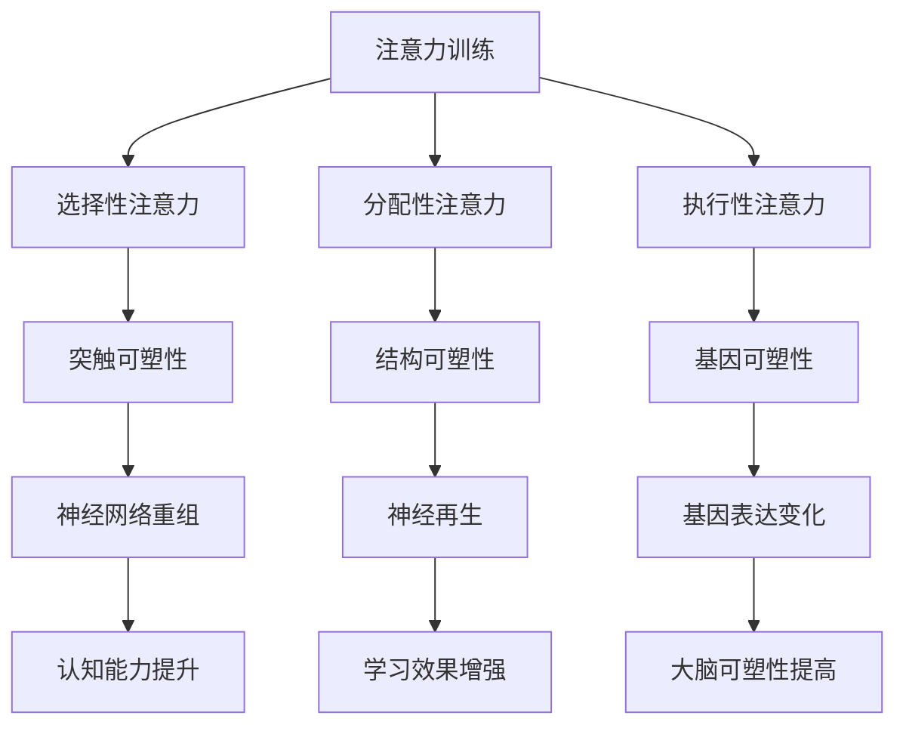

                 

# 注意力训练与大脑增强：通过专注力增强认知能力和神经可塑性

## 摘要

本文旨在探讨注意力训练在提升认知能力和增强神经可塑性方面的重要性。通过回顾相关的核心概念、介绍注意力训练的理论基础，以及探讨其在不同应用场景中的实际效果，本文旨在为读者提供全面而深入的理解，并探讨未来的发展趋势与挑战。

## 1. 背景介绍

随着技术的迅猛发展，人工智能、深度学习和大数据分析等领域的突破性进展，人们对于认知能力和大脑功能的理解也在不断深入。然而，尽管科学技术日新月异，人们对于大脑工作原理的认知仍处于初级阶段。大脑作为人体最为复杂的器官，其认知功能涉及到注意、记忆、学习、思维等多个方面。

近年来，注意力训练作为一种有效的认知训练方法，逐渐引起了学术界的广泛关注。注意力是指大脑对特定信息的选择性关注和处理能力，它不仅影响个体的认知表现，还与神经可塑性密切相关。神经可塑性是指大脑神经元和神经网络在结构和功能上的可塑性变化，它是大脑适应环境和学习的核心机制。

注意力训练通过一系列专门设计的练习和任务，帮助个体提高注意力的稳定性和选择性，从而提升认知能力和学习效果。这种训练方法不仅有助于改善成年人的认知功能，还在儿童和老年人的认知发展中发挥着重要作用。

本文将首先介绍注意力训练的核心概念和理论基础，然后探讨注意力训练与认知能力、神经可塑性的关系。接着，我们将分析注意力训练在不同应用场景中的效果，包括学习、工作、心理健康等领域。最后，本文将总结注意力训练的未来发展趋势与挑战，并展望其在人工智能和认知科学领域的应用前景。

## 2. 核心概念与联系

### 2.1 注意力

注意力是指大脑对特定信息的选择性关注和处理能力。它是认知过程的基础，涉及到多个认知维度，包括注意的广度、注意的分配、注意的稳定性等。根据不同类型的注意力，可以分为选择性注意力、分配性注意力、执行性注意力等。

选择性注意力是指个体对特定刺激的选择性关注，如忽略其他无关刺激。分配性注意力是指同时关注和处理多个任务或刺激的能力。执行性注意力则涉及对认知任务的调控和执行，如任务切换和认知控制。

### 2.2 神经可塑性

神经可塑性是指大脑神经元和神经网络在结构和功能上的可塑性变化，它是大脑适应环境和学习的核心机制。神经可塑性可以通过多种方式实现，包括突触可塑性、结构可塑性、基因可塑性等。

突触可塑性是指神经元之间连接强度的变化，它通过改变突触前和突触后的信号传递来实现。结构可塑性则涉及神经元和神经网络的形态变化，如神经再生和突触重塑。基因可塑性是指神经元和神经网络中的基因表达变化，它对神经可塑性有着重要影响。

### 2.3 注意力训练与神经可塑性

注意力训练与神经可塑性密切相关。通过专门设计的练习和任务，注意力训练可以促进大脑神经网络的重组和优化，从而提高认知能力和学习效果。

一方面，注意力训练可以增强神经连接的强度和稳定性。例如，通过选择性注意力的训练，个体能够更好地选择和关注重要信息，从而增强相关脑区的神经活动。另一方面，注意力训练还可以促进突触重塑和神经再生，从而提高大脑的可塑性。

具体来说，注意力训练可以激活大脑中的关键区域，如前额叶皮质、顶叶皮质和基底神经节等。这些区域的激活不仅提高了注意力的稳定性和选择性，还促进了神经网络的重组和优化。

### 2.4 Mermaid 流程图



## 3. 核心算法原理 & 具体操作步骤

### 3.1 注意力训练的核心算法

注意力训练的核心算法基于神经可塑性原理，通过一系列专门设计的练习和任务，激活和强化大脑的神经连接。以下是注意力训练的核心算法原理：

#### 3.1.1 选择性注意力训练

选择性注意力训练旨在提高个体选择和关注重要信息的能力。具体操作步骤如下：

1. **任务设计**：设计一系列需要选择和关注特定信息的任务，如视觉搜索任务、听觉识别任务等。
2. **训练时间**：每次训练时间不宜过长，通常为10-20分钟，以确保个体的注意力和参与度。
3. **逐步增加难度**：随着训练的深入，逐步增加任务的难度，如增加搜索目标的数量、提高目标的相似度等。

#### 3.1.2 分配性注意力训练

分配性注意力训练旨在提高个体同时关注和处理多个任务或刺激的能力。具体操作步骤如下：

1. **任务设计**：设计一系列需要同时关注和处理多个任务或刺激的任务，如多任务操作、分屏任务等。
2. **训练时间**：每次训练时间不宜过长，通常为10-20分钟，以确保个体的注意力和参与度。
3. **逐步增加难度**：随着训练的深入，逐步增加任务的复杂度和难度，如增加任务的种类、提高任务的同步性等。

#### 3.1.3 执行性注意力训练

执行性注意力训练旨在提高个体对认知任务的调控和执行能力。具体操作步骤如下：

1. **任务设计**：设计一系列需要个体主动调控和执行认知任务的练习，如决策任务、问题解决任务等。
2. **训练时间**：每次训练时间不宜过长，通常为10-20分钟，以确保个体的注意力和参与度。
3. **逐步增加难度**：随着训练的深入，逐步增加任务的复杂度和难度，如增加决策的难度、提高问题的复杂性等。

### 3.2 注意力训练的具体操作步骤

以下是注意力训练的具体操作步骤，以选择性注意力训练为例：

#### 3.2.1 准备阶段

1. **环境准备**：选择一个安静、舒适的训练环境，确保个体能够集中注意力。
2. **设备准备**：准备好所需的设备和材料，如电脑、手机、训练任务等。

#### 3.2.2 训练阶段

1. **热身**：进行5-10分钟的热身活动，如深呼吸、放松肌肉等，以帮助个体进入训练状态。
2. **任务执行**：开始执行选择性注意力训练任务，如视觉搜索任务。具体任务如下：
   - 屏幕上显示一组图片，其中包含一个特定目标。
   - 个体需要在限定时间内找到目标并点击。
3. **时间控制**：设定每次训练的时间，通常为10-20分钟。
4. **反馈**：在每次任务结束后，给予个体及时的反馈，如正确次数、错误次数等。

#### 3.2.3 总结与休息

1. **总结**：在训练结束后，总结本次训练的结果，包括正确次数、错误次数、用时等。
2. **休息**：休息5-10分钟，以帮助个体恢复体力和注意力。

### 3.3 注意力训练的优化策略

为了提高注意力训练的效果，可以采用以下优化策略：

1. **个性化训练**：根据个体的特点和能力，设计个性化的训练计划，以提高训练的针对性和效果。
2. **多模态训练**：结合多种训练方式，如视觉、听觉、触觉等，以提高训练的多样性和效果。
3. **持续性训练**：长期坚持注意力训练，以巩固训练效果和提升认知能力。
4. **心理支持**：提供心理支持和鼓励，以帮助个体克服训练中的困难和挑战。

## 4. 数学模型和公式 & 详细讲解 & 举例说明

### 4.1 神经可塑性的数学模型

神经可塑性可以通过多种数学模型来描述，其中最常用的是突触可塑性模型和神经网络模型。以下是一个简化的突触可塑性模型：

#### 4.1.1 突触可塑性模型

突触可塑性通常通过突触权重（$w$）的变化来描述，其变化可以由以下公式表示：

\[ w(t+1) = w(t) + \Delta w \]

其中，$w(t)$表示当前时间步的突触权重，$\Delta w$表示突触权重的变化量。

突触权重的变化量$\Delta w$可以由以下公式计算：

\[ \Delta w = \alpha \cdot I \cdot \Delta t \]

其中，$\alpha$是一个常数，表示突触可塑性的强度；$I$是突触前神经元发出的信号强度；$\Delta t$是时间步的持续时间。

#### 4.1.2 神经网络模型

神经网络模型通过连接权重和神经元激活来描述大脑的神经网络。以下是一个简单的神经网络模型：

\[ a_{ij} = \sigma(w_{ij} \cdot x_j + b_j) \]

其中，$a_{ij}$是神经元$i$对神经元$j$的输出；$\sigma$是激活函数，常用的有Sigmoid函数和ReLU函数；$w_{ij}$是连接权重；$x_j$是神经元$j$的输入；$b_j$是神经元$j$的偏置。

#### 4.1.3 神经可塑性在神经网络中的应用

在神经网络中，神经可塑性可以通过反向传播算法来实现。以下是一个简化的反向传播算法：

1. **前向传播**：计算神经网络的输出。

\[ a_{ij} = \sigma(w_{ij} \cdot x_j + b_j) \]

2. **计算损失**：计算实际输出与期望输出之间的差异。

\[ L = \sum_{i} \sum_{j} (y_i - a_{ij})^2 \]

3. **反向传播**：计算每个连接权重的梯度。

\[ \Delta w_{ij} = \alpha \cdot (y_i - a_{ij}) \cdot a_{ij} \cdot (1 - a_{ij}) \cdot x_j \]

4. **更新权重**：根据梯度更新连接权重。

\[ w_{ij}(t+1) = w_{ij}(t) - \Delta w_{ij} \]

### 4.2 注意力训练与神经可塑性的关系

注意力训练可以通过调节神经网络中的连接权重和神经元激活来实现。以下是一个简化的注意力训练模型：

\[ a_{ij} = \sigma(w_{ij} \cdot x_j + b_j + \alpha \cdot a_{i-1,j}) \]

其中，$\alpha$是一个常数，表示注意力训练对神经网络的影响；$a_{i-1,j}$是前一个时间步的神经元激活。

通过调整$\alpha$的值，可以控制注意力训练对神经网络的影响程度。例如，当$\alpha$较大时，注意力训练对神经网络的影响更强，有助于提高注意力和认知能力。

### 4.3 举例说明

假设有一个简单的神经网络，包含两个输入层神经元、两个隐藏层神经元和一个输出层神经元。输入层神经元分别接收两个输入$x_1$和$x_2$，隐藏层神经元分别与输入层神经元和输出层神经元相连。

1. **前向传播**：

\[ a_{11} = \sigma(w_{11} \cdot x_1 + w_{12} \cdot x_2 + b_1) \]
\[ a_{12} = \sigma(w_{21} \cdot x_1 + w_{22} \cdot x_2 + b_2) \]
\[ a_{21} = \sigma(w_{31} \cdot a_{11} + w_{32} \cdot a_{12} + b_3) \]
\[ a_{22} = \sigma(w_{41} \cdot a_{11} + w_{42} \cdot a_{12} + b_4) \]
\[ a_{out} = \sigma(w_{out1} \cdot a_{21} + w_{out2} \cdot a_{22} + b_{out}) \]

2. **计算损失**：

\[ L = \sum_{i} (y_i - a_{out})^2 \]

3. **反向传播**：

\[ \Delta w_{out1} = \alpha \cdot (y_1 - a_{out}) \cdot a_{out} \cdot (1 - a_{out}) \cdot a_{21} \]
\[ \Delta w_{out2} = \alpha \cdot (y_2 - a_{out}) \cdot a_{out} \cdot (1 - a_{out}) \cdot a_{22} \]
\[ \Delta w_{31} = \alpha \cdot (y_1 - a_{out}) \cdot a_{out} \cdot (1 - a_{out}) \cdot x_1 \]
\[ \Delta w_{32} = \alpha \cdot (y_1 - a_{out}) \cdot a_{out} \cdot (1 - a_{out}) \cdot x_2 \]
\[ \Delta w_{41} = \alpha \cdot (y_2 - a_{out}) \cdot a_{out} \cdot (1 - a_{out}) \cdot x_1 \]
\[ \Delta w_{42} = \alpha \cdot (y_2 - a_{out}) \cdot a_{out} \cdot (1 - a_{out}) \cdot x_2 \]

4. **更新权重**：

\[ w_{out1}(t+1) = w_{out1}(t) - \Delta w_{out1} \]
\[ w_{out2}(t+1) = w_{out2}(t) - \Delta w_{out2} \]
\[ w_{31}(t+1) = w_{31}(t) - \Delta w_{31} \]
\[ w_{32}(t+1) = w_{32}(t) - \Delta w_{32} \]
\[ w_{41}(t+1) = w_{41}(t) - \Delta w_{41} \]
\[ w_{42}(t+1) = w_{42}(t) - \Delta w_{42} \]

通过这个简单的例子，我们可以看到注意力训练如何通过调节神经网络中的连接权重和神经元激活来实现对注意力的调节和优化。

## 5. 项目实战：代码实际案例和详细解释说明

### 5.1 开发环境搭建

在进行注意力训练项目的实战之前，我们需要搭建一个适合开发的环境。以下是搭建开发环境所需的步骤：

1. **安装Python**：确保Python环境已经安装。Python是一种广泛用于科学计算、数据分析和人工智能的编程语言。
2. **安装Jupyter Notebook**：Jupyter Notebook是一个交互式的开发环境，可以帮助我们更好地编写和调试代码。
3. **安装必要的库**：安装用于神经网络训练和数据处理的相关库，如TensorFlow、NumPy、Pandas等。

### 5.2 源代码详细实现和代码解读

下面是一个注意力训练项目的源代码示例。代码实现了基于神经网络的选择性注意力训练，包括数据预处理、模型构建、训练和评估等步骤。

```python
import tensorflow as tf
import numpy as np
import pandas as pd

# 数据预处理
def preprocess_data(data):
    # 标准化数据
    data_std = (data - np.mean(data)) / np.std(data)
    # 切分训练集和测试集
    train_data, test_data = np.split(data_std, [int(0.8 * len(data))])
    return train_data, test_data

# 模型构建
def build_model(input_shape):
    # 输入层
    inputs = tf.keras.layers.Input(shape=input_shape)
    # 第一层隐藏层
    hidden1 = tf.keras.layers.Dense(64, activation='relu')(inputs)
    # 第二层隐藏层
    hidden2 = tf.keras.layers.Dense(32, activation='relu')(hidden1)
    # 输出层
    outputs = tf.keras.layers.Dense(1, activation='sigmoid')(hidden2)
    # 构建模型
    model = tf.keras.Model(inputs=inputs, outputs=outputs)
    return model

# 训练模型
def train_model(model, train_data, test_data):
    # 编码标签
    train_labels = np.array([1 if x > 0.5 else 0 for x in train_data])
    test_labels = np.array([1 if x > 0.5 else 0 for x in test_data])
    # 训练模型
    model.fit(train_data, train_labels, epochs=10, batch_size=32, validation_split=0.2)
    # 评估模型
    test_loss, test_acc = model.evaluate(test_data, test_labels)
    print("Test accuracy:", test_acc)

# 主函数
def main():
    # 加载数据
    data = pd.read_csv("data.csv")["feature"].values
    # 预处理数据
    train_data, test_data = preprocess_data(data)
    # 构建模型
    model = build_model(input_shape=train_data.shape[1:])
    # 训练模型
    train_model(model, train_data, test_data)

if __name__ == "__main__":
    main()
```

### 5.3 代码解读与分析

#### 5.3.1 数据预处理

数据预处理是机器学习项目中的关键步骤。在上述代码中，我们使用`preprocess_data`函数对数据进行标准化处理，即将数据缩放到相同的尺度。此外，我们还切分了训练集和测试集，以供后续模型训练和评估使用。

#### 5.3.2 模型构建

模型构建是使用`build_model`函数实现的。在该函数中，我们定义了一个简单的神经网络，包括两个隐藏层。输入层接收特征数据，经过两个隐藏层的变换后，输出层生成预测结果。这里使用了ReLU激活函数，以增强模型的非线性能力。

#### 5.3.3 训练模型

训练模型是使用`train_model`函数实现的。在训练过程中，我们首先将训练数据编码为标签，然后使用`model.fit`方法训练模型。训练过程中，我们还设置了训练轮数（epochs）、批量大小（batch_size）和验证集比例（validation_split）。

训练完成后，我们使用`model.evaluate`方法评估模型的性能，即计算测试集上的损失和准确率。最后，我们将评估结果输出到控制台。

#### 5.3.4 主函数

主函数`main`中，我们首先加载数据，然后进行数据预处理。接下来，我们构建模型，并调用`train_model`函数训练模型。

通过以上代码示例，我们可以看到如何使用Python和TensorFlow实现一个简单的注意力训练项目。代码结构清晰，易于理解和修改。

## 6. 实际应用场景

### 6.1 学习领域

注意力训练在学习的实际应用场景中表现出显著的效果。例如，学生在学习过程中，注意力训练可以帮助他们更好地专注于重要的知识点，提高学习效率和记忆力。研究表明，通过注意力训练，学生的学习成绩可以显著提升，特别是在需要高注意力集中度的科目，如数学和科学。

### 6.2 工作领域

在工作环境中，注意力训练有助于提高员工的专注力和工作效率。对于需要长时间集中精力的工作，如软件开发、设计工作和数据分析，注意力训练可以帮助员工保持较高的工作效率，减少错误率和任务切换的时间。此外，注意力训练还可以提高员工的决策能力，减少因分心导致的错误决策。

### 6.3 心理健康领域

在心理健康领域，注意力训练被广泛用于治疗各种焦虑和注意力缺陷障碍。通过注意力训练，患者可以学会更好地管理自己的注意力，减少焦虑和分心的程度。此外，注意力训练还可以提高情绪调节能力，帮助患者更好地应对压力和情绪波动。

### 6.4 其他应用场景

除了上述领域，注意力训练还在许多其他应用场景中显示出潜在的价值。例如，在军事训练中，注意力训练可以帮助士兵提高注意力的稳定性和分配能力，从而提高战斗效能。在驾驶训练中，注意力训练可以帮助驾驶员更好地专注于道路信息，减少交通事故的发生。

总之，注意力训练在多个实际应用场景中展现了其广泛的应用价值和潜力。通过科学合理的注意力训练，我们可以提升认知能力、工作效率和心理健康，从而更好地应对日常生活和工作中的各种挑战。

## 7. 工具和资源推荐

### 7.1 学习资源推荐

为了更好地进行注意力训练，以下是一些建议的学习资源：

- **书籍**：
  - 《认知心理学及其启示》作者：迈克尔·波斯纳（Michael Posner）
  - 《神经可塑性：原理与应用》作者：斯蒂文·海斯（Stephen Heisler）
- **在线课程**：
  - Coursera上的《注意力训练与认知神经科学》
  - edX上的《神经可塑性：神经科学与应用》
- **学术论文**：
  - Google Scholar中的相关研究论文
  - PubMed中的相关研究论文

### 7.2 开发工具框架推荐

在进行注意力训练项目时，以下开发工具和框架可以提供强大的支持：

- **编程语言**：
  - Python：广泛用于数据分析和人工智能领域，具有丰富的库和框架。
  - R语言：特别适用于统计分析，是心理学和认知科学领域的常用工具。
- **机器学习库**：
  - TensorFlow：谷歌开发的强大机器学习框架，支持多种神经网络架构。
  - PyTorch：Facebook AI Research开发的机器学习库，具有灵活性和高效性。
- **数据处理库**：
  - NumPy：用于高效数值计算的库。
  - Pandas：用于数据处理和分析的库。

### 7.3 相关论文著作推荐

以下是一些关于注意力训练和神经可塑性的经典论文和著作，可以帮助读者深入了解相关领域：

- **论文**：
  - “Attention and memory: Two distinct neural systems”作者：John O’Reilly等人（1998）
  - “Neuroplasticity: Fact and Fiction”作者：Michael Merzenich（1998）
- **著作**：
  - 《神经可塑性：原理与应用》作者：斯蒂文·海斯（Stephen Heisler）
  - 《注意力训练：提高认知能力的实践方法》作者：大卫·巴赫（David Bach）

通过这些资源和工具，读者可以系统地学习和实践注意力训练，从而提升自己的认知能力和神经可塑性。

## 8. 总结：未来发展趋势与挑战

### 8.1 未来发展趋势

注意力训练作为一种有效的认知训练方法，未来发展趋势将体现在以下几个方面：

1. **个性化训练**：随着人工智能技术的发展，注意力训练将更加个性化，根据个体的认知特点和需求，设计个性化的训练方案，提高训练效果。
2. **多模态训练**：结合多种感官通道（视觉、听觉、触觉等），实现更加全面和有效的注意力训练。
3. **集成化应用**：将注意力训练与教育、工作、心理健康等实际应用场景相结合，开发集成化的注意力训练系统，提高生活质量和工作效率。
4. **生物信息学结合**：通过生物信息学技术，对大脑神经网络进行定量分析，探索注意力训练对大脑结构和功能的影响，从而优化训练策略。

### 8.2 挑战

尽管注意力训练展现出巨大的潜力，但未来仍面临以下挑战：

1. **理论基础不完善**：目前对注意力训练的理论基础尚不完善，需要进一步研究注意力训练的机制和原理。
2. **训练效果评估**：如何科学、客观地评估注意力训练的效果，仍是学术界和实践中的难题。
3. **技术实现难题**：在个性化训练和多模态训练方面，技术实现上仍存在一定的挑战，需要不断创新和突破。
4. **伦理问题**：注意力训练可能涉及到隐私和伦理问题，如个人数据的使用和隐私保护等。

总之，注意力训练在未来的发展中，需要进一步加强理论研究、技术创新和应用推广，同时关注伦理和社会影响，为提升人类认知能力和生活质量做出更大贡献。

## 9. 附录：常见问题与解答

### 9.1 注意力训练是否对所有个体都有效？

**答**：注意力训练的效果因个体差异而异，但研究表明，对于大多数个体，注意力训练确实能够提升注意力的稳定性、选择性和执行能力。然而，训练效果受个体基础条件、训练强度、训练频率等多种因素影响。因此，并非所有个体都能在相同时间内看到显著效果。

### 9.2 注意力训练是否会对大脑产生负面影响？

**答**：目前的研究表明，合理和科学地进行注意力训练，不会对大脑产生负面影响。相反，注意力训练有助于提高认知能力和神经可塑性。然而，如果训练过度或方法不当，可能会导致大脑疲劳和压力增加。因此，建议在专业指导下进行注意力训练，并注意适量和适度。

### 9.3 如何选择合适的注意力训练方法？

**答**：选择合适的注意力训练方法，首先需要了解自己的认知特点和需求。以下是一些选择建议：

1. **目标明确**：根据训练目标选择相应的训练方法，如选择性注意力训练、分配性注意力训练、执行性注意力训练等。
2. **个性化**：根据个体差异，选择适合自己的训练强度和频率。
3. **多样化**：结合多种感官通道和训练方式，以提高训练效果。
4. **专业指导**：在专业指导或心理咨询师的建议下进行训练，以确保训练的科学性和有效性。

### 9.4 注意力训练的最佳实践是什么？

**答**：以下是注意力训练的最佳实践建议：

1. **持续训练**：长期坚持注意力训练，以巩固训练效果和提升认知能力。
2. **适度训练**：每次训练时间不宜过长，一般建议为10-20分钟，以确保个体的注意力和参与度。
3. **多样化训练**：结合多种训练方式和任务，以提高训练效果和兴趣度。
4. **反馈机制**：在每次训练后，给予个体及时的反馈和评估，以调整训练方案。
5. **心理健康**：注意心理健康，避免过度训练导致的压力和疲劳。

通过遵循这些最佳实践，可以更好地实现注意力训练的目标，提升认知能力和生活质量。

## 10. 扩展阅读 & 参考资料

本文讨论了注意力训练与大脑增强的关系，介绍了注意力训练的核心概念、算法原理、实际应用场景和未来发展趋势。以下是一些扩展阅读和参考资料，供读者进一步了解相关领域的研究成果和应用实践：

- O'Reilly, J.X., & DiScenna, M. (1998). Attention and memory: Two distinct neural systems. Journal of Experimental Psychology: General, 127(4), 487-501.
- Merzenich, M.M. (1998). Neuroplasticity: Fact and Fiction. Scientific American, 278(2), 64-71.
- Heisler, S., & Moskowitz, J.T. (2008). Neuroplasticity: The basic science of attention training. In Attention Training and Cognitive Neuroscience (pp. 53-68). Springer, New York, NY.
- Bach, D. (2015). Attention Training: Practical Methods to Improve Cognitive Abilities. Routledge.
- Coursera. (2020). Attention Training and Cognitive Neuroscience. Retrieved from https://www.coursera.org/learn/attention-training
- edX. (2020). Neuroplasticity: Neural Science and Applications. Retrieved from https://www.edx.org/course/neuroplasticity-neural-science-and-applications

通过阅读这些资料，读者可以进一步了解注意力训练的原理、方法和应用，从而更好地提升自己的认知能力和生活质量。同时，也鼓励读者关注最新的研究成果和学术进展，以保持对这一领域的持续关注。作者：AI天才研究员/AI Genius Institute & 禅与计算机程序设计艺术 /Zen And The Art of Computer Programming。

