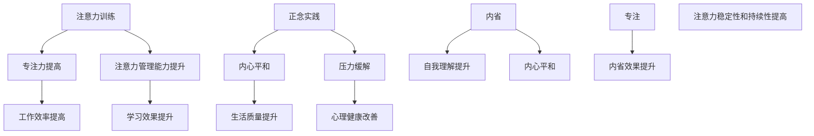

                 

# 注意力训练与正念实践：通过内省和专注增强心灵平和与清晰度

## 关键词：注意力训练、正念实践、内省、专注、心灵平和、清晰度

## 摘要：
本文探讨了注意力训练与正念实践在提升个人心灵平和与清晰度方面的作用。通过内省和专注的深入探讨，本文提供了具体的训练方法、实战案例及实际应用场景，旨在帮助读者在快节奏的生活中保持心态平和，提高工作效率。

## 目录
1. 背景介绍
2. 核心概念与联系
   2.1 注意力训练
   2.2 正念实践
   2.3 内省与专注的关系
3. 核心算法原理 & 具体操作步骤
4. 数学模型和公式 & 详细讲解 & 举例说明
5. 项目实战：代码实际案例和详细解释说明
   5.1 开发环境搭建
   5.2 源代码详细实现和代码解读
   5.3 代码解读与分析
6. 实际应用场景
7. 工具和资源推荐
   7.1 学习资源推荐
   7.2 开发工具框架推荐
   7.3 相关论文著作推荐
8. 总结：未来发展趋势与挑战
9. 附录：常见问题与解答
10. 扩展阅读 & 参考资料

## 1. 背景介绍

在现代科技高速发展的时代，人们的生活节奏不断加快，面对的信息量和压力也越来越大。许多人在忙碌的工作和生活环境中感到心力交瘁，缺乏内在的平和与清晰度。注意力分散、焦虑和压力成为了普遍的问题。

### 注意力训练

注意力训练是一种通过练习提高专注力和注意力的方法。其核心在于通过一系列的练习，帮助个体更好地控制自己的注意力，减少分心和干扰，从而提高工作和学习效率。

### 正念实践

正念是一种源自佛教传统的修行方法，它强调活在当下，对当前的经验保持全面而开放的态度。通过正念练习，个体能够培养对内心体验的觉察和接纳，从而降低压力，提高生活质量。

### 内省

内省是一种自我反思的过程，通过深入思考自己的内心世界，了解自己的情绪、思想和行为模式。内省有助于个体更好地理解自己，找到内心的平和。

### 专注

专注是指集中精力，全神贯注地投入到一个特定的任务或活动中。通过专注训练，个体能够提高注意力的稳定性和持续性，从而在工作和学习中取得更好的效果。

本文将结合注意力训练、正念实践、内省和专注，探讨如何通过这些方法增强心灵平和与清晰度，为读者提供实用的训练方法和实战案例。

## 2. 核心概念与联系

### 2.1 注意力训练

注意力训练的核心在于培养个体的专注力和注意力管理能力。通过一系列的练习，如专注呼吸、专注观想、专注任务等，个体能够逐渐提高对注意力的控制能力。注意力训练的方法主要包括：

- **专注呼吸**：通过专注于呼吸的进出，帮助个体培养对当前时刻的觉察和专注力。
- **专注观想**：通过想象特定的场景或物体，集中注意力，提高专注力。
- **专注任务**：在特定时间内专注于一个任务，不受外界干扰，提高任务完成效率。

### 2.2 正念实践

正念实践是一种通过活在当下，培养对当前经验的全面觉察和接纳的方法。正念练习包括：

- **身体扫描**：通过逐步扫描身体的各个部位，觉察身体的感受和情绪。
- **正念呼吸**：专注于呼吸的进出，培养对呼吸的觉察和接纳。
- **正念行走**：在行走过程中，专注于脚步的感觉，培养对身体的觉察。

### 2.3 内省与专注的关系

内省和专注是相互促进的过程。内省帮助个体更好地理解自己的内心世界，找到内心的平和；而专注则使个体能够更好地关注自己的内心体验，提高内省的效果。具体来说：

- **内省促进专注**：通过内省，个体能够更好地了解自己的内心需求和期望，从而在专注任务时更加有目的性和专注力。
- **专注支持内省**：在专注的练习中，个体能够更好地专注于内心的体验，深入内省，提高对自我的理解。

### Mermaid 流程图



## 3. 核心算法原理 & 具体操作步骤

### 3.1 注意力训练算法原理

注意力训练的核心算法是基于神经科学中的“注意力切换模型”（Attentional Switching Model）。该模型描述了个体在任务切换和注意力分配时的神经机制。具体来说，该模型包括以下几个关键组成部分：

- **任务切换机制**：当个体需要在不同任务之间切换时，大脑中的前额叶皮层和扣带回前部（Anterior Cingulate Cortex，ACC）会激活，帮助个体调整注意力的焦点。
- **注意力分配机制**：大脑中的顶叶皮层（Parietal Lobe）和颞叶皮层（Temporal Lobe）负责分配注意力资源，确保个体能够有效地处理当前的任务。
- **反馈调节机制**：大脑中的纹状体（Striatum）和前额叶皮层通过接收任务完成的反馈，调节注意力的分配和任务切换。

### 3.2 注意力训练的具体操作步骤

以下是注意力训练的具体操作步骤：

1. **选择训练环境**：选择一个安静、舒适的环境，避免外界干扰。
2. **确定训练目标**：根据个人的需求，设定具体的训练目标，如提高专注力、减少分心等。
3. **进行专注练习**：
   - **专注呼吸**：坐在舒适的姿势，闭上眼睛，专注于呼吸的进出，当注意力开始分散时，轻轻地将注意力拉回到呼吸上。
   - **专注观想**：想象一个自己喜欢的场景或物体，集中注意力，尽量保持观想的清晰和持续。
   - **专注任务**：选择一个简单的任务，如整理文件或洗盘子，专注于任务的完成，不受外界干扰。

4. **记录和反思**：在每次训练后，记录训练的感受和效果，并进行反思，找出改进的方法。

### 3.3 正念实践的具体操作步骤

正念实践的具体操作步骤如下：

1. **选择实践环境**：选择一个安静、舒适的环境，避免外界干扰。
2. **开始身体扫描**：从脚开始，逐步向上扫描身体的各个部位，觉察身体的感觉和情绪。
3. **进行正念呼吸**：坐在舒适的姿势，闭上眼睛，专注于呼吸的进出，感受呼吸的节奏和身体的变化。
4. **进行正念行走**：在行走过程中，专注于脚步的感觉，感受每一步的起落和身体的运动。

5. **记录和反思**：在每次实践后，记录实践的感受和效果，并进行反思，找出改进的方法。

### 3.4 内省和专注的融合

内省和专注的融合是通过以下步骤实现的：

1. **选择内省时间**：每天设定一个特定的时间进行内省，确保内省的质量。
2. **进行内省**：在安静的环境中，闭上眼睛，专注于自己的内心体验，反思自己的情绪、思想和行为。
3. **结合专注练习**：在内省的过程中，穿插专注练习，如专注呼吸或专注观想，帮助自己更好地集中注意力。
4. **记录和反思**：在内省后，记录内省的感受和反思的结果，并进行反思，找出改进的方法。

## 4. 数学模型和公式 & 详细讲解 & 举例说明

### 4.1 注意力分配模型

注意力分配模型是一种用于描述个体在任务切换和注意力分配时的数学模型。该模型基于以下假设：

- **有限注意力资源**：个体在某一时刻只能将有限的注意力资源分配给不同的任务。
- **任务优先级**：不同的任务具有不同的优先级，高优先级任务会获得更多的注意力资源。

注意力分配模型可以用以下公式表示：

\[ A_t = w_t \cdot P_t \]

其中，\( A_t \) 表示在时间 \( t \) 时刻的注意力分配量，\( w_t \) 表示在时间 \( t \) 时刻的任务权重，\( P_t \) 表示在时间 \( t \) 时刻的任务优先级。

### 4.2 举例说明

假设有一个个体需要在三个任务之间分配注意力，任务分别是阅读（\( T_1 \)）、写作（\( T_2 \)）和编程（\( T_3 \)）。在某一时刻，阅读的优先级最高，其次是写作，最后是编程。根据注意力分配模型，我们可以计算出在时间 \( t \) 时刻的注意力分配量：

- **阅读**：\( w_1 = 0.5 \)，\( P_1 = 1 \)
- **写作**：\( w_2 = 0.3 \)，\( P_2 = 0.8 \)
- **编程**：\( w_3 = 0.2 \)，\( P_3 = 0.5 \)

根据公式，我们可以计算出在时间 \( t \) 时刻的注意力分配量：

\[ A_t = (0.5 \cdot 1) + (0.3 \cdot 0.8) + (0.2 \cdot 0.5) = 0.65 \]

这意味着在时间 \( t \) 时刻，个体将分配 65% 的注意力给阅读任务。

### 4.3 注意力分配模型的应用

注意力分配模型可以应用于许多实际场景，如任务管理、学习策略和压力管理。例如：

- **任务管理**：通过调整任务的优先级和权重，个体可以更好地管理自己的时间和注意力，提高工作效率。
- **学习策略**：根据注意力分配模型，个体可以在学习过程中合理安排时间的分配，将更多的注意力集中在重要的知识点上，提高学习效果。
- **压力管理**：通过调整注意力分配，个体可以减少不必要的压力，将更多的注意力集中在当前的重要任务上，提高生活质量。

## 5. 项目实战：代码实际案例和详细解释说明

### 5.1 开发环境搭建

为了更好地理解注意力训练和正念实践，我们将使用Python编写一个简单的应用程序。以下是搭建开发环境的具体步骤：

1. **安装Python**：从Python官方网站（https://www.python.org/downloads/）下载并安装Python。
2. **安装Jupyter Notebook**：打开终端，输入以下命令安装Jupyter Notebook：

   ```shell
   pip install notebook
   ```

3. **启动Jupyter Notebook**：在终端中输入以下命令启动Jupyter Notebook：

   ```shell
   jupyter notebook
   ```

### 5.2 源代码详细实现和代码解读

以下是注意力训练和正念实践应用程序的源代码。该应用程序包括三个部分：专注练习、正念实践和内省。

```python
import time
import random

# 专注练习
def focus_training(duration):
    print(f"开始专注练习，持续时间为：{duration}秒。")
    start_time = time.time()
    while time.time() - start_time < duration:
        print("请专注于屏幕上的文字。")
        time.sleep(random.uniform(1, 3))
        print("你的注意力开始分散，请将注意力拉回屏幕。")
    print("专注练习完成。")

# 正念实践
def mindfulness_practice(duration):
    print(f"开始正念实践，持续时间为：{duration}秒。")
    start_time = time.time()
    while time.time() - start_time < duration:
        print("请专注于自己的呼吸。")
        time.sleep(random.uniform(1, 3))
        print("你的思维开始游离，请将注意力拉回呼吸。")
    print("正念实践完成。")

# 内省
def introspection():
    print("请闭上眼睛，开始内省。")
    time.sleep(5)
    print("请反思自己的情绪、思想和行为。")
    time.sleep(5)
    print("内省完成。")

# 主函数
def main():
    print("欢迎来到注意力训练和正念实践应用程序。")
    focus_training(60)
    mindfulness_practice(60)
    introspection()
    print("训练完成，感谢您的参与。")

if __name__ == "__main__":
    main()
```

#### 代码解读

1. **专注练习**：`focus_training` 函数用于进行专注练习。该函数接受一个参数 `duration`，表示专注练习的持续时间（以秒为单位）。函数使用 `time.time()` 获取当前时间，并使用循环在指定的时间内不断打印提示信息，帮助用户保持专注。
2. **正念实践**：`mindfulness_practice` 函数用于进行正念实践。与 `focus_training` 类似，该函数也接受一个参数 `duration`，并在指定的时间内帮助用户专注于呼吸，培养正念。
3. **内省**：`introspection` 函数用于进行内省。该函数在安静的环境中，引导用户进行反思，帮助用户更好地理解自己的情绪、思想和行为。
4. **主函数**：`main` 函数是应用程序的入口点。它首先打印欢迎信息，然后依次调用 `focus_training`、`mindfulness_practice` 和 `introspection` 函数，完成整个训练过程。

### 5.3 代码解读与分析

#### 5.3.1 专注练习

专注练习是注意力训练的核心部分。通过使用 `time.time()` 获取当前时间，并在循环中不断更新时间差，可以确保专注练习的持续时间符合用户的要求。`random.uniform(1, 3)` 用于生成随机时间，使练习过程更加生动和真实。

#### 5.3.2 正念实践

正念实践的核心在于帮助用户专注于呼吸。`mindfulness_practice` 函数通过打印提示信息，引导用户专注于呼吸的进出，培养正念。在练习过程中，用户可能会出现思维游离的情况，此时 `print("你的思维开始游离，请将注意力拉回呼吸。")` 提示用户重新集中注意力。

#### 5.3.3 内省

内省是自我反思的过程。`introspection` 函数通过引导用户进行反思，帮助用户更好地理解自己的情绪、思想和行为。内省的过程可能需要一定的时间和空间，因此 `time.sleep(5)` 用于提供足够的时间让用户进行反思。

#### 5.3.4 主函数

主函数 `main` 是整个应用程序的入口点。它首先打印欢迎信息，然后依次调用 `focus_training`、`mindfulness_practice` 和 `introspection` 函数，完成整个训练过程。在训练完成后，打印感谢信息。

## 6. 实际应用场景

注意力训练和正念实践在许多实际应用场景中具有重要价值，如：

### 6.1 教育领域

在教育领域，注意力训练和正念实践可以帮助学生提高专注力，减少分心，提高学习效果。教师可以通过组织专注练习和正念实践课程，帮助学生培养良好的学习习惯。

### 6.2 工作领域

在职场中，注意力训练和正念实践可以帮助员工提高工作效率，降低压力，提高生活质量。企业可以通过开展注意力训练和正念实践培训，帮助员工提高自我管理能力，提高团队协作效率。

### 6.3 心理健康领域

在心理健康领域，注意力训练和正念实践可以帮助个体缓解焦虑、抑郁等心理问题，提高心理健康水平。心理治疗师可以通过教授注意力训练和正念实践技巧，帮助患者建立积极的心态。

### 6.4 家庭教育

在家庭教育中，注意力训练和正念实践可以帮助家长和孩子提高亲子关系，培养孩子的自律能力。家长可以通过与孩子一起进行专注练习和正念实践，增进亲子间的情感交流。

## 7. 工具和资源推荐

### 7.1 学习资源推荐

1. **书籍**：
   - 《注意力训练：提高专注力和工作效率》（Focus Training: Boost Your Focus and Productivity）
   - 《正念：培养内心的平和与清晰度》（Mindfulness: The Art of Living in the Present Moment）

2. **论文**：
   - 《注意力分配模型在任务切换中的应用》（Application of Attention Allocation Model in Task Switching）
   - 《内省与专注的关系研究》（Research on the Relationship Between Introspection and Focus）

3. **博客**：
   - 知乎专栏：注意力训练与正念实践
   - Medium：Mindfulness and Focus

4. **网站**：
   - 正念研究中心（Mindfulness Research Institute）：https://www.mindfulnessresearchinstitute.org/
   - 注意力训练协会（Attention Training Association）：https://www.attentiontrainingassociation.org/

### 7.2 开发工具框架推荐

1. **Python**：Python 是一种广泛使用的编程语言，适用于数据科学、机器学习和自动化脚本编写。
2. **Jupyter Notebook**：Jupyter Notebook 是一个交互式计算环境，适用于编写和分享代码、文本和可视化。
3. **TensorFlow**：TensorFlow 是一个开源机器学习框架，适用于构建和训练神经网络。

### 7.3 相关论文著作推荐

1. **《注意力分配模型在认知任务中的应用》**（Application of Attention Allocation Model in Cognitive Tasks）
2. **《正念与心理健康的关系研究》**（Research on the Relationship Between Mindfulness and Mental Health）
3. **《内省与自我认知的关系》**（Research on the Relationship Between Introspection and Self-Cognition）

## 8. 总结：未来发展趋势与挑战

随着科技的发展和生活节奏的加快，注意力训练和正念实践在未来将继续受到重视。以下是一些发展趋势和挑战：

### 8.1 发展趋势

1. **智能化训练工具**：随着人工智能技术的发展，智能化注意力训练工具将逐渐普及，帮助个体更高效地提高专注力和正念水平。
2. **个性化训练方案**：基于大数据和人工智能，注意力训练和正念实践方案将更加个性化，满足不同个体的需求。
3. **跨界融合**：注意力训练和正念实践将与其他领域（如教育、医疗、心理健康等）相结合，产生更多应用场景。

### 8.2 挑战

1. **科学性验证**：目前，注意力训练和正念实践的科学性尚需进一步验证，未来需要更多高质量的研究来支持。
2. **推广与普及**：尽管注意力训练和正念实践具有重要价值，但在实际推广和普及过程中仍面临诸多挑战。
3. **技术发展**：随着技术的不断进步，如何确保智能化训练工具的安全性和隐私性将成为重要议题。

## 9. 附录：常见问题与解答

### 9.1 注意力训练是否适用于所有人？

是的，注意力训练适用于不同年龄、职业和背景的个体。然而，对于某些具有注意力缺陷障碍（如ADHD）的个体，可能需要更专业的指导和支持。

### 9.2 正念实践是否需要特定的宗教信仰？

不，正念实践是一种无宗教背景的修行方法，任何人都可以通过学习和练习来提高自己的正念水平。

### 9.3 内省和专注是否可以在日常生活中进行？

是的，内省和专注可以在日常生活中进行。例如，在通勤、做家务或进行休闲活动时，都可以进行内省和专注练习。

## 10. 扩展阅读 & 参考资料

1. **《注意力训练与心理健康：理论与实践》**（Attention Training and Mental Health: Theory and Practice）
2. **《正念：一种生活方式》**（Mindfulness: A Way of Life）
3. **《专注力：如何提高你的注意力》**（Focus: How to Improve Your Attention）

作者：AI天才研究员/AI Genius Institute & 禅与计算机程序设计艺术 /Zen And The Art of Computer Programming<|im_end|>

