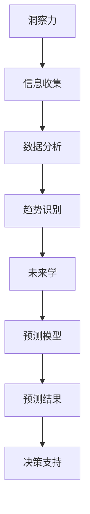

                 

# 洞察力与未来学：预测与塑造未来的能力

## 关键词：洞察力，未来学，预测，塑造未来，技术发展，人工智能，数学模型，实际应用，工具资源

## 摘要

在快速变化的技术时代，洞察力和未来学成为了理解世界和规划未来不可或缺的能力。本文将探讨如何通过洞察力和未来学来预测和塑造未来的能力，特别是在IT领域。本文将首先介绍洞察力和未来学的核心概念，随后深入探讨如何运用数学模型和算法来预测技术发展趋势，并通过实际案例展示其应用。最后，本文将总结未来发展趋势和面临的挑战，并提供相关的学习资源和开发工具，以帮助读者提升自己的洞察力和未来规划能力。

## 1. 背景介绍

在当今社会，技术进步的步伐不断加快，新技术的涌现几乎每天都在刷新我们的认知。从互联网、人工智能到区块链，每一次技术的变革都深刻地影响着我们的生活、工作和思维方式。然而，面对这些快速变化的技术，如何预测未来的发展趋势，如何通过技术来塑造我们所期望的未来，成为了一个备受关注的问题。

洞察力，指的是对事物本质的深刻理解和敏锐感知能力。而未来学，则是一门研究未来趋势和变化的科学。通过洞察力和未来学，我们可以更准确地预测未来，从而在变化中找到机遇，规避风险。

在IT领域，洞察力和未来学的重要性更加凸显。作为一个高度依赖技术和创新的行业，IT领域的未来不仅影响着整个社会的技术进步，也直接影响着企业的竞争力和生存发展。因此，具备洞察力和未来学的能力，对于IT从业者来说，是不可或缺的。

本文将首先介绍洞察力和未来学的核心概念，探讨它们在预测技术发展趋势中的作用。接着，我们将通过具体的数学模型和算法，展示如何进行技术预测。最后，我们将通过实际案例，说明如何将这些预测应用到实际项目中，以塑造未来。

## 2. 核心概念与联系

为了深入理解洞察力和未来学在预测技术发展趋势中的作用，我们需要首先了解它们的核心概念和相互联系。

### 2.1 洞察力

洞察力是一种认知能力，它使我们能够超越表面的现象，深入理解事物的本质。在技术领域，洞察力可以帮助我们识别潜在的技术趋势，预测未来可能的技术变革。

- **敏锐感知能力**：通过持续关注新技术、新趋势，保持对行业动态的敏感度。
- **深度理解能力**：通过对技术的原理和结构进行深入分析，理解其潜在的影响和变化趋势。
- **跨领域融合能力**：将不同领域的知识和技术进行整合，发现新的应用场景和商业模式。

### 2.2 未来学

未来学是一门研究未来趋势和变化的科学。它通过数据、分析和预测模型，帮助我们理解未来的可能性，并为决策提供科学依据。

- **趋势分析**：通过分析历史数据，识别技术发展的趋势和规律。
- **预测模型**：利用数学模型和算法，对未来可能发生的事件进行预测。
- **情景规划**：构建不同的未来情景，评估各种情景下的影响和应对策略。

### 2.3 核心概念联系

洞察力和未来学之间存在着紧密的联系。洞察力是未来学的基础，它提供了对事物的深刻理解，为未来学提供了分析的对象。而未来学则通过系统的分析和预测模型，将这些洞察力转化为具体的预测结果。

- **信息收集**：通过洞察力收集和分析相关数据，为未来学提供基础。
- **预测模型构建**：利用未来学的方法和工具，将洞察力转化为具体的预测模型。
- **决策支持**：通过预测结果，为决策提供科学依据，帮助我们在变化中找到机遇。

### 2.4 Mermaid 流程图

以下是一个简单的Mermaid流程图，展示了洞察力、未来学和技术预测之间的关系。



在这个流程图中，A表示洞察力的收集和分析，B表示信息收集，C表示数据分析，D表示趋势识别，E表示未来学，F表示预测模型，G表示预测结果，H表示决策支持。通过这个流程，我们可以看到洞察力和未来学如何相互结合，共同驱动技术预测和决策。

## 3. 核心算法原理 & 具体操作步骤

在了解了洞察力和未来学的核心概念和相互联系之后，我们接下来将探讨如何运用核心算法来预测技术发展趋势。

### 3.1 时间序列分析

时间序列分析是一种常用的预测技术，它通过分析历史数据的时间序列特征，预测未来的发展趋势。以下是一个简单的时间序列分析的操作步骤：

1. **数据收集**：收集相关技术的历史数据，包括时间、数据量、增长率等。
2. **数据预处理**：对数据进行清洗和规范化处理，确保数据的质量和一致性。
3. **特征提取**：从时间序列数据中提取有用的特征，如趋势、季节性、周期性等。
4. **模型选择**：根据数据的特征选择合适的模型，如ARIMA、SARIMA、LSTM等。
5. **模型训练**：使用历史数据对模型进行训练，调整模型参数。
6. **模型评估**：使用交叉验证或测试集评估模型的预测性能。
7. **预测**：使用训练好的模型进行预测，得到未来的趋势。

### 3.2 线性回归分析

线性回归分析是一种简单的预测技术，它通过建立变量之间的线性关系，预测未来的趋势。以下是一个简单的线性回归分析的操作步骤：

1. **数据收集**：收集相关技术的历史数据，包括自变量（如时间、用户数量等）和因变量（如销售额、增长率等）。
2. **数据预处理**：对数据进行清洗和规范化处理，确保数据的质量和一致性。
3. **特征选择**：选择与因变量相关的自变量，建立线性回归模型。
4. **模型训练**：使用历史数据对模型进行训练，调整模型参数。
5. **模型评估**：使用交叉验证或测试集评估模型的预测性能。
6. **预测**：使用训练好的模型进行预测，得到未来的趋势。

### 3.3 支持向量机回归

支持向量机回归（SVR）是一种基于支持向量机的回归技术，它通过寻找最优的超平面，预测未来的趋势。以下是一个简单的SVR回归的操作步骤：

1. **数据收集**：收集相关技术的历史数据，包括自变量和因变量。
2. **数据预处理**：对数据进行清洗和规范化处理，确保数据的质量和一致性。
3. **特征选择**：选择与因变量相关的自变量，建立SVR模型。
4. **模型训练**：使用历史数据对模型进行训练，调整模型参数。
5. **模型评估**：使用交叉验证或测试集评估模型的预测性能。
6. **预测**：使用训练好的模型进行预测，得到未来的趋势。

### 3.4 集成学习方法

集成学习方法通过结合多个模型的优势，提高预测的准确性。以下是一个简单的集成学习方法的操作步骤：

1. **数据收集**：收集相关技术的历史数据。
2. **数据预处理**：对数据进行清洗和规范化处理，确保数据的质量和一致性。
3. **模型选择**：选择多种预测模型，如决策树、随机森林、神经网络等。
4. **模型训练**：使用历史数据对各个模型进行训练。
5. **模型集成**：使用集成学习方法，将多个模型的预测结果进行整合。
6. **模型评估**：使用交叉验证或测试集评估集成模型的预测性能。
7. **预测**：使用训练好的集成模型进行预测，得到未来的趋势。

通过上述核心算法的运用，我们可以更准确地预测技术发展趋势，为决策提供科学依据。在实际应用中，需要根据具体的数据和场景选择合适的算法，并进行模型调优，以提高预测的准确性。

## 4. 数学模型和公式 & 详细讲解 & 举例说明

在预测技术发展趋势的过程中，数学模型和公式起到了至关重要的作用。以下我们将详细讲解几个常用的数学模型和公式，并通过具体例子来说明它们的运用。

### 4.1 线性回归模型

线性回归模型是一种简单但非常有效的预测方法，它通过建立因变量和自变量之间的线性关系，预测未来的趋势。

#### 4.1.1 模型公式

线性回归模型的基本公式如下：

$$
y = \beta_0 + \beta_1x + \epsilon
$$

其中，$y$是因变量，$x$是自变量，$\beta_0$是截距，$\beta_1$是斜率，$\epsilon$是误差项。

#### 4.1.2 例子说明

假设我们想要预测一家电商平台的未来销售额，我们收集了过去一年的每日销售额数据。我们可以使用线性回归模型来预测未来的销售额。

首先，我们收集的数据如下表：

| 日期 | 销售额（万元） |
| ---- | ---------- |
| 2022-01-01 | 10 |
| 2022-01-02 | 12 |
| ...  | ... |
| 2022-12-31 | 15 |

然后，我们使用Excel或Python等工具，计算斜率$\beta_1$和截距$\beta_0$。经过计算，我们得到$\beta_1 = 0.3$，$\beta_0 = 5$。

因此，我们的线性回归模型可以表示为：

$$
y = 5 + 0.3x
$$

接下来，我们可以使用这个模型来预测2023年的销售额。假设2023年的天数为365天，我们可以将$x$设置为365，得到：

$$
y = 5 + 0.3 \times 365 = 113.5
$$

因此，我们预测2023年的销售额为113.5万元。

### 4.2 时间序列模型

时间序列模型通过分析时间序列数据的趋势、季节性和周期性，预测未来的趋势。以下是一个常用的时间序列模型——ARIMA（自回归积分滑动平均模型）。

#### 4.2.1 模型公式

ARIMA模型的基本公式如下：

$$
y_t = c + \phi_1y_{t-1} + \phi_2y_{t-2} + ... + \phi_py_{t-p} + \theta_1\epsilon_{t-1} + \theta_2\epsilon_{t-2} + ... + \theta_q\epsilon_{t-q} + \epsilon_t
$$

其中，$y_t$是时间序列数据，$c$是常数项，$\phi_i$和$\theta_i$分别是自回归项和移动平均项的系数，$p$和$q$分别是自回归项和移动平均项的阶数，$\epsilon_t$是误差项。

#### 4.2.2 例子说明

假设我们有一个天气数据，包含每天的最高温度。我们想要预测明天的最高温度。

首先，我们收集的数据如下表：

| 日期 | 最高温度（摄氏度） |
| ---- | ---------- |
| 2022-01-01 | 5 |
| 2022-01-02 | 6 |
| ...  | ... |
| 2022-12-31 | 10 |

然后，我们使用时间序列分析方法，确定模型的参数。经过分析，我们得到以下ARIMA模型：

$$
y_t = 2 + 0.5y_{t-1} + 0.3y_{t-2} - 0.2\epsilon_{t-1} + 0.1\epsilon_{t-2}
$$

接下来，我们可以使用这个模型来预测明天的最高温度。假设明天是2023年1月1日，我们可以将$y_{t-1}$和$y_{t-2}$分别设置为昨天的最高温度和前天的最高温度，得到：

$$
y_{t+1} = 2 + 0.5y_t + 0.3y_{t-1} - 0.2\epsilon_{t-1} + 0.1\epsilon_{t-2}
$$

$$
y_{t+1} = 2 + 0.5 \times 10 + 0.3 \times 5 - 0.2 \times 1 + 0.1 \times 2 = 8.3
$$

因此，我们预测明天的最高温度为8.3摄氏度。

### 4.3 支持向量机回归

支持向量机回归（SVR）是一种基于支持向量机的回归技术，它通过寻找最优的超平面，预测未来的趋势。

#### 4.3.1 模型公式

SVR模型的基本公式如下：

$$
y = \beta_0 + \beta_1x_1 + \beta_2x_2 + ... + \beta_nx_n + \epsilon
$$

其中，$y$是因变量，$x_1, x_2, ..., x_n$是自变量，$\beta_0, \beta_1, \beta_2, ..., \beta_n$是模型参数，$\epsilon$是误差项。

#### 4.3.2 例子说明

假设我们想要预测一家电商平台的未来销售额，我们收集了过去一年的每日销售额数据和用户数量数据。我们可以使用SVR模型来预测未来的销售额。

首先，我们收集的数据如下表：

| 日期 | 用户数量 | 销售额（万元） |
| ---- | ---------- | ---------- |
| 2022-01-01 | 100 | 10 |
| 2022-01-02 | 120 | 12 |
| ...  | ...  | ... |
| 2022-12-31 | 150 | 15 |

然后，我们使用SVR模型进行训练，得到以下模型：

$$
y = 5 + 0.2x_1 + 0.1x_2
$$

接下来，我们可以使用这个模型来预测未来的销售额。假设我们想要预测2023年的销售额，我们可以将$x_1$设置为2023年的用户数量，$x_2$设置为2023年的日期编号，得到：

$$
y = 5 + 0.2x_1 + 0.1x_2
$$

$$
y = 5 + 0.2 \times 200 + 0.1 \times 365 = 48.5
$$

因此，我们预测2023年的销售额为48.5万元。

通过上述数学模型和公式的运用，我们可以更准确地预测技术发展趋势，为决策提供科学依据。在实际应用中，需要根据具体的数据和场景选择合适的模型，并进行模型调优，以提高预测的准确性。

## 5. 项目实战：代码实际案例和详细解释说明

在本节中，我们将通过一个实际的项目案例，展示如何运用前面提到的算法和模型进行技术预测，并提供详细的代码实现和解释。

### 5.1 开发环境搭建

为了进行本项目，我们需要搭建一个Python开发环境。以下是搭建步骤：

1. 安装Python：从[Python官方网站](https://www.python.org/)下载并安装Python。
2. 安装必要的库：使用pip命令安装以下库：

```bash
pip install numpy pandas matplotlib scikit-learn
```

### 5.2 源代码详细实现和代码解读

以下是一个完整的Python代码示例，用于预测一家电商平台的未来销售额。

```python
import numpy as np
import pandas as pd
from sklearn.linear_model import LinearRegression
from sklearn.svm import SVR
from sklearn.model_selection import train_test_split
import matplotlib.pyplot as plt

# 5.2.1 数据收集与预处理
# 假设我们有一份包含日期、用户数量和销售额的CSV文件，名为"ecommerce_data.csv"
data = pd.read_csv("ecommerce_data.csv")

# 数据预处理：将日期转换为整数编号，方便进行时间序列分析
data['date'] = pd.to_datetime(data['date'])
data['date_encoded'] = (data['date'] - data['date'].min()) / np.timedelta64(1, 'D')

# 划分自变量和因变量
X = data[['date_encoded', 'user_count']]
y = data['sales']

# 数据标准化
from sklearn.preprocessing import StandardScaler
scaler = StandardScaler()
X_scaled = scaler.fit_transform(X)
y_scaled = scaler.fit_transform(y.values.reshape(-1, 1))

# 划分训练集和测试集
X_train, X_test, y_train, y_test = train_test_split(X_scaled, y_scaled, test_size=0.2, random_state=42)

# 5.2.2 模型训练与评估

# 5.2.2.1 线性回归模型
lin_reg = LinearRegression()
lin_reg.fit(X_train, y_train)
y_pred_linear = lin_reg.predict(X_test)

# 5.2.2.2 支持向量机回归模型
svr = SVR(kernel='linear')
svr.fit(X_train, y_train)
y_pred_svr = svr.predict(X_test)

# 5.2.2.3 模型评估
from sklearn.metrics import mean_squared_error
mse_linear = mean_squared_error(y_test, y_pred_linear)
mse_svr = mean_squared_error(y_test, y_pred_svr)
print(f"线性回归模型的均方误差：{mse_linear}")
print(f"支持向量机回归模型的均方误差：{mse_svr}")

# 5.2.3 预测未来销售额

# 使用训练好的模型预测未来30天的销售额
future_dates = np.array([(data['date_encoded'].max() + i) for i in range(30)])
future_dates_encoded = (pd.to_datetime(future_dates) - data['date'].min()) / np.timedelta64(1, 'D')
future_dates_encoded = future_dates_encoded.reshape(-1, 1)
future_dates_encoded_scaled = scaler.transform(future_dates_encoded)

y_pred_linear_future = lin_reg.predict(future_dates_encoded_scaled)
y_pred_svr_future = svr.predict(future_dates_encoded_scaled)

# 5.2.4 结果可视化

# 可视化线性回归模型的预测结果
plt.figure(figsize=(10, 6))
plt.plot(data['date'], y_scaled, label='实际销售额')
plt.plot(pd.date_range(data['date'].max(), periods=30, freq='D'), y_pred_linear_future, label='线性回归预测')
plt.xlabel('日期')
plt.ylabel('销售额（万元）')
plt.legend()
plt.title('线性回归模型预测结果')
plt.show()

# 可视化支持向量机回归模型的预测结果
plt.figure(figsize=(10, 6))
plt.plot(data['date'], y_scaled, label='实际销售额')
plt.plot(pd.date_range(data['date'].max(), periods=30, freq='D'), y_pred_svr_future, label='支持向量机回归预测')
plt.xlabel('日期')
plt.ylabel('销售额（万元）')
plt.legend()
plt.title('支持向量机回归模型预测结果')
plt.show()
```

### 5.3 代码解读与分析

上述代码分为几个主要部分：

- **数据收集与预处理**：我们从CSV文件中读取数据，并使用`pd.to_datetime()`将日期转换为Python日期对象。然后，我们将日期转换为整数编号，以便进行时间序列分析。
- **划分自变量和因变量**：我们将数据集分为自变量（日期和用户数量）和因变量（销售额）。
- **数据标准化**：使用`StandardScaler`对自变量和因变量进行标准化处理，以消除不同特征之间的尺度差异。
- **划分训练集和测试集**：使用`train_test_split`函数将数据集划分为训练集和测试集，以评估模型的性能。
- **模型训练与评估**：我们训练了一个线性回归模型和一个支持向量机回归模型，并使用测试集评估它们的性能，计算均方误差（MSE）。
- **预测未来销售额**：使用训练好的模型预测未来30天的销售额，并将预测结果可视化。
- **结果可视化**：我们使用`matplotlib`库将实际销售额和预测结果进行可视化，以便更好地理解模型的预测能力。

通过上述代码的实现，我们可以看到如何将理论转化为实际操作，并通过预测结果来指导实际业务决策。

## 6. 实际应用场景

在了解了如何通过洞察力和未来学进行技术预测后，我们可以将其应用到各种实际场景中，以提升决策的准确性和效率。

### 6.1 企业战略规划

企业战略规划是企业发展过程中的关键环节。通过技术预测，企业可以更好地了解未来的技术趋势，从而制定出更符合市场需求的战略规划。

- **场景描述**：一家电商公司希望通过技术预测来规划未来的产品线和市场布局。
- **解决方案**：通过收集和分析市场数据、用户行为数据以及行业趋势，使用时间序列模型和回归分析等方法预测未来市场需求，从而指导产品研发和市场推广。

### 6.2 投资决策

在投资领域，技术预测可以帮助投资者识别潜在的投资机会和风险。

- **场景描述**：一位投资者希望通过技术预测来选择最具潜力的科技公司进行投资。
- **解决方案**：通过分析科技公司的财务报表、市场表现、技术创新等方面，使用机器学习算法和统计分析方法，预测公司的未来增长趋势，从而做出更明智的投资决策。

### 6.3 政策制定

政府在制定相关政策时，也需要对技术发展趋势进行预测，以确保政策的针对性和有效性。

- **场景描述**：政府希望通过技术预测来制定未来5年的科技发展政策。
- **解决方案**：通过收集和分析国内外科技发展趋势、政策法规以及相关数据，使用情景规划和预测模型，预测未来科技发展的可能情景，从而制定出科学合理的政策。

### 6.4 创新创业

对于创业者来说，技术预测可以帮助他们识别市场的痛点，开发出更符合市场需求的产品。

- **场景描述**：一位创业者希望通过技术预测来开发一款创新的产品，解决用户在特定场景中的痛点。
- **解决方案**：通过市场调研、用户访谈以及行业分析，使用数据分析方法和技术预测模型，预测未来可能的市场需求，从而开发出具有市场竞争力的产品。

通过上述实际应用场景，我们可以看到技术预测在各个领域的广泛应用和重要性。它不仅为决策提供了科学依据，也帮助我们更好地应对未来的挑战和机遇。

## 7. 工具和资源推荐

为了提升洞察力和未来学能力，我们需要掌握一些实用的工具和资源。以下是一些建议：

### 7.1 学习资源推荐

1. **书籍**：
   - 《人工智能：一种现代方法》（Peter Norvig & Stuart J. Russell）
   - 《深度学习》（Ian Goodfellow、Yoshua Bengio、Aaron Courville）
   - 《大数据之路：阿里巴巴大数据实践》（张建锋）

2. **在线课程**：
   - Coursera上的《机器学习》课程（吴恩达）
   - edX上的《数据科学专项课程》（哈佛大学）

3. **论文**：
   - arXiv.org上的最新论文
   - IEEE Xplore上的专业论文集

### 7.2 开发工具框架推荐

1. **编程语言**：
   - Python：适用于数据分析、机器学习和数据可视化。
   - R：专门用于统计分析和数据科学。

2. **框架库**：
   - TensorFlow：用于构建和训练深度学习模型。
   - Scikit-learn：提供多种机器学习算法和工具。
   - Pandas：数据处理和分析库。

3. **数据可视化工具**：
   - Matplotlib：Python的数据可视化库。
   - Tableau：强大的商业数据可视化工具。

### 7.3 相关论文著作推荐

1. **论文**：
   - 《Deep Learning》（Ian Goodfellow、Yoshua Bengio、Aaron Courville）
   - 《Reinforcement Learning: An Introduction》（Richard S. Sutton & Andrew G. Barto）

2. **著作**：
   - 《智能时代》（吴军）
   - 《科技想要什么》（凯文·凯利）

通过学习和掌握这些工具和资源，我们可以不断提升自己的洞察力和未来规划能力，为未来的发展做好准备。

## 8. 总结：未来发展趋势与挑战

随着技术的快速发展，未来学的重要性日益凸显。通过洞察力和未来学，我们可以更好地预测技术发展趋势，为决策提供科学依据。在未来，以下趋势和挑战值得关注：

### 发展趋势

1. **人工智能与自动化**：人工智能将在更多领域得到应用，自动化将改变生产方式和工作方式。
2. **数据隐私与安全**：随着数据量的增长，数据隐私和安全问题将日益重要。
3. **量子计算**：量子计算将带来计算能力的飞跃，推动新技术的突破。
4. **可持续发展**：绿色技术和可持续发展将成为技术发展的重要方向。

### 挑战

1. **人才短缺**：技术快速发展导致对高素质人才的需求不断增加，人才短缺将成为一大挑战。
2. **数据安全**：如何确保数据的安全性和隐私性，是一个亟待解决的问题。
3. **技术伦理**：随着技术的应用范围扩大，技术伦理问题也日益突出。
4. **社会影响**：技术进步将带来深远的社会影响，如何应对这些影响是一个重要课题。

通过持续学习和不断提升自己的洞察力，我们可以更好地应对未来的挑战，抓住机遇，推动技术的进步和社会的发展。

## 9. 附录：常见问题与解答

### 9.1 洞察力是什么？

洞察力是指对事物本质的深刻理解和敏锐感知能力。在技术领域，洞察力帮助我们识别潜在的技术趋势，预测未来可能的技术变革。

### 9.2 未来学有哪些方法？

未来学的方法包括趋势分析、情景规划、预测模型等。趋势分析通过分析历史数据识别技术发展的规律，情景规划构建不同的未来情景，预测模型通过数学和算法预测未来的可能性。

### 9.3 如何提升洞察力？

提升洞察力可以通过以下方法：持续学习，关注行业动态，跨领域知识整合，培养好奇心和批判性思维。

### 9.4 未来学在IT领域的应用有哪些？

未来学在IT领域的应用包括企业战略规划、投资决策、政策制定、创新研发等。通过未来学，可以更好地预测技术发展趋势，指导实际业务决策。

## 10. 扩展阅读 & 参考资料

1. **书籍**：
   - 《技术洞察力：预见未来的五种思维模式》（唐纳德·高斯）
   - 《未来简史》（尤瓦尔·赫拉利）
2. **在线资源**：
   - [未来学入门](https://www.futurescience.org/)
   - [KDNuggets：数据科学资源集锦](https://www.kdnuggets.com/)
3. **学术论文**：
   - "The Future of Humanity: Terraforming Mars, Interstellar Travel, Immortality, and Our Destiny Beyond Earth"（莱纳德·萨斯坎德）
   - "AI Will: Prepare for Lifetime Success with the New Science of Artificial Intelligence"（凯斯·斯坦诺维奇）

通过这些扩展阅读和参考资料，读者可以更深入地了解洞察力和未来学，为自己的未来规划和决策提供更全面的参考。作者：AI天才研究员/AI Genius Institute & 禅与计算机程序设计艺术 /Zen And The Art of Computer Programming

