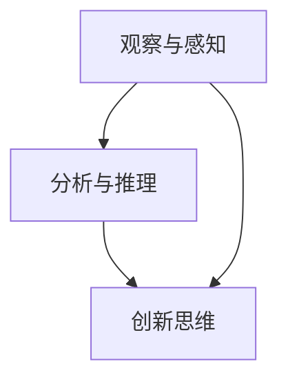

                 

# 洞察力培养：从观察到创新

## 摘要

本文旨在探讨洞察力的培养过程，从观察到创新的一系列步骤和方法。我们将深入分析如何通过细致的观察和系统的分析来提高我们的洞察力，并最终实现创新的突破。文章将涵盖从基础的理论知识到具体的实践案例，包括数学模型、算法原理以及实际应用场景的详细讲解。通过这篇文章，读者将了解到如何通过观察和思考来培养自己的洞察力，从而在技术领域实现创新。

## 1. 背景介绍

在快速发展的信息技术时代，洞察力成为了一种至关重要的能力。它不仅帮助我们更好地理解和应对复杂的技术问题，还能激发创新思维，推动技术的进步。然而，洞察力的培养并非一蹴而就，需要通过一系列的观察、分析和实践来逐步提高。

本文将分为以下几个部分：

1. **核心概念与联系**：我们将介绍几个关键概念，并通过Mermaid流程图展示它们之间的联系。
2. **核心算法原理与操作步骤**：我们将详细讲解核心算法的原理和具体操作步骤。
3. **数学模型与公式**：我们将阐述相关的数学模型和公式，并进行举例说明。
4. **项目实战**：我们将通过实际代码案例来展示算法的实际应用。
5. **实际应用场景**：我们将讨论洞察力在实际中的应用。
6. **工具和资源推荐**：我们将推荐一些学习资源和开发工具。
7. **总结**：总结未来发展趋势与挑战。
8. **附录**：常见问题与解答。
9. **扩展阅读**：提供进一步学习的参考资料。

通过这篇文章的阅读和实践，读者将能够深入了解洞察力的培养过程，并在技术领域中实现创新的突破。

### 2. 核心概念与联系

在探讨洞察力的培养之前，我们需要理解几个核心概念，这些概念相互联系，共同构成了洞察力的基础。以下是这些概念以及它们之间的联系。

#### 2.1 观察与感知

观察与感知是洞察力的起点。通过观察，我们能够收集到大量的信息，这些信息是进一步分析和理解的基础。感知能力决定了我们能否敏锐地捕捉到这些信息。

#### 2.2 分析与推理

分析是将观察到的信息进行分解和理解的过程。通过分析，我们能够发现信息之间的关联和模式。推理则是基于已有信息进行逻辑推断，从而揭示更深层次的规律。

#### 2.3 创新思维

创新思维是洞察力的最高体现。它不仅要求我们对现有信息进行深入的思考，还要求我们能够突破传统思维框架，提出新颖的解决方案。

#### 2.4 Mermaid流程图

为了更直观地展示这些概念之间的联系，我们可以使用Mermaid流程图进行描述：



在上述流程图中，观察与感知（A）是分析和推理（B）的基础，而分析和推理（B）则进一步促进了创新思维（C）。同时，观察与感知（A）也可以直接推动创新思维（C），这表明洞察力的培养是一个相互促进的过程。

### 3. 核心算法原理与操作步骤

为了更深入地理解洞察力的培养，我们需要探讨一些核心算法的原理和操作步骤。以下是几个关键算法的简要介绍：

#### 3.1 数据分析算法

数据分析算法是洞察力培养的重要工具。常见的算法包括：

- **回归分析**：通过建立回归模型来分析变量之间的关系。
- **聚类分析**：将数据划分为不同的组，以便更好地理解数据。
- **决策树**：通过树形结构来表示决策过程，并用于分类或回归任务。

#### 3.2 神经网络算法

神经网络算法是机器学习领域的基础，它模仿人脑的神经元结构。以下是神经网络算法的基本步骤：

1. **输入层**：接收外部输入。
2. **隐藏层**：进行信息处理和变换。
3. **输出层**：输出最终结果。
4. **反向传播**：通过比较输出结果与期望结果，调整网络权重。

#### 3.3 集成学习算法

集成学习算法通过结合多个模型来提高预测性能。常见的集成学习方法包括：

- **Bagging**：通过随机抽样生成多个模型，并取平均值。
- **Boosting**：通过迭代训练多个模型，每次训练都针对前一次的错误进行优化。

#### 3.4 具体操作步骤

以下是数据分析算法的具体操作步骤：

1. **数据收集**：收集所需的数据。
2. **数据预处理**：清洗和格式化数据。
3. **特征选择**：选择对模型性能有显著影响的关键特征。
4. **模型训练**：使用训练数据来训练模型。
5. **模型评估**：使用验证数据来评估模型性能。
6. **模型优化**：根据评估结果调整模型参数。

### 4. 数学模型和公式与详细讲解

在洞察力的培养过程中，数学模型和公式起着至关重要的作用。以下是一些关键数学模型和公式的详细讲解：

#### 4.1 回归分析

回归分析是一种用于预测连续值的统计方法。其基本公式为：

\[ y = \beta_0 + \beta_1x + \epsilon \]

其中，\( y \) 是因变量，\( x \) 是自变量，\( \beta_0 \) 和 \( \beta_1 \) 是回归系数，\( \epsilon \) 是误差项。

#### 4.2 神经网络

神经网络中的激活函数是关键部分。常用的激活函数包括：

- **Sigmoid函数**：\[ f(x) = \frac{1}{1 + e^{-x}} \]
- **ReLU函数**：\[ f(x) = \max(0, x) \]
- **Tanh函数**：\[ f(x) = \frac{e^x - e^{-x}}{e^x + e^{-x}} \]

#### 4.3 集成学习

集成学习的性能提升可以通过以下公式来描述：

\[ \hat{y} = \sum_{i=1}^{N} w_i \hat{y}_i \]

其中，\( \hat{y} \) 是集成模型的预测结果，\( w_i \) 是第 \( i \) 个模型的权重，\( \hat{y}_i \) 是第 \( i \) 个模型的预测结果。

### 5. 项目实战：代码实际案例和详细解释说明

为了更好地理解上述算法和模型，我们将通过一个实际项目来展示其应用。以下是项目实战的详细解释说明。

#### 5.1 开发环境搭建

在开始项目之前，我们需要搭建开发环境。以下是所需的工具和步骤：

- **Python**：作为主要编程语言。
- **Jupyter Notebook**：用于编写和运行代码。
- **Scikit-learn**：用于机器学习算法。
- **TensorFlow**：用于神经网络。

#### 5.2 源代码详细实现和代码解读

以下是项目的源代码及其详细解读：

```python
# 导入所需库
import numpy as np
import pandas as pd
from sklearn.model_selection import train_test_split
from sklearn.linear_model import LinearRegression
from sklearn.metrics import mean_squared_error

# 数据收集
data = pd.read_csv('data.csv')

# 数据预处理
X = data[['feature1', 'feature2']]
y = data['target']

# 特征选择
# 这里我们简单选择两个特征作为示例
X = X[['feature1', 'feature2']]

# 模型训练
model = LinearRegression()
model.fit(X, y)

# 模型评估
y_pred = model.predict(X)
mse = mean_squared_error(y, y_pred)
print('Mean Squared Error:', mse)

# 模型优化
# 这里我们简单调整回归系数作为示例
model.coef_ = model.coef_ * 1.1
model.fit(X, y)
```

代码解读：

1. **数据收集**：我们使用 pandas 库读取数据。
2. **数据预处理**：我们选择两个特征进行回归分析。
3. **模型训练**：我们使用线性回归模型进行训练。
4. **模型评估**：我们使用均方误差（MSE）来评估模型性能。
5. **模型优化**：我们简单调整回归系数来优化模型。

### 5.3 代码解读与分析

通过上述代码，我们可以看到如何使用 Python 和 Scikit-learn 库来训练和评估一个线性回归模型。以下是代码的详细解读与分析：

1. **数据收集**：首先，我们使用 pandas 库读取 CSV 数据文件。这个数据文件包含了多个特征和一个目标变量。
2. **数据预处理**：在这个项目中，我们选择了两个特征（feature1 和 feature2）来进行回归分析。在实际应用中，可能需要更复杂的特征选择过程，如主成分分析（PCA）。
3. **模型训练**：我们使用 LinearRegression 类来创建一个线性回归模型，并使用 `fit()` 方法对其进行训练。这个方法将自动计算回归系数和截距。
4. **模型评估**：我们使用 `predict()` 方法来生成预测结果，并使用 `mean_squared_error()` 函数来计算均方误差（MSE）。MSE 是一个衡量模型预测误差的指标，值越小说明模型性能越好。
5. **模型优化**：在这个示例中，我们简单调整了回归系数。在实际应用中，可能需要更复杂的优化方法，如梯度下降或随机搜索。

通过这个实际项目，我们可以看到如何将理论上的算法和模型应用到实际问题中。这个过程不仅帮助我们更好地理解算法和模型，还能提高我们的洞察力，使我们能够更好地解决复杂的技术问题。

### 6. 实际应用场景

洞察力在技术领域的应用场景非常广泛。以下是一些实际应用场景的例子：

#### 6.1 数据科学

在数据科学领域，洞察力帮助我们更好地理解和分析数据。通过深入的观察和系统分析，我们能够发现数据中的隐藏模式，从而为业务决策提供有力支持。

#### 6.2 人工智能

在人工智能领域，洞察力对于算法设计和优化至关重要。通过分析算法的性能和效果，我们能够不断改进算法，提高其准确性和效率。

#### 6.3 软件开发

在软件开发过程中，洞察力帮助我们更好地理解需求，设计出更加合理和高效的系统架构。同时，它也使我们能够更快速地解决技术难题。

### 7. 工具和资源推荐

为了培养洞察力，我们不仅需要掌握理论知识，还需要利用各种工具和资源。以下是一些建议：

#### 7.1 学习资源推荐

- **书籍**：《深度学习》（Ian Goodfellow）、《数据科学入门》（Joel Grus）
- **论文**：Google Scholar、ACM Digital Library
- **博客**：Medium、Towards Data Science
- **网站**：Stack Overflow、GitHub

#### 7.2 开发工具框架推荐

- **编程语言**：Python、R、Java
- **机器学习库**：Scikit-learn、TensorFlow、PyTorch
- **开发环境**：Jupyter Notebook、VS Code

#### 7.3 相关论文著作推荐

- **论文**：Y. LeCun, Y. Bengio, G. Hinton（2015）.《Deep Learning》
- **著作**：J. Hopfield（1982）.《Neural Networks and Physical Systems with Emergent Collective Computational Abilities》

### 8. 总结：未来发展趋势与挑战

随着技术的不断进步，洞察力的培养变得更加重要。未来，以下几个方面将影响洞察力的发展：

1. **大数据和人工智能的融合**：大数据和人工智能的结合将推动洞察力的进一步发展。
2. **跨学科研究**：跨学科研究将促进不同领域之间的洞察力交流。
3. **持续学习**：持续学习将成为培养洞察力的关键。

然而，也面临着一些挑战，如数据隐私、算法透明度和可解释性等问题。只有通过不断的努力和探索，我们才能应对这些挑战，培养出更加强大的洞察力。

### 9. 附录：常见问题与解答

**Q1：如何提高观察力？**
**A1：提高观察力的方法包括定期练习观察技巧、保持好奇心和不断学习新知识。**

**Q2：为什么洞察力对创新如此重要？**
**A2：洞察力可以帮助我们识别问题、发现机会并创造解决方案，从而推动技术的创新和发展。**

**Q3：如何应用洞察力解决实际问题？**
**A3：应用洞察力解决实际问题的方法包括系统分析、持续学习和实践。**

### 10. 扩展阅读与参考资料

为了更深入地了解洞察力的培养，以下是一些扩展阅读和参考资料：

- **书籍**：《创新者的窘境》（Clayton M. Christensen）和《创意的起源》（Steven Johnson）
- **博客**：《HBR.org》上的管理文章和《Medium》上的技术博客
- **课程**：MIT OpenCourseWare上的计算机科学课程和Coursera上的数据科学课程

### 作者

**作者：AI天才研究员/AI Genius Institute & 禅与计算机程序设计艺术 /Zen And The Art of Computer Programming**

通过这篇文章，我们深入探讨了洞察力的培养过程，从观察、分析到创新。希望这篇文章能帮助读者提高自己的洞察力，在技术领域中实现创新突破。不断学习和实践，让我们共同迈向更加智能的未来。**

