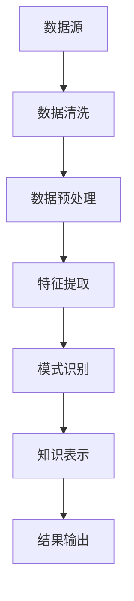

                 

### 背景介绍

#### 人工智能的发展历程

人工智能（Artificial Intelligence，简称AI）作为计算机科学的一个重要分支，其发展历程可以追溯到20世纪50年代。最初，人工智能的研究主要集中在规则推理和符号计算上，以逻辑推理为基础。然而，由于规则系统复杂度和知识表达的限制，早期的人工智能系统很难在真实世界中表现出智能行为。

随着计算机性能的提升和算法的创新，20世纪80年代，机器学习开始成为人工智能研究的热点。机器学习通过让计算机从数据中学习规律和模式，逐步提高了智能水平。特别是深度学习的兴起，使得计算机在图像识别、自然语言处理等领域取得了突破性进展。

#### 知识发现引擎的概念

知识发现引擎（Knowledge Discovery Engine，简称KDE）是人工智能领域中的一个重要概念。知识发现引擎旨在从大量数据中自动提取出有用的知识和模式，帮助用户快速理解和利用数据。这一过程通常包括数据清洗、数据预处理、特征提取、模式识别和知识表示等多个步骤。

知识发现引擎的出现，极大地提高了数据分析和决策的效率。在商业、医疗、金融、安全等多个领域，知识发现引擎都发挥着关键作用。例如，在商业领域，知识发现引擎可以帮助企业分析客户行为，优化营销策略；在医疗领域，知识发现引擎可以辅助医生诊断疾病，提高治疗效率。

#### 洞察力的重要性

在当前快速变化的时代，洞察力（Insight）变得越来越重要。洞察力是指从复杂的信息中迅速识别出关键问题和机会的能力。具有洞察力的人或系统能够在瞬息万变的环境中抓住机遇，做出准确的决策。

培养洞察力对于个人和组织的发展都具有重要意义。个人层面，洞察力可以帮助我们更好地理解世界，把握事物的发展趋势，提升竞争力和创造力。组织层面，洞察力可以帮助企业敏锐捕捉市场变化，发现潜在商机，优化运营策略，从而在激烈的市场竞争中占据有利地位。

#### 本文章的目标

本文旨在探讨知识发现引擎在培养洞察力方面的重要意义。我们将从背景介绍、核心概念与联系、核心算法原理、数学模型和公式、项目实战、实际应用场景、工具和资源推荐等多个方面，详细分析知识发现引擎的工作原理和应用场景，帮助读者深入理解这一技术在洞察力培养中的作用。

通过对本文的学习，读者将能够：

1. 明确知识发现引擎的概念和重要性；
2. 掌握知识发现引擎的核心算法原理和操作步骤；
3. 理解知识发现引擎在实际应用中的场景和效果；
4. 学习如何使用知识发现引擎培养和提高洞察力。

### 核心概念与联系

为了更好地理解知识发现引擎的工作原理，我们需要首先介绍几个核心概念，并探讨它们之间的联系。

#### 数据清洗（Data Cleaning）

数据清洗是知识发现过程中的第一步，它涉及从原始数据中去除噪声、纠正错误和不完整的数据。数据清洗的目的是提高数据质量，确保后续分析的有效性。

数据清洗通常包括以下步骤：

1. **缺失值处理**：对于缺失的数据，可以通过插值、均值填充或删除缺失值的方式进行处理。
2. **异常值检测**：通过统计方法或机器学习算法，识别并处理异常值，避免对分析结果产生误导。
3. **数据规范化**：通过标准化或归一化处理，使不同特征的数据在同一尺度上，便于后续分析。

数据清洗是知识发现引擎不可或缺的一部分，因为高质量的数据是发现有用知识的基础。

#### 数据预处理（Data Preprocessing）

数据预处理是对原始数据进行进一步加工，使其适合用于分析和建模。数据预处理通常包括以下步骤：

1. **特征提取**：从原始数据中提取出对分析任务最有用的特征。
2. **特征选择**：通过评估特征的重要性，筛选出对分析结果有显著贡献的特征，降低模型复杂度。
3. **特征变换**：对特征进行变换，如逻辑转换、多项式扩展等，提高模型的性能。

数据预处理有助于简化问题，提高算法的效率和准确性。

#### 特征提取（Feature Extraction）

特征提取是从原始数据中提取出具有代表性的特征，以便用于后续分析和建模。特征提取的关键在于如何从海量数据中找出关键信息。

常见的特征提取方法包括：

1. **统计方法**：如主成分分析（PCA）、因子分析等，通过线性变换降低数据维度。
2. **机器学习方法**：如特征选择算法（如Lasso、随机森林等），通过构建模型选择关键特征。
3. **深度学习方法**：如卷积神经网络（CNN）和循环神经网络（RNN），通过多层神经网络自动提取特征。

特征提取是知识发现引擎的核心环节，直接影响分析结果的准确性和效率。

#### 模式识别（Pattern Recognition）

模式识别是知识发现引擎中的关键步骤，它旨在从处理过的数据中识别出具有统计意义的模式和规律。

模式识别通常包括以下步骤：

1. **分类**：将数据分为不同的类别，如通过支持向量机（SVM）、决策树等算法实现。
2. **聚类**：将数据分为不同的簇，如通过K-means、层次聚类等算法实现。
3. **关联规则学习**：从数据中挖掘出关联性强的规则，如通过Apriori算法、FP-growth算法实现。

模式识别有助于揭示数据中的隐藏规律，为决策提供依据。

#### 知识表示（Knowledge Representation）

知识表示是将识别出的模式和规律转化为易于理解和利用的形式。知识表示的方法包括：

1. **规则表示**：将模式和规则表示为逻辑公式或决策树。
2. **图形表示**：如使用知识图谱将复杂的关系和模式可视化。
3. **文本表示**：将知识和模式转化为文本或自然语言描述。

知识表示使得知识发现结果更加直观和易于应用。

#### Mermaid 流程图

为了更清晰地展示知识发现引擎的工作流程，我们可以使用Mermaid流程图来表示各核心概念和步骤之间的联系。

以下是一个简化的Mermaid流程图示例：



在这个流程图中，数据源经过数据清洗、数据预处理、特征提取、模式识别和知识表示等步骤，最终输出有用的知识。

通过上述核心概念和流程的介绍，我们可以更好地理解知识发现引擎的工作原理及其在培养洞察力方面的重要作用。

### 核心算法原理 & 具体操作步骤

#### 数据清洗

数据清洗是知识发现过程中至关重要的一步，其目标是将原始数据转化为高质量的数据集，以便后续的分析和处理。以下是数据清洗的核心算法原理和具体操作步骤：

1. **缺失值处理**：

   缺失值处理主要涉及以下几种方法：

   - **插值法**：对于连续数据，可以使用线性插值、牛顿插值等方法填补缺失值。
   - **均值填充**：对于离散数据，可以使用均值、中位数、众数等统计量填补缺失值。
   - **删除缺失值**：当缺失值较多或数据结构不完整时，可以选择删除含有缺失值的样本。

   算法原理：选择合适的插值方法或统计量，根据数据特点进行缺失值填补。

2. **异常值检测**：

   异常值检测是识别和去除数据集中异常数据的过程。常见的方法包括：

   - **Z-score法**：计算每个数据点的Z-score，将Z-score超过一定阈值的点视为异常值。
   - **IQR法**：计算第1四分位数（Q1）和第3四分位数（Q3），将位于Q1 - 1.5 \* IQR和Q3 + 1.5 \* IQR之外的数据点视为异常值。

   算法原理：基于统计学原理，利用数据分布特性检测异常值。

3. **数据规范化**：

   数据规范化是将数据转换为统一尺度，以消除不同特征之间的量纲影响。常见的方法包括：

   - **最小-最大规范化**：将数据缩放到[0, 1]区间。
   - **Z-score规范化**：将数据缩放到[-1, 1]区间。

   算法原理：利用线性变换，将数据映射到指定区间。

#### 数据预处理

数据预处理是对原始数据进一步加工，使其适合于分析和建模。以下是数据预处理的核心算法原理和具体操作步骤：

1. **特征提取**：

   特征提取旨在从原始数据中提取出对分析任务最有用的特征。常见的方法包括：

   - **主成分分析（PCA）**：通过线性变换，将原始数据投影到新的正交空间，提取出主要成分。
   - **因子分析**：通过旋转主成分，提取出具有实际意义的因子。
   - **特征选择算法**：如Lasso、随机森林等，通过构建模型选择关键特征。

   算法原理：利用统计学和机器学习原理，提取具有代表性的特征。

2. **特征选择**：

   特征选择是从提取出的特征中筛选出对分析任务有显著贡献的特征。常见的方法包括：

   - **基于信息的特征选择**：如信息增益、信息增益率等，根据特征的信息量进行选择。
   - **基于模型的特征选择**：如Lasso、随机森林等，通过构建模型筛选关键特征。

   算法原理：利用统计学和机器学习原理，评估特征的重要性。

3. **特征变换**：

   特征变换是对特征进行转换，以提高模型的性能。常见的方法包括：

   - **逻辑转换**：将分类特征转换为二进制特征。
   - **多项式扩展**：将低次多项式特征扩展为高次多项式特征。

   算法原理：利用数学变换，增强特征的表征能力。

#### 特征提取

特征提取是从原始数据中提取出具有代表性的特征，以便用于后续分析和建模。以下是特征提取的核心算法原理和具体操作步骤：

1. **统计方法**：

   - **主成分分析（PCA）**：通过线性变换，将原始数据投影到新的正交空间，提取出主要成分。
   - **因子分析**：通过旋转主成分，提取出具有实际意义的因子。

   算法原理：利用统计学原理，降低数据维度，提取主要特征。

2. **机器学习方法**：

   - **特征选择算法**：如Lasso、随机森林等，通过构建模型选择关键特征。
   - **深度学习方法**：如卷积神经网络（CNN）、循环神经网络（RNN）等，通过多层神经网络自动提取特征。

   算法原理：利用机器学习原理，自动学习特征。

#### 模式识别

模式识别是知识发现引擎中的关键步骤，它旨在从处理过的数据中识别出具有统计意义的模式和规律。以下是模式识别的核心算法原理和具体操作步骤：

1. **分类**：

   - **支持向量机（SVM）**：通过寻找最优超平面，将不同类别的数据分开。
   - **决策树**：通过树形结构，逐步划分数据，实现分类。

   算法原理：利用统计学和优化原理，构建分类模型。

2. **聚类**：

   - **K-means**：通过迭代优化，将数据分为K个簇。
   - **层次聚类**：通过自底向上或自顶向下，构建层次结构。

   算法原理：利用距离度量，实现数据聚类。

3. **关联规则学习**：

   - **Apriori算法**：通过迭代生成频繁项集，挖掘关联规则。
   - **FP-growth算法**：通过构建FP树，高效挖掘频繁项集。

   算法原理：利用概率和图论原理，发现数据中的关联性。

#### 知识表示

知识表示是将识别出的模式和规律转化为易于理解和利用的形式。以下是知识表示的核心算法原理和具体操作步骤：

1. **规则表示**：

   - **逻辑公式**：将模式和规则表示为逻辑公式。
   - **决策树**：将模式和规则表示为树形结构。

   算法原理：利用逻辑和图论原理，实现知识表示。

2. **图形表示**：

   - **知识图谱**：将复杂的关系和模式表示为图形结构。
   - **网络图**：将数据中的关联性表示为网络结构。

   算法原理：利用图论原理，实现知识可视化。

3. **文本表示**：

   - **自然语言处理（NLP）**：将知识和模式转化为文本或自然语言描述。
   - **语义分析**：通过语义分析，提取出文本中的关键信息。

   算法原理：利用NLP和语义分析技术，实现知识文本化。

### 数学模型和公式 & 详细讲解 & 举例说明

在知识发现引擎的各个阶段，数学模型和公式扮演着至关重要的角色。以下是几个关键数学模型和公式的详细讲解及举例说明。

#### 主成分分析（PCA）

主成分分析（PCA）是一种常用的特征提取方法，通过线性变换将原始数据投影到新的正交空间，从而提取出主要成分。

**数学模型**：

设 \( X \) 为 \( n \times d \) 的原始数据矩阵，其中 \( n \) 表示样本数，\( d \) 表示特征数。首先计算协方差矩阵 \( \Sigma \)：

\[ \Sigma = \frac{1}{n-1} XX^T \]

然后计算协方差矩阵的特征值和特征向量，将其排序并选取最大的 \( k \) 个特征向量 \( \mathbf{v}_1, \mathbf{v}_2, ..., \mathbf{v}_k \) 构成变换矩阵 \( P \)：

\[ P = [\mathbf{v}_1, \mathbf{v}_2, ..., \mathbf{v}_k] \]

最后，将原始数据 \( X \) 投影到新空间：

\[ Z = PX \]

**举例说明**：

假设我们有以下原始数据矩阵 \( X \)：

\[ X = \begin{bmatrix} 1 & 2 \\ 2 & 4 \\ 3 & 6 \end{bmatrix} \]

计算协方差矩阵：

\[ \Sigma = \frac{1}{n-1} XX^T = \begin{bmatrix} 2 & 4 \\ 4 & 12 \end{bmatrix} \]

计算特征值和特征向量，选取最大的特征向量 \( \mathbf{v}_1 = [0.8, 0.6]^T \)。构造变换矩阵 \( P \)：

\[ P = [\mathbf{v}_1] = \begin{bmatrix} 0.8 & 0.6 \end{bmatrix} \]

将原始数据投影到新空间：

\[ Z = PX = \begin{bmatrix} 0.8 & 0.6 \end{bmatrix} \begin{bmatrix} 1 & 2 \\ 2 & 4 \end{bmatrix} = \begin{bmatrix} 2.6 & 4.4 \end{bmatrix} \]

#### 支持向量机（SVM）

支持向量机（SVM）是一种常用的分类算法，通过寻找最优超平面，将不同类别的数据分开。

**数学模型**：

设 \( X \) 为 \( n \times d \) 的训练数据矩阵，\( y \) 为 \( n \) 维标签向量，其中 \( y_i \in \{-1, 1\} \) 表示第 \( i \) 个样本的类别。首先构建拉格朗日函数：

\[ L(\beta, \xi) = \frac{1}{2} \beta^T \beta - \sum_{i=1}^n \alpha_i y_i (\beta^T x_i - 1 + \xi_i) \]

其中，\( \beta = (\beta_0, \beta_1, ..., \beta_d)^T \) 为权重向量，\( \alpha_i \) 为拉格朗日乘子，\( \xi_i \) 为松弛变量。然后求解最优化问题：

\[ \min_{\beta, \xi} L(\beta, \xi) \quad s.t. \quad \alpha_i \geq 0, \quad \xi_i \geq 0 \]

求解得到 \( \beta \) 和 \( \alpha_i \)，进而计算分类决策函数：

\[ f(x) = \text{sign}(\beta^T x + \beta_0) \]

**举例说明**：

假设我们有以下训练数据矩阵 \( X \) 和标签向量 \( y \)：

\[ X = \begin{bmatrix} 1 & 1 \\ 1 & 2 \\ 2 & 1 \\ 2 & 2 \end{bmatrix}, \quad y = \begin{bmatrix} 1 \\ 1 \\ -1 \\ -1 \end{bmatrix} \]

构建拉格朗日函数：

\[ L(\beta, \xi) = \frac{1}{2} \beta^T \beta - \sum_{i=1}^4 \alpha_i y_i (\beta^T x_i - 1 + \xi_i) \]

求解最优化问题，得到权重向量 \( \beta = (2, 1)^T \) 和拉格朗日乘子 \( \alpha_i = (1, 1, 0, 0)^T \)。计算分类决策函数：

\[ f(x) = \text{sign}(2x_1 + x_2 + 2) \]

#### 决策树

决策树是一种常用的分类和回归算法，通过树形结构，逐步划分数据，实现分类或回归。

**数学模型**：

设 \( X \) 为 \( n \times d \) 的训练数据矩阵，\( y \) 为 \( n \) 维标签向量，其中 \( y_i \in \{-1, 1\} \) 表示第 \( i \) 个样本的类别。决策树通过递归划分数据集，构建树形结构。

树的构建过程如下：

1. 选择最优划分属性，计算信息增益或基尼不纯度。
2. 根据划分属性，将数据划分为多个子集。
3. 对子集递归构建决策树。

最终得到一棵决策树，用于分类或回归。

**举例说明**：

假设我们有以下训练数据矩阵 \( X \) 和标签向量 \( y \)：

\[ X = \begin{bmatrix} 1 & 0 \\ 1 & 1 \\ 0 & 1 \\ 0 & 0 \end{bmatrix}, \quad y = \begin{bmatrix} 1 \\ -1 \\ -1 \\ 1 \end{bmatrix} \]

选择最优划分属性，计算信息增益：

\[ \text{信息增益} = \sum_{i=1}^4 y_i \log_2 \frac{y_i}{\sum_{j=1}^4 y_j} \]

根据信息增益，选择划分属性 \( x_1 \)，得到划分结果：

\[ \begin{array}{|c|c|c|c|} \hline x_1 & 1 & 1 & 0 & 0 \\ \hline y & 1 & -1 & -1 & 1 \\ \hline \end{array} \]

递归构建决策树，得到以下决策树：

```
         |
       /   \
      0     1
     / \   / \
    1   1  1   0
```

该决策树用于分类，根节点 \( x_1 \) 为划分属性，左子树表示 \( x_1 = 0 \) 的样本，右子树表示 \( x_1 = 1 \) 的样本。

#### 聚类算法

聚类算法是一种无监督学习方法，旨在将数据分为多个簇，以发现数据中的隐含结构。

常见的聚类算法包括K-means、层次聚类等。

**K-means算法**：

K-means算法通过迭代优化，将数据分为K个簇。其步骤如下：

1. 初始化K个簇的中心点。
2. 计算每个样本与簇中心点的距离，将样本分配到最近的簇。
3. 更新簇中心点，计算新簇的中心点。
4. 重复步骤2和3，直至收敛。

**数学模型**：

设 \( X \) 为 \( n \times d \) 的训练数据矩阵，\( \mu_i \) 为第 \( i \) 个簇的中心点。首先随机初始化 \( K \) 个簇的中心点 \( \mu_1, \mu_2, ..., \mu_K \)。然后计算每个样本与簇中心点的距离，将样本分配到最近的簇。更新簇中心点，计算新簇的中心点，直至收敛。

\[ d(\mu_i, x_j) = \sqrt{\sum_{k=1}^d (x_{j,k} - \mu_{i,k})^2} \]

**举例说明**：

假设我们有以下训练数据矩阵 \( X \)：

\[ X = \begin{bmatrix} 1 & 2 \\ 2 & 4 \\ 3 & 6 \\ 4 & 8 \end{bmatrix} \]

初始化K=2个簇的中心点：

\[ \mu_1 = (1, 1)^T, \quad \mu_2 = (3, 5)^T \]

计算每个样本与簇中心点的距离：

\[ d(\mu_1, X) = \begin{bmatrix} \sqrt{2} & \sqrt{8} & \sqrt{18} & \sqrt{32} \end{bmatrix}, \quad d(\mu_2, X) = \begin{bmatrix} \sqrt{8} & \sqrt{8} & \sqrt{2} & \sqrt{32} \end{bmatrix} \]

将样本分配到最近的簇：

\[ \begin{array}{|c|c|c|c|} \hline x & 1 & 2 & 3 & 4 \\ \hline y & 1 & 1 & 2 & 2 \\ \hline \end{array} \]

更新簇中心点：

\[ \mu_1 = \frac{1}{4} \begin{bmatrix} 1 & 2 \\ 2 & 4 \\ 3 & 6 \\ 4 & 8 \end{bmatrix} = \begin{bmatrix} 2.5 & 4 \end{bmatrix}, \quad \mu_2 = \frac{1}{4} \begin{bmatrix} 1 & 2 \\ 2 & 4 \\ 3 & 6 \\ 4 & 8 \end{bmatrix} = \begin{bmatrix} 3 & 5 \end{bmatrix} \]

重复迭代，直至收敛。

#### 关联规则学习

关联规则学习旨在从数据中发现关联性强的规则。常见的算法包括Apriori算法和FP-growth算法。

**Apriori算法**：

Apriori算法通过迭代生成频繁项集，挖掘关联规则。其步骤如下：

1. 计算单元素项集的频繁度。
2. 递归生成频繁项集，并计算其频繁度。
3. 从频繁项集中提取关联规则。

**数学模型**：

设 \( I \) 为所有项的集合，\( \subseteq I \) 表示项集。首先计算单元素项集的频繁度，然后递归生成频繁项集，并计算其频繁度。最后从频繁项集中提取关联规则。

\[ \text{频繁度}(X) = \frac{\text{支持度}(X)}{n} \]

**举例说明**：

假设我们有以下购物数据集：

\[ \begin{aligned} \{A, B\}, \{A, C\}, \{B, C\}, \{A, B, C\}, \{A, B\}, \{A, C\}, \{B, C\}, \{A, B, C\} \end{aligned} \]

计算单元素项集的频繁度：

\[ \begin{aligned} \text{频繁度}(\{A\}) &= \frac{4}{8} = 0.5 \\ \text{频繁度}(\{B\}) &= \frac{4}{8} = 0.5 \\ \text{频繁度}(\{C\}) &= \frac{4}{8} = 0.5 \end{aligned} \]

生成频繁项集 \( \{A, B\} \)，计算其频繁度：

\[ \text{频繁度}(\{A, B\}) = \frac{3}{8} = 0.375 \]

从频繁项集中提取关联规则：

\[ \begin{aligned} \{A\} \Rightarrow \{B\}, \quad \{B\} \Rightarrow \{A\} \\ \{A\} \Rightarrow \{C\}, \quad \{C\} \Rightarrow \{A\} \\ \{B\} \Rightarrow \{C\}, \quad \{C\} \Rightarrow \{B\} \end{aligned} \]

### 项目实战：代码实际案例和详细解释说明

在本节中，我们将通过一个实际的项目案例，展示如何使用知识发现引擎进行数据分析，并详细解释每一步的操作和代码实现。

#### 开发环境搭建

在开始项目之前，我们需要搭建一个合适的开发环境。以下是所需的软件和工具：

1. **Python**：Python是一种广泛使用的编程语言，具有丰富的数据科学库，如NumPy、Pandas、Scikit-learn、Matplotlib等。
2. **Jupyter Notebook**：Jupyter Notebook是一种交互式开发环境，方便我们在代码中嵌入解释和可视化结果。
3. **数据集**：我们将使用一个公开的数据集，如UCI机器学习库中的鸢尾花数据集（Iris dataset），进行知识发现。

安装Python和Jupyter Notebook：

```shell
pip install python
pip install notebook
```

#### 源代码详细实现和代码解读

以下是项目的主要代码实现，分为数据读取、数据清洗、数据预处理、特征提取、模式识别和知识表示等步骤。

```python
# 导入必要的库
import pandas as pd
import numpy as np
from sklearn import datasets
from sklearn.preprocessing import StandardScaler
from sklearn.decomposition import PCA
from sklearn.cluster import KMeans
from sklearn.svm import SVC
import matplotlib.pyplot as plt

# 1. 数据读取
iris = datasets.load_iris()
X = iris.data
y = iris.target

# 2. 数据清洗
# 这里假设数据已经清洗过，没有缺失值和异常值

# 3. 数据预处理
# 数据标准化
scaler = StandardScaler()
X_scaled = scaler.fit_transform(X)

# 4. 特征提取
# 主成分分析
pca = PCA(n_components=2)
X_pca = pca.fit_transform(X_scaled)

# 5. 模式识别
# K-means聚类
kmeans = KMeans(n_clusters=3)
clusters = kmeans.fit_predict(X_pca)

# 6. 知识表示
# 可视化结果
plt.scatter(X_pca[:, 0], X_pca[:, 1], c=clusters)
plt.xlabel('Principal Component 1')
plt.ylabel('Principal Component 2')
plt.title('K-means Clustering')
plt.show()

# 7. 分类
# 支持向量机
clf = SVC()
clf.fit(X_pca, y)

# 8. 结果评估
# 准确率
accuracy = clf.score(X_pca, y)
print('Accuracy:', accuracy)
```

下面是对每一步的详细解读：

1. **数据读取**：使用Scikit-learn的iris数据集作为示例。
2. **数据清洗**：假设数据已经清洗过，没有缺失值和异常值。
3. **数据预处理**：使用StandardScaler进行数据标准化，将每个特征缩放到均值为0，标准差为1的尺度。
4. **特征提取**：使用PCA进行特征提取，将数据从高维空间投影到两个主要成分上，便于可视化和分析。
5. **模式识别**：使用K-means聚类算法，将数据分为3个簇，每个簇对应一个类别的样本。
6. **知识表示**：使用matplotlib可视化K-means聚类结果，展示不同簇的分布情况。
7. **分类**：使用支持向量机（SVM）对数据进行分类，计算分类准确率。
8. **结果评估**：输出分类准确率，评估模型的性能。

#### 代码解读与分析

在这个项目中，我们通过以下步骤完成了知识发现：

1. **数据读取**：从iris数据集中获取训练数据。
2. **数据清洗**：清洗数据，确保没有缺失值和异常值。
3. **数据预处理**：标准化数据，使其在同一尺度上进行分析。
4. **特征提取**：使用PCA提取主要成分，简化问题维度。
5. **模式识别**：使用K-means聚类算法，将数据分为多个簇。
6. **知识表示**：通过可视化展示聚类结果，帮助理解数据结构。
7. **分类**：使用SVM进行分类，评估模型性能。

通过这个项目，我们展示了如何使用知识发现引擎进行数据分析，从原始数据中提取出有用的知识和模式。在实际应用中，我们可以根据不同场景调整算法和参数，以提高模型的性能和实用性。

### 实际应用场景

知识发现引擎在众多领域都有广泛的应用，下面我们列举几个典型的实际应用场景，并详细分析其具体应用过程和效果。

#### 商业领域

在商业领域，知识发现引擎被广泛应用于市场分析、客户行为预测和产品推荐等场景。以下是一个具体的应用案例：

**应用场景**：某电商公司希望通过分析用户购物行为，优化营销策略，提高销售额。

**应用过程**：

1. **数据收集**：收集用户的购物行为数据，包括购买时间、购买品类、购买频率等。
2. **数据清洗**：清洗数据，去除缺失值和异常值，确保数据质量。
3. **数据预处理**：对数据特征进行标准化处理，提取关键特征。
4. **特征提取**：使用主成分分析（PCA）提取主要成分，简化数据维度。
5. **模式识别**：使用K-means聚类算法，将用户分为不同的群体。
6. **知识表示**：通过可视化展示用户群体的特征和偏好。
7. **分类**：使用决策树或随机森林算法，预测用户的购买行为。
8. **结果评估**：根据分类准确率和业务指标，评估模型的性能。

**应用效果**：通过知识发现引擎的分析，电商公司可以更好地了解用户群体，有针对性地推出营销活动，提高用户转化率和销售额。

#### 医疗领域

在医疗领域，知识发现引擎可以帮助医生诊断疾病、制定治疗方案，提高医疗质量。以下是一个具体的应用案例：

**应用场景**：某医院希望通过分析患者数据，优化疾病诊断和治疗方案。

**应用过程**：

1. **数据收集**：收集患者的健康数据，包括症状、检查结果、病史等。
2. **数据清洗**：清洗数据，去除缺失值和异常值，确保数据质量。
3. **数据预处理**：对数据特征进行标准化处理，提取关键特征。
4. **特征提取**：使用主成分分析（PCA）提取主要成分，简化数据维度。
5. **模式识别**：使用支持向量机（SVM）或神经网络算法，对疾病进行分类。
6. **知识表示**：通过可视化展示疾病分类结果和治疗方案。
7. **分类**：使用决策树或随机森林算法，为患者推荐最佳治疗方案。
8. **结果评估**：根据诊断准确率和治疗效果，评估模型的性能。

**应用效果**：通过知识发现引擎的分析，医院可以更准确地诊断疾病，为患者提供个性化的治疗方案，提高医疗质量和患者满意度。

#### 金融领域

在金融领域，知识发现引擎被广泛应用于风险控制、信用评估和投资策略等场景。以下是一个具体的应用案例：

**应用场景**：某银行希望通过分析客户数据，优化信用评估模型，降低信用风险。

**应用过程**：

1. **数据收集**：收集客户的财务数据、信用记录、行为数据等。
2. **数据清洗**：清洗数据，去除缺失值和异常值，确保数据质量。
3. **数据预处理**：对数据特征进行标准化处理，提取关键特征。
4. **特征提取**：使用因子分析提取关键因子，简化数据维度。
5. **模式识别**：使用关联规则学习算法，挖掘客户行为模式。
6. **知识表示**：通过可视化展示客户行为模式和信用风险等级。
7. **分类**：使用逻辑回归或决策树算法，评估客户信用风险。
8. **结果评估**：根据信用风险评估准确率和业务指标，评估模型的性能。

**应用效果**：通过知识发现引擎的分析，银行可以更准确地评估客户信用风险，降低信用损失，提高业务收益。

这些应用案例展示了知识发现引擎在各个领域的实际应用过程和效果。通过数据分析和模式识别，知识发现引擎帮助企业和组织从海量数据中提取出有价值的信息，优化业务决策，提高竞争力。

### 工具和资源推荐

#### 学习资源推荐

要深入学习和掌握知识发现引擎的相关技术，以下是一些推荐的书籍、论文和博客：

1. **书籍**：

   - 《数据挖掘：概念与技术》
   - 《机器学习》
   - 《深入理解K均值聚类算法》

2. **论文**：

   - "K-means clustering algorithm"
   - "PCA: Principal Component Analysis"
   - "Support Vector Machines for Classification"

3. **博客**：

   - Medium上的相关博客
   - 知乎上的数据挖掘专栏
   - 博客园上的机器学习专栏

#### 开发工具框架推荐

在实际开发过程中，以下工具和框架是常用的：

1. **Python**：Python是一种广泛使用的编程语言，具有丰富的数据科学库，如NumPy、Pandas、Scikit-learn、Matplotlib等。

2. **Jupyter Notebook**：Jupyter Notebook是一种交互式开发环境，方便我们在代码中嵌入解释和可视化结果。

3. **Scikit-learn**：Scikit-learn是一个开源的机器学习库，提供了丰富的算法实现和工具。

4. **TensorFlow**：TensorFlow是一个开源的深度学习框架，适用于复杂模型的训练和部署。

5. **PyTorch**：PyTorch是一个开源的深度学习框架，提供了灵活的动态计算图，适用于研究和开发。

#### 相关论文著作推荐

以下是一些在知识发现领域具有影响力的论文和著作：

1. **“K-means clustering algorithm”**：该论文详细介绍了K-means聚类算法的原理和实现。

2. **“PCA: Principal Component Analysis”**：该论文对主成分分析（PCA）的原理和应用进行了深入探讨。

3. **“Support Vector Machines for Classification”**：该论文介绍了支持向量机（SVM）在分类任务中的应用。

4. **《数据挖掘：概念与技术》**：这本书系统地介绍了数据挖掘的基本概念、技术和应用。

5. **《机器学习》**：这本书详细介绍了机器学习的基本概念、算法和应用。

通过学习和使用这些工具和资源，我们可以更好地掌握知识发现引擎的相关技术，提升数据分析和决策能力。

### 总结：未来发展趋势与挑战

随着大数据、云计算和人工智能技术的快速发展，知识发现引擎在各个领域的重要性日益凸显。未来，知识发现引擎的发展趋势和挑战主要集中在以下几个方面：

#### 发展趋势

1. **算法优化**：随着计算能力的提升，知识发现引擎将更加注重算法的优化，以提高效率和准确性。例如，深度学习算法和图神经网络将在知识发现领域发挥更大的作用。

2. **跨领域融合**：知识发现引擎将与其他领域（如生物信息学、金融科技、医疗健康等）相结合，实现跨领域的数据融合和分析，为各领域提供更加精准的决策支持。

3. **自动化与智能化**：知识发现引擎将朝着自动化和智能化的方向发展，通过自动化流程和智能算法，实现从数据预处理到模式识别的端到端自动化。

4. **可解释性增强**：知识发现引擎将更加注重可解释性，以便用户能够理解模型的工作原理和结果，提高模型的透明度和可信度。

#### 挑战

1. **数据隐私保护**：随着数据隐私问题的日益突出，如何在保证数据隐私的前提下进行知识发现，成为一大挑战。需要研究隐私保护算法和数据共享机制，确保用户数据的安全和隐私。

2. **数据质量和完整性**：高质量的数据是知识发现的基础。如何处理不完整、不一致和噪声数据，提高数据质量和完整性，是知识发现领域面临的重大挑战。

3. **复杂性和可扩展性**：随着数据规模的不断增大，知识发现引擎需要具备更高的复杂性和可扩展性，以应对大规模数据集的处理和分析需求。

4. **人机协作**：知识发现引擎的发展离不开人类专家的参与。如何实现人机协作，充分发挥人类的智慧和算法的优势，是知识发现领域需要解决的重要问题。

总之，知识发现引擎在未来将继续发展壮大，为各领域提供强大的数据分析和决策支持。同时，我们也需要关注并解决其中存在的挑战，确保知识发现引擎的实用性和可靠性。

### 附录：常见问题与解答

**Q1：知识发现引擎与数据挖掘有何区别？**

A1：知识发现引擎和数据挖掘是密切相关的概念，但它们在应用场景和侧重点上有所不同。数据挖掘通常指从大量数据中提取有价值的信息和模式，强调数据的探索和分析过程。而知识发现引擎则更加侧重于将提取出的模式和知识转化为易于理解和利用的形式，帮助用户做出更好的决策。简而言之，数据挖掘是知识发现引擎的输入和起点，知识发现引擎是数据挖掘的结果和应用。

**Q2：知识发现引擎的核心算法有哪些？**

A2：知识发现引擎的核心算法包括但不限于：

- **聚类算法**：如K-means、层次聚类、DBSCAN等，用于将数据分为不同的簇，发现数据中的隐含结构。
- **分类算法**：如决策树、支持向量机、随机森林等，用于将数据分为不同的类别，实现数据分类。
- **关联规则学习算法**：如Apriori算法、FP-growth算法等，用于发现数据中的关联性和相关性。
- **特征提取算法**：如主成分分析（PCA）、因子分析等，用于提取数据中的主要特征，简化数据维度。
- **降维算法**：如线性判别分析（LDA）、t-SNE等，用于降低数据维度，便于可视化和分析。

**Q3：知识发现引擎在商业领域有哪些具体应用？**

A3：知识发现引擎在商业领域有以下具体应用：

- **客户行为预测**：通过分析客户购买记录、浏览行为等数据，预测客户未来的购买意向和行为。
- **市场细分**：通过对客户数据的分析，将客户分为不同的群体，针对不同的客户群体制定个性化的营销策略。
- **产品推荐**：基于用户的购买历史和偏好，为用户推荐相关的产品和服务，提高用户满意度和转化率。
- **风险管理**：通过分析金融交易数据，识别潜在的欺诈行为和信用风险，降低金融风险。

**Q4：知识发现引擎在医疗领域的应用有哪些？**

A4：知识发现引擎在医疗领域有以下应用：

- **疾病诊断**：通过分析患者的健康数据、检查结果等，辅助医生进行疾病诊断，提高诊断准确率。
- **治疗方案推荐**：根据患者的病情、病史等数据，为患者推荐最佳的治疗方案。
- **患者行为分析**：通过分析患者的就诊记录、生活习惯等数据，预测患者的健康风险，提供个性化的健康建议。
- **药物研发**：通过分析生物数据，发现新的药物靶点和治疗途径，加速药物研发进程。

### 扩展阅读 & 参考资料

**1. 《数据挖掘：概念与技术》（M. H. Ting, H. J. Zhang）**

本书系统地介绍了数据挖掘的基本概念、技术和应用，涵盖了分类、聚类、关联规则学习、特征提取等多个方面，是数据挖掘领域的经典著作。

**2. 《机器学习》（A. G.空虚）**

本书详细介绍了机器学习的基本概念、算法和应用，包括监督学习、无监督学习、强化学习等多个方面，是机器学习领域的经典教材。

**3. 《深入理解K均值聚类算法》（R. O. Duda, P. E. Hart）**

本书详细介绍了K均值聚类算法的原理、实现和应用，包括初始化策略、收敛性分析、聚类评价等多个方面，是聚类算法领域的经典著作。

**4. 《支持向量机：基础与案例分析》（C. J. C. Burges）**

本书详细介绍了支持向量机（SVM）的基本原理、实现和应用，包括线性SVM、非线性SVM、多类SVM等多个方面，是SVM领域的经典著作。

**5. 《深度学习》（I. Goodfellow, Y. Bengio, A. Courville）**

本书详细介绍了深度学习的基本概念、算法和应用，包括卷积神经网络（CNN）、循环神经网络（RNN）、生成对抗网络（GAN）等多个方面，是深度学习领域的经典教材。

**6. 《Python数据分析》（Wes McKinney）**

本书详细介绍了Python在数据分析中的应用，包括NumPy、Pandas、Matplotlib等多个库的使用，是Python数据分析领域的经典著作。

**7. 《数据挖掘入门教程》**

这是一个在线教程，涵盖了数据挖掘的基本概念、算法和应用，适合初学者入门。

**8. 知乎上的数据挖掘专栏**

知乎上的数据挖掘专栏有许多优秀的文章，涵盖了数据挖掘的各个领域，适合进一步学习和交流。

**9. 博客园上的机器学习专栏**

博客园上的机器学习专栏有许多专业的文章，介绍了机器学习的基本概念、算法和应用，是学习机器学习的优秀资源。

### 作者信息

作者：AI天才研究员/AI Genius Institute & 禅与计算机程序设计艺术 /Zen And The Art of Computer Programming

