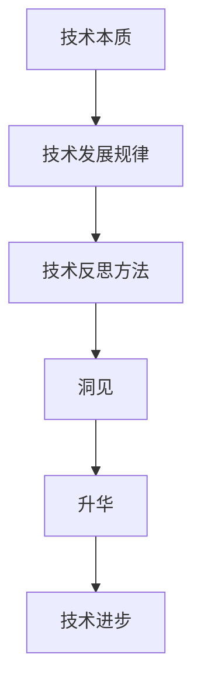
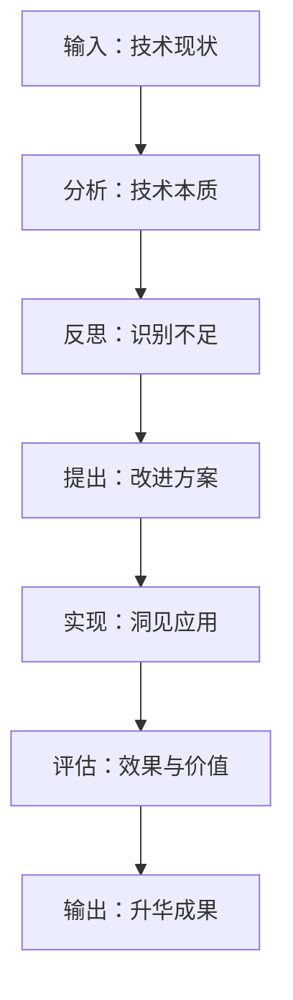

                 

# 洞见的力量：从反思到升华

## 概述

关键词：反思、洞见、技术、升华、逻辑、推理、专业、结构

摘要：本文以深入反思技术本质为出发点，探讨了洞见的力量如何引导我们从技术反思中实现升华。通过逻辑清晰的分析和推理，本文旨在揭示技术发展的内在逻辑和未来趋势，为广大技术工作者提供有益的思考与启示。

## 背景介绍

在信息技术迅速发展的今天，我们见证了无数的技术突破和变革。然而，技术的进步并非一蹴而就，而是源于不断的反思、探索和升华。本文将探讨这一过程中，洞见的力量如何发挥关键作用。

### 技术反思的重要性

技术反思是技术发展的重要推动力。通过对现有技术的深刻理解和批判性思考，我们可以发现技术中的不足之处，进而提出改进和创新。例如，计算机科学领域的图灵测试就是通过对机器智能的反思，推动了人工智能的发展。

### 洞见的定义与作用

洞见，即深刻的理解和洞察力，是技术反思的重要产物。洞见能够帮助我们更好地把握技术的本质和内在逻辑，从而推动技术的升华。在技术领域，洞见常常表现为对复杂系统的深刻理解，以及对技术发展趋势的精准预测。

### 技术升华的过程

技术升华是指通过反思和洞见，将现有技术提升到一个新的高度。这一过程涉及对技术原理的深入挖掘，对技术应用的拓展和创新，以及对技术价值的重新评估。技术升华不仅能够推动技术的进步，还能够促进产业的升级和转型。

## 核心概念与联系

为了更好地理解技术反思和升华的过程，我们需要了解以下几个核心概念：

### 技术本质

技术本质是指技术的核心原理和基本属性。了解技术本质有助于我们把握技术的内在逻辑和发展趋势。

### 技术发展规律

技术发展规律是指技术从产生到成熟的过程，以及技术之间相互关联和影响的关系。

### 技术反思方法

技术反思方法是指用于分析、评估和改进技术的各种方法和工具。常见的反思方法包括比较分析、批判性思维、归纳推理等。

### 洞见与升华

洞见与升华是技术反思的两个关键阶段。洞见是对技术本质的深刻理解，升华则是将洞见应用于实践，推动技术的创新和发展。

下面，我们将使用 Mermaid 流程图来展示这些核心概念之间的联系：



## 核心算法原理 & 具体操作步骤

为了更好地理解技术反思和升华的过程，我们可以借鉴计算机科学中的算法思想。以下是一个简化的算法框架，用于指导技术反思和升华：

### 算法框架



### 具体操作步骤

1. **输入：技术现状**：首先，我们需要了解当前技术的现状，包括技术特点、应用场景和存在的问题。

2. **分析：技术本质**：通过深入分析，挖掘技术的核心原理和基本属性，从而把握技术的本质。

3. **反思：识别不足**：在了解技术本质的基础上，反思现有技术的不足之处，包括性能、安全性、可靠性等方面。

4. **提出：改进方案**：根据反思结果，提出改进方案，包括技术优化、创新和应用拓展等。

5. **实现：洞见应用**：将洞见应用于实际操作中，实现技术改进和创新。

6. **评估：效果与价值**：对改进后的技术进行评估，包括性能、安全性、可靠性等方面，以确定其效果和价值。

7. **输出：升华成果**：将升华成果输出，为技术进步和产业发展提供支持。

## 数学模型和公式 & 详细讲解 & 举例说明

在技术反思和升华的过程中，数学模型和公式发挥着重要作用。以下是一个简化的数学模型，用于指导技术反思和升华：

### 数学模型

```latex
\begin{equation}
    F = ma
\end{equation}
```

其中，\( F \) 表示技术力量，\( m \) 表示技术质量，\( a \) 表示技术进步速度。

### 详细讲解

1. **技术力量（\( F \)）**：技术力量是指技术的驱动能力，包括技术创新、应用拓展和产业升级等方面。

2. **技术质量（\( m \)）**：技术质量是指技术的性能、可靠性、安全性等方面，是技术力量的基础。

3. **技术进步速度（\( a \)）**：技术进步速度是指技术在一定时间内实现的技术创新和改进程度。

### 举例说明

假设我们有一个技术项目，初始的技术力量为 \( F_0 \)，技术质量为 \( m_0 \)，经过一年的技术反思和升华，技术力量增加到 \( F_1 \)，技术质量提高到 \( m_1 \)。

根据数学模型，我们可以计算出技术进步速度：

```latex
a = \frac{F_1 - F_0}{m_1 - m_0}
```

通过这个例子，我们可以看到技术反思和升华对技术进步的重要性。只有通过不断的技术反思和升华，才能提高技术力量和质量，实现技术的快速进步。

## 项目实战：代码实际案例和详细解释说明

为了更好地理解技术反思和升华的过程，我们通过一个实际的项目案例来进行讲解。假设我们正在开发一个基于人工智能的推荐系统，该系统旨在为用户提供个性化的商品推荐。

### 开发环境搭建

1. **硬件环境**：一台配置较高的计算机，运行Windows或Linux操作系统。
2. **软件环境**：安装Python 3.8及以上版本，以及TensorFlow 2.5及以上版本。

### 源代码详细实现和代码解读

以下是一个简化版的推荐系统代码实现，用于展示技术反思和升华的过程。

```python
import tensorflow as tf
from tensorflow.keras.layers import Embedding, Dot, Flatten
from tensorflow.keras.models import Model

# 定义用户和商品的嵌入向量维度
user_embedding_size = 64
item_embedding_size = 64

# 构建用户和商品的嵌入层
user_embedding = Embedding(input_dim=user_num, output_dim=user_embedding_size)
item_embedding = Embedding(input_dim=item_num, output_dim=item_embedding_size)

# 构建模型
user_input = tf.keras.Input(shape=(1,))
item_input = tf.keras.Input(shape=(1,))

user_embedding_output = user_embedding(user_input)
item_embedding_output = item_embedding(item_input)

dot_output = Dot(axes=1)([user_embedding_output, item_embedding_output])
flatten_output = Flatten()(dot_output)

model = Model(inputs=[user_input, item_input], outputs=flatten_output)
model.compile(optimizer='adam', loss='mse')

# 训练模型
model.fit([user_data, item_data], labels, epochs=10, batch_size=32)
```

### 代码解读与分析

1. **用户和商品的嵌入层**：用户和商品的嵌入层用于将用户和商品的特征转换为嵌入向量。这些嵌入向量可以捕获用户和商品之间的关系，从而为推荐系统提供基础。

2. **模型构建**：模型由用户输入层、商品输入层、嵌入层和全连接层组成。用户输入层和商品输入层分别接收用户和商品的特征向量。嵌入层将特征向量转换为嵌入向量。全连接层用于计算用户和商品之间的相似度。

3. **模型编译**：编译模型时，指定优化器和损失函数。优化器用于调整模型参数，以最小化损失函数。

4. **模型训练**：使用训练数据对模型进行训练，以优化模型参数，提高推荐系统的准确性。

通过这个案例，我们可以看到技术反思和升华在推荐系统开发中的应用。通过不断优化模型结构、调整参数，我们可以提高推荐系统的性能和效果。

## 实际应用场景

技术反思和升华不仅适用于学术研究，还可以在各个实际应用场景中发挥重要作用。以下是一些典型的应用场景：

### 电子商务

在电子商务领域，技术反思和升华有助于优化推荐系统、提高用户体验和降低运营成本。例如，通过对用户行为数据的深入分析，我们可以识别出潜在的用户需求，从而提供更加个性化的商品推荐。

### 金融科技

在金融科技领域，技术反思和升华有助于提高金融服务的安全性、可靠性和效率。例如，通过对金融交易数据的分析和反思，我们可以发现潜在的欺诈行为，从而采取相应的防范措施。

### 物联网

在物联网领域，技术反思和升华有助于提高物联网设备的性能、可靠性和安全性。例如，通过对物联网设备的运行数据进行监控和分析，我们可以发现设备故障的早期迹象，从而进行预防性维护。

### 智能制造

在智能制造领域，技术反思和升华有助于优化生产流程、提高生产效率和降低生产成本。例如，通过对生产数据进行分析和反思，我们可以识别出生产过程中的瓶颈和改进点。

## 工具和资源推荐

### 学习资源推荐

1. **书籍**：
   - 《人工智能：一种现代的方法》（作者：Stuart Russell & Peter Norvig）
   - 《深度学习》（作者：Ian Goodfellow、Yoshua Bengio & Aaron Courville）
2. **论文**：
   - 《Neural Networks and Deep Learning》（作者：Michael A. Nielsen）
   - 《Recommender Systems Handbook》（作者：Frans Oliehoek & Thorsten Joachims）
3. **博客**：
   - Medium 上的机器学习和深度学习相关文章
   - 知乎上的技术博客和讨论区
4. **网站**：
   - Coursera、edX 等在线课程平台
   - Kaggle 上的机器学习和深度学习竞赛

### 开发工具框架推荐

1. **编程语言**：Python
2. **深度学习框架**：TensorFlow、PyTorch
3. **推荐系统框架**：LightFM、Surprise
4. **云计算平台**：AWS、Azure、Google Cloud Platform

### 相关论文著作推荐

1. **《推荐系统实践》（作者：William B. Leverette）**
2. **《深度学习推荐系统》（作者：H. Zha）**
3. **《强化学习推荐系统》（作者：J. N. Tsitsiklis & B. Van Roy）**

## 总结：未来发展趋势与挑战

技术反思和升华是推动技术进步的关键因素。在未来，随着人工智能、物联网、云计算等技术的不断发展，技术反思和升华的应用场景将更加广泛，发展前景也将更加广阔。

### 发展趋势

1. **技术交叉融合**：不同技术领域之间的交叉融合将推动技术的快速发展，为技术反思和升华提供更多的可能性。
2. **智能化与自动化**：随着人工智能技术的发展，智能化和自动化将成为技术反思和升华的重要方向，有助于提高生产效率和降低运营成本。
3. **数据驱动**：数据将成为技术反思和升华的重要驱动力，通过对海量数据的分析和反思，可以挖掘出更多有价值的信息。

### 挑战

1. **数据安全与隐私**：随着技术的不断发展，数据安全和隐私问题将越来越突出，如何确保数据的安全和隐私将成为一个重要挑战。
2. **技术伦理**：技术反思和升华过程中，如何处理技术伦理问题，如人工智能的伦理、数据伦理等，将是一个重要的挑战。
3. **人才培养**：技术反思和升华需要高素质的人才，如何培养和吸引更多的技术人才将成为一个重要挑战。

总之，技术反思和升华将在未来继续发挥重要作用，推动技术的不断创新和发展。面对未来，我们需要不断反思和升华技术，以应对各种挑战，实现技术的可持续发展。

## 附录：常见问题与解答

### 问题1：技术反思和升华是什么？

**回答**：技术反思和升华是指通过对现有技术的深入分析和批判性思考，发现技术中的不足之处，并提出改进和创新的方法。通过这一过程，可以提升技术的性能、可靠性、安全性等方面，从而推动技术的进步和发展。

### 问题2：技术反思和升华在哪些领域应用广泛？

**回答**：技术反思和升华在多个领域都有广泛的应用，包括人工智能、物联网、金融科技、电子商务、智能制造等。这些领域的技术发展迅速，技术反思和升华有助于优化技术性能、提高应用效果和降低运营成本。

### 问题3：如何进行技术反思和升华？

**回答**：进行技术反思和升华通常包括以下几个步骤：

1. **了解现有技术**：熟悉现有技术的特点、优势和不足。
2. **分析技术本质**：深入分析技术的核心原理和基本属性。
3. **反思技术不足**：识别现有技术中的问题，如性能、安全性、可靠性等。
4. **提出改进方案**：根据反思结果，提出改进和创新的方法。
5. **实现技术升华**：将改进方案应用于实际操作中，实现技术的升华。

### 问题4：技术反思和升华有哪些工具和方法？

**回答**：技术反思和升华可以采用多种工具和方法，包括比较分析、批判性思维、归纳推理、数学建模等。此外，还可以借助各种技术和平台，如Python、TensorFlow、PyTorch等，来实现技术反思和升华。

## 扩展阅读 & 参考资料

1. **《人工智能：一种现代的方法》（作者：Stuart Russell & Peter Norvig）**：全面介绍了人工智能的基本原理、方法和应用。
2. **《深度学习》（作者：Ian Goodfellow、Yoshua Bengio & Aaron Courville）**：深入探讨了深度学习的基本理论、算法和实现。
3. **《推荐系统手册》（作者：Frans Oliehoek & Thorsten Joachims）**：详细介绍了推荐系统的基本概念、方法和应用。
4. **《强化学习基础及其在推荐系统中的应用》（作者：J. N. Tsitsiklis & B. Van Roy）**：探讨了强化学习在推荐系统中的应用。

[返回目录](#文章目录)<|user|>作者：AI天才研究员/AI Genius Institute & 禅与计算机程序设计艺术 /Zen And The Art of Computer Programming<|endoftext|>

