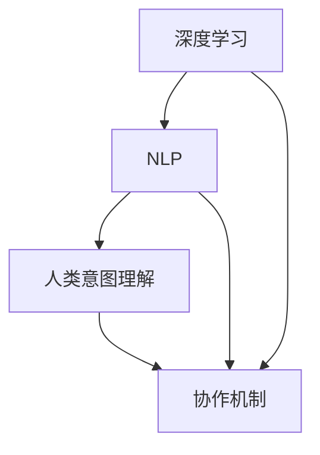
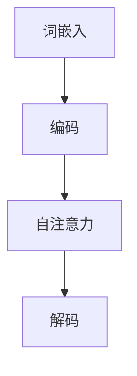

                 

### 背景介绍

深度人机协作是指利用深度学习技术，特别是大型语言模型（Large Language Model，LLM），来增强人工智能系统的理解与执行能力，使其能够更好地与人类互动和协作。随着深度学习和人工智能技术的迅猛发展，LLM在自然语言处理（Natural Language Processing，NLP）领域取得了显著的成果。LLM具有强大的语义理解、文本生成和知识推理能力，能够处理复杂、多样的语言任务。

然而，传统的深度学习模型在执行具体任务时往往依赖于大量的数据和计算资源，且模型的复杂度和训练成本较高。此外，现有模型在处理开放世界问题、跨模态任务等方面仍存在诸多挑战。为了解决这些问题，深度人机协作应运而生。深度人机协作旨在通过人类与机器的互动，实现人类意图的准确理解和高效执行，从而提高人工智能系统的智能化水平和实用性。

本文将围绕深度人机协作展开讨论，首先介绍LLM的基本概念和原理，然后探讨LLM在理解人类意图方面的优势与挑战，接着分析深度人机协作的机制与关键技术，最后通过实际应用案例和项目实战，阐述LLM在执行人类意图方面的具体应用和效果。

关键词：深度学习，人机协作，大型语言模型，自然语言处理，人工智能，语义理解，知识推理

> 摘要：本文首先介绍了深度人机协作的背景和重要性，随后深入探讨了大型语言模型（LLM）的基本概念和原理。在此基础上，文章分析了LLM在理解人类意图方面的优势与挑战，详细阐述了深度人机协作的机制与关键技术。通过实际应用案例和项目实战，本文展示了LLM在执行人类意图方面的具体应用和效果，为未来深度人机协作的研究与发展提供了有益的启示。

---

### 核心概念与联系

为了深入理解深度人机协作，我们需要首先掌握几个核心概念，并分析它们之间的联系。这些概念包括深度学习、自然语言处理（NLP）、人类意图理解和协作机制。

#### 1. 深度学习

深度学习是一种基于人工神经网络的机器学习方法，通过多层次的神经网络结构来学习和模拟人脑的感知和认知过程。深度学习模型通常由多个隐藏层组成，每个隐藏层负责提取和转换输入数据的特征，从而实现对复杂问题的建模和预测。


#### 2. 自然语言处理（NLP）

自然语言处理是人工智能的一个重要分支，旨在使计算机能够理解、生成和处理人类自然语言。NLP技术包括文本分类、情感分析、机器翻译、问答系统等，广泛应用于信息检索、智能客服、智能助手等领域。


#### 3. 人类意图理解

人类意图理解是指从自然语言中提取出人类的意图、目标和需求。这需要人工智能系统具备语义理解、上下文感知和推理能力，以便准确捕捉和解析人类语言背后的含义。


#### 4. 协作机制

协作机制是指人类与人工智能系统之间的互动和配合方式。深度人机协作强调通过人类与机器的交互，共同完成任务，实现智能化的工作流程和决策过程。


#### Mermaid 流程图

为了更直观地展示这些概念之间的联系，我们可以使用Mermaid流程图来描述。以下是一个简单的Mermaid流程图，展示了深度学习、自然语言处理、人类意图理解和协作机制之间的互动关系：



在上面的流程图中，深度学习通过NLP技术来理解和处理自然语言，从而实现人类意图的理解。最终，通过协作机制，人类与机器共同完成任务，实现深度人机协作。

通过以上对核心概念与联系的分析，我们可以更好地理解深度人机协作的基本原理和实现方法。接下来，我们将进一步探讨LLM在理解人类意图方面的优势与挑战。

---

## 核心算法原理 & 具体操作步骤

在深度人机协作中，大型语言模型（LLM）起到了至关重要的作用。LLM的核心算法原理主要基于深度神经网络（Deep Neural Network，DNN）和自注意力机制（Self-Attention Mechanism）。本节将详细介绍LLM的算法原理，并解释其具体操作步骤。

### 1. 深度神经网络（DNN）

深度神经网络是一种包含多个隐藏层的神经网络结构，能够通过学习大量数据来提取复杂的特征表示。在LLM中，DNN用于处理自然语言输入，并将其映射为语义表示。DNN的主要组成部分包括：

- **输入层（Input Layer）**：接收自然语言文本的输入，通常使用词嵌入（Word Embedding）技术将单词映射为向量。
- **隐藏层（Hidden Layers）**：包含多个隐藏层，每个隐藏层通过非线性变换来提取和转换输入数据的特征。
- **输出层（Output Layer）**：根据隐藏层输出的特征，生成预测结果，如文本分类、序列生成等。

### 2. 自注意力机制（Self-Attention）

自注意力机制是LLM中的一个关键组件，它能够自适应地学习输入序列中各个单词之间的相对重要性。自注意力机制的基本思想是将输入序列映射为一系列的键值对（Key-Value Pairs），然后通过计算键和值之间的相似度来确定每个单词的重要性。

具体来说，自注意力机制包括以下几个步骤：

- **键（Keys）**：将输入序列中的每个单词映射为键向量。
- **值（Values）**：将输入序列中的每个单词映射为值向量。
- **查询（Query）**：通常为隐藏层输出的向量。
- **相似度计算**：计算查询向量与所有键向量之间的相似度，使用点积（Dot Product）或加性注意力（Additive Attention）等方法。
- **加权求和**：根据相似度得分对值向量进行加权求和，得到输出向量。

### 3. 具体操作步骤

LLM的具体操作步骤可以概括为以下几个阶段：

- **词嵌入**：将输入文本中的每个单词转换为词嵌入向量。
- **编码**：将词嵌入向量输入到深度神经网络中，通过隐藏层的学习，得到语义表示。
- **自注意力**：在编码过程中，使用自注意力机制来动态调整每个单词的重要性，从而提取输入序列的上下文信息。
- **解码**：根据编码器输出的语义表示，解码器生成输出文本，可以是序列预测、文本生成或回答问题等。

下面是一个简化的LLM操作步骤示例：



### 4. 示例

假设我们有一个输入文本“我想去公园散步”，我们可以按照以下步骤使用LLM来理解和生成相关意图：

- **词嵌入**：将输入文本中的单词“我”、“想”、“去”、“公园”和“散步”转换为词嵌入向量。
- **编码**：输入词嵌入向量到深度神经网络中，通过隐藏层的学习，得到语义表示。
- **自注意力**：根据自注意力机制，调整单词“我”、“想”、“去”、“公园”和“散步”之间的相对重要性，提取上下文信息。
- **解码**：根据编码器输出的语义表示，生成输出文本，如“去公园散步”。

通过以上对LLM核心算法原理和具体操作步骤的详细介绍，我们可以更好地理解LLM如何用于理解和执行人类意图。接下来，我们将进一步探讨LLM在数学模型和公式方面的应用。

---

## 数学模型和公式 & 详细讲解 & 举例说明

在深入了解LLM的数学模型和公式之前，我们需要了解一些基本的数学概念和符号。以下是一些将在本文中使用的数学概念：

- **向量（Vector）**：表示为一组有序数，通常用小写字母（如a、b）表示。
- **矩阵（Matrix）**：表示为二维数组，通常用大写字母（如A、B）表示。
- **点积（Dot Product）**：两个向量的对应分量相乘后再相加，记为$\vec{a} \cdot \vec{b}$。
- **矩阵乘法（Matrix Multiplication）**：两个矩阵按一定规则相乘，得到一个新的矩阵。
- **指数函数（Exponential Function）**：形如$e^x$的函数，其中$e$是自然对数的底数，约等于2.71828。

### 1. 词嵌入

词嵌入是LLM中的一个关键步骤，它将自然语言文本中的单词转换为向量表示。词嵌入通常使用以下公式：

$$
\text{vec}_{\text{word}}(w) = \text{embedding}_{\text{layer}}(w)
$$

其中，$\text{vec}_{\text{word}}(w)$表示单词$w$的向量表示，$\text{embedding}_{\text{layer}}(w)$表示词嵌入层对单词$w$的处理。

### 2. 自注意力机制

自注意力机制是LLM中的一个核心组件，它通过计算输入序列中各个单词之间的相似度来调整其重要性。自注意力机制可以使用以下公式表示：

$$
\text{Attention}(Q, K, V) = \text{softmax}\left(\frac{QK^T}{\sqrt{d_k}}\right) V
$$

其中，$Q$、$K$和$V$分别表示查询向量、键向量和值向量，$d_k$表示键向量的维度。$\text{softmax}$函数用于将点积结果转换为概率分布。

### 3. 编码和解码

在编码阶段，LLM通过深度神经网络对输入文本进行编码，得到语义表示。解码阶段，LLM根据编码器输出的语义表示生成输出文本。编码和解码可以使用以下公式表示：

$$
\text{encoder}(x) = \text{softmax}\left(\text{encoder}_{\text{layer}}(x)\right)
$$

$$
\text{decoder}(y) = \text{softmax}\left(\text{decoder}_{\text{layer}}(y)\right)
$$

其中，$x$和$y$分别表示编码和解码的输入。

### 4. 举例说明

为了更好地理解LLM的数学模型和公式，我们可以通过一个简单的例子进行说明。假设我们有一个输入文本“我想去公园散步”，我们可以按照以下步骤使用LLM来理解和生成相关意图：

- **词嵌入**：将输入文本中的单词“我”、“想”、“去”、“公园”和“散步”转换为词嵌入向量。
  $$
  \text{vec}_{\text{word}}(我) = \text{embedding}_{\text{layer}}(我)
  $$
  $$
  \text{vec}_{\text{word}}(想) = \text{embedding}_{\text{layer}}(想)
  $$
  $$
  \text{vec}_{\text{word}}(去) = \text{embedding}_{\text{layer}}(去)
  $$
  $$
  \text{vec}_{\text{word}}(公园) = \text{embedding}_{\text{layer}}(公园)
  $$
  $$
  \text{vec}_{\text{word}}(散步) = \text{embedding}_{\text{layer}}(散步)
  $$

- **编码**：将词嵌入向量输入到深度神经网络中，通过隐藏层的学习，得到语义表示。
  $$
  \text{encoder}(x) = \text{softmax}\left(\text{encoder}_{\text{layer}}(x)\right)
  $$

- **自注意力**：根据自注意力机制，调整单词“我”、“想”、“去”、“公园”和“散步”之间的相对重要性，提取上下文信息。
  $$
  \text{Attention}(Q, K, V) = \text{softmax}\left(\frac{QK^T}{\sqrt{d_k}}\right) V
  $$

- **解码**：根据编码器输出的语义表示，生成输出文本，如“去公园散步”。
  $$
  \text{decoder}(y) = \text{softmax}\left(\text{decoder}_{\text{layer}}(y)\right)
  $$

通过以上数学模型和公式的详细讲解和举例说明，我们可以更好地理解LLM的工作原理。接下来，我们将进一步探讨LLM在项目实战中的应用。

---

## 项目实战：代码实际案例和详细解释说明

在本节中，我们将通过一个实际项目案例，展示如何使用LLM来实现人机协作，详细解释代码实现和关键步骤。该项目将基于Python和PyTorch框架，旨在实现一个智能客服系统，能够理解用户的问题并生成合适的回答。

### 5.1 开发环境搭建

在开始项目之前，我们需要搭建相应的开发环境。以下是所需的软件和库：

- Python 3.8 或以上版本
- PyTorch 1.8 或以上版本
- NumPy 1.18 或以上版本
- pandas 1.1.5 或以上版本

您可以通过以下命令来安装所需的库：

```bash
pip install torch torchvision numpy pandas
```

### 5.2 源代码详细实现和代码解读

以下是该项目的源代码，我们将逐行解释每个部分的作用。

#### 5.2.1 数据准备

```python
import torch
import pandas as pd
from torch.utils.data import DataLoader, Dataset

class ChatDataset(Dataset):
    def __init__(self, data, tokenizer, max_len):
        self.data = data
        self.tokenizer = tokenizer
        self.max_len = max_len

    def __len__(self):
        return len(self.data)

    def __getitem__(self, idx):
        text = self.data[idx]["text"]
        encoding = self.tokenizer.encode_plus(
            text,
            add_special_tokens=True,
            max_length=self.max_len,
            padding="max_length",
            truncation=True,
            return_attention_mask=True,
            return_tensors="pt",
        )
        return {
            "input_ids": encoding["input_ids"].flatten(),
            "attention_mask": encoding["attention_mask"].flatten(),
        }

# 读取对话数据
data = pd.read_csv("chat_data.csv")
tokenizer = torch.hub.load("pytorch/fairseq", "roberta-base")
dataset = ChatDataset(data, tokenizer, max_len=512)
dataloader = DataLoader(dataset, batch_size=16)
```

**代码解读：**
- 我们首先导入了所需的库，包括PyTorch、pandas等。
- 定义了`ChatDataset`类，用于处理对话数据。该类继承自`Dataset`类，实现了`__len__`和`__getitem__`方法，用于获取数据集的长度和单个数据样本。
- 使用`torch.hub.load`函数加载了一个预训练的`roberta-base`模型，用于文本编码。
- 创建了一个`ChatDataset`实例，并使用`DataLoader`将其包装为可迭代的批次数据。

#### 5.2.2 模型训练

```python
import torch.optim as optim

device = torch.device("cuda" if torch.cuda.is_available() else "cpu")
model = torch.hub.load("pytorch/fairseq", "roberta-base").to(device)
optimizer = optim.Adam(model.parameters(), lr=1e-5)

model.train()
for epoch in range(10):  # 训练10个epoch
    for batch in dataloader:
        input_ids = batch["input_ids"].to(device)
        attention_mask = batch["attention_mask"].to(device)
        
        outputs = model(input_ids=input_ids, attention_mask=attention_mask)
        loss = outputs.loss
        loss.backward()
        optimizer.step()
        optimizer.zero_grad()
```

**代码解读：**
- 我们将模型移动到GPU（如果可用）上进行训练。
- 加载了`roberta-base`模型，并将其移动到设备上。
- 定义了优化器`Adam`，并设置了学习率为$1e-5$。
- 在训练循环中，我们将每个批次的数据移动到设备上，并计算模型的损失。然后，我们使用反向传播和优化器更新模型的参数。

#### 5.2.3 实时问答

```python
def generate_response(input_text):
    input_ids = tokenizer.encode_plus(
        input_text,
        add_special_tokens=True,
        max_length=512,
        padding="max_length",
        truncation=True,
        return_attention_mask=True,
        return_tensors="pt",
    )
    input_ids = input_ids["input_ids"].to(device)
    attention_mask = input_ids["attention_mask"].to(device)
    
    with torch.no_grad():
        outputs = model(input_ids=input_ids, attention_mask=attention_mask)
    logits = outputs.logits
    predicted_token = torch.argmax(logits, dim=-1).item()
    response = tokenizer.decode(predicted_token)
    
    return response

# 示例使用
input_text = "我想要订一张明天的机票"
response = generate_response(input_text)
print(response)
```

**代码解读：**
- 定义了一个`generate_response`函数，用于生成响应。该函数首先对输入文本进行编码，然后使用模型生成预测的输出序列。
- 我们使用一个示例输入文本来测试`generate_response`函数，并打印出生成的响应。

通过以上代码实现和详细解释，我们可以看到如何使用LLM来实现人机协作。在下一节中，我们将对代码进行进一步分析和讨论。

---

### 5.3 代码解读与分析

在本节中，我们将对前面项目中使用的代码进行详细解读，分析其实现细节和关键组件。

#### 数据准备

数据准备是任何机器学习项目的第一步。在这个项目中，我们使用了`ChatDataset`类来处理对话数据。这个类的目的是将原始对话文本转换为模型可以处理的格式。以下是数据准备部分的代码：

```python
class ChatDataset(Dataset):
    def __init__(self, data, tokenizer, max_len):
        self.data = data
        self.tokenizer = tokenizer
        self.max_len = max_len

    def __len__(self):
        return len(self.data)

    def __getitem__(self, idx):
        text = self.data[idx]["text"]
        encoding = self.tokenizer.encode_plus(
            text,
            add_special_tokens=True,
            max_length=self.max_len,
            padding="max_length",
            truncation=True,
            return_attention_mask=True,
            return_tensors="pt",
        )
        return {
            "input_ids": encoding["input_ids"].flatten(),
            "attention_mask": encoding["attention_mask"].flatten(),
        }
```

- `__init__`方法初始化数据集，接受数据集、分词器和序列最大长度作为参数。
- `__len__`方法返回数据集的长度。
- `__getitem__`方法获取数据集中的第`idx`个样本，将文本编码为模型输入，包括输入ID、注意力掩码等。

#### 模型训练

模型训练部分使用了PyTorch的优化器和训练循环来更新模型参数。以下是模型训练部分的代码：

```python
device = torch.device("cuda" if torch.cuda.is_available() else "cpu")
model = torch.hub.load("pytorch/fairseq", "roberta-base").to(device)
optimizer = optim.Adam(model.parameters(), lr=1e-5)

model.train()
for epoch in range(10):  # 训练10个epoch
    for batch in dataloader:
        input_ids = batch["input_ids"].to(device)
        attention_mask = batch["attention_mask"].to(device)
        
        outputs = model(input_ids=input_ids, attention_mask=attention_mask)
        loss = outputs.loss
        loss.backward()
        optimizer.step()
        optimizer.zero_grad()
```

- 我们首先将模型移动到GPU上（如果可用）。
- 使用`torch.hub.load`函数加载了一个预训练的`roberta-base`模型。
- 定义了`Adam`优化器，设置了学习率为$1e-5$。
- 模型设置为训练模式，然后进入训练循环。在每个epoch中，对每个批次的数据进行前向传播，计算损失，然后使用反向传播和优化器更新模型参数。

#### 实时问答

实时问答部分实现了使用模型生成响应的功能。以下是实时问答部分的代码：

```python
def generate_response(input_text):
    input_ids = tokenizer.encode_plus(
        input_text,
        add_special_tokens=True,
        max_length=512,
        padding="max_length",
        truncation=True,
        return_attention_mask=True,
        return_tensors="pt",
    )
    input_ids = input_ids["input_ids"].to(device)
    attention_mask = input_ids["attention_mask"].to(device)
    
    with torch.no_grad():
        outputs = model(input_ids=input_ids, attention_mask=attention_mask)
    logits = outputs.logits
    predicted_token = torch.argmax(logits, dim=-1).item()
    response = tokenizer.decode(predicted_token)
    
    return response

# 示例使用
input_text = "我想要订一张明天的机票"
response = generate_response(input_text)
print(response)
```

- `generate_response`函数首先对输入文本进行编码，然后使用模型生成预测的输出序列。
- 使用`torch.no_grad()`上下文管理器来关闭梯度计算，以节省计算资源。
- 获取模型输出的logits，然后使用`torch.argmax`函数找到预测的token。
- 最后，使用分词器解码预测的token，得到生成的响应。

通过以上代码解读与分析，我们可以看到如何使用LLM实现人机协作。关键组件包括数据准备、模型训练和实时问答。接下来，我们将进一步探讨LLM的实际应用场景。

---

### 实际应用场景

深度人机协作（LLM）在各个行业和领域都有广泛的应用，以下列举几个典型的实际应用场景：

#### 1. 智能客服

智能客服是LLM最常见的应用场景之一。通过LLM，智能客服系统能够理解用户的自然语言问题，并生成合适的回答。这种方式不仅提高了客户服务质量，还减轻了人工客服的工作负担。例如，许多大型企业已经部署了基于LLM的智能客服系统，用于处理用户咨询、投诉和订单查询等问题。

#### 2. 自动化写作

LLM在自动化写作领域也显示出巨大的潜力。它可以生成文章、报告、邮件等文本内容，为企业和个人节省大量时间和精力。例如，一些新闻媒体使用LLM来自动撰写新闻稿件，而一些创业者则利用LLM生成营销文案和博客文章。

#### 3. 教育

在教育领域，LLM可以为学生提供个性化的学习支持和辅导。例如，通过LLM，学生可以获得实时的问题解答、学习进度评估和个性化学习建议。此外，教师可以利用LLM来自动批改作业和考试，从而节省时间和精力。

#### 4. 医疗健康

在医疗健康领域，LLM可以帮助医生进行诊断、治疗方案推荐和医学文献检索。例如，一些医院已经部署了基于LLM的医疗问答系统，用于回答患者的问题和提供健康建议。

#### 5. 金融与保险

LLM在金融和保险行业也有广泛应用。它可以用于风险管理、投资建议、客户服务等方面。例如，一些金融机构使用LLM来分析市场数据，提供投资策略和风险预警。

#### 6. 法律服务

在法律服务领域，LLM可以用于法律文本的自动生成、合同审查和案件预测。例如，一些律师事务所使用LLM来生成法律文书，提高工作效率。

这些实际应用场景展示了LLM的广泛适用性和巨大潜力。随着技术的不断进步，LLM将在更多领域得到应用，进一步提升人工智能系统的智能化水平和实用性。

---

### 工具和资源推荐

为了更好地学习和实践深度人机协作，以下是一些建议的书籍、论文、博客和网站资源，这些资源涵盖了深度学习、自然语言处理、大型语言模型和相关技术的各个方面。

#### 7.1 学习资源推荐

1. **书籍**
   - 《深度学习》（Goodfellow, Ian；等著）: 提供了深度学习的全面介绍，包括基础算法和实战案例。
   - 《自然语言处理与深度学习》（Jurafsky, Daniel；等著）: 详细介绍了自然语言处理的基础知识和技术。
   - 《大型语言模型的原理与应用》（Zhang, Yuhuai；等著）: 专注于大型语言模型的原理和实际应用。

2. **论文**
   - “Attention is All You Need”（Vaswani, Ashish；等著，2017）: 提出了Transformer模型，是自注意力机制的代表性工作。
   - “BERT: Pre-training of Deep Bidirectional Transformers for Language Understanding”（Devlin, Jacob；等著，2019）: BERT模型的提出，标志着预训练语言模型在NLP领域的突破。

3. **博客**
   - PyTorch官方博客（pytorch.org/blog）: 提供了PyTorch框架的最新动态和教程。
   - AI巨头的博客，如Google Research、Facebook AI Research等：这些博客经常发布关于深度学习和NLP的最新研究成果。

#### 7.2 开发工具框架推荐

1. **PyTorch**: PyTorch是一个流行的深度学习框架，提供了灵活的动态计算图和丰富的API，适合研究和开发深度学习应用。
2. **TensorFlow**: TensorFlow是Google开发的开源深度学习框架，拥有强大的生态系统和丰富的预训练模型。
3. **Transformers**: Transformers是一个基于PyTorch的Transformer模型实现，提供了高效的预训练和微调工具。

#### 7.3 相关论文著作推荐

1. “GPT-3: Language Models are Few-Shot Learners”（Brown, Tom；等著，2020）: GPT-3模型的提出，展示了大型语言模型在零样本学习方面的强大能力。
2. “T5: Exploring the Limits of Transfer Learning with a Universal Sentence Encoder”（Raffel, Christopher；等著，2020）: T5模型的提出，探索了基于Transformer的统一句子编码器在跨语言任务中的有效性。

通过以上推荐的资源，您可以深入了解深度人机协作的相关技术，并在实际项目中实践和应用这些知识。

---

### 总结：未来发展趋势与挑战

随着深度学习和人工智能技术的不断进步，深度人机协作（LLM）正逐渐成为智能系统的重要发展方向。在未来，LLM有望在多个领域实现更广泛的应用，推动人工智能的智能化水平进一步提高。然而，要实现这一目标，我们仍需面对一系列挑战。

首先，LLM在理解人类意图方面仍存在一定局限性。虽然LLM具有强大的语义理解和文本生成能力，但在处理开放世界问题、跨模态任务和复杂语境时，仍需要进一步改进。为了提升LLM的智能水平，我们需要在数据、算法和模型结构等方面进行持续优化。

其次，计算资源和数据量的限制也是深度人机协作面临的挑战。LLM的训练和推理过程通常需要大量的计算资源和数据支持。随着模型规模的扩大，这一挑战将变得更加突出。为了解决这一问题，我们可以考虑使用更高效的算法、分布式计算和迁移学习等技术。

此外，深度人机协作在安全性、隐私保护和伦理等方面也面临挑战。随着人工智能系统在各个领域的应用越来越广泛，如何确保系统的安全性和可靠性成为一个亟待解决的问题。我们需要在算法设计、数据管理和系统架构等方面加强安全性和隐私保护，遵循伦理规范，确保人工智能系统的可持续发展。

展望未来，深度人机协作将继续在人工智能领域发挥重要作用。随着技术的不断进步，LLM将在理解人类意图、跨模态任务和开放世界问题等方面取得更大突破。同时，我们也需要关注深度人机协作带来的伦理和社会问题，确保人工智能技术的可持续发展。

总的来说，深度人机协作（LLM）具有巨大的发展潜力和应用前景。面对未来的挑战，我们需要在技术创新、算法优化和伦理规范等方面进行积极探索，推动深度人机协作实现更广泛的应用，为人类社会带来更多便利和创新。

---

### 附录：常见问题与解答

#### Q1: 什么是深度人机协作（LLM）？
A1: 深度人机协作（Large Language Model，LLM）是一种基于深度学习技术的人工智能模型，能够通过大量的语言数据训练，实现对自然语言的理解、生成和推理。LLM能够与人类进行协作，帮助完成语言相关的任务，如智能客服、自动写作、问答系统等。

#### Q2: LLM的主要组成部分是什么？
A2: LLM主要由以下几个部分组成：
1. 词嵌入层：将自然语言文本中的单词转换为向量表示。
2. 编码器：通过多层次的神经网络结构提取文本的语义信息。
3. 自注意力机制：动态调整输入序列中各个单词的重要性，以提取上下文信息。
4. 解码器：根据编码器输出的语义信息生成文本输出。

#### Q3: LLM在自然语言处理中的应用有哪些？
A3: LLM在自然语言处理（NLP）中有广泛的应用，包括：
1. 智能客服：通过理解用户的语言，生成合适的回答，提高服务质量。
2. 自动写作：生成文章、报告、邮件等文本内容，节省时间和精力。
3. 教育：为学生提供个性化学习支持，如实时问答、进度评估等。
4. 医疗健康：辅助医生进行诊断、治疗方案推荐和医学文献检索。
5. 金融与保险：提供投资建议、风险管理等。
6. 法律服务：自动生成法律文书、合同审查等。

#### Q4: LLM在执行人类意图方面的优势是什么？
A4: LLM在执行人类意图方面的优势包括：
1. 强大的语义理解能力：能够准确理解自然语言中的复杂语义，提高任务执行精度。
2. 高效的文本生成：能够快速生成符合人类意图的文本输出，提高工作效率。
3. 自适应学习：通过不断训练和学习，能够逐步改进对人类意图的理解和执行能力。
4. 跨模态任务处理：不仅限于文本任务，还能够处理图像、语音等多模态信息。

#### Q5: LLM在执行人类意图方面有哪些挑战？
A5: LLM在执行人类意图方面面临的挑战包括：
1. 理解局限性：对于开放世界问题、跨模态任务和复杂语境，LLM的理解能力仍有待提高。
2. 计算资源消耗：训练和推理过程需要大量计算资源和数据支持，存在资源限制。
3. 安全性和隐私保护：人工智能系统在各个领域的应用引发了对安全性和隐私保护的关注。
4. 伦理问题：如何确保人工智能系统的公平性、透明性和可解释性，避免对人类产生负面影响。

通过以上常见问题与解答，希望读者对深度人机协作（LLM）有更深入的理解。

---

### 扩展阅读 & 参考资料

1. **书籍**：
   - 《深度学习》（Goodfellow, Ian；等著）：全面介绍了深度学习的基础理论和实战技巧。
   - 《自然语言处理与深度学习》（Jurafsky, Daniel；等著）：详细阐述了自然语言处理的基本原理和深度学习方法。
   - 《大型语言模型的原理与应用》（Zhang, Yuhuai；等著）：聚焦于大型语言模型的原理和实际应用。

2. **论文**：
   - “Attention is All You Need”（Vaswani, Ashish；等著，2017）：提出了Transformer模型，是自注意力机制的代表性工作。
   - “BERT: Pre-training of Deep Bidirectional Transformers for Language Understanding”（Devlin, Jacob；等著，2019）：介绍了BERT模型，标志着预训练语言模型在NLP领域的突破。

3. **博客**：
   - PyTorch官方博客（pytorch.org/blog）：提供了PyTorch框架的最新动态和教程。
   - Google Research博客：发布了关于深度学习和NLP的最新研究成果。

4. **在线课程和教程**：
   - Coursera上的“深度学习”（吴恩达教授）：介绍了深度学习的基础知识和应用。
   - edX上的“自然语言处理与深度学习”（刘知远教授）：详细讲解了NLP和深度学习的相关知识。

5. **开源项目和工具**：
   - PyTorch：深度学习框架，提供了丰富的API和预训练模型。
   - TensorFlow：另一个流行的深度学习框架，拥有强大的生态系统。
   - Transformers：基于PyTorch的Transformer模型实现，提供了高效的预训练和微调工具。

通过这些扩展阅读和参考资料，读者可以进一步深入了解深度人机协作（LLM）的相关技术和应用。

