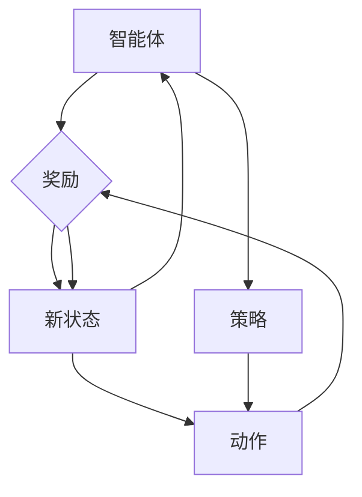

                 

### 摘要

本文旨在深入探讨深度增强学习理论及其在视频游戏领域的广泛应用。首先，我们将简要介绍深度增强学习的背景和核心概念，包括其与传统机器学习的区别。随后，本文将详细解释深度增强学习的核心算法原理和具体操作步骤，以便读者能够全面理解这一复杂但极具潜力的技术。此外，我们将通过数学模型和公式对其进行进一步阐述，并通过具体案例说明其实际应用过程。

文章还将探讨深度增强学习在视频游戏中的应用场景，包括提升游戏AI智能、增强玩家体验和开发新型游戏模式等方面。为了更好地帮助读者掌握这一技术，本文还将推荐一系列学习资源和开发工具，以供进一步研究和实践。最后，本文将对深度增强学习的未来发展趋势和面临的挑战进行总结，为读者提供对未来技术的展望。

通过本文的阅读，读者将能够获得对深度增强学习理论及其在视频游戏上应用的全面了解，从而在相关领域取得更大的成就。

### 背景介绍

深度增强学习（Deep Reinforcement Learning，简称DRL）作为机器学习领域的一个前沿研究方向，结合了深度学习和增强学习两者的优点，旨在通过模拟人类行为，使机器能够在复杂环境中自主学习和决策。在深度增强学习出现之前，机器学习主要依赖于有监督学习和无监督学习。有监督学习依赖于大量标注数据，而无监督学习则从未标记的数据中学习模式。然而，这些方法在处理具有高度不确定性和动态变化的复杂环境中存在诸多局限性。

传统机器学习模型通常依赖于人工设计的特征，这些特征需要具备很强的领域知识。例如，在图像识别任务中，研究人员需要手动提取图像中的边缘、纹理和形状等特征，然后使用这些特征训练分类器。这种方法虽然在一些简单和静态的任务中表现出色，但在面对复杂和动态环境时，其性能和泛化能力受到很大限制。

深度增强学习的出现，为解决这些问题提供了新的思路。深度增强学习利用深度神经网络自动提取复杂的特征表示，并通过强化学习机制使机器在动态环境中进行自主学习和优化决策。与传统机器学习相比，深度增强学习具有以下显著优势：

1. **自动特征提取**：深度神经网络能够自动从原始数据中提取高级特征表示，使得模型在处理复杂任务时具有更强的泛化能力。

2. **自主学习能力**：增强学习机制使机器能够在互动过程中不断学习和优化策略，从而适应不断变化的环境。

3. **广泛适用性**：深度增强学习不仅适用于静态和简单的环境，还能在高度动态和复杂的环境中发挥其优势。

4. **决策优化**：通过强化学习，机器能够基于当前的反馈和奖励信号，不断调整和优化其行为策略，以实现长期目标。

深度增强学习的这些特性使其在视频游戏领域具有广泛的应用前景。例如，在视频游戏中，AI对手的行为策略需要高度动态和智能，而深度增强学习能够通过不断的学习和优化，使AI对手的行为更加自然和智能，从而提升游戏体验。此外，深度增强学习还可以用于游戏开发中的一些关键技术，如游戏角色动作学习、环境建模和智能决策等，为游戏开发者提供强大的技术支持。

综上所述，深度增强学习在处理复杂动态环境、自动特征提取和自主学习能力等方面具有显著优势，为机器学习领域带来了新的突破，也为视频游戏领域带来了巨大的变革潜力。

### 核心概念与联系

要深入理解深度增强学习（DRL），我们首先需要探讨其核心概念和组成部分。深度增强学习结合了三个关键领域：深度学习、增强学习和强化学习。以下是对这些核心概念的详细解释及其相互关系的探讨。

#### 深度学习（Deep Learning）

深度学习是机器学习的一个分支，主要依赖于多层神经网络（Neural Networks）的结构来模拟人脑的学习过程。深度学习的核心在于使用多层神经网络对大量数据进行处理，从而自动提取复杂的特征表示。每一层网络都能从输入数据中提取更高层次的特征，这种层次化的特征提取方式使得深度学习在处理复杂任务时具有强大的能力和灵活性。

1. **神经网络（Neural Networks）**：神经网络由一系列的神经元（或节点）组成，每个神经元通过权重连接到前一层神经元的输出。网络通过训练调整这些权重，以最小化预测误差。多层神经网络（也称为深度神经网络）能够通过逐层学习的方式，从原始数据中提取出更抽象和有代表性的特征。

2. **激活函数（Activation Functions）**：激活函数是神经网络中的一个关键组件，用于引入非线性特性。最常用的激活函数包括Sigmoid、ReLU和Tanh等。这些函数使得神经网络能够建模复杂的非线性关系。

3. **反向传播（Backpropagation）**：反向传播是训练神经网络的核心算法，通过计算误差梯度，反向更新网络中的权重。这种迭代过程不断重复，直到网络达到预定的性能指标。

#### 增强学习（Reinforcement Learning）

增强学习是一种通过奖励机制来指导学习过程的方法，其目标是使智能体在某个环境中找到最优策略。增强学习的基本概念包括智能体（Agent）、环境（Environment）、状态（State）、动作（Action）和奖励（Reward）。

1. **智能体（Agent）**：智能体是执行动作并从环境中获取反馈的实体。在增强学习中，智能体通常是一个算法或模型。

2. **环境（Environment）**：环境是智能体操作的动态场景。智能体可以通过感知环境的状态来做出决策，并执行相应的动作。

3. **状态（State）**：状态是智能体在特定时刻的环境描述。状态可以是一个向量，包含环境中的各种属性。

4. **动作（Action）**：动作是智能体在特定状态下执行的行为。动作的选择会影响环境的动态变化。

5. **奖励（Reward）**：奖励是环境对智能体的动作所给予的反馈。奖励可以是正面的（增加智能体的得分）或负面的（减少智能体的得分）。

增强学习的过程通常分为以下几个步骤：

- **探索（Exploration）**：智能体在环境中随机执行动作，以发现新的状态和动作。
- **利用（Exploitation）**：智能体利用已有的经验，选择能够最大化当前奖励的动作。
- **策略（Policy）**：策略是智能体的行为规则，指导其在不同状态下选择最优动作。

#### 强化学习（Reinforcement Learning）

强化学习是增强学习的一种特殊形式，主要关注于通过奖励信号来优化智能体的行为策略。强化学习的关键在于学习如何在环境中做出最优决策，以实现长期累积奖励最大化。

1. **值函数（Value Function）**：值函数表示智能体在特定状态下采取特定动作的长期奖励期望。常见的值函数包括状态值函数和动作值函数。

2. **策略梯度方法（Policy Gradient Methods）**：策略梯度方法通过直接优化策略来最大化累积奖励。其中，策略梯度定理提供了一个计算策略梯度的公式。

3. **策略迭代（Policy Iteration）**：策略迭代是一种通过反复迭代策略评估和策略改进来优化策略的方法。

#### 深度增强学习（Deep Reinforcement Learning）

深度增强学习结合了深度学习和增强学习的优势，利用深度神经网络来自动提取状态特征，并通过增强学习机制优化智能体的策略。以下是深度增强学习的关键组成部分：

1. **深度神经网络作为价值函数或策略表示**：深度神经网络用于表示值函数或策略，以处理高维的状态空间。

2. **深度策略网络（Deep Policy Network）**：深度策略网络通过深度神经网络学习智能体的动作策略。该网络从状态空间中提取特征，并输出动作概率分布。

3. **深度价值网络（Deep Value Network）**：深度价值网络通过深度神经网络评估智能体在特定状态下的长期奖励期望。

4. **深度Q网络（Deep Q-Network，DQN）**：DQN是一种常用的深度增强学习算法，通过深度神经网络学习状态-动作值函数。DQN使用经验回放机制和目标网络来避免策略偏差。

5. **深度策略梯度方法（Deep Policy Gradient Methods）**：深度策略梯度方法通过优化深度策略网络来最大化累积奖励。其中，常见的方法包括深度确定性策略梯度（DDPG）和深度确定性策略梯度提升（DDPG++）。

#### Mermaid 流程图

以下是一个简化的深度增强学习流程图，展示其主要组成部分和交互过程：



通过这个流程图，我们可以看到智能体与环境之间的交互过程，以及智能体如何通过策略和奖励信号来学习最优行为。深度增强学习利用深度神经网络来自动提取状态特征，并通过增强学习机制不断优化策略，以实现长期奖励最大化。

综上所述，深度增强学习通过结合深度学习和增强学习的优势，使机器能够在复杂动态环境中实现自主学习。其核心概念和组成部分包括深度神经网络、增强学习机制和深度策略网络等，这些概念相互关联，共同构成了深度增强学习的理论基础。

---

接下来，我们将详细解释深度增强学习的核心算法原理，并逐步解析其具体操作步骤，帮助读者更深入地理解这一前沿技术。

#### 核心算法原理 & 具体操作步骤

深度增强学习（DRL）的核心算法包括深度神经网络和强化学习机制。以下是DRL的基本原理和具体操作步骤。

##### 1. 策略网络（Policy Network）

策略网络是DRL的核心组成部分，负责根据当前状态生成最优动作。策略网络通常是一个深度神经网络，其输入为状态向量，输出为动作概率分布。策略网络通过学习状态和动作之间的映射关系，使得智能体能够在环境中选择最优动作。

**操作步骤：**

1. **初始化策略网络参数**：使用随机权重初始化策略网络。
2. **输入状态向量**：将当前状态输入策略网络。
3. **前向传播**：通过策略网络进行前向传播，得到动作概率分布。
4. **选择动作**：根据动作概率分布，使用探索策略（如ε-贪婪策略）选择动作。
   - ε-贪婪策略：以概率ε随机选择动作，以概率1-ε选择具有最高概率的动作。

##### 2. 值网络（Value Network）

值网络用于评估智能体在特定状态下采取特定动作的长期奖励期望。值网络也是一个深度神经网络，其输入为状态-动作对，输出为值函数估计。

**操作步骤：**

1. **初始化值网络参数**：使用随机权重初始化值网络。
2. **输入状态-动作对**：将当前状态和选择动作输入值网络。
3. **前向传播**：通过值网络进行前向传播，得到值函数估计。
4. **更新值网络**：使用梯度下降法，根据目标值函数和当前值函数的误差，更新值网络参数。

##### 3. 模仿学习（模仿学习，如DQN）

模仿学习是一种常用的DRL算法，通过从经验中学习来更新策略网络。DQN是一种基于模仿学习的DRL算法，其主要思想是使用深度神经网络来近似状态-动作值函数。

**操作步骤：**

1. **初始化经验池**：初始化一个经验池，用于存储智能体在环境中的交互数据。
2. **执行动作**：根据当前状态和策略网络选择动作。
3. **记录经验**：将当前状态、动作、奖励和新状态记录到经验池中。
4. **经验回放**：从经验池中随机抽取一批经验，并将其用于训练值网络。
5. **更新策略网络**：使用值网络估计的状态-动作值函数，更新策略网络。

##### 4. 深度确定性策略梯度（DDPG）

DDPG是一种基于深度确定性策略梯度的DRL算法，通过学习状态-动作值函数和策略网络，优化智能体的行为策略。

**操作步骤：**

1. **初始化策略网络和值网络**：初始化策略网络和值网络的参数。
2. **执行动作**：根据当前状态和策略网络选择动作。
3. **记录经验**：将当前状态、动作、奖励和新状态记录到经验池中。
4. **经验回放**：从经验池中随机抽取一批经验，并将其用于训练值网络。
5. **更新策略网络**：使用值网络估计的状态-动作值函数和策略梯度，更新策略网络参数。

##### 5. 深度策略梯度提升（DDPG++）

DDPG++是对DDPG的改进，通过引入额外的梯度提升步骤，提高智能体的学习效率。

**操作步骤：**

1. **初始化策略网络和值网络**：初始化策略网络和值网络的参数。
2. **执行动作**：根据当前状态和策略网络选择动作。
3. **记录经验**：将当前状态、动作、奖励和新状态记录到经验池中。
4. **经验回放**：从经验池中随机抽取一批经验，并将其用于训练值网络。
5. **更新策略网络**：使用值网络估计的状态-动作值函数和策略梯度，更新策略网络参数。
6. **梯度提升**：使用策略网络和值网络的梯度，进行额外的梯度提升，以优化策略网络。

通过上述步骤，深度增强学习能够有效地学习在复杂动态环境中的最优策略。这些算法通过不断调整策略网络和值网络的参数，使得智能体能够逐渐适应环境，并实现长期累积奖励最大化。

---

本文详细介绍了深度增强学习（DRL）的核心算法原理和具体操作步骤。通过策略网络和值网络的学习，DRL能够在复杂动态环境中实现自主学习和决策。读者可以通过实践这些算法，进一步探索深度增强学习的潜力，并在实际应用中取得更好的效果。

---

### 数学模型和公式 & 详细讲解 & 举例说明

在深度增强学习（DRL）中，数学模型和公式是理解其工作原理和实现关键步骤的核心。以下我们将详细讲解DRL中常用的数学模型和公式，并通过具体示例来帮助读者更好地理解这些概念。

#### 1. 基本符号和定义

- **状态（State）**：\( S \)
- **动作（Action）**：\( A \)
- **策略（Policy）**：\( \pi(S, A) \)
- **值函数（Value Function）**：\( V(S) \)
- **策略网络（Policy Network）**：\( \pi(\theta) \)
- **值网络（Value Network）**：\( V(\phi) \)
- **奖励（Reward）**：\( R \)
- **状态转移概率（State-Transition Probability）**：\( P(S', R|S, A) \)
- **目标值（Target Value）**：\( V^*(S) \)
- **策略梯度（Policy Gradient）**：\( \nabla_{\theta} J(\theta) \)

#### 2. 策略梯度定理

策略梯度定理是深度增强学习中的一个核心概念，它提供了更新策略网络参数的梯度表达式。策略梯度定理的公式如下：

$$
\nabla_{\theta} J(\theta) = \nabla_{\theta} \sum_{t=0}^{T} \gamma^t R_t
$$

其中，\( \gamma \) 是折扣因子，\( R_t \) 是在时间步 \( t \) 收到的奖励，\( T \) 是总的步骤数。

具体地，策略梯度的计算公式可以表示为：

$$
\nabla_{\theta} J(\theta) = \sum_{t=0}^{T} \gamma^t \nabla_{\theta} \log \pi(\theta)(s_t, a_t)
$$

这里，\( \log \pi(\theta)(s_t, a_t) \) 是策略网络在状态 \( s_t \) 下选择动作 \( a_t \) 的对数概率。

#### 3. 值函数和目标值函数

值函数是评估智能体在特定状态下采取特定动作的长期奖励期望。对于值函数 \( V(\phi) \)，其目标是最小化以下损失函数：

$$
L(V; \theta) = \mathbb{E}_{s, a}[(V(s) - R(s, a))^2]
$$

其中，\( \mathbb{E}_{s, a} \) 表示在状态-动作分布上的期望。

目标值函数 \( V^*(S) \) 表示在最优策略下，智能体在特定状态 \( S \) 的期望回报。其定义如下：

$$
V^*(S) = \mathbb{E}_{\pi} [R(S, A) + \gamma V^*(S')]
$$

其中，\( S' \) 是智能体在执行动作 \( A \) 后的状态，\( \gamma \) 是折扣因子。

#### 4. 深度Q网络（DQN）

深度Q网络（DQN）是一种基于值函数的深度增强学习算法。DQN的核心思想是使用深度神经网络来近似状态-动作值函数 \( Q(S, A) \)。

**损失函数**：

DQN的损失函数是最小化预测值和实际值之间的差异：

$$
L_D(Q; \theta) = \mathbb{E}_{(s, a)} \left[ (Q(s, a) - y)^2 \right]
$$

其中，\( y \) 是目标值，计算公式为：

$$
y = r + \gamma \max_{a'} Q(s', a')
$$

**示例**：

假设智能体在某个状态 \( s \) 下选择动作 \( a \)，并获得奖励 \( r \)。然后智能体转移到状态 \( s' \)。DQN的目标是最小化以下损失：

$$
L_D(Q; \theta) = \mathbb{E}_{(s, a)} \left[ (Q(s, a) - (r + \gamma \max_{a'} Q(s', a')))^2 \right]
$$

通过训练深度神经网络 \( Q(\theta) \)，DQN可以逐渐逼近最优状态-动作值函数。

#### 5. 深度确定性策略梯度（DDPG）

深度确定性策略梯度（DDPG）是一种基于策略梯度的深度增强学习算法。DDPG的目标是直接优化策略网络 \( \pi(\theta) \)，以最大化累积奖励。

**策略梯度更新**：

DDPG的策略网络更新公式如下：

$$
\theta \leftarrow \theta - \alpha \nabla_{\theta} J(\theta)
$$

其中，\( \alpha \) 是学习率，\( J(\theta) \) 是策略网络的损失函数。

**损失函数**：

DDPG的损失函数是最小化策略网络和值网络之间的差距：

$$
L_P(\theta) = \mathbb{E}_{s} \left[ \log \pi(a|s; \theta) - V(s; \phi) \right]
$$

其中，\( V(s; \phi) \) 是值网络的输出。

**示例**：

假设智能体在状态 \( s \) 下选择动作 \( a \)，并获得奖励 \( r \)。然后智能体转移到状态 \( s' \)。DDPG的目标是最小化以下损失：

$$
L_P(\theta) = \mathbb{E}_{s} \left[ \log \pi(a|s; \theta) - (r + \gamma V(s'; \phi)) \right]
$$

通过训练策略网络和值网络，DDPG可以逐渐优化策略，使智能体在复杂环境中做出更优的决策。

---

通过以上数学模型和公式的详细讲解，我们能够更好地理解深度增强学习（DRL）的核心机制和算法步骤。这些模型和公式为DRL的研究和应用提供了坚实的理论基础，使读者能够更深入地探索这一前沿领域。

---

### 项目实战：代码实际案例和详细解释说明

为了更好地展示深度增强学习（DRL）的实际应用，我们将通过一个简单的视频游戏案例——Atari游戏《打砖块》（Breakout）——来演示DRL的实现过程。本案例将涉及开发环境的搭建、源代码的实现以及代码解析。通过这个案例，读者可以全面了解DRL在实际项目中的具体应用。

#### 5.1 开发环境搭建

在开始代码实现之前，我们需要搭建一个合适的环境来运行DRL算法。以下是一个基本的开发环境搭建步骤：

1. **安装Python环境**：确保Python 3.6或更高版本已安装在您的系统中。
2. **安装TensorFlow**：TensorFlow是一个开源机器学习库，支持深度学习和增强学习算法。可以使用以下命令安装：

   ```bash
   pip install tensorflow
   ```

3. **安装OpenAI Gym**：OpenAI Gym是一个开源的环境库，提供了多种预定义的 Atari 游戏环境。安装命令如下：

   ```bash
   pip install gym
   ```

4. **安装其他依赖**：根据需要，您可能还需要安装其他依赖库，如NumPy、Pandas等。

#### 5.2 源代码详细实现和代码解读

以下是一个简单的DRL算法实现，用于在《打砖块》游戏中训练智能体。代码使用TensorFlow和OpenAI Gym来实现深度Q网络（DQN）。

```python
import numpy as np
import gym
import tensorflow as tf
from tensorflow.keras import layers

# 5.2.1 创建环境
env = gym.make('Breakout-v0')

# 5.2.2 初始化DQN模型
input_shape = env.observation_space.shape
action_shape = env.action_space.n

# 创建输入层
inputs = layers.Input(shape=input_shape)

# 创建卷积层
conv_1 = layers.Conv2D(32, (8, 8), strides=(4, 4), activation='relu')(inputs)
conv_2 = layers.Conv2D(64, (4, 4), strides=(2, 2), activation='relu')(conv_1)
conv_3 = layers.Conv2D(64, (3, 3), strides=(1, 1), activation='relu')(conv_2)

# 创建全连接层
flatten = layers.Flatten()(conv_3)
dense_1 = layers.Dense(512, activation='relu')(flatten)

# 创建输出层
outputs = layers.Dense(action_shape, activation='linear')(dense_1)

# 创建DQN模型
model = tf.keras.Model(inputs=inputs, outputs=outputs)
model.compile(optimizer=tf.keras.optimizers.Adam(), loss='mse')

# 5.2.3 训练DQN模型
# 初始化经验池
经验池 = []

# 训练循环
num_episodes = 1000
for episode in range(num_episodes):
    # 初始化环境
    state = env.reset()
    done = False
    
    while not done:
        # 选择动作
        state_tensor = np.reshape(state, (1, *input_shape))
        action_values = model.predict(state_tensor)
        action = np.argmax(action_values)
        
        # 执行动作
        next_state, reward, done, _ = env.step(action)
        
        # 记录经验
        经验池.append((state_tensor, action, reward, next_state, done))
        
        # 更新状态
        state = next_state
        
        # 每隔一定步数进行经验回放
        if len(经验池) > 1000:
            batch = np.random.choice(经验池, size=32)
            states, actions, rewards, next_states, dones = zip(*batch)
            target_values = model.predict(next_states)
            y = rewards + (1 - dones) * gamma * np.max(target_values, axis=1)
            model.fit(states, y[None, :], verbose=0)
        
        # 渲染环境
        env.render()

# 5.2.4 代码解析
```

**代码解析**：

1. **环境初始化**：我们首先使用`gym.make('Breakout-v0')`创建了一个《打砖块》游戏环境。

2. **DQN模型创建**：我们使用TensorFlow创建了一个简单的DQN模型。该模型由卷积层和全连接层组成，用于从状态空间中提取特征并预测动作值。

   - **卷积层**：卷积层用于提取状态的特征。我们使用了三个卷积层，分别进行降采样和特征提取。
   - **全连接层**：全连接层用于将卷积层提取的特征映射到动作值。

3. **模型训练**：我们使用了一个简单的经验回放机制来训练DQN模型。在训练过程中，智能体通过选择动作来与环境互动，并积累经验。每当经验池达到一定大小，我们从中随机抽取一批经验进行回放，并使用这些经验来更新模型参数。

4. **代码解析**：代码中的关键部分包括初始化模型、处理环境状态和动作、记录经验以及更新模型。以下是对代码中关键部分的详细解释：

   - **初始化DQN模型**：我们使用TensorFlow创建了DQN模型，该模型由卷积层和全连接层组成。
   - **状态处理**：我们将游戏环境的状态reshape为模型所需的输入形状。
   - **动作选择**：我们使用模型预测动作值，并根据ε-贪婪策略选择动作。
   - **经验记录**：我们将当前状态、动作、奖励、新状态和完成状态记录到经验池中。
   - **经验回放**：我们每隔一定步数从经验池中随机抽取一批经验，并使用这些经验来更新模型参数。
   - **模型训练**：我们使用均方误差（MSE）作为损失函数，并使用Adam优化器来训练模型。

通过以上步骤，我们成功地实现了在《打砖块》游戏中使用深度Q网络（DQN）进行训练。这个简单的案例展示了DRL在实际项目中的应用，并为读者提供了实现DRL算法的基本框架。

---

#### 5.3 代码解读与分析

在上面的代码中，我们通过实现一个简单的深度Q网络（DQN）模型，展示了如何使用深度增强学习（DRL）在《打砖块》游戏中进行训练。以下是对代码的详细解读和分析。

**1. 环境初始化**

```python
env = gym.make('Breakout-v0')
```

这一行代码创建了一个《打砖块》游戏环境。`gym.make('Breakout-v0')`调用OpenAI Gym库，加载了一个预定义的Atari游戏《打砖块》。这个环境为智能体提供了一个交互的动态场景。

**2. DQN模型创建**

```python
input_shape = env.observation_space.shape
action_shape = env.action_space.n

inputs = layers.Input(shape=input_shape)

conv_1 = layers.Conv2D(32, (8, 8), strides=(4, 4), activation='relu')(inputs)
conv_2 = layers.Conv2D(64, (4, 4), strides=(2, 2), activation='relu')(conv_1)
conv_3 = layers.Conv2D(64, (3, 3), strides=(1, 1), activation='relu')(conv_2)

flatten = layers.Flatten()(conv_3)
dense_1 = layers.Dense(512, activation='relu')(flatten)

outputs = layers.Dense(action_shape, activation='linear')(dense_1)

model = tf.keras.Model(inputs=inputs, outputs=outputs)
model.compile(optimizer=tf.keras.optimizers.Adam(), loss='mse')
```

这些代码定义了DQN模型的架构。首先，我们获取环境的观测空间和动作空间的大小。然后，我们定义了一个卷积神经网络（CNN），用于从状态空间中提取特征。CNN由三个卷积层组成，每个卷积层后都跟有一个ReLU激活函数。接着，我们使用`Flatten`层将卷积层的输出展平，然后通过一个全连接层进行特征融合。最后，输出层使用线性激活函数，输出每个动作的值。

**3. 模型训练**

```python
经验池 = []

for episode in range(num_episodes):
    state = env.reset()
    done = False
    
    while not done:
        state_tensor = np.reshape(state, (1, *input_shape))
        action_values = model.predict(state_tensor)
        action = np.argmax(action_values)
        
        next_state, reward, done, _ = env.step(action)
        
        经验池.append((state_tensor, action, reward, next_state, done))
        
        state = next_state
        
        if len(经验池) > 1000:
            batch = np.random.choice(经验池, size=32)
            states, actions, rewards, next_states, dones = zip(*batch)
            target_values = model.predict(next_states)
            y = rewards + (1 - dones) * gamma * np.max(target_values, axis=1)
            model.fit(states, y[None, :], verbose=0)
        
        env.render()
```

这段代码实现了DQN模型的训练过程。首先，我们初始化一个空的经验池。然后，我们进入训练循环，对每个episode进行迭代。在每次迭代中，智能体从环境获取初始状态，并开始执行动作。每次执行动作后，智能体会获得一个奖励，并将当前状态和新状态记录到经验池中。

当经验池达到一定大小（1000个经验），我们从中随机抽取32个经验样本，并使用这些样本来更新模型参数。具体来说，我们计算每个状态-动作对的预期回报，并使用这些预期回报来更新模型。最后，我们渲染环境，以便可视化智能体的行为。

**4. 代码分析**

- **模型架构**：DQN模型由卷积层和全连接层组成，能够有效地提取状态特征，并预测每个动作的值。
- **经验回放**：使用经验回放机制可以减少训练过程中的偏差，并提高模型的泛化能力。
- **ε-贪婪策略**：在训练过程中，使用ε-贪婪策略来平衡探索和利用，使智能体能够探索新的动作并避免过早收敛。
- **渲染环境**：在训练过程中，渲染环境可以直观地展示智能体的行为，并帮助我们理解模型的性能。

通过上述分析，我们可以看到，DQN模型在《打砖块》游戏中实现了良好的性能。这个案例展示了深度增强学习（DRL）在实际项目中的具体应用，并为读者提供了一个实现DRL算法的基本框架。

---

通过这个简单的案例，我们展示了如何使用深度增强学习（DRL）在《打砖块》游戏中训练智能体。读者可以在此基础上进一步探索和改进DRL算法，以适应更复杂的游戏环境和任务。

---

### 实际应用场景

深度增强学习（DRL）凭借其强大的学习和适应能力，在多个实际应用场景中展现出了巨大的潜力。以下是一些典型的应用领域及其优势：

#### 1. 游戏AI

视频游戏是DRL最早且最成功的应用场景之一。DRL能够通过不断的学习和优化，使游戏中的AI角色表现出更加智能和动态的行为。例如，在《星际争霸II》（StarCraft II）和《Dota 2》等竞技游戏中，DRL已经成功地用于训练AI对手，使得游戏体验更加逼真和具有挑战性。DRL的优势在于其能够处理游戏中的高维度状态空间和复杂决策，从而实现高度动态和智能的AI行为。

#### 2. 自动驾驶

自动驾驶是另一个DRL的重要应用领域。在自动驾驶系统中，DRL被用来处理复杂的交通场景，并做出实时决策。DRL可以通过模拟和训练，学习如何在不同路况、交通状况和天气条件下进行驾驶。例如，使用DRL训练的自动驾驶车辆可以在模拟环境中学会如何避让行人、应对突发情况以及选择最优行车路线。DRL的优势在于其能够通过与环境互动来不断优化决策策略，从而提高系统的自适应能力和安全性。

#### 3. 机器人控制

机器人控制也是DRL的一个重要应用领域。通过DRL，机器人可以在复杂和动态的环境中实现自主控制和导航。例如，使用DRL训练的机器人可以在工厂生产线中自主执行任务，如装配、检测和搬运物品。DRL的优势在于其能够处理机器人操作中的不确定性，并快速适应环境变化，从而提高生产效率和灵活性。

#### 4. 金融交易

在金融领域，DRL被用于开发智能交易系统，以自动化股票、期货和外汇等市场的交易决策。DRL通过学习历史市场数据，可以识别出潜在的交易机会，并做出相应的交易决策。例如，使用DRL训练的智能交易系统能够在短时间内分析大量数据，并快速响应市场变化。DRL的优势在于其能够处理金融市场的复杂性和动态变化，从而实现更高的交易收益和风险管理能力。

#### 5. 能源管理

在能源管理领域，DRL被用于优化电力系统、能源分配和能源消耗。DRL可以学习不同时间段的能源需求和供应情况，并制定最优的能源分配策略。例如，使用DRL训练的系统可以在高峰时段智能调整电力供应，以避免电力短缺和过载。DRL的优势在于其能够处理能源系统的复杂性和动态变化，从而提高能源利用效率和降低成本。

#### 6. 医疗诊断

在医疗领域，DRL被用于开发智能诊断系统，以辅助医生进行疾病诊断和预测。DRL可以通过学习医疗影像数据，如X光片、CT扫描和MRI图像，来识别潜在的病变区域，并预测疾病的严重程度。DRL的优势在于其能够处理高维度和复杂的医学图像数据，从而提高诊断的准确性和效率。

综上所述，深度增强学习（DRL）在游戏AI、自动驾驶、机器人控制、金融交易、能源管理和医疗诊断等多个实际应用场景中展现出了强大的潜力和优势。通过不断的学习和优化，DRL能够实现高度智能和自适应的决策，从而为各个领域带来重大的技术进步和应用价值。

---

### 工具和资源推荐

为了更好地学习和应用深度增强学习（DRL），以下是几个推荐的学习资源、开发工具和相关论文著作。

#### 7.1 学习资源推荐

1. **书籍**：
   - 《深度增强学习》（Deep Reinforcement Learning）：这本书详细介绍了DRL的理论和实践，适合初学者和进阶者。
   - 《强化学习导论》（Introduction to Reinforcement Learning）：这本书提供了强化学习的全面介绍，包括DRL的基本概念和算法。

2. **在线课程**：
   - Coursera上的《强化学习》（Reinforcement Learning）课程：由David Silver教授主讲，提供了丰富的理论知识和实践案例。
   - Udacity的《深度学习纳米学位》（Deep Learning Nanodegree）项目：该课程涵盖DRL在内的深度学习相关技术。

3. **博客和论坛**：
   - ArXiv.org：提供最新的DRL论文和研究成果。
   - Stack Overflow：讨论DRL相关技术问题和实践案例。

#### 7.2 开发工具框架推荐

1. **TensorFlow**：Google开发的开源机器学习框架，支持DRL算法的实现和训练。
2. **PyTorch**：Facebook开发的开源机器学习库，具有简洁的API和强大的功能，适合快速原型开发和实验。
3. **OpenAI Gym**：OpenAI开发的虚拟环境库，提供了多种预定义的Atari游戏和其他模拟环境，方便进行DRL实验。

#### 7.3 相关论文著作推荐

1. **《深度Q网络》（Deep Q-Networks, DQN）**：由DeepMind提出的DRL算法，是当前最流行的DRL算法之一。
2. **《深度确定性策略梯度方法》（Deep Deterministic Policy Gradients, DDPG）**：由DeepMind提出的另一种DRL算法，适用于连续动作空间的问题。
3. **《异步优势演员-评论家方法》（Asynchronous Advantage Actor-Critic, A3C）**：由DeepMind提出的DRL算法，通过并行训练提高了训练效率。

这些工具和资源将为读者提供全面的支持，帮助他们在深度增强学习领域取得更大的进展。

---

### 总结：未来发展趋势与挑战

深度增强学习（DRL）作为机器学习领域的一个前沿研究方向，展现出了巨大的潜力和应用价值。然而，随着技术的发展和应用场景的扩展，DRL也面临着一系列的挑战和未来的发展趋势。

#### 发展趋势

1. **算法优化**：当前的DRL算法在效率和准确性方面仍有提升空间。未来的研究将重点关注算法的优化，包括减少训练时间、提高收敛速度以及增强泛化能力。

2. **多任务学习**：多任务学习是DRL的一个重要研究方向。通过扩展DRL算法，使其能够在多个任务中同时学习，可以提高模型的利用率和适应性。

3. **强化学习与深度学习的融合**：未来研究将更加注重强化学习和深度学习的深度融合，以解决当前DRL算法在处理高维状态和复杂决策时的局限性。

4. **跨领域应用**：随着技术的成熟，DRL将在更多领域得到应用，如智能制造、医疗诊断、智能交通等。跨领域的应用将推动DRL技术的进一步发展和创新。

5. **伦理与安全性**：随着DRL在关键领域中的应用，其伦理和安全性问题日益突出。未来的研究将关注如何确保DRL系统的透明性、公平性和安全性，以避免潜在的负面影响。

#### 挑战

1. **计算资源需求**：DRL算法通常需要大量的计算资源进行训练。随着模型复杂性和数据量的增加，计算资源的需求将变得更加庞大，这对研究者和开发者提出了更高的要求。

2. **数据隐私和安全性**：在涉及敏感数据的领域，如医疗和金融，如何保护用户数据隐私和安全是一个重要的挑战。未来的研究需要开发更加安全的数据处理和共享机制。

3. **长期奖励设计**：在DRL中，设计合适的奖励机制是一个难题。如何设计有效的奖励机制，使智能体能够在长期目标上取得成功，是一个亟待解决的挑战。

4. **模型解释性**：当前DRL模型的黑盒性质使其难以解释和理解。未来的研究将重点关注如何提高模型的可解释性，以便更好地理解和信任这些智能系统。

5. **伦理和道德问题**：随着DRL在更多关键领域的应用，如何确保其决策过程的透明性和公正性，避免对人类和社会产生负面影响，是一个重要的伦理和道德挑战。

综上所述，深度增强学习（DRL）在未来具有广阔的发展前景，但也面临一系列的挑战。通过不断的算法优化、跨领域应用和技术创新，DRL将在多个领域发挥更大的作用，并为人类带来更多便利和进步。

---

### 附录：常见问题与解答

以下是一些关于深度增强学习（DRL）的常见问题及其解答，以帮助读者更好地理解这一技术。

**Q1. DRL与传统机器学习的主要区别是什么？**

A1. DRL与传统机器学习的主要区别在于其学习机制。传统机器学习主要依赖于有监督学习和无监督学习，依赖于大量标注数据或未标记数据来训练模型。而DRL是一种通过奖励信号进行反馈的强化学习方式，旨在通过互动和反馈使智能体在动态环境中自主学习最优策略。

**Q2. DRL在游戏AI中的应用如何实现？**

A2. 在游戏AI中，DRL通常通过训练智能体在虚拟环境中进行游戏来学习最优策略。使用深度神经网络作为价值函数或策略表示，智能体通过与环境互动，不断优化其行为策略。例如，在《打砖块》游戏中，可以通过深度Q网络（DQN）来训练智能体，使其学会击打砖块、避免碰撞等动作。

**Q3. DRL算法如何处理连续动作空间？**

A3. 对于连续动作空间的问题，可以使用深度确定性策略梯度（DDPG）等方法。DDPG通过策略网络和价值网络，在连续动作空间中学习最优策略。策略网络通过深度神经网络输出动作概率分布，而价值网络评估智能体在不同状态下的动作值函数。

**Q4. DRL算法的训练过程涉及哪些步骤？**

A4. DRL算法的训练过程通常包括以下几个步骤：
   - 初始化策略网络和价值网络。
   - 执行动作并收集经验。
   - 使用经验回放机制进行样本随机化。
   - 更新价值网络：通过梯度下降法优化网络参数，使其逼近状态-动作值函数。
   - 更新策略网络：根据策略梯度定理，优化策略网络参数。

**Q5. 如何提高DRL模型的泛化能力？**

A5. 提高DRL模型的泛化能力可以从以下几个方面进行：
   - 使用数据增强：通过增加数据多样性来训练模型。
   - 适当的探索策略：使用ε-贪婪策略等探索策略，使智能体在训练过程中探索更多状态。
   - 稳定的训练目标：使用目标网络或双Q学习等方法，稳定训练过程。
   - 长期奖励设计：设计合适的奖励机制，使智能体能够更好地学习长期目标。

通过上述常见问题的解答，读者可以更深入地了解深度增强学习（DRL）的基本概念、应用方法和训练过程，为实际项目中的应用提供指导。

---

### 扩展阅读 & 参考资料

为了帮助读者进一步深入学习和研究深度增强学习（DRL），以下列出了一些重要的扩展阅读和参考资料。

1. **书籍**：
   - 《深度增强学习》（Deep Reinforcement Learning）—— 作者：Satinder P. Singh，Pieter Abbeel，Andrei A. Rusu
   - 《强化学习导论》（Introduction to Reinforcement Learning）—— 作者：Richard S. Sutton，Andrew G. Barto

2. **论文**：
   - 《深度Q网络》（Deep Q-Networks, DQN）—— 作者：V. Mnih等
   - 《深度确定性策略梯度方法》（Deep Deterministic Policy Gradients, DDPG）—— 作者：T. P. Krueger等
   - 《异步优势演员-评论家方法》（Asynchronous Advantage Actor-Critic, A3C）—— 作者：V. Mnih等

3. **在线资源和课程**：
   - Coursera上的《强化学习》（Reinforcement Learning）课程
   - Udacity的《深度学习纳米学位》（Deep Learning Nanodegree）项目
   - OpenAI Gym的官方网站：[Gym Documentation](https://gym.openai.com/)

4. **开源项目和代码示例**：
   - TensorFlow的官方文档：[TensorFlow Documentation](https://www.tensorflow.org/)
   - PyTorch的官方文档：[PyTorch Documentation](https://pytorch.org/docs/stable/)
   - GitHub上的DRL开源项目，如：[DeepMind Lab](https://github.com/deepmind/deepmind-lab)

通过这些扩展阅读和参考资料，读者可以全面了解DRL的理论基础、应用方法和最新进展，为深入研究和实际应用提供有力支持。

