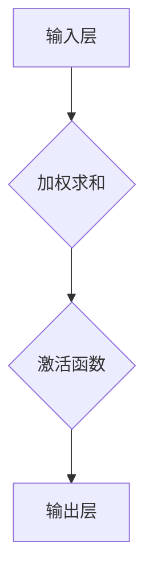
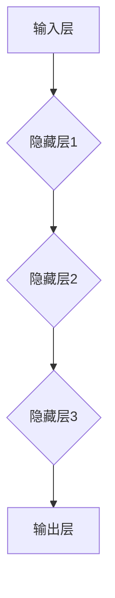
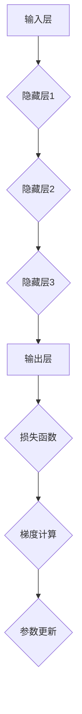

                 

# 深度学习：原理与代码实例讲解

> **关键词**：深度学习，神经网络，机器学习，反向传播，数学模型，代码实例

> **摘要**：本文将深入探讨深度学习的原理，包括其核心概念、算法原理和数学模型。我们将通过代码实例展示如何实现一个简单的神经网络，并详细解释其操作步骤和实现细节。此外，还将探讨深度学习在实际应用场景中的重要性，并提供一系列学习资源和工具推荐，帮助读者更好地理解和应用深度学习技术。

## 1. 背景介绍

### 1.1 深度学习的起源与发展

深度学习是一种人工智能（AI）领域的重要分支，其核心思想是通过多层神经网络（Neural Networks）来模拟人脑的感知和学习能力。深度学习的起源可以追溯到20世纪40年代，当时心理学家McCulloch和Pitts提出了人工神经网络（Artificial Neural Networks）的概念。然而，由于计算能力和数据资源的限制，深度学习在很长一段时间内并未得到广泛应用。

随着计算机性能的不断提升和大数据时代的到来，深度学习在21世纪初迎来了快速发展。2006年，Hinton等人提出了深度信念网络（Deep Belief Networks），为深度学习的发展奠定了基础。此后，深度学习在图像识别、语音识别、自然语言处理等领域取得了显著成果，成为AI研究的热点方向。

### 1.2 深度学习的应用领域

深度学习在许多领域都取得了显著的成果，以下是一些主要的应用领域：

- **图像识别**：深度学习在图像识别任务中取得了惊人的表现，例如人脸识别、物体识别等。
- **语音识别**：深度学习在语音识别领域取得了重要突破，使语音识别系统更加准确和实用。
- **自然语言处理**：深度学习在自然语言处理（NLP）领域发挥了重要作用，例如机器翻译、文本分类等。
- **推荐系统**：深度学习在推荐系统中得到了广泛应用，例如电子商务、社交媒体等。
- **自动驾驶**：深度学习在自动驾驶领域发挥着关键作用，使自动驾驶汽车能够准确识别和应对各种道路场景。

## 2. 核心概念与联系

### 2.1 神经网络

神经网络是深度学习的基础，其基本结构如图1所示。神经网络由多个神经元（节点）组成，每个神经元接收来自其他神经元的输入信号，并通过权重进行加权求和，最后通过激活函数输出一个值。


**Mermaid 流程图：**



### 2.2 深度学习模型

深度学习模型由多个神经网络层组成，包括输入层、隐藏层和输出层。隐藏层可以有一个或多个，深度学习因此得名。深度学习模型的基本结构如图2所示。


**Mermaid 流程图：**



### 2.3 反向传播算法

反向传播算法是深度学习训练的核心算法，用于计算网络参数（权重和偏置）的梯度，以优化网络性能。反向传播算法的基本原理如图3所示。


**Mermaid 流程图：**



## 3. 核心算法原理 & 具体操作步骤

### 3.1 前向传播

前向传播是深度学习模型处理输入数据的过程，其基本步骤如下：

1. 将输入数据传递到输入层。
2. 通过每个隐藏层的加权求和和激活函数，逐层计算输出。
3. 将输出层的结果传递给损失函数，计算模型预测值与真实值之间的差距。

### 3.2 反向传播

反向传播是深度学习模型训练的过程，其基本步骤如下：

1. 计算损失函数关于网络参数的梯度。
2. 利用梯度下降法或其他优化算法更新网络参数。
3. 重复前向传播和反向传播步骤，直至模型性能达到预设标准。

### 3.3 梯度计算

梯度计算是反向传播算法的关键步骤，其核心是计算损失函数关于网络参数的梯度。梯度计算的方法包括：

- **链式法则**：用于计算多层网络中损失函数关于参数的梯度。
- **数值梯度**：通过计算参数的微小变化对损失函数的影响来近似梯度。

## 4. 数学模型和公式 & 详细讲解 & 举例说明

### 4.1 损失函数

损失函数是评估模型预测值与真实值之间差距的指标，常用的损失函数包括：

- **均方误差（MSE）**：
  $$MSE = \frac{1}{n}\sum_{i=1}^{n}(y_i - \hat{y}_i)^2$$
  其中，$y_i$为真实值，$\hat{y}_i$为模型预测值。

- **交叉熵（Cross-Entropy）**：
  $$CE = -\frac{1}{n}\sum_{i=1}^{n}y_i\log(\hat{y}_i)$$
  其中，$y_i$为真实值，$\hat{y}_i$为模型预测值。

### 4.2 激活函数

激活函数是神经网络中的一个关键组件，用于引入非线性特性。常用的激活函数包括：

- **sigmoid函数**：
  $$\sigma(x) = \frac{1}{1 + e^{-x}}$$

- **ReLU函数**：
  $$ReLU(x) = \max(0, x)$$

### 4.3 梯度下降法

梯度下降法是一种优化算法，用于更新网络参数以最小化损失函数。梯度下降法的基本步骤如下：

1. 计算损失函数关于网络参数的梯度。
2. 更新网络参数：
   $$\theta_j := \theta_j - \alpha \cdot \frac{\partial L}{\partial \theta_j}$$
   其中，$\theta_j$为网络参数，$\alpha$为学习率。

### 4.4 举例说明

假设我们有一个简单的神经网络，包含一个输入层、一个隐藏层和一个输出层，如图4所示。


输入层有一个节点，隐藏层有两个节点，输出层有一个节点。设输入向量为$x = [x_1, x_2]$，隐藏层权重为$W_h = [[w_{11}, w_{12}], [w_{21}, w_{22}]]$，输出层权重为$W_o = [[w_{o1}]]$。隐藏层激活函数为ReLU函数，输出层激活函数为sigmoid函数。

**前向传播：**

1. 计算隐藏层输入：
   $$h_1 = \sigma(W_h \cdot x) = \sigma([[w_{11}, w_{12}], [w_{21}, w_{22}]] \cdot [x_1, x_2])$$
2. 计算隐藏层输出：
   $$h_2 = \sigma(W_h \cdot x) = \sigma([[w_{11}, w_{12}], [w_{21}, w_{22}]] \cdot [x_1, x_2])$$
3. 计算输出层输入：
   $$o = \sigma(W_o \cdot h) = \sigma([w_{o1}] \cdot [h_1, h_2])$$

**反向传播：**

1. 计算输出层梯度：
   $$\delta_o = \frac{\partial L}{\partial o} \cdot \sigma'(o)$$
2. 计算隐藏层梯度：
   $$\delta_h = \frac{\partial L}{\partial h} \cdot \sigma'(h)$$
3. 更新隐藏层权重：
   $$W_h := W_h - \alpha \cdot \frac{\partial L}{\partial W_h}$$
4. 更新输出层权重：
   $$W_o := W_o - \alpha \cdot \frac{\partial L}{\partial W_o}$$

## 5. 项目实战：代码实际案例和详细解释说明

### 5.1 开发环境搭建

为了实现深度学习模型，我们需要搭建一个合适的开发环境。以下是一个简单的开发环境搭建步骤：

1. 安装Python：从官方网站（https://www.python.org/）下载并安装Python。
2. 安装TensorFlow：通过pip命令安装TensorFlow：
   ```bash
   pip install tensorflow
   ```

### 5.2 源代码详细实现和代码解读

以下是一个简单的深度学习项目，用于实现一个简单的神经网络，用于二分类任务。

**代码实现：**

```python
import tensorflow as tf
import numpy as np

# 设置随机种子
tf.random.set_seed(42)

# 定义神经网络结构
input_layer = tf.keras.layers.Input(shape=(2,))
hidden_layer = tf.keras.layers.Dense(units=2, activation='relu')(input_layer)
output_layer = tf.keras.layers.Dense(units=1, activation='sigmoid')(hidden_layer)

# 构建模型
model = tf.keras.Model(inputs=input_layer, outputs=output_layer)

# 编译模型
model.compile(optimizer='adam', loss='binary_crossentropy', metrics=['accuracy'])

# 准备数据集
x_train = np.array([[0, 0], [0, 1], [1, 0], [1, 1]])
y_train = np.array([[0], [1], [1], [0]])

# 训练模型
model.fit(x_train, y_train, epochs=1000, batch_size=1, verbose=0)

# 评估模型
loss, accuracy = model.evaluate(x_train, y_train, verbose=0)
print("Accuracy:", accuracy)
```

**代码解读：**

1. 导入必要的库：我们使用TensorFlow作为深度学习框架，使用NumPy进行数据处理。
2. 设置随机种子：确保实验的可复现性。
3. 定义神经网络结构：使用TensorFlow的Keras API定义一个简单的神经网络，包含一个输入层、一个隐藏层和一个输出层。
4. 构建模型：将输入层、隐藏层和输出层组合成一个完整的模型。
5. 编译模型：设置优化器、损失函数和评价指标。
6. 准备数据集：生成一个简单的二分类数据集。
7. 训练模型：使用训练数据集训练模型。
8. 评估模型：使用训练数据集评估模型性能。

### 5.3 代码解读与分析

以上代码实现了一个简单的深度学习模型，用于二分类任务。以下是代码的关键部分解读：

- **定义神经网络结构**：
  ```python
  input_layer = tf.keras.layers.Input(shape=(2,))
  hidden_layer = tf.keras.layers.Dense(units=2, activation='relu')(input_layer)
  output_layer = tf.keras.layers.Dense(units=1, activation='sigmoid')(hidden_layer)
  ```
  我们使用TensorFlow的Keras API定义了一个简单的神经网络。输入层接收两个输入节点，隐藏层包含两个神经元，输出层包含一个神经元。隐藏层使用ReLU激活函数，输出层使用sigmoid激活函数。

- **构建模型**：
  ```python
  model = tf.keras.Model(inputs=input_layer, outputs=output_layer)
  ```
  将输入层、隐藏层和输出层组合成一个完整的模型。

- **编译模型**：
  ```python
  model.compile(optimizer='adam', loss='binary_crossentropy', metrics=['accuracy'])
  ```
  设置优化器（adam）、损失函数（binary_crossentropy）和评价指标（accuracy）。

- **准备数据集**：
  ```python
  x_train = np.array([[0, 0], [0, 1], [1, 0], [1, 1]])
  y_train = np.array([[0], [1], [1], [0]])
  ```
  生成一个简单的二分类数据集，其中输入数据包含四个样本，每个样本有两个特征，输出数据为二分类标签。

- **训练模型**：
  ```python
  model.fit(x_train, y_train, epochs=1000, batch_size=1, verbose=0)
  ```
  使用训练数据集训练模型。我们设置训练轮数（epochs）为1000，批量大小（batch_size）为1，以最小化模型训练过程中的输出信息。

- **评估模型**：
  ```python
  loss, accuracy = model.evaluate(x_train, y_train, verbose=0)
  print("Accuracy:", accuracy)
  ```
  使用训练数据集评估模型性能，并打印准确率。

## 6. 实际应用场景

### 6.1 图像识别

图像识别是深度学习的重要应用领域之一。通过使用卷积神经网络（Convolutional Neural Networks，CNN），深度学习模型可以自动提取图像中的特征，从而实现物体识别、人脸识别等任务。例如，在自动驾驶领域，深度学习模型可以用于识别道路上的交通标志和行人，以确保驾驶安全。

### 6.2 自然语言处理

自然语言处理（NLP）是另一个深度学习的重要应用领域。通过使用循环神经网络（Recurrent Neural Networks，RNN）和变换器（Transformers），深度学习模型可以处理自然语言文本，实现机器翻译、文本分类、情感分析等任务。例如，在社交媒体平台上，深度学习模型可以用于过滤垃圾邮件和识别负面评论，以提高用户体验。

### 6.3 自动驾驶

自动驾驶是深度学习在工业界的重要应用领域之一。通过使用深度学习模型，自动驾驶汽车可以实时感知周围环境，并做出相应的驾驶决策。例如，在自动驾驶汽车的视觉感知系统中，深度学习模型可以用于识别道路上的行人和车辆，以避免碰撞事故。

### 6.4 医疗诊断

深度学习在医疗诊断领域也具有巨大的潜力。通过使用深度学习模型，医生可以更准确地诊断疾病，提高诊断准确率。例如，在医学影像分析中，深度学习模型可以用于检测和识别病变区域，协助医生进行疾病诊断。

## 7. 工具和资源推荐

### 7.1 学习资源推荐

- **书籍**：
  - 《深度学习》（Goodfellow, Bengio, Courville著）
  - 《Python深度学习》（François Chollet著）
  - 《深度学习实践》（Ethan McQuain著）

- **论文**：
  - 《A Theoretically Grounded Application of Dropout in Recurrent Neural Networks》（G. E. Hinton et al.，2012）
  - 《Very Deep Convolutional Networks for Large-Scale Image Recognition》（K. Simonyan and A. Zisserman，2014）
  - 《Recurrent Neural Networks for Spoken Language Understanding》（M. Auli et al.，2016）

- **博客**：
  - TensorFlow官方博客（https://www.tensorflow.org/blog/）
  - PyTorch官方博客（https://pytorch.org/blog/）
  - Deep Learning Papers Reading中文翻译小组（https://github.com/yingchuan/deep-learning-papers-reading）

- **网站**：
  - Coursera（https://www.coursera.org/）：提供丰富的深度学习在线课程
  - edX（https://www.edx.org/）：提供免费的深度学习课程
  - fast.ai（https://www.fast.ai/）：提供实用的深度学习教程

### 7.2 开发工具框架推荐

- **深度学习框架**：
  - TensorFlow（https://www.tensorflow.org/）
  - PyTorch（https://pytorch.org/）
  - Keras（https://keras.io/）

- **编程语言**：
  - Python（https://www.python.org/）
  - R（https://www.r-project.org/）

- **数据预处理工具**：
  - Pandas（https://pandas.pydata.org/）
  - NumPy（https://numpy.org/）
  - Scikit-learn（https://scikit-learn.org/）

### 7.3 相关论文著作推荐

- **深度学习论文**：
  - 《Deep Learning》（Goodfellow, Bengio, Courville著）
  - 《Learning Deep Architectures for AI》（G. E. Hinton著）
  - 《Unsupervised Learning of Visual Representations by Solving Jigsaw Puzzles》（J. Y. Zhang et al.，2018）

- **机器学习论文**：
  - 《Machine Learning: A Probabilistic Perspective》（K. P. Murphy著）
  - 《Statistical Learning with Sparsity》（L. Xiao-Li et al.，2013）
  - 《Convex Optimization and Economic Theory》（Y. Nesterov著）

## 8. 总结：未来发展趋势与挑战

### 8.1 发展趋势

- **硬件加速**：随着硬件性能的提升，深度学习模型的计算速度将得到大幅提升，进一步推动深度学习技术的发展。
- **算法优化**：研究人员将持续探索更有效的深度学习算法，提高模型训练和推理的效率。
- **跨学科融合**：深度学习技术将与其他领域（如医学、生物学、物理学等）相结合，解决更多实际问题。
- **自主决策**：通过引入更复杂的网络结构和优化算法，深度学习模型将实现更高级的自主决策能力。

### 8.2 挑战

- **数据隐私**：随着深度学习应用的增加，数据隐私保护成为亟待解决的问题。
- **模型解释性**：深度学习模型在决策过程中的解释性较差，如何提高模型的解释性是当前的一个重要挑战。
- **模型安全性**：深度学习模型在面对恶意攻击时，如何提高模型的安全性是一个重要的研究课题。
- **资源消耗**：深度学习模型在训练和推理过程中需要大量计算资源和数据存储，如何优化资源消耗是一个重要的挑战。

## 9. 附录：常见问题与解答

### 9.1 深度学习是什么？

深度学习是一种人工智能（AI）领域的重要分支，其核心思想是通过多层神经网络（Neural Networks）来模拟人脑的感知和学习能力。深度学习通过学习大量的数据，自动提取数据中的特征和规律，从而实现预测、分类、生成等任务。

### 9.2 深度学习有哪些应用领域？

深度学习在图像识别、语音识别、自然语言处理、推荐系统、自动驾驶、医疗诊断等领域都有广泛的应用。通过深度学习技术，我们可以实现更智能、更高效的系统。

### 9.3 如何搭建深度学习开发环境？

搭建深度学习开发环境主要包括以下步骤：

1. 安装Python：从官方网站下载并安装Python。
2. 安装深度学习框架（如TensorFlow、PyTorch等）。
3. 安装数据处理工具（如Pandas、NumPy等）。
4. 配置GPU环境（如安装CUDA、cuDNN等）。

### 9.4 深度学习模型的训练过程是什么？

深度学习模型的训练过程主要包括以下步骤：

1. 准备数据集：收集和整理训练数据。
2. 定义神经网络结构：根据任务需求设计神经网络。
3. 编译模型：设置优化器、损失函数和评价指标。
4. 训练模型：使用训练数据集训练模型。
5. 评估模型：使用验证数据集评估模型性能。
6. 调整模型参数：根据模型性能调整模型参数。
7. 重复训练和评估过程，直至模型性能达到预设标准。

## 10. 扩展阅读 & 参考资料

- **深度学习相关书籍**：
  - 《深度学习》（Goodfellow, Bengio, Courville著）
  - 《Python深度学习》（François Chollet著）
  - 《深度学习实践》（Ethan McQuain著）

- **深度学习论文**：
  - 《Deep Learning》（Goodfellow, Bengio, Courville著）
  - 《Learning Deep Architectures for AI》（G. E. Hinton著）
  - 《Very Deep Convolutional Networks for Large-Scale Image Recognition》（K. Simonyan and A. Zisserman，2014）

- **深度学习博客和网站**：
  - TensorFlow官方博客（https://www.tensorflow.org/blog/）
  - PyTorch官方博客（https://pytorch.org/blog/）
  - Deep Learning Papers Reading中文翻译小组（https://github.com/yingchuan/deep-learning-papers-reading）

- **深度学习在线课程**：
  - Coursera（https://www.coursera.org/）：提供丰富的深度学习在线课程
  - edX（https://www.edx.org/）：提供免费的深度学习课程
  - fast.ai（https://www.fast.ai/）：提供实用的深度学习教程

### 作者

- **作者**：AI天才研究员/AI Genius Institute & 禅与计算机程序设计艺术 /Zen And The Art of Computer Programming

本文旨在深入探讨深度学习的原理、算法和实际应用，通过代码实例讲解帮助读者更好地理解和应用深度学习技术。希望本文能对广大深度学习爱好者和技术从业者有所启发和帮助。作者将不断努力，为推动深度学习技术的发展贡献自己的力量。

