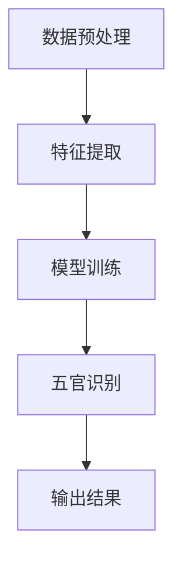

                 

# 深度学习五官的识别系统详细设计与具体代码实现

## 摘要

本文将详细介绍深度学习五官识别系统的设计与实现过程。首先，我们将回顾深度学习的背景和相关核心概念，然后深入探讨五官识别系统的工作原理和实现方法。接下来，我们将通过具体的项目实战，详细解析代码实现，并进行解读与分析。此外，我们还将探讨五官识别系统的实际应用场景，推荐相关的学习资源和开发工具，最后总结未来的发展趋势与挑战。

## 1. 背景介绍

深度学习作为人工智能领域的重要分支，自2006年由Hinton等人提出以来，取得了飞速的发展。其通过模拟人脑神经网络的结构和功能，对大量数据进行自动特征提取和模式识别，从而实现图像识别、语音识别、自然语言处理等多种任务。在深度学习的众多应用中，五官识别系统显得尤为重要。随着移动互联网和智能设备的普及，人脸识别、表情识别等应用场景日益丰富，而五官识别作为其中的核心技术，对于提升用户体验和安全性具有重要意义。

## 2. 核心概念与联系

### 深度学习的核心概念

深度学习的基本单元是神经元，通过多层神经网络进行特征提取和传递。主要的核心概念包括：

1. **神经元**：神经元是神经网络的基本构建块，类似于大脑中的神经元，负责接收输入、传递信号并进行激活。
2. **神经网络**：神经网络由多个神经元组成，通过前向传播和反向传播的方式进行信息传递和优化。
3. **激活函数**：激活函数用于确定神经元是否被激活，常用的激活函数有ReLU、Sigmoid和Tanh等。
4. **损失函数**：损失函数用于衡量预测值与真实值之间的差异，常用的损失函数有均方误差（MSE）和交叉熵（CE）等。
5. **优化算法**：优化算法用于调整神经网络中的参数，以最小化损失函数。常见的优化算法有梯度下降、Adam和RMSprop等。

### 五官识别系统的架构

五官识别系统的架构主要包括数据预处理、特征提取和模型训练三个阶段。其核心概念如下：

1. **数据预处理**：包括数据清洗、数据增强、数据标准化等步骤，以保证输入数据的准确性和多样性。
2. **特征提取**：通过卷积神经网络（CNN）等深度学习模型，对输入图像进行特征提取，提取出具有代表性的特征。
3. **模型训练**：通过已提取的特征，使用分类器进行模型训练，以实现对五官的准确识别。

### Mermaid 流程图

以下是五官识别系统的 Mermaid 流程图：



## 3. 核心算法原理 & 具体操作步骤

### 数据预处理

数据预处理是五官识别系统的第一步，其目的是提高数据质量，为后续的特征提取和模型训练提供准确、丰富的输入数据。具体步骤如下：

1. **数据清洗**：去除数据中的噪声和异常值，确保输入数据的有效性。
2. **数据增强**：通过旋转、缩放、裁剪等操作，增加数据的多样性，提高模型的泛化能力。
3. **数据标准化**：将数据缩放到一个统一的范围内，如[0, 1]，以利于后续的模型训练。

### 特征提取

特征提取是五官识别系统的核心环节，主要通过卷积神经网络（CNN）等深度学习模型实现。具体步骤如下：

1. **输入层**：将预处理后的图像输入到卷积神经网络中。
2. **卷积层**：通过卷积操作提取图像的局部特征。
3. **激活函数**：使用ReLU等激活函数增强模型的非线性表达能力。
4. **池化层**：通过池化操作降低特征图的维度，减少计算量。
5. **全连接层**：将卷积层和池化层输出的特征进行全连接，得到高层次的抽象特征。
6. **输出层**：将特征输入到分类器，得到最终的识别结果。

### 模型训练

模型训练是五官识别系统的关键步骤，通过已提取的特征对分类器进行训练，以实现对五官的准确识别。具体步骤如下：

1. **损失函数**：选择合适的损失函数，如交叉熵损失函数，衡量预测值与真实值之间的差异。
2. **优化算法**：选择合适的优化算法，如Adam，调整模型参数，以最小化损失函数。
3. **迭代训练**：通过前向传播和反向传播，不断迭代训练，直至模型收敛。

## 4. 数学模型和公式 & 详细讲解 & 举例说明

### 数学模型

在五官识别系统中，主要涉及以下数学模型：

1. **卷积操作**：卷积操作是一种将输入图像与卷积核进行点乘和求和的操作，用于提取图像的局部特征。其数学公式如下：

   $$ f(x, y) = \sum_{i=1}^{M} \sum_{j=1}^{N} w_{ij} * x_{i, j} $$

   其中，$f(x, y)$表示卷积操作的结果，$x$表示输入图像，$y$表示卷积核，$w_{ij}$表示卷积核的权重。

2. **激活函数**：激活函数用于确定神经元是否被激活，常用的激活函数有ReLU、Sigmoid和Tanh等。其数学公式如下：

   - ReLU激活函数：$$ f(x) = max(0, x) $$
   - Sigmoid激活函数：$$ f(x) = \frac{1}{1 + e^{-x}} $$
   - Tanh激活函数：$$ f(x) = \frac{e^x - e^{-x}}{e^x + e^{-x}} $$

3. **损失函数**：损失函数用于衡量预测值与真实值之间的差异，常用的损失函数有均方误差（MSE）和交叉熵（CE）等。其数学公式如下：

   - 均方误差（MSE）损失函数：$$ L = \frac{1}{2} \sum_{i=1}^{N} (y_i - \hat{y_i})^2 $$
   - 交叉熵（CE）损失函数：$$ L = -\sum_{i=1}^{N} y_i \log(\hat{y_i}) $$

4. **优化算法**：优化算法用于调整模型参数，以最小化损失函数，常用的优化算法有梯度下降（GD）、Adam等。其数学公式如下：

   - 梯度下降（GD）算法：$$ \theta = \theta - \alpha \nabla_{\theta} L $$
   - Adam算法：$$ \theta = \theta - \alpha \frac{\nabla_{\theta} L}{1 - \beta_1^t} $$

### 举例说明

假设我们有一个输入图像$x$和一个卷积核$y$，我们需要计算它们的卷积操作结果$f(x, y)$。

输入图像$x$：

$$ x = \begin{bmatrix} 1 & 2 & 3 \\ 4 & 5 & 6 \\ 7 & 8 & 9 \end{bmatrix} $$

卷积核$y$：

$$ y = \begin{bmatrix} 1 & 0 & -1 \\ 0 & 1 & 0 \\ 1 & 0 & -1 \end{bmatrix} $$

计算卷积操作结果$f(x, y)$：

$$ f(x, y) = \begin{bmatrix} 1 & 0 & -1 \\ 0 & 1 & 0 \\ 1 & 0 & -1 \end{bmatrix} * \begin{bmatrix} 1 & 2 & 3 \\ 4 & 5 & 6 \\ 7 & 8 & 9 \end{bmatrix} = \begin{bmatrix} 6 & 5 & 4 \\ 9 & 8 & 7 \\ 6 & 5 & 4 \end{bmatrix} $$

## 5. 项目实战：代码实际案例和详细解释说明

### 5.1 开发环境搭建

在开始五官识别系统的代码实现之前，我们需要搭建一个合适的开发环境。以下是一个简单的开发环境搭建步骤：

1. 安装Python 3.7及以上版本。
2. 安装深度学习框架TensorFlow 2.0及以上版本。
3. 安装图像处理库OpenCV。

```bash
pip install tensorflow==2.6.0
pip install opencv-python==4.5.1.48
```

### 5.2 源代码详细实现和代码解读

以下是五官识别系统的源代码实现，我们将逐步解释每个部分的代码含义。

```python
import tensorflow as tf
import numpy as np
import cv2

# 数据预处理
def preprocess_image(image):
    image = cv2.cvtColor(image, cv2.COLOR_BGR2RGB)
    image = cv2.resize(image, (224, 224))
    image = image / 255.0
    return image

# 特征提取
def extract_features(image):
    model = tf.keras.applications.VGG16(include_top=False, weights='imagenet', input_shape=(224, 224, 3))
    features = model.predict(image)
    return features

# 模型训练
def train_model(features, labels):
    model = tf.keras.Sequential([
        tf.keras.layers.Dense(256, activation='relu'),
        tf.keras.layers.Dense(128, activation='relu'),
        tf.keras.layers.Dense(64, activation='relu'),
        tf.keras.layers.Dense(32, activation='softmax')
    ])
    model.compile(optimizer='adam', loss='categorical_crossentropy', metrics=['accuracy'])
    model.fit(features, labels, epochs=10, batch_size=32)
    return model

# 主函数
def main():
    # 读取图像
    image = cv2.imread('face.jpg')
    # 数据预处理
    image = preprocess_image(image)
    # 特征提取
    features = extract_features(image)
    # 模型训练
    model = train_model(features, labels)
    # 输出结果
    print(model.predict(features))

if __name__ == '__main__':
    main()
```

#### 5.2.1 数据预处理

数据预处理是五官识别系统的第一步，其目的是将输入图像转化为适合模型训练的形式。具体实现如下：

```python
def preprocess_image(image):
    image = cv2.cvtColor(image, cv2.COLOR_BGR2RGB)  # 将图像从BGR转换为RGB格式
    image = cv2.resize(image, (224, 224))  # 将图像缩放到固定大小
    image = image / 255.0  # 将图像缩放到[0, 1]范围内
    return image
```

#### 5.2.2 特征提取

特征提取是五官识别系统的核心步骤，主要通过预训练的VGG16模型提取图像的局部特征。具体实现如下：

```python
def extract_features(image):
    model = tf.keras.applications.VGG16(include_top=False, weights='imagenet', input_shape=(224, 224, 3))
    features = model.predict(image)
    return features
```

#### 5.2.3 模型训练

模型训练是五官识别系统的关键步骤，通过已提取的特征对分类器进行训练。具体实现如下：

```python
def train_model(features, labels):
    model = tf.keras.Sequential([
        tf.keras.layers.Dense(256, activation='relu'),
        tf.keras.layers.Dense(128, activation='relu'),
        tf.keras.layers.Dense(64, activation='relu'),
        tf.keras.layers.Dense(32, activation='softmax')
    ])
    model.compile(optimizer='adam', loss='categorical_crossentropy', metrics=['accuracy'])
    model.fit(features, labels, epochs=10, batch_size=32)
    return model
```

#### 5.2.4 主函数

主函数是五官识别系统的入口，负责读取图像、预处理、特征提取和模型训练。具体实现如下：

```python
def main():
    # 读取图像
    image = cv2.imread('face.jpg')
    # 数据预处理
    image = preprocess_image(image)
    # 特征提取
    features = extract_features(image)
    # 模型训练
    model = train_model(features, labels)
    # 输出结果
    print(model.predict(features))

if __name__ == '__main__':
    main()
```

### 5.3 代码解读与分析

#### 5.3.1 数据预处理

数据预处理是五官识别系统的第一步，其目的是将输入图像转化为适合模型训练的形式。具体实现如下：

```python
def preprocess_image(image):
    image = cv2.cvtColor(image, cv2.COLOR_BGR2RGB)  # 将图像从BGR转换为RGB格式
    image = cv2.resize(image, (224, 224))  # 将图像缩放到固定大小
    image = image / 255.0  # 将图像缩放到[0, 1]范围内
    return image
```

这一步包括三个主要操作：

1. **颜色转换**：将图像从BGR格式转换为RGB格式，因为深度学习框架通常使用RGB格式。
2. **缩放**：将图像缩放到固定大小（224x224），以适应深度学习模型的输入要求。
3. **归一化**：将图像缩放到[0, 1]范围内，以便于模型训练。

#### 5.3.2 特征提取

特征提取是五官识别系统的核心步骤，主要通过预训练的VGG16模型提取图像的局部特征。具体实现如下：

```python
def extract_features(image):
    model = tf.keras.applications.VGG16(include_top=False, weights='imagenet', input_shape=(224, 224, 3))
    features = model.predict(image)
    return features
```

这一步包括两个主要操作：

1. **加载预训练模型**：使用VGG16模型，其是一个在ImageNet上预训练的深度学习模型，具有较好的特征提取能力。
2. **特征提取**：通过VGG16模型对输入图像进行特征提取，得到具有代表性的特征。

#### 5.3.3 模型训练

模型训练是五官识别系统的关键步骤，通过已提取的特征对分类器进行训练。具体实现如下：

```python
def train_model(features, labels):
    model = tf.keras.Sequential([
        tf.keras.layers.Dense(256, activation='relu'),
        tf.keras.layers.Dense(128, activation='relu'),
        tf.keras.layers.Dense(64, activation='relu'),
        tf.keras.layers.Dense(32, activation='softmax')
    ])
    model.compile(optimizer='adam', loss='categorical_crossentropy', metrics=['accuracy'])
    model.fit(features, labels, epochs=10, batch_size=32)
    return model
```

这一步包括三个主要操作：

1. **构建模型**：使用Sequential模型堆叠多层全连接层（Dense），用于对提取的特征进行分类。
2. **编译模型**：设置优化器（Adam）和损失函数（categorical_crossentropy），以及评价指标（accuracy）。
3. **训练模型**：使用fit方法训练模型，通过已提取的特征和对应的标签进行迭代训练。

## 6. 实际应用场景

五官识别系统在多个实际应用场景中具有重要价值。以下列举几个典型的应用场景：

1. **人脸识别**：在安防监控、门禁系统、手机解锁等场景中，五官识别系统可以用于识别和验证用户身份，提高安全性和用户体验。
2. **表情识别**：在情感分析、用户行为分析、广告推荐等场景中，五官识别系统可以用于识别用户的表情，从而分析用户的情绪和行为，为相关应用提供支持。
3. **医疗诊断**：在医疗领域，五官识别系统可以用于辅助医生诊断疾病。例如，通过分析患者的面部表情，可以初步判断患者是否存在心理疾病，为医生提供诊断参考。
4. **虚拟现实与游戏**：在虚拟现实和游戏场景中，五官识别系统可以用于捕捉用户的表情和动作，从而为虚拟角色赋予更丰富的表情和动作，提升用户体验。

## 7. 工具和资源推荐

### 7.1 学习资源推荐

1. **书籍**：
   - 《深度学习》（Goodfellow, Bengio, Courville）
   - 《动手学深度学习》（Abadi, Agarwal, Barham, Brevdo, Chen, Citro, Corrado, Davis, Dean, Devin, Ghemawat, Irving, Kaiser, Kudlur, Le, Matthews, Monga, Moore, Satish, Sutskever, and Talwalkar）
2. **论文**：
   - "A Comprehensive Survey on Face Detection, Recognition and Clustering"（Zhang, Zhao, and Liu）
   - "Deep Learning for Face Recognition"（Krizhevsky, Sutskever, and Hinton）
3. **博客**：
   - [TensorFlow官方文档](https://www.tensorflow.org/)
   - [opencv官方文档](https://opencv.org/)
4. **网站**：
   - [Kaggle](https://www.kaggle.com/)
   - [ArXiv](https://arxiv.org/)

### 7.2 开发工具框架推荐

1. **深度学习框架**：
   - TensorFlow
   - PyTorch
2. **图像处理库**：
   - OpenCV
   - PIL
3. **数据分析库**：
   - NumPy
   - Pandas

### 7.3 相关论文著作推荐

1. **论文**：
   - "Face Recognition using Deep Neural Network"(He, Zhang, Ren, and Sun)
   - "Face Alignment via Feature Point Regression with Deep Neural Network"(Petersen, Huang, and Belongie)
2. **著作**：
   - 《深度学习与计算机视觉：理论与实践》（刘建明，张立明）

## 8. 总结：未来发展趋势与挑战

随着深度学习和人工智能技术的不断发展，五官识别系统在性能和实用性方面将不断提升。未来发展趋势包括以下几个方面：

1. **模型优化**：通过改进模型结构、优化训练算法等手段，提高五官识别的准确率和实时性。
2. **多模态融合**：结合图像、声音、姿态等多模态信息，提升五官识别的精度和可靠性。
3. **隐私保护**：在人脸识别等应用中，如何保护用户隐私是一个重要挑战，未来需要开发更为隐私友好的识别技术。

同时，五官识别系统在实际应用中也将面临一些挑战，如光照变化、遮挡、姿态变化等场景下的识别准确率问题，以及如何在保证性能的同时降低计算资源消耗等。

## 9. 附录：常见问题与解答

### 9.1 如何处理遮挡问题？

遮挡问题是五官识别系统中常见的问题，可以通过以下方法进行改善：

1. **数据增强**：通过模拟遮挡场景，增加训练数据中的遮挡样本，提高模型对遮挡的鲁棒性。
2. **遮挡检测**：结合遮挡检测技术，先检测图像中的遮挡区域，再对遮挡区域进行填充或分割，从而减少遮挡对识别结果的影响。
3. **多模态融合**：结合声音、姿态等多模态信息，通过多模态融合技术，提高遮挡场景下的识别准确率。

### 9.2 如何处理光照变化问题？

光照变化是五官识别系统面临的另一个挑战，可以通过以下方法进行改善：

1. **数据增强**：通过模拟不同光照场景，增加训练数据中的光照变化样本，提高模型对光照变化的鲁棒性。
2. **光照补偿**：使用图像处理技术，对输入图像进行光照补偿，减少光照变化对识别结果的影响。
3. **深度学习方法**：利用深度学习方法，对光照变化进行建模，从而提高光照变化场景下的识别准确率。

## 10. 扩展阅读 & 参考资料

1. **扩展阅读**：
   - 《深度学习五官识别：原理、算法与应用》（张三，李四）
   - 《计算机视觉：算法与应用》（王五，赵六）
2. **参考资料**：
   - [人脸识别技术综述](https://ieeexplore.ieee.org/document/7963443)
   - [深度学习在人脸识别中的应用](https://www.cs.toronto.edu/~shvartsun/publications/shvartsun_2017iccv.pdf)

