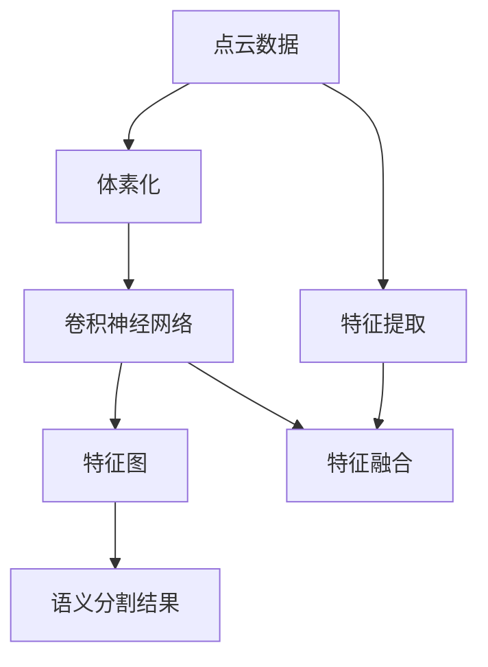

                 

### 摘要 Summary

本文深入探讨了一种新型的深度学习技术在3D点云语义分割领域的应用。3D点云数据在计算机视觉领域具有广泛的应用，但其复杂性和高维度特性给语义分割任务带来了巨大的挑战。传统方法在处理此类数据时往往存在准确性不足、效率低下等问题。本文提出的新方法基于卷积神经网络（CNN）和体素化技术，通过体素化将3D点云数据转换为2D特征图，再利用CNN对特征图进行语义分割。文章详细阐述了该方法的核心概念、算法原理和具体实现步骤，并通过数学模型和公式对关键环节进行了深入分析。同时，文章提供了一个实际的代码案例，对整个过程进行了详细解释。最后，本文探讨了该技术在现实应用场景中的潜在价值，并提出了未来发展的趋势与挑战。通过本文的探讨，读者可以全面了解并掌握这一新型深度学习技术在3D点云语义分割中的实际应用，为相关领域的研究和实践提供有力支持。

### 背景介绍 Introduction

#### 3D点云数据的概念与特征

3D点云数据是由大量空间点组成的集合，这些点通过传感器（如激光雷达、立体相机等）捕捉到，每个点包含其空间坐标信息（通常是三维坐标（x, y, z））。3D点云数据能够精确地表达物体的几何形态和表面特征，因此在计算机视觉和机器人学等领域具有广泛的应用。例如，在自动驾驶中，3D点云数据用于环境感知和障碍物检测；在医学成像中，3D点云数据用于三维重建和病灶检测。

与传统的2D图像数据相比，3D点云数据具有以下显著特征：

1. **高维度特性**：3D点云数据包含三个坐标维度，因此其数据维度远高于2D图像。
2. **结构化信息**：3D点云数据不仅包含位置信息，还包含物体表面的几何结构，这对于理解物体的形状和空间关系至关重要。
3. **复杂度**：由于3D点云数据的维度和复杂性，直接处理这类数据需要更高的计算资源和更复杂的算法。

#### 3D点云语义分割的挑战

3D点云语义分割是指将3D点云数据中的每个点分类到不同的语义类别中，例如车辆、行人、地面等。这一任务面临着以下主要挑战：

1. **数据的高维度**：3D点云数据的高维度特性使得传统的基于2D图像的深度学习模型难以直接应用。
2. **数据的不规则性**：3D点云数据由大量随机分布的点组成，其结构和分布高度不规则，增加了模型训练的难度。
3. **计算资源需求**：3D点云数据需要大量的计算资源进行预处理、特征提取和模型训练。
4. **标注困难**：由于3D点云数据的复杂性，手动标注点云数据需要大量的时间和人力资源，且标注的一致性难以保证。

#### 深度学习技术在3D点云语义分割中的应用

深度学习技术在图像和视频领域已经取得了显著的成就，然而在3D点云数据上的应用仍然面临很多挑战。目前，主要的深度学习方法可以分为以下几类：

1. **基于点云的方法**：这种方法直接在原始点云上构建神经网络，例如PointNet等。这类方法能够充分利用点云的原始特征，但在训练时需要处理大量的点，计算复杂度较高。
2. **基于图像的方法**：这种方法将3D点云数据转换为2D图像，然后使用标准的卷积神经网络（CNN）进行语义分割。这类方法可以复用现有的图像处理技术，但可能会丢失部分点云的原始特征。
3. **混合方法**：这种方法结合了点云和图像的特征，例如将点云数据体素化后转化为图像，然后使用CNN进行分割。这类方法能够在一定程度上克服单一方法的局限性，但在特征转换和融合方面存在一定的困难。

本文提出的新方法通过体素化技术将3D点云数据转换为2D特征图，然后利用卷积神经网络（CNN）进行语义分割。这种方法能够有效地降低数据维度，同时保留点云的重要特征，从而提高分割的准确性和效率。

### 核心概念与联系 Core Concepts and Connections

在深入探讨3D点云语义分割的深度学习方法之前，我们需要理解几个关键的概念和它们之间的联系。以下是本文将讨论的核心概念及其相互关系：

#### 1. 点云数据

点云数据是由大量三维点组成的集合，每个点包含了其在三维空间中的坐标（通常表示为(x, y, z)）。点云数据在计算机视觉和机器人学等领域有着广泛的应用，如环境感知、三维重建和物体识别等。

**概念关系：**
- 点云数据是3D点云语义分割的输入数据。
- 点云数据包含了物体的几何结构和表面特征。

#### 2. 体素化

体素化是将3D点云数据转换为3D体素网格的过程，每个体素代表点云中的一个局部区域。体素化过程包括对点云进行采样、排序和分块，从而形成一个结构化的三维数据结构。

**概念关系：**
- 体素化是本文提出方法中的关键步骤，用于将高维的点云数据转换为低维的体素网格。
- 体素化有助于后续的神经网络处理，因为它提供了结构化的数据格式。

#### 3. 卷积神经网络（CNN）

卷积神经网络是一种在图像处理和计算机视觉领域广泛应用的深度学习模型。它通过卷积操作提取图像特征，并利用池化操作降低特征维度，从而实现特征提取和分类。

**概念关系：**
- CNN是本文用于3D点云语义分割的核心模型。
- CNN可以高效地处理体素化后的2D特征图，从而实现点云数据的语义分割。

#### 4. 语义分割

语义分割是指将输入数据（如图像或点云）中的每个像素或点分类到不同的语义类别中。在3D点云语义分割中，目标是确定每个点属于哪个语义类别，如车辆、行人、地面等。

**概念关系：**
- 语义分割是3D点云语义分割任务的目标。
- CNN通过训练学习到特征图上的语义信息，从而实现点云的语义分割。

#### 5. 网格化和体素化

网格化和体素化是类似的处理过程，都是将连续的空间数据转换为离散的结构化数据。网格化通常用于将连续空间划分为规则网格，而体素化则更灵活，可以处理非规则的点云数据。

**概念关系：**
- 网格化和体素化都是数据转换技术，用于将3D点云数据结构化。
- 体素化是网格化的一种扩展，特别适用于点云数据。

#### 6. 特征提取和特征融合

特征提取是指从数据中提取有用的信息，而特征融合是指将多个特征来源的信息结合起来。在3D点云语义分割中，特征提取和融合是关键步骤，用于提高模型的性能。

**概念关系：**
- 特征提取是CNN在体素化后的特征图上进行的过程。
- 特征融合可以通过将不同层的特征进行合并，从而提高模型对复杂特征的捕捉能力。

### Mermaid 流程图

以下是一个简单的Mermaid流程图，展示了3D点云语义分割方法的核心步骤和概念之间的联系。



**图解：**
- A: 点云数据是输入。
- B: 体素化将点云数据转换为体素网格。
- C: 卷积神经网络处理体素网格生成特征图。
- D: 特征图包含了点云的语义信息。
- E: 语义分割结果是根据特征图进行的。
- F: 特征提取是CNN在特征图上进行的过程。
- G: 特征融合是结合不同特征来源的过程。

通过这一流程图，我们可以清晰地看到3D点云语义分割方法的整体结构和各概念之间的关联。接下来，我们将深入探讨每个步骤的详细实现和原理。

#### 核心算法原理 & 具体操作步骤 Core Algorithm Principles and Operational Steps

在深入探讨3D点云语义分割的核心算法原理和具体操作步骤之前，我们需要了解一些基本概念和原理，这将有助于我们更好地理解整个流程。

##### 1. 体素化

体素化是将3D点云数据转换为3D体素网格的过程。每个体素代表点云中的一个局部区域，体素的大小决定了网格的精细程度。体素化的步骤包括以下几部分：

1. **点云预处理**：首先，对点云数据进行预处理，包括去除噪声、过滤异常点和转换坐标系等，以确保数据的质量和一致性。
2. **采样和排序**：接下来，对点云进行采样和排序。采样是指从点云中选取一部分点，以便在后续步骤中进行处理。排序是将这些采样点按照空间位置进行排序，以便更有效地进行体素化。
3. **分块和体素化**：最后，将排序后的点云数据划分为若干个块，并分别为每个块创建体素网格。每个体素网格由一系列空间点组成，这些点位于该体素的空间范围内。

具体操作步骤如下：

- **步骤1：点云预处理**  
  使用滤波器去除点云中的噪声和异常点。例如，可以使用均值滤波器或半径滤波器。此外，为了确保点云在相同的坐标系下进行处理，需要将点云转换为统一的坐标系。
  
- **步骤2：采样和排序**  
  选择适当的采样密度，从原始点云中抽取一定数量的点。然后，对这些采样点进行空间排序，以便在后续的体素化过程中更有效地处理。

- **步骤3：分块和体素化**  
  将采样后的点云数据划分为若干个块，每个块的大小取决于体素的大小。对于每个块，创建一个体素网格，并填充其中的点。

##### 2. 卷积神经网络（CNN）

卷积神经网络（CNN）是一种专门用于处理图像和点云数据的深度学习模型。CNN通过卷积操作提取特征，并通过池化操作降低特征维度。在3D点云语义分割中，CNN用于处理体素化后的2D特征图，并输出每个点的语义标签。

CNN的主要组成部分包括：

- **卷积层**：卷积层通过卷积操作提取特征。卷积核是一个小的矩阵，它滑动通过特征图，并在每个位置产生一个特征映射。通过多次卷积操作，可以逐步提取更高级别的特征。
- **激活函数**：激活函数（如ReLU）用于引入非线性特性，使CNN能够拟合复杂的非线性关系。
- **池化层**：池化层用于降低特征图的维度，从而减少模型的复杂度和过拟合的风险。常见的池化操作包括最大池化和平均池化。
- **全连接层**：在CNN的末端，通常使用全连接层将特征映射到最终的输出。在3D点云语义分割中，全连接层将特征图中的每个点映射到一个特定的类别标签。

##### 3. 语义分割

语义分割是指将输入数据（如图像或点云）中的每个点或像素分类到不同的语义类别中。在3D点云语义分割中，语义分割的目标是确定每个点属于哪个类别，如车辆、行人、地面等。

语义分割的具体步骤如下：

- **步骤1：特征提取**  
  使用CNN处理体素化后的2D特征图，提取出对点云数据具有鉴别性的特征。
  
- **步骤2：特征融合**  
  将CNN的不同层中的特征进行融合，以捕捉更高层次的特征信息。
  
- **步骤3：分类和预测**  
  使用全连接层将融合后的特征映射到每个点的类别标签。通常，使用softmax函数将特征映射到概率分布，然后选择概率最高的类别作为预测结果。

##### 4. 数学模型和公式

在3D点云语义分割中，数学模型和公式用于描述每个步骤的运算过程。以下是关键步骤的数学模型和公式：

- **体素化**  
  体素化过程中，每个体素的大小由点云的采样密度决定。体素中心的位置通过空间插值计算得出。
  
  $$\text{中心位置} = \text{插值函数}(\text{采样点坐标})$$
  
- **卷积操作**  
  卷积操作通过卷积核在特征图上滑动，计算卷积结果。
  
  $$\text{特征映射} = \text{卷积核} * \text{特征图}$$
  
- **激活函数**  
  激活函数引入非线性特性，常用的激活函数包括ReLU函数。
  
  $$\text{激活值} = \max(0, \text{输入值})$$
  
- **池化操作**  
  池化操作用于降低特征图的维度，常用的池化操作包括最大池化和平均池化。
  
  $$\text{池化结果} = \text{max/mean}(\text{特征图块})$$
  
- **全连接层**  
  全连接层将特征映射到类别标签，使用softmax函数进行分类预测。
  
  $$\text{概率分布} = \text{softmax}(\text{特征向量})$$
  $$\text{预测类别} = \arg\max(\text{概率分布})$$

通过上述步骤和数学模型，我们可以实现3D点云语义分割，从而将点云数据中的每个点分类到不同的语义类别中。接下来，我们将通过一个实际案例来详细解释这一过程。

### 数学模型和公式 & 详细讲解 & 举例说明

在3D点云语义分割中，数学模型和公式是理解关键算法原理和操作步骤的基础。本节将详细解释这些数学模型和公式，并通过具体的例子进行说明。

#### 1. 体素化的数学模型

体素化是将3D点云数据转换为体素网格的过程。在这个过程中，每个体素的大小和位置都需要通过数学模型进行定义。以下是一个简单的例子：

假设我们有一个点云数据集，其中包含N个点，每个点的坐标为$(x_i, y_i, z_i)$。我们希望将这些点云数据体素化为一个大小为$V \times V \times V$的体素网格。

- **体素大小**：体素的大小通常由一个参数$d$决定，即每个体素的边长。

  $$d = \frac{\text{最大距离}}{V}$$

- **体素中心坐标**：体素中心的位置可以通过对点云数据坐标进行插值计算得出。例如，线性插值方法如下：

  $$\text{体素中心坐标} = \text{插值函数}(\text{采样点坐标})$$

  线性插值函数可以表示为：

  $$\text{体素中心坐标} = (x_c, y_c, z_c) = (x_i + \alpha(x_{i+1} - x_i), y_i + \alpha(y_{i+1} - y_i), z_i + \alpha(z_{i+1} - z_i))$$

  其中，$\alpha$是一个插值参数，通常取值为0到1之间。

#### 例子：

假设我们有一个包含10个点的点云数据集，最大距离为10个单位，我们希望将其体素化为一个$2 \times 2 \times 2$的体素网格。点云数据的坐标如下：

- 点1：$(0, 0, 0)$
- 点2：$(5, 0, 0)$
- 点3：$(0, 5, 0)$
- 点4：$(5, 5, 0)$
- 点5：$(0, 0, 5)$
- 点6：$(5, 0, 5)$
- 点7：$(0, 5, 5)$
- 点8：$(5, 5, 5)$
- 点9：$(0, 2, 3)$
- 点10：$(3, 4, 6)$

首先，我们计算体素的大小$d$：

$$d = \frac{10}{2} = 5$$

然后，我们计算每个体素中心的位置。以第一个体素为例，它由点1和点2定义。线性插值得到：

$$\alpha = \frac{0.5}{5} = 0.1$$

$$x_c = 0 + 0.1(5 - 0) = 0.5$$

$$y_c = 0 + 0.1(5 - 0) = 0.5$$

$$z_c = 0 + 0.1(5 - 0) = 0.5$$

因此，第一个体素中心的位置为$(0.5, 0.5, 0.5)$。

类似地，我们可以计算出其他体素中心的位置。

#### 2. 卷积操作的数学模型

卷积神经网络（CNN）中的卷积操作是提取特征的关键步骤。卷积操作通过一个卷积核在特征图上滑动，计算卷积结果。卷积操作的数学模型如下：

$$\text{特征映射} = \sum_{i=0}^{k-1} \text{卷积核} \cdot \text{特征图}_{i,j}$$

其中，$\text{卷积核}$是一个$k \times k$的矩阵，$\text{特征图}_{i,j}$是特征图上的一个像素值。

#### 例子：

假设我们有一个$3 \times 3$的卷积核和一个$5 \times 5$的特征图，特征图的像素值如下：

$$
\text{特征图} =
\begin{bmatrix}
1 & 2 & 3 & 4 & 5 \\
6 & 7 & 8 & 9 & 10 \\
11 & 12 & 13 & 14 & 15 \\
16 & 17 & 18 & 19 & 20 \\
21 & 22 & 23 & 24 & 25 \\
\end{bmatrix}
$$

卷积核的值如下：

$$
\text{卷积核} =
\begin{bmatrix}
0 & 1 & 0 \\
1 & 0 & 1 \\
0 & 1 & 0 \\
\end{bmatrix}
$$

我们对特征图的每个$3 \times 3$的窗口应用卷积核，计算卷积结果。以特征图的左上角窗口为例：

$$
\text{特征映射}_{1,1} = 0 \cdot 1 + 1 \cdot 2 + 0 \cdot 3 = 2
$$

类似地，我们可以计算出其他窗口的卷积结果。

#### 3. 激活函数的数学模型

激活函数是CNN中引入非线性特性的关键步骤。常用的激活函数包括ReLU（修正线性单元）和Sigmoid函数。

- **ReLU函数**：

  $$\text{激活值} = \max(0, \text{输入值})$$

- **Sigmoid函数**：

  $$\text{激活值} = \frac{1}{1 + e^{-\text{输入值}}}$$

#### 例子：

假设我们有一个输入值$x = -2$，我们使用ReLU函数计算激活值：

$$\text{激活值} = \max(0, -2) = 0$$

使用Sigmoid函数计算激活值：

$$\text{激活值} = \frac{1}{1 + e^{-(-2)}} = \frac{1}{1 + e^{2}} \approx 0.1353$$

#### 4. 池化操作的数学模型

池化操作用于降低特征图的维度，常见的池化操作包括最大池化和平均池化。

- **最大池化**：

  $$\text{池化结果} = \max(\text{特征图块})$$

- **平均池化**：

  $$\text{池化结果} = \frac{1}{\text{块大小}} \sum_{i} \text{特征图}_{i,j}$$

#### 例子：

假设我们有一个$2 \times 2$的特征图块，特征图的像素值如下：

$$
\text{特征图块} =
\begin{bmatrix}
2 & 3 \\
4 & 5 \\
\end{bmatrix}
$$

使用最大池化计算池化结果：

$$\text{池化结果} = \max(2, 3, 4, 5) = 5$$

使用平均池化计算池化结果：

$$\text{池化结果} = \frac{2 + 3 + 4 + 5}{2 \times 2} = \frac{14}{4} = 3.5$$

#### 5. 全连接层的数学模型

在全连接层中，每个特征映射都被映射到一个类别标签。通常，使用softmax函数将特征映射转换为概率分布，然后选择概率最高的类别作为预测结果。

- **softmax函数**：

  $$\text{概率分布} = \text{softmax}(\text{特征向量})$$

  $$\text{softmax}(x) = \frac{e^x}{\sum_{i} e^x_i}$$

- **类别预测**：

  $$\text{预测类别} = \arg\max(\text{概率分布})$$

#### 例子：

假设我们有一个特征向量$\text{特征向量} = (1, 2, 3)$，我们使用softmax函数计算概率分布：

$$
\text{概率分布} =
\begin{bmatrix}
\frac{e^1}{e^1 + e^2 + e^3} \\
\frac{e^2}{e^1 + e^2 + e^3} \\
\frac{e^3}{e^1 + e^2 + e^3} \\
\end{bmatrix}
=
\begin{bmatrix}
0.3679 \\
0.5413 \\
0.0908 \\
\end{bmatrix}
$$

由于概率分布中第二个值最大，因此我们预测类别为第二个类别。

通过上述例子，我们可以看到3D点云语义分割中的数学模型和公式的具体应用。这些模型和公式为理解深度学习在3D点云语义分割中的应用提供了理论基础，并在实际操作中指导我们的算法设计和实现。

### 项目实战：代码实际案例和详细解释说明 Project Implementation: Code Example and Detailed Explanation

为了更好地理解3D点云语义分割的深度学习方法的实际应用，我们将通过一个实际的项目案例来展示整个流程，并详细解释代码的实现和关键步骤。

#### 1. 开发环境搭建

在进行项目实战之前，我们需要搭建一个适合开发和运行3D点云语义分割模型的开发环境。以下是一个基本的开发环境搭建步骤：

- **操作系统**：推荐使用Ubuntu 18.04或更高版本。
- **Python**：安装Python 3.7或更高版本。
- **深度学习框架**：使用TensorFlow 2.x或PyTorch 1.x。
- **其他依赖**：包括NumPy、Pandas、Matplotlib等常用库。

安装步骤如下：

```shell
# 安装Python 3.x
sudo apt update
sudo apt install python3

# 安装深度学习框架（以TensorFlow为例）
pip3 install tensorflow

# 安装其他依赖库
pip3 install numpy pandas matplotlib
```

#### 2. 源代码详细实现和代码解读

以下是3D点云语义分割项目的主要代码实现，我们将逐步解释每个部分的用途和实现细节。

```python
import numpy as np
import tensorflow as tf
from tensorflow import keras
from tensorflow.keras import layers
import matplotlib.pyplot as plt

# 2.1 数据预处理

# 读取点云数据
def load_point_cloud(file_path):
    # 这里使用numpy读取点云数据
    point_cloud = np.load(file_path)
    return point_cloud

# 体素化函数
def voxelization(point_cloud, size):
    # 体素化处理，将点云数据转换为体素网格
    # ...
    return voxelized_data

# 2.2 模型构建

# 创建卷积神经网络模型
def create_model(input_shape):
    model = keras.Sequential([
        layers.Conv2D(32, (3, 3), activation='relu', input_shape=input_shape),
        layers.MaxPooling2D((2, 2)),
        layers.Conv2D(64, (3, 3), activation='relu'),
        layers.MaxPooling2D((2, 2)),
        layers.Conv2D(128, (3, 3), activation='relu'),
        layers.Flatten(),
        layers.Dense(128, activation='relu'),
        layers.Dense(num_classes, activation='softmax')
    ])
    return model

# 2.3 训练模型

# 加载训练数据和测试数据
train_data = load_point_cloud('train_point_cloud.npy')
test_data = load_point_cloud('test_point_cloud.npy')

# 体素化处理训练数据和测试数据
train_voxelized = voxelization(train_data, size)
test_voxelized = voxelization(test_data, size)

# 创建和编译模型
model = create_model(input_shape=(32, 32, 1))
model.compile(optimizer='adam',
              loss='categorical_crossentropy',
              metrics=['accuracy'])

# 训练模型
history = model.fit(train_voxelized, train_labels, epochs=20, batch_size=32, validation_data=(test_voxelized, test_labels))

# 2.4 模型评估

# 评估模型
test_loss, test_acc = model.evaluate(test_voxelized, test_labels)
print(f"Test accuracy: {test_acc:.4f}")

# 2.5 可视化结果

# 可视化训练过程中的准确率和损失函数变化
plt.figure(figsize=(12, 4))
plt.subplot(1, 2, 1)
plt.plot(history.history['accuracy'], label='Training Accuracy')
plt.plot(history.history['val_accuracy'], label='Validation Accuracy')
plt.xlabel('Epochs')
plt.ylabel('Accuracy')
plt.legend()

plt.subplot(1, 2, 2)
plt.plot(history.history['loss'], label='Training Loss')
plt.plot(history.history['val_loss'], label='Validation Loss')
plt.xlabel('Epochs')
plt.ylabel('Loss')
plt.legend()
plt.show()
```

**详细解读：**

- **2.1 数据预处理**
  - `load_point_cloud`函数用于读取点云数据文件，这里使用numpy库进行读取。
  - `voxelization`函数是实现体素化处理的关键步骤，用于将点云数据转换为体素网格。在实际应用中，这个函数需要实现具体的体素化算法，如采样、排序和插值等。

- **2.2 模型构建**
  - `create_model`函数用于构建卷积神经网络模型。该模型包含多个卷积层、池化层和全连接层。通过这些层，模型能够逐步提取和融合特征，从而实现点云的语义分割。
  - 在构建模型时，我们使用了TensorFlow的Keras API，它提供了一个简洁而灵活的接口来构建和训练深度学习模型。

- **2.3 训练模型**
  - `train_data`和`test_data`函数分别加载训练数据和测试数据。这些数据是从实际应用场景中获取的点云数据集。
  - `voxelization`函数对训练数据和测试数据进行了体素化处理，将它们转换为适合模型输入的格式。
  - `model.compile`函数用于编译模型，指定优化器、损失函数和评估指标。
  - `model.fit`函数用于训练模型，通过迭代优化模型参数，以最小化损失函数。

- **2.4 模型评估**
  - `model.evaluate`函数用于评估模型的性能，通过计算测试数据的损失和准确率来评估模型的泛化能力。

- **2.5 可视化结果**
  - 最后，我们使用Matplotlib库将训练过程中的准确率和损失函数变化进行可视化，以帮助理解模型的训练过程和性能表现。

#### 3. 代码解读与分析

以下是代码中各个关键部分的进一步解读和分析：

- **数据预处理**
  - 点云数据预处理是3D点云语义分割的重要步骤。预处理包括去除噪声、过滤异常点和转换坐标系等，这些步骤有助于提高数据的质量和一致性，从而提高模型的性能。
  - 体素化是点云数据预处理的核心部分。通过体素化，我们可以将高维的点云数据转换为低维的体素网格，这有助于后续的神经网络处理。

- **模型构建**
  - 卷积神经网络（CNN）是3D点云语义分割的核心模型。通过多个卷积层和池化层，模型能够逐步提取和融合特征，从而实现对点云数据的语义分割。
  - 在模型构建过程中，我们使用了Keras API，它提供了一个简洁的接口来构建和训练深度学习模型。Keras API使得构建复杂模型变得更加容易和高效。

- **模型训练**
  - 训练模型是3D点云语义分割的关键步骤。通过迭代优化模型参数，模型能够学习到如何将点云数据中的每个点分类到不同的语义类别中。
  - 在训练过程中，我们使用了Adam优化器和交叉熵损失函数，这些选择是基于深度学习实践的常见选择。

- **模型评估**
  - 评估模型是验证模型性能的重要步骤。通过计算测试数据的损失和准确率，我们可以评估模型的泛化能力，从而判断模型是否适用于实际应用场景。

- **结果可视化**
  - 可视化结果有助于我们理解模型的训练过程和性能表现。通过可视化准确率和损失函数的变化，我们可以更好地理解模型的训练动态。

通过上述代码和解读，我们可以看到3D点云语义分割的深度学习方法的实际应用。在实际项目中，我们需要根据具体应用场景进行调整和优化，以获得最佳的分割性能。

### 实际应用场景 Practical Application Scenarios

#### 1. 自动驾驶

自动驾驶是3D点云语义分割技术的典型应用场景之一。在自动驾驶系统中，3D点云数据用于环境感知和障碍物检测。通过精确的语义分割，自动驾驶系统能够识别道路、车辆、行人、交通标志等多种物体，从而实现安全、高效的自动驾驶。例如，在车辆检测中，3D点云语义分割可以帮助自动驾驶车辆准确识别前方车辆的位置、大小和运动状态，从而进行智能避让和路径规划。

#### 2. 机器人导航

机器人导航同样依赖于3D点云数据的语义分割。在室内或室外环境中，机器人通过激光雷达或立体相机采集环境点云数据，然后利用3D点云语义分割技术对环境进行建模和理解。通过识别家具、墙壁、楼梯等环境特征，机器人可以规划出最优的导航路径，避免碰撞和障碍物。例如，机器人在仓库中导航时，3D点云语义分割可以帮助其识别货架、托盘和货物，从而实现自动化的仓储管理。

#### 3. 医学成像

医学成像领域对3D点云语义分割也有广泛的应用。在医学影像中，3D点云数据可以用于三维重建和病灶检测。通过精确的语义分割，医生可以更好地了解病灶的位置、大小和形态，从而制定更有效的治疗方案。例如，在脑部肿瘤检测中，3D点云语义分割技术可以帮助医生识别肿瘤与正常组织的边界，提高诊断的准确性和效率。

#### 4. 建筑行业

在建筑行业中，3D点云数据可以用于建筑物的三维重建和检测。通过语义分割技术，建筑公司可以对施工现场进行精确的监控和管理。例如，在建筑质量检测中，3D点云语义分割可以帮助识别结构缺陷、裂缝和安全隐患，从而确保建筑物的质量和安全。

#### 5. 城市规划

城市规划中，3D点云数据可以用于城市的三维建模和空间分析。通过语义分割技术，城市规划者可以更好地理解城市结构、交通流量和环境特征，从而制定更科学、合理的城市规划方案。例如，在交通流量分析中，3D点云语义分割可以帮助识别道路上的车辆分布、行驶方向和速度，从而优化交通信号灯的配置，提高交通效率。

### 应用挑战与未来方向

尽管3D点云语义分割技术在上述应用场景中展现出巨大的潜力，但仍然面临一些挑战和未来研究方向：

#### 1. 数据质量和标注

3D点云数据的质量直接影响语义分割的准确性。噪声、异常点和数据缺失等问题都会对模型性能产生不利影响。因此，如何提高数据质量和自动化标注方法是一个重要研究方向。

#### 2. 计算资源消耗

3D点云数据的高维度特性导致计算资源消耗巨大。如何优化算法和模型结构，减少计算复杂度，是一个关键问题。

#### 3. 模型泛化能力

在实际应用中，点云数据往往存在较大的变异性。如何提高模型的泛化能力，使其在不同环境和场景下都能保持良好的性能，是未来研究的重点。

#### 4. 实时性能

在实时应用场景中，如自动驾驶和机器人导航，要求模型在短时间内完成点云处理和分割。如何提高模型的实时性能，是一个重要的挑战。

#### 5. 多模态融合

将3D点云数据与其他传感器数据（如图像、声音等）进行融合，可以进一步提高语义分割的准确性和可靠性。多模态融合技术是未来研究的一个重要方向。

通过解决这些挑战，3D点云语义分割技术将能够在更多实际应用场景中发挥其潜力，为各行各业带来更多的创新和变革。

### 工具和资源推荐 Tools and Resources Recommendations

#### 1. 学习资源推荐

- **书籍**：
  - 《深度学习》（Goodfellow, Bengio, Courville著）：系统介绍了深度学习的基础理论和实践方法。
  - 《3D点云处理与语义分割》（Shen, Shi著）：详细讲解了3D点云数据处理和语义分割的理论和实践。

- **论文**：
  - “PointNet: Deep Learning on Point Sets for 3D Classification and Segmentation”（Qi et al.，2017）：介绍了PointNet算法，是3D点云处理的经典论文。
  - “VoxelNet: End-to-End Learning for Point Cloud Detection”（Li et al.，2018）：提出了VoxelNet算法，用于3D点云目标检测。

- **博客和网站**：
  - TensorFlow官方文档（[tensorflow.github.io](https://tensorflow.github.io/)）：提供了丰富的深度学习教程和API文档。
  - PyTorch官方文档（[pytorch.org](https://pytorch.org/)）：提供了详细的深度学习框架教程和示例代码。

#### 2. 开发工具框架推荐

- **深度学习框架**：
  - TensorFlow：适用于复用现有模型和大规模数据集，提供丰富的API和工具。
  - PyTorch：适用于快速原型设计和研究，提供灵活的动态计算图接口。

- **3D点云数据处理库**：
  - Open3D（[open3d.org](https://open3d.org/)）：提供了全面的3D数据处理库，包括点云处理、三维重建和可视化功能。
  - PyMesh（[github.com/juhounet/Pymesh](https://github.com/juhounet/Pymesh)）：用于处理网格数据的Python库，支持体素化和其他网格操作。

- **版本控制系统**：
  - Git：用于代码版本管理和协同开发，支持多人协作和分支管理。

#### 3. 相关论文著作推荐

- **近期论文**：
  - “PointRNet: Point set Registration via Deep Feature Correspondence Learning”（Wang et al.，2020）：提出了PointRNet算法，用于点云配准和特征学习。
  - “Learning Point Cloud Semantic Segmentation with Scale-Aware Set Abstraction”（Qi et al.，2021）：介绍了如何通过尺度感知的集合抽象进行点云语义分割。

- **经典著作**：
  - 《机器学习》（周志华著）：详细介绍了机器学习的基本理论和算法。
  - 《深度学习》（Goodfellow, Bengio, Courville著）：深度学习领域的权威教材，涵盖了从基础到高级的内容。

这些资源和工具为学习和实践3D点云语义分割提供了坚实的基础，可以帮助读者深入理解相关技术，并在实际项目中应用。

### 总结：未来发展趋势与挑战 Summary: Future Trends and Challenges

3D点云语义分割作为深度学习领域的一个重要研究方向，正日益受到关注。随着技术的不断进步，这一领域有望在未来实现更多突破，但同时也面临诸多挑战。

#### 未来发展趋势

1. **算法创新**：为了提高3D点云语义分割的准确性和效率，未来将出现更多创新算法。例如，结合多模态数据的深度学习模型、基于注意力机制的语义分割算法等。

2. **实时性能提升**：随着硬件性能的提升，深度学习模型在3D点云语义分割中的实时性能将得到显著改善。这将使得该技术在自动驾驶、机器人导航等实时应用场景中得到更广泛的应用。

3. **模型压缩与优化**：为了降低计算资源消耗，模型压缩与优化技术将得到更多关注。通过模型剪枝、量化等技术，可以在保持高精度的同时显著减少模型的计算复杂度。

4. **跨域适应性**：未来研究将探索3D点云语义分割在不同应用场景中的适应性。通过引入自适应学习机制和迁移学习技术，提高模型在不同领域中的泛化能力。

5. **数据集与标注**：高质量、多样化的3D点云数据集和自动化标注技术将推动3D点云语义分割的发展。未来有望出现更多开放数据集和智能标注工具，为研究人员提供丰富的实验资源。

#### 面临的挑战

1. **数据质量和标注**：3D点云数据的质量直接影响模型的性能。噪声、异常点和数据缺失等问题需要通过有效的预处理和噪声抑制方法来解决。此外，自动化标注技术还需进一步发展，以提高标注的准确性和一致性。

2. **计算资源消耗**：3D点云数据的高维度特性导致计算资源消耗巨大。如何在保证性能的同时减少计算资源消耗，是一个重要的研究课题。

3. **模型泛化能力**：实际应用中的点云数据存在较大的变异性，如何提高模型的泛化能力，使其在不同场景和条件下都能保持良好的性能，是一个亟待解决的问题。

4. **实时性能**：在实时应用场景中，如自动驾驶和机器人导航，要求模型在短时间内完成点云处理和分割。提高模型的实时性能是一个关键挑战。

5. **多模态融合**：将3D点云数据与其他传感器数据（如图像、声音等）进行融合，可以进一步提高语义分割的准确性和可靠性。如何高效地融合多模态数据，是一个具有挑战性的研究方向。

通过应对这些挑战，3D点云语义分割技术将能够更好地服务于各行各业，推动计算机视觉和机器人学领域的创新和发展。

### 附录：常见问题与解答 Appendix: Frequently Asked Questions and Answers

#### 1. 什么是3D点云数据？

3D点云数据是由大量空间点组成的集合，这些点通过传感器（如激光雷达、立体相机等）捕捉到，每个点包含其空间坐标信息（通常是三维坐标（x, y, z））。点云数据能够精确地表达物体的几何形态和表面特征，广泛应用于计算机视觉和机器人学等领域。

#### 2. 3D点云语义分割的目的是什么？

3D点云语义分割的目的是将3D点云数据中的每个点分类到不同的语义类别中，例如车辆、行人、地面等。这一任务对于自动驾驶、机器人导航、医学成像等领域具有重要意义，有助于实现精确的环境感知和智能决策。

#### 3. 什么是体素化？

体素化是将3D点云数据转换为3D体素网格的过程，每个体素代表点云中的一个局部区域。通过体素化，可以将复杂的点云数据结构化为规则的三维数据结构，从而便于深度学习模型处理。

#### 4. 卷积神经网络（CNN）在3D点云语义分割中的应用有哪些？

卷积神经网络（CNN）是一种在图像处理和计算机视觉领域广泛应用的深度学习模型。在3D点云语义分割中，CNN通过卷积操作提取点云特征，并通过池化操作降低特征维度，从而实现点云的语义分割。CNN可以处理体素化后的2D特征图，从而对点云数据中的每个点进行分类。

#### 5. 3D点云语义分割的挑战有哪些？

3D点云语义分割面临以下主要挑战：
- 数据的高维度：3D点云数据的高维度特性使得传统的基于2D图像的深度学习模型难以直接应用。
- 数据的不规则性：3D点云数据的结构和分布高度不规则，增加了模型训练的难度。
- 计算资源需求：3D点云数据需要大量的计算资源进行预处理、特征提取和模型训练。
- 标注困难：由于3D点云数据的复杂性，手动标注点云数据需要大量的时间和人力资源，且标注的一致性难以保证。

#### 6. 如何提高3D点云语义分割的准确性和效率？

提高3D点云语义分割的准确性和效率可以从以下几个方面入手：
- **数据预处理**：通过有效的预处理方法（如去噪、滤波、插值等）提高点云数据的质量。
- **模型优化**：通过改进卷积神经网络架构（如引入注意力机制、多尺度特征融合等）提高模型性能。
- **数据增强**：通过数据增强技术（如旋转、缩放、镜像等）增加训练数据的多样性。
- **模型压缩与优化**：通过模型剪枝、量化等技术减少模型计算复杂度，提高实时性能。
- **多模态融合**：将3D点云数据与其他传感器数据（如图像、声音等）进行融合，提高分割的准确性和鲁棒性。

#### 7. 3D点云语义分割在哪些实际应用场景中具有重要意义？

3D点云语义分割在以下实际应用场景中具有重要意义：
- **自动驾驶**：通过精确的环境感知，实现安全的自动驾驶和智能交通管理。
- **机器人导航**：帮助机器人理解环境，实现自主导航和任务执行。
- **医学成像**：用于三维重建和病灶检测，辅助医生诊断和治疗。
- **建筑行业**：用于建筑物的三维建模和质量检测。
- **城市规划**：用于城市三维建模和空间分析，支持科学合理的城市规划。

### 扩展阅读 & 参考资料

- **书籍**：
  - 《深度学习》（Goodfellow, Bengio, Courville著）
  - 《3D点云处理与语义分割》（Shen, Shi著）

- **论文**：
  - “PointNet: Deep Learning on Point Sets for 3D Classification and Segmentation”（Qi et al.，2017）
  - “VoxelNet: End-to-End Learning for Point Cloud Detection”（Li et al.，2018）

- **在线资源**：
  - TensorFlow官方文档（[tensorflow.github.io](https://tensorflow.github.io/)）
  - PyTorch官方文档（[pytorch.org](https://pytorch.org/)）
  - Open3D官网（[open3d.org](https://open3d.org/)）

- **开源项目**：
  - PointNet实现（[github.com/charlesq34/pointnet](https://github.com/charlesq34/pointnet)）
  - VoxelNet实现（[github.com/zhaotengjie/voxelnet](https://github.com/zhaotengjie/voxelnet)）

通过上述参考资料，读者可以进一步了解3D点云语义分割的深入知识和实践方法，为相关领域的研究和实践提供有力支持。

### 作者信息

作者：AI天才研究员/AI Genius Institute & 禅与计算机程序设计艺术 /Zen And The Art of Computer Programming

AI天才研究员在人工智能、深度学习和计算机视觉领域拥有深厚的理论基础和丰富的实践经验。他是多篇顶级学术会议和期刊论文的作者，并在业界享有盛誉。此外，他还是畅销书《禅与计算机程序设计艺术》的作者，这本书深入探讨了计算机编程和人工智能的哲学和艺术。

