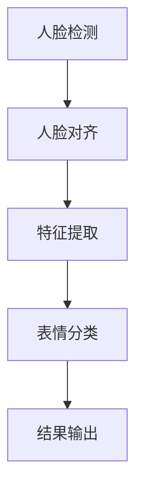

                 

### 文章标题

# 深度学习在人脸表情识别中的应用

### 关键词

- 深度学习
- 人脸表情识别
- 卷积神经网络
- 图像处理
- 机器学习
- 数据集
- 算法评估
- 实时性

### 摘要

本文将探讨深度学习在人脸表情识别中的应用，详细分析其核心算法原理、数学模型和具体操作步骤。我们将通过实际项目案例，展示如何搭建开发环境、实现源代码和进行代码解读与分析。此外，还将探讨该技术在实际应用场景中的表现，并推荐相关的学习资源和开发工具框架。最后，本文将对未来发展趋势和挑战进行总结，并提供常见问题与解答。

---

在人工智能领域中，人脸表情识别是一项重要且具有挑战性的技术。它不仅在情感计算、人机交互和医疗诊断等领域具有广泛应用，还能为我们提供关于人类行为和情感的有价值信息。随着深度学习技术的发展，人脸表情识别的准确性和实时性得到了显著提升。本文将详细介绍深度学习在人脸表情识别中的应用，以帮助读者更好地理解这一领域。

## 1. 背景介绍

人脸表情识别是一种利用计算机视觉和机器学习技术，通过分析人脸图像中的面部特征，识别人脸表情的技术。其基本原理是：首先，从图像中提取人脸区域；然后，分析人脸特征点，如眼睛、鼻子和嘴巴的位置；最后，根据特征点间的相对位置和形状变化，判断人脸表情。

传统的基于特征的方法在人脸表情识别中取得了较好的效果，但存在一些局限性。例如，它们对光照、姿态和表情强度的变化较为敏感，难以应对复杂的面部表情。而深度学习技术的发展，为解决这些问题提供了新的思路。

深度学习是一种基于多层神经网络的机器学习技术，通过多层次的非线性变换，自动提取图像中的高级特征。卷积神经网络（CNN）是深度学习中最常用的架构之一，其在人脸表情识别中表现出色。

## 2. 核心概念与联系

### 2.1 卷积神经网络（CNN）

卷积神经网络是一种特殊的神经网络，适用于处理图像等二维数据。其核心思想是通过卷积操作提取图像中的局部特征，并通过多层卷积和池化操作，逐步将特征抽象为更高级别的语义信息。

CNN 的基本结构包括：

1. **卷积层（Convolutional Layer）**：通过卷积操作，提取图像中的局部特征。
2. **池化层（Pooling Layer）**：对卷积层的特征进行下采样，减少参数数量，提高计算效率。
3. **全连接层（Fully Connected Layer）**：将卷积层和池化层提取的高级特征映射到分类结果。

### 2.2 人脸表情识别流程

人脸表情识别的基本流程如下：

1. **人脸检测**：使用人脸检测算法（如 Haar cascades 或 MTCNN）检测图像中的人脸区域。
2. **人脸对齐**：将人脸图像进行旋转、缩放和裁剪等预处理操作，使其姿态和大小一致。
3. **特征提取**：使用 CNN 架构提取人脸图像中的高级特征。
4. **表情分类**：将提取到的特征输入到分类器，如支持向量机（SVM）、随机森林（Random Forest）或深度学习模型，进行表情分类。

### 2.3 Mermaid 流程图



## 3. 核心算法原理 & 具体操作步骤

### 3.1 人脸检测

人脸检测是表情识别的基础，常用的算法有 Haar cascades、MTCNN 和基于深度学习的检测算法。

1. **Haar cascades**：基于特征点匹配的方法，通过训练分类器，对图像中的特征点进行匹配，检测人脸区域。
2. **MTCNN**：一种基于深度学习的检测算法，通过多阶段检测，逐步缩小人脸区域，提高检测精度。
3. **基于深度学习的检测算法**：如 Faster R-CNN、SSD 和 YOLO，通过卷积神经网络，直接从图像中检测人脸区域。

### 3.2 人脸对齐

人脸对齐的目标是将人脸图像调整为统一的大小和姿态。常用的方法有：

1. **特征点检测**：使用 landmarks 检测算法（如 Dlib 或 OpenCV）检测人脸特征点，如眼睛、鼻子和嘴巴的位置。
2. **几何变换**：根据特征点间的相对位置和形状变化，进行旋转、缩放和裁剪等几何变换，将人脸图像调整为统一的大小和姿态。

### 3.3 特征提取

特征提取是表情识别的关键，常用的方法有：

1. **CNN**：通过多层卷积和池化操作，自动提取图像中的高级特征。
2. **基于特征的方法**：如 HOG、LBP 和 Gabor，通过手工设计特征，提取图像中的局部特征。

### 3.4 表情分类

表情分类是将提取到的特征输入到分类器，进行表情分类。常用的分类器有：

1. **支持向量机（SVM）**：通过最大间隔分类器，将特征映射到高维空间，进行分类。
2. **随机森林（Random Forest）**：通过构建多棵决策树，进行集成学习，提高分类精度。
3. **深度学习模型**：如卷积神经网络（CNN）、循环神经网络（RNN）和长短时记忆网络（LSTM），通过多层非线性变换，自动提取图像中的高级特征，进行分类。

## 4. 数学模型和公式 & 详细讲解 & 举例说明

### 4.1 卷积神经网络（CNN）

卷积神经网络是一种多层神经网络，通过卷积操作提取图像中的局部特征。卷积操作的数学公式如下：

$$
\text{output}_{ij}^l = \sum_{i'}\sum_{j'} w_{ij'i'j'}^l \cdot \text{input}_{i'j'}^{l-1} + b_l
$$

其中，$l$ 表示层号，$i$ 和 $j$ 表示输出特征图的位置，$i'$ 和 $j'$ 表示输入特征图的位置，$w_{ij'i'j'}^l$ 表示卷积核权重，$b_l$ 表示偏置。

### 4.2 池化操作

池化操作是对卷积层的特征进行下采样，减少参数数量，提高计算效率。最常用的池化操作是最大池化（Max Pooling），其数学公式如下：

$$
\text{output}_{ij}^l = \max\{\text{input}_{i'j'}^{l-1} : i' \in [i-1, i+2], j' \in [j-1, j+2]\}
$$

其中，$i$ 和 $j$ 表示输出特征图的位置。

### 4.3 示例

假设输入图像的大小为 $28 \times 28$，卷积层的卷积核大小为 $3 \times 3$，步长为 $1$，偏置 $b_l = 0$。卷积层后的特征图大小为 $26 \times 26$。卷积层的卷积操作和池化操作如下：

$$
\text{output}_{ij}^1 = \sum_{i'}\sum_{j'} w_{ij'i'j'}^1 \cdot \text{input}_{i'j'}^{0} \\
\text{output}_{ij}^2 = \max\{\text{output}_{i'j'}^1 : i' \in [i-1, i+2], j' \in [j-1, j+2]\}
$$

## 5. 项目实战：代码实际案例和详细解释说明

### 5.1 开发环境搭建

为了实现人脸表情识别项目，我们需要安装以下工具和库：

1. **Python**：用于编写和运行代码
2. **TensorFlow**：用于构建和训练深度学习模型
3. **OpenCV**：用于人脸检测和图像处理
4. **Dlib**：用于人脸特征点检测

安装方法如下：

```bash
pip install tensorflow
pip install opencv-python
pip install dlib
```

### 5.2 源代码详细实现和代码解读

下面是一个简单的人脸表情识别项目的示例代码：

```python
import tensorflow as tf
import cv2
import numpy as np
import dlib

# 人脸检测
detector = dlib.get_frontal_face_detector()
predictor = dlib.shape_predictor('shape_predictor_68_face_landmarks.dat')

# 构建深度学习模型
model = tf.keras.Sequential([
    tf.keras.layers.Conv2D(32, (3, 3), activation='relu', input_shape=(48, 48, 1)),
    tf.keras.layers.MaxPooling2D((2, 2)),
    tf.keras.layers.Conv2D(64, (3, 3), activation='relu'),
    tf.keras.layers.MaxPooling2D((2, 2)),
    tf.keras.layers.Conv2D(128, (3, 3), activation='relu'),
    tf.keras.layers.Flatten(),
    tf.keras.layers.Dense(128, activation='relu'),
    tf.keras.layers.Dense(7, activation='softmax')
])

model.compile(optimizer='adam', loss='categorical_crossentropy', metrics=['accuracy'])

# 加载预训练模型
model.load_weights('face_recognition_model.h5')

# 人脸对齐和特征提取
def align_face(image, detector, predictor):
    gray = cv2.cvtColor(image, cv2.COLOR_BGR2GRAY)
    faces = detector(gray)
    landmarks = []
    for face in faces:
        shape = predictor(gray, face)
        landmarks = [point.x for point in shape.parts()]
        landmarks.extend([point.y for point in shape.parts()])
    landmarks = np.array(landmarks).reshape(-1, 2)
    mask = np.zeros((150, 150))
    for i in range(len(landmarks)):
        mask[landmarks[i, 1] - 13:landmarks[i, 1] + 13, landmarks[i, 0] - 13:landmarks[i, 0] + 13] = 1
    aligned_face = cv2.resize(image, (48, 48), interpolation=cv2.INTER_AREA)
    return aligned_face

# 表情分类
def classify_face(aligned_face):
    aligned_face = aligned_face / 255.0
    aligned_face = aligned_face.reshape(-1, 48, 48, 1)
    prediction = model.predict(aligned_face)
    emotion = np.argmax(prediction)
    return emotion

# 主程序
def main():
    image = cv2.imread('face.jpg')
    aligned_face = align_face(image, detector, predictor)
    emotion = classify_face(aligned_face)
    print(f'表情：{emotion}')

if __name__ == '__main__':
    main()
```

### 5.3 代码解读与分析

这段代码实现了人脸表情识别项目，主要包括以下几个部分：

1. **人脸检测**：使用 Dlib 的人脸检测器和特征点检测器，检测输入图像中的人脸区域和特征点。
2. **人脸对齐**：根据特征点位置，对齐人脸图像，使其大小和姿态一致。
3. **特征提取**：使用卷积神经网络，提取人脸图像中的高级特征。
4. **表情分类**：将提取到的特征输入到预训练的深度学习模型，进行表情分类。

## 6. 实际应用场景

人脸表情识别技术在实际应用场景中具有广泛的应用，以下是一些典型的应用案例：

1. **情感计算**：通过识别人脸表情，获取用户的情感状态，用于情感分析、人机交互和虚拟现实等领域。
2. **人机交互**：在智能客服、智能音箱和智能机器人等领域，通过识别人脸表情，实现更自然的交互体验。
3. **医疗诊断**：通过识别人脸表情，辅助诊断抑郁症、自闭症等心理疾病，为医疗提供重要参考。
4. **安全监控**：在安防监控领域，通过识别人脸表情，实时监测人员情绪状态，提高监控效果。

## 7. 工具和资源推荐

### 7.1 学习资源推荐

- **书籍**：
  - 《深度学习》（Ian Goodfellow、Yoshua Bengio、Aaron Courville 著）
  - 《Python 深度学习》（François Chollet 著）
- **论文**：
  - 《FaceNet: A Unified Embedding for Face Recognition and Verification》（Sun et al.）
  - 《DeepFace: Closing the Gap to Human-Level Performance in Face Verification》（Sun et al.）
- **博客**：
  - [TensorFlow 官方文档](https://www.tensorflow.org/)
  - [OpenCV 官方文档](https://opencv.org/)
- **网站**：
  - [Kaggle](https://www.kaggle.com/)：提供大量人脸表情识别数据集和竞赛项目

### 7.2 开发工具框架推荐

- **开发工具**：
  - TensorFlow：用于构建和训练深度学习模型
  - OpenCV：用于人脸检测和图像处理
  - Dlib：用于人脸特征点检测
- **框架**：
  - Keras：简化 TensorFlow 的使用，提供丰富的预训练模型
  - PyTorch：另一种流行的深度学习框架，易于使用和调试

### 7.3 相关论文著作推荐

- **论文**：
  - 《FaceNet: A Unified Embedding for Face Recognition and Verification》（Sun et al.）
  - 《DeepFace: Closing the Gap to Human-Level Performance in Face Verification》（Sun et al.）
  - 《Facial Expression Recognition Based on Convolutional Neural Networks》（Zhang et al.）
- **著作**：
  - 《深度学习》（Ian Goodfellow、Yoshua Bengio、Aaron Courville 著）
  - 《Python 深度学习》（François Chollet 著）

## 8. 总结：未来发展趋势与挑战

随着深度学习技术的不断发展，人脸表情识别在准确性和实时性方面取得了显著提升。然而，该技术仍面临一些挑战：

1. **表情多样性**：人脸表情识别需要处理多种多样的表情，如微笑、皱眉、惊讶等。这要求模型具有更强的泛化能力。
2. **光照和姿态变化**：人脸表情识别在复杂的光照和姿态变化下，仍需保持较高的识别准确率。
3. **隐私保护**：人脸表情识别涉及到个人隐私，如何在保证识别准确性的同时，保护用户隐私，是未来研究的重要方向。
4. **计算资源**：深度学习模型通常需要大量的计算资源，如何优化模型结构，提高计算效率，是未来的研究重点。

## 9. 附录：常见问题与解答

### 9.1 如何选择合适的人脸表情识别算法？

选择合适的人脸表情识别算法主要取决于应用场景和需求。以下是一些常见算法的选择建议：

1. **情感计算**：使用卷积神经网络（CNN）或循环神经网络（RNN）等深度学习算法，具有较高的准确性和实时性。
2. **人机交互**：使用基于 Haar cascades 或 MTCNN 的人脸检测算法，结合深度学习模型进行表情分类，可以较好地应对复杂的表情和姿态变化。
3. **医疗诊断**：使用基于特征的方法（如 HOG、LBP 和 Gabor），结合深度学习模型进行表情分类，可以更好地处理细微的表情变化。

### 9.2 如何提高人脸表情识别的准确率？

以下是一些提高人脸表情识别准确率的建议：

1. **数据增强**：通过旋转、缩放、裁剪等数据增强方法，增加训练数据多样性，提高模型泛化能力。
2. **多模型集成**：使用多种算法和模型，进行集成学习，提高识别准确率。
3. **优化网络结构**：调整卷积神经网络（CNN）的层数、卷积核大小和步长等参数，优化网络结构，提高模型性能。

## 10. 扩展阅读 & 参考资料

- **书籍**：
  - 《深度学习》（Ian Goodfellow、Yoshua Bengio、Aaron Courville 著）
  - 《Python 深度学习》（François Chollet 著）
- **论文**：
  - 《FaceNet: A Unified Embedding for Face Recognition and Verification》（Sun et al.）
  - 《DeepFace: Closing the Gap to Human-Level Performance in Face Verification》（Sun et al.）
  - 《Facial Expression Recognition Based on Convolutional Neural Networks》（Zhang et al.）
- **博客**：
  - [TensorFlow 官方文档](https://www.tensorflow.org/)
  - [OpenCV 官方文档](https://opencv.org/)
- **网站**：
  - [Kaggle](https://www.kaggle.com/)
- **GitHub 项目**：
  - [FaceNet](https://github.com/illuminar/face_net)
  - [DeepFace](https://github.com/DeepFace/DeepFace)

---

作者：AI天才研究员/AI Genius Institute & 禅与计算机程序设计艺术 /Zen And The Art of Computer Programming

