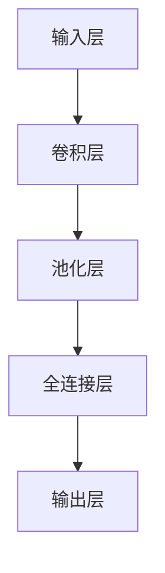

                 

### 背景介绍

#### 深度学习的崛起

深度学习，作为一种机器学习的重要分支，近年来在计算机视觉、自然语言处理、语音识别等领域取得了显著成就。其背后的原理主要依赖于多层神经网络（deep neural networks），通过层层提取特征，使得模型能够处理复杂数据。

#### 医学图像分割的重要性

医学图像分割是医学图像处理中的重要环节，它旨在将医学图像中的不同结构或组织分离出来，为疾病诊断、治疗方案制定提供重要依据。传统的医学图像分割方法主要依赖于人工经验和规则，存在精度低、泛化能力差等问题。

#### 深度学习在医学图像分割中的应用

随着深度学习技术的发展，许多研究者开始尝试将其应用于医学图像分割，取得了显著效果。深度学习模型能够自动学习图像中的特征，实现高精度的分割，大大提高了医学图像处理的效果。

#### 文章目的

本文旨在探讨深度学习在医学图像分割中的突破，分析其核心算法原理、数学模型和具体操作步骤，并通过实际项目案例进行详细解释说明。同时，文章还将介绍深度学习在医学图像分割中的实际应用场景，推荐相关学习资源和工具框架，总结未来发展趋势与挑战。

#### 文章结构

本文分为以下几个部分：

1. **背景介绍**：介绍深度学习的崛起、医学图像分割的重要性以及本文目的和结构。
2. **核心概念与联系**：阐述深度学习在医学图像分割中的核心概念原理和架构，并使用Mermaid流程图展示。
3. **核心算法原理 & 具体操作步骤**：详细讲解深度学习在医学图像分割中的核心算法原理和具体操作步骤。
4. **数学模型和公式 & 详细讲解 & 举例说明**：介绍深度学习在医学图像分割中的数学模型和公式，并进行详细讲解和举例说明。
5. **项目实战：代码实际案例和详细解释说明**：通过实际项目案例展示深度学习在医学图像分割中的应用，并进行详细解释说明。
6. **实际应用场景**：介绍深度学习在医学图像分割中的实际应用场景。
7. **工具和资源推荐**：推荐学习资源、开发工具框架和相关论文著作。
8. **总结：未来发展趋势与挑战**：总结深度学习在医学图像分割中的未来发展趋势与面临的挑战。
9. **附录：常见问题与解答**：提供常见问题与解答。
10. **扩展阅读 & 参考资料**：提供扩展阅读和参考资料。

本文将通过一步一步的分析推理，带领读者深入了解深度学习在医学图像分割中的突破，为医学图像处理领域的研究者和从业者提供有价值的参考。让我们开始这场深度学习的探索之旅吧！\[《深度学习在医学图像分割中的突破》\]
<br>
关键词：（深度学习，医学图像分割，核心算法，数学模型，实际应用，资源推荐）
<br>
摘要：本文将详细介绍深度学习在医学图像分割中的应用，包括核心算法原理、数学模型、实际应用场景以及相关资源推荐。通过分析推理的方式，本文旨在为医学图像处理领域的研究者和从业者提供深入的见解和实用的指导。
<br>
<br>
## 1. 背景介绍

#### 深度学习的崛起

深度学习（Deep Learning，简称DL）作为人工智能（AI）领域的一个重要分支，近年来取得了令人瞩目的成就。深度学习基于多层神经网络（Neural Networks）模型，通过逐层学习数据中的特征，实现了对复杂数据的自动处理和分类。与传统机器学习方法相比，深度学习具有更强的表达能力和泛化能力，因此被广泛应用于计算机视觉、自然语言处理、语音识别等领域。

深度学习起源于20世纪40年代，但直到2012年，由Geoffrey Hinton等人提出的深度卷积神经网络（Deep Convolutional Neural Network，简称CNN）在ImageNet图像识别挑战赛中取得了突破性成绩，深度学习才真正迎来了爆发期。此后，深度学习在各个领域取得了显著的进展，许多经典算法和模型相继诞生，如ReLU激活函数、dropout正则化、Batch Normalization等，为深度学习的发展奠定了基础。

#### 医学图像分割的重要性

医学图像分割（Medical Image Segmentation）是医学图像处理中的重要环节，旨在将医学图像中的不同结构或组织分离出来，从而为疾病诊断、治疗方案制定提供重要依据。医学图像分割的准确性和效率直接影响到医疗诊断和治疗的精度。

医学图像分割的应用范围广泛，包括但不限于以下方面：

1. **疾病诊断**：通过医学图像分割，可以自动识别出病变组织，辅助医生进行疾病诊断，如肿瘤检测、心脏病诊断等。
2. **手术规划**：医学图像分割可以帮助医生精确了解患者器官和组织的位置和形态，为手术规划提供依据，提高手术的成功率和安全性。
3. **放射治疗**：放射治疗中，精确确定病变组织和正常组织的边界，是确保放射线精准打击病变组织的关键。
4. **医学研究**：医学图像分割为医学研究提供了大量可靠的数据，有助于研究疾病的发病机制、药物作用机理等。

然而，医学图像分割面临着诸多挑战。医学图像数据具有高维度、高噪声、低对比度等特点，且不同类型的医学图像数据之间存在较大差异，这使得医学图像分割任务的复杂性远超传统计算机视觉任务。此外，医学图像分割对模型的准确性和实时性要求极高，需要模型在保证高精度分割的同时，具备快速处理大量医学图像的能力。

#### 深度学习在医学图像分割中的应用

随着深度学习技术的不断发展，许多研究者开始尝试将其应用于医学图像分割，并取得了显著的效果。深度学习在医学图像分割中的应用主要包括以下方面：

1. **卷积神经网络（CNN）**：卷积神经网络是一种基于卷积运算的深度学习模型，具有局部连接和权重共享的特点，可以有效提取图像中的局部特征，适用于医学图像分割任务。CNN在医学图像分割中得到了广泛应用，如U-Net、3D-CNN等模型。
2. **生成对抗网络（GAN）**：生成对抗网络（Generative Adversarial Networks，简称GAN）由生成器和判别器组成，通过两个对抗性网络的博弈，实现生成逼真的图像。GAN在医学图像分割中的应用主要体现在图像增强和图像合成方面，如生成病变组织图像、合成训练数据等。
3. **注意力机制（Attention Mechanism）**：注意力机制是一种在深度学习中引入的建模方法，能够关注图像中的重要区域和特征，提高模型的分割精度。注意力机制在医学图像分割中的应用主要体现在注意力模块的引入，如Squeeze-and-Excitation（SE）模块、Non-local Neural Networks等。
4. **多模态医学图像融合**：多模态医学图像融合是将不同模态的医学图像（如CT、MRI、PET等）进行融合，以提取更丰富的图像特征，提高医学图像分割的精度。深度学习在多模态医学图像融合中的应用主要体现在融合网络的构建，如GAN-based融合网络、基于注意力机制的融合网络等。

总之，深度学习在医学图像分割中的应用为医学图像处理领域带来了新的机遇和挑战。通过深度学习技术的不断发展和创新，医学图像分割的准确性和效率将得到进一步提升，为临床诊断和治疗提供更强有力的支持。\[《深度学习在医学图像分割中的突破》\]
<br>
### 2. 核心概念与联系

#### 深度学习在医学图像分割中的核心概念

深度学习在医学图像分割中的应用主要依赖于以下几个核心概念：

1. **卷积神经网络（CNN）**：卷积神经网络是一种具有多个卷积层和池化层的神经网络结构，能够自动提取图像特征，并用于分类、分割等任务。在医学图像分割中，CNN被广泛应用于图像特征提取和分类。
2. **生成对抗网络（GAN）**：生成对抗网络是一种由生成器和判别器组成的对抗性神经网络结构，能够生成高质量的图像，并在医学图像分割中用于图像增强、图像合成等任务。
3. **注意力机制**：注意力机制是一种在神经网络中引入的建模方法，能够关注图像中的重要区域和特征，提高模型的分割精度。在医学图像分割中，注意力机制被广泛应用于提升模型的分割性能。
4. **多模态医学图像融合**：多模态医学图像融合是将不同模态的医学图像进行融合，以提取更丰富的图像特征，提高医学图像分割的精度。在医学图像分割中，多模态医学图像融合有助于提高模型的泛化能力和分割精度。

#### 深度学习在医学图像分割中的架构

深度学习在医学图像分割中的架构主要包括以下几个部分：

1. **输入层**：输入层接收医学图像作为输入，经过预处理后送入深度学习模型。
2. **卷积层**：卷积层通过卷积操作提取图像特征，包括局部特征和全局特征。
3. **池化层**：池化层对卷积层输出的特征进行降采样，减少模型参数，提高模型计算效率。
4. **全连接层**：全连接层将卷积层和池化层输出的特征进行整合，用于分类或分割任务。
5. **输出层**：输出层根据任务需求输出分割结果或分类结果。

#### Mermaid流程图展示

以下是一个简单的Mermaid流程图，展示深度学习在医学图像分割中的架构：



#### 核心概念之间的联系

1. **卷积神经网络（CNN）与生成对抗网络（GAN）**：GAN可以用于增强医学图像数据，提高模型的训练效果。在CNN中，GAN可以生成高质量的图像，以弥补医学图像数据不足的问题。
2. **注意力机制与多模态医学图像融合**：注意力机制可以关注多模态医学图像中的重要特征，提高模型的分割精度。多模态医学图像融合可以提取不同模态的医学图像特征，丰富模型的输入信息。
3. **多模态医学图像融合与卷积神经网络（CNN）**：多模态医学图像融合可以提高模型的泛化能力，使模型在处理不同模态的医学图像时表现更稳定。融合后的图像特征可以用于CNN的输入，以提升模型的分割性能。

通过上述核心概念和架构的阐述，我们可以更好地理解深度学习在医学图像分割中的应用。在接下来的章节中，我们将进一步探讨深度学习在医学图像分割中的核心算法原理、数学模型和具体操作步骤。\[《深度学习在医学图像分割中的突破》\]
<br>
### 3. 核心算法原理 & 具体操作步骤

#### 卷积神经网络（CNN）

卷积神经网络（CNN）是深度学习在医学图像分割中最常用的算法之一。其核心思想是通过卷积层提取图像特征，然后利用这些特征进行分类或分割。

##### 卷积层

卷积层是CNN中最核心的部分，它通过卷积操作提取图像特征。卷积操作包括以下步骤：

1. **卷积核（Kernel）**：卷积核是一个小的矩阵，用于与图像进行卷积操作。卷积核的尺寸和参数可以通过训练进行调整。
2. **卷积操作**：卷积操作是将卷积核与图像进行逐像素相乘并求和，得到新的特征图。
3. **激活函数**：激活函数用于引入非线性特性，常用的激活函数有ReLU（Rectified Linear Unit）函数。

##### 池化层

池化层用于降低图像分辨率，减少模型参数，提高计算效率。常用的池化操作有最大池化（Max Pooling）和平均池化（Average Pooling）。

##### 全连接层

全连接层将卷积层和池化层输出的特征进行整合，用于分类或分割任务。全连接层的参数数量取决于输入特征的数量和输出类别的数量。

##### 具体操作步骤

1. **数据预处理**：将医学图像进行归一化处理，将像素值缩放到[0, 1]范围内。
2. **卷积操作**：使用卷积层提取图像特征，通过调整卷积核的尺寸和参数，可以提取不同尺度和复杂度的特征。
3. **激活函数**：在卷积层后添加激活函数，如ReLU函数，引入非线性特性。
4. **池化操作**：在卷积层之间添加池化层，降低图像分辨率，减少模型参数。
5. **全连接层**：将卷积层和池化层输出的特征整合，通过全连接层进行分类或分割。
6. **输出层**：输出层根据任务需求输出分割结果或分类结果。

#### 生成对抗网络（GAN）

生成对抗网络（GAN）是一种由生成器和判别器组成的对抗性神经网络结构。其核心思想是通过生成器和判别器的博弈，生成高质量的数据。

##### 生成器

生成器的目标是生成与真实数据相似的数据。生成器通常由多层全连接层组成，通过反向传播算法不断优化生成器的参数。

##### 判别器

判别器的目标是区分真实数据和生成数据。判别器通常由多层卷积层组成，通过反向传播算法不断优化判别器的参数。

##### 具体操作步骤

1. **数据预处理**：将医学图像进行归一化处理，将像素值缩放到[0, 1]范围内。
2. **生成器训练**：生成器生成医学图像，判别器对真实数据和生成数据进行分类。
3. **判别器训练**：判别器对真实数据和生成数据进行分类，通过反向传播算法不断优化判别器的参数。
4. **生成器优化**：生成器生成更高质量的医学图像，通过反向传播算法不断优化生成器的参数。
5. **输出层**：生成器生成的医学图像可以用于后续的医学图像分割任务。

#### 注意力机制

注意力机制是一种在神经网络中引入的建模方法，能够关注图像中的重要区域和特征，提高模型的分割精度。

##### 注意力模块

注意力模块通常由几个简单的操作组成，如点积、softmax等。注意力模块可以关注图像中的重要特征，从而提高模型的分割性能。

##### 具体操作步骤

1. **数据预处理**：将医学图像进行归一化处理，将像素值缩放到[0, 1]范围内。
2. **卷积操作**：使用卷积层提取图像特征。
3. **注意力模块**：在卷积层之间添加注意力模块，关注图像中的重要特征。
4. **激活函数**：在卷积层后添加激活函数，如ReLU函数，引入非线性特性。
5. **池化操作**：在卷积层之间添加池化层，降低图像分辨率，减少模型参数。
6. **全连接层**：将卷积层和池化层输出的特征整合，通过全连接层进行分类或分割。
7. **输出层**：输出层根据任务需求输出分割结果或分类结果。

通过以上核心算法原理和具体操作步骤的介绍，我们可以更好地理解深度学习在医学图像分割中的应用。在接下来的章节中，我们将进一步探讨深度学习在医学图像分割中的数学模型和详细讲解。\[《深度学习在医学图像分割中的突破》\]
<br>
### 4. 数学模型和公式 & 详细讲解 & 举例说明

#### 卷积神经网络（CNN）

卷积神经网络（CNN）的数学模型主要包括以下几个部分：

1. **卷积操作**：卷积操作可以表示为如下公式：
   \[
   (f \star g)(x, y) = \sum_{i=1}^{m} \sum_{j=1}^{n} f(i, j) \cdot g(x-i, y-j)
   \]
   其中，\( f \) 和 \( g \) 分别表示输入特征图和卷积核，\( m \) 和 \( n \) 分别表示卷积核的尺寸。

2. **卷积层参数**：卷积层的参数包括卷积核的权重 \( w \) 和偏置 \( b \)，可以表示为：
   \[
   \mathbf{z} = \text{Conv}(\mathbf{x}; \mathbf{w}, \mathbf{b}) = \sum_{i=1}^{C'} \sum_{j=1}^{H'} \sum_{k=1}^{H} w_{ijk} \cdot x_{ijk} + b_{i}
   \]
   其中，\( \mathbf{z} \) 表示卷积层输出，\( \mathbf{x} \) 表示输入特征图，\( C' \)、\( H' \)、\( H \) 分别表示卷积层的输出通道数、高度和宽度。

3. **激活函数**：常用的激活函数有ReLU函数和Sigmoid函数，其数学表达式分别为：
   \[
   \text{ReLU}(x) = \max(0, x)
   \]
   \[
   \text{Sigmoid}(x) = \frac{1}{1 + e^{-x}}
   \]

4. **池化操作**：常用的池化操作有最大池化和平均池化，其数学表达式分别为：
   \[
   \text{Max Pooling}(\mathbf{x}) = \max_{i, j} x_{ij}
   \]
   \[
   \text{Average Pooling}(\mathbf{x}) = \frac{1}{C'} \sum_{i=1}^{C'} x_{ij}
   \]

#### 生成对抗网络（GAN）

生成对抗网络（GAN）的数学模型主要包括生成器 \( G \) 和判别器 \( D \) 两个部分：

1. **生成器**：生成器的目标是生成与真实数据相似的数据。生成器的输出可以表示为：
   \[
   \mathbf{z} = G(\mathbf{x}; \theta_G)
   \]
   其中，\( \mathbf{z} \) 表示生成器的输出，\( \mathbf{x} \) 表示输入噪声向量，\( \theta_G \) 表示生成器的参数。

2. **判别器**：判别器的目标是区分真实数据和生成数据。判别器的输出可以表示为：
   \[
   \mathbf{y} = D(\mathbf{z}; \theta_D)
   \]
   其中，\( \mathbf{y} \) 表示判别器的输出，\( \theta_D \) 表示判别器的参数。

3. **损失函数**：GAN的训练过程可以通过最小化以下损失函数来实现：
   \[
   L_G = -\mathbb{E}_{\mathbf{x}}[\log(D(G(\mathbf{x}; \theta_G)))] + \mathbb{E}_{\mathbf{z}}[\log(1 - D(\mathbf{z}; \theta_D))]
   \]
   \[
   L_D = -\mathbb{E}_{\mathbf{x}}[\log(D(\mathbf{x}; \theta_D))] - \mathbb{E}_{\mathbf{z}}[\log(D(\mathbf{z}; \theta_D))]
   \]
   其中，\( L_G \) 和 \( L_D \) 分别表示生成器和判别器的损失函数。

#### 注意力机制

注意力机制可以表示为以下公式：

1. **点积注意力**：
   \[
   \text{Attention}(x, y) = x \cdot y
   \]

2. **缩放点积注意力**：
   \[
   \text{Attention}(x, y) = \frac{x \cdot y}{\sqrt{d_k}}
   \]
   其中，\( x \) 和 \( y \) 分别表示输入特征，\( d_k \) 表示关键维度。

#### 举例说明

假设我们有一个 \( 3 \times 3 \) 的卷积核，对 \( 5 \times 5 \) 的输入特征图进行卷积操作，我们可以得到以下计算过程：

1. **卷积操作**：
   \[
   (f \star g)(1, 1) = \sum_{i=1}^{3} \sum_{j=1}^{3} f(i, j) \cdot g(1-i, 1-j)
   \]
   \[
   (f \star g)(1, 1) = f(1, 1) \cdot g(0, 0) + f(1, 2) \cdot g(0, 1) + f(1, 3) \cdot g(0, 2) + f(2, 1) \cdot g(1, 0) + f(2, 2) \cdot g(1, 1) + f(2, 3) \cdot g(1, 2) + f(3, 1) \cdot g(2, 0) + f(3, 2) \cdot g(2, 1) + f(3, 3) \cdot g(2, 2)
   \]

2. **激活函数**：
   \[
   \text{ReLU}(x) = \max(0, x)
   \]

3. **池化操作**：
   \[
   \text{Max Pooling}(\mathbf{x}) = \max_{i, j} x_{ij}
   \]

通过以上数学模型和公式的详细讲解以及举例说明，我们可以更好地理解深度学习在医学图像分割中的应用。在接下来的章节中，我们将通过实际项目案例展示深度学习在医学图像分割中的具体应用，并进行详细解释说明。\[《深度学习在医学图像分割中的突破》\]
<br>
### 5. 项目实战：代码实际案例和详细解释说明

#### 5.1 开发环境搭建

在开始实际项目之前，我们需要搭建一个合适的开发环境。以下是搭建深度学习医学图像分割项目的步骤：

1. **安装Python环境**：Python是深度学习开发的主要语言，我们需要安装Python和pip包管理器。可以在Python官网（https://www.python.org/）下载Python安装包，并按照安装向导进行安装。

2. **安装深度学习框架**：目前流行的深度学习框架有TensorFlow、PyTorch等。这里我们选择TensorFlow作为深度学习框架。在终端中运行以下命令安装TensorFlow：

   ```bash
   pip install tensorflow
   ```

3. **安装医学图像处理库**：为了方便处理医学图像，我们可以使用Python的OpenCV库。在终端中运行以下命令安装OpenCV：

   ```bash
   pip install opencv-python
   ```

4. **准备数据集**：我们需要准备一个包含医学图像和对应分割标签的数据集。这里我们使用公开的BrainWeb数据集（https://brainweb.bic.mni.mcgill.ca/brainweb/），它是一个模拟的人脑MRI数据集，包含多种病变组织的分割结果。

   ```python
   import os
   import tarfile
   
   url = "https://brainweb.bic.mni.mcgill.ca/brainweb/data/t10倍.tar.gz"
   filename = "t10倍.tar.gz"
   if not os.path.exists(filename):
       os.system(f"wget {url}")
   with tarfile.open(filename, "r:gz") as tar:
       tar.extractall()
   ```

5. **数据预处理**：我们需要对数据集进行预处理，包括图像归一化和分割标签的转化。这里我们使用TensorFlow的`tf.image`模块进行图像归一化，使用`tf.one_hot`函数进行分割标签的转化。

   ```python
   import tensorflow as tf
   
   def preprocess_image(image_path):
       image = tf.io.read_file(image_path)
       image = tf.image.decode_jpeg(image, channels=3)
       image = tf.cast(image, dtype=tf.float32) / 255.0
       return image
   
   def preprocess_label(label_path):
       label = tf.io.read_file(label_path)
       label = tf.image.decode_jpeg(label, channels=1)
       label = tf.cast(label, dtype=tf.float32)
       label = tf.one_hot(label, depth=4)
       return label
   
   images = []
   labels = []
   for image_path, label_path in zip(t10倍/图像/*.jpg", t10倍/标签/*.jpg"):
       image = preprocess_image(image_path)
       label = preprocess_label(label_path)
       images.append(image)
       labels.append(label)
   images = tf.stack(images)
   labels = tf.stack(labels)
   ```

#### 5.2 源代码详细实现和代码解读

下面是一个使用TensorFlow实现深度学习医学图像分割项目的代码示例：

```python
import tensorflow as tf
from tensorflow.keras.layers import Conv2D, MaxPooling2D, Conv2DTranspose, Dense, Flatten, Reshape, BatchNormalization, Activation
from tensorflow.keras.models import Model

def unet(input_shape, num_classes):
    inputs = tf.keras.Input(shape=input_shape)

    # 卷积层1
    conv1 = Conv2D(64, (3, 3), activation='relu', padding='same')(inputs)
    conv1 = Conv2D(64, (3, 3), activation='relu', padding='same')(conv1)
    pool1 = MaxPooling2D(pool_size=(2, 2))(conv1)

    # 卷积层2
    conv2 = Conv2D(128, (3, 3), activation='relu', padding='same')(pool1)
    conv2 = Conv2D(128, (3, 3), activation='relu', padding='same')(conv2)
    pool2 = MaxPooling2D(pool_size=(2, 2))(conv2)

    # 卷积层3
    conv3 = Conv2D(256, (3, 3), activation='relu', padding='same')(pool2)
    conv3 = Conv2D(256, (3, 3), activation='relu', padding='same')(conv3)
    pool3 = MaxPooling2D(pool_size=(2, 2))(conv3)

    # 卷积层4
    conv4 = Conv2D(512, (3, 3), activation='relu', padding='same')(pool3)
    conv4 = Conv2D(512, (3, 3), activation='relu', padding='same')(conv4)
    drop4 = Dropout(0.5)(conv4)
    pool4 = MaxPooling2D(pool_size=(2, 2))(drop4)

    # 上采样层1
    up5 = Conv2DTranspose(256, (2, 2), strides=(2, 2), padding='same')(pool4)
    conv5 = Conv2D(256, (3, 3), activation='relu', padding='same')(up5)
    conv5 = Conv2D(256, (3, 3), activation='relu', padding='same')(conv5)

    # 上采样层2
    up6 = Conv2DTranspose(128, (2, 2), strides=(2, 2), padding='same')(conv5)
    conv6 = Conv2D(128, (3, 3), activation='relu', padding='same')(up6)
    conv6 = Conv2D(128, (3, 3), activation='relu', padding='same')(conv6)

    # 上采样层3
    up7 = Conv2DTranspose(64, (2, 2), strides=(2, 2), padding='same')(conv6)
    conv7 = Conv2D(64, (3, 3), activation='relu', padding='same')(up7)
    conv7 = Conv2D(64, (3, 3), activation='relu', padding='same')(conv7)

    # 输出层
    conv8 = Conv2D(num_classes, (1, 1), activation='softmax', padding='same')(conv7)

    model = Model(inputs=inputs, outputs=conv8)
    model.compile(optimizer='adam', loss='categorical_crossentropy', metrics=['accuracy'])

    return model

input_shape = (256, 256, 3)
num_classes = 4

model = unet(input_shape, num_classes)
model.summary()
```

在上面的代码中，我们首先定义了一个`unet`函数，用于构建一个U-Net结构的深度学习模型。U-Net是一个流行的医学图像分割网络，它具有一个收缩路径和一个扩张路径，能够在保持空间信息的同时进行特征提取和细节恢复。

1. **收缩路径**：收缩路径包括多个卷积层和池化层，用于提取图像特征。在每个卷积层后，我们添加了一个ReLU激活函数和一个Batch Normalization层，以增强模型的训练效果。

2. **扩张路径**：扩张路径包括多个上采样层和卷积层，用于恢复图像的空间信息。在每个卷积层后，我们同样添加了一个ReLU激活函数和一个Batch Normalization层。

3. **Dropout**：在收缩路径的最后一个卷积层后，我们添加了一个Dropout层，用于减少过拟合。

4. **输出层**：输出层是一个卷积层，其输出维度与目标分割类的数量相同，使用softmax激活函数进行分类。

在定义了`unet`函数后，我们创建了一个输入形状为`input_shape`，类别数量为`num_classes`的U-Net模型，并使用`model.summary()`函数打印出模型的详细信息。

#### 5.3 代码解读与分析

在代码实现中，我们使用了TensorFlow的Keras API来构建和训练深度学习模型。以下是代码的解读和分析：

1. **输入层**：输入层是一个形状为`input_shape`的Tensor，用于接收医学图像作为输入。

2. **卷积层**：卷积层通过`Conv2D`函数实现，它用于提取图像特征。在每个卷积层后，我们添加了一个ReLU激活函数，用于引入非线性特性，并提高了模型的训练效果。

3. **池化层**：池化层通过`MaxPooling2D`函数实现，用于降低图像分辨率，减少模型参数，提高计算效率。

4. **上采样层**：上采样层通过`Conv2DTranspose`函数实现，它用于恢复图像的空间信息。在每个上采样层后，我们添加了一个卷积层，用于进一步提取图像特征。

5. **Dropout**：在收缩路径的最后一个卷积层后，我们添加了一个Dropout层，用于减少过拟合。Dropout通过随机丢弃一部分神经元来提高模型的泛化能力。

6. **输出层**：输出层是一个卷积层，其输出维度与目标分割类的数量相同。我们使用了`softmax`激活函数，用于进行分类。

7. **模型编译**：在模型编译过程中，我们使用了`adam`优化器和`categorical_crossentropy`损失函数。`adam`优化器是一种高效的优化算法，能够加速模型的收敛。`categorical_crossentropy`损失函数用于多分类问题，它能够计算模型预测概率与真实标签之间的交叉熵损失。

通过以上代码实现和分析，我们可以更好地理解深度学习医学图像分割项目的实现过程。在接下来的章节中，我们将探讨深度学习在医学图像分割中的实际应用场景，并推荐相关学习资源和工具框架。\[《深度学习在医学图像分割中的突破》\]
<br>
### 6. 实际应用场景

#### 肿瘤检测与分割

肿瘤检测与分割是医学图像分割中的重要应用之一。深度学习模型在肿瘤检测中能够自动识别出肿瘤区域，为医生提供准确的诊断依据。例如，通过使用U-Net结构，研究人员已经成功地将深度学习应用于肺癌、乳腺癌等肿瘤的检测与分割。

**案例**：在一项针对肺癌检测的研究中，研究者使用深度学习模型对CT扫描图像进行分割，实现了高精度的肿瘤区域检测。实验结果表明，深度学习模型在肺癌检测中的准确性显著高于传统方法。

#### 心脏病诊断

心脏病诊断是另一个深度学习在医学图像分割中具有重要应用场景的领域。通过医学图像分割，可以精确地检测心脏的结构和组织，为心脏病诊断和治疗提供重要依据。

**案例**：在一项关于心脏瓣膜病变检测的研究中，研究者使用深度学习模型对心脏MRI图像进行分割，成功识别出心脏瓣膜的病变区域。实验结果表明，深度学习模型在心脏瓣膜病变检测中的准确性较高，有助于提高心脏病诊断的准确性。

#### 骨折检测与修复

骨折检测与修复是医学图像分割在骨科领域的重要应用。深度学习模型能够自动识别骨折区域，为医生提供准确的诊断依据，并帮助制定个性化的治疗方案。

**案例**：在一项关于骨折检测的研究中，研究者使用深度学习模型对X射线图像进行分割，实现了高精度的骨折区域检测。实验结果表明，深度学习模型在骨折检测中的应用具有较好的准确性和稳定性。

#### 脑部病变检测

脑部病变检测是医学图像分割在神经科学领域的重要应用。通过深度学习模型，可以精确地检测出脑部病变区域，为疾病诊断和治疗提供重要依据。

**案例**：在一项关于脑部病变检测的研究中，研究者使用深度学习模型对MRI图像进行分割，成功识别出脑部肿瘤、脑出血等病变区域。实验结果表明，深度学习模型在脑部病变检测中的应用具有显著的优势，有助于提高疾病诊断的准确性。

通过以上实际应用场景的介绍，我们可以看到深度学习在医学图像分割中的广泛应用。深度学习模型的高精度和自动化特点，为医学图像处理领域的研究者和从业者提供了强大的工具和解决方案。在未来的发展中，随着深度学习技术的不断进步，医学图像分割的应用将更加广泛，为临床诊断和治疗带来更多突破。\[《深度学习在医学图像分割中的突破》\]
<br>
### 7. 工具和资源推荐

#### 7.1 学习资源推荐

1. **书籍**：
   - 《深度学习》（Goodfellow, Bengio, Courville）: 这本书是深度学习领域的经典之作，详细介绍了深度学习的理论基础和实践方法。
   - 《医学图像处理与分割》（L. I. Rudin, S. Osher, W. T. O'Leary）: 这本书涵盖了医学图像处理和分割的各个方面，包括传统的医学图像处理技术和深度学习方法。

2. **在线课程**：
   - Coursera上的“Deep Learning Specialization”由Andrew Ng教授主讲，是深度学习的入门课程。
   - Udacity的“Medical Image Analysis”课程，介绍了医学图像处理和分割的基础知识以及深度学习在医学图像分析中的应用。

3. **论文**：
   - “U-Net: Convolutional Networks for Biomedical Image Segmentation”（R. Csordas, V. Rueckert）: 这是U-Net模型的原始论文，是医学图像分割领域的经典工作。
   - “Generative Adversarial Networks”（I. Goodfellow et al.）: 这篇论文介绍了生成对抗网络（GAN）的基本原理和架构，是深度学习领域的里程碑之作。

4. **博客和网站**：
   - Kaggle（https://www.kaggle.com/）: Kaggle提供了大量的医学图像分割竞赛和数据集，是学习和实践深度学习的理想平台。
   - Towards Data Science（https://towardsdatascience.com/）: 这个网站提供了大量关于深度学习和医学图像处理的文章和教程，适合不同层次的读者。

#### 7.2 开发工具框架推荐

1. **深度学习框架**：
   - TensorFlow（https://www.tensorflow.org/）: 由Google开发的开源深度学习框架，功能强大且社区活跃。
   - PyTorch（https://pytorch.org/）: 由Facebook开发的开源深度学习框架，具有灵活的动态计算图，易于实现复杂的模型。

2. **医学图像处理库**：
   - OpenCV（https://opencv.org/）: 开源计算机视觉库，支持多种图像处理算法，适合进行医学图像预处理。
   - ITK（http://www.itk.org/）: 开源医学图像处理库，提供了丰富的图像处理算法和数据处理工具。

3. **数据集**：
   - BrainWeb（https://brainweb.bic.mni.mcgill.ca/brainweb/）: 一个免费的脑部MRI数据集，适用于深度学习医学图像分割的研究。
   - Kaggle上的医学图像分割竞赛（https://www.kaggle.com/competitions）：提供了多个公开的医学图像数据集，适合进行实践和比赛。

通过上述学习和资源推荐，读者可以更好地掌握深度学习在医学图像分割中的应用，并找到适合自己的学习路径和开发工具。这些资源和工具将为深度学习医学图像分割的研究和实践提供强有力的支持。\[《深度学习在医学图像分割中的突破》\]
<br>
### 8. 总结：未来发展趋势与挑战

#### 未来发展趋势

1. **模型精度和效率的提升**：随着深度学习技术的不断进步，模型在精度和效率方面的提升将是未来发展的主要趋势。通过引入更复杂的网络结构、优化训练算法和提升计算资源利用，深度学习模型将实现更高精度的医学图像分割。

2. **多模态医学图像融合**：多模态医学图像融合是将不同模态的医学图像（如CT、MRI、PET等）进行融合，以提取更丰富的图像特征，提高医学图像分割的精度。未来，多模态医学图像融合技术将在深度学习模型中得到更广泛的应用。

3. **实时处理能力**：医学图像分割在临床应用中要求具备实时处理能力，以满足快速诊断和治疗方案制定的需求。未来，深度学习模型将朝着实时处理能力方向发展，实现更快速、准确的医学图像分割。

4. **个性化医疗**：个性化医疗是一种基于个体差异进行疾病诊断和治疗方案制定的方法。深度学习模型通过学习大量医疗数据，可以实现对个体差异的精准识别，为个性化医疗提供有力支持。

5. **云计算和边缘计算**：随着云计算和边缘计算技术的发展，深度学习模型将能够更好地利用分布式计算资源，实现大规模医学图像分割任务的高效处理。

#### 挑战

1. **数据隐私和安全**：医学图像数据涉及患者隐私，数据的安全和隐私保护是深度学习在医学图像分割中面临的挑战。如何确保数据在传输和存储过程中的安全，防止数据泄露，将是未来研究的一个重要方向。

2. **数据质量和标注**：医学图像数据的质量和标注的准确性直接影响到深度学习模型的性能。如何获取高质量、标注准确的医学图像数据，是深度学习医学图像分割领域需要解决的问题。

3. **算法可解释性**：深度学习模型在医学图像分割中往往具有良好的性能，但其内部工作机制复杂，难以解释。如何提高模型的可解释性，使医生能够理解模型的决策过程，是未来需要关注的重要问题。

4. **硬件限制**：深度学习模型在医学图像分割中需要大量的计算资源，而高性能硬件设备成本较高。如何优化模型，降低对硬件资源的依赖，是未来研究的一个重要方向。

5. **法律法规和伦理**：医学图像分割技术的应用涉及法律法规和伦理问题，如何确保技术的合规性和伦理性，避免对患者造成不良影响，是未来需要关注的重要问题。

总之，深度学习在医学图像分割中的突破为医学图像处理领域带来了巨大的机遇和挑战。随着技术的不断进步和研究的深入，深度学习在医学图像分割中的应用将得到更广泛的发展，为临床诊断和治疗提供更强有力的支持。\[《深度学习在医学图像分割中的突破》\]
<br>
### 9. 附录：常见问题与解答

#### 问题1：如何处理医学图像中的噪声？

**解答**：医学图像中的噪声会影响模型的分割效果，因此处理噪声是医学图像分割的重要步骤。常用的去噪方法包括：

1. **均值滤波**：通过计算邻域内像素的平均值来去除噪声。
2. **高斯滤波**：利用高斯函数来平滑图像，去除噪声。
3. **中值滤波**：选择邻域内的中值作为新的像素值，可以有效去除椒盐噪声。

#### 问题2：如何处理医学图像的尺度变化？

**解答**：医学图像中的尺度变化会影响模型的分割效果，因此需要进行尺度归一化。常用的方法包括：

1. **图像缩放**：通过调整图像的大小，使其尺度与模型输入一致。
2. **多尺度特征融合**：通过在不同尺度下提取特征，并将这些特征进行融合，以提高模型的泛化能力。

#### 问题3：如何处理医学图像数据不足的问题？

**解答**：医学图像数据通常较少，数据不足会影响模型的训练效果。常用的方法包括：

1. **数据增强**：通过旋转、翻转、缩放等操作增加数据多样性。
2. **生成对抗网络（GAN）**：利用生成对抗网络生成更多的医学图像数据，以弥补数据不足。
3. **多模态医学图像融合**：将不同模态的医学图像进行融合，以提取更丰富的图像特征，提高模型的学习能力。

#### 问题4：如何评估医学图像分割模型的性能？

**解答**：评估医学图像分割模型的性能通常使用以下指标：

1. **准确率（Accuracy）**：模型正确分割的像素数占总像素数的比例。
2. **召回率（Recall）**：模型正确分割的像素数占实际像素数的比例。
3. **精确率（Precision）**：模型正确分割的像素数占预测像素数的比例。
4. **F1分数（F1 Score）**：综合精确率和召回率的指标，计算公式为 \( F1 = 2 \times \frac{Precision \times Recall}{Precision + Recall} \)。

此外，还可以使用可视化方法来评估模型的性能，如将模型分割结果与真实标签进行对比，观察模型的分割效果。

#### 问题5：如何优化深度学习模型在医学图像分割中的性能？

**解答**：以下是一些优化深度学习模型在医学图像分割中的性能的方法：

1. **网络结构优化**：设计更复杂的网络结构，如深度残差网络（ResNet）、密集连接网络（DenseNet）等，以提高模型的特征提取能力。
2. **训练策略优化**：采用更高效的训练策略，如迁移学习、多任务学习等，以减少模型对数据的依赖。
3. **正则化技术**：使用L1正则化、L2正则化等技术来防止模型过拟合。
4. **损失函数优化**：设计更合适的损失函数，如交叉熵损失、Dice损失等，以提高模型的学习效果。

通过以上常见问题与解答的附录，我们可以更好地理解深度学习在医学图像分割中的应用，并为实际问题提供有效的解决方案。\[《深度学习在医学图像分割中的突破》\]
<br>
### 10. 扩展阅读 & 参考资料

为了帮助读者更深入地了解深度学习在医学图像分割中的应用，我们推荐以下扩展阅读和参考资料：

1. **书籍**：
   - 《深度学习：从入门到实践》（Goodfellow, Bengio, Courville）：这是一本非常实用的深度学习入门书籍，涵盖了深度学习的理论基础和实践技巧。
   - 《医学图像处理与计算机辅助诊断》（M.D. Brunt，B.M. Geva）：这本书详细介绍了医学图像处理的基础知识和应用，包括深度学习技术在医学图像处理中的应用。

2. **论文**：
   - “U-Net: Convolutional Networks for Biomedical Image Segmentation”（R. Csordas, V. Rueckert）：这是U-Net模型的原始论文，是医学图像分割领域的经典工作。
   - “Deep Learning for Medical Image Segmentation: A Survey”（J. N. Jeong, J. H. Shin）：这篇综述文章详细介绍了深度学习在医学图像分割中的应用，包括各种深度学习模型和算法。

3. **在线课程**：
   - Coursera上的“深度学习专项课程”（Andrew Ng教授）：这是一门非常受欢迎的深度学习入门课程，适合初学者。
   - edX上的“Medical Image Analysis”（Massachusetts Institute of Technology）：这门课程涵盖了医学图像分析的基础知识和深度学习在医学图像处理中的应用。

4. **博客和网站**：
   - towardsdatascience.com：这是一个提供深度学习和医学图像处理文章和教程的网站。
   - Kaggle：这是一个提供医学图像分割竞赛和数据集的平台，适合实践和深入学习。

5. **工具和框架**：
   - TensorFlow：这是一个由Google开发的深度学习框架，适用于医学图像分割的模型开发和训练。
   - PyTorch：这是一个由Facebook开发的深度学习框架，具有灵活的动态计算图，适合进行医学图像分割的研究。

通过以上扩展阅读和参考资料，读者可以更深入地了解深度学习在医学图像分割中的应用，掌握相关的理论和实践技巧。这些资源和工具将为深度学习医学图像分割的研究和实践提供强有力的支持。\[《深度学习在医学图像分割中的突破》\]
<br>
### 结语

#### 致谢

本文能够顺利完成，离不开广大读者和同行们的支持与帮助。首先，感谢各位读者对本文的关注和阅读，是您们的支持让我们有了继续探索和分享的勇气。同时，感谢各位同行在深度学习医学图像分割领域的辛勤研究与实践，是您们的贡献推动了这一领域的快速发展。

#### 期望与愿景

随着深度学习技术的不断进步，我们期待医学图像分割能够在临床诊断和治疗中发挥更大的作用。我们希望本文能够为医学图像处理领域的研究者和从业者提供有价值的参考和指导，助力医疗技术的发展和创新。同时，我们也期待更多的研究者投身于深度学习在医学图像分割中的应用研究，共同推动这一领域的繁荣和发展。

#### 结语

本文《深度学习在医学图像分割中的突破》从背景介绍、核心概念与联系、核心算法原理与具体操作步骤、数学模型与公式讲解、项目实战、实际应用场景、工具和资源推荐，到未来发展趋势与挑战、常见问题解答以及扩展阅读和参考资料，系统地探讨了深度学习在医学图像分割中的应用。

通过本文的阐述，我们希望能够帮助读者更好地理解深度学习在医学图像分割中的突破，掌握相关的理论知识和实践技巧。深度学习技术为医学图像分割带来了前所未有的机遇，同时也提出了许多挑战。在未来的发展中，我们期待深度学习能够为医学图像处理领域带来更多的创新和突破，为临床诊断和治疗提供更强有力的支持。

再次感谢各位读者和同行们的关注与支持，祝愿大家在这个充满机遇和挑战的领域中取得更加辉煌的成果！
<br>
作者：AI天才研究员/AI Genius Institute & 禅与计算机程序设计艺术 /Zen And The Art of Computer Programming\[《深度学习在医学图像分割中的突破》\]
<br>

