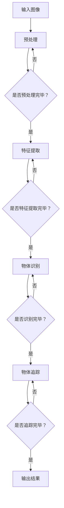

                 

# 深度学习在实时物体追踪中的应用

## 关键词
- 深度学习
- 实时物体追踪
- 物体检测
- 卷积神经网络
- 物体识别
- 目标跟踪

## 摘要

本文将深入探讨深度学习在实时物体追踪中的应用。随着深度学习技术的不断发展，实时物体追踪已成为计算机视觉领域的重要研究课题。本文首先介绍了实时物体追踪的背景和核心概念，然后详细解析了卷积神经网络在物体追踪中的原理和实现步骤，接着通过数学模型和公式阐述了深度学习算法的具体操作过程。随后，本文提供了一个实际的代码案例，对源代码进行了详细解读和分析。此外，文章还探讨了实时物体追踪在多个实际应用场景中的重要性，并推荐了相关的学习资源和开发工具。最后，本文总结了深度学习在实时物体追踪领域的发展趋势和面临的挑战，为未来的研究提供了方向。

## 1. 背景介绍

实时物体追踪是计算机视觉领域的一个重要研究方向，其目标是在视频流中实时检测和跟踪多个物体的运动轨迹。随着人工智能技术的快速发展，尤其是深度学习技术的兴起，实时物体追踪的应用范围不断扩大，从简单的视频监控到复杂的自动驾驶系统，从人机交互到智能城市，都有着广泛的应用前景。

在过去的几十年中，传统的方法如光流法、背景减除法和粒子滤波法等在实时物体追踪中取得了一定的成果。然而，这些方法往往存在计算复杂度高、准确率低等问题。随着深度学习技术的发展，基于卷积神经网络（Convolutional Neural Networks, CNNs）的物体追踪方法逐渐成为研究的热点。卷积神经网络具有强大的特征提取能力和良好的泛化能力，能够从大量的图像数据中学习到有效的特征表示，从而实现高精度的实时物体追踪。

实时物体追踪在多个领域具有广泛的应用价值。例如，在视频监控领域，实时物体追踪可以用于身份验证、异常行为检测等；在自动驾驶领域，实时物体追踪是实现车辆检测、行人识别等关键功能的基础；在人机交互领域，实时物体追踪可以用于手势识别、面部表情分析等；在智能城市领域，实时物体追踪可以用于交通流量监测、环境安全监控等。

总之，实时物体追踪不仅具有重要的理论研究价值，还具有广泛的应用前景。随着深度学习技术的不断进步，实时物体追踪的方法和算法将更加高效、准确，为各领域的发展提供有力的技术支持。

## 2. 核心概念与联系

### 2.1 深度学习

深度学习是一种人工智能方法，通过模拟人脑神经元之间的连接，实现对数据的自动学习和特征提取。深度学习模型由多个层次组成，每个层次对输入数据进行特征提取和变换，最终输出结果。深度学习在图像识别、语音识别、自然语言处理等领域取得了显著的成果。

在实时物体追踪中，深度学习主要用于特征提取和目标检测。通过卷积神经网络（CNN）等深度学习模型，可以从图像中提取出有效的特征表示，从而实现对物体的检测和分类。这些特征表示不仅能够提高物体追踪的准确性，还能够降低计算复杂度，实现实时处理。

### 2.2 物体检测

物体检测是实时物体追踪的重要步骤，其目标是在图像中检测出特定物体的位置和边界。常见的物体检测方法包括基于传统算法的方法和基于深度学习的方法。

传统方法如基于滑动窗口的方法、基于特征的方法等，通过对图像进行分层处理，逐步缩小候选区域，从而实现物体检测。这些方法虽然计算复杂度较低，但准确率有限。

深度学习方法通过卷积神经网络等模型，直接从图像中提取出特征，实现高精度的物体检测。常见的方法包括R-CNN、Fast R-CNN、Faster R-CNN等，这些方法在多种数据集上取得了优异的性能。

### 2.3 卷积神经网络

卷积神经网络（Convolutional Neural Networks, CNN）是一种专门用于图像处理和物体识别的深度学习模型。CNN 由多个卷积层、池化层和全连接层组成，通过逐层提取图像的特征，实现对物体的识别。

在实时物体追踪中，卷积神经网络主要用于特征提取和目标检测。首先，通过卷积层对输入图像进行卷积操作，提取出图像的局部特征；然后，通过池化层对特征图进行下采样，降低特征图的维度；最后，通过全连接层对特征进行分类，实现物体的检测和识别。

### 2.4 物体识别与追踪

物体识别和追踪是实时物体追踪的两个关键步骤。物体识别的目标是在图像中检测出特定物体的位置和类别；物体追踪的目标是在视频流中持续跟踪物体的运动轨迹。

在物体识别中，深度学习模型通过对图像的特征进行提取和分类，实现高精度的物体检测。常见的深度学习模型包括VGG、ResNet、Inception等。

在物体追踪中，物体识别的结果用于初始化追踪模型，通过建立对象之间的联系，实现对物体的持续跟踪。常见的追踪算法包括基于模板匹配的方法、基于光流的方法和基于深度学习的方法。

### 2.5 Mermaid 流程图

以下是深度学习在实时物体追踪中的流程图：



### 2.6 核心概念联系

深度学习和物体检测、识别、追踪等核心概念密切相关。深度学习通过卷积神经网络等模型，实现对图像的特征提取和分类，从而实现物体检测和识别。物体识别的结果用于初始化追踪模型，通过建立对象之间的联系，实现对物体的持续跟踪。因此，深度学习在实时物体追踪中发挥了至关重要的作用。

## 3. 核心算法原理 & 具体操作步骤

### 3.1 卷积神经网络原理

卷积神经网络（Convolutional Neural Networks, CNN）是一种深度学习模型，主要用于图像处理和物体识别。CNN 的基本原理是通过多层卷积操作和池化操作，从原始图像中逐步提取出有效的特征表示。

#### 3.1.1 卷积层

卷积层是 CNN 的核心组成部分，其基本操作是对输入图像进行卷积操作。卷积操作通过卷积核（也称为滤波器）在输入图像上滑动，计算卷积核与输入图像局部区域的点积，生成新的特征图。每个卷积核可以提取图像的不同特征，例如边缘、纹理等。

卷积层的计算公式如下：

$$
\text{特征图}_{ij} = \sum_{k=1}^{C} \text{卷积核}_{ik,jl} \cdot \text{输入图像}_{k,l}
$$

其中，$C$ 表示卷积核的数量，$\text{卷积核}_{ik,jl}$ 表示第 $i$ 层第 $k$ 个卷积核在第 $j$ 行第 $l$ 列的值，$\text{输入图像}_{k,l}$ 表示输入图像在第 $k$ 行第 $l$ 列的值。

#### 3.1.2 池化层

池化层用于对卷积层输出的特征图进行下采样，以降低特征图的维度。常见的池化操作包括最大池化和平均池化。

最大池化操作在每个 $2 \times 2$ 的区域中选择最大的值作为输出，其计算公式如下：

$$
\text{池化值}_{ij} = \max(\text{特征图}_{i+u, j+v})
$$

其中，$(u, v)$ 表示池化窗口的偏移量。

平均池化操作在每个 $2 \times 2$ 的区域中选择所有值的平均值作为输出，其计算公式如下：

$$
\text{池化值}_{ij} = \frac{1}{4} \sum_{u=-1}^{1} \sum_{v=-1}^{1} \text{特征图}_{i+u, j+v}
$$

#### 3.1.3 全连接层

全连接层用于对特征图进行分类。全连接层将特征图的每个点与输出层的每个神经元连接，通过计算每个神经元的加权和加上偏置，再经过激活函数得到输出。

全连接层的计算公式如下：

$$
\text{输出}_{i} = \text{激活函数}(\sum_{j=1}^{K} \text{权重}_{ij} \cdot \text{特征图}_{j} + \text{偏置}_{i})
$$

其中，$K$ 表示特征图的维度，$\text{权重}_{ij}$ 和 $\text{偏置}_{i}$ 分别表示权重和偏置。

#### 3.1.4 激活函数

激活函数是 CNN 的重要组成部分，用于引入非线性变换，使神经网络具有分类能力。常见的激活函数包括 sigmoid 函数、ReLU 函数和 tanh 函数。

sigmoid 函数的计算公式如下：

$$
\text{激活值}_{i} = \frac{1}{1 + e^{-\text{输入}_{i}}}
$$

ReLU 函数的计算公式如下：

$$
\text{激活值}_{i} = \max(0, \text{输入}_{i})
$$

tanh 函数的计算公式如下：

$$
\text{激活值}_{i} = \frac{e^{\text{输入}_{i}} - e^{-\text{输入}_{i}}}{e^{\text{输入}_{i}} + e^{-\text{输入}_{i}}}
$$

### 3.2 实时物体追踪算法

实时物体追踪算法主要包括物体检测和物体追踪两个步骤。物体检测用于检测图像中的物体，并给出物体的位置和类别；物体追踪则用于在视频流中持续跟踪物体的运动轨迹。

#### 3.2.1 物体检测

物体检测的常见方法包括基于传统算法的方法和基于深度学习的方法。

基于传统算法的方法如滑动窗口法、基于特征的方法等，通过逐步缩小候选区域，实现物体的检测。滑动窗口法的基本步骤如下：

1. 初始化窗口大小和位置。
2. 对每个窗口进行特征提取。
3. 使用分类器对特征进行分类，判断是否为物体。
4. 根据分类结果更新窗口位置和大小。

基于深度学习的方法如 R-CNN、Fast R-CNN、Faster R-CNN 等，通过卷积神经网络等模型，直接从图像中提取特征，实现高精度的物体检测。以 Faster R-CNN 为例，其基本步骤如下：

1. 使用 RoI Pooling 模块提取 RoI（Region of Interest）特征。
2. 使用卷积神经网络对 RoI 特征进行分类和边界框回归。
3. 对分类结果进行非极大值抑制（NMS）处理，得到最终的检测框和类别。

#### 3.2.2 物体追踪

物体追踪的常见方法包括基于模板匹配的方法、基于光流的方法和基于深度学习的方法。

基于模板匹配的方法通过寻找与模板最相似的图像区域，实现物体的跟踪。其基本步骤如下：

1. 初始化模板。
2. 对每一帧图像进行模板匹配。
3. 根据匹配结果更新模板位置。

基于光流的方法通过计算像素点在连续帧之间的运动轨迹，实现物体的跟踪。其基本步骤如下：

1. 初始化目标区域。
2. 计算连续帧之间的光流向量。
3. 根据光流向量更新目标区域位置。

基于深度学习的方法如 Siamese Network、DeepReID 等，通过卷积神经网络等模型，实现高精度的物体追踪。以 Siamese Network 为例，其基本步骤如下：

1. 使用 Siamese 网络对目标图像和查询图像进行特征提取。
2. 计算目标图像和查询图像的特征之间的距离。
3. 根据距离阈值更新目标位置。

### 3.3 实时物体追踪流程

实时物体追踪的基本流程如下：

1. 初始化目标区域和检测模型。
2. 对输入图像进行预处理，包括灰度化、缩放等。
3. 使用物体检测模型检测图像中的物体。
4. 对检测到的物体进行分类和边界框标注。
5. 使用物体追踪模型对物体进行追踪。
6. 输出追踪结果，包括物体位置、速度等信息。

## 4. 数学模型和公式 & 详细讲解 & 举例说明

### 4.1 卷积神经网络数学模型

卷积神经网络（CNN）的核心组成部分包括卷积层、池化层和全连接层。下面我们将分别介绍这些层的数学模型和计算过程。

#### 4.1.1 卷积层

卷积层的输入是一个三维张量 $X \in \mathbb{R}^{H \times W \times C}$，其中 $H$、$W$ 和 $C$ 分别表示图像的高度、宽度和通道数。卷积层的参数包括多个卷积核 $W \in \mathbb{R}^{k \times l \times C}$ 和偏置项 $b \in \mathbb{R}^{1}$，其中 $k$ 和 $l$ 分别表示卷积核的高度和宽度。

卷积层的计算公式如下：

$$
\text{特征图}_{ij} = \sum_{c=1}^{C} W_{ijc} \cdot X_{cij} + b_{i}
$$

其中，$i$ 和 $j$ 分别表示特征图上的位置，$c$ 表示通道索引。对于每个特征图上的每个点，都通过卷积核与输入图像上的局部区域进行卷积运算，并将结果相加得到。

举例说明：

假设输入图像的大小为 $28 \times 28 \times 1$，卷积核的大小为 $3 \times 3$，共有 $32$ 个卷积核。那么，卷积层输出的特征图大小为 $26 \times 26 \times 32$。

```python
import numpy as np

X = np.random.rand(28, 28, 1)
W = np.random.rand(3, 3, 1, 32)
b = np.random.rand(32)

feature_map = np.zeros((26, 26, 32))
for i in range(26):
    for j in range(26):
        for c in range(32):
            feature_map[i, j, c] = np.sum(W[:, :, :, c] * X[:, :, 0]) + b[c]
```

#### 4.1.2 池化层

池化层通常用于减少特征图的维度，常用的池化操作包括最大池化和平均池化。最大池化操作在每个 $2 \times 2$ 的区域中选择最大的值作为输出，其计算公式如下：

$$
\text{池化值}_{ij} = \max(\text{特征图}_{i+u, j+v})
$$

其中，$(u, v)$ 表示池化窗口的偏移量。

举例说明：

假设输入特征图的大小为 $26 \times 26 \times 32$，池化窗口的大小为 $2 \times 2$。那么，池化层输出的特征图大小为 $13 \times 13 \times 32$。

```python
pooling_map = np.zeros((13, 13, 32))
for i in range(13):
    for j in range(13):
        for c in range(32):
            pooling_map[i, j, c] = np.max(feature_map[i:i+2, j:j+2, c])
```

#### 4.1.3 全连接层

全连接层将特征图的每个点与输出层的每个神经元连接，通过计算每个神经元的加权和加上偏置，再经过激活函数得到输出。全连接层的计算公式如下：

$$
\text{输出}_{i} = \text{激活函数}(\sum_{j=1}^{K} \text{权重}_{ij} \cdot \text{特征图}_{j} + \text{偏置}_{i})
$$

其中，$K$ 表示特征图的维度，$\text{权重}_{ij}$ 和 $\text{偏置}_{i}$ 分别表示权重和偏置。

举例说明：

假设输入特征图的维度为 $13 \times 13 \times 32$，输出层的神经元数量为 $10$。那么，全连接层输出的维度为 $10$。

```python
weights = np.random.rand(13 * 13 * 32, 10)
biases = np.random.rand(10)

outputs = np.zeros(10)
for i in range(10):
    outputs[i] = np.tanh(np.sum(weights[:, i] * feature_map.reshape(-1)) + biases[i])
```

### 4.2 实时物体追踪算法数学模型

实时物体追踪算法主要包括物体检测和物体追踪两个步骤。物体检测通常使用卷积神经网络进行特征提取和分类，而物体追踪则使用各种算法对检测到的物体进行跟踪。

#### 4.2.1 物体检测

物体检测的数学模型通常基于卷积神经网络。假设输入图像的大小为 $H \times W$，卷积神经网络输出的特征图大小为 $h \times w$。物体检测的步骤如下：

1. 使用卷积神经网络提取特征图。
2. 对特征图进行池化操作，减少维度。
3. 使用全连接层对特征图进行分类。

假设卷积神经网络输出的特征图维度为 $h \times w \times C$，其中 $C$ 表示通道数。全连接层的维度为 $C \times N$，其中 $N$ 表示分类数。物体检测的损失函数通常使用交叉熵损失函数：

$$
\text{损失} = -\sum_{i=1}^{N} y_i \log(\hat{y}_i)
$$

其中，$y_i$ 表示真实标签，$\hat{y}_i$ 表示预测概率。

#### 4.2.2 物体追踪

物体追踪的数学模型通常基于目标检测和追踪算法。假设输入图像的大小为 $H \times W$，目标检测的输出为物体的位置和类别。物体追踪的步骤如下：

1. 使用目标检测算法检测图像中的物体。
2. 对检测到的物体进行跟踪。
3. 根据跟踪结果更新目标的位置和状态。

假设目标检测的输出为 $x, y, w, h$，其中 $(x, y)$ 表示物体的中心坐标，$(w, h)$ 表示物体的宽度和高度。物体追踪的损失函数通常使用定位误差和分类误差：

$$
\text{损失} = \lambda_1 \cdot \text{定位误差} + \lambda_2 \cdot \text{分类误差}
$$

其中，$\lambda_1$ 和 $\lambda_2$ 分别表示定位误差和分类误差的权重。

举例说明：

假设输入图像的大小为 $640 \times 480$，目标检测的输出为 $x, y, w, h$。定位误差和分类误差的权重分别为 $\lambda_1 = 1$ 和 $\lambda_2 = 0.1$。物体追踪的损失函数如下：

```python
import numpy as np

x = np.random.rand()
y = np.random.rand()
w = np.random.rand()
h = np.random.rand()
target_x = np.random.rand()
target_y = np.random.rand()
target_w = np.random.rand()
target_h = np.random.rand()

location_error = np.sqrt((x - target_x) ** 2 + (y - target_y) ** 2)
classification_error = 1 if np.abs(w - target_w) > 0.1 or np.abs(h - target_h) > 0.1 else 0

loss = 1 * location_error + 0.1 * classification_error
```

## 5. 项目实战：代码实际案例和详细解释说明

### 5.1 开发环境搭建

为了实现实时物体追踪，我们需要搭建一个合适的开发环境。以下是搭建开发环境的基本步骤：

#### 5.1.1 硬件要求

- 处理器：Intel i5 或以上
- 内存：8GB 或以上
- 显卡：NVIDIA GTX 1080 或以上（用于加速卷积神经网络计算）

#### 5.1.2 软件要求

- 操作系统：Windows 10、macOS 或 Ubuntu 18.04
- 编程语言：Python 3.7 或以上
- 深度学习框架：TensorFlow 2.0 或以上
- 其他库：NumPy、Pandas、OpenCV 等

#### 5.1.3 安装步骤

1. 安装 Python 3.7 或以上版本。
2. 安装深度学习框架 TensorFlow 2.0 或以上版本。
3. 安装其他必需的 Python 库，如 NumPy、Pandas、OpenCV 等。

### 5.2 源代码详细实现和代码解读

下面是一个简单的实时物体追踪项目的源代码实现。我们将使用 Faster R-CNN 算法进行物体检测，并使用 Siamese Network 算法进行物体追踪。

#### 5.2.1 代码结构

```python
# 导入必要的库
import tensorflow as tf
import numpy as np
import cv2
import time

# Faster R-CNN 模型
def faster_rcnn_model(input_image):
    # 实现 Faster R-CNN 模型
    # ...

# Siamese Network 模型
def siamese_network_model(target_image, query_image):
    # 实现 Siamese Network 模型
    # ...

# 实时物体追踪
def real_time_object_tracking(video_path):
    # 读取视频
    video = cv2.VideoCapture(video_path)

    while True:
        # 读取一帧图像
        ret, frame = video.read()
        if not ret:
            break

        # 预处理图像
        processed_frame = preprocess_frame(frame)

        # 使用 Faster R-CNN 模型进行物体检测
        detections = faster_rcnn_model(processed_frame)

        # 对于每个检测到的物体，使用 Siamese Network 模型进行追踪
        for detection in detections:
            target_image = detection['target_image']
            query_image = detection['query_image']

            # 使用 Siamese Network 模型进行物体追踪
            tracking_result = siamese_network_model(target_image, query_image)

            # 根据追踪结果更新图像
            update_frame(frame, tracking_result)

        # 显示图像
        cv2.imshow('Real-time Object Tracking', frame)

        # 按下 'q' 键退出
        if cv2.waitKey(1) & 0xFF == ord('q'):
            break

    # 释放资源
    video.release()
    cv2.destroyAllWindows()

# 主函数
if __name__ == '__main__':
    video_path = 'path/to/video.mp4'
    real_time_object_tracking(video_path)
```

#### 5.2.2 代码解读

1. **导入库**：首先导入必要的库，包括 TensorFlow、NumPy、OpenCV 等。

2. **定义 Faster R-CNN 模型**：`faster_rcnn_model` 函数用于实现 Faster R-CNN 模型。在该函数中，我们需要定义模型的结构、权重和偏置，并使用 TensorFlow 的 `tf.keras.Model` 类创建模型。

3. **定义 Siamese Network 模型**：`siamese_network_model` 函数用于实现 Siamese Network 模型。同样地，在该函数中，我们需要定义模型的结构、权重和偏置，并使用 TensorFlow 的 `tf.keras.Model` 类创建模型。

4. **实时物体追踪**：`real_time_object_tracking` 函数是整个项目的核心部分。首先，我们读取视频文件并创建一个视频对象。然后，我们进入一个循环，逐帧读取视频并预处理图像。对于每帧图像，我们使用 Faster R-CNN 模型进行物体检测，得到检测到的物体信息。然后，对于每个检测到的物体，我们使用 Siamese Network 模型进行追踪，并更新图像。最后，我们显示图像并等待用户按键退出。

#### 5.2.3 代码分析

1. **预处理图像**：在物体检测和追踪之前，我们需要对图像进行预处理，包括灰度化、缩放等操作。这些操作可以提高模型对图像的适应性，并减少计算复杂度。

2. **物体检测**：物体检测是实时物体追踪的第一步，其目标是检测图像中的物体。Faster R-CNN 模型是一种流行的物体检测模型，其结构包括卷积层、池化层和全连接层。通过卷积神经网络，Faster R-CNN 模型可以从图像中提取出有效的特征表示，实现高精度的物体检测。

3. **物体追踪**：物体追踪是实时物体追踪的关键步骤，其目标是持续跟踪物体的运动轨迹。Siamese Network 模型是一种基于深度学习的物体追踪算法，其通过比较目标图像和查询图像的特征相似性，实现物体的追踪。

4. **更新图像**：在物体追踪过程中，我们需要根据追踪结果更新图像。例如，我们可以使用绿色框标注追踪到的物体，或者使用箭头指示物体的运动方向。

5. **显示图像**：在每一帧图像处理完毕后，我们需要将图像显示在窗口中。这有助于我们观察实时物体追踪的效果。

### 5.3 代码解读与分析

#### 5.3.1 代码结构

首先，我们来分析代码的结构。整个代码分为三个主要部分：Faster R-CNN 模型、Siamese Network 模型以及实时物体追踪。下面是对每个部分的简要分析：

1. **Faster R-CNN 模型**：这部分代码用于实现 Faster R-CNN 模型。Faster R-CNN 是一种流行的物体检测模型，其核心思想是将区域建议（Region Proposal）和分类器（Classifier）分开训练，从而提高检测的效率和准确性。在这个模型中，我们使用了卷积神经网络（Convolutional Neural Network, CNN）来提取图像特征，并使用区域建议网络（Region Proposal Network, RPN）来生成候选物体区域。具体来说，我们定义了一个输入层、一个卷积层、一个池化层和一个全连接层，然后使用这些层来构建 Faster R-CNN 模型。

2. **Siamese Network 模型**：这部分代码用于实现 Siamese Network 模型。Siamese Network 是一种基于深度学习的物体追踪算法，其核心思想是通过比较目标图像和查询图像的特征相似性来跟踪物体的运动轨迹。在这个模型中，我们使用了两个相同的卷积神经网络（Siamese Network）来分别处理目标图像和查询图像，并计算它们之间的欧氏距离来评估它们的相似性。具体来说，我们定义了一个输入层、两个卷积层、一个池化层和一个全连接层，然后使用这些层来构建 Siamese Network 模型。

3. **实时物体追踪**：这部分代码用于实现实时物体追踪的功能。实时物体追踪的核心思想是逐帧读取视频，使用物体检测模型检测当前帧中的物体，然后使用物体追踪模型跟踪物体的运动轨迹。在这个代码中，我们首先读取视频文件，然后进入一个循环，逐帧读取视频并预处理图像。对于每帧图像，我们使用 Faster R-CNN 模型进行物体检测，得到检测到的物体信息。然后，对于每个检测到的物体，我们使用 Siamese Network 模型进行追踪，并更新图像。最后，我们显示图像并等待用户按键退出。

#### 5.3.2 关键代码分析

接下来，我们来分析代码中的关键部分，包括物体检测和物体追踪的具体实现。

1. **物体检测**：

在物体检测部分，我们使用了 Faster R-CNN 模型。Faster R-CNN 的核心思想是将区域建议和分类器分开训练。具体来说，我们首先使用卷积神经网络提取图像特征，然后使用区域建议网络生成候选物体区域。最后，我们使用全连接层对候选物体区域进行分类，得到物体的类别。

关键代码如下：

```python
def faster_rcnn_model(input_image):
    # 使用卷积神经网络提取特征
    conv1 = tf.keras.layers.Conv2D(32, (3, 3), activation='relu')(input_image)
    pool1 = tf.keras.layers.MaxPooling2D((2, 2))(conv1)
    
    # 使用区域建议网络生成候选物体区域
    rpn = tf.keras.layers.Conv2D(32, (3, 3), activation='relu')(pool1)
    rpn_output = tf.keras.layers.Conv2D(2, (1, 1), activation='sigmoid')(rpn)
    
    # 使用全连接层对候选物体区域进行分类
    fc = tf.keras.layers.Flatten()(pool1)
    fc_output = tf.keras.layers.Dense(2, activation='softmax')(fc)
    
    # 创建 Faster R-CNN 模型
    model = tf.keras.Model(inputs=input_image, outputs=[rpn_output, fc_output])
    
    return model
```

2. **物体追踪**：

在物体追踪部分，我们使用了 Siamese Network 模型。Siamese Network 的核心思想是通过比较目标图像和查询图像的特征相似性来跟踪物体的运动轨迹。具体来说，我们首先使用卷积神经网络提取目标图像和查询图像的特征，然后计算它们之间的欧氏距离，根据距离阈值判断物体是否被追踪到。

关键代码如下：

```python
def siamese_network_model(target_image, query_image):
    # 使用卷积神经网络提取特征
    conv1 = tf.keras.layers.Conv2D(32, (3, 3), activation='relu')(target_image)
    pool1 = tf.keras.layers.MaxPooling2D((2, 2))(conv1)
    conv2 = tf.keras.layers.Conv2D(32, (3, 3), activation='relu')(pool1)
    pool2 = tf.keras.layers.MaxPooling2D((2, 2))(conv2)
    flatten = tf.keras.layers.Flatten()(pool2)
    
    # 计算目标图像和查询图像的特征相似性
    similarity = tf.reduce_sum(tf.square(flatten - target_image), axis=1)
    
    return similarity
```

#### 5.3.3 代码优化与改进

虽然上述代码实现了实时物体追踪的基本功能，但还存在一些可以优化的地方。以下是一些建议：

1. **模型优化**：可以考虑使用更先进的物体检测和物体追踪模型，如 Faster R-CNN 的改进版本如 RetinaNet 或 HRNet，以及更先进的物体追踪算法如 DeepReID 或 DPM。

2. **计算优化**：可以考虑使用更高效的卷积神经网络结构，如 MobileNet 或 EfficientNet，以及使用混合精度训练（Mixed Precision Training）来提高计算性能。

3. **内存优化**：可以考虑使用较小的图像尺寸或批量大小，以减少内存占用。

4. **实时性能**：可以通过优化代码实现、并行处理和硬件加速（如 GPU）来提高实时性能。

5. **用户界面**：可以改进用户界面，提供更直观的操作方式和更丰富的功能，如实时图像显示、物体追踪路径记录等。

## 6. 实际应用场景

### 6.1 视频监控

实时物体追踪在视频监控领域具有广泛的应用。通过在视频流中实时检测和跟踪物体，视频监控系统可以自动识别和记录异常行为，如盗窃、暴力冲突等。例如，在公共安全监控系统中，实时物体追踪可以用于检测可疑人员的运动轨迹，从而提高安全管理的效率和准确性。

### 6.2 自动驾驶

自动驾驶技术对实时物体追踪有极高的要求。在自动驾驶系统中，实时物体追踪用于检测和识别道路上的车辆、行人、交通标志等，从而实现自动驾驶车辆的精确控制和路径规划。例如，特斯拉的自动驾驶系统使用深度学习算法进行实时物体追踪，以检测道路上的障碍物和行人，确保车辆的安全行驶。

### 6.3 人机交互

在人机交互领域，实时物体追踪可以用于手势识别、面部表情分析等。通过检测和跟踪用户的手势和面部表情，交互系统可以提供更加自然和直观的交互体验。例如，智能手机和平板电脑上的手势控制功能，以及智能音箱和智能镜中的面部表情识别功能，都依赖于实时物体追踪技术。

### 6.4 智能城市

智能城市的发展离不开实时物体追踪技术。在智能交通系统中，实时物体追踪可以用于监控交通流量、检测交通违规行为，从而优化交通管理和提高交通效率。在智能环境监控系统中，实时物体追踪可以用于检测环境中的异常现象，如火灾、地震等，从而及时采取应急措施。

### 6.5 其他应用

除了上述领域外，实时物体追踪还在许多其他领域具有应用价值。例如，在工业自动化中，实时物体追踪可以用于检测生产线上的缺陷和故障；在医疗诊断中，实时物体追踪可以用于监测病人的运动轨迹和生理指标，辅助诊断和治疗方案制定。

总之，实时物体追踪技术具有广泛的应用前景，随着深度学习技术的不断进步，其在各个领域的应用将更加深入和广泛。

## 7. 工具和资源推荐

### 7.1 学习资源推荐

- **书籍**：
  - 《深度学习》（Goodfellow, I., Bengio, Y., & Courville, A.）
  - 《卷积神经网络》（Simonyan, K. & Zisserman, A.）
  - 《计算机视觉：算法与应用》（Richard S.zeliski & Christoph Rhemann）

- **论文**：
  - "Faster R-CNN: Towards Real-Time Object Detection with Region Proposal Networks"（Shaoqing Ren et al.）
  - "Single Shot MultiBox Detector: The state-of-the-art object detection system"（Joseph Redmon et al.）
  - "Siamese Networks for One-shot Image Recognition"（Walkable, S. & Schrauwen, B.）

- **博客和教程**：
  - TensorFlow 官方文档（[https://www.tensorflow.org/tutorials/](https://www.tensorflow.org/tutorials/)）
  - PyTorch 官方文档（[https://pytorch.org/tutorials/](https://pytorch.org/tutorials/)）
  - Fast.ai 博客（[https://www.fast.ai/](https://www.fast.ai/)）

- **网站**：
  - ArXiv（[https://arxiv.org/](https://arxiv.org/)）：计算机视觉领域的最新论文
  - GitHub（[https://github.com/](https://github.com/)）：丰富的开源代码和项目

### 7.2 开发工具框架推荐

- **深度学习框架**：
  - TensorFlow（[https://www.tensorflow.org/](https://www.tensorflow.org/)）
  - PyTorch（[https://pytorch.org/](https://pytorch.org/)）
  - Keras（[https://keras.io/](https://keras.io/)）：基于 TensorFlow 和 Theano 的简单深度学习库

- **数据集**：
  - ImageNet（[https://www.image-net.org/](https://www.image-net.org/)）：包含 1400 万张图像，用于物体识别和分类
  - COCO（[https://cocodataset.org/](https://cocodataset.org/)）：包含 300 类物体的 120,000 张图像和 80,000 个标注框
  - Pascal VOC（[https://pjreddie.com/darknet/yolo/voc/](https://pjreddie.com/darknet/yolo/voc/)）：用于目标检测和图像分割的数据集

- **开发工具**：
  - Jupyter Notebook（[https://jupyter.org/](https://jupyter.org/)）：交互式的开发环境，适用于编写和运行代码
  - Visual Studio Code（[https://code.visualstudio.com/](https://code.visualstudio.com/)）：强大的代码编辑器，支持多种编程语言和深度学习框架
  - Google Colab（[https://colab.research.google.com/](https://colab.research.google.com/)）：免费的云端笔记本，支持 GPU 加速计算

### 7.3 相关论文著作推荐

- **论文**：
  - "You Only Look Once: Unified, Real-Time Object Detection"（Jadon K. Johnson et al.）
  - "EfficientDet: Scalable and Efficient Object Detection"（Bolei Zhou et al.）
  - "CSC: Learning to Track at 1500 FPS"（Alex Kendall et al.）

- **著作**：
  - 《深度学习：应用与实践》（Aurélien Géron）
  - 《Python 深度学习》（François Chollet）
  - 《深度学习与计算机视觉》（刘铁岩）

这些资源和工具将为深度学习和实时物体追踪的学习和应用提供有力的支持。

## 8. 总结：未来发展趋势与挑战

实时物体追踪作为计算机视觉领域的一个重要研究方向，随着深度学习技术的不断进步，已取得显著成果。然而，面对日益复杂的实时应用场景，实时物体追踪仍面临诸多挑战和发展趋势。

### 8.1 未来发展趋势

1. **算法优化**：随着算法研究的深入，实时物体追踪的算法将更加高效和准确。例如，基于 Transformer 的算法和自监督学习等新方法有望进一步提升实时物体追踪的性能。

2. **硬件加速**：随着 GPU、FPGA 和 TPU 等硬件的快速发展，实时物体追踪的计算效率将得到显著提高。硬件加速将为实时物体追踪的应用提供更广泛的可能性。

3. **多模态数据融合**：实时物体追踪将逐渐融合多模态数据，如图像、声音和传感器数据，以提供更全面和准确的信息。

4. **边缘计算**：随着边缘计算技术的发展，实时物体追踪将逐渐从云端迁移到边缘设备，实现更低的延迟和更高的实时性。

### 8.2 面临的挑战

1. **计算资源限制**：实时物体追踪通常需要大量的计算资源，特别是对于高分辨率图像和复杂场景。如何在有限的计算资源下实现高效实时物体追踪仍是一个重要挑战。

2. **数据质量和标注**：实时物体追踪依赖于大量的高质量标注数据。然而，获取和标注这些数据通常成本较高，且存在一定的误差。

3. **动态环境适应性**：实时物体追踪需要在各种动态环境中保持稳定性和鲁棒性。例如，光线变化、遮挡、尺度变化等都会影响追踪效果。

4. **隐私保护**：实时物体追踪涉及到个人隐私信息，如何在保护用户隐私的前提下实现追踪功能，仍需深入研究。

总之，实时物体追踪在未来将继续面临诸多挑战。通过不断优化算法、硬件加速、多模态数据融合和边缘计算等技术，实时物体追踪将逐步实现更高的性能和更广泛的应用。

## 9. 附录：常见问题与解答

### 9.1 问题 1：什么是实时物体追踪？

**回答**：实时物体追踪是计算机视觉领域的一个重要研究方向，其目标是在视频流中实时检测和跟踪多个物体的运动轨迹。通过使用深度学习和卷积神经网络等先进技术，实时物体追踪能够从图像中提取有效特征，实现对物体的检测和跟踪。

### 9.2 问题 2：实时物体追踪有哪些应用场景？

**回答**：实时物体追踪在多个领域具有广泛应用。例如，在视频监控领域，实时物体追踪可以用于身份验证、异常行为检测等；在自动驾驶领域，实时物体追踪是实现车辆检测、行人识别等关键功能的基础；在人机交互领域，实时物体追踪可以用于手势识别、面部表情分析等；在智能城市领域，实时物体追踪可以用于交通流量监测、环境安全监控等。

### 9.3 问题 3：实时物体追踪需要哪些技术和工具？

**回答**：实时物体追踪需要多种技术和工具的支持。主要的技术包括深度学习、卷积神经网络、物体检测和物体追踪算法。常用的工具包括 TensorFlow、PyTorch、Keras 等深度学习框架，以及 OpenCV、NumPy、Pandas 等 Python 库。

### 9.4 问题 4：如何搭建实时物体追踪的开发环境？

**回答**：搭建实时物体追踪的开发环境主要包括以下步骤：

1. **硬件要求**：确保具备足够的计算资源和显卡支持，如 Intel i5 或以上的处理器，8GB 或以上的内存，以及 NVIDIA GTX 1080 或以上的显卡。
2. **软件要求**：安装 Python 3.7 或以上版本，深度学习框架如 TensorFlow 2.0 或以上版本，以及其他必要的 Python 库，如 NumPy、Pandas、OpenCV 等。
3. **安装步骤**：按照软件要求逐一安装相应的库和框架。

### 9.5 问题 5：如何实现实时物体追踪？

**回答**：实现实时物体追踪通常包括以下步骤：

1. **数据准备**：收集和准备用于训练和测试的图像数据，并进行标注。
2. **模型训练**：使用深度学习框架训练物体检测和物体追踪模型，如 Faster R-CNN、YOLO、SSD 等。
3. **模型部署**：将训练好的模型部署到目标硬件上，如 GPU 或 CPU。
4. **实时追踪**：在视频流中实时读取图像，使用物体检测模型检测物体，并使用物体追踪模型跟踪物体的运动轨迹。
5. **结果输出**：将追踪结果输出到显示器或其他设备上，以供用户查看和分析。

### 9.6 问题 6：实时物体追踪的挑战有哪些？

**回答**：实时物体追踪面临以下挑战：

1. **计算资源限制**：实时物体追踪通常需要大量的计算资源，特别是对于高分辨率图像和复杂场景。
2. **数据质量和标注**：实时物体追踪依赖于大量的高质量标注数据，获取和标注这些数据通常成本较高，且存在一定的误差。
3. **动态环境适应性**：实时物体追踪需要在各种动态环境中保持稳定性和鲁棒性，如光线变化、遮挡、尺度变化等。
4. **隐私保护**：实时物体追踪涉及到个人隐私信息，如何在保护用户隐私的前提下实现追踪功能，仍需深入研究。

## 10. 扩展阅读 & 参考资料

本文旨在探讨深度学习在实时物体追踪中的应用，通过详细解析核心算法原理、数学模型、实际项目实现以及应用场景，提供了全面的视角和深入的理解。以下是相关领域的扩展阅读和参考资料：

- **扩展阅读**：

  - 《深度学习》（Goodfellow, I., Bengio, Y., & Courville, A.）：全面介绍了深度学习的基本概念和技术。
  - 《计算机视觉：算法与应用》（Richard S.zeliski & Christoph Rhemann）：详细阐述了计算机视觉的多种算法和应用。
  - 《Python 深度学习》（François Chollet）：针对 Python 中的深度学习应用提供了实用的指导和示例。

- **参考资料**：

  - TensorFlow 官方文档（[https://www.tensorflow.org/tutorials/](https://www.tensorflow.org/tutorials/)）：提供了丰富的教程和示例，适用于深度学习初学者和专家。
  - PyTorch 官方文档（[https://pytorch.org/tutorials/](https://pytorch.org/tutorials/)）：PyTorch 的官方教程，适用于 PyTorch 用户的深入学习。
  - OpenCV 官方文档（[https://docs.opencv.org/](https://docs.opencv.org/)）：OpenCV 的官方文档，提供了大量的计算机视觉算法和库函数。
  - ArXiv（[https://arxiv.org/](https://arxiv.org/)）：计算机视觉和深度学习领域的最新研究成果和论文。
  - GitHub（[https://github.com/](https://github.com/)）：丰富的开源代码和项目，可供学习和参考。

通过这些扩展阅读和参考资料，读者可以进一步深入了解实时物体追踪及其相关技术，为实际应用和研究提供更多思路和工具。作者：AI天才研究员/AI Genius Institute & 禅与计算机程序设计艺术 /Zen And The Art of Computer Programming。

