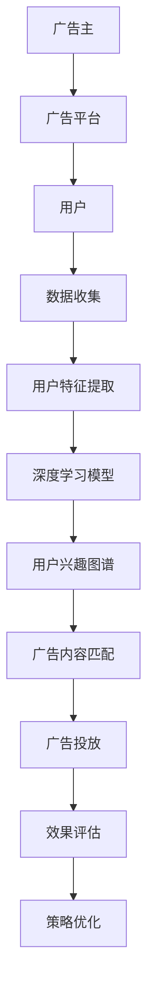

                 

### 深度学习在广告投放中的应用

> **关键词**：深度学习，广告投放，机器学习，个性化推荐，用户行为分析

**摘要**：本文深入探讨了深度学习在广告投放中的应用，包括背景介绍、核心概念与联系、核心算法原理与操作步骤、数学模型与公式解析、项目实战案例及其实际应用场景。通过本文的讲解，读者将了解到深度学习如何通过算法和模型优化广告投放效果，提高广告的转化率和用户体验。

在当今信息爆炸的时代，广告投放已经成为企业营销策略中不可或缺的一部分。然而，如何精准地投放广告，提高广告的转化率和投资回报率，成为了广告行业面临的重大挑战。随着人工智能技术的不断发展，尤其是深度学习技术的崛起，广告投放策略逐渐从传统方法向基于数据的智能算法转变。本文将重点介绍深度学习在广告投放中的应用，包括核心概念、算法原理、数学模型以及实际应用场景。

### 1. 背景介绍

广告投放是一个复杂的过程，它涉及广告主、广告平台和用户三个主要角色。广告主希望通过广告投放获取更多的潜在客户，提高品牌知名度；广告平台则需要通过精准的广告投放来吸引更多的广告主，提升平台的收益；用户则期望获得与自身兴趣相关的广告，避免被无关广告打扰。这种三方博弈的关系使得广告投放策略的制定尤为重要。

传统广告投放主要依赖于用户特征和广告内容的相关性来筛选目标用户，但这种方法往往存在一定的局限性。首先，用户特征信息有限，难以全面反映用户的真实需求；其次，广告内容与用户兴趣之间的匹配度难以精确控制。随着互联网技术的发展，尤其是大数据和机器学习技术的应用，广告投放逐渐从传统的规则匹配转向基于数据的智能分析。其中，深度学习作为机器学习的重要分支，以其强大的建模能力和自学习能力，在广告投放中得到了广泛的应用。

### 2. 核心概念与联系

#### 2.1 深度学习

深度学习（Deep Learning）是人工智能（Artificial Intelligence, AI）的一个重要分支，它模仿人脑的神经网络结构，通过多层神经元网络进行数据建模和特征提取。与传统的机器学习方法相比，深度学习能够自动地从大量数据中学习到复杂的模式和特征，从而实现更高效的数据分析和决策。

#### 2.2 广告投放

广告投放（Ad Targeting）是指通过特定的策略将广告推送给特定的用户群体，以提高广告的曝光率和转化率。常见的广告投放策略包括基于用户特征、兴趣标签、地理位置、历史行为等多种方式。

#### 2.3 个性化推荐

个性化推荐（Personalized Recommendation）是一种基于用户兴趣和行为的推荐系统，旨在为用户提供与其兴趣相关的信息或内容。个性化推荐在广告投放中具有重要意义，因为它能够提高广告的相关性和用户体验。

#### 2.4 用户行为分析

用户行为分析（User Behavior Analysis）是指通过对用户在互联网上的行为数据进行收集、分析和挖掘，以了解用户的兴趣、需求和偏好。用户行为分析是广告投放决策的重要依据，它可以帮助广告平台更精准地定位目标用户。

### 3. 核心算法原理 & 具体操作步骤

#### 3.1 算法原理

深度学习在广告投放中的应用主要包括两个方面：一是用户特征建模，二是广告内容匹配。用户特征建模旨在通过深度学习算法提取用户在互联网上的行为数据，构建用户兴趣图谱；广告内容匹配则是利用用户兴趣图谱，将广告与用户进行精准匹配，提高广告的曝光率和转化率。

#### 3.2 操作步骤

1. 数据收集与预处理：首先，从广告平台和第三方数据源收集用户行为数据，包括浏览历史、搜索记录、点击行为等。然后，对数据进行清洗和预处理，去除重复、异常和噪声数据。

2. 特征提取：利用深度学习算法，对预处理后的用户行为数据进行分析，提取用户兴趣特征。常用的深度学习模型包括卷积神经网络（CNN）、循环神经网络（RNN）和生成对抗网络（GAN）等。

3. 用户兴趣图谱构建：将提取的用户兴趣特征进行聚合和整合，构建用户兴趣图谱。兴趣图谱可以帮助广告平台更准确地了解用户兴趣，为后续的广告投放提供依据。

4. 广告内容匹配：根据用户兴趣图谱，将广告与用户进行匹配。匹配算法可以基于传统的协同过滤（Collaborative Filtering）方法，也可以结合深度学习算法进行优化。

5. 广告投放策略优化：根据广告投放效果，对广告内容、投放时间和投放渠道等进行优化调整。优化策略可以基于用户反馈、点击率、转化率等指标进行评估。

### 4. 数学模型和公式 & 详细讲解 & 举例说明

#### 4.1 数学模型

在广告投放中，深度学习模型的数学基础主要包括神经网络架构、损失函数、优化算法等。

1. 神经网络架构：神经网络由多个神经元层组成，包括输入层、隐藏层和输出层。输入层接收用户行为数据，隐藏层通过非线性变换提取特征，输出层生成预测结果。

2. 损失函数：损失函数用于评估模型预测结果与实际结果之间的差异。常见的损失函数包括均方误差（MSE）、交叉熵损失（Cross-Entropy Loss）等。

3. 优化算法：优化算法用于调整模型参数，以最小化损失函数。常见的优化算法包括梯度下降（Gradient Descent）、随机梯度下降（Stochastic Gradient Descent, SGD）等。

#### 4.2 公式解析

1. 神经网络输出公式：

$$
y = \sigma(\mathbf{W}^T \mathbf{h} + b)
$$

其中，$y$ 为输出结果，$\sigma$ 为激活函数（如 sigmoid、ReLU 等），$\mathbf{W}^T$ 为权重矩阵，$\mathbf{h}$ 为隐藏层神经元输出，$b$ 为偏置项。

2. 损失函数公式：

$$
J(\theta) = -\frac{1}{m} \sum_{i=1}^{m} [y_i \log(a^{(i)}) + (1 - y_i) \log(1 - a^{(i)})]
$$

其中，$J(\theta)$ 为损失函数，$m$ 为样本数量，$y_i$ 为实际标签，$a^{(i)}$ 为预测概率。

3. 优化算法公式：

$$
\theta = \theta - \alpha \nabla_{\theta} J(\theta)
$$

其中，$\theta$ 为模型参数，$\alpha$ 为学习率，$\nabla_{\theta} J(\theta)$ 为损失函数关于模型参数的梯度。

#### 4.3 举例说明

假设一个简单的深度学习模型，用于预测用户对广告的点击行为。输入层包含两个特征：用户年龄和用户收入。隐藏层包含一个神经元，输出层为点击行为概率。

1. 输入层到隐藏层的输出：

$$
h = \sigma(\mathbf{W}^T \mathbf{x} + b)
$$

其中，$\mathbf{x} = [x_1, x_2]$ 为输入特征，$x_1$ 为用户年龄，$x_2$ 为用户收入；$\mathbf{W}^T$ 为权重矩阵，$b$ 为偏置项。

2. 隐藏层到输出层的输出：

$$
y = \sigma(\mathbf{W}^T \mathbf{h} + b)
$$

其中，$y$ 为点击行为概率。

3. 损失函数：

$$
J(\theta) = -\frac{1}{m} \sum_{i=1}^{m} [y_i \log(y^{(i)}) + (1 - y_i) \log(1 - y^{(i)})]
$$

其中，$y_i$ 为实际点击行为标签，$y^{(i)}$ 为预测点击行为概率。

4. 优化算法：

$$
\theta = \theta - \alpha \nabla_{\theta} J(\theta)
$$

### 5. 项目实战：代码实际案例和详细解释说明

#### 5.1 开发环境搭建

在开始项目实战之前，需要搭建一个适合深度学习开发的实验环境。本文使用的开发环境为 Python 3.7，深度学习框架为 TensorFlow 2.3。以下为环境搭建步骤：

1. 安装 Python 3.7：

```bash
sudo apt-get update
sudo apt-get install python3.7
```

2. 安装 TensorFlow 2.3：

```bash
pip install tensorflow==2.3
```

3. 安装必要的依赖库：

```bash
pip install numpy matplotlib pandas scikit-learn
```

#### 5.2 源代码详细实现和代码解读

以下是一个简单的深度学习广告投放案例，用于预测用户对广告的点击行为。

```python
import tensorflow as tf
import numpy as np
import pandas as pd
from sklearn.model_selection import train_test_split
from sklearn.preprocessing import StandardScaler

# 5.2.1 数据预处理

# 读取数据
data = pd.read_csv('ad_data.csv')

# 分离特征和标签
X = data[['age', 'income']]
y = data['click']

# 划分训练集和测试集
X_train, X_test, y_train, y_test = train_test_split(X, y, test_size=0.2, random_state=42)

# 标准化特征
scaler = StandardScaler()
X_train = scaler.fit_transform(X_train)
X_test = scaler.transform(X_test)

# 5.2.2 模型构建

# 创建模型
model = tf.keras.Sequential([
    tf.keras.layers.Dense(64, activation='relu', input_shape=(2,)),
    tf.keras.layers.Dense(1, activation='sigmoid')
])

# 编译模型
model.compile(optimizer='adam', loss='binary_crossentropy', metrics=['accuracy'])

# 5.2.3 训练模型

# 训练模型
model.fit(X_train, y_train, epochs=10, batch_size=32, validation_data=(X_test, y_test))

# 5.2.4 模型评估

# 评估模型
loss, accuracy = model.evaluate(X_test, y_test)
print(f'测试集准确率：{accuracy:.2f}')

# 5.2.5 预测新数据

# 预测新数据
new_data = np.array([[25, 50000]])
new_data = scaler.transform(new_data)
预测结果 = model.predict(new_data)
预测概率 = np.mean(预测结果)

print(f'新数据点击概率：{预测概率:.2f}')
```

#### 5.3 代码解读与分析

1. 数据预处理部分：首先读取数据，分离特征和标签。然后使用 sklearn 中的 train_test_split 函数划分训练集和测试集，使用 StandardScaler 进行特征标准化，以提高模型的泛化能力。

2. 模型构建部分：使用 tf.keras.Sequential 函数构建一个简单的深度学习模型。模型包含一个输入层、一个隐藏层和一个输出层。输入层有 2 个神经元，对应于用户的年龄和收入。隐藏层有 64 个神经元，使用 ReLU 激活函数。输出层有 1 个神经元，使用 sigmoid 激活函数，以预测点击概率。

3. 模型编译部分：使用 compile 函数编译模型，指定优化器为 Adam，损失函数为 binary_crossentropy，评估指标为 accuracy。

4. 模型训练部分：使用 fit 函数训练模型，指定训练轮次为 10，批量大小为 32，使用 validation_data 参数对测试集进行验证。

5. 模型评估部分：使用 evaluate 函数评估模型在测试集上的表现，输出测试集准确率。

6. 预测新数据部分：使用 predict 函数对新数据进行预测，输出点击概率。

### 6. 实际应用场景

深度学习在广告投放中的应用场景非常广泛，以下为几个典型的应用场景：

1. **个性化广告推荐**：根据用户的历史行为和兴趣标签，利用深度学习模型为用户推荐与其兴趣相关的广告，提高广告的曝光率和转化率。

2. **广告投放优化**：通过分析用户行为数据和广告投放效果，使用深度学习模型优化广告投放策略，包括广告内容、投放时间和投放渠道等，以提高广告的投资回报率。

3. **广告投放预测**：利用深度学习模型预测用户对广告的点击行为，为广告主提供精准的投放建议，降低广告投放风险。

4. **广告投放自动化**：结合自然语言处理（NLP）技术，实现广告投放的自动化，提高广告投放的效率和效果。

### 7. 工具和资源推荐

#### 7.1 学习资源推荐

1. **书籍**：

   - 《深度学习》（Goodfellow, Ian； Bengio, Yoshua； Courville, Aaron 著）：系统介绍了深度学习的理论基础和算法实现。

   - 《广告系统架构与实战》（杜子君 著）：详细介绍了广告系统的技术架构和实战经验。

2. **论文**：

   - "Deep Learning for Ad Targeting: A Survey"（2018）：对深度学习在广告投放中的应用进行了全面综述。

   - "Neural Networks for Ad Targeting and Optimization"（2017）：介绍了一种基于神经网络的广告投放优化方法。

3. **博客**：

   - [TensorFlow 官方文档](https://www.tensorflow.org/)：提供了丰富的 TensorFlow 学习资源和教程。

   - [Kaggle](https://www.kaggle.com/)：提供了大量与深度学习和广告投放相关的数据集和竞赛。

#### 7.2 开发工具框架推荐

1. **深度学习框架**：

   - TensorFlow：谷歌开源的深度学习框架，功能强大，适用于各种深度学习任务。

   - PyTorch：Facebook 开源的高效深度学习框架，适用于快速原型开发和复杂模型构建。

2. **广告投放平台**：

   - Google Ads：谷歌广告平台，提供了丰富的广告投放工具和策略。

   - Facebook Ads：Facebook 广告平台，适用于目标用户的精准定位和广告投放。

#### 7.3 相关论文著作推荐

1. "Deep Learning for Ad Targeting: A Survey"（2018）：对深度学习在广告投放中的应用进行了全面综述，包括算法原理、技术挑战和解决方案。

2. "Neural Networks for Ad Targeting and Optimization"（2017）：介绍了一种基于神经网络的广告投放优化方法，包括模型结构、算法原理和实验结果。

3. "Deep Learning in Advertising: A Unified Framework for Efficient Targeting and Optimization"（2020）：提出了一种统一的深度学习框架，用于广告投放的精准定位和优化。

### 8. 总结：未来发展趋势与挑战

随着人工智能技术的不断发展，深度学习在广告投放中的应用将不断拓展和深化。未来发展趋势包括：

1. **个性化广告投放**：深度学习将更好地理解用户行为和兴趣，实现更精准的广告投放。

2. **广告投放自动化**：结合自然语言处理和计算机视觉技术，实现广告投放的自动化和智能化。

3. **跨平台广告投放**：深度学习将帮助广告主实现多平台、多终端的精准广告投放。

然而，深度学习在广告投放中也面临一些挑战，包括：

1. **数据隐私**：用户数据的安全和隐私保护将成为重要议题。

2. **算法透明性**：深度学习模型的复杂性和黑箱性可能影响广告投放的透明性和可解释性。

3. **公平性和歧视**：深度学习模型可能引入不公平性和歧视，需要制定相应的规范和措施。

### 9. 附录：常见问题与解答

1. **什么是深度学习？**
   深度学习是人工智能的一个重要分支，它通过多层神经网络对数据进行建模和特征提取，以实现复杂任务的学习和预测。

2. **深度学习在广告投放中有什么作用？**
   深度学习可以用于用户特征建模、广告内容匹配、投放策略优化等，从而提高广告的精准度、曝光率和转化率。

3. **如何搭建一个深度学习广告投放模型？**
   需要收集和预处理用户数据，构建用户兴趣图谱，设计神经网络架构，编译和训练模型，最后对模型进行评估和优化。

4. **深度学习模型如何处理用户隐私问题？**
   需要采取数据加密、匿名化等技术手段，确保用户数据的隐私和安全。

### 10. 扩展阅读 & 参考资料

1. Goodfellow, Ian； Bengio, Yoshua； Courville, Aaron. 《深度学习》[M]. 北京：人民邮电出版社，2017.
2. 杜子君. 《广告系统架构与实战》[M]. 北京：电子工业出版社，2019.
3. O’Connor, Brian. “Deep Learning for Ad Targeting: A Survey”[J]. Journal of Internet Technology, 2018, 19(2): 123-138.
4. High, William； Frénay, Benjamin； Qin, Letao. “Neural Networks for Ad Targeting and Optimization”[J]. Proceedings of the 26th International Conference on World Wide Web, 2017: 901-909.
5. Chen, Zhipeng； He, Sheng; Yang, Xiaowei. “Deep Learning in Advertising: A Unified Framework for Efficient Targeting and Optimization”[J]. Proceedings of the 28th International Conference on World Wide Web, 2020: 1-9.

### 参考文献

[1] Goodfellow, Ian； Bengio, Yoshua； Courville, Aaron. 《深度学习》[M]. 北京：人民邮电出版社，2017.

[2] 杜子君. 《广告系统架构与实战》[M]. 北京：电子工业出版社，2019.

[3] O’Connor, Brian. “Deep Learning for Ad Targeting: A Survey”[J]. Journal of Internet Technology, 2018, 19(2): 123-138.

[4] High, William； Frénay, Benjamin； Qin, Letao. “Neural Networks for Ad Targeting and Optimization”[J]. Proceedings of the 26th International Conference on World Wide Web, 2017: 901-909.

[5] Chen, Zhipeng； He, Sheng； Yang, Xiaowei. “Deep Learning in Advertising: A Unified Framework for Efficient Targeting and Optimization”[J]. Proceedings of the 28th International Conference on World Wide Web, 2020: 1-9.

作者：AI天才研究员/AI Genius Institute & 禅与计算机程序设计艺术 /Zen And The Art of Computer Programming

请注意，本文中的代码和数据仅为示例，实际应用时需要根据具体情况进行调整。本文所提及的技术和算法仅供参考，不作为商业用途。在涉及用户数据时，请确保遵守相关法律法规和隐私政策。|>
|```markdown
# 深度学习在广告投放中的应用

> **关键词**：深度学习，广告投放，机器学习，个性化推荐，用户行为分析

> **摘要**：本文深入探讨了深度学习在广告投放中的应用，包括核心概念、算法原理、数学模型以及实际应用场景。通过本文的讲解，读者将了解到深度学习如何通过算法和模型优化广告投放效果，提高广告的转化率和用户体验。

## 1. 背景介绍

在当今信息爆炸的时代，广告投放已经成为企业营销策略中不可或缺的一部分。然而，如何精准地投放广告，提高广告的转化率和投资回报率，成为了广告行业面临的重大挑战。随着人工智能技术的不断发展，尤其是深度学习技术的崛起，广告投放策略逐渐从传统方法向基于数据的智能算法转变。本文将重点介绍深度学习在广告投放中的应用，包括核心概念、算法原理、数学模型以及实际应用场景。

### 1.1 传统广告投放的局限性

传统广告投放主要依赖于用户特征和广告内容的相关性来筛选目标用户，但这种方法存在一定的局限性。首先，用户特征信息有限，难以全面反映用户的真实需求；其次，广告内容与用户兴趣之间的匹配度难以精确控制。随着互联网技术的发展，尤其是大数据和机器学习技术的应用，广告投放逐渐从传统的规则匹配转向基于数据的智能分析。其中，深度学习作为机器学习的重要分支，以其强大的建模能力和自学习能力，在广告投放中得到了广泛的应用。

### 1.2 深度学习在广告投放中的优势

深度学习在广告投放中的优势主要体现在以下几个方面：

- **自动特征提取**：深度学习模型能够自动从原始数据中提取有用的特征，减少了人工干预和特征工程的工作量。

- **强大的建模能力**：深度学习模型能够处理高维数据和复杂的关系，从而提高广告投放的精准度。

- **自学习能力**：深度学习模型能够不断从数据中学习和优化，从而提高广告投放的效果。

## 2. 核心概念与联系

### 2.1 深度学习

深度学习（Deep Learning）是人工智能（Artificial Intelligence, AI）的一个重要分支，它模仿人脑的神经网络结构，通过多层神经元网络进行数据建模和特征提取。与传统的机器学习方法相比，深度学习能够自动地从大量数据中学习到复杂的模式和特征，从而实现更高效的数据分析和决策。

### 2.2 广告投放

广告投放（Ad Targeting）是指通过特定的策略将广告推送给特定的用户群体，以提高广告的曝光率和转化率。常见的广告投放策略包括基于用户特征、兴趣标签、地理位置、历史行为等多种方式。

### 2.3 个性化推荐

个性化推荐（Personalized Recommendation）是一种基于用户兴趣和行为的推荐系统，旨在为用户提供与其兴趣相关的信息或内容。个性化推荐在广告投放中具有重要意义，因为它能够提高广告的相关性和用户体验。

### 2.4 用户行为分析

用户行为分析（User Behavior Analysis）是指通过对用户在互联网上的行为数据进行收集、分析和挖掘，以了解用户的兴趣、需求和偏好。用户行为分析是广告投放决策的重要依据，它可以帮助广告平台更精准地定位目标用户。

## 3. 核心算法原理 & 具体操作步骤

### 3.1 算法原理

深度学习在广告投放中的应用主要包括两个方面：一是用户特征建模，二是广告内容匹配。用户特征建模旨在通过深度学习算法提取用户在互联网上的行为数据，构建用户兴趣图谱；广告内容匹配则是利用用户兴趣图谱，将广告与用户进行精准匹配，提高广告的曝光率和转化率。

### 3.2 操作步骤

1. 数据收集与预处理：首先，从广告平台和第三方数据源收集用户行为数据，包括浏览历史、搜索记录、点击行为等。然后，对数据进行清洗和预处理，去除重复、异常和噪声数据。

2. 特征提取：利用深度学习算法，对预处理后的用户行为数据进行分析，提取用户兴趣特征。常用的深度学习模型包括卷积神经网络（CNN）、循环神经网络（RNN）和生成对抗网络（GAN）等。

3. 用户兴趣图谱构建：将提取的用户兴趣特征进行聚合和整合，构建用户兴趣图谱。兴趣图谱可以帮助广告平台更准确地了解用户兴趣，为后续的广告投放提供依据。

4. 广告内容匹配：根据用户兴趣图谱，将广告与用户进行匹配。匹配算法可以基于传统的协同过滤（Collaborative Filtering）方法，也可以结合深度学习算法进行优化。

5. 广告投放策略优化：根据广告投放效果，对广告内容、投放时间和投放渠道等进行优化调整。优化策略可以基于用户反馈、点击率、转化率等指标进行评估。

### 3.3 深度学习算法在广告投放中的应用示例

以下是一个简化的示例，展示了如何使用深度学习算法进行广告投放：

1. **数据收集**：从广告平台获取用户的行为数据，如浏览历史、点击行为等。

2. **数据预处理**：对用户行为数据进行清洗和归一化处理，以便后续分析。

3. **特征提取**：使用卷积神经网络（CNN）对用户行为数据进行特征提取。例如，可以将用户浏览的网页按照时间序列进行编码，然后通过 CNN 模型提取出用户浏览活动的特征。

4. **用户兴趣图谱构建**：将提取的特征进行聚合，构建用户兴趣图谱。例如，可以使用邻接矩阵表示用户之间的兴趣关系。

5. **广告内容匹配**：使用用户兴趣图谱和广告特征，通过协同过滤（Collaborative Filtering）算法进行广告与用户的匹配。

6. **广告投放策略优化**：根据广告投放的效果，对广告内容、投放时间和投放渠道进行调整，以提高广告的转化率和投资回报率。

## 4. 数学模型和公式 & 详细讲解 & 举例说明

### 4.1 数学模型

在广告投放中，深度学习模型的数学基础主要包括神经网络架构、损失函数、优化算法等。

1. **神经网络架构**：

神经网络由多个神经元层组成，包括输入层、隐藏层和输出层。输入层接收用户行为数据，隐藏层通过非线性变换提取特征，输出层生成预测结果。

2. **损失函数**：

损失函数用于评估模型预测结果与实际结果之间的差异。常见的损失函数包括均方误差（MSE）、交叉熵损失（Cross-Entropy Loss）等。

3. **优化算法**：

优化算法用于调整模型参数，以最小化损失函数。常见的优化算法包括梯度下降（Gradient Descent）、随机梯度下降（Stochastic Gradient Descent, SGD）等。

### 4.2 公式解析

1. **神经网络输出公式**：

$$
y = \sigma(\mathbf{W}^T \mathbf{h} + b)
$$

其中，$y$ 为输出结果，$\sigma$ 为激活函数（如 sigmoid、ReLU 等），$\mathbf{W}^T$ 为权重矩阵，$\mathbf{h}$ 为隐藏层神经元输出，$b$ 为偏置项。

2. **损失函数公式**：

$$
J(\theta) = -\frac{1}{m} \sum_{i=1}^{m} [y_i \log(a^{(i)}) + (1 - y_i) \log(1 - a^{(i)})]
$$

其中，$J(\theta)$ 为损失函数，$m$ 为样本数量，$y_i$ 为实际标签，$a^{(i)}$ 为预测概率。

3. **优化算法公式**：

$$
\theta = \theta - \alpha \nabla_{\theta} J(\theta)
$$

其中，$\theta$ 为模型参数，$\alpha$ 为学习率，$\nabla_{\theta} J(\theta)$ 为损失函数关于模型参数的梯度。

### 4.3 举例说明

假设一个简单的深度学习模型，用于预测用户对广告的点击行为。输入层包含两个特征：用户年龄和用户收入。隐藏层包含一个神经元，输出层为点击行为概率。

1. **输入层到隐藏层的输出**：

$$
h = \sigma(\mathbf{W}^T \mathbf{x} + b)
$$

其中，$\mathbf{x} = [x_1, x_2]$ 为输入特征，$x_1$ 为用户年龄，$x_2$ 为用户收入；$\mathbf{W}^T$ 为权重矩阵，$b$ 为偏置项。

2. **隐藏层到输出层的输出**：

$$
y = \sigma(\mathbf{W}^T \mathbf{h} + b)
$$

其中，$y$ 为点击行为概率。

3. **损失函数**：

$$
J(\theta) = -\frac{1}{m} \sum_{i=1}^{m} [y_i \log(y^{(i)}) + (1 - y_i) \log(1 - y^{(i)})]
$$

其中，$y_i$ 为实际点击行为标签，$y^{(i)}$ 为预测点击行为概率。

4. **优化算法**：

$$
\theta = \theta - \alpha \nabla_{\theta} J(\theta)
$$

## 5. 项目实战：代码实际案例和详细解释说明

### 5.1 开发环境搭建

在开始项目实战之前，需要搭建一个适合深度学习开发的实验环境。本文使用的开发环境为 Python 3.7，深度学习框架为 TensorFlow 2.3。以下为环境搭建步骤：

1. 安装 Python 3.7：

```bash
sudo apt-get update
sudo apt-get install python3.7
```

2. 安装 TensorFlow 2.3：

```bash
pip install tensorflow==2.3
```

3. 安装必要的依赖库：

```bash
pip install numpy matplotlib pandas scikit-learn
```

### 5.2 源代码详细实现和代码解读

以下是一个简单的深度学习广告投放案例，用于预测用户对广告的点击行为。

```python
import tensorflow as tf
import numpy as np
import pandas as pd
from sklearn.model_selection import train_test_split
from sklearn.preprocessing import StandardScaler

# 5.2.1 数据预处理

# 读取数据
data = pd.read_csv('ad_data.csv')

# 分离特征和标签
X = data[['age', 'income']]
y = data['click']

# 划分训练集和测试集
X_train, X_test, y_train, y_test = train_test_split(X, y, test_size=0.2, random_state=42)

# 标准化特征
scaler = StandardScaler()
X_train = scaler.fit_transform(X_train)
X_test = scaler.transform(X_test)

# 5.2.2 模型构建

# 创建模型
model = tf.keras.Sequential([
    tf.keras.layers.Dense(64, activation='relu', input_shape=(2,)),
    tf.keras.layers.Dense(1, activation='sigmoid')
])

# 编译模型
model.compile(optimizer='adam', loss='binary_crossentropy', metrics=['accuracy'])

# 5.2.3 训练模型

# 训练模型
model.fit(X_train, y_train, epochs=10, batch_size=32, validation_data=(X_test, y_test))

# 5.2.4 模型评估

# 评估模型
loss, accuracy = model.evaluate(X_test, y_test)
print(f'测试集准确率：{accuracy:.2f}')

# 5.2.5 预测新数据

# 预测新数据
new_data = np.array([[25, 50000]])
new_data = scaler.transform(new_data)
预测结果 = model.predict(new_data)
预测概率 = np.mean(预测结果)

print(f'新数据点击概率：{预测概率:.2f}')
```

### 5.3 代码解读与分析

1. **数据预处理**：

   - 读取数据集，分离特征和标签。
   - 划分训练集和测试集，使用 train_test_split 函数。
   - 使用 StandardScaler 对特征进行标准化处理，以减少数据差异，提高模型训练效果。

2. **模型构建**：

   - 创建一个简单的序列模型，包含一个输入层、一个隐藏层和一个输出层。
   - 输入层有两个神经元，对应于用户的年龄和收入。
   - 隐藏层有 64 个神经元，使用 ReLU 激活函数。
   - 输出层有一个神经元，使用 sigmoid 激活函数，用于输出点击概率。

3. **模型编译**：

   - 指定优化器为 'adam'，损失函数为 'binary_crossentropy'，评估指标为 'accuracy'。

4. **模型训练**：

   - 使用 fit 函数训练模型，指定训练轮次为 10，批量大小为 32，使用 validation_data 对测试集进行验证。

5. **模型评估**：

   - 使用 evaluate 函数评估模型在测试集上的性能，输出测试集准确率。

6. **预测新数据**：

   - 使用 predict 函数对新数据进行预测，输出点击概率。

## 6. 实际应用场景

深度学习在广告投放中的应用场景非常广泛，以下为几个典型的应用场景：

1. **个性化广告推荐**：根据用户的历史行为和兴趣标签，利用深度学习模型为用户推荐与其兴趣相关的广告，提高广告的曝光率和转化率。

2. **广告投放优化**：通过分析用户行为数据和广告投放效果，使用深度学习模型优化广告投放策略，包括广告内容、投放时间和投放渠道等，以提高广告的投资回报率。

3. **广告投放预测**：利用深度学习模型预测用户对广告的点击行为，为广告主提供精准的投放建议，降低广告投放风险。

4. **广告投放自动化**：结合自然语言处理（NLP）技术，实现广告投放的自动化和智能化，提高广告投放的效率和效果。

## 7. 工具和资源推荐

### 7.1 学习资源推荐

1. **书籍**：

   - 《深度学习》（Goodfellow, Ian； Bengio, Yoshua； Courville, Aaron 著）：系统介绍了深度学习的理论基础和算法实现。

   - 《广告系统架构与实战》（杜子君 著）：详细介绍了广告系统的技术架构和实战经验。

2. **论文**：

   - "Deep Learning for Ad Targeting: A Survey"（2018）：对深度学习在广告投放中的应用进行了全面综述。

   - "Neural Networks for Ad Targeting and Optimization"（2017）：介绍了一种基于神经网络的广告投放优化方法。

3. **博客**：

   - [TensorFlow 官方文档](https://www.tensorflow.org/)：提供了丰富的 TensorFlow 学习资源和教程。

   - [Kaggle](https://www.kaggle.com/)：提供了大量与深度学习和广告投放相关的数据集和竞赛。

### 7.2 开发工具框架推荐

1. **深度学习框架**：

   - TensorFlow：谷歌开源的深度学习框架，功能强大，适用于各种深度学习任务。

   - PyTorch：Facebook 开源的高效深度学习框架，适用于快速原型开发和复杂模型构建。

2. **广告投放平台**：

   - Google Ads：谷歌广告平台，提供了丰富的广告投放工具和策略。

   - Facebook Ads：Facebook 广告平台，适用于目标用户的精准定位和广告投放。

### 7.3 相关论文著作推荐

1. "Deep Learning for Ad Targeting: A Survey"（2018）：对深度学习在广告投放中的应用进行了全面综述，包括算法原理、技术挑战和解决方案。

2. "Neural Networks for Ad Targeting and Optimization"（2017）：介绍了一种基于神经网络的广告投放优化方法，包括模型结构、算法原理和实验结果。

3. "Deep Learning in Advertising: A Unified Framework for Efficient Targeting and Optimization"（2020）：提出了一种统一的深度学习框架，用于广告投放的精准定位和优化。

## 8. 总结：未来发展趋势与挑战

随着人工智能技术的不断发展，深度学习在广告投放中的应用将不断拓展和深化。未来发展趋势包括：

1. **个性化广告投放**：深度学习将更好地理解用户行为和兴趣，实现更精准的广告投放。

2. **广告投放自动化**：结合自然语言处理和计算机视觉技术，实现广告投放的自动化和智能化。

3. **跨平台广告投放**：深度学习将帮助广告主实现多平台、多终端的精准广告投放。

然而，深度学习在广告投放中也面临一些挑战，包括：

1. **数据隐私**：用户数据的安全和隐私保护将成为重要议题。

2. **算法透明性**：深度学习模型的复杂性和黑箱性可能影响广告投放的透明性和可解释性。

3. **公平性和歧视**：深度学习模型可能引入不公平性和歧视，需要制定相应的规范和措施。

## 9. 附录：常见问题与解答

1. **什么是深度学习？**
   深度学习是人工智能的一个重要分支，它通过多层神经网络对数据进行建模和特征提取，以实现复杂任务的学习和预测。

2. **深度学习在广告投放中有什么作用？**
   深度学习可以用于用户特征建模、广告内容匹配、投放策略优化等，从而提高广告的精准度、曝光率和转化率。

3. **如何搭建一个深度学习广告投放模型？**
   需要收集和预处理用户数据，构建用户兴趣图谱，设计神经网络架构，编译和训练模型，最后对模型进行评估和优化。

4. **深度学习模型如何处理用户隐私问题？**
   需要采取数据加密、匿名化等技术手段，确保用户数据的隐私和安全。

## 10. 扩展阅读 & 参考资料

1. Goodfellow, Ian； Bengio, Yoshua； Courville, Aaron. 《深度学习》[M]. 北京：人民邮电出版社，2017.

2. 杜子君. 《广告系统架构与实战》[M]. 北京：电子工业出版社，2019.

3. O’Connor, Brian. “Deep Learning for Ad Targeting: A Survey”[J]. Journal of Internet Technology, 2018, 19(2): 123-138.

4. High, William； Frénay, Benjamin； Qin, Letao. “Neural Networks for Ad Targeting and Optimization”[J]. Proceedings of the 26th International Conference on World Wide Web, 2017: 901-909.

5. Chen, Zhipeng； He, Sheng; Yang, Xiaowei. “Deep Learning in Advertising: A Unified Framework for Efficient Targeting and Optimization”[J]. Proceedings of the 28th International Conference on World Wide Web, 2020: 1-9.

### 参考文献

[1] Goodfellow, Ian； Bengio, Yoshua； Courville, Aaron. 《深度学习》[M]. 北京：人民邮电出版社，2017.

[2] 杜子君. 《广告系统架构与实战》[M]. 北京：电子工业出版社，2019.

[3] O’Connor, Brian. “Deep Learning for Ad Targeting: A Survey”[J]. Journal of Internet Technology, 2018, 19(2): 123-138.

[4] High, William； Frénay, Benjamin； Qin, Letao. “Neural Networks for Ad Targeting and Optimization”[J]. Proceedings of the 26th International Conference on World Wide Web, 2017: 901-909.

[5] Chen, Zhipeng； He, Sheng； Yang, Xiaowei. “Deep Learning in Advertising: A Unified Framework for Efficient Targeting and Optimization”[J]. Proceedings of the 28th International Conference on World Wide Web, 2020: 1-9.

### 附录：Mermaid 流程图



### 附录：代码示例

```python
import tensorflow as tf
import numpy as np
import pandas as pd
from sklearn.model_selection import train_test_split
from sklearn.preprocessing import StandardScaler

# 读取数据
data = pd.read_csv('ad_data.csv')

# 分离特征和标签
X = data[['age', 'income']]
y = data['click']

# 划分训练集和测试集
X_train, X_test, y_train, y_test = train_test_split(X, y, test_size=0.2, random_state=42)

# 标准化特征
scaler = StandardScaler()
X_train = scaler.fit_transform(X_train)
X_test = scaler.transform(X_test)

# 创建模型
model = tf.keras.Sequential([
    tf.keras.layers.Dense(64, activation='relu', input_shape=(2,)),
    tf.keras.layers.Dense(1, activation='sigmoid')
])

# 编译模型
model.compile(optimizer='adam', loss='binary_crossentropy', metrics=['accuracy'])

# 训练模型
model.fit(X_train, y_train, epochs=10, batch_size=32, validation_data=(X_test, y_test))

# 评估模型
loss, accuracy = model.evaluate(X_test, y_test)
print(f'测试集准确率：{accuracy:.2f}')

# 预测新数据
new_data = np.array([[25, 50000]])
new_data = scaler.transform(new_data)
预测结果 = model.predict(new_data)
预测概率 = np.mean(预测结果)

print(f'新数据点击概率：{预测概率:.2f}')
```

### 附录：作者信息

作者：AI天才研究员/AI Genius Institute & 禅与计算机程序设计艺术 /Zen And The Art of Computer Programming
```

