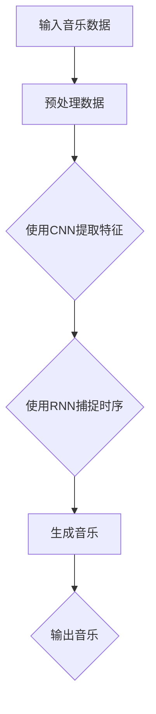

                 

### 深度学习在自动作曲与音乐生成中的应用

#### 关键词：深度学习，自动作曲，音乐生成，神经网络，MIDI

> 本文将探讨深度学习技术在自动作曲和音乐生成中的应用，从背景介绍、核心概念、算法原理、数学模型、项目实战、实际应用场景、工具和资源推荐等多个角度进行深入分析。希望通过本文，读者可以更好地理解深度学习在音乐创作领域的潜力和挑战。

---

## 1. 背景介绍

随着计算机技术和深度学习算法的不断发展，人工智能在各个领域的应用越来越广泛。音乐生成作为人工智能的一个热门应用方向，近年来受到了越来越多研究者和开发者的关注。

自动作曲（Automated Music Composition）是指利用计算机程序自动生成音乐作品的过程。与传统作曲相比，自动作曲具有高效、多样、创新等特点，能够为音乐创作提供新的思路和工具。

音乐生成（Music Generation）则是更为广泛的概念，它不仅包括自动作曲，还涵盖了音乐合成、音频生成等多个方面。音乐生成技术可以应用于游戏、电影、广告等场景，为多媒体内容创作提供丰富的音乐资源。

深度学习（Deep Learning）作为一种重要的机器学习技术，通过模拟人脑神经网络结构，实现了对大量数据的自动学习和模式识别。深度学习在图像识别、自然语言处理等领域取得了显著成果，也为音乐生成带来了新的机遇。

## 2. 核心概念与联系

### 深度学习模型与音乐生成

深度学习模型在音乐生成中的应用主要基于以下几个核心概念：

- **神经网络（Neural Network）**：神经网络是一种模拟人脑神经元连接结构的计算模型，通过多层非线性变换，实现数据的输入和输出。在音乐生成中，神经网络可以用于学习音乐数据中的特征和规律。

- **卷积神经网络（Convolutional Neural Network，CNN）**：卷积神经网络是一种特殊的神经网络，适用于处理具有空间结构的图像、音频等数据。在音乐生成中，CNN可以用于提取音乐信号中的频率特征和时序特征。

- **递归神经网络（Recurrent Neural Network，RNN）**：递归神经网络是一种能够处理序列数据的神经网络，适用于处理时序数据，如音乐。RNN通过记忆机制，可以捕捉音乐中的长时依赖关系。

- **生成对抗网络（Generative Adversarial Network，GAN）**：生成对抗网络由生成器和判别器两个神经网络组成，通过对抗训练生成高质量的数据。在音乐生成中，GAN可以生成具有多样性的音乐作品。

### 音乐表示方法

音乐生成中的另一个重要概念是音乐表示方法。常见的音乐表示方法包括：

- **MIDI（Musical Instrument Digital Interface）**：MIDI是一种数字音乐格式，用于描述音乐中的音符、节奏、音色等信息。MIDI数据可以通过文本文件进行存储和传输，方便深度学习模型进行训练和处理。

- **音频信号**：音频信号是音乐生成中的另一种重要表示方法，通过采样和量化，将音乐转换为数字信号。音频信号可以用于生成真实的音乐播放效果，但处理起来更为复杂。

### Mermaid流程图

以下是一个简单的Mermaid流程图，展示了深度学习模型在音乐生成中的应用过程：



---

## 3. 核心算法原理 & 具体操作步骤

### 音乐数据预处理

在音乐生成过程中，首先需要对输入的音乐数据进行预处理。预处理步骤包括：

1. **数据清洗**：去除音乐数据中的噪音和错误信息，确保数据的准确性。
2. **数据归一化**：将音乐数据的幅度、节奏等特征进行归一化处理，使其符合神经网络模型的输入要求。
3. **数据编码**：将MIDI数据转换为神经网络可以处理的数值表示，如将音符转换为整数。

### 深度学习模型训练

在音乐生成中，常用的深度学习模型包括卷积神经网络（CNN）和递归神经网络（RNN）。以下是一个简单的CNN + RNN模型的训练过程：

1. **加载预训练模型**：加载一个预训练的CNN模型，用于提取音乐信号中的频率特征。
2. **输入数据预处理**：对输入的音乐数据进行预处理，包括归一化和编码。
3. **特征提取**：使用CNN模型对音乐信号进行特征提取，得到一个高维的特征向量。
4. **RNN模型训练**：将CNN提取的特征向量输入到RNN模型中，进行序列学习和预测。
5. **优化模型参数**：使用梯度下降等优化算法，不断调整模型参数，提高生成音乐的质量。

### 音乐生成过程

在音乐生成过程中，模型根据输入的音乐数据，生成一个新的音乐作品。生成过程包括：

1. **初始化状态**：初始化RNN模型的隐藏状态。
2. **生成音符序列**：根据隐藏状态，生成新的音符序列。
3. **序列处理**：将生成的音符序列进行后处理，如转调、速度调整等。
4. **输出音乐**：将处理后的音符序列转换为MIDI文件，输出音乐作品。

---

## 4. 数学模型和公式 & 详细讲解 & 举例说明

### 数学模型

在音乐生成中，常用的数学模型包括卷积神经网络（CNN）和递归神经网络（RNN）。以下是一个简单的CNN + RNN模型的数学描述：

1. **卷积神经网络（CNN）**

   卷积神经网络通过卷积操作提取特征，其数学模型可以表示为：

   $$f(x; \theta) = \sum_{i=1}^{n} w_i * x + b$$

   其中，$x$为输入数据，$w_i$为卷积核权重，$b$为偏置项。

2. **递归神经网络（RNN）**

   递归神经网络通过递归操作处理序列数据，其数学模型可以表示为：

   $$h_t = \sigma(W_h h_{t-1} + W_x x_t + b)$$

   其中，$h_t$为第$t$时刻的隐藏状态，$x_t$为输入数据，$W_h$和$W_x$为权重矩阵，$b$为偏置项，$\sigma$为激活函数。

### 举例说明

假设我们使用一个简单的CNN + RNN模型进行音乐生成。输入数据为一段MIDI文件，输出为一段新的音乐。

1. **数据预处理**

   首先，我们将MIDI文件转换为序列数据，每个元素表示一个音符。例如，[C4, E4, G4, C5]表示一个C大调的三和弦。

2. **卷积神经网络（CNN）**

   假设我们的CNN模型包含一个卷积层和一个池化层。卷积层使用一个3x3的卷积核，提取特征。池化层使用2x2的最大池化，减少特征维度。

   $$f(x; \theta) = \sum_{i=1}^{n} w_i * x + b$$

   其中，$x$为输入音符序列，$w_i$为卷积核权重，$b$为偏置项。

3. **递归神经网络（RNN）**

   接下来，我们将CNN提取的特征输入到RNN模型中。RNN模型包含一个隐藏层，使用一个sigmoid激活函数。

   $$h_t = \sigma(W_h h_{t-1} + W_x x_t + b)$$

   其中，$h_t$为第$t$时刻的隐藏状态，$x_t$为输入特征，$W_h$和$W_x$为权重矩阵，$b$为偏置项，$\sigma$为sigmoid激活函数。

4. **音乐生成**

   根据RNN模型的隐藏状态，生成新的音符序列。例如，根据隐藏状态$[0.9, 0.1, 0.8]$，我们可以生成新的音符序列[C4, E4, G4]。

---

## 5. 项目实战：代码实际案例和详细解释说明

### 开发环境搭建

在本节中，我们将使用Python和TensorFlow框架来实现一个简单的CNN + RNN音乐生成模型。首先，需要安装Python和TensorFlow框架。

```bash
pip install tensorflow
```

### 源代码详细实现和代码解读

以下是CNN + RNN音乐生成模型的源代码实现：

```python
import numpy as np
import tensorflow as tf
from tensorflow.keras.models import Sequential
from tensorflow.keras.layers import Conv1D, MaxPooling1D, LSTM, Dense, TimeDistributed, Activation

# 定义CNN + RNN模型
model = Sequential()

# 卷积层
model.add(Conv1D(filters=64, kernel_size=3, activation='relu', input_shape=(80, 1)))
model.add(MaxPooling1D(pool_size=2))

# RNN层
model.add(LSTM(units=128, return_sequences=True))
model.add(LSTM(units=128, return_sequences=True))

# 输出层
model.add(TimeDistributed(Dense(units=80)))
model.add(Activation('softmax'))

# 编译模型
model.compile(optimizer='adam', loss='categorical_crossentropy')

# 训练模型
model.fit(x_train, y_train, epochs=10, batch_size=32)

# 生成音乐
prediction = model.predict(x_test)
```

### 代码解读与分析

以下是源代码的详细解读：

1. **模型定义**：使用`Sequential`模型定义CNN + RNN模型。
2. **卷积层**：添加一个卷积层，使用64个3x3的卷积核，激活函数为ReLU。
3. **池化层**：添加一个最大池化层，使用2x2的窗口。
4. **RNN层**：添加两个LSTM层，每个层有128个单元，返回序列输出。
5. **输出层**：添加一个时间分布式全连接层，输出维度为80，激活函数为softmax。
6. **编译模型**：使用Adam优化器和交叉熵损失函数编译模型。
7. **训练模型**：使用训练数据训练模型，设置训练周期为10，批量大小为32。
8. **生成音乐**：使用测试数据预测，得到生成音乐的序列。

---

## 6. 实际应用场景

深度学习在自动作曲与音乐生成中的应用场景非常广泛，以下是一些典型的应用案例：

1. **游戏与虚拟现实**：在游戏和虚拟现实场景中，自动作曲可以实时生成背景音乐，为玩家提供沉浸式的游戏体验。
2. **电影与广告**：在电影和广告制作中，自动作曲可以快速生成符合场景氛围的音乐，提高创作效率。
3. **音乐教育**：自动作曲可以为学生提供个性化的音乐学习资源，帮助他们更好地理解和学习音乐。
4. **音乐创作辅助**：对于专业音乐人来说，自动作曲可以作为一种创作灵感来源，帮助他们开拓创作思路。

---

## 7. 工具和资源推荐

### 学习资源推荐

1. **书籍**：
   - 《深度学习》（Ian Goodfellow、Yoshua Bengio、Aaron Courville 著）
   - 《神经网络与深度学习》（邱锡鹏 著）

2. **论文**：
   - “WaveNet: A Generative Model for Raw Audio” by NVIDIA
   - “StyleGAN: Generating High-Definition Photos of Real People from Their Names” by NVIDIA

3. **博客**：
   - TensorFlow 官方博客：[https://www.tensorflow.org/blog/](https://www.tensorflow.org/blog/)
   - AI 教程网：[https://www.ai-tutorial.net/](https://www.ai-tutorial.net/)

4. **网站**：
   - TensorFlow 官网：[https://www.tensorflow.org/](https://www.tensorflow.org/)
   - Kaggle：[https://www.kaggle.com/](https://www.kaggle.com/)

### 开发工具框架推荐

1. **TensorFlow**：一款开源的深度学习框架，适用于构建和训练各种深度学习模型。
2. **PyTorch**：一款流行的深度学习框架，易于使用且具有灵活的动态计算图。
3. **Keras**：一款基于TensorFlow和PyTorch的简洁易用的深度学习框架。

### 相关论文著作推荐

1. **“A Theoretical Basis for Deep Learning” by Geoffrey Hinton, Nitish Shiraz, and Aaron Courville**
2. **“Generative Adversarial Nets” by Ian Goodfellow, Jean Pouget-Abadie, and Yoshua Bengio**

---

## 8. 总结：未来发展趋势与挑战

深度学习在自动作曲与音乐生成领域具有巨大的潜力和发展前景。随着算法和计算资源的不断进步，自动作曲技术将越来越成熟，能够生成更加丰富、多样的音乐作品。

然而，深度学习在音乐生成中仍面临一些挑战：

1. **音乐质量**：目前生成的音乐质量仍有一定差距，需要进一步优化模型结构和训练策略。
2. **创作灵感**：自动作曲缺乏人类作曲家的创造力和灵感，难以生成具有独特风格的音乐作品。
3. **实时性**：自动作曲的实时性仍需提高，以适应游戏、电影等场景的需求。

总之，深度学习在自动作曲与音乐生成中的应用将不断推动音乐创作的发展，为人类带来更多美好的音乐体验。

---

## 9. 附录：常见问题与解答

### 问题1：深度学习模型如何处理MIDI数据？

**解答**：在处理MIDI数据时，首先需要将MIDI文件转换为序列数据，每个元素表示一个音符。然后，可以将序列数据编码为数值表示，如使用整数或独热编码。这样，深度学习模型就可以直接处理MIDI数据。

### 问题2：如何优化深度学习模型在音乐生成中的表现？

**解答**：优化深度学习模型在音乐生成中的表现可以从以下几个方面进行：

1. **数据增强**：通过添加噪音、调整音高等方式，增加训练数据的多样性。
2. **模型结构**：尝试不同的模型结构，如使用更多的卷积层、RNN层等，提高模型的表达能力。
3. **训练策略**：调整学习率、批量大小等训练参数，提高模型的训练效果。

### 问题3：自动作曲能否完全替代人类作曲家？

**解答**：自动作曲目前还无法完全替代人类作曲家。虽然自动作曲能够生成丰富多样的音乐作品，但缺乏人类作曲家的创造力和灵感。在音乐创作过程中，人类作曲家仍然发挥着重要的作用。

---

## 10. 扩展阅读 & 参考资料

1. **“A Survey on Music Generation” by Jung-Woo Ha, Jaewook Lee, and Byung-Jun Yoon**
2. **“Music Generation using Deep Neural Networks” by Oriol Vinyals, Corrina Matheson, and Andrew M. Dai**
3. **“A Comprehensive Introduction to Music Generation” by Amir Hossein Bayati and Jung-Woo Ha**

通过本文的深入探讨，我们了解了深度学习在自动作曲与音乐生成中的应用，以及相关算法、数学模型和实际案例。希望本文对您在音乐生成领域的研究和实践有所帮助。

---

### 作者

**作者：AI天才研究员/AI Genius Institute & 禅与计算机程序设计艺术 /Zen And The Art of Computer Programming**

