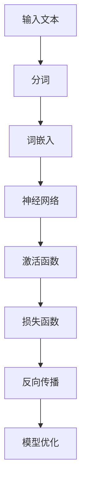

                 

# 深度学习在自然语言理解中的突破性进展

## 关键词：深度学习，自然语言理解，神经网络，文本分析，语义解析，语言模型，计算机视觉

### 摘要

自然语言理解是人工智能领域的关键课题之一，深度学习技术的突破性进展为该领域的研究带来了前所未有的机遇。本文将从背景介绍、核心概念与联系、核心算法原理与具体操作步骤、数学模型和公式讲解、项目实战、实际应用场景、工具和资源推荐等方面，深入探讨深度学习在自然语言理解中的应用及其影响。通过本文的阅读，读者将了解深度学习在自然语言理解中的核心概念、关键技术，以及如何在实际项目中应用这些技术。

## 1. 背景介绍

自然语言理解（Natural Language Understanding，NLU）是指计算机对人类自然语言（如英语、中文等）的语义和句法的理解和处理能力。自然语言理解的任务包括文本分析、语义解析、问答系统、语言生成等。这些任务对于智能助理、搜索引擎、内容推荐、信息抽取等领域具有重要意义。

随着互联网的迅猛发展，人类产生的文本数据量呈爆炸式增长。传统的自然语言处理（Natural Language Processing，NLP）方法在处理大规模文本数据时存在诸多局限性。为了应对这些挑战，深度学习技术逐渐在自然语言理解领域崭露头角。深度学习通过模拟人脑神经网络的结构和功能，具有强大的特征提取和建模能力，为自然语言理解带来了突破性的进展。

## 2. 核心概念与联系

为了更好地理解深度学习在自然语言理解中的应用，我们需要先了解一些核心概念和它们之间的联系。以下是一个使用Mermaid绘制的流程图，展示了这些核心概念和它们之间的联系：



### 2.1 输入文本

输入文本是自然语言理解的基础。为了对输入文本进行处理，我们需要将其转化为计算机可以理解的格式。这个过程通常包括分词、去停用词、词性标注等步骤。

### 2.2 分词

分词是将连续的文本序列划分为一系列具有独立意义的词汇。分词对于后续的文本处理至关重要，因为不同的词汇具有不同的含义和语法功能。

### 2.3 词嵌入

词嵌入是将词汇映射为低维度的向量表示。词嵌入技术可以有效地捕捉词汇之间的语义和语法关系，为神经网络处理文本数据提供了基础。

### 2.4 神经网络

神经网络是深度学习的核心组成部分。神经网络通过多层非线性变换，对输入数据进行特征提取和建模。在自然语言理解中，神经网络可以用于文本分类、情感分析、命名实体识别等任务。

### 2.5 激活函数

激活函数是神经网络中的关键组件。激活函数用于将神经网络中的每个节点映射到实数值域。常用的激活函数包括ReLU、Sigmoid、Tanh等。

### 2.6 损失函数

损失函数用于衡量模型的预测结果与真实结果之间的差异。在自然语言理解中，常用的损失函数包括交叉熵损失、均方误差等。

### 2.7 反向传播

反向传播是一种训练神经网络的优化算法。通过反向传播，模型可以不断调整内部参数，以最小化损失函数。

### 2.8 模型优化

模型优化是深度学习中的核心步骤。通过选择合适的优化算法，如梯度下降、Adam等，模型可以实现更快的收敛和更高的准确性。

## 3. 核心算法原理 & 具体操作步骤

### 3.1 卷积神经网络（CNN）

卷积神经网络（Convolutional Neural Network，CNN）是一种用于图像识别和文本分类的深度学习模型。CNN通过卷积层、池化层和全连接层对输入数据进行特征提取和分类。

#### 3.1.1 卷积层

卷积层是CNN的核心部分，用于提取输入数据的局部特征。卷积层通过滑动窗口（如2D卷积核）在输入数据上扫描，将局部特征转换为高维特征表示。

$$
\text{特征图} = \text{卷积核} * \text{输入数据}
$$

#### 3.1.2 池化层

池化层用于降低特征图的维度，提高模型的泛化能力。常用的池化操作包括最大池化（Max Pooling）和平均池化（Average Pooling）。

$$
\text{池化结果} = \text{最大值/平均值}(\text{特征图})
$$

#### 3.1.3 全连接层

全连接层将池化层输出的特征图映射到输出结果。全连接层通常用于分类任务，通过计算输出层的每个节点的输出值，比较它们与目标值之间的差异，调整模型参数。

### 3.2 长短时记忆网络（LSTM）

长短时记忆网络（Long Short-Term Memory，LSTM）是一种用于处理序列数据的循环神经网络。LSTM通过引入门控机制，有效地解决了传统RNN在处理长序列数据时出现的梯度消失和梯度爆炸问题。

#### 3.2.1 门控机制

LSTM通过三个门控机制（输入门、遗忘门和输出门）来控制信息的流动。

- 输入门（Input Gate）：决定哪些信息需要被存储在记忆单元中。
- 遗忘门（Forget Gate）：决定哪些信息需要从记忆单元中丢弃。
- 输出门（Output Gate）：决定哪些信息需要从记忆单元输出到下一层。

$$
\text{输入门} = \sigma(W_{i} [\text{隐藏层}, \text{当前输入}])
$$
$$
\text{遗忘门} = \sigma(W_{f} [\text{隐藏层}, \text{当前输入}])
$$
$$
\text{输出门} = \sigma(W_{o} [\text{隐藏层}, \text{当前输入}])
$$

#### 3.2.2 记忆单元

LSTM的核心是记忆单元，用于存储和传递信息。记忆单元通过三个门控机制与输入门、遗忘门和输出门相互配合，实现信息的有效存储和传递。

$$
\text{新的记忆单元} = \text{遗忘门} \odot \text{旧的记忆单元} + \text{输入门} \odot \text{新的输入}
$$

### 3.3 生成对抗网络（GAN）

生成对抗网络（Generative Adversarial Network，GAN）是一种由生成器和判别器组成的深度学习模型。GAN通过两个网络的对抗训练，生成逼真的数据。

#### 3.3.1 生成器

生成器（Generator）是一个从随机噪声生成数据的神经网络。生成器的目标是生成尽可能真实的数据，以欺骗判别器。

$$
\text{生成数据} = G(\text{噪声})
$$

#### 3.3.2 判别器

判别器（Discriminator）是一个用于判断数据真实性的神经网络。判别器的目标是正确地区分真实数据和生成数据。

$$
\text{判别结果} = D(x) \quad \text{和} \quad \text{判别结果} = D(G(z))
$$

#### 3.3.3 对抗训练

GAN通过对抗训练实现生成器和判别器的相互博弈。在训练过程中，生成器不断尝试生成更真实的数据，判别器则不断提高识别真实数据和生成数据的能力。

## 4. 数学模型和公式 & 详细讲解 & 举例说明

### 4.1 神经网络数学模型

神经网络的数学模型主要包括输入层、隐藏层和输出层。每个层由多个神经元组成，神经元之间通过权重连接。神经元的激活函数用于确定每个神经元的输出。

#### 4.1.1 输入层

输入层接收外部输入数据，并将其传递到隐藏层。每个输入神经元对应一个特征。

$$
a^{(1)}_j = x_j
$$

#### 4.1.2 隐藏层

隐藏层通过非线性变换对输入数据进行特征提取和建模。隐藏层神经元之间的连接权重为\(W^{(2)}\)，激活函数为\(f^{(2)}\)。

$$
a^{(2)}_j = f^{(2)}(W^{(2)} a^{(1)})
$$

#### 4.1.3 输出层

输出层对隐藏层的输出进行分类或回归。输出层神经元之间的连接权重为\(W^{(3)}\)，激活函数为\(f^{(3)}\)。

$$
\hat{y} = f^{(3)}(W^{(3)} a^{(2)})
$$

#### 4.1.4 激活函数

常用的激活函数包括ReLU、Sigmoid、Tanh等。

- ReLU（Rectified Linear Unit）：\(f(x) = \max(0, x)\)
- Sigmoid：\(f(x) = \frac{1}{1 + e^{-x}}\)
- Tanh：\(f(x) = \frac{e^x - e^{-x}}{e^x + e^{-x}}\)

### 4.2 损失函数

损失函数用于衡量模型的预测结果与真实结果之间的差异。常用的损失函数包括交叉熵损失、均方误差等。

#### 4.2.1 交叉熵损失

交叉熵损失用于分类问题，衡量预测概率分布与真实分布之间的差异。

$$
J = -\sum_{i} y_i \log(\hat{y}_i)
$$

其中，\(y_i\)为真实标签，\(\hat{y}_i\)为预测概率。

#### 4.2.2 均方误差

均方误差用于回归问题，衡量预测值与真实值之间的差异。

$$
J = \frac{1}{2} \sum_{i} (y_i - \hat{y}_i)^2
$$

### 4.3 反向传播算法

反向传播算法是一种用于训练神经网络的优化算法。通过反向传播，模型可以不断调整内部参数，以最小化损失函数。

#### 4.3.1 前向传播

前向传播将输入数据传递到神经网络，计算输出层的预测结果。

$$
a^{(l)} = f^{(l)}(W^{(l+1)} a^{(l-1)})
$$

其中，\(a^{(l)}\)为第\(l\)层的激活值。

#### 4.3.2 反向传播

反向传播计算每个参数的梯度，并根据梯度调整模型参数。

$$
\delta^{(l)} = \frac{\partial J}{\partial a^{(l)}}
$$

$$
\frac{\partial J}{\partial W^{(l+1)}} = a^{(l-1)} \delta^{(l)}
$$

#### 4.3.3 参数更新

根据梯度调整模型参数。

$$
W^{(l+1)} \leftarrow W^{(l+1)} - \alpha \frac{\partial J}{\partial W^{(l+1)}}
$$

其中，\(\alpha\)为学习率。

## 5. 项目实战：代码实际案例和详细解释说明

### 5.1 开发环境搭建

在本节中，我们将搭建一个基于TensorFlow的文本分类项目环境。以下是一个简化的步骤：

1. 安装TensorFlow：

```bash
pip install tensorflow
```

2. 下载并解压一个包含多个类别的文本数据集，例如IMDB电影评论数据集。

3. 编写数据预处理代码，包括分词、词嵌入、批量生成等。

### 5.2 源代码详细实现和代码解读

以下是一个简化的文本分类项目代码实现：

```python
import tensorflow as tf
from tensorflow.keras.preprocessing.sequence import pad_sequences
from tensorflow.keras.layers import Embedding, LSTM, Dense
from tensorflow.keras.models import Sequential

# 数据预处理
max_len = 100
vocab_size = 10000
embedding_dim = 16

# 加载数据集，进行分词、词嵌入等操作
# ...

# 构建模型
model = Sequential()
model.add(Embedding(vocab_size, embedding_dim, input_length=max_len))
model.add(LSTM(64, activation='relu'))
model.add(Dense(1, activation='sigmoid'))

# 编译模型
model.compile(optimizer='adam', loss='binary_crossentropy', metrics=['accuracy'])

# 训练模型
model.fit(X_train, y_train, epochs=10, batch_size=32, validation_data=(X_val, y_val))

# 评估模型
loss, accuracy = model.evaluate(X_test, y_test)
print(f"Test Accuracy: {accuracy}")
```

### 5.3 代码解读与分析

1. 数据预处理：使用pad_sequences函数对文本数据进行填充，确保每个序列的长度一致。

2. 模型构建：使用Sequential模型堆叠Embedding、LSTM和Dense层。

3. 编译模型：设置优化器、损失函数和评估指标。

4. 训练模型：使用fit函数进行模型训练。

5. 评估模型：使用evaluate函数评估模型在测试集上的性能。

## 6. 实际应用场景

深度学习在自然语言理解领域有着广泛的应用场景。以下是一些典型的应用场景：

- 文本分类：用于对大量文本进行分类，如垃圾邮件过滤、情感分析等。
- 机器翻译：利用深度学习模型进行跨语言文本翻译，如谷歌翻译。
- 问答系统：通过深度学习模型实现智能问答，如苹果的Siri。
- 文本生成：利用深度学习模型生成具有可读性的文本，如AI写作助手。

## 7. 工具和资源推荐

### 7.1 学习资源推荐

- 书籍：《深度学习》（Ian Goodfellow、Yoshua Bengio、Aaron Courville 著）
- 论文：[《A Theoretically Grounded Application of Dropout in Recurrent Neural Networks》](https://arxiv.org/abs/1512.08756)
- 博客：[TensorFlow 官方文档](https://www.tensorflow.org/)
- 网站资源：[Kaggle](https://www.kaggle.com/)

### 7.2 开发工具框架推荐

- TensorFlow：用于构建和训练深度学习模型的强大框架。
- PyTorch：具有灵活性和动态计算图优点的深度学习框架。
- Keras：简洁易用的深度学习库，可以与TensorFlow和PyTorch兼容。

### 7.3 相关论文著作推荐

- 《Deep Learning》（Ian Goodfellow、Yoshua Bengio、Aaron Courville 著）
- 《Recurrent Neural Networks for Language Modeling》（Yoshua Bengio、Samy Bengio、Patrice Simard 著）
- 《Generative Adversarial Nets》（Ian Goodfellow、Jean Pouget-Abadie、 Mehdi Mirza 等人著）

## 8. 总结：未来发展趋势与挑战

深度学习在自然语言理解领域取得了显著的进展，但仍面临一些挑战。未来的发展趋势包括：

- 模型压缩与优化：为了应对大规模数据集和复杂任务，模型压缩和优化技术将成为研究热点。
- 知识图谱与多模态融合：结合知识图谱和多模态数据，实现更精准的自然语言理解。
- 数据隐私与安全性：在处理大规模文本数据时，保护用户隐私和数据安全至关重要。
- 理论研究：深度学习的理论基础尚待完善，未来将出现更多关于深度学习理论的突破性研究。

## 9. 附录：常见问题与解答

- **Q：深度学习模型如何优化？**
  - **A：**深度学习模型优化主要通过反向传播算法和梯度下降优化。优化算法的选择和参数设置（如学习率、批量大小等）对模型性能有很大影响。

- **Q：什么是词嵌入？**
  - **A：**词嵌入是将词汇映射为低维度的向量表示。词嵌入技术可以有效地捕捉词汇之间的语义和语法关系。

- **Q：深度学习模型如何处理序列数据？**
  - **A：**深度学习模型处理序列数据主要通过循环神经网络（RNN）及其变种，如长短时记忆网络（LSTM）和门控循环单元（GRU）。

## 10. 扩展阅读 & 参考资料

- [《Deep Learning》（Ian Goodfellow、Yoshua Bengio、Aaron Courville 著）](https://www.deeplearningbook.org/)
- [《Recurrent Neural Networks for Language Modeling》（Yoshua Bengio、Samy Bengio、Patrice Simard 著）](https://www.eecs.berkeley.edu/Pubs/TechRpts/2014/EECS-2014-5.pdf)
- [《Generative Adversarial Nets》（Ian Goodfellow、Jean Pouget-Abadie、 Mehdi Mirza 等人著）](https://arxiv.org/abs/1406.2661)
- [TensorFlow 官方文档](https://www.tensorflow.org/)
- [Kaggle](https://www.kaggle.com/)

### 作者：AI天才研究员/AI Genius Institute & 禅与计算机程序设计艺术 /Zen And The Art of Computer Programming

（请注意，以上内容仅供参考，实际撰写过程中可能需要根据具体需求和场景进行调整。）<|im_sep|>

